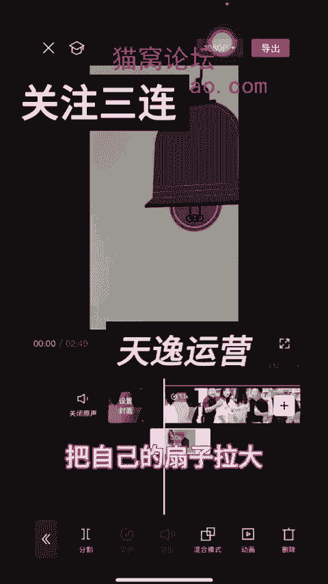

# 【2024版视频号运营教程】全B站最良心的视频号运营高阶教程合集！起号真的不难！ - P35：21-日销34万营业额小王剪辑法_1 - 视频号教程9 - BV1pFyPYvEXU

嗯，姐妹们，我给大家讲的视频的剪辑的视频就是那个去好水印的水印我们都会去，对吧？因为小叶老师老师的话，群里都有讲去好水印的这个视频，我是这个视频。现在就是因为那个这个视频我就给大家看一下。

拿到视频的时候，就是导入进来的时候，我首先就是给它那个放大一点，这样子放大一点点，嗯不会放的很大，我就是这样放大一点点，然后呢给他就是呃放大一点点，然后再给他去插头去尾，就是这样子给他来回这样缩放。

知道吗？来回这样子弄。这样子，然后给他去呃这样子去截掉一点，掐头去尾截掉一点啊。这样子用手这样子放大，因为有的姐妹给我们录制视频，她们是录制的，我现在是用一个手拍着的啊。这样子去掉一点。去掉一点。

然后再给它缩缩一下啊。嗯，掐头去尾一样，刚才说就是给它放大，第一步给它放大，然后第二步给它掐头去尾。这个步骤其实弄反也没事，然后再给它变速。变速的话，我一般是就是1。1倍变速变一下，变速变一下以后呢。

我们要去找广告了。这个剧情我下载下来的是嗯，看人家是嗯直播广场，人家报单的啊，人家报单这个广告是加在哪个地方。他广告我们看他这个地方就是广告了。他原来是我现在要卖的是那个卖那个榨菜啊。

他们原来这款广告是那个卖的是沙琪玛，那我就是不是要把这个沙琪玛改成我这个榨菜，对吧？那广告我知道哪里加了啊，就是原剧情，他我剧情的话就是直播广场找的直播广场。我昨天看好有一个有一个姐妹报的挺多。

就她啊不知道今天今天没有了，所以说她的剧情我都是提早就是提早导入出来啊，加到这个地方。但是我也知道了，他这广告是加在哪里。有时候不知道的情况下，你可以拿手机录制一下，看人家广告是加在哪里的。

它是夹在这个地方，这个地方就是等一下变成榨菜了啊。就是我们店的。他的广告从哪个地方出来？从这个地方要出来了，你可以给它拉大一点。拉大一点。你看是不是这个地方出来，那我们是不是要东西给挡住。

是不是这里你分割一下啊，分割一下。再缩放回来，这是我们的沙琪玛啊。广告我们要首先都知道了的。他在吃的过程他是不要的啊，他不要我们也不要啊。因为报单的人家具体你这个地方都是没有的。

因为这个地方在介绍人家的沙琪嘛，我们不需要啊。不需要我们给它放大。放大这个地方，把这部分裁剪掉就行了啊，把这部分不要。放大。这部分是不不需要的，不需要我们给它拆剪掉。这是不是还有点闪屏，我们给他弄掉。

这部分是不需要，其实我我剪辑我感觉挺简单的。好，这里再介绍这个了，我们也不需要。再给它放大放大从这个地方。把这里都截掉，这里都截掉，他在吃这个我们不需要了。这个都截掉都不要。😔，那当然了，这个也不需要。

跟我们的剧情广告是不一样的，这这里可以方干净方便携带。那这个可以有这个给它留着的，前面这里都解掉就可以了。截掉看一下啊，有没有截错，看一下。对，没错啊。好，我们下一步下一步我们来要加广告，就是怎么去加。

是不是知道广告价在哪里了，对吧？但是呢他这个地方他说这是我们新这是我们水果，不是说的是他们的广告，是不是他们的水果奶盖，我就把这个地方裁剪掉了，我又给他分割了一下啊。这是我们店的水果奶盖沙棘吗？

这个地方再个放大一点啊，再个放大一点。水果奶开沙琪玛？能该是这个地方给它分的啊。沙琪玛要沙琪玛不要沙琪玛了。你欢哪个下期？新品水果奶胶这是我们的新品就行了，不要水果奶干沙琪嘛。

因为我们的新品是下菜我们先。是我们店的新皮料，我们先吃一点，对，这是我们店的新品，要不你先吃一点。你看这个是我们店的新皮料，我们先吃一点，稍等一下。那行吧，你快点啊啊。

我们现在用那个东西来遮挡起来了后因为我们的广告卖的是榨菜啊，然画中画添加画中画添加榨菜，这些图片都要提早找好的啊？嗯它从这个地方位置出来了，是不是到哪里，这里你看从这个地方都是在在假示沙琪玛。

是不是都有沙琪玛，这画面出来，对吧？好，我们这里选中啊，这里选中这里选中然这里有个加号这个地方抽一下啊，然后这样子的话就是这个这个图片就是榨菜的图片会跟着我们的画面走动啊，也会移动的，你慢慢的移啊。😊。

但是不就是把把里面的那个原来剧情里的那个广告那个产品给挡住啊。给它挡住，不挡住的话就是。我们要做的话，就把它做刀给它挡住啊，这样子去挡住。导致我们看一下啊。🎼这个是我们店的新品料，我们先吃一点。

稍等一下，那行吧，你快点啊，不行，做的时候，你看这个广告里就是这里一点点啊，不要给它露出来。原原来的沙琪玛都得要去挡住。这点做的时候要做细致一点。因为我之前报的木耳，它也是这样的剧情。

也是就是原来它是一个嗯硫磺沐浴露的广告，然后就是给它那个原来的广告，我们变成自己的木耳就行了。也是这种操作方法，操作步骤是一样的。老吧，你快点啊。🎼先生也稍等一下，那行吧，你快点。😡，🎼哎。

要不这点这个是我们店的新品比料，我们先吃一点，稍等一下。那行吧，你快点。😡，哎酒瓶好，这里的话窗花已经加好了，这广告已经加完了，是不是广告已经加完了，这里是不是还有刷几嘛？那我们不管它的。

我们后面它这些广告是加在这里的啊。😊，🎼哎。😮，好，这里。啊，剧情广告是加在这个地方啊。爆单的广告它是加在这个地方，它是三个榨菜。然后我们也这样子，这个大家就是你你卖什么产品，你就加什么广告。

我加广告的时间，我现在是随便给弄了啊，我没有广告，我没我还没有做好，都是只现在是这样子4个吧，时间我基本上时间都是控制在1分钟40秒或者30秒左右的啊。加广告的时候呢，我们这样子加进去的时候啊。

🎼这个茯林榨菜。😡，他讲的是榨菜，是不是？然后为了叠换弄一下叠话，我说弄的是啥这个盘啊。

🎼这个福利榨也太啥的都好吃。这个去皮广告就是自己找网上找的时候，人家用什么广告，咱也用什么广告就行了。但是他们抖音上的广告不都是这样子吗？就是说的人不一样，他就是拍的拍这广告的人不同。

他就是内容里面的文案，就是内容都一样的嘛？所以说我们可以去换一下。比如说这个女的她在讲解的，是不是那我们可以去抖音上找一个别的另外一个女的讲解的就行了啊。这广告是不是加了我加了几段广告，加了4个。

反正我的广告时间都是在1分钟30秒，或者1分钟40秒这样子的。😡。

好，这里讲完了是不是好？下面又出现了这个这个的广告，沙琪玛原来沙琪玛的那个了，是不是？那我们还是加画中画啊，还是加画中画。

画中画加进去还是跟刚才方法一样的，就是这样子先给它拉大吧，拉到这个地方看这个位置啊。吓。点一下。点一下抽针这个地方抽一下啊，啊，这个位置给它挡住啊，挡住。一点点了一点点辣给这样挡住呀，这里出来了啊。

放大一点。这个给它放大一点，用手去给它放大一点。放大一点，就是原来的剧型把它露出来29。9块还可以包装到家呢。你要是喜欢吃的话，这些都送给你了。那还挺划算的，这里不行啊，这个地方还有一点露出的。

反正不要给它露出来啊，把这个这子弄大，不要给它露出来。小儿都可以吃。现在29。9块还可以包装到家呢。你要是喜欢吃的话，这些都送给你吧。那还挺划算的，都不行，这个地方还是不行。🎼现在29。

9块还没包送到家呢，你要是喜欢吃的话，这些都送给你了。反正这个地方大家弄的时候就是弄的细致一点，就是给它那个呃再拉动一下就行了。😊，感觉拉的没有不到位。用这里还以露出来是吧，原来个刷起来露出。

不要给它露出来。我还没包装到家呢，你要是喜欢吃的话，这些都送给你吧。那还挺划算的，那挺划算的它是不是这样子就好了？😊，这车子往前面拉一下。不好，姐姐都送给你了，那还挺划算的。

这个我我没有这个画面没有弄好，大家可以就按照刚才那个方法，就是自己再调一下。我想很多姐妹都会的。因为我们群里课程里面很多讲过，就是这样子。

那还挺划算的。挺划算的警察，你不把它包围了，你们走不掉了。😡，这是不是广告都加好了，所有广告也加好了，原来的广告画面是不是也都挡住了。那现在我们开始弄什么，就是刚才是不是这里分割过的了。

是不是这一段时我会给他那个移动一下，就是左右移动，正再给它放大，刚才也放大，现在再放大一点点啊，放大一点点。其实。😔，一往，然后呢往左边这样子左边去一点点。

然后后面的后面这个这个广告。再给它放大一点，这个是往右边这样子去一点点，然后中间这些广告呢，我也会给它放大啊，这个我是随意性的放大。因为我觉得剪辑手法都差不多，这样再给它放大一点。这样子给它放大一点。

这里也给它放一下。嗯，有的姐妹呢还会再再说给她再这个编辑一下，我是没有编辑，我嫌麻烦没有编辑。这样子好了以后呢，后面加着贴纸，贴纸我就是往下面拉，这样子贴纸。贴纸该缩小，然后角落里放横角落的啊。

看基本上是看不出来，我不喜欢露出来，给它拉到底就行了。贴纸拉到底。贴纸拉到的4个贴纸，我是复制的，复制4个贴纸，每个角落里一个。每个角落里一个。然后画中画画妆画我都是用自己的自拍。

就是拍一些家里的一些素材，或者有时候把在自己的把自己的上子拉大铺满，然后混合模式叠加，叠加这个到二或者3或者反正5以内。他是不是画妆画，这里只能弄一半，我我不管他了，我是这子，我后面就是又只弄了一个。

重新载了一个画妆画，因为刚才那个画妆画里面我不是弄了那个嘛榨菜嘛，对吧？正片叠滴。

这样的。再来一遍。这子是不是全部铺满了，这个是一个画中花。然后滤镜的话，滤镜我是随意性的弄的，滤镜我也是弄了一个啊，这个这个是不是滤镜啊，这个特效特效我也是有弄了。画面特效。

🎼不要弄VIP的作用对小示作用最。滤镜我就呃这个特效我就弄了一个。然后人物特效人物特效我是没有弄啊，然后这里的滤镜。滤镜我是用那个呃。这里我是随意性的弄一个的，就是弄最新的这种吧。弄一个。

然后还有什么东西啊？还有这个调节调节能点的，基本我都是5以内。其实这些我们课程上都有的。5以内。什么色调这些我都有调能调的。因为我以经听过好多课程，他们有的姐妹都调的，他们也是有大包的，他们都是这样子。

就都有调过的，哪怕给它全拉到底铺满，拉到底就行了。我没有开VIP，所以只能这样子慢慢拉。

那到底以后比例的话，9比16，然后背景是这样子，背景我我这样子随随意选择一个，随意选择一个，然后要全局应用全局应用，然后我这样子就给它导录出来了。

就这样子直接导入出来，我就这样子弄的，直接给它导入。

