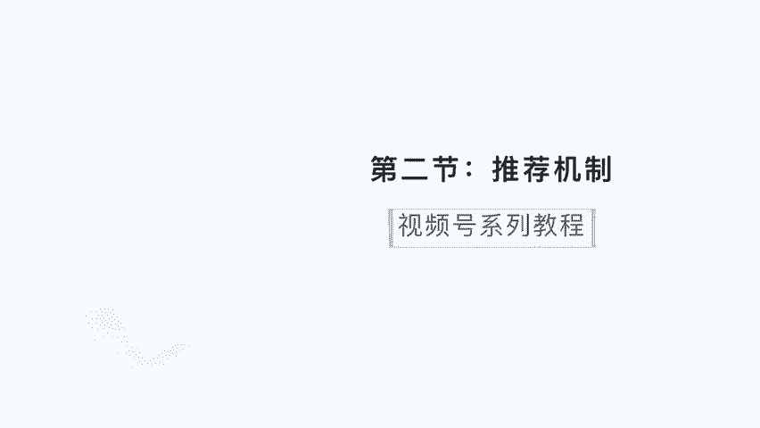
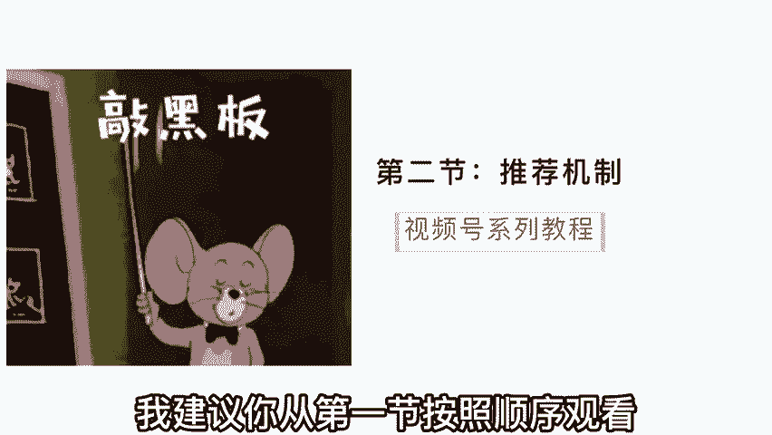
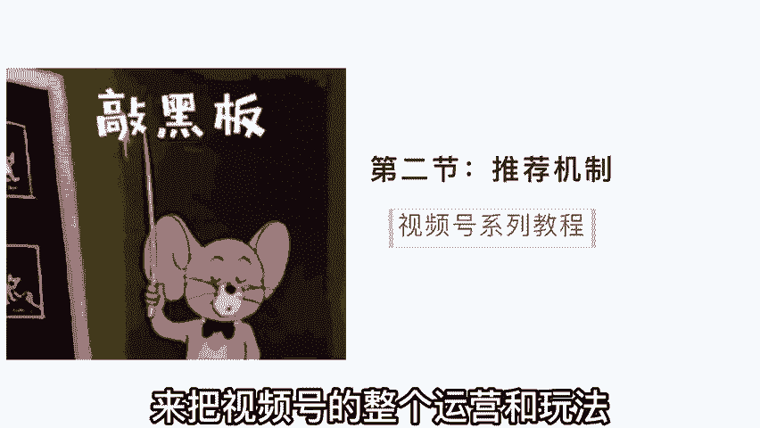
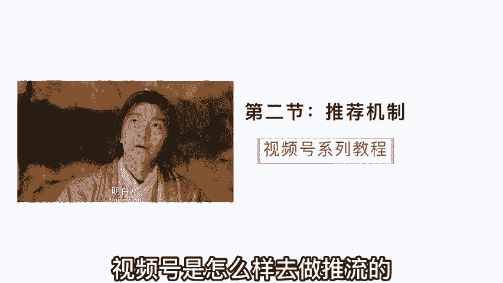
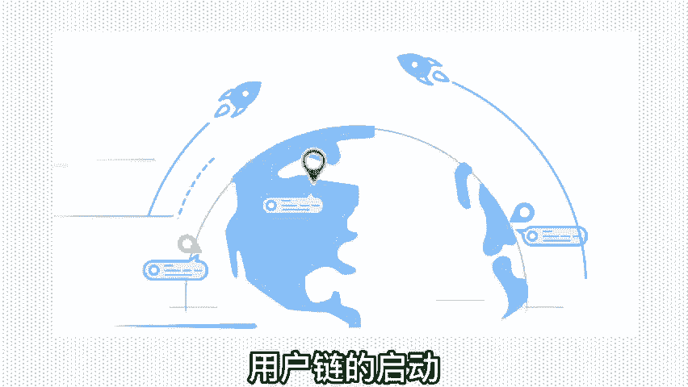
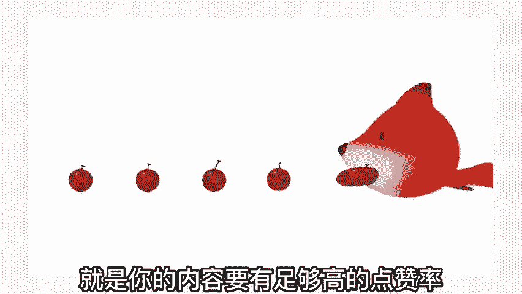
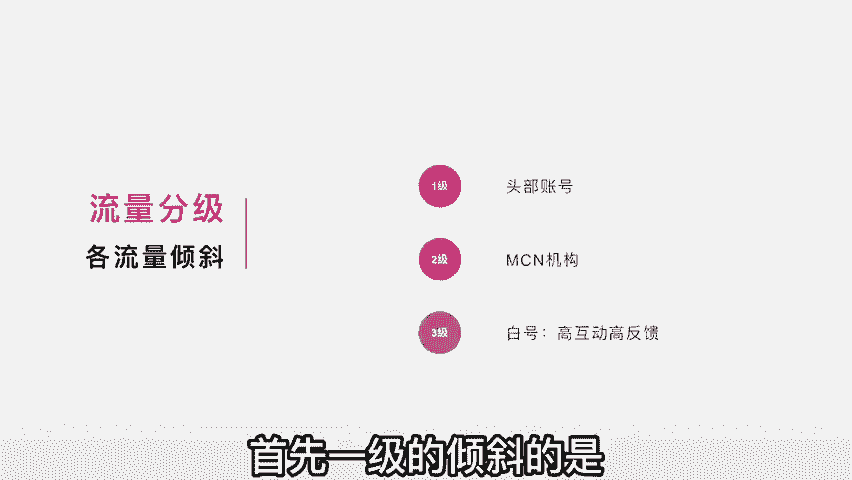
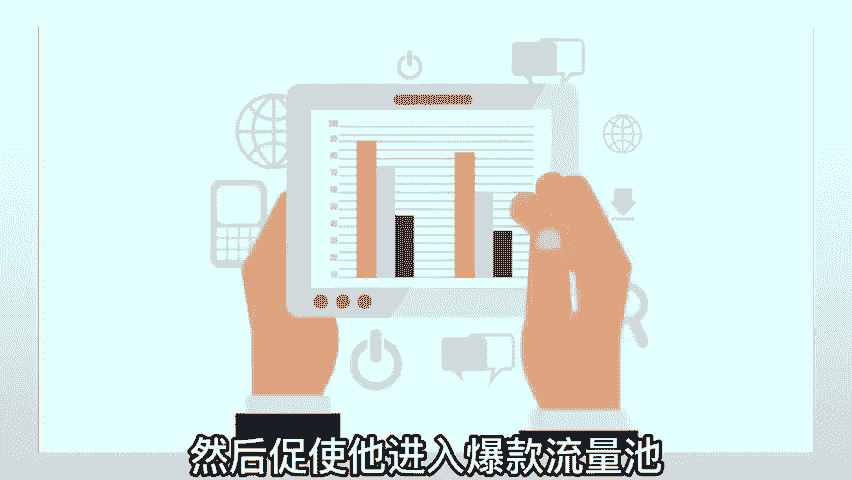

# 【2024版视频号运营教程】全B站最良心的视频号运营高阶教程合集！起号真的不难！ - P3：第二节：解剖推荐机制~ - 方块太神秘 - BV1hY2CYAE9i

视频号怎么做？今天来到了第二节。如果你是空降的这节的话，我建议你从第一节按照顺序观看。我一共会出五节的教程来把视频号的整个运营和玩法给它讲通透。今天呢我们能讲推荐机制。

推荐机制的话和抖音有不一样的呃一些推流方式啊。所以我希望大家能够充分的理解视频号是怎么样去做推流的，千万不要拿抖音的那套推荐逻辑用来放在视频号上面。因为呢在之前啊我也看过有很多人在做视频号的培训。

而且呢我也花了不少钱去听一些课。但实际上听得反馈非常差，有很多人甚至直接把抖音的那一套换成视频号直接开讲，实际上这是误导人的，特别是在这个底层逻辑，误导性非常非常强。一旦从这块走岔了道。

那么在之后啊基本上就是一步错步步错。那推荐机制是怎么回事呢？首先啊视频号它的推荐机制与抖音不同的是，它是基于社交链。

做强启动的什么叫社交链呢？打个比方啊，现在呢你看到了一个视频，然后你点赞了这个视频，点赞之后呢，你的好友的那个栏都会看到你所点赞的视频内容。你看这点和抖音就有很大的区别了，对吧？抖音这块的话呢。

你把你自己喜欢的那一个栏给它关掉，你点赞啊，个人的隐私比较重，别人呢也看不到，对吧？也不可能分发给你的朋友，但是视频号不一样，为什么说他基于社交链启动，就是因为在视频号里面，你点赞了我的视频。

这样呢你所有的好友都知道你点了这个视频，并且这个视频会推送到你的好友那一面，就开始循环的做了社交链用户链的启动。所以我们可以把它理解成三个板块。第一，初始用户的能启动，打个比方，你看到了我的视频。

你是我的。

初始用户，你看到这张视频之后，你觉得哎这个视频讲的非常不错，非常认可，你觉得挺好的。你可能会产生转发点赞这样的一个动作。一旦你点赞，那你的好友都会看到我这个视频，然后点赞之后呢就会辐射一环社交圈。

你的好友看到这张视频觉得又很不错，你的好友点赞了，这样你好友的好友哎也会看到这个视频推送到更大的一个外环圈里面去了。所以你看看他基于一个点的社交来做延伸，然后无限延伸。

当然这里有一个前提就是你的内容要有足够高的点赞率，观众要认可啊。在这个认可这块的话，待会儿我会重点来讲一讲。当然了，他做这个推荐机，制的目的是干嘛呢？是为了启动初始的流量，然后进入更大的一个公益推荐。

在第一节的时候呢，我们讲到他的具体属性啊，我们也知道这个平台呢是偏向于。

私域型的平台的。所以如果只是在一个私域的一个池塘里面转是没有太大意义的，都是那些人看，对吧？所以你看当这个用户的一个数值达到某一个阈值之后，这个阈值的话，根据不同的领域，它的体量是不一样的啊，打个比方。

我是属于知识博主。我这种内容呢，我的这个阈值是拥有啊200次点赞，然后辐射到2000次人观看，这是一个阈值，达到这个阈值之后呢，平台会认定这个内容是属于比较不错，比较优质的内容。

他会把我的内容放到公寓的一个池子里面，就会有很多的陌生人都能够接到这样的内容推送，所以它的一个初始启动是从初始的用户做能启动。点赞后辐射一环的社交圈，然后来做内容的反馈判定，达到一个阈值之后呢。

他会进入一个公域流量。所以你在刷视频的时候，你一定会发现有很多的视频是你的好。有点赞的推给了你，对吧？但是呢还有很多视频啊，是你的好友，也没点赞，就是官方推给你的这个就是纯公寓。

你要理解它的推荐机制就是两个推荐机制结合。一个是有你的好友啊，由社交链来启动，然后再加上纯公寓的推荐，这两者在推荐机制里面是有很强的关联的。说到这儿呢，大家没有那么从理解，对吧？有点绕啊，呃。

我在简单的来去做一个解剖。我们可以把这个流量分为一级流量和二级流量啊，从一级辐射到二级的传播。什么叫一级流量呢？就是比如说我的这个号里面有一万个粉丝，这1万个粉丝就属于一级流量，当我的内容发布之后呢。

就会推送给这1万个粉丝。那这1万个粉丝，有的粉丝会点赞，有的粉丝会转发。你看他们在所做的互动的动作就会引入到二级流量。比如。说他点赞之后，他的好友就看到了。哎，你看好友就是属于二级流量，他的好友在点赞。

他的好友的好友又看到了他好友的好友又点赞他的好友的好友好友又看到了，所以是通过一级的辐射加二级的传播，这样去蔓延开来的。刚刚听的有点绕啊，但是我相信你听到这里大概的明白他的整个推荐逻辑。

推荐机制是怎么样的啊，我们再回到内容层面，运营的层面来看待这个事儿，要想做出爆款，有一个很关键的点，就是点赞转发的这么一个动作。而且呢平台也会根据用户的反馈来决定这个内容会不会进入更大的一个公寓流量池。

那用户的反馈有哪一些呢？首先排在第一个的一定是点赞和转发率。刚刚我们讲到了点赞的重要性，一旦点赞，那么他的好友都会受到推送啊，这个权重是非常非常高的。第二个呢就是内容的完播率啊，这个我就不多提了。

因为大家。做抖音都知道玩播率什么意思。第三个呢是内容的互动率，互动率的话主要是在于评论和关注这块。你看这是一个用户反馈进入爆款流量池的一个阶段。但是要想要获得点赞高的转发高的啊，达到这样的一个阈知。

是需要有很强的内容来做驱动的。你想想看，当你的观众看到你内容的时候，他为什么会点赞呢？你的点赞触及了他哪一个点，以为我们在做视频号里面的经验来说啊，有一个很关键很关键的点。

对于点赞的促进来说是非常有用的。就是动情促进高互动，更易催生出爆款，什么叫动情呢？这个情啊有很多，比如说感动之情。我们看到一个做扶贫的，或者是一个做公益的，哇，他所说的一些行为，让人特别感动，对吧？

或者是那种父母对孩子的爱，让人很感动，或者是子女对父母的那种关心的。爱意很感动以及夫妻之情的这种爱，让人很感动。你看感动之情，容易击破人的心理防线，然后呢他就会产生点赞，产生高互动这样的一个行为。

当然了除了感动之情，还有很多的情啊，比如说骄傲之情。比方说咱们中国崛起啊，不再像以前那哇高铁各个基建做的非常棒，非常好，这让人振奋人心，让我感觉到特别的骄傲，哎，你看骄傲之情也是促进我们进行点赞。

进行高互动的内容。还有什么呢？还有感性之情，对吧？比如说一个女性啊，她看到关于女性为家庭付出了很多的内容啊，他会感同身受，他会促进他的感性的那一面，然后他会觉得啊这真的说出了我内心的想法。

说出了我的心声，做女人啊，太不容易了，赶紧给他点个赞，对吧？所以你会发现。哎，情是最容易促进高互动，而且更能催生出爆款的内容。这也就解答了为什么在视频号里面的头部爆款出的最多的永远是情感号。朋友们。

你们现在可以去查一下数据，就是在视频号里面的呃数据优秀的，然后经常上榜的这账号，你会发现10个账号当中至少有4个到5个都是情感领域的。因为情能够促进他们的高互动。

这也就是进一步的验证了我刚刚所说的整个推荐机制和推荐逻辑。当然了你光是做这个情感领域也不太理想，因为你还要了解它的整个流量分级和它的整个运营模式，并不代表你只要去做情感领域就一定会爆。并不是这样的啊。

那我们下一步来看看它的整个流量分级啊，分别倾斜到哪些板块呢？我们把流量的一个整个分级分为三级啊，第一节倾斜的是最多的。第二节是其次的，第三节倾斜的比较少的。所以我们按照这个依次的来去做一个分析。

首先一级的倾斜的是头部的账号。比如说啊一些情感的些大号。你会发现它每周都在榜首啊，每周都在前面，为什么呢？是因为平台本来就给了他们很大很大的流量倾斜。这些头部账号会直接吃到公应流量很大的一个扶持。

第二节呢是MCN机构啊，MCN机构呢是给这种流量扶持一般呢都会直接给流量包或者是一个流量倾。

新鞋包。M森N旗下的一些账号在发布作品之后，会受到一部分的倾斜啊，当然这两者是有区别的啊，头部账号的话会得到大力的流量倾斜给它灌进去。而MCN机构的话会给到一部分的流量倾斜，然后看它的整体反馈来跑起来。

反馈好啊，可能会进入爆款，或者是进入更大的流量池。三级流量呢主要是一些白号，比如说你这个账号呢不属于头部，也不属于某MCN机构旗下，也就是属于一个素人玩家的一个白号。那你这个账号要想得到流量的加持。

你就需要有高互动高反馈。也就是我们刚刚所说的获得比较高的点赞，高的转发，那么这样子呢你的内容就会有机会进入更大的一个流量池，成为爆款内容。OK我们来回顾一下刚刚所讲的东西，视频号的推荐机制，哎。

它是由两部分组成，一部分是用户的初始流量来作为一个驱动。第二部分是用户驱动之后进入公域流量值，这两者结合起来。这里有一个很大的问题就出来了，就是我在没有用户做能启动的时候，我的号怎么运营起来？

这个问题呀是最终核心的问题啊，我做视频号，我建议这样子，就是你要先从公寓去把你的初始流量抓起来。什么意思呢？比如说我现在做视频号，我绝对不会傻乎乎的只在视频号里面生产内容，绝对不会。

我会先从抖音这样的公益平台运营去把这些流量抓取过来，然后把这些流量抓取过来，作为我的初始流量。我拥有了这部分初始流量之后，然后我重点来拔高它的互动点赞转发这样的一些维度，然后促使它进入爆款流量池。

获得更多的公寓流量。这才能够正确的理解视频号的定义，以及我们应该怎么去定位，做好视频号做好运营。

好了，那我们推荐机制这块呢把它解剖出来以后呢，讲的非常透了。我们整个系列个教程呢会做五节。今天是第二节，五节更新完之后呢，我会做一个收录，你可以在我的公众号比高回复视频号就可以看到全部的教程了。好了。

我们在下一节再见吧。

