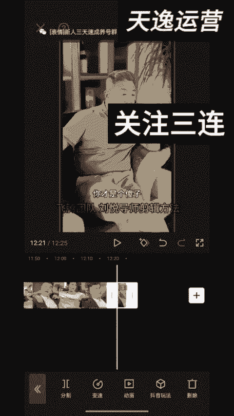
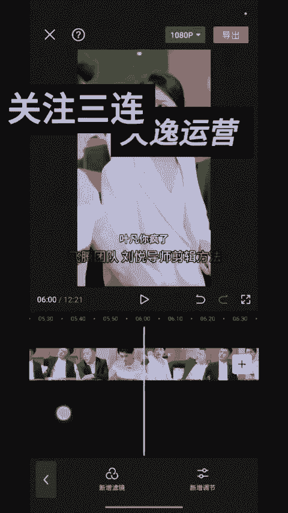
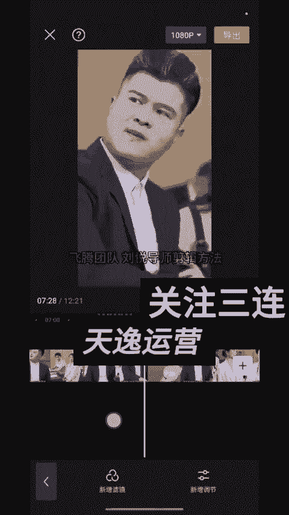
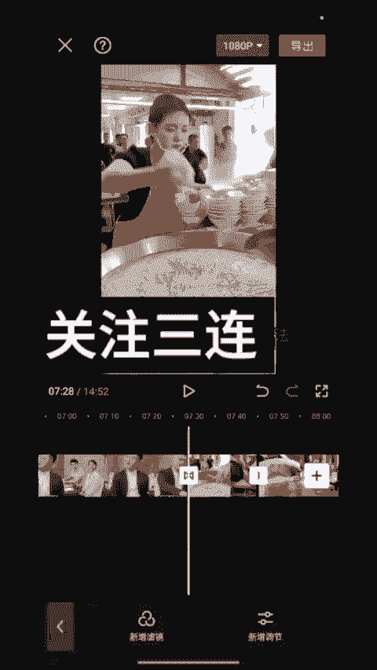
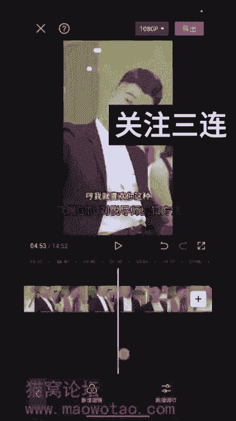
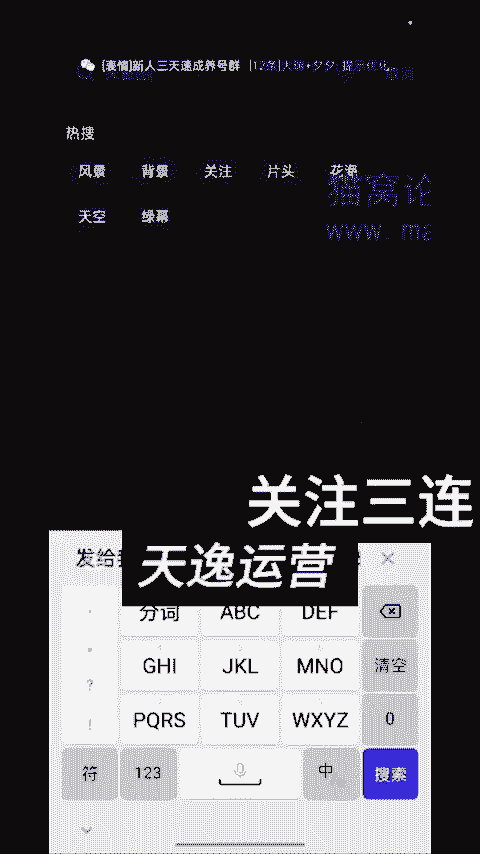
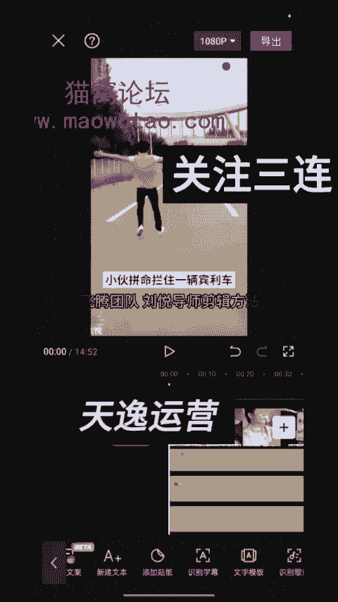
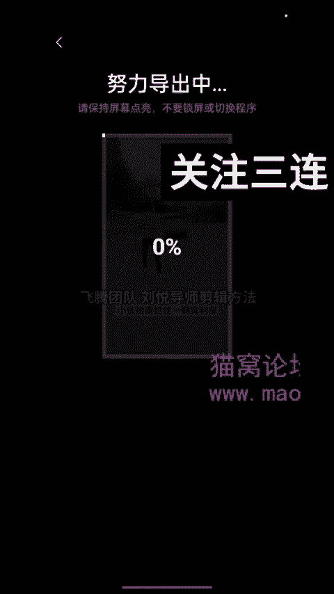
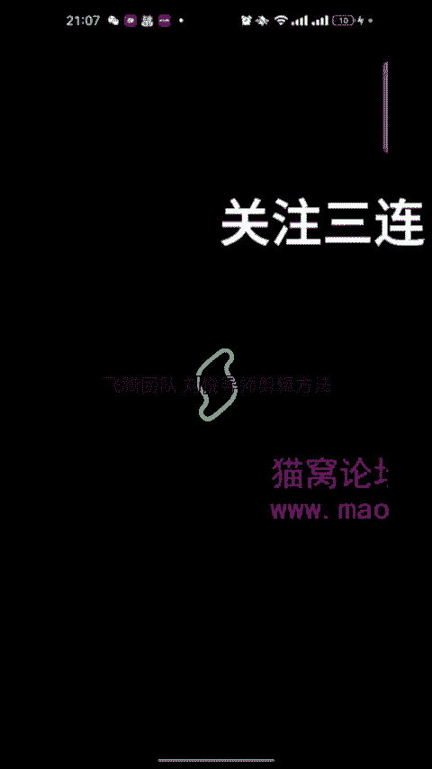
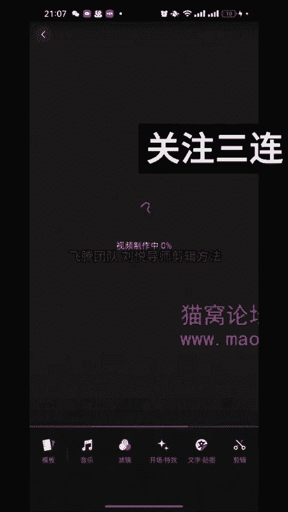

# 【2024版视频号运营教程】全B站最良心的视频号运营高阶教程合集！起号真的不难！ - P46：32-刘悦导师剪辑教程_1 - 视频号教程9 - BV1pFyPYvEXU

Yeah。好，我给大家看一下我平时的剪辑手法哈，我是比较稍微简单一点的，没有用多复杂。那第一件事情呢就是把它稍微放大一点点，都稍微放大一点点。然后把这个句我一般会掐头去个尾。我之前都是看过的。

所以说我掐头去尾的时候，我自己都知道它的点是在哪一点。你们的时候就在把剧情把它抖出来的时候，或者是说创作猫出出来的时候，可以就知道句是哪铁，就不用老是去反复的去观看哈。这样的话很浪费你剪辑的时间。

我大体都知道它在哪一点，就比如说这个剧，你也可以自己去把它稍微踩一点的，不一定是说它多长时间，你就要用到多长时间。那我们在中间的时候，我不知道你们是平时是在几分钟可以加了广告。

我一般都在八九分钟或是9十分钟就在后面偏一点的时候，我会去加一点。

会去加一点这个如果感觉它不太合适的情况下，那我就可以在前面。然后你看一下哈。

比如说在这个位置，这个当时我看的时候还可以。他就会在这个位置。真的被开发了。然后在这个表情这个位置。

然后我就会在它这个位我就把它直接分割，我们就开始去加入我们这个素材哈。素材的话我们用哪个呢？哟。面条吧，就用面条吧，这个面条的素材，这个面条的素材你们可以把它几个拼一下，也可以每一次的时候你去剪。

就是同一个品，不同句的时候可以去多换一下，去多换一下也是可以的。换个方向。比如说我就用了这个这个三个，你去一定要要让它。一定要它衔接起来哈一定要衔接起来哈。我们可以看一下话说一两山药一两斤。😊。

只要它里面没有说呃需要你。多少钱多少钱多少钱，只要没有这些然后就可以。要有价格的话，直接把它给拿掉哈。😊，前面这是我给你加的广告，一般我都用4个5个四5个把它给衔接出来就行。你们一定要把它衔接起来哈。

这一点我就不给你们放了。你们在前面的时候会说广告生硬，那你要点它中间的位置要有一个叠画。加一个叠画在上面，把叠画距离稍微放到二或者是3，然后就可以。这样的话它稍微衔接会好一点哈，直接衔接过来会好一点点。

然后这个句，然后你广告的时长建议大家加一分半到2分钟，太短的话，它不合适。这个是我加这个广告。你们要是一个一个去看哈。它比如说下方小黄车啊，有价格的话，你直接把它给裁掉，然后就可以在这一点我就不裁了哈。

我就给你们简单的去看一下。那我接下来就是加的是画中画。画中画的话，我一般会去加两张照片哈，会去加两张自己的照片。比如说我就先用一张。

我就随便先用一张照片，然后在这里面先去放着，然后混合模式调叠加，然后把它调到3或者2，就是最小，然后把它拉满铺满。铺满就可以哈，直接把它铺满，然后我们还可以再去放一张。😊，再用画中画的时候。

可以再放一张。把它稍微放一张，一般都是放自己的照片上。放自己的照片稍微更合适一点点。然后是两张直接放过去，我会加一个适量图。这个的话。小亚老师啊，还有在群里面有姐妹们也都做过。

然后他是有一个加一个素材库。里面有一个适量图。

然后它横屏或者是竖屏，你都可以把它稍微去找一下，找个时间比较长一点的哈。因为咱们那个句子时间比较长，它不有31秒这个吗？好，我们把它还是放大一点点，混合模式叠加。其实我都是用到这几个。

没有什么特别复杂的。

然后把他的声音给他稍微调调一下，命拦住一辆宾利车，女人以为他要碰死，当即拿出10万块钱稍微调慢一点哈，然后让他直接你看没有？他这个是如果不够的话呢，我们就把它稍微给复制。Yeah。把它给复制复制几个。

多复制几个，然后让它整体铺满。如果多余的话，我们再把它稍微给裁掉。裁切把它给裁掉，然后就可以。这个是我家的这个哈加的这个化妆画。那我有时候会为了让它去个虫呢，我就会给他加一个我自己的名字在上面啊。

我就刘月嘛。然后安卓的手机呢只能给它划到一边去，但苹果手机能把它划走，你把它也给铺满，因为咱们都是为了去虫嘛，毕竟做的是搬运。这是我加的这一点哈。😊，这我加然后接下来情况下呢会去加一个。特效特效的话。

我会去加两个哈。你要是有VIP，你就加VIP没VIP的话，就可以不用加VIP哈。作用对象到你的画中画里面去，然后直接去加两个也可以加一个也行。一个两个，然后都可以。然后画面特效。命拦住一辆。

作用对象你就到他的画面二里面去，然后直接给它铺满。然后你要是有滤镜的话呢，可以去加个滤镜，但我一般都不把它做的特别的复杂，我就加一个滤镜，会去加一个滤镜在里面，你们也可以去加一个滤镜哈。

然后把它稍微调到23都行，123都可以，不把它调到特别大。你只要里面是加过广告的，就一定要把它给拉到最后面去哈，一定要拉到最后面。然后差不多，然后你咱们去加贴纸，贴纸的话就是4个贴纸。

上下左右我一般都是上下左右加4个贴纸。对吧这个是必一个，然后把它放在这边上。然后再给他放一个小蝴蝶啊或是啥都可以哈，你们自己可以去选一下哈。我在这里面就没有特别细的一下。😊，但是我一般会四个角会放4种。

他那我就放一个这个吧，命拦住。放这四个吧，然后我们把它就是直接放好，然后把它拖到最后。我在这个检验里面做完之后，我一定会过一个秒检的哈。就什么都不动，但是我一定会过一个秒剪的，从描剪那个方向里面直接去。

是从秒剪的方向直接就去导出来，就直接就发了。因为我感觉这两天秒剪的话还可以，就是过了秒剪，它的流量还挺高的。这四个你把它给稍微整满，都全部铺满。我如果想再去复杂一点，我就会把它分层就分段。

每20秒分一段，每20秒分一段。就是然后你给他换个背景底色。但是我一般的话过秒检的时候，我就不把它分的特别高了。这个是这样子，然后差不多了，然后我就会把它直接1080P把它直接推流，然后把它导出来。

导出来之后过一遍秒检就可以了。从描剪里面不用动，直接。比如说我们把它导出来之后，秒剪的话。

从相册里面导进去，比如说是这个视频直接导进去，我让他直接然后去发表视频，到视频号上就可以了。这个是我的这样做的。

