# 【2024自媒体教程】30集带你从小白蜕变成小红书大神，新媒体运营大佬教你轻松变现！（内含所有小红书起号，小红书涨粉变现运营技巧） - P1 - 将来会发生什么 - BV1wU411o7Qg

要说最近什么项目最火啊，那必须要提到小红书电商。最近几个月呢，几乎整个互联网都在讨论小红书电商。我关注的几个商业博主啊，包括一些付费社群都在讨论他。我朋友圈月入5位数甚至6位数的比比皆是。

这个项目在年初的时候，我其实就有让团队跟进测试，我还在市面上买了一些课程学习，到现在单人单店一个月能做个一两万块吧。今天我就用一个视频详细的给大家拆解一下，就是小红书电商到底怎么玩。

我会把整个小红书电商的流程，包括一些注意点，比如怎么开店，怎么选品，怎么做流量，一次性给大家讲清楚，你甚至都不用再去看别的相关视频和培训啊，你就跟着我的视频去按住做骥，就足够你在这个事情上开始盈利了。

视频的结尾呢，我还会给大家准备一份资料。里面有我找的课程啊，对你运营小红书电商呢会有很大的帮助。有需要呢直接去拿就可以了。言归正传啊，整个项目的逻辑啊，其实也非常简单，它就三件事，第一个呢开店。

第二个选品，第三个流量，我们一个一个来讲，先说开店。呃，开店其实没什么好说的。那，首先就是打开小红书，然后点击左上角的菜单图标，再选择创作中心，然后点击更多服务这个选项，选择店铺，点击立即入住就可以了。

你就按他官方要求的提交资料入住就行了。我居然看到有人把小红书开店包装成一个项目拿出来卖。居然还有不少人买，这也是很奇特。这里跟大家说一下，小红书店铺的两种形式，个人店和企业店，其中个人店有两种。

分别是个人店和个体工商户店，个人店只需要身份证加1000保证金就可以开通了。个体工商户呢还要多一个营业执照，企业店呢就多一点，企业店有三种呃，有包括那个普通的企业店有专卖店和旗舰店。

企业店都需要营业执照，而且还要缴纳600个年费。我们刚开始运营小红书电商的时候，你直接选择个人店就可以了。我们实测下呀，企业店和个人店一样，平台并没有对企业店有什么流量倾斜。唯一的区别是个人店。

你只能开一家，而一份营业执照呢，你可以开三个店。你一个店如果都没做好，你开再多的店都是没有用的。而且小红书电商啊，我觉得是。

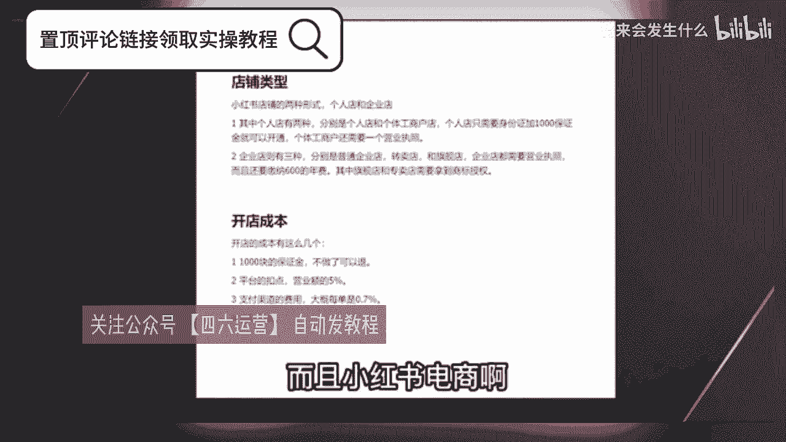

适合店群形式去做的。这是因为小红书的流量机制，它的电商自然流占比非常低。那你付再多的店再多的货有什么用呢？所以只要你看到有博主跟你讲什么小红书店群，我都觉得是在扯淡。小红书是要做矩阵的啊。

但不是店铺矩阵，而是账号矩阵。这个后面在流量获取那里，我会跟大家细说，开店的成本呢有这么几个。第一个就是1000钱的保证金啊不做了可以退。第二个呢是平台的扣点营业额的5%。第三个呢是支付渠道的费用。

大概呢每单是0。7，第四个就是自己的流动资金啊，一开始大家做呢可以有无货源的方式去做啊，对资金要求也不高。你刚开始呢准备个20003000块完全够了。呃，开完店以后呢，我们下一步就是选品。

我们应该在小红书上卖什么呢？选品其实也简单在其他平台上的爆款大概率在小红书上也能报。目前小红书呢我是推荐三个渠道进行选品的。第一个是通过某东某宝上面找那种小红书平台调性的爆款产品。

身边有做电商的朋友他自己在某宝的店铺卖爆款，搬到小红书上。第一篇笔记就开始。第二篇笔记单量就已经破百了。第二个呢是通过某音的那个精选联盟。你在某音的精选联盟排行榜，你可以看到现阶段哪些品卖的好。

只要符合小红书用户调性的产品，直接搬运测试就可以了。第三个就是某多多的这个销量排行榜，选择适合小红书的类目排行榜，从中选择相应的爆品搬运到小红书。整个选品的逻辑，就是我们要利用市场来帮助我们选品。

而不是自己在那瞎想，我们要借助大卖家的选品能力来弥补自己选品上的不足。所以我们只要判断一个东西啊，就是这些排行榜上的爆品是否跟小红书的人群有匹配的可能，如果有我就搬过来测一下，对吧？

相当于是借助了别人的能力来帮我们自己选品，这样反而是最快，而且是最稳妥的选品方式，肯定比你瞎测成功率要高很多，然后等你这个产品上架以后呢，就到了最重要的环节了，我们应该如何获取流量。

小红书它是个种草平台。你店铺九成以上的流量啊，都是来自你发发的笔记。这就是为什么我之前说小红书不要铺店群，而要做账号矩阵，尽可能多的发笔记好流量。它的通路就是。用户通过你的笔记。

然后对你推的产品产生兴趣，然后到达你的店铺完成购买，你堆一堆店铺，对吧？你铺一堆店铺一就还不如多发笔记，多发几篇笔记的这个效果好。所以怎么在小红书上发笔记，对吧？就是你小红书电商是否成功的关键。

小红书这个平台，你直接发硬广，我觉得效果非常差，对吧？本来小红书的这个用户群体认知就比较高，你直接发广告没有办法获得信人的啊，更不要提转化了，你发笔记的时候，一定要用一个素人的角度，你知道吧？

就是用户的角度去切入，站在用户的角度去做种草内容，而不是官方视角，这才是真正有效的。呃，这种种草笔记怎么做，其实也很简单，就是去各大平台的商品评论里找。比如某音某宝某东的商品买家秀找到好看的素材。

你直接copy下来用嘛，对吧？文案呢在买家评价上去做修改。这些买家的评价呢就是商品用户的使用体验，天然的适合用来做这个中考笔记，而且可以说是取之不尽了啊。然后呃当你单个账号的SOP跑通了是吧？

我们就可以开始举阵引流了啊，通过批量上小红书账号批量发布笔记。给我们的店铺来引流来放大。那基本上整个小红书的电商的运营啊，就是我上面分享的这些外面不管多少钱的培训啊，000块也好，600块、1万块也好。

其实就是这些东西。有些培训可能还没有讲的清楚啊。根据上面几个点，我给大家准备了一份资料，里面包括了小红书账号的起号运营的方法，以及一份小红书电商的视频课程。你如果打算经营小红书电商，你也不用看别的东西。

就跟着这份资料走，足够你开始盈利了。有需要的啊，点赞加关注，在评论区回复红书电商，我分享给你。😊，🎼要有自信啊，你是最好的，知道吗？

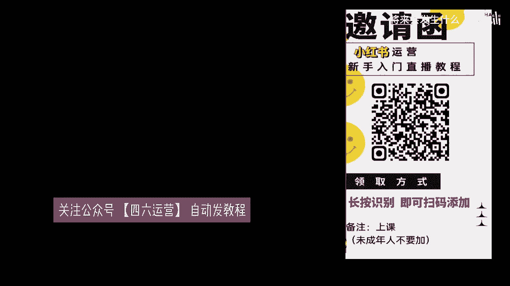

今天我们跟大家分享的是小红书从0到1系列对标账号的筛选与应用。那么我接下来要讲的内容还是老规矩，都是一线的实战干货啊，我们大概预计花费一个小时跟大家做分享完毕。那么我们整个分四个板块去做一个分享。

第一个是了解对标账号。第二个呢是如何找到对标账号。第三个是如何运用对标账号以及有效对标与无效对标。那我刚刚问了大家啊，我们怎么什么是对标账号啊，有一个人回答了说同赛道数据好能复制的那这个。

答案是否正确呢？我们往后看啊，其实对标账号是什么啊？在我看来，对标账号其实是分狭义的理解和广义的理解。对标账号狭义的理解就是未来你希望做成什么样的一个账号，给自己一个参考方向，一个前行的一个参照物。

那对标账号的广义理解呢就是只要是账号内容能够辅佐你来做出未来运营决策的，都可以作为对标账号，只是说广义的对标账号，你可能参考借鉴的是它的一个选题一个标题或者是它变现方式啊，甚至引导客户添加你私域的方式。

那我们来看一个例子啊，为什么说我们要找对标账号，我们从学习美术到学习音乐啊，不管你学任何一种艺术，基本上啊临摹是第一步。我们可以看到啊在美术学习的这个过程中啊，像我就是学美术出身的啊。

那这个呢就是美术生可能都画过的一个大卫的一个头像。那我们发现一个事情啊，你们觉得一号大卫2号大卫和3号大卫，谁画的更好呢？123谁画的更好呢。

所以我们会发现说当你把大卫做成当成一个对标的一个头像去做的话，作为一个产品的话，有的人画出来是一号的样子，有的人画出来是二号的样子，有的人画出来是三号的样子。Yeah。那么在这个过程中啊在这个过程中。

每个人本身他对艺术的一种感觉，对产品的描述出来的形式就不一样。那也就意味着是什么？我们根据不同的描述，我们可以选择学习一号，也可以选择2号，也可以学习一个3号。所以学习是最快的方式啊，那我们再往后看。

那么什么叫广义的一个对标呢？就像我们刚刚看到大卫一样啊，相同的一个大卫石膏像不同的人画出不同的样子。那相同的产品，不同的人写出来的笔迹给人的感觉也是不同的。那我们再看到偏狭义的一个对标啊。

还是一个石石膏像。但是你会发现不同的人他的创作手法开始发生的区别。一号大卫他使用的是素描方式，2号大卫他使用的是油画方式。3号大卫他使用的是雕塑二次创造的方式。所以相同的产品，不同的展示方式也是不同的。

那我们对账号的管义理解。是什么呢？再确定一下啊，就是对标账号的关理理解，就是内容能够辅助做辅助自己做出未来运营决策的，它可能是标题，可能是选题，也可能是变现方式等参考。

那像我们现在啊所看到的右边的这个图片，就是我在小红书网页版搜索芒果啊，搜索出来的一些内容。那这个图片我第一页我就发现了它的奥秘。我不知道你们有没有人感觉到啊，就是这一个一号内容。

这一个2号内容和这一个3号内容，它都属于数据很好的内容，1个3。7万点赞，1个4万点赞，1个3。3万点赞，而且他们表达的内容形式是一样的。就是吃芒果用什么样的一个方式是超级好用的那我们再往后看啊。

你会发现说这三篇笔记啊，它数据都很好，而且它都只是讲用。桃子吃芒果的这种方式。那我们可以看到这一篇笔记啊，3。7万的点赞，它是什么时候发布的呢？是4月19号啊，22年的4月19号。那这一篇笔记呢。

右边的这一篇呢，它是22年5月18号发布的啊，它的数据呢是4万的一个点赞。那我们再来看一下。这一篇左边的笔记啊是22年4月9号发布的。他是3。3万点赞。那么在这一篇笔记中。

我们可以发现说他这这个作者艾特出来了真正的原创。第一个发现这个方法的人啊，他是22年的3月20号啊，他的数据是1。2万点赞。那我们发现说一个芒果的内容啊，被一个素人他发现了，但是被有。

敏锐的创作者进行了23次创作，拿到了不错的数据。那我们来看一下这四个人的数据结果啊。一号。发现这个。就第一个发出芒果可以用勺子吃啊，用用勺子吃芒果比切芒果切盘要更加的方便快捷的人啊，他是38个粉丝。

那么二次创作的啊，有的是138粉丝啊，有的是10万粉丝啊，有的是5。4万粉丝。所以当我把芒果的这个事情拎出来之后，你们现在能够理解什么是一个基础的一个对标了吗？啊，芒果的这个案例就是在告诉大家。

账号内容能够辅助自己做出未来的运营决策，可能是标题选题或者变现方式。那我们可以看到啊，这四篇数据都很好的内容中，原创内容的标题是吃芒果的正确方式。那二次创造用的是终于找到芒果的正确吃法，太开心了啊。

以及终于找到了芒果的正确打开方式和吃芒果方法超方便实用好用。请问一下，这四个人，他们有借鉴第一个原创的吃芒果正确方式的这个标题吗？是没有的，对不对？所以他们借鉴的是什么？他们借鉴的是选题。

就是我们来分享，用勺子吃芒果这件事情，就能获得大量的流量，所以他们借鉴的选题。那么我们再来看一下，我们切到这个网页版来看一下。来看一下这四个账号的一个实际情况啊。实际情况我告诉大家是什么样的呢？

就是真正的原创的人啊，他38个粉丝，他发了将近四五十篇笔记，但只有这一篇数据OK而这个138粉丝的，他是属于他真的啊用了他看了他的笔记，他用了他的方法去吃芒果，他也觉得很好。所以他也发了。

但他不是真正的内容创作者，所以他也只有138个粉丝，而右边的这两位，他们是真正的做内容的啊，做创作的，他们看懂了这些这个选题的一个数据的一个有效性和爆发力，所以他们进行了二次创作。

所以他们做到了10万粉丝5万粉丝啊，但是我想问一下大家，吃芒果的一个用勺子吃芒果的这样的一个方式的分享。他为什么会有这么多的点赞收藏呢？符不符合最开始跟大家说过的真诚分享友好互动。

我真诚的分享了一个吃芒果的方式，所以我拿到了观众的友好互动。好，那我们再来想一下啊，我们为什么要找对标账号呢？几个点啊。第一个点是对标账号能够有效提供前行的参考方向。第二个对标账号的类型多样。

能够更快给我们找到内容的制作方向。第三个对标账号的数据代表着市场结果，可以提取精华。第四个制作出来的内容有对比，可以找到差距去缩小。啊，就像我们前面所看的大卫一样，你有对比，你是去临摹的，有差距。

你就可以去缩小这个差距。但是如果你没有一个参照物，你都不知道你画的好还是不好。那么第五个就是我们可以借鉴选题啊，借鉴封面，借鉴优化思路的一个理解。第六个是依据对标账号的数据表现提取爆点啊。

这个接着我们会细细的展开。那么右边有一幅名画啊，是小鸡赤米图。那我们可以看到啊，对标的过程中，我们还可能发现一种情况，对吧？就是做。边是背对标的啊，右边是我们有一些朋友啊，有一些朋友的一个结果是吧？

这个就变成了什么小鸡夺米图。我想问一下大家，这个叫有效对标吗？这个算对标吗？一个小鸡痴米图，一个小鸡夺米图，所以有对标就能让你知道你哪个地方没有做好啊。而且大家在后面的一个制内容的创作过程中。

不要轻松的觉得说啊我做了内容，我的标题跟它是一样的，所以我就能报。你真的看一下你的内容是不是像这两幅画一样，出现了巨大的理解差异。那为什么我们要去做对对标呢？就是第一个啊，从抄袭到抄越啊，到钞票。

那么第二个点啊，我们来讲什么呢？讲如何找到对标账号。那么对标账的几种收集方式啊，我已经给大家罗列出来了。第一个是关键词查询法用户名搜索结果。第二是关键词查询法的笔记搜索结果。

第三个是通过数据软件平台筛选。第四个是跨类目对标。那么第一个啊来看，就是通过关键词的查询法，这个我们一般是用到手机端啊，我们在手机输入童装中啊，我们可以看到用户这一栏啊，可以看到用户这一栏。

我们可以看到。名字中包含童装的这些账号啊，可以对它的内容去进行一个检索。这里我讲一个知识点啊，讲一个知识点就是。比记数与粉丝量的对比是账号运营能力的体现，是账号运营能力体现。我想问一下大家。

A运营啊100篇笔记增加了1万个粉丝。B运营啊500篇笔记增加了1万个粉丝。啊，他们的目标用户都是一致的，拿到的目标用户都是一致。请问是A厉害还是B厉害，A厉害还是B厉害？啊，我再跟大家强调一下啊。

今天的知识点啊，比技数与粉丝量的对比是账号运营能力的体现。所以我们在研究账号的过程中，我们尽可能多去看一下他是如何通过少量的笔记来做到更多的粉丝啊，像我对吧？我通过29篇装修笔记做到了1万粉丝。

所以我每篇笔记的增粉量在300以上。那我们接着往下去看啊，对标账号的几种方式的第二个点是关键词查询法啊，这个我们用网页版的小红书就好了。网页版的小红书啊，在网页版的小红书搜童装结果。

它会有一排关联词的出现啊，关联词出现。那这里有春夏春款啊，公主裙连衣裙、幼儿园穿搭等等啊，它是有关联词的自带关联词。那么通过关联词，我们可以去进一步啊把童窗这个类目进行深化啊，像连衣裙对吧？

会出现这么多内容，像公主裙啊，又会出现公主群的一些笔记内容。那么第三种啊，我们对标账号的一个收集方式是什么呢？是通过数据软件平台进行一个筛选啊，像数据软件里，他们可以筛选博主筛选笔记。

筛选实时的一个笔记版低粉豹文版啊，以及商品的7天15天的一个销量排行榜，这是第三种对标账号的收集方式。第四种对标的一个收集方式呢，它是跨类目的一个对标啊，我们借鉴呢是标题是封面，是选题是运营方式。

甚至导流方式啊，这个我不具体展开。但是我们实际上是可以做到跨类目对标的啊。举个例子，我们看到这一篇笔记啊。他的标题是陈海玩具还比1688便宜，你敢相信吗？我想问一下大家啊，我们跨类目对标啊。

我们觉得这个标题很好的情况下，我们怎么样去写一篇母婴的标题，我再把这个标题念一遍，你们去构思一下，怎么样去写母婴童装的标题，打在评论区好吗？它的这个标题是陈海玩具还比1688便宜，你敢相信吗？

大家思考一下啊。我们借鉴这一个标题的手法，去写一篇母婴的标题啊，这一篇标题什么是陈海玩具还比1688便宜，你敢相信吗？那同理我们是不是可以把陈海玩具这个词换掉啊，变成。叉叉童装啊，还比1688便宜。

你敢相信吗？啊，比如说这个啊。第二个这一个标题我们可以看到啊，这个标题是啥是顺德本地人分享不踩雷系列啊，荣桂美食篇。那如果说我们觉得这个标题很好，我们把它对标到我们的母婴账号去做，那就可以是什么？

就是不是他的他这个标题的吸引人的点在哪里？在顺德本地人分享啊？我不是美食达人啊，我不是乱七八糟带的带货博主，我是本地人分享，让人天生觉得更真诚。那我们把这个标题套进去就变成了什么什么样的身份更真诚呢？

比如说是童装，对吧？那可能就是啊。童装啊或者叫童装产二代是吧？分享啊，不踩雷系列。或者说。十年童装人啊分享不踩雷系列，它这个叫荣桂美食片。那我们就可以说衣服材质片啊，这也是属于跨类目的一个。

跨类目的一个对标和借鉴。那包括像这一篇笔记啊，4000多的点赞，薅牙毛了1688婴童服装同源工厂便宜这么多。啊，所以我们通过一些对标账号，可以是同赛的对标，也可以是差异的对标。

我们都可以给自己提供一个灵感。所以对标账户能够给大家提供更多的信息。为什么我们要通过对标账号，是因为什么？是因为实际上90%的事情其实都有人想到要怎么做了。而90%的方法都已经有人在做了。

所以你们90%问题的答案其实都在对标账号里，我问一下大家童装有几种卖法通过小红书，是不是可以通过店铺挂车是不是可以通过店铺引流，是不是可以通过群营销啊，我们把群插件对吧？上次跟大家讲解了。

所以说那我就看到了这个牧童妈妈童装，他都已经到第九个群了，而且有358人了。那我们是不是可以通过这个账号去加入他的群去看他是怎么在群做成交的。同样的，在陈先生童装供应链这个账号里啊。

他有一篇置顶的笔记打开是这样的，就是这张图啊，这这其实这个就是他的笔记内容。这个就是他一篇的笔记内容。这个不是他主页啊，这已经是他一篇笔记内容，他就画了一个圈，很多人找不到我们字母加数字。

这个就是我们的朋友圈。那这是不是通过主页置顶笔记啊导流的一种方式。所以90%的答案其实都在对标账号里。那么对标账的使用意义啊，我们再来跟大家灌输一遍啊，接下来我们会继续让你们更深入的一个理解啊。

第一个对标账号能够有效提供前行的参考方向啊，就是你的账号要怎么做。对标账号的类型多样，能够更快的让我们找到制作方向。第三个，对标账号的数据代表着市场结果可以提取内容精华。第四个，制作出来的内容有对比。

可以找到差距去缩小啊。第五个，借鉴封面选题优化思路的理解，以及提取爆点。那么综合用一句话来说啊，对标账号的使用意义是什么？对标账号的使用意义是让我们从偶然的从偶然性的数据中找到必然性的规律。

大家把这句话打在评论上，好吧，大家把这话打到评论区，加强你们的对这个知识的一个吸收啊，从偶然性数据中找到必然性规律。大家把这句话打在评论区好吗？从偶然性数据中找到必然性规律。

为什么我们要从偶然性的一个数据中去找到必然性的规律呢？是为了抬高笔记的数据下限，抬高笔记的数据下限。我们的笔记能否获得几千点赞甚至几万点赞甚至上十万的点赞互动，这个是需要运气的。但是你把你的笔记下限。

抬到几十个点赞，是可以通过自己的运营技巧和找对标去完全实现的。所以我们找对标是，从偶然性的数据中找到必然性的规律，从而抬高笔记的数据下限。那么对标账号的一个学习收集习惯啊，这里我跟大家分享一下。

也是我自己把29篇笔记做到1万粉丝所在用的一个方法。第一个动作是。童装。那你们通过刚刚所说的对标账号的寻找方式，找到你们觉得优秀的账号，关注他，关注它的作用是什么呢？是你可以定时翻阅账号主页。

查看是否有豹文出现，趁热打铁，还记得刚刚那个芒果吗？从3月19号到4月20号到4月20几号到5月份，连续4篇笔记全都报了。但是如果是你们去分享芒果，有多少人能想到从芒果的。用勺子吃芒果这种体验方式去。

创作内容呢根本想不到。但是我们如果看到了别人这样的方式，他报了，我们能不能赶紧去展示做二次创作是可以的。所以说我们是定时翻阅账号主页，查看是否有豹文出现趁热打铁，这是第一个动作啊。

关注10到20个学习账号啊，定期去翻他的内容。如果他有很好的表现形式，创移方式，赶紧趁热打铁。第二个动作是什么？是在你们的小红书收藏里面建立至少三个专辑文件夹，建立三个专辑文件夹分别是什么？

是标题灵感、标题灵感以及封面样式、封面样式啊，还有选题方向选题方向啊。嗯。我问一下大家，你们觉得标题封面和选题这三个哪个重要打在评论区好吗？标题封面和选题这三个你们觉得哪个重要啊。

我建议大家啊建在自己的这个小红书的收藏夹里，建立至少三个专辑文件夹啊，分别是选题封面以及标题。因为优秀的内容，数据好的内容，它本身就是市场检验出来的结果。所以我们把好的东西的灵魂提取出来了。

用在我们自己的身上，会让自己更快拿到结果。所以我们将日常刷到的笔记有收获的进行分类就好了。不一定是要你做的类目，不一定是要你做的类目，明白吧？好，那有人我看一下啊，有60%的人啊，认为封面重要。

有20%的人认为标题重要啊。然后没有人认为选题重要啊，实际上我告诉大家啊，这三个其实都挺重要啊都挺重要。当然，按照小红书的推流逻辑，因为它不像抖音，它推荐一篇内容，它会自动播放，它封面是推荐四篇笔记。

对吧？小红书的封面是推荐四篇笔记，所以我们必须把标题和优封面优化好，人家才会点进来，在你标题和封面没有优化好之前。那人家可能都不会打开这篇笔记了。那我们第三个我们来说什么呢？来说我们如何运用对标账号。

运用对标账号。对标账号的灵活运用啊，这个地方我希望跟大家去共同创作啊。那我先告诉大家什么叫对标账号？什么叫对标账号的借鉴形式。那么如何运用对标账号呢？我们要想把这个对标账号运用好。

首先我们要知道怎么去分类啊，所以我们要找到合理的账号归类方式，找到多角度的表达方式，找到多身份的表达方式，最终找到适合自己的账号定位和表达方式。那这里啊我们来以同装举例，以同装举例啊。

找到合理的账号归类方式。我能想到的啊，比如说我们是可以按照展现场景去分类的。比如说我们去搜童装或者公主裙啊等等一系列关键词，它出现的内容，我们是不是可以给他做一个场景的分类。这一篇内容。

它是在室内拍摄的，还是室外拍摄的？啊，第二个我们是不是可以做第二个分类，是他是有模特的还是无模特的？啊，还有什么分类方式吗？大家想一下啊，大家动动脑筋，因为你们学会怎么去梳理账号。

怎么样去搭建这个账号的分类方式。当你知道怎么分类了，你就知道怎么样去看别人报的内容。那你知道怎么样看别人报的内容去进行有效分类，那你就知道你的内容和别人内容差在哪里，明白吗？所以我们第二个。

我们可以找到多角度的表达方式。第三个是什么，找到多身份的表达方式啊，比如说爸爸妈妈啊，这篇笔记的一个发布这篇笔记的人，是爸爸还是妈妈还是外婆还是爷爷啊，或者说甚至是后妈，是不是？那我想问一下大家。

如果你们去发童装的内容，你们会选择什么方式去发布呢？是用妈妈我给孩子买了一件啊，心爱的童装。还是说。作为后妈，我给孩子买6。9块的衣服有错吗？😡，还是说作为爷爷。爷爷提前啊孩子还没生。

爷爷就就已经把衣服买回来了。你们觉得我刚刚的这三个方式，哪个更吸引人？啊，你们觉得我刚的三个方式，后妈给孩子买一件有6。9块的衣服有错吗？啊，或者说我们能不能用用其他的身份去做这样的一件事情。

大家还记得一个有趣的故事吧，有一个这个小朋友啊，拾金不昧啊，送给了警察叔叔啊。作业是不是？所以啊。不同的内容你们看到之后，创作者的身份他们可以进行一个分类啊。账号的展现形式可以分类。同样的啊。

像刚刚有人在评论区说的啊，产品做成九宫格啊，进行一个拼图。那这是不是属于一个表达方式的分类呢？那我们现在啊有人说了啊，我们可以通过九宫格分类，还有有没有更多的方式。想一下肯定是有的，有方式一九宫格。

有方式2，有方式3啊，有方式4。九宫格算是一种分类，对不对？那同样的，比如说我们在货架上展示货架。货架。啊，以及以及戴老师说过的啊，我们去门店，对不对？戴老师不是说过。

我们直接去合适的朋友的这个童装的门店去拍摄素材，是不是一种表达方式啊，以及什么甚至仓库。是不是等等等等。所以你们要知道怎么样去运用对标账号。首先你们要学会分类，然后你们就会发现有的身份。

有的表现形式和有的展现场景，它是天生有流量的，能理解吧？理解理解打个理解好吗？我打个666好吗？有收获打个666好吗？有收获打个666，我喝口水啊。那么这个地方。我带大家啊。

我们去实际运用一下怎么样去寻找到对标账号。来啊，我们先讲。先讲先看一下啊，这个是手机端啊。

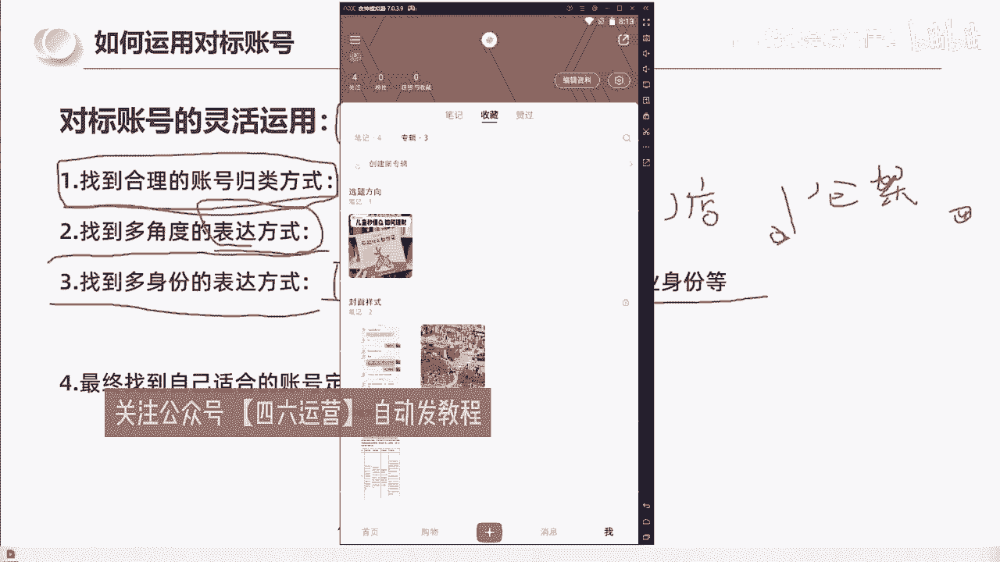

比如说我们通过手机端搜童装啊，我们可以看到。在用户端啊。我们可以看到第一个字账号。它是400篇笔记，23万粉丝，每篇大概增长了600笔记啊，这个地方我把这个屏幕给大家拉大一点。啊。

你可以看到这个这个账号的数据啊。怎么样还可以啊还可以啊。那么你发现没有？😡，他用了他的这个内容啊，有一个共性，我不知道大家发现没有。就是他的所有的内容。他的封面都加了一句话，叫富养女儿穿搭。

富养女儿穿搭。看到没有？好，那我问一下大家啊。😊，这些内容的展现形式是不是不一样的对吧？这个属于什么场景？这个属于我们来看一下什么场景啊，女儿的衣服别乱买了，这里都是整套搭配好的，喜欢就收藏关注吧。

不然刷着刷着就不见了。

🎼这个属于室内，对不对？室内。🎼模特啊混剪室内模特混剪。

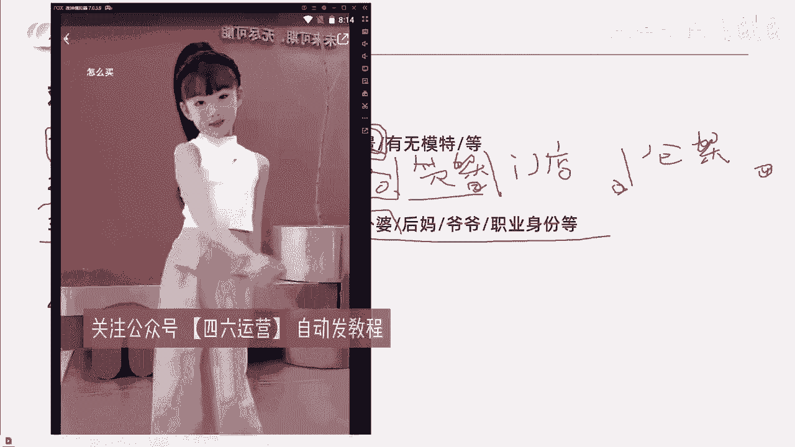

🎼那么这个属于什么？女儿的服，看到没有他前面啊还加了一段字母，这个属于什么？室内没有模特啊。

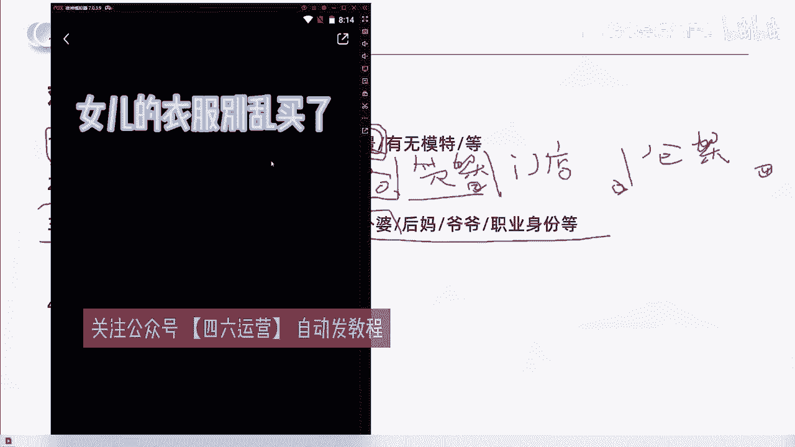

🎼合集室内没有模特合集。嗯。好，这是一个账号啊。那我想问一下大家，你们在看这个账号的过程中，你能你们能告诉我是有模特的数据好还是没模特的数据好吗？我带大来看一下这个账号啊。😊，我们怎么去看账号。

看一下大家啊，就是要当我们去分析一个账号，我们就要看它数据高的内容。数据高的内容啊，像他这种账号，那就以以1000啊大几百为单位。这是我们看到的一篇啊1200点赞的内容，这是有模特的对吧？而且是亲子装。

啊，这里有篇4000的，这里有篇5000的。这个是什么？😡，啊，也是有模特的啊，而且他的标题还很重复，孩子就是要在还小的时候尽情给他打扮啊。这里一句话富养女儿穿搭。好，这有一篇一000的看到没有？

他也用了同样的一句话，孩子就要在还小的时候尽情给他打扮。接着看我们看上千内容啊，这个也上签了。然后这个呢。就左边这个他是这个也是属于应该是模特没有出镜的啊。这个封面是没有出镜的。好，看到没有？哎。

这个地方看到没有？他是不是测试了一个什么情况，他测试了用虚拟卡通人物做封面，看到没有？所以我们的出镜方式，除了有人真人无人，还有什么，还有虚拟卡通。之前有人想到过虚拟卡通形象吗？是不是？

那你会发现说他做了尝试，只是他的尝试结果怎么样不好啊，1个16个点赞，1个20个点赞。那我们继续往后看啊，这两篇也是一样的，用的虚拟卡通人物100多点赞啊，7个点赞。所以从他这个数据啊，我们可以看出来。

虚拟卡通人物至少他测试的结果啊是放弃了。那我们再看一下这篇1000多点赞的又是属于什么？属于真人出境，对吧？真人出境。所以从目前这个账号的数据，我们能看出什么东西就是他尝试了虚拟人物出境。

然后虚拟人物并没有拿到很好的数据，然后他一直在用富阳女儿穿搭这6个字做内容，以及什么？以及尝试着人物出镜和启能人物不出镜。那么根据数据比较好的笔记，我们可以发现啊，像这篇4693个点赞，它也是人物出镜。

所以我问一下大家是人物出镜的数据更好，出镜数据更好还是不出镜数据更好，出镜还是不出镜啊，把你们的答案打到评论区好吗？像这个1450个点赞啊，是这个小朋友啊，穿着这个衣服。

是出镜数据更好还是不出进数据更好，出境还是不出境？啊，所以你们要通过分析对标账号去归类啊，归类找结果，找自己的一个内容方向。同样的我想告诉大家啊，其实这个人物它也是还有区分的。有的人物他有素人感。

有的人物是模特感啊，所以也是我们可以去区分的那这个账号我们看到这里，我们再看第二个账号。啊，这个账号是13。6万粉丝啊，他总共是我看一下多少篇内容啊。这个账号叫做童妈啊，女装童装穿业店415篇笔记啊。

13。6万粉丝。我们来看下他的账号数据。他也是一样的，他用了富阳女儿穿搭，看到没有？看到没有？大家这两家店啊，首先说到两家店，他们都把富阳女儿穿搭放在了首页。我想问一下大家，这个是不是规律。

是不是运营的规律，他们能做到十几二十万粉丝，他们每一篇都把富阳女儿穿搭打在封面上，是不是规律？是不是规律？那我想问一下大家，你们知道富阳女儿穿搭这6个字打在这个封面上还有一个什么好处吗？她吸引什么人群？

他信的是舍得为孩子花钱的人群。他是舍得为孩子花钱的人群，对不对？因为我是富养女儿，我不是穷养女儿。所以他能吸引的就是舍得为孩子花钱的人群。我们可以看到他的内容。啊，我们现在也在往下刷啊。

比如说我们可以看到说。4000多点赞的这一篇笔记啊。他是孩子出境啊。然后我们再往上看啊，像这两篇它是属于大人出境啊，大人出镜的数据就没有上千。我们再来看这个2600点赞啊。

这个目前从封面上看没有人物出镜，这个8000点赞的。看一下啊，这个是小朋友出镜，对不对？那你有没有发现一个点，就是他们的这个所谓的小朋友的模特，其实他打扮出来，是有一种高级感和精致感的。

我觉得这个穿搭已经是不是传统的那种小朋友的穿搭。那么我们再看到右边这一篇1212点赞的，他也是大人出镜还是小孩出镜啊，大人出镜的数据感还是小孩出镜更好。

那我们可以看到啊这个1443最右边这个啊富养女儿穿搭啊，他也是富养女儿穿搭。那中间的亲子装啊，数据没有更好。所以我们可以通过别人的数据，通过他们最爆的内容去看到我们的内容方向是双人出镜？

镜还是儿子出儿童孩子出境，还是母亲出境。像这一篇6996969点赞的又是小朋友出镜啊，那我们。是不是还可以做一个归类啊？比如说现在的三篇笔记中，这一篇它是属于一个户外场景，看到没有？

它应该是在类似于一个大堂前台的地方，这样一个充电宝。那我们是不是还可以去进行数据分析，它究竟是在户外的表现数据好，还是室内的数据表现好。就是我们是在一个随机的场景数据好，还是在一个刻意的数据好啊。

你像它也在尝试，看到没有？像右边这一个戴眼镜的这一个笔记，它是在户外的一个停车场的场景中。啊，看到没有？1619点赞啊，它是在户外的一个场景中下雪啊，他这两篇笔记。你们不要看啊你们不要看这个笔记。

只看数据，只看标题。这一篇458点赞的啊，爸爸给孩子穿衣服。和这个1619点赞的爸爸给孩子穿衣服。我想问一下大家。爸爸给孩子穿衣服这个动作，爸爸被拍进去，他是有意的还是无意的。

大家打在评论区是有意的还是无意的？我们再继续看一下啊。啊，包括这个。啊，大家意识到没有？是有益的。因为在户外的环境中，爸爸给孩子穿衣服，这张照片是比你在服装店里穿好站在那里像模特一样拍照。

是更有场景感和真实感的。所以这个运营，其实我觉得它是一流的运营。他能够捕捉到我刚刚所说的分类的场景的差异。那包括这一张。啊，是小朋友也是在大胆走路的一个姿势。那我想问一下大家，这个是什么区别？

这个是不是动态动态封面和静态封面的区别？因为这个人物是明显拿着手机往前走，他是没有那种刻意感的这是一个动态图。那我们再往往往往继续看，看到没有？这个1403的这个中间的这个笔记。

它是不是小朋友在等电梯的一个照片，他也是人往前走，所以这也是一个动态图，动态图啊，包括像这两篇啊，看到没有？他又报了一篇数据很好的2700的，他是怎么报的，他是妈妈。拿着衣服，妈妈拿着衣服。

这个衣服没有挂在架子上啊，就是有一双女人的手拿着这件衣服，这是不是一种表达方式，是不是一个场景，有人物衔接的关系，在挑衣服的关系。那么他报了一篇2790的笔记之后，他又继续拍了一篇。

就是有人物在旁边准备取衣服的这个动态，所以所有的数据好的内容都是值得你去仔细分析的，他是什么样的场景，他是有人还是没有人啊，他配了什么样的道具，他出了手，没有出手，他是静态的还是动态的啊。

大家我问一下大家有没有收获，今天有没有收获，有收获打个有好吗？有收获打个有啊，所以我带大家我们实实在在的去看别人的账号到底什么叫做对标。什么叫做对标。那我想问一下大家，像这种啊像这种账号。

我们都可以看到这种就属于什么无模特静态在服装店内拍的。我想问一下大家，他的数据好吗？他的数据好吗？知道为什么要找对标吗？知道为什么要找对标吗？啊，包括有人提到的合集，合集就一定数据好吗啊。

所以实际上有人刚刚在评论区打了一条弹幕啊，就是。

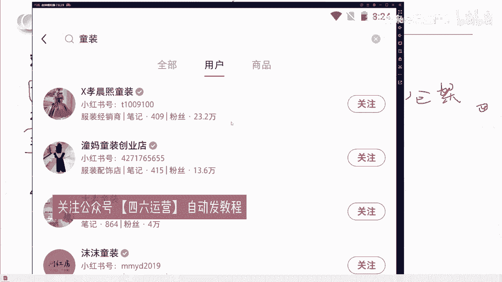

这个孝程啊是模仿这个童妈的啊。那实际上从运营水平来讲，童妈的这个账号的运营水平肯定是最高的。他确实有模仿的嫌疑。但是她模仿，他只模仿了一个啥，他只模仿了一个标题啊，比如说我要富养女儿穿搭。

他没有真正的去把童妈的一些所有的运营思路给理解，没有像童妈一样去做多个角度的尝试，他所有的场景基本上都是在服装店里拍摄的，所以他有一种刻意感，而童妈她在干嘛，他一直在尝试，是不是跟我当时做我的账号一样。

我不会因为说我的数据有400个点赞了啊，我就满意了。我把我的数据拉到上千点赞，我就满意了。不管怎么样，我们永远在尝试，永远在对标。那这些账号，当他的数据不好的时候，我们是不是现在能发现原因呢？

我想问一下大家，为什么这个账号的数据不好，你们能。

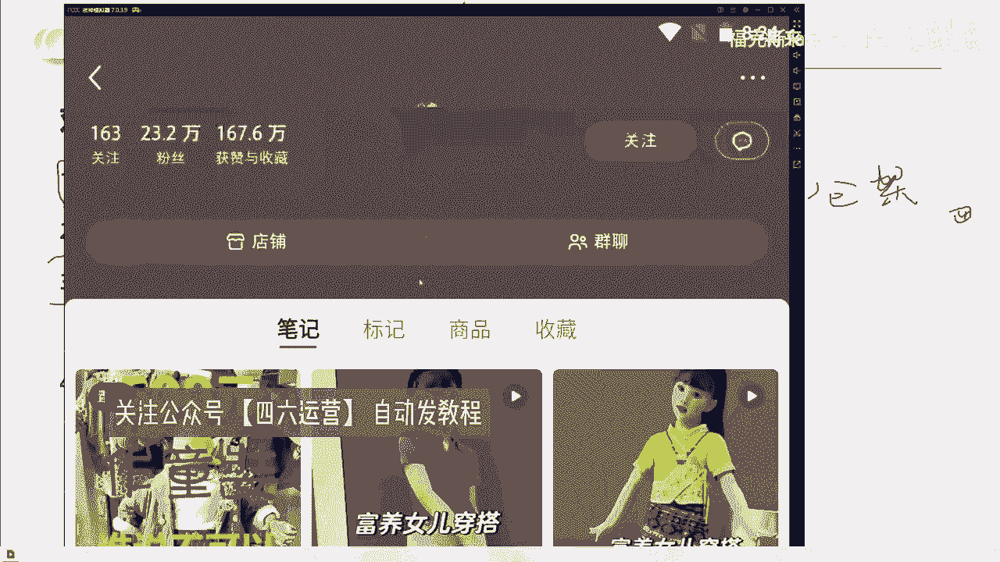

能告诉我原因吗？是真的是因为它的古装风大家不喜欢吗？啊，这个账号我觉得它的产品还是非常有特色的，非常有特色的啊，基本上都是属于这种。

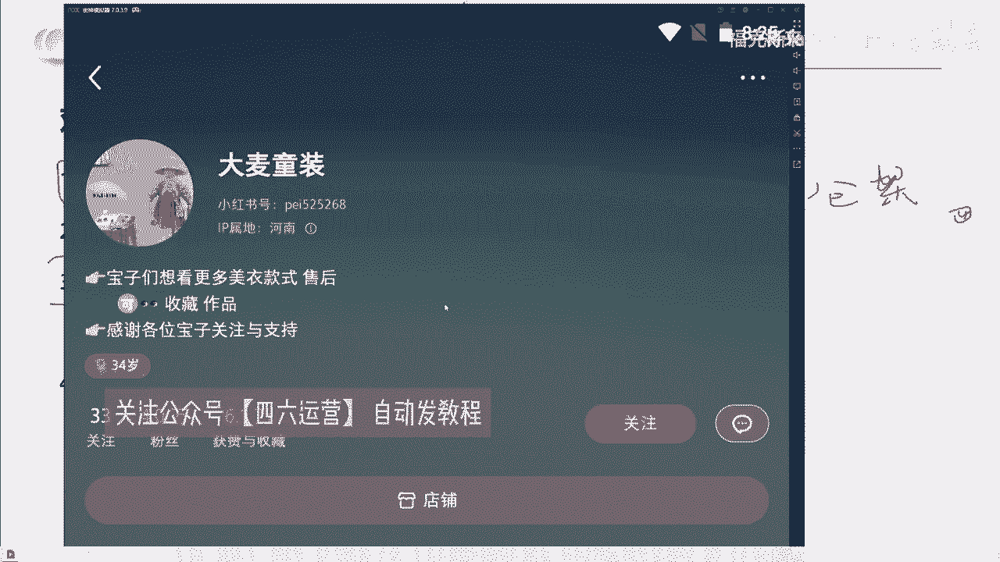

裙子啊。基本上它都是属于裙子。我想问一下大家。🎼如果是你们这个账号是你们的，你们要怎么优化，现在脑子里有没有思路了，是不是这个人他是在把同样的一个事情啊做了几十遍，上百遍啊。

就是把衣服挂在这里拍他是不是也会有困扰啊，为什么我的数据这么差呀？为什么我的点赞就3个4个呀啊，我可能运气好有30个点赞，看到没有？他好不容易运气号有一篇100个点赞了，而他的下限是多少？是5。

所以我刚刚前面给大家是不是讲过，我们去找对标是提升账号的下限从什么？从偶然性中找到必然性，明白吗？从偶然性中去找到必然性啊，我们再去续看一下。啊，像这种合计账号，对不对？那我想问一下他？😊。

这个合计账号他数据好吗？数据好吗？啊。Yeah。我们看一下啊，目前还可以啊，到这一条还可以啊，四4个的合集啊，它的下线大概是上百站的样子。这个是山百赞啊山百赞。它是属于44张图拼图的数据。嗯。哎。

看到没有看到没有？这一条袜子，这一条袜子啊，它有4673个点赞，4673个点赞。在这个场景中啊，左边的这个袜子，但是我想告诉你，这个商家的运营并没有很优秀，你们知道为什么吗？我想问一下大家。

当你有一篇笔记能够出现4673个点赞的数据的时候，你们会想到什么操作啊，你们会想到什么操作，能告诉我吗？为什么我说这个运营啊，它并没有很优秀，它绝对不算顶级S级的运营。我告诉大家结论啊。

为什么是因为他没有复制，你都知道这个角度有4673个点赞了。你为什么不把这个角度隔一段时间再发一次呢？对不对？而这篇笔记，如果我们是卖袜子的，我们刷到了。

我们是不是可以收藏到我们的专辑里面作为封面的专辑。因为他这一篇我们去分析的话，是封面吸引人还是标题吸引人。所以我告诉大家，我们找对标不是一个今天一天做完的动作。我们的对标和学习是一个持续的对做。

所以这一张图片对卖袜子的账号来说是有绝对参考意义的。如果卖袜子的刷到这篇，他一段时间内去复制，这个一定是可以把下线提到几百个点赞的。大家相信吗？好，那我们继续往下去看啊。😊，唉，又有意思了啊。

大家发现没有？这一篇笔记，最右边的这篇笔记，它有700多个点赞，它有700多个点赞，它是什么？它是把饰品挂到一起。我想问一下大家，这个袜子和这个饰品它有没有关联性？有没有关联性。

是不是属于我们把产品挂到一溜，用1个45度角去拍摄出很多的产品，是不是有关联性？所以这是不是一个共性，我们是不是发到了一个惯性共性？啊，包括他尝生的货架。哎，我们发现没有？

这又有一篇啊又有一篇500个点赞的。他是不是把这个视频放到这样的一个角度，对吧？陈列很多的情况下，是不是数据也挺好的。所以我们在分析别人的过程中，我们要找的什么？要找的是怎么样让数据好，然后可复制。

提升自己的一个内容下限。啊，那你像他啊，他也不是说没有做尝试。那看到没有？其实这一篇也是一样的，它也是一个袜子斜拍的角度，300多的点赞，他也做了尝试啊，比如说母亲拿着衣服拍啊。

宝宝在在这个篮子里面拍啊，是不是也是一种方式？啊，甚至货架。等等啊，所以这一个运营它的优点是什么呢？他会去尝试啊会去尝试，但是他趁热打铁啊和这个。趁势追击的这个运营思维啊稍微差了一些差差了一些。

所以啊我告诉大家，为什么说最后啊我们是要干嘛？我们是要找到适合自己的账号和定位。为什么我们要找到适合自己的？因为不是所有的表现形式都适合你。比如说我们看到的目前数据最好的啊，她有一个可爱的女儿，对不对？

在外面去拍摄。那如果你的孩子还是一个半个月大的baby，对不对？或者是已经是一个读高中的。男孩子，你怎么去拍这样的内容？你是不是没有创作条件，对不对？那同样的有的内容它是属于拍照好看的。

有的内容它是视频创作出效果的那如果你没有视频，那是不是不适合你？所以我们要通过种种的归类方式和和这个角度的整理，去找到适合自己的账号定位和表达方式，能理解吧？最后你们是要找到自己的账号定位和表达方式。

所以最后啊我跟大家讲一下，有效对标和无效对标。因为你们在找的过程中呢，其实有可能会踩坑的啊。因为在我接触这么多商家的过程中，我发现了几个坑啊，第一个是什么？是他们找到一个。大几十万的粉丝的账号。

但是我们去看笔记的时候，就是他这一篇他这个账号可能。就是20万点赞啊，20万赞啊，5万的粉丝看这个数据很牛逼。但是你看他的笔记，你会发现他最近的20篇笔记可能就是5个点赞，10个点赞。

那这种账号它其实是运营过早的账号，它的积累是因为平台出期的红利，所以这种账号对你们来讲是没有对标价值的。所以我讲叫无效对标。那么第二个账号是啥？是粉丝量过大的账号可能是平台选出来的案例账号。

大家知道今年啊今年小红书平台要做直播选出来的案例账号是谁吗？把谁打在把这个人的名字打在公屏上好吗？所以如果你要去对标，你要尽可能跳出平台的一个案例账号。因为平台的案例账号是你没有对标意的。

平台会用各种流量和资源去警结去帮它打起来。知道吧？第三个是啥？第三个是持续投放流量的账号，持续投放流量的账号。因为你们在刷的过程中也有一部分笔记，右下角是有赞助标签的那这种账号它能带来的流量。

不一定是自然流。而你如果是做自然流的情况下，这种账号对你来说没有建议。如果你是打付费流，那赞助数据高的笔记肯定是对你有借鉴意义的因为它只有这个笔记出效果，它才会持续去投这个笔记，大家能理解吧？

第四个是啥是也是比较容易踩的一个坑啊，就是只有数据没有咨询的账号，就是在我们刚刚所看的这些账号里，其实我们可以通过他的评论区去看到有人有没有人在下面评论怎么买怎么买啊，在哪买多少钱，有这些评论。

意味着什么？意味观众和消费者有购买欲。如果没有意味着这个东西只是点赞收藏高。所以不要去。对标这种只有数据没有咨询的，以及什么，以及不要去对标近期数据不稳定的账号，为什么？我在抖音对不对？曾经有一个。

炫饶力师表的账号是不是很牛逼啊，导演叫小戴，是不是？枯燥无味的生活啊，那当他把运营换了之后，这个账号数据一下就下来了。所以如果一个账号他的数据不稳定，那么你要意识到他是不是可能更换了运营。

所以我们找对标啊要先。把对标账号拎出来，再反问一下自己这个账号是有效对标还是无效对标，把无效对标的账号剔除掉，然后找到我们的一个规律。那有效对标有什么特征呢？第一个特征是什么？是半年内数据优秀的账号。

半年内数据优秀的账号。因为。他三年前就已经做了10万份了和3个月做1万份，那肯定是后者对你的借鉴价值更大。因为3年前的运营方法和涨粉方式可能更加的简单。啊，第二个是粉丝增长速度快的账号。

比如说你哪怕他现在只有1000个粉丝，但是你发现他总共才发了半个月一个星期，他7天15天就做到了。1000粉丝啊，这种也是属于有运营人才在做才能做出来的。第三个什么是评论区咨询量大的账号。

因为如果你的目标是卖货卖货卖产品，那你就一定是要以评论区去判断他的咨询量怎么样，是否有消费动因。那么第四个什么？是我刚刚所说的数据下限高的账号。因为一个账号的运营是否优秀，我会看两个指标。

第一个指标就是他粉丝增长的速度，对吧？比如说他是通过500篇笔记去做到1万粉丝，还是通过100篇笔记，他就能做到1万粉丝啊，这里还记得我用了多少篇笔记吗？我用了29篇笔记做到1万粉丝。啊。

一个是这个水平的差异。第二个是看数据下限啊，有的账号5个点赞，10个点赞啊，500个啊，10个10个啊，50个。那有的账号它是300501000。啊，300500100。

那你肯定是要去关注这种数据下限高的账号，因为你去获得几千几万个点赞是需要运气的。但是你能够稳定的获得上00个点赞，这个是运营的实力在那里的，明白吧？所以再次给大家啊去讲一下，所有自媒体平台的运营。

其实就是这12个字，找对标拆报款多尝试要坚持。那我今天跟大家详细讲的内容是什么？是如何找对标，对不对？我们怎么样找到有效的对标。

怎么样去通过对账号的一个分类方式去套到这个账号中去找到数据下限高的表的方式。那么面对你们后面还有什么还有拆报款，还有多尝试以及什么以及要坚持，再牛逼的运营啊，他牛逼也是需要尝试的。他不是把脑门一拍，哎。

我按这个方式排会报，我按那个方式拍去报。不是的，越牛逼的运营，他越会尊重这个市场的一个客观规律。为什么因为本身小红书每天就大几十万的笔记，新的笔记投放到市场中，本身这个是是情这个。

笔记他能获得上千的点赞，就已经是千里挑一的了，就相当于什么？就相当于什么？就相当于说小红书它是开卷考试。就像我啊我读书的时候，如果说你把我放在全年级第100名，那我考试成绩就在200名以内。

但是我最牛逼一次，我考了全年级第59名。你们知道坐在我旁边的是谁嘛？是全年级第19名，其实就是这个逻辑。小红书是开卷考试，他的这一篇笔记已经在排名中拿到了好的排名，你就要去研究它借鉴它。

所以最后呢就是我们要说坚持啊再坚持。🎼好，今天的分享就到这里，更多干货慢慢更新，有问题评论区见。😊，Yeah。大家进入课堂啊，然后我们现在开始的话就进行我们今天这个课程，欢迎大家啊。然后据我了解啊。

我们今天课堂有来自于不同这个平台的这个同学，然后有了解小红书，有不了解的，是不是啊，有在这个什么B站啊、抖音啊啊，知道听说小红书现在有这个挣钱的项目，但是可能具体怎么来操作，不是很清楚啊。

大家现在有没有这个小红书的账号，或者说你们平时会不会用小红书会用吗？自己平时有没有用。😊，啊，有会使用，对不对？啊？我先跟大家讲一点啊，因为如果说我们现在要去选择一个互联网的这个行业去变现。

大部分人会想，哎，好像这个抖音比较挣钱，对不对啊好有用啊，但不知道怎么挣钱，没关系啊，很多人下意识会想说是这个抖音的这个平台啊，那事实上啊，抖音它现在已经处在一个饱和期了，就是因为做的人太多了啊。

在这个平台去变现，然后想要在这个平台赚钱人有点太多了市场是已经溢出来了啊，那么所以说小红说他其实也看看中了这个抖音这样的一个变现模式是吧？以前抖音哪有这个什么带货，哪有什么直播都没有啊。

以前我更看到是美女在那PK呀，在那跳舞啊，是这这些内容，然后包括刷视频看到也是娱乐等等啊，但是自从抖音开了这个直播带货之后，开了这个橱窗带货以后啊，它相当于说把我们中国传统电商的啊。

这个市场已经做到了一个瓜分。就比如说呢之前我们习惯性在。😊，淘宝买东西啊，在什么京东买东西，现在更多我们会下意识觉得好像抖音上更便宜，对不对？好，那么呃小红书它的一个模式其实跟抖音有点类似。

它也是一个社交平台，也是一个分享作品的平台。但是小红书的区别在于它不是说那种大批量的视频，而是小红书更多是以图文的这个方式来进行。但是你想啊作为一个社交平台来讲，就是作为小红书来讲。

它如果说一直走这个图文的方式，它不挣钱。😊，对吧平台不赚钱啊，所以说他开始呢想要去借鉴啊这个抖音的一个代货模式，也想做出一个社交的代货平台，社交电商平台。那么所以说今天咱们才有这节课啊。

因为小红书给大家提供了一个这个创业的机会。我不知道大家有没有关注到这个在春节联欢晚会的时候啊，有第一个小品，当时上场的第一个小品。😊，在那里面出现了一个小红书的logo啊，我们以前看这个春晚。

基本上没什么广告吧，对不对？今年啊小红书直接把广告打到哪里去了，打到春晚去了啊，直接一个抱枕最显眼的红色的抱枕在这里，所以说它下血本了啊，那么我跟大家讲这个意味着什么啊？我们今天为什么会有这么一节课。

因为小红书即将迎来它的流量爆发期。第一，小红书自己花钱花巨资啊，再给自己的平台打广告，在疯狂的引流。那么同时如果说未来我们在小红书的平台去开店铺也好啊，还是说我们去做一个商业账号去打广告也好。

那么我们会直接获得平台给予我们的免费流量啊，就是你不用说像做抖音一样，我还要抖抖家，对吧？我还得花钱，在小红书我们去做账号的话，现在我们是可以完全封闭不掏，获得流量去挣取收益的。

然后今天我会详细跟大家讲几个玩法啊，来给大家看一下一个的是。😊，是我们怎么样来快速的去涨粉？因为目前我们是处在一个零粉丝的一个状态，对不对？😊，来这是第一个啊。第二个呢，怎么样去制作这个爆款的作品。

因为既然我们想要在小红书平台去赚钱，首先你的作品得有人看，我得有粉丝是吧？有人能看到我的作品，那么才能达到引流的一个效果啊，那么第三个如何打造值钱的这个商业账号，就是我的这个号。

如果说有粉丝了有播放量了，我怎么把这些粉丝去变现变成钱啊，让他们来买我的产品，或者说呢我通过接广告，我来挣钱啊，那以及呢我们今天也会讲到一个很重要的，我在不掏钱的情况下，对吧？不花钱啊，然后呢。

并且呢我没有产品啊，我没有货源在这种情况下，我们怎么样在不投资的这个情况下我们去获得回报啊，这是小红书这个平台目前能够做到的那今天这节课的话呢，就是由我啊全程来跟大家讲一下我们整个平台他的一个玩法啊。

那么我叫小南，我做互联网的这个时间算比较长啊，15年开始做过淘宝。然后包括16年开始呢，我们又接触了很多跨境项目像什么虾皮呀来酷胖。😊，啊速卖通啊，然后包括呢像亚马逊啊等等啊。

18年我们也是最早一批在国内抖音做视频带货的商家。然后我今天主要跟大家讲的几个方向，也是我们不用去直播啊，就是你自己自己不用真出镜后另外呢我们不用说去拍摄自己的生活呀。

后不用说自己原创去做这个素材一样可以挣钱的一些玩法那现在我们先来介绍一下这个小书平台到底是什么啊来我们有很多同学可能一进来云里雾里的。

咱们今天在讲的是什么呢讲的是这个小红书平台的变现玩法也许这个平台有点冷门。有同学可能进来之后，连这个平台是什么都没听过啊没关系，我们先了解一下啊。

小红书现在它其实是一个集合了所有的年轻人的这样的一个平台啊，我们现在已经有一个根深蒂固的感受，就是我如果说想买个什么东西，我会下意识打开小红书先搜一下，比如说我现要买口红，对吧？

我不知道我这个白皮适什么黄皮适个什么小红书搜索一下我要出去旅游，我也不是问一下当地人说哪里好玩什么东西好吃啊。😊，我这小说搜的吧，武汉啊这个哪个地方景点，江汉路怎么怎么样啊，对吧？什么东西好吃啊。

然后去搜。😡，在小红书能直接给你答案。包括我今天我想买一个什么筋膜枪啊，我想买个按摩仪，人家小红书里面能够很全面的给你把所有的这个品牌的介绍都给你写清楚。来，我们看一下啊，我直接打开这个小红书的界面来。

我们搜索一下这种，你看一下。😊，对吧我直接搜索一个什么美容仪。😊，他的内容做的是很精细的啊。🎼来，咱们可以看一下啊，在这里面的话，它有很多这种专业的产品的分析，来，看到没有？对不对？就这种啊。

很多个产品给你罗列在一块儿，然后给你做分析非常专业。那所以说这个平台做这个流量背书，做的很好啊。它里面针对性的客群是有很多的。就是想要购物的客户，它是居多的那所以说我们之后去做这个账号的机会也会比较大。

😡，那再一个跟大家讲一下小红书它的一个发展历程啊，就是在最早之前，小红书其实它是一个没有变现能力的平台。就是我们以经刷小红书，发现里面可多炫富的了。😊，有没有什么香奈儿的包啊，怎么去买啊。

哪个款是当下的爆款，什么情人节限定是吧？然后包括呢买这个爱马仕的铂金包，你需要配货10万还是20个W啊，以前讲的是这些东西，名媛的下午茶啊，这个星空顶的豪车，对吧？以前是刷的是这些东西啊。

但是这个大牌是不可能说在小红书去开旗舰店的啊，所以说慢慢转型，到后来呢这个卖点什么化妆品啊啊，卖点这个护肤品啊啊，然后再到呢后来跟各种服装品牌去合作啊，再到现在什么花西子啊，完美花西子啊，完美日记啊。

这个几10块钱的产品也开始出现在这个平台。所以说现在小红书它其实主打的一个方向啊，就是去做带货。么所以说今天我们也会来教一下大家，我们怎么样来做这个模式啊。

我跟大家简单先说一下这个百万买手计划是什么意思。为什么我前面在开课的时候，我就跟大家强调，我说现在是做小红书的黄金时间，对不对？黄金三个月啊，就从现在起往后数三个月时间，现在。😊。

是平台直接给咱们免费上流了一个时候，为什么来我们看一下啊，他们这个CEO发布了这个新闻发布会，讲到了这么一个玩法，叫百万买手计划。😊。

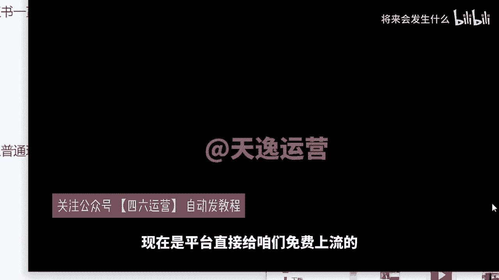

就是他们现在在大力的招募，有创业能力的人，有开店能力的人啊，有电商经验的人来到小红书去开店去卖产品。不管我们的货有没有品牌无所谓啊，就是能够开店，能够去成交，那么就可以。

为什么来现在小红书要靠这一个玩法去翻身。我举个很简单例子啊，如果未来我们的店铺成交金额达到1万块钱，对不对？我卖了一万的货。😡，那么平台能不能从我们手里抽成呢？可以他会获得5%的手续费服务费啊。

相当于说你需要交钱给他是多少钱呢？500块直接从你手里扣走啊，不会问你同不同意，看到没有？那如果说我们成交的是10万元，对不对？他直接能够从咱们手里啊获得5000元的分成。来同学们，这个钱是不是挺多的。

是吧？这就是小红书啊，他未来走的一个方向？😡，你开店卖货卖的越多，你给平台创造的价值越多。那么他从你身上捞到油水越多，他给你的支持就越多啊，这就是小红书现在跟我们所有的达人合作共赢的一个方式。😡。

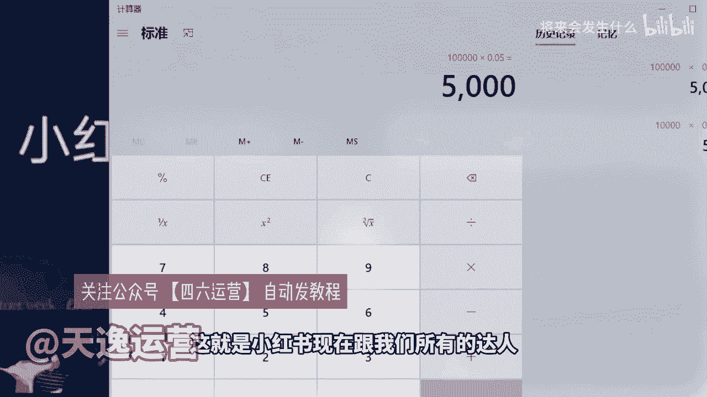

那么今天我们就算是个小白，我啥都不懂，只要你把这个店开起来，我们把产品上上去，把作品发起来啊，赚钱是很容易的。基本上7到15天左右是没有问题的啊，这个是一个百万买手计划。你看之前我们在小红书。

你要买个东西很麻烦的对吧？我还得去搜啊，说这个你好链接有没有求个链接，这个群子很漂亮啊，你还得到淘宝上去下单，是不是那作为商家来讲，作为卖家来讲很亏的，作为作为小红书来讲很亏的，明明是我自己平台引流的。

我花钱来的，买来流量啊，结果跑到淘宝去买东西，前面淘宝挣走了，对不对？那现在不一样啊，现在那个玩法什么样的来我放这个大图给大家看一下啊。😊。

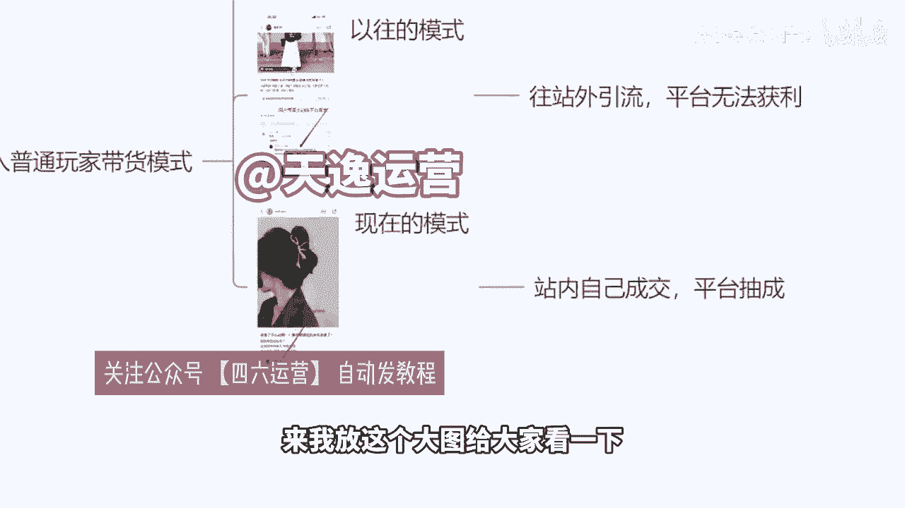

很方便，它的模式跟抖音几乎没有区别。就好比说今天我们看了这样的一个作品，一个卖手机壳的，但是小红书算很委婉啊，我们可以看一下，就这个卖手机壳的一个作品，他怎么写的，他不会告诉你，像抖音一样，我告诉你。

今天我这个产品9。9块包邮，买一个再送一个啊，赶紧进入直播间抢购，没有这种他是什么嗯，那你看炫耀一下新买的，他们就是手机壳，对吧？呃，是不是他真的是他买的，不是我们通常会被这个标题引进来，对吧？

好像哦你真的在给我推荐一个好用的一个东西，实际上人家自己就是老板。😡。

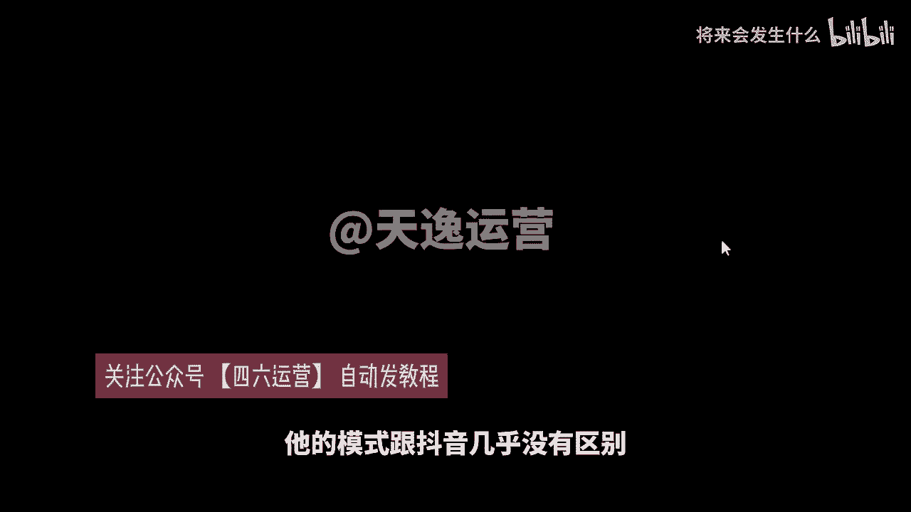

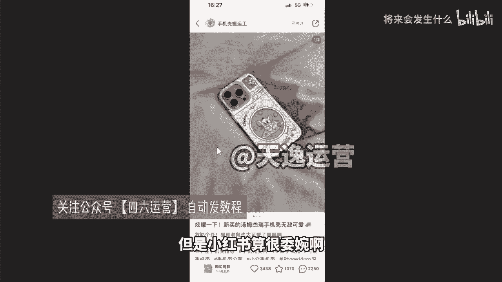

啊，他写文案，把你先圈进来这个小套路，对吧？然后在左下角告诉你啊，购买同款直接点这个通道可以进入，它就跟抖音的小黄车是一样的道理啊。然后进入到这个界面以后，来。

你们自己看这个界面熟不熟悉小红书的购买通道是不是跟抖音它是一模一样的。😡。

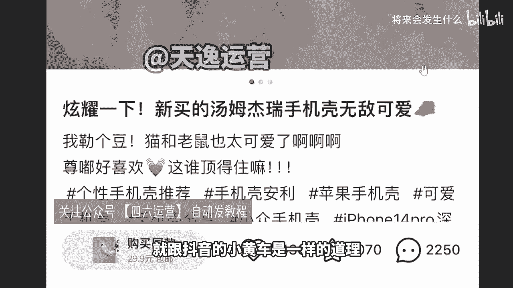

对吧没有任何区别，一模一样的啊。来，这里已售出产品价格等等，对吧？下面加入购物车立即购买都是一样的。😡。

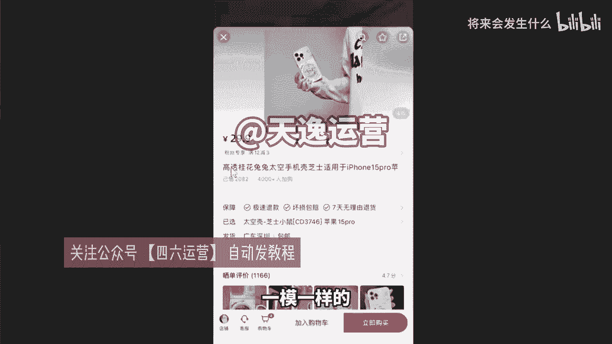

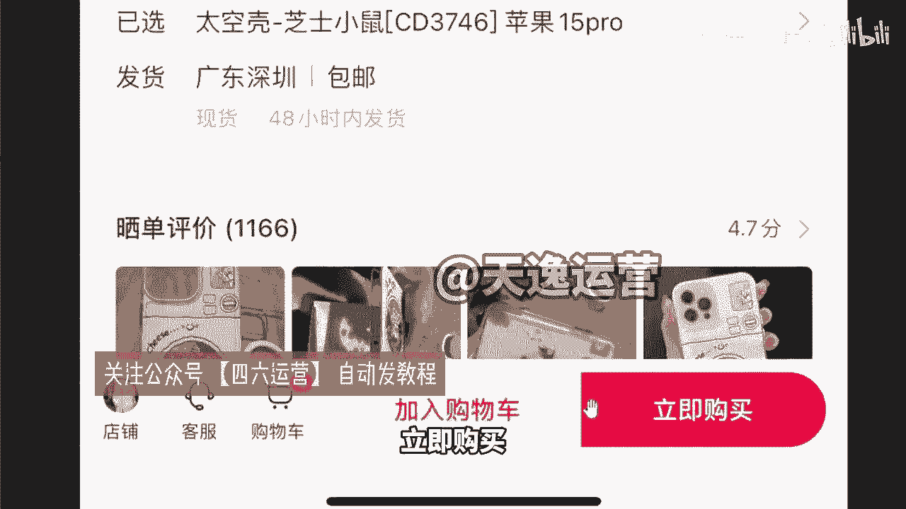

那么用户呢就可以直接下单，直接购买了。那么但是啊小红书的产品通常比其他平台其实要更贵一点啊，但是用户并不会有这个想法，并不会因为价格高，哎，他就不买了等等啊。😊。

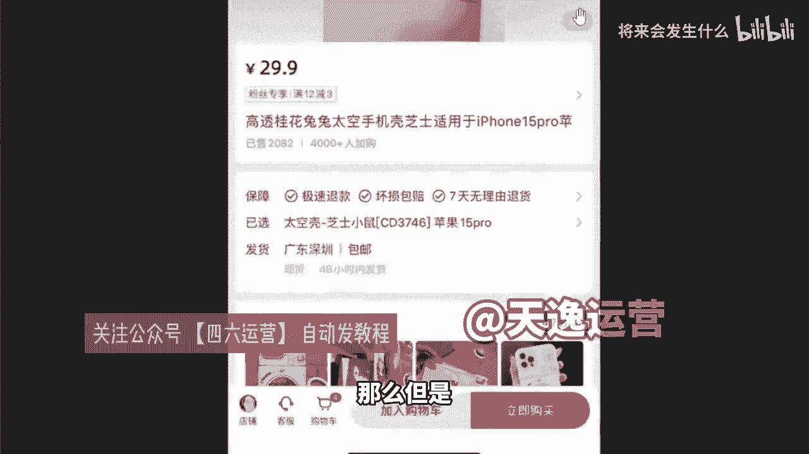

刚才其实我们也讲到了这个说到了一个抖音的这个玩法啊，抖音的这个方式。就是我其实说实话不太建议大家在做抖音。因为我们像自己团队来讲的话，我们去年做抖音200多号人，去年年初的时候还有200多号人。

然后我们缩减到80个左右啊，因为它投产比越来越低了，就是相当于说如果你去做抖音，你不投钱的情况下没有回报。而且抖音现在限流很重很严重啊。因为它的市场饱和的原因，太多人做橱窗带货了。

导致呢如果说你是个新号，或者说你的作品质量不是很高，不是原创内容。那么你挂了车就被限流。😊，挂了车就被限流，因为太多了啊，对吧？但是小红书恰恰相反，你不挂车反而没流量，你挂了车平台直接哐给你上流量啊。

这就区别。因为平台要靠你给他挣钱啊，要靠你给他挣钱。现在小红书做人很少啊。你今天比如说是今天我们听课的很多同学都不了解小红书，在大街上随便拉个轮问一下自己亲戚朋友了不了解他，很多人不知道的对吧？

那一个平台知道人越少，机会越大，是不是另外啊小红书我们去做的话呢，要相当相较于来讲更简单一点点，我们可以看一下他的一个素材啊，呃，我们拿抖音呢来对比一下，就说因为我们今天听课的时候。

同学也讲说老师会不会很难呢，对吧？我做小红书这个作品当中我怎么去做呀，会不会很复杂呀等等啊。同样的一个产品，我们可以比较一下啊，然后这个视频的话是一个卖完美的一个卧蚕笔啊，一个美妆的一个产品。

如果今天我们在短视频平台去做一个账号，你也需要达到这个效果。😡。

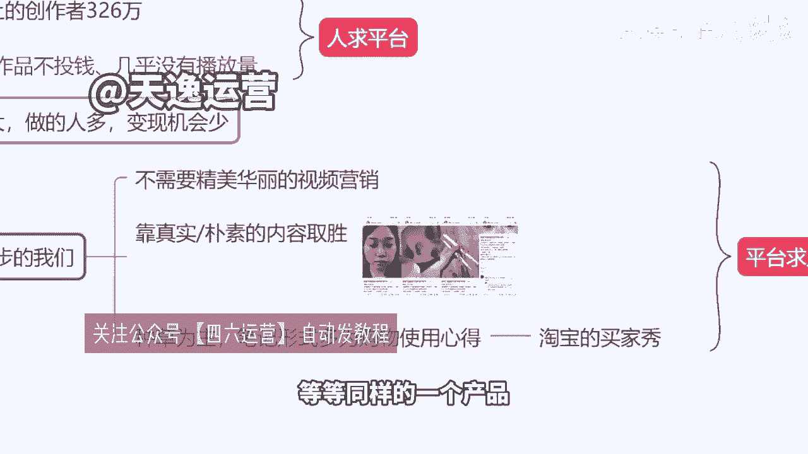

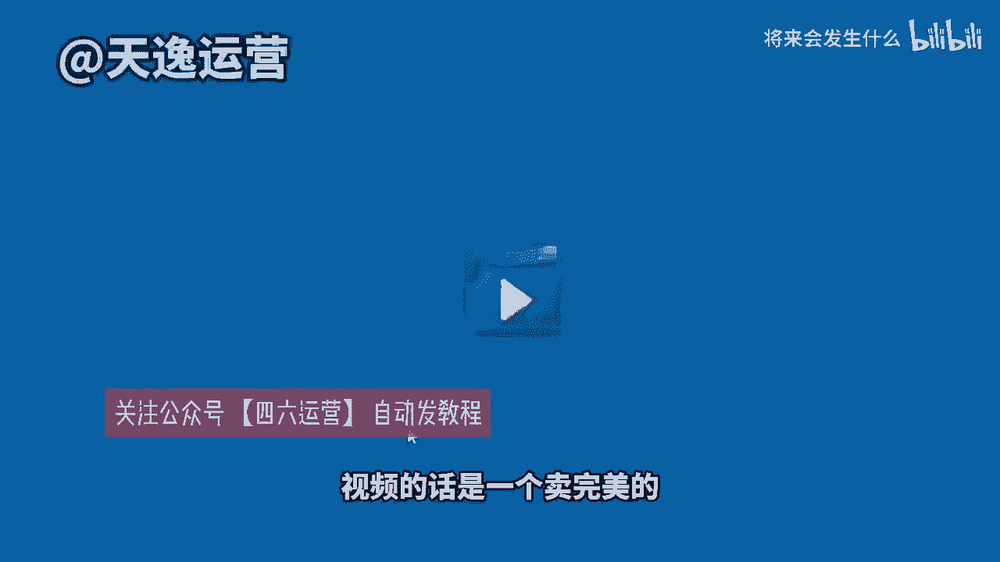

🎼才能把作品才能把产品卖的出去。来，我们看一下啊，哪，这哪里是在画卧蚕，简直是在徒手捏卧蚕一笔两笔，三笔4笔，无论多少笔都不会手中不会化脏，再用另一头的提量轻轻化几下卧蚕就起来了。大家看到没有？

这种是短视频平台，她那个特点啊。因为人家要在两三秒之内，我必须拿个美女吸引到你。如果说我第一秒我在抖音看到是个普通的女孩的这个可能我划走了对吧？我不感兴趣，因为美女太多了，就这个作品啊。

她实际上的一个带货能力不是很好，在抖音里面一个月才卖了500多个订单，卖了500多个订单，为什么呢？因为作为消费者来讲，如果说我看到一个这么漂亮的女孩啊，我会被你吸引，但是我可能不会有下单的一个冲动。

因为我觉得你本来就好看，对吧？你用完这个产品好看是应该的啊，但是我这么普通，我你的产品能有这个效果嘛，对吧？这是作为消费者的一个想法啊，所以说她在抖音虽然说播放量高，但是带货效果不是很强。

如果你们要做一个这样的作品，你最起码投入一个视频找模特。😊，找代拍800到1000块钱肯定是要的对吧？但是我们看一下啊，在小红书完全不一样。其实小红书平台它的一个性质是属于哪种呢？就是高端的。😊。

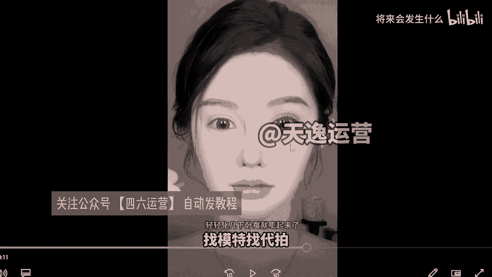

买家秀平台啊，更高端的买家秀平台。来，我们看一下啊，这个是在小红书平台一个月卖了3000多个订单的一个作品。有没有发现她的这个女孩其实很普通，是不是？😊，再想我说你要放一个特别美女的。

特别漂亮的一个美女啊，反而可能点击率还不如这个。😊，啊，因为大部分的这个女生是想要去变美的啊，想要去改变的。那么她看到这个图之后，对第一感觉很真实是吧？我们这个二建中心说了很真实的感觉。第二张图一看啊。

画完妆之后变化确实很大。😊，那我对你这个产品有兴趣，我觉得可能我画完也有这个效果，是不是？那你看几张图片，加上一个标题，加上一小段文字，效果很好。😡。

小红书里面他没有说抖音那种几十万几千万这种点赞的一个效果啊，3000多赞1000多收藏算是非常非常理想的这样的一个作品效果了啊，那么我们未来去做小红书也是一样的。我们有图片的素材加上取一个好的标题。

加上一段对产品真正的描述，那么我们就可以达到一个带货的效果。你即使说我不会视频剪辑，那也一样是可以的。另外小红书平台现在很缺人啊。所以说我们去做的话呢，相当于说你的第一个竞争比较小啊，竞争比较小。

另外呢我们的几会比较大。😡，当然在这里也给大家解释一下什么叫做接广告挣钱的，对吧？我又不是网红，又不是明星。老师，你跟我讲这个接广告它现实吗？来，我们看这里啊，今天我们主要会讲的两个玩法。

一个叫做商业合作，一个叫做我们的这个开店带货。😡，那么第一个商业合作啥意思呢？😡，我不需要你有10万20万啊，我不需要你有什么知名度，你只需要有1000个粉丝。好，来大家说我现在领粉丝，我没粉丝啊。

待会上课我教大家怎么去涨粉啊，怎教你们怎么涨到1000粉来，当我们达到1000粉丝的时候，我们也能接广告，但是咱们接的广告不是10万20万的，我举个很简单例子啊。

你今天不是接什么海蓝之谜SKwo香奈儿的广告啊，好比说有一个牙膏的品牌叫蓝天牌牙膏，我从来没听过不知名的品牌小品牌，对吧？那现在他想要打开自己的知名度，想让更多人认识到自己的品品牌，他是花20万。

找一个网红给大家做宣传，还是说我这样，我就我就找那些1000来个粉丝的博主。😡，我每个人给你300块钱，我能找100个人给我发，每人我就给你300块啊，因为反正你粉丝不多，对吧？我就给你300。

你也愿意发。然后呢，你去帮我宣传一下我的牙膏，一人我给300100个人去发。那这个时候用户每天登录到小红书一打开兰天牌牙膏，一打开兰婷牌牙膏，哪个更划算？😡，同学们哪个更划算。

但我觉得三00是很低很低单价的一个价格啊。随着我们粉丝的增长，2000粉、000粉4000粉，不同的粉丝阶段价格是不一样的。305071000。😊，递增的啊。

跟我们的粉丝数量是有关系的那这个就是我们可以去接的广告，有好几个品牌是这么起来的。像那个呃粉这个来芬那个吹风机啊，现在抖音上很火，也是这么推起来的。还有呢这个像那个叫什么WIS的一个面膜，对吧？

这些东西都是这么推来的啊，它实际上本身没有多少市场份额，都是靠推广的人越多，把这个知密度打起来了。来，这个就是我们今天可以去做的一个方向啊，我给你们看一下啊。

就这个东西我们实实在在拿这个后台给大家去瞧一下啊，你看一下像这个我看这个账号3000多粉丝来，这是我们一个啊，我看一下这个同学什么情况啊啊，在物流公司上班的一个同学他是做了40多天的一个账号。

在小说现涨粉很快啊，然后你们看一下。😊，3000多的一个粉丝对不对？3345个粉丝数啊，素人是不是没有签约任何公司未签约啊，江苏扬州的一个地区的一个同学啊，然后他的报价就是他这一条广告240。😡。

240啊，然后因为他的这里面的这个作品的话，他是这么想的。本身我跟他讲报价，你报三30百是完全可以的。他说想打价格战，他就想自己报的便宜点啊，这个商家呢优先找他，所以说你看啊人家是一共接了就两个月以来。

因为他没做多久，一共才做40多天，两个月以来接了44条，44乘以240块钱的话，但概是什么样的一个收益。今天我讲的这个玩法是真正落地，就是你们也能做的，是2041条，对吧？这个价格啊，1万块钱左右。

两个月以来。😊，啊，如果说是之前做，不会说挣钱那么快啊，但是因为现在是流量风口，平台的单子多，然后平台的广告多，所以说机会多。然后这个是一个，包括像这个，你看1500多粉丝的啊。

这个同学是才做一个多月时间。辽宁沈阳素人，你看也是现在黄金谁区做号，对吧？外签约任何公司都普通人直接咱们这可以看得到的啊，报价是300，这个比较实在，想多挣一点的对吧？借了29条来29乘300。😊。

29乘300多少钱啊，差不多在8000块钱左右，是不是？那这个钱大家想不想挣这个钱想不想挣？对这个对这个项目感不感兴趣？感兴趣的话，一会我们在下面讲啊，我们在下个环节就来教大家怎么去做这个商单。

我们去讲这个玩法，这是一个啊，然后这是我们今天会讲的第一个，他是有门槛必须1000粉丝啊，然后怎么去涨粉，一会说第二个玩法的话，是我们去开店。刚才我们有个同学叫彩华好像啊，他说老师我们有货怎么办？

我们今天要教大家这个玩法。第一个你说我们有粉丝啦。没关系啊，开店是不需要粉丝的。开店是不需要粉丝，领粉丝就可以啊，领粉丝就行。然后另外呢因为现在平台他是有个百万的一个买手扶持计划。

只要我们开了店铺平台自己会主动给咱们推流量。那么你先开店，然后再去发作品，你的作品直接流量会比不开店的账号流量要更大，完全不用担心播放量的问题啊，这是第一个那么领粉丝我们就可以开店了。😊，对不对？

另外啊我没有钱去拿货，没有钱进货怎么办？不需要啊，我们可以做代发，可以做无货源项目，就是我们去合作找产品，找到商家之后，由商家直接帮我们发货，你只需要把他的产品挂在你的店铺就行了。找人发货啊。

你把他的产品放到你的店铺，相当于说代发的形式，这个我们在后面也具体来讲啊，因为现在做店铺流量，真的是非常夸张。给大家看一下，这个是我们之前呃在这个中信银行做销售经理，就推销信用卡的。

然后他当时在做的时候，其实。😊，🎼不算是最好的时机啊，因为这个是年前开始做的一个账号，他当时扶持不算多，他是在这几个月开始这个店铺才慢慢起来的啊。然后你们可以看一下。

他那个时候的一个单日支付金额4554元，就是一天的这个不是一个月啊，这是一天。然后呢昨日全天8000多的一个成交金额，我们算他50利润来讲，最起码是2000块钱左右的一个利润，对不对？

所以大做三个月的话呢，现在店铺单月的一个销销售额是10万左右了，达到10万级别的一个店铺了啊，你们到时候如果说去开店铺的话，因为有这个百万买手计划，达到10万销售额，平台直接给你发现金奖励。

达到20万30万50万一样的平台直接现金奖励给大家啊。那我们如果说对这些感兴趣的话，具体怎么来操作，我们现在来讲。好，我们有赵一慧同学说我发布的很少点击率几乎每人一会我来给大家分析啊。

我们现在作为没有粉丝，纯小白什么都不会该怎么做。😊，Yeah。我接下来把没有流量，没有播放量，包括像甚至有同学说老师我自己也去申请店铺了。但是我那个店铺开下来，我店铺连人都不进啊，一天几十个流量的。

特别可怕的啊，不知道该怎么办了，对吧？我一会跟你们来分析啊，一会来给大家解决。我们先讲第一个发布视频前的准备啊，我们先把这个注册账号的问题说了，我前面讲过了，小红书上春晚了。

他现在已经是让全国的人民在下载小红书去使用小红书在打这个广告了。那么我跟大家讲，不仅是你们啊，现在绝对有很多公司很多电商公司都瞄准了小红书这个风口了，想要去批量注册账号了。

那么所以说我建议大家如果你想在这个平台多挣钱啊，你可以去联系你的父母把父母的账号都拿来一起用，有亲戚的拿过来一起用。你不要说我只做一个号，做一个号，收入有限啊，你多做号，收入是叠加的。

所以说趁这个黄金时间赶紧把账号做起下，就跟抖音当时。😡，一样啊，做的早的呃，是吧，草根都挣钱了，做的晚的你再厉害，没有办法竞争太大了，蛋糕就那么多。😡，啊，不管你是男性还是女性，都是OK的啊。来。

那么我建议大家，我们如果说还没有注册账号的，先暂时不要实名。为什么？我跟大家说一下，有一点你们必须要接受。所以说我们在做小红书的时候，它的起号是有概率的。比如说你注册了5个账号，对不对？😡，嗯。

我就我就不算他5个账号，比如说我第一个账号啊，我就一个账号，然后你这个账号是不是百分百能挣钱，不不一定你这个作品也许发的很好很优质，但就是没有流量，那怎么办？这个号可以不要了。

如果我们等了两天三天播放量没有起色，直接注销啊，拿你这个手机号，隔天再注册一个新的账号。😡，你也许你不断的注销，再注册，不断注销再注册差不多最多啊就5个左右，你肯定是能测出一个有流量的一个账号的。

明白吧？因为这个东西是有概率问题的，现在注册小数人太多了，平台的审核很严格，然后他是随机去推流量的，他不可能说每一个这个发作品人我都给你推送啊，所以说他会有概率啊，那么为什么我建议大家5个账号一起做。

这也是概率问题啊，5个账号里面最起码你起来两个三个，对不对？好，剩下时间我再去测新号，就是这样的啊，所以说呢最好不要实名啊，因为你实名的话，要隔天才能注册新号，但不实名呢？

你当天注销当天又能注册新的账号，直到我们测出一个有流量的账号为止。😡，啊，然后呃包括像我们之前有很多同学是已经发过作品的，有没有发过作品的啊，你不管是这个变现作品还是什么其他的自己的自拍呀、旅游啊。

自己的小孩啊，通通隐藏掉啊，我跟大家讲，你的账号千万不要删除任何一个作品，不要删任何一个作品，因为删了之后，你的账号健康会受到影响。那么我们账号它其实分为两个属性，一个叫生活号，一个叫做商业号啊。

今天我在课题图里面我也写了，我们要做商业号，有价商业价值的，删过怎么办？先发几个作品，到时候测下流量，如果流量不行，我们就注销啊，来跟大家讲一下生活号什么意思？就是你平时发的这个生活的内容比较多。

那平台会直接认为你是一个用户，就是你是一个客户，你是用户的这个角度，那么你的作品发出去，你发的再好，它只是给你推身边的人或者说同城的人，很难往外推啊，你的播放量是受限的。那么商业号不一样。

商业号的推送是整个平台。😊，普遍去推，直接推进页里面去推。所以说这个是不一样的。😡，Yeah。那么我建议大家啊一定要去养号，一定要去养号。然后这个养号怎么去做。来，这样我我给大家总结一下吧。

你们为什么没有播放量啊，我把这几个跟大家说一下，你们就应该更清楚来播放量。😡，少的原因啊。第一个，首先你在注册账号的时候啊，就是我们在注册完账号的时候没有养号，然后直接去发赠品。😡。

导致我们账样活跃度不够啊，平台认为你是机器号，或者说认为我们是营销号，认为我们是僵尸号，他不可能给你流量啊，这个活跃度是不够的。然后第二个这个情况的话呢，就是。😡，嗯，我们的账号属性没有转过来。

账号属性问题啊。第三个作品内容啊，作品有违规。呃，这个东西的话，其实很多时候啊有同学说老师我作品没有违规呀，平台没有给我发违规提醒，他只是因为你的账号已经给你限流了，他压根就不提醒你了啊。

像这种账号没有接受到提醒，不代表你的作品就是好的那这个内容违规是一个第四个啊，内容不好啊，就是你的内容质量不高。然后还有一个你的品类，你要卖的这个东西，你要做的这个方向不是平台需要的。😡。

这些都可能导致我们没有播放量啊，都会导致没有播放量。来，我待会跟大家讲一下，就是我们播放量正常应该是多少啊。来，我先说一下这个养号的问题啊。养号的话其实就是等于说我们把账号活跃度提升上来。

让平台认为我们是优质账号，然后给我们变现的机会。就像我刚讲的，如果说你不去养号，你账号没有活跃度，平台觉得我们是营销号，对不对？那么它不会轻易的给咱们流量，那怎么做？现在有很多刷号的，我跟大家讲一下。

很多刷号怎么刷。人家有自己的机子啊，就每天会自动去浏览作品，浏览半个小时就提升活跃度。但是这种机子刷号，它是不能去点橱窗，它就点不开购物车的那如果我们之后想提升自己的活跃度。

想让平台认定为我们确实是个真人账户。那么你就需要这样，你随便去刷视频，每天刷够半个小时，明天起啊，然后呢，看到喜欢的，不管什么类目，跟我们做的没关系啊，就不管看到什么类目，你觉得还不错的。

都去点赞评论关注收藏。😡，特别作品最好是多刷一点带货的作品啊，然后到人家的店铺里面去浏览一下，到别人的产品那里去加点购物车，不用下单购买啊，就加购物车就可以了，记住没有？😡，加购物车就行了。

当我们有这个类似于真人的行为之后，那平台会判定为我们是健康账号啊。那这个时候即使说我的作品有违规行为，那么也没有关系，因为平台会给你发提醒，告诉你你的这个文章里面哪些文字或者说这个图片是违规的。

请下架修改后重新再上传。那如果收到这个通知代表我们的账号是OK的，是健康的是还有机会能挣钱的，但如果说违规了，平台连提醒都不提醒，说明这个号没有用了，你就算他用了两年用了三年无所谓，我不要这个号了啊。

我就直接注销了就算了。因为这个号他又不值钱，另外有一个很关键的点，因为咱们也知道啊，你要接商单，要接那种300500的广告，最少1000粉丝，那么很多人为了涨粉，快速涨粉，他会干嘛？😡。

发到别人评论区去啊，互关秒回这个东西千万别做，你做了一次，这个号费掉了啊。我跟大家讲，千万不能这么做啊。因为现在平台对这个识别非常严谨，他跟抖音不一样。你但凡到别的评论区去引流，这属于恶意引流行为。

那么你的流量，你的粉丝如果说是从评论区来的，这个是无效粉丝是没有用的。😡，啊，这个是不可以的。我们的粉丝有效粉丝是什么？必须是用户他在推荐页随缘刷到你的作品，点开你的作品，看了你的作品之后。

然后再点的关注。那么这个才叫有效粉丝啊，因为现在做的人越来越多，平台慢慢的专业化了。他对这个考核越来越严谨了，所以说这个我们一定要去注意啊，一定要去注意好，那这些我就说到这里啊。

那接下来我要也跟大家说一下，就是这种号，如果说你没有养号，你的播放量，也许就这样的17个看到没有？同样作品这是我们自己测的号啊，我们自己学生测的号一模一样的作品换了一个号发。

你看养过号的2000多就完全不一样。同样的内容，文字图片改都没改，再发了一次另一个号，000多的一个播放量。😡。

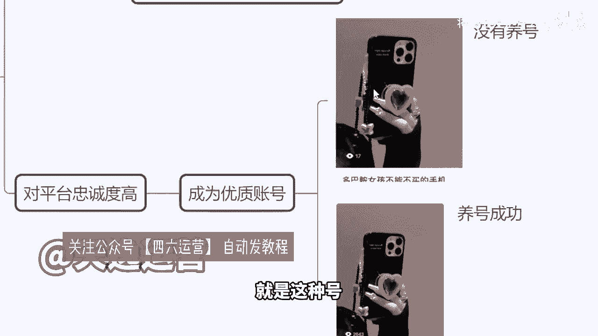

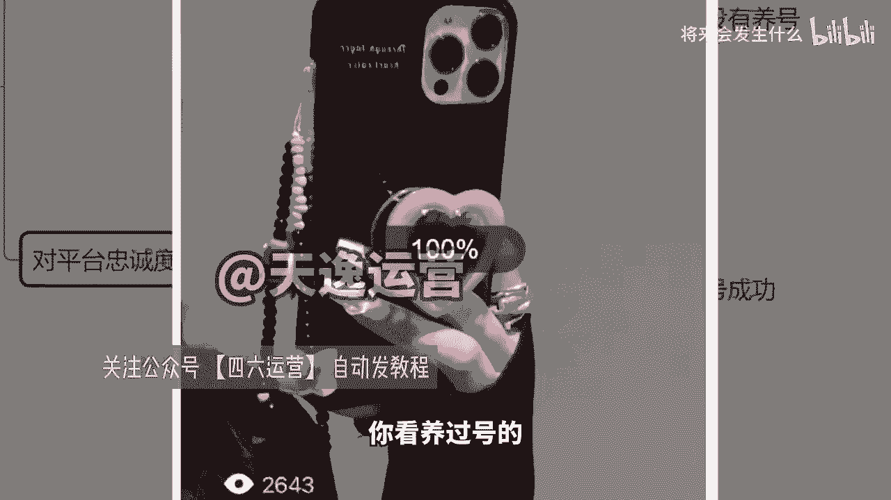

啊，2000多一个播放量。是吧是这样的啊，来，那么这个的话呢，就是属于我们一定要去做的这个一定要去做的这样的一个行为，必须要养号啊。😡，有学想说老师我这个没有作品的有粉丝，那属于平台。

有的时候估计别人刷粉啊，他的一个错乱东西关注到你那里去了。这个很正常啊，我们很多这个新号刚注册完，隔天啊这个连浏览作品都没浏览，直接上来十几个粉丝都有这种情况啊，但这个粉丝是没有用的。

就是我们的粉丝平台在后台识别你的粉丝的时候，他只会识别通过你作品关注你的粉丝，其他都是不做数的。就比如说你000个粉丝有效粉丝可能只有1700是这样的啊。好，那么我们怎么去测试这个账号来给大家看一下啊。

我们之后再养号完毕之后对吧？养号完了以后啊，然后我们先发一篇作品，这个作品的话呢，文字编辑好啊，认真去写。然后图片呢，我们真正准备好，然后去发不过在这里呢我要强调一点，不管我们之后做什么账号啊。

你上来的前两个作品，你不能直接表明自己是个卖家的身份。就像刚才我们看到那个卖手机壳的作品一样，你要写的文案是这个东西是你买的啊，我买来的。😊。

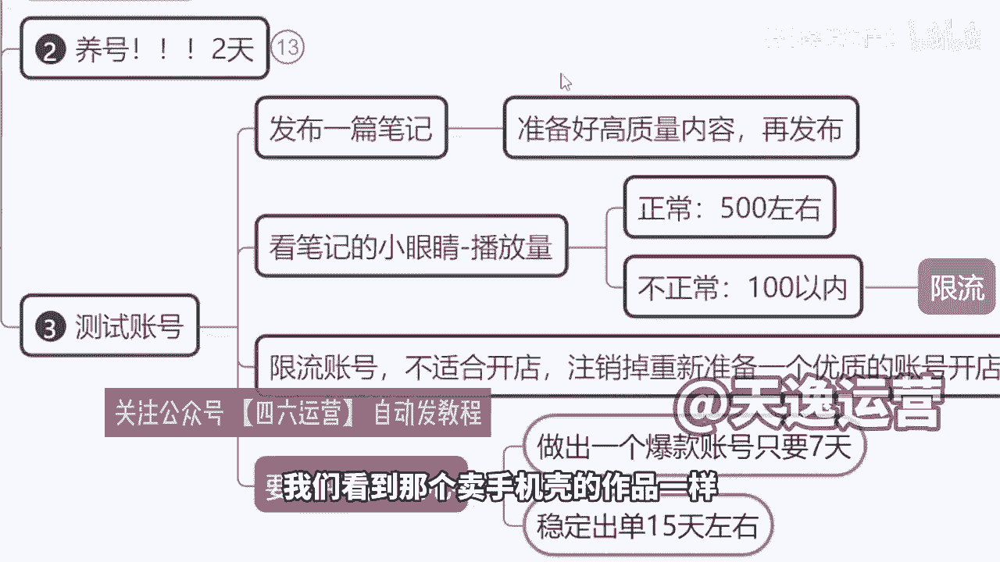

产品跟大家分享我用的好用的东西，我来跟大家分享。啊，你不能直接去发说啊，今天给大家分享一个手机壳啊，这个是我自己在卖的什么9。9块，这个不能去这样做啊。前两个作品不要挂小黄车。

前两个作品只从分享者的角度去分享东西，不挂车。然后测完流量之后，流量没问题，再开始挂车啊。来，那么在这里给大家看一下啊，就是当我们在发了这个测试的作品之后，你等两个小时时间，两个小时过去了。

如果说你的播放量在500左右或者说更高1002000，那很好，这个播放量又算很正常。说明你的账号是正常有推流的。但如果说两个小时过去了，我们的小眼睛啊，100来个70个80个呃。

1170180都属于限流状态，都属于平台没有给你推流啊。因为我们看到的这个100来个流量，它不是说真的有那么多人看了你的作品啊，很多时候是安慰性的一个数字。😊。

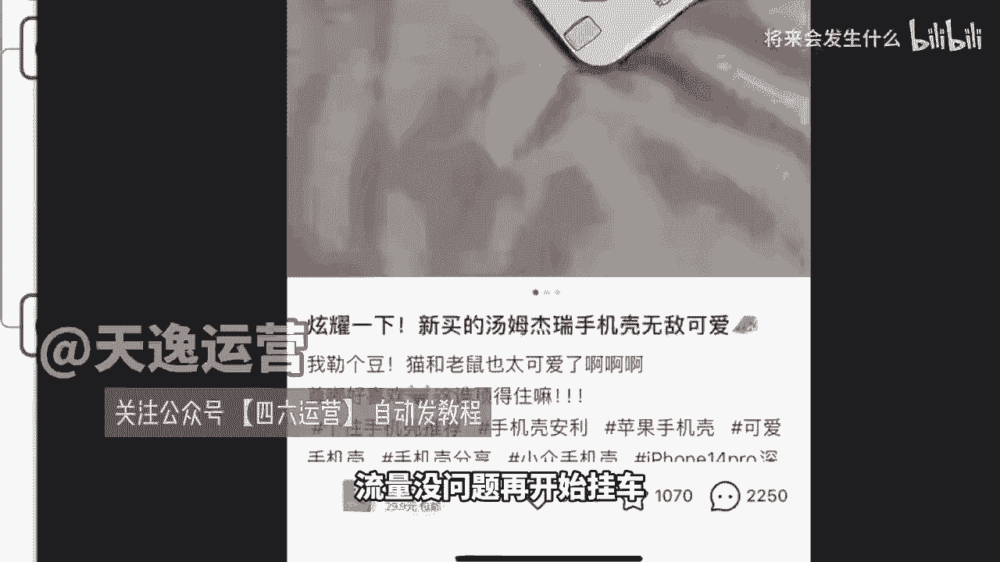

就是平台为了告诉你说啊，你这个作品是有人看的，安慰性给你镶了几个数字，不是真的有那么多人看。所以说这个时候我们的号都是属于限流的一个状态。就像我刚刚讲的，号又不要钱，注销了再重新注册就可以了啊。

这个东西因为小红书去测号的话，抖音的话可能你还得测两三个月的啊。但是小红书的话呢，它是属于说做一个爆款账号需要7天左右的时间啊，稳定出单的话，最起码15天左右的时间。15天左右的时间啊。来。

那么同时呢我们在测了这个账号以后啊，我们发现你发的两个三个作品的播放量都比较稳定的情况下，那你可以尝试去开店。😊，但是如果说我们发的两个三个作品都是在100来个播放量啊，那这个时候我们就可以直接注销。

然后再去注册新的这个账号了啊，然后呃因为是这样的，我们今天是两个直播间开课啊，所以说公屏评论区可能问题会有点多，我不能说一一去回答。

但是我拿个别也跟大家做个讲解像刚才有同学讲到说老师我有的是100多播放量，有的是一两千这个什么情况呢？包括像有同学讲说老师我的播放量全部都在100多，但是我还在坚持发啊，这种情况的话，来这样啊。

同学们如果说对自己的账号不是很确定的，我们可以下了课，把你的账号主页，以截图的方式，然后发给你推课堂链接的那个助理老师，我们的老师都很专业，下了课给大家逐个去分析一下，好不好？

看看你们的这个账号到底适不适合做，要不要注销，还是说可以继续做啊，你们可以下了课给助理老师发一下啊。但如果说你的播放量高，发的是生活类内容，就比如说是你自己的自拍，是你出去吃了一个好的餐厅。

那个播放量再高都不行啊。😊，再高都不行，因为那是属于生活流量，我们要的是商业流量。😡，好，OK这个我们就过掉了啊。然后我给大家看一个我们之前一个学生做的一个号吧，跟大家讲一下啊，为什么人家的号能起得来。

包括他之前为啥没流量啊，跟你们分析一下呃，我这个学生叫李继平，然后他是属于40多岁一个年纪，没有做过抖音，没有做过小红书，就任何短视频平台没有接触过的。😊。

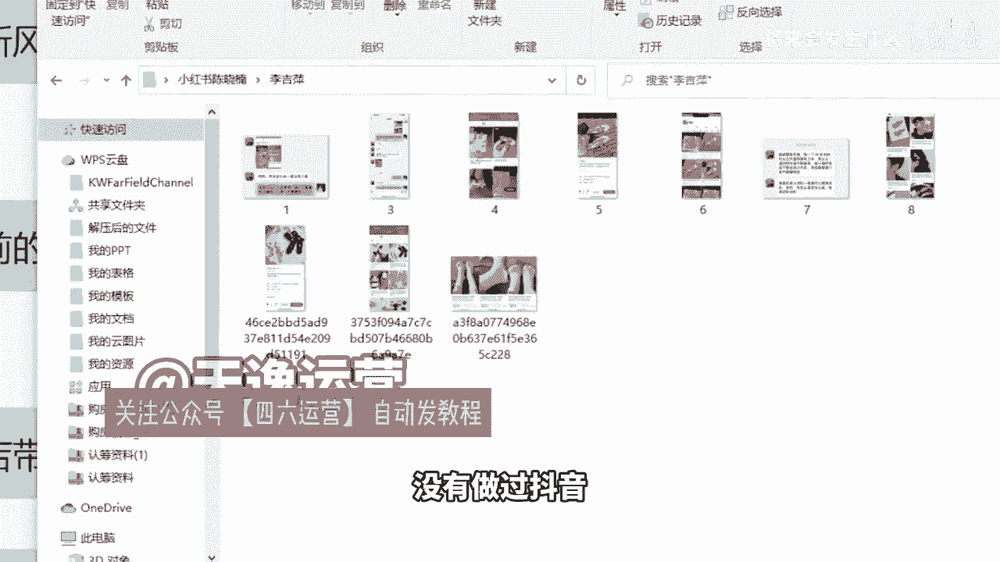

啊，但是他的这个号现在能稳定，就一个月变现，最起码在1万以上啊，跟你们讲一下他的这个情况。他之前的这个作品，如果说有同学你现在发作品没有流量，你也可以考虑一下，就是跟你的发的内容其实也会有关系。

他是什么？他内容实在是不好啊，因为这个审美是有问题的。当时我跟他有讲过，我说小红说的用户其实更多是这种。😊。

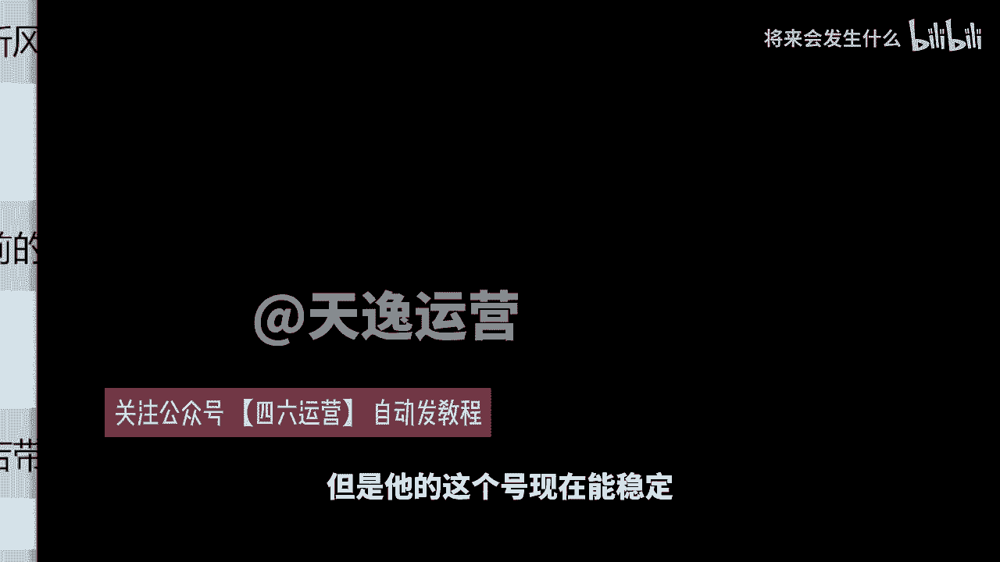

对生活品质有要求的啊，审美有一定要求的用户。所以说如果他去卖这个发卡是可以的。但是他去卖这种图案的发卡就不是很合适啊，就是不怎么好看。另外他找的这个素材拍的很随意是吧？没有什么呃稍微好看点的这个配色呀。

地上就是地板，你要知道啊，我跟大家说一点啊，就他这个图他这个视频，当时发的，你看一个播放量是不是非常非常少，地上很脏啊，地上还有那种掉了头发，没有拖地那种脏的。你说这种作品发出去之后，能有人看吗？没有。

😡。

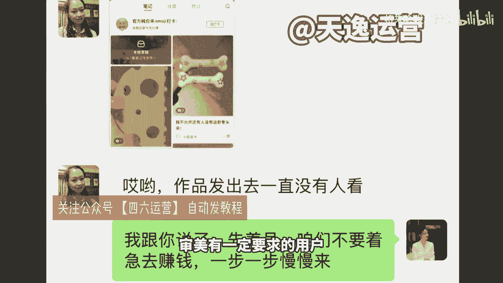

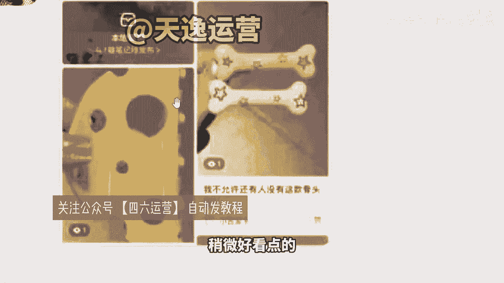

我就跟他讲了，我说啊，但是我安慰，我没有直说委婉一点啊，我说先养号吧啊，先养号，到时候再发换一个号再发这个作品。因为这个作品实在是限流，连人家连十几二十几都没有，他就是一的播放量。然后后来让他换了以后。

我跟他选了什么，我让他我说你去做那种Y twoK的风格。😊。

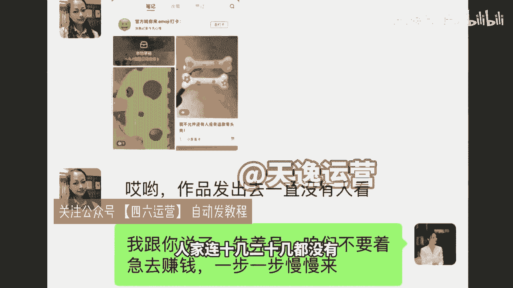

就比如说这种很精致的发卡来看一下这种风格是吧？银色的布灵布灵的带带点小钻的这种发卡。好，这些精致女孩她更喜欢，而且当时流行的一个元素，将Y twoK的一个风格。我说你换这些产品。😡，好，效果立马不一样。

是不是同样是手拿这个产品。然后但是呢因为这个产品的颜值更高，它的效果就更好。😡，啊，当然这个素材也不是他自己拍的啊，都是找这个品牌方去拿的。来，你看一下，当时他13天时间换了产品。

之后13天时间立马100多单啊，100多单那个订单，这个里啊给大家看一下26。9块的一个价格。😊，是吧卖了102单，十几天的一个时间啊，那这个产品是怎么来的？然后包括这个产品拿货价多少钱。

我也给你们看一下啊，像我们刚刚有同学说到说啊老师这个货啊怎么办啊等等的。我这里呢先简单给大家说一下。然后在后面我们讲带货的环节，我再详细说流程啊。首先第一个我们的货源问题，我推荐大家两个平台。

一个是1688，一个是拼多多，但是呢我更建议后者，就是我更建议大家未来去找拼多多去合作。因为1688现在它的所有的产品呢是有点过时的，就它已经不更新了，拼多多里面本身是一个打价格战的平台。

所以说大家很多这个产品已经接近这个拿货价格了啊，所以说到时候我们可以在拼多多干嘛去找工厂店。😊，找工厂店，然后并不是说要你们在拼多多里面下单啊，我下单一个，然后联系那个小红书发货，不是。

而是你找到工厂店之后去加那个商家的微信，然后跟商家去说啊，说我这个呃想跟您合作，我想做代发，然后我想卖你这边的货可不可以，一定是可以的啊，工厂店本身他们就是做代发的。然后给大家看一下啊。

就是我们之后先确定好自己要做的一个类型。后面我详细说啊，现在我不想不讲那么细，我先把大概的跟你们先讲一下，让大家心里有数。然后那么我没有钱拿货怎么办，对不对？你不要去跟商家说啊，你说啊。

老板我没钱拿货怎么怎么地，你不能这么抢，人家一听都不敢把货拿给你，你怎么说你说因为我这边开店开的比较多啊，我是做矩证的，我是做批量的。😡，所以说我们现金流啊没有那么多。😡，先跟您签个协议吧啊。

签个什么协议，先采后付的协议。这个拼多多里面他都支持这个方式啊，这个叫先用后付。但是咱们签协议呢，叫先采后付。啥意思？就是我跟你签订好多长时间来结款。比如说15天或20天，对吧？

那么我先把你的产品挂到我店里上去卖。我卖了一单，你这边给我发货，让你们的财务记好，我的成本是多少钱，等15天到了20天时间一到，我就把钱打给你。那这个时候你的客户也确认收货，你也收到钱了。😡。

你就不会存在说我没钱去付货款的问题了。这个大家能不能听懂，这个都直接是在线上签电子合同，直接电子协议有法律保障的啊，谁都逃不掉的那这样的话，我们前期就不需要去投资钱啊，这个对于新手来讲就比较友好了。

对不对啊？然后像我们当时这个同学的话，他就找到左边那个商家。😡，这里面卖的是6。69块，但他合作价格啊，私下沟通的价格是5。9块包邮啊，这个是包邮的啊。因为本身这个工厂价格很便宜。

那你看他一个的价格是多少钱，一个的利润多少钱，21块钱的利润啊，然后再乘以多少钱，再乘以这个102个订单，相当于说他这个是2000以上的一个收益，对不对？2000以上的收益啊。

就光这一个产品的收益就还不错了。然后他当时第一个月的时候就挣了8000多块钱，就是做带货啊，后面他因为他不止做做这一个项目啊，之前也跟我讲，你看他以前是在图书管里面做管理员。

后来因为他帮帮着他女儿带孙女啊，然后呢，他孙女经常生病，然他老请假就被辞退了。本身收入其实也不高，就200多块钱一个月，他想的时干脆在家找点事情做啊，然后你看现在人家卖的。

这不是现在啊也之前的你看这个发卡不同款式都在卖嘛，对不对？😊。

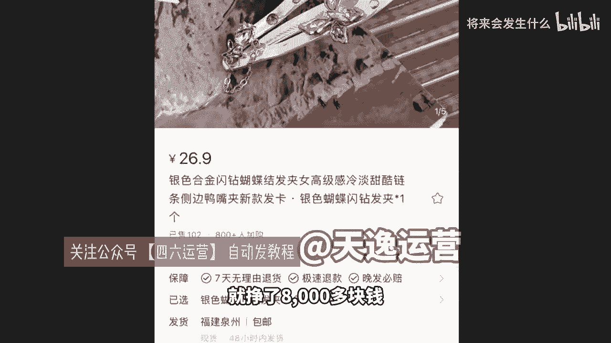

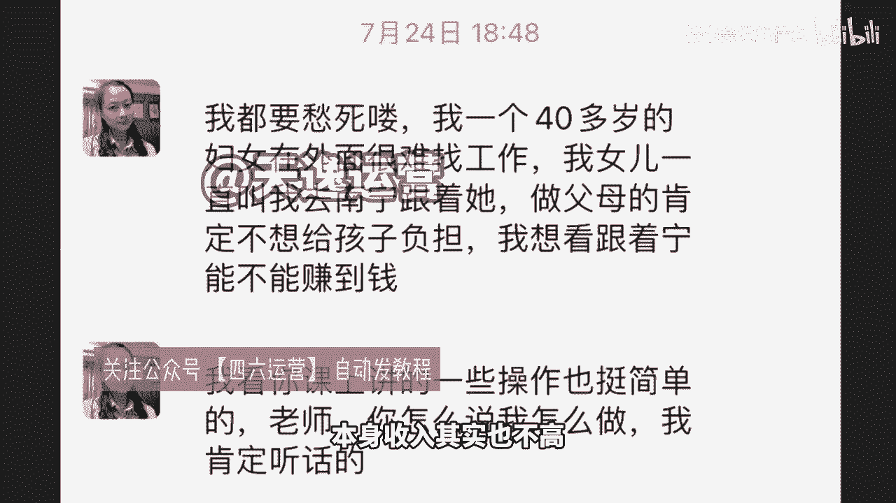

19块989单嗯，28。8135单。🎼24。5块是吧，25单就这种几十单几十单，其实他的一个利润加在一块也不低了。然后他在第二个月的时候就已经上了14000的一个收入啊，现在还做了一套在卖袜子的啊。

就这种，然后你们之后都是可以去走这个方向。因为开店铺，我说实话它是最挣钱的这个玩法。😡。

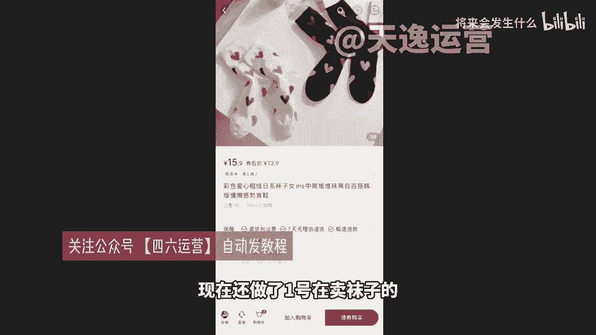

然后现在我们也先讲这个带货啊，先讲完带货，再讲商单变现。因为商单呃我讲一下商单的优势啊，来钱快很简单。所以我们放在后面说复杂一点的，我们先拿到前面来讲啊，属店带货就是开一个店铺我们去卖货。

这个对大家时间有要求啊，你最少一天拿两个小时出来做，有没有问题，一天最少两个小时，没有固定说几点到几点啊，但是你中比如说中一小时，晚上一小时，那是必然的，肯定要的。😊，啊，没问题那就行啊。呃。

我先讲一下。如果说我们做带货类的这个账号。因为带货类，为什么我们要重点讲它是符合目前平台的一个叫做百万扶持计划的。你们可以看一下，这里啊，我直接打开这个小红书官网给你们看。

因为这个东西我光我嘴上讲没有用啊，我们要看平台的，你看这是小红书签翻商城，就是他们的官方商城的后台。然后在这个登录界面就直接写了，买手时代以来，1000亿流量助力买手和商家共同成长。

就是平台是实打实真的给咱们推流量的，对不对？这个东西不能作假作假，人家不可能写在自己的这个官网首页啊，那罚款都得罚死啊。所以说这个是实实在在真的给流量的。那么只要开了店铺啊，一定是能出单的。

那么有句话叫七分选品，三分运营。就是说我们卖的这个产品的类型，他得是符合平台，目前有的一个需求的。我上课以前有同学问过我啊，说老师我是宝妈，我能不能卖小孩的衣服啊，我不建议。😊，来。

我给你们看一下这个图我不细讲啊，这个图你们需要的公屏扣要字。然后助理老师后台拿那个数据统计一下，打了要字的，我们下了课，自己对照那个网名去微信里面给大家去发一下这张图啊，打了要字的。

我们下了课去给大家发一下。呃，我教大家怎么看我这个列表啊，教你们怎么看这个思维导图，这是我自己写的。比如说像同行7600，那可以做不算说特别大的竞争。但如果这种你看T恤2万多个。

是不是你说老师好多人卖T恤呀，我也卖，那就大错特错了，不是这个思维啊，而是卖T恤人太多了，我不掏这个浑水了，做的少的，你去做啊，选择少的，你去做。比如说睡衣可以。😡，家居服可以，对不对？

然后呢啊像这种3C数码的，虽然说做的人多，但是你也可以做什么充电器呀、无线充啊，对不对？快充的那个数据线哪啊，OK都可以啊。然后像这个项链的同行也比较多，然后爆款的这个概率又很低，我们就没有必要了。

在这里我自己写了三个啊，就是目前我们测流量特别爆的。一个是这个母婴用品，一个是百货用品一和车载用品，给你们举几个例子给大家看一下啊，我拿几个产品举例给大家看一下。呃。

其实我们有句话叫做这个小孩的钱是最好挣的啊。其次是这个女性。😊，对吧，然后所以说我们其实就可以从这些角度啊，我们去考虑这些问题来给大家看一下，就这些啊，比如说像这个你看粘毛器，狗狗的。😡。

这个东西成本多少钱？卖价36。9块啊，对吧？你们看不清楚，可以横屏一下啊，因为我们这个图放大不呃，这个图放大不了啊，你们就可就得这个稍微咱们这个呃斜一下看一下啊，然后这个36。9块的一个价格，对吧？

我们真正它的一个成本价格才3块多钱，3块多钱，所以说这个也是可以去变现的一个方式，然后包括这种手套啊，然后这个除毛器。😊，这个成本才1块钱。啊，然后包括这边你看这个套耳勺，对吧？29。8块成本多少钱。

也3块钱。😊，也是3块钱包邮啊。对，这个是包邮，就3块钱包邮的成本。😡，3。9块包邮的成本，23。9块的一个杯刷，这个东西1块多块钱的一个成本。😡，啊，因为像这种东西呢。

它其实我们会觉得说好像快递很贵呀，我去菜鸟驿站寄个快递12块钱啊。你要知道，其实我们真正去合作了这个物流之后啊，很多小的不占面积，不占体积的这个产品，它几乎物它几乎运费是跟我们直接省掉的。

就是五毛钱1块钱的这个运费都有啊。然后包括像这边你看9。9块的这样的一个盒子，对吧？包括这个建麻的一个这个猫扎板，它那个价格49。9块，成本十0来块钱。😊，啊，成本十来块钱，还有像这个啊像这种产品啊。

有特也想说老师，那我那边运费高，这个怎么去处理啊，我们之后去卖货的话，是不需要我们自己发货的啊。就是我不建议大家把货囤到自己家里，然后你自己再发，这个是没有必要的，就相当于说我去卖别人的货，对吧？

我卖他的产品，我今天把所有的产品的订单导出来之后啊，有这么20个单，那么他会有一个数据统计，每个订单，他的收货地址等等导出一个表格，直接甩给那个商家，让他安排发货就行了啊，发完货之后，订单号发给你。

你去填就行了啊，就是这样的。然后那么我建议大家去做的产品。除了我刚刚讲的这些就是类型之外啊，就是我们得去考虑一个点，就是他的颜值高不高。😊，我们不用管他这个东西有没有用，你就看他颜值高不高。

因为像小红书里面卖的很多，像之前有一个很火的叫loy的一个那个呃。😡，摆件啊那个玩偶是不是就那样的一个东西，我说实话就韩国流行过来的，我觉得不是很好看。但是小红书里面很多人喜欢。😡，啊。

然后还有各种带钻的呀，布灵不灵亮的呀啊，即使说它成本很低，都是可以卖高价的。然后像这种水杯也是一样的，你看一下啊，就这样一个小眼睛的这样的一个保温杯，对不对？拼多多17块17。6块啊，这边227。

8块的一个价格，包括在过年的时候卖的很好的这样的一个车载挂件啊，拼多多里面呢就16。8块的一个价格，小红书卖49。8块。所以说在小红书普遍普遍来讲，它那个价格更高，另外包括像我们看到那种手机壳什么的啊。

这个在淘宝啊，拼多多有这个2毛钱的啊，有2块多钱的是吧？有这个3块钱的小红书都29。9块39。9块，就这样的。😊，就这种包括像我们其实很多时候在卖母婴产品的时候，发现很暴力一个东西啊，耐拼。😡。

🎼对吧我这个成本我去拿货的时候，这个成本才18块钱。再想我说我甚至可以卖到160180的一个价格啊，这个就是我们挣的就是这个平台里面有收入，有收入，有这个高收入或者说有消费力。

有购买力的这一群人的这个钱啊，那这是我们要做的。😊，来，那么我们先来看一下开店是否要投资的这个问题啊，就是我开店要不要花钱呢？开店其实是不用花钱的啊，但是因为你想要把这个店开下来，想拿开店资格。

有人会花钱。😊，有人会花钱。呃，我跟你们讲一下，就是目前开店的话是这样的一个情况啊。呃，像有同学来有没有开过店的，有没有有开店的？😊，有没有已经在小时开了店的，有没有流量啊？长腿同学说有啊，有流量没有？

😡，没开的，咱们先不用打字啊，没看的，不用说老师啊，我上课很积极，我就一直配合你。😡，很少流量，对不对？有一点，但是不多啊。好，那就对了。来，我跟大家讲啊，我跟你们说一下，就是小红书。

我们不说其他平台啊，我就讲小红书现在这个平台，它的一个这个流量的一个问题。首先我们刚说了小红书有千亿流量扶持。我讲过一个点，我说只要你开了店铺，对吧？那么平台就会给咱们推流，但是这个是有条件的。

因为店铺它分两种，一种叫做普通的个人店铺，😊，普通个人店铺呢，他不需要你有经验。😡，不需要。经验谁都能开，但是它是概率性问题，就是可能10个人申请，只有8个人下店，10个人申请6个人下店啊。

他不会给所有人下店啊，但是大大概率会通过你只需要上传身份证，那隔天就能下店，对不对？有开店的，是不是你只上传身份证了？😡，然后你也没有客户经理，没有客服经理，对不对？没有店铺经理。😡。

就是你没有一个专门的助理，是平台给你配的助理，是没有的，对不对？那么这种店铺啊，你开了之后，你发现没有流量正常。因为第一个平台现在要做口碑，他不确定你卖的货是不是好产品，有没有质量保证。

不知道你到底有没有店铺运营能力，他不会轻易给流量给到你，因为他根本不认识你也不信任你，这是很正常的。那么还有一种店铺叫什么呢？叫做内邀店铺，跟大家来说一下啊，内邀店铺。😡，是哪种呢？

他要求你必须有电商店铺经验，销售额单月流水是要突破10万的，单月流水要破10万。你可以是在抖音开过店，可以是在淘宝开过店，你需要向平台提交你的流水证明，并且店铺的存活时间是在半年以上。

就是近半年每个月都有这样的流水，有稍微一两万的偏差没有关系，但是存活是半年以上的时间，证明你是有店铺经历的，有店铺经验的那么就相当于说是平台吸纳人才的这个方式把你邀请进来啊。

那这个时候你会获得流量扶持的店铺。你的店铺呢它不属于普通个人店铺了，就像内邀个人店铺一样的，不用营业执照啊，同学们不用去注册营业执照，小红书好就好在你只要有身份证就能开店。你就算是在政府机关单位上班的。

你说我不方便搞副业的，小红书店铺你都能开。我们有很多在消防局，在政府这个在纪委单位上班的都是。😡，一样的啊，都是有在做这个店铺的啊，赚一份附业收入。因为他不用营业执照，你有身份证就能开店了啊。

这个是他非常非常方便的一点。你在抖音上都要都要营业执照的啊，那么好一样的，上传身份证，那么就可以下店了。像这种店铺的话，才是有平台流量的一个推送的那其实今天我们大部分人是达不到的，对不对？比说老师。

那我根本没有这个经验怎么办？现在市面上的有卖那个假资料的。😊，就跟你买房一样，流水不够，贷款办不下来，对吧？做个假流水是一个道理啊，这个店铺也能做假流水啊，然后呢给你去申请店铺，但这个封店的风险比较大。

不建议你们花这个冤枉钱啊，2000块钱也不少了。那么所以说我跟大家讲，其实开店的话，因为小红书它不像抖音那种啊，就是我谁来都来啊这个谁来都行，对吧？我不在乎这个你的到底有没有能力，但小红书不一样。

因为小红书本身它的格调啊，它的调性跟抖音就不同，他走的是高端路线，所以说他会他会审核这个电商经验。那么我跟大家讲一个就是我能解决的一个方法，这个也是我个人啊，今天跟咱们这个公司无关。

就是我个人的一个想法。因为我现在作为我们这个企业来讲，我是去承接了这个。😡，小红书它的一个达人孵化的那等于说我是有资格带大家来参加平台的一个百万的一个店铺计划。我跟你们讲一下这个东西啊，百万店铺计划。

😊，那么这个计划就是我前面讲到的，你只要参加了，那么你的店铺销售额达到10万，有奖励，现金奖是1000块钱，达到20万，有奖励，达到50万，有奖励。他每个跨度有不同的现金奖励。那么在这种情况下。

他是需要有带教人的啊，就是你是有人去带进来的，有人。😡，有人来帮你申请的。那么如果说我作为你代价人，其实我们是合作关系啊，就是你挣多少钱，你挣100万，挣100万跟我们一分钱关系没有。

就是我不会分我不会分走你的任何利润。但是如果说你的店铺是我这边申请，我们以内邀的方式把你申请过来。然后我向平台提交资料，对不对？好，那么你能有钱我也有钱，就是你有奖金，我有奖金，是这个方式。

那如果说大家觉得O这个我还挺挺喜欢的，我能接受对吧？我想要有一个这个有流量扶持的店铺，那到时候我可以帮大家搞定，是这样的，我会以我公司的名义，我跟平台讲，这个是我们公司运营的店运营要申请的店铺。

然后让他去给我内邀名单，给我内邀名额，然后我把你报上去之后，你一样的会拥有一个平台的店铺经理。然后但是呢他们一定会给你打回访电话，就是给你确定说你这个。😡，是从哪里了解到我们，你要跟他讲，我是小文的呃。

比如说是我团队的人啊，或者说你是我的员工都OK啊，你要这么去讲，你不要说接了电话说我是小白，我什么都不懂，对不对？这个就不行啊。因为平台他的要求是必须是有经验的，才能参加这个活动，明白了吗？

有多少同学是想开这个店铺的，咱们可以打个开字啊，到时候如果你们需要的话，咱们可以合作一下。😊，我们可以合作一下。那这种开店铺的话，是不用去掏钱买资料的，也不需要说用什么假资料，有封店的风险啊。

就相当于说我们直接会向平台证明你就是一个专业的运营。然后呢，给你这个开店的资格，我们是以这个方式去申请的啊。嗯，那么好O这个我就说到这儿啊，这是关于一个店铺的问题。那么这种店铺的话就有流量。

像我们自己员工给你们看一下，多夸张。过年回来以后啊，过年在家里找了七八个亲戚啊，借手机号来用。因为他们不刷小红书嘛，也不用小红书，干脆把手机号借过来说啊，借你手机号开个店，借你手机号开个账号。

拿他们的实名一用挣的钱呢，打你自己卡里就这样的，看到没有？15台手机直接摆桌上一起做的。😊，🎼啊，手机买了好多2222手的那个手机啊，34010台就这样做的，是不是为什么啊？因为现在黄金时间嘛。

流量是扶持期啊，然后一个身份证的话，可以帮大家开一个专业号，一个店铺啊，一个个人店铺呃，在海外能不能做，在海外一样可以的啊，在海外一样可以的。😊，嗯，来，我们OK我们再来看第三个啊。

就是那如果说我们确实是去开这个店铺的话，我们的作品怎么去发，是不是内容我怎么来去处理啊？来首先我们在小红书去发一个作品的话呢，它无非是这么几个组成部分来我们看一下。😊，给大家找一个啊。

就这种你看我们随机点开一个这个啊这个内容，你看它就是这些图片啊，图片啊加上一个标题对吧？加一个标题，加上一大段文字啊，加上对这个产品的介绍。好，OK这就是这样的一个这个作品的一个组成，不需要去剪视频。

不需要去做那个很长的那个作品啊。好，那这些图片怎么来，咱们自己拍还是怎么回事啊。这个文章又怎么去写这么长，我都不了解这些什么美容仪，我怎么来写。来，现在我来告诉大家，我们具体一个操作方式。

第一个图片问题。其实更多的啊，我们如果说去卖货的话，你的图片组成，一个是产品的实拍图。😊，产品实拍。就真实的拍摄的，手拿的也好，那个产品放在一张床上，一个好的背景，拍一张也好，产品实拍图。😡。

然后再一个真人的。😡，体验图。对吧比如说我是一个卖化妆品的上脸的效果，我卖假睫毛的，贴上之后的效果，对吧？然后我卖等等这个其他产品在使用过程的效果，卖个沐浴露，你得去拍那个手上有泡泡的啊。好，来。

这个是真人体验图，加起来的话呢，最起码有个4张左右的图片是最好的啊，4张左右图片。如果我们追求这个产品的。😡，追求这个作品的一个效果。来，最好呢是有对比图。我对比图是最好的，就是我使用产品前。

使用产品后的这个效果，那是不是需要我们自己拍呢？不用。首先产品实拍图从哪里来啊，你找商家，因为像我们有的时候卖了一些货啊，他没有品牌，他也没有任何知名度，甚至说我在淘宝我都找不到这款货啊。

那你就要联系商家，因为他们有自己的美工，你让他们的。😡，商家给你提供实拍图，你说我要别人没发过的，或者说您这边能不能安排美国现场给我拍一下啊。因为我这边是呃要做这个账号，我是做自媒体的。

帮您宣传你的产品，他一定会给你啊，这是第一种方式。那如果这个产品刚好它是其他平台也有在卖的那就更好了。有现成的素材，我们可以拿去用啊。好，这个是一个那真人体验图从哪里来？

既然我们讲小红书是一个升级版的高端的买家秀平台，那图片我们不妨就从淘宝买家秀来，对不对？来给大家看一下啊，我们直接在手机也好，在电脑也好，你到淘宝的这个界面去，我们直接去搜这个。比如说我今天要卖假睫毛。

😡。

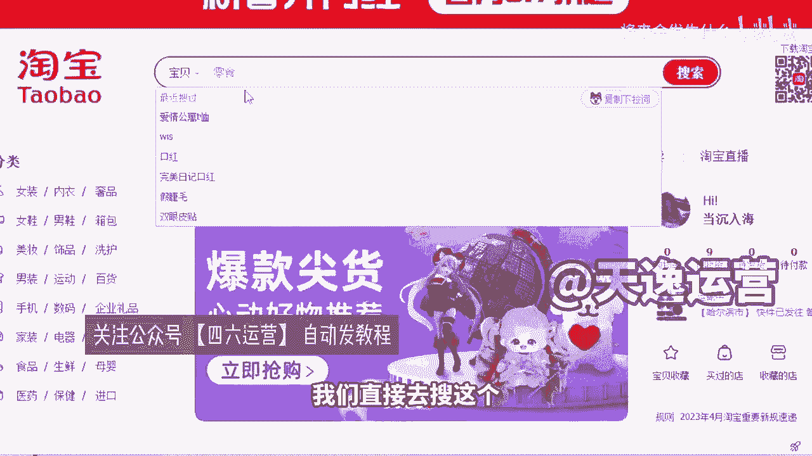

对吧我直接去搜假睫毛，来，我登录一下我账号啊，稍等一下。😡，给大家来看一下。

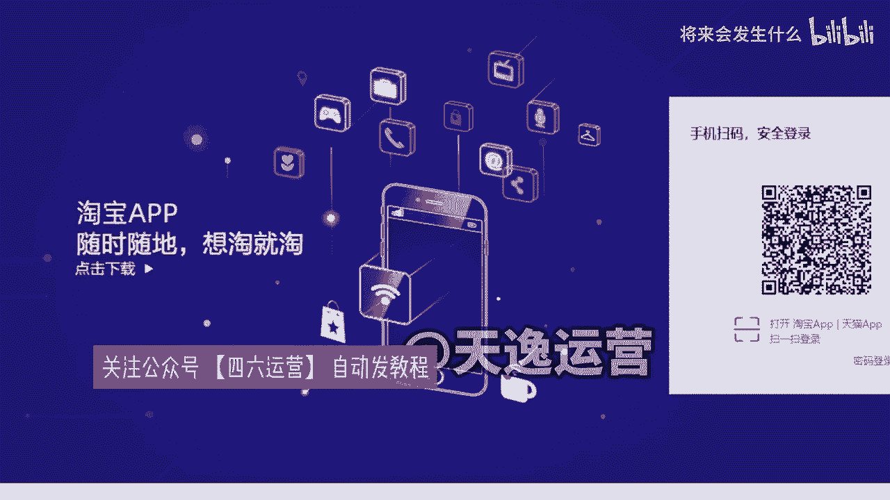

好，登录上去之后啊，到时候我们直接在小嗯来稍等啊，这个还要再加载一下。😊，好，就这样的，比如说我们搜了假睫毛以后，然后你们尽可能去看那个销量高的，看销量的那个排行榜。我们去找销量高的那个产品啊。

比如说这样你看我选这个销量对吧？第一个的这个6万多人收货的这个9。9块的啊，我不管这个产品跟我卖的款式是不是一样的啊。像这种假睫毛啊、沐浴露啊、香水呀那些啊，然后包括啊像什么粉底液呀，对不对？

然后包括像什么身体乳啊，啊，就这些东西用在身上是看不见牌子的啊，你找其他品牌的都是可以放心用的，你找其他品牌买家秀都可以用，我卖的这个牌子，蓝天牌身体乳，但是我用的买家秀是这个多芬的身体乳的。

买家秀都没有关系啊。来，那么我们直接进入到它这里面有个宝贝评价是吧？有宝贝评价这里面有很多人是上传了自己的买家秀的那我们就去里面找一找有没有稍微高质量一点的这个图片啊，比如说这个你看一下。😊。

这个好不好看，能不能作为我们的这个买家秀来用啊？我们要注意点啊，就如果说这个美女有点美的太过头了，就是一看就是像个网红，像个大明星似的那种太美的，咱们也不要啊，不真实，稍微有种邻家女孩的感觉。

像是我们身边真实存在的那种颜值啊，这种图我们可以拿来用，对不对？我们可以拿来用，包括底下再看一下，像这里。😡，是不是这些啊再往下。你看这个还有对比图的那更好了，是不是还有对比图的那更好了。

我们都可以拿来使用。但是为了避免啊，因为我跟大家说一下，为了避免重复，比如说你去买这个产品，你用了这个买家秀，别人也用的是跟你同样的一个图片就很尴尬了，是吧？我们最好是往底下多翻一翻啊，往底下多翻一翻。

只要越往后啊，用的人越少的，那我们可以拿来使用，是不是？然后像这样的图我们是不是就可以直接直接拿来发了，对不对？但是我跟大家讲一点啊，因为这种图片，如果你直接去点击下载。

那么它的一个图片代码是淘宝的代码，是不可以直接发的啊，因为这个代码的问题会导致我们的作品是违规的，那么怎么办？手机截图会不会。😡，手机截图会吧，你把这个图片点开，不要直接保存。

我们用截图的方式把这个图截下来，然后再用。😡。

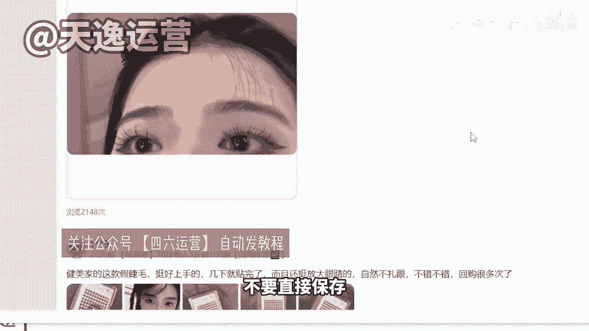

然后再用。那么这个时候大家会面临一个问题，我如果说拿别人的买家秀，别人上传图片去发作品，我不会造成违规的现象吗？是不是我不会侵犯他人的那个肖像权吗？我跟大家讲，小红书本身我们走的就是一个买家秀的路线。

那么我们在发布了这个作品之后，你不能讲这是你本人，你要在我们的文字当中去描述，比如说涂几图几是试戴效果，你讲清楚，这是产品的试戴效果，你不用说这不是我啊，你就说这是产品试戴效果，明白了吗？啊。

我们这样去讲就可以了。我们这样去说就可以了。如果遇到本尊要求你下架，那咱们就下架换成图片就可以了，这个是可以去操作的啊，这个是可以操作的。我们目前在小红书看到很多这种真人露脸的都并不是这个账号本人啊。

并不是这个博主本人好，这是第一个方式，在淘宝买家秀直接去获取这个图片，是不是真的很方便，对吧？这里面还有好多啊，你看每一个是吧？你要为了好评返现啊，给他回一个这个图片。😡。

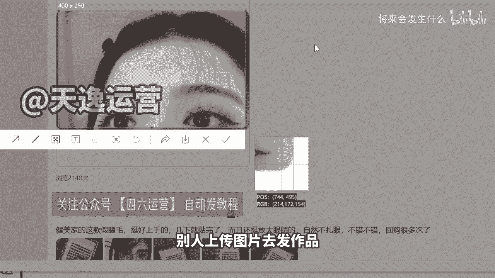

那这个咱咱们是可以拿来使用的啊，这个还有清纯的啊，对不对？好OK那除了这个以外呢，还有一个方式在抖音。😊。

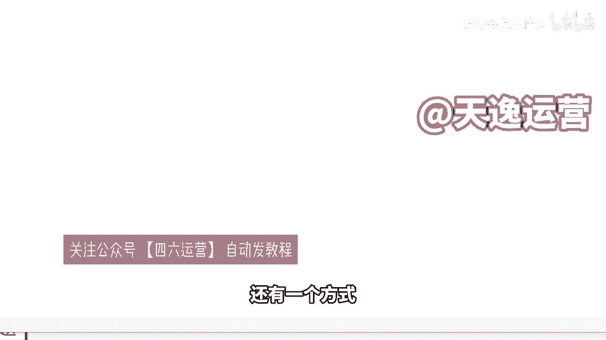

啊，因为抖音现在电商做的很成熟，在抖音里面带货答人是很多的那这个时候来我给大家。😡。

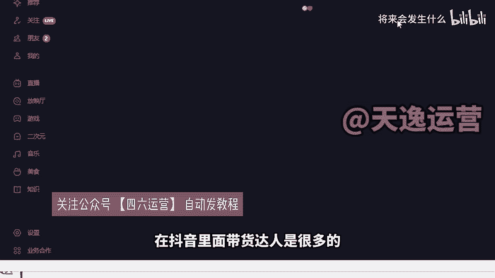

🎼来，比如说这种啊像在抖音平台里面也有这些带货的一些作品。那么但是呢我们要注意一点，如果你用的是抖音已经签约公司的达人的素材啊，就好比说这个博主他是签了公司有M森的，对不对？

那么你是不能只用直接使用人家的全脸的素材的。比如说你看他在他在卖的这一款假睫毛啊，他是有一个什么，他是有一个试戴过程的。唉，那这种素材就很好。因为你看他有这样的一个对比，是不是普通睫毛啊。

然后带上这个款式之后啊，对不对？有这样的一个效果，那么我们在使用他的素材的时候，一样使用截图一个方式，但是你不能够把他的整个脸部的所有五官都截下来，你只能去截部分，比如说我截他单只眼睛，光是这样一张图。

其实也很好看了，对不对？普通睫毛是这个效果，他带上我们的产品之后是另一个效果，这个使用前使用后的对比图，他是不是也有了。😊，🎼对不对？是不是也有了，像这种视频里面去截图使用的素材，重复率反而还会低一点。

就是没有人跟你撞款，没有人跟你撞型啊，发出去之后效果可能会更好。这个是我要教大家的几个这个方式啊。然后当然呢我们会遇到一个问题。因为我是电脑打开，你看这个点赞啥的，在边上不会遮挡，对不对？

你们正常在抖音里面呢，这边有个头像有个点赞，有评论什么的，把这个视频遮挡掉了。那如果你直接下载呢，它又会带一个这个抖音的logo在上面就很尴尬。如果之后我们想要使用这样的一些素材的话啊。

到时候呢我去给到大家一个工具来给你们看一下，咱们不要去点下载视频啊，我们一定要去复制这些视频的链接，在手机也是一样的操作。然后呢，我会给大家去送一个工具，这个工具是可以免费去水印的。

在咱在咱们的这个微信小程序里可以直接用啊，点击粘贴链接就好了。😊。

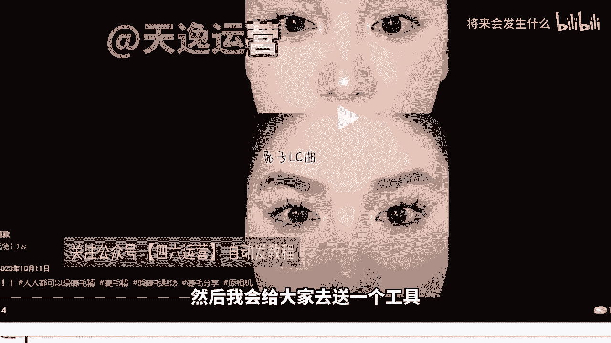

直接人家的整个视频给人家copy上来了啊，水印什么的完全没有。我们再到这个原视频里面去做截图就可以了。来，这个大家听懂记住了没有？听懂来，咱们扣个一啊，记住了明白了，公屏扣1。😡，🎼嗯，好。

OK这素材问题啊。呃当有同学说老师，那我能不能去找人拍呢？当然可以，我为什么不建议大家前期做原创？因为你的试错成本很高，我们并不能确保说我请的这个模特给我拍的视频就一定能火，那每条视频都是一个成本。

在这个时候你前期投入资金过高的情况下，你很难获利。但如果说我们前期以这种搬运的方式来进行，对不对？那么效果会更快一点，会更显著一点，等你的收入上，你说像我们现在有同学能做1万店铺的，你到达人家那个水平。

你再花钱找模特做原创，因为你之后那个账号想长久引流嘛，对吧？我想长期做，我想做的更大一点，你再去什么找模特去拍呀，拍这个照片什么的，拍这个图也就100块钱一张，请模特拍就100块1张。

但是现在没有必要去投这个钱。说实话啊，来O这个是简单的素材，我们去找这个素材的一个方式。😡，🎼Yeah。啊，然后再来讲第二个啊，我们要说到的一个标题的这个问题。然后这个关于标题的话。

如果说我们有原创精神的同学啊，你说老师我文字还不错，我愿意自己去写。然后我今天呢也给大家送个小福利，这个咱们下了课可以找助理老师去领啊，记住找助理老师领啊。你们看一下。

就这里面呢我给大家去总结了一些关键词就不同类目的一些关键词就是在我们的呃标题里面可以去体现的，因为我们现在如果说你的标题里面，比如说别人在搜索的时候啊，搜这个。😊。

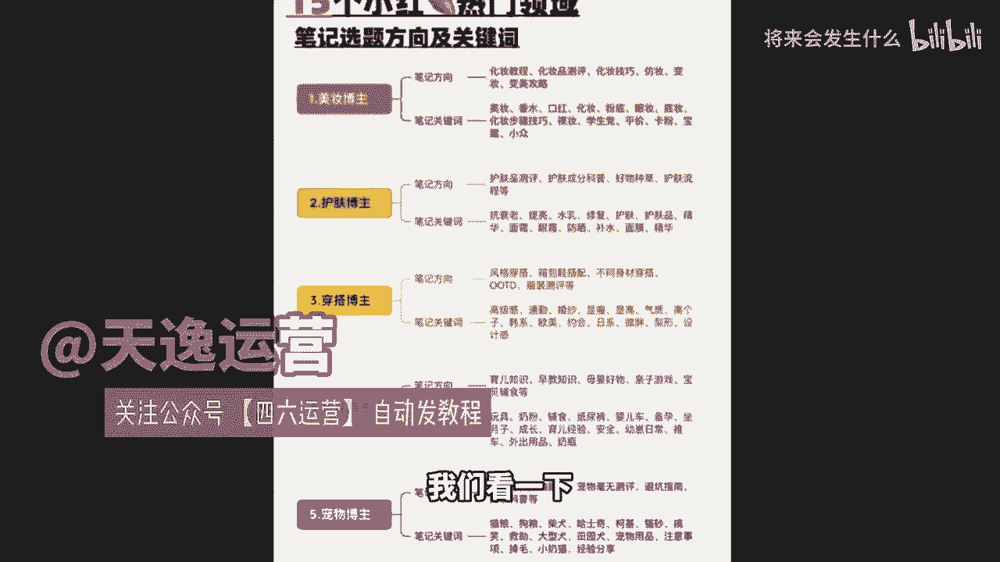

淡斑对吧？搜美白，那刚好你卖的这个产品是有美白功效的，你就得在那个标题去写上美白两个字啊，就是你得带有这个关键词，对吧？什么修复啊、精华呀、护肤品啊。

人家搜的时候是可以通过这个关键词搜到你的那所以说我们在标题的时候就要注意去加上这些关键词啊，然后这个关键词的话呢，在这里我就给大家总结好了，到时候你们可以下了课找助理老师去领。

然后另外一个就是做爆款标题的这个点，然后这个标题呢是给大家总结了一些目前带货效果还不错的啊，然后把这个标题给大家拿出来了，把这个词啊给大家扣掉了，你们也可以去带入进去，然后呢去形成一个新的标题。

但是不能直接用啊，就好比说人家这个是这可能是全网最清楚的美白教程，对吧？但是你不能完全照样的把这个去写进去啊。因为这个跟别人是重复的。所以说你只能说去模仿他这句话再写个类似的写个类似的啊。

这个是我们适合有原创想法的同学。😊。

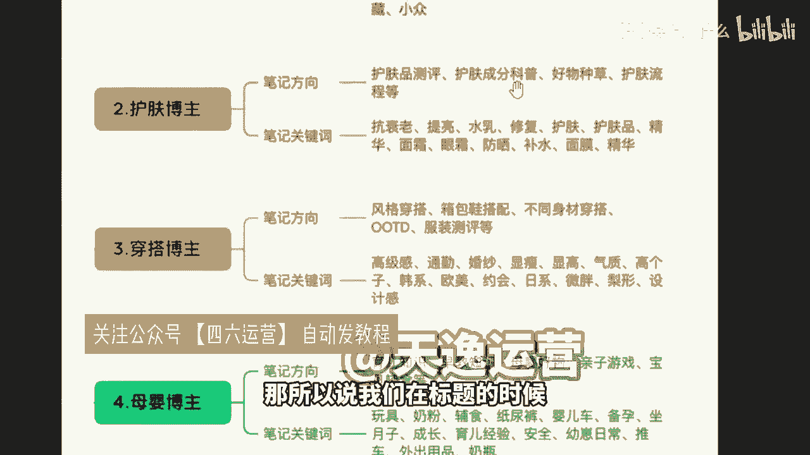

但是实际上其实我们自己在做内容的时候，一般来讲我们不会做原创。

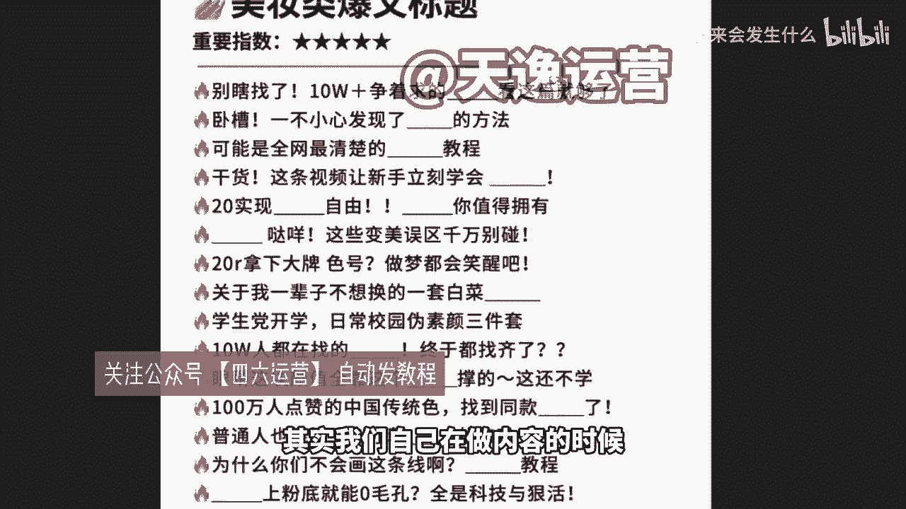

我们是怎么做，不会说自己去写啊。呃，我想问一下大家知不知道什么叫做叉的GPT。我现在跟大家讲个黑科技啊。😊，讲厉害的一个东西。然后这个软件的话呢呃是我自己团队做的，我们自己研发的。然后但是说句实在的。

我们本是它的一个本体啊，我们是借鉴了一下海外的chaGPT啊，我们是把他们的核心技术拿过来了啊，copy了一下啊，然后做了一个升级迭代。😊，知道哈人工智能能帮你高考，能帮你写论文。

能帮你写周报写月报写工作总结啥都会啊。嗯，对，然后但是呢我们现在国内它其实是没有一个针对于小红书的一个版本的，然后当时我们在跟小红书去讲这个合作的时候，他他们他他们当时就跟我们讲了说现在做小红书的时候。

其实很考验写稿能力啊，就是说小红书确实挣钱机会多，但是很少有人能够在小红书有这样的一个机会，他不像抖音啊，你能剪一个视频出来，你各种素材去拼接，你就能做一个能够做爆款的一个作品。

小红书不需要有那么复杂的视频，但是他对于你的文笔有要求，就是你写的内容能不能吸引任，能不能抓人，更多人在刷小红书的时候，是看除了看你的几张图片，那几张图片有什么好看的，对不对？更多是看你的文字。

对于这个产品的描述，你对于这个产品的心得体会，他觉得话真的很真实啊，写的很好，对吧？有吸引到他他才会下单才会去消费啊。所以说这个文字是很重要的那怎么办？咱不会写，我也不知道我写的东西到底能不能做到爆款。

能不能吸引人。那你。😊，不妨交给AI来做啊，我先给大家看一下啊，这个工具我不是拿来卖的啊，我就是今天给大家做个分享。到时候如果说你们做小红书，能把这个工具用上也是事半功倍的啊，来给大家看一下。

比如说我今天要做一个标题，对不对？那么我要写这样的一个内容。如果自己去写，它不一定是爆款。但是如果用工具的话，它的素材的呃采集呢是来自于小红书本身已经有的这些爆款标题，然后呢，它通过模仿的形式啊。

达到80%的原创度给你写个新的出来。😊，我们看一下，比如说我今天要卖一个这个我想个产品啊，比如说我们做一个什么好呢？😊，墨镜吧。是吧比如说墨镜啊，然后呢我的要求是吸引眼球，大家想做一个什么标题。

你们也可以说一下啊，想做一个什么产品。然后我给我给他我给大家去示范一下啊，吸引眼球。😊，不要说大范围啊，什么女装那些不要讲啊，你要讲产品的名字啊。😊。

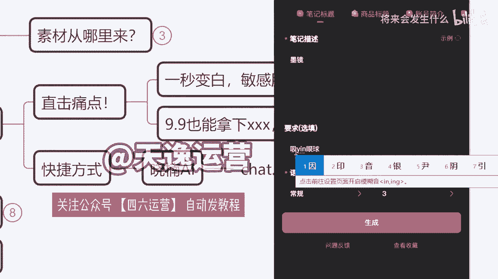

新眼琼。来语气我怎么选？如果说你想更亲切的口吻，我们可以选友好的啊。然后如果说是奢华来这样吧，我们有一个小葛同学收到的一个珍珠项链。来，我跟大家讲珍珠项链好了啊，我跟大家讲为什么？

因为它还有一个好的用处，来珍珠项链。😊。

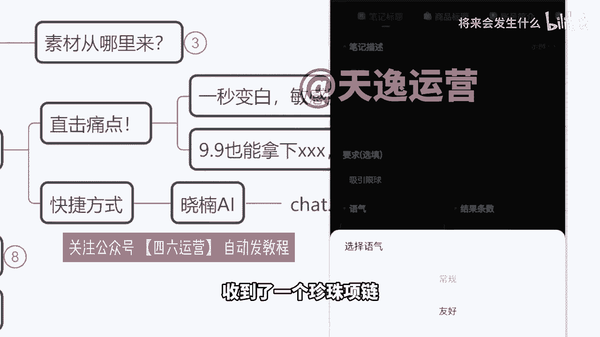

我们用这个的情况下，你看它是可以做区分的。如果我卖的珍珠项链价格很贵，对吧？它是1000多块钱一条的，真正的高端的产品，那么我们不能很随意去写，我选奢华的，我点击生成它的词藻就会比较华丽。你看一下啊。

奢华的象征。😡。

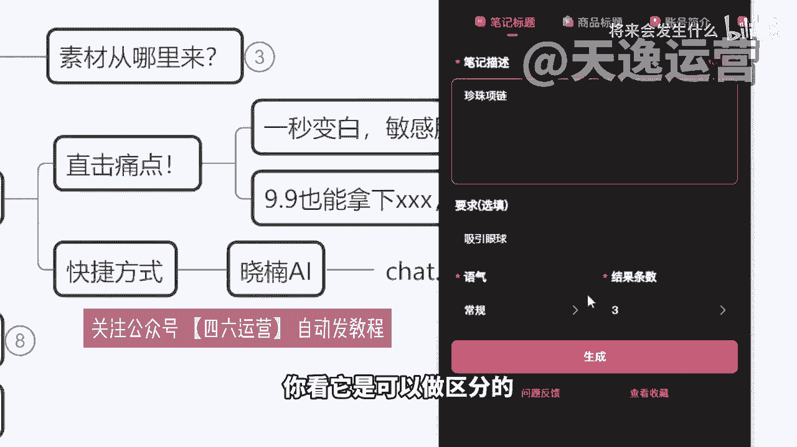

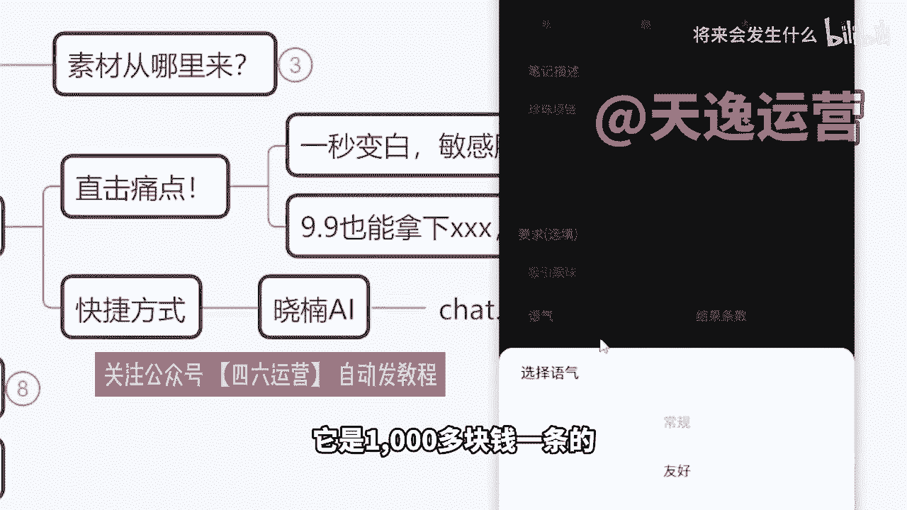

一块珍珠项链的奢华魅力，揭秘顶级珍珠项链的设置风范等等。哎，他写个这样的一个内容出来啊，你们能看清楚吗？在底下，如果我对这个内容我不满意，我点换一换，然后他立刻又会给咱们写新的。😊，看到没有？

又会写新的。😊，啊，以这样的一个方式给到你。如果这个我还不满意，再点换一换，它永远不会重复。但如果说今天我卖的这个珍珠珍珠项链，它是属于什么？它属于那种low货啊。

就是50块钱的人造珍珠是塑料的那我们就不要选奢华，你选什么亲民一点的，咱们选个友好的啊，我再点生成来看一下，这个时候就不一样了。😡，啊，他就不会说有那么辞早的话，那么华丽的一个词藻了啊。

你看如何挑选你的完美珍珠项链，小红书精选指南珍珠项链搭配数，让你轻松成为优雅焦点，对不对？来这个标题写的好不好？大家觉得这样的一个标题好不好？😡，能不能用？😡，来看啊，好是吧？还不错。

珍珠控必看如何选购与保养你的珍珠项链，每颗珍珠都有故事。珍珠项链的时尚演绎之旅，小表情都给你带上了，小表情都带上了，这种就是便宜的啊，它一定会有的这个小表情，贵的，人家就不带表情，因为要严肃是吧？

要庄重啊，这个就不一样来这个标题咱们就搞定了。无论是哪种品类，哪种类型，包括甚至说哎我做个沐浴露，对吧？我做一个沐浴露也是一样的，我选个友好，或者说我就选个常规的吧。来，咱们选个常规的再点生成。😊。

🎼你看宠爱自己从沐浴露开始，对吧？让肌肤喝饱水的秘密啊，来，我们重新再加载啊，刚刚跟那个融合了沐浴沐浴小确幸，发现一款让人心情愉悦的沐浴露，对不对？这些都OK啊，这些都OK啊。然后鼠标垫做什么高级感。

鼠标垫就做常规就可以了啊，鼠标垫不要高级感，你高级感的话就卖不掉了。人家一看你的标题就觉得这个鼠标垫太贵了，人家点都不点开啊，这个标题我们取得这个呃效果的话是跟人家能不能点进来看是有关系的啊。

零食也是OK的。来这个标题我就不多说了。之后AI咱们直接生成就可以了啊，你不用说自己动脑筋去想。😊。

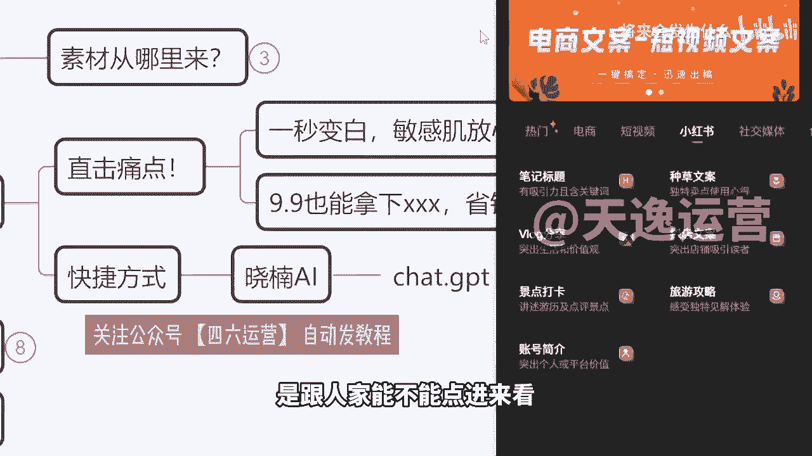

Yeah。然后包括我们再回归到刚才讲的这个带货啊，我们这个带货还没有说完，对吧？我们既然有这样的一个工具之后，我们就可以直接生成文章。无论是卖产品，还是说接绍单，非常简单，非常容易啊，没有什么难度。

那么同时在这个工具里面，如果之后还有一个方式啊，就是我们还有一个可以去获得流量的方式，在这里也教大家一点，比如说我在小红书刷视频，我刚好刷到了某一个达人，他的这个作品呢是两个月以前的。

但是他依然在推荐页。😊。

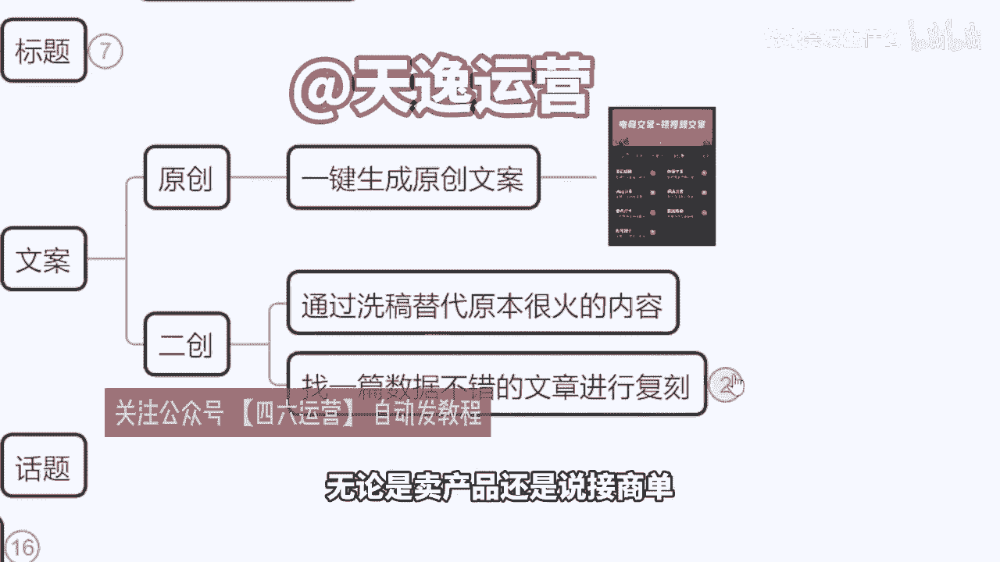

我们再推荐看到吧，有个作品啊，3000多点赞，你看那个发布时间。😡，去年的。😡，前年的甚至更久的啊，半年了是吧？几个月了。好，那这个时候告诉你，这是个商机的。😡，你去模仿他的文章，写一篇类似的。

包括你的图片的排版等等，都跟它做类似的。因为平台始终要新的东西，它不可能说一直推以前的老的这个东西啊，那是因为没有可以替代的，所以说只能推之前的旧作品。

那如果你写一个类似的出来平台会选择把流量划分到你的这个账号这里来。好，那这个时候我们怎么去模仿，对吧？我不知道怎么去写这个东西，你把这个东西一样的交给咱们刚才的AI工具啊，在这个位置它有1个AI聊天。

来有个AI聊天，它会模拟啊，这个就是你它会满足你的所有的要求，然后在这个位置的话呢，比如说我把这个文章我复制过来，对不对？我把这个文章复制过来之后，我下面带上一句仿写这段文字。😊。

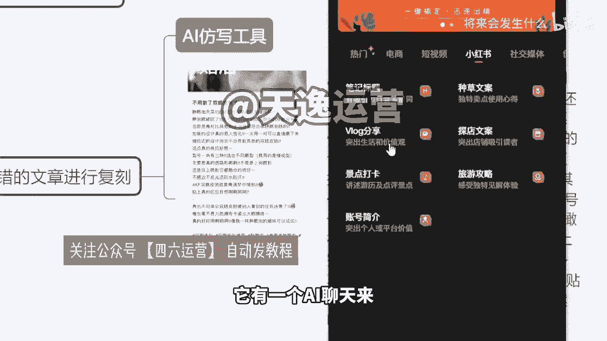

好，那么他就会给你反仿写。你看本身我们第一句话是肿眼抛天菜，对不对？好，它改成什么了？改成这款隐形双眼皮贴真的太赞了，对不对？它意思没有变，但是它的文字它的语言，它的语气是会有变化的啊，这就叫仿写。

然后包括你如果说重复再给大家发，还会有新的东西，这个AI软件叫什么？目前没有名字啊，因为这个是我们自己做的，毕竟我跟大家说一个这个说一个这个事情啊，为什么它没有名字，因为这个技术是从国外来的。

它原版的这个工具叫GPT但是它没有小红书的这个试用版本。我们相当于说是等于说我们用了人家的技术，然后做了小红书的版本，所以说我们没有办法在正规平台上线，这个工具是我们自己私下在用的。

就是我们公司自己的员工在用的。如果到时候你们确定做小红书。比如说你从明天说老师我下定决心我要开始做这个做这个项目了，你到时候找我来要。😊，🎼你到时候再来找我要好不好？如果说你真的要做小红数再要。

因为今天我们也也担心会有同行在听课，我不可能说把这个东西直接啊，我说每人一份，那这个东西不值钱，也是增加竞争对手啊。然后到时候如果你们真的要做的话，我们再考虑这个问题，你再要就找我要就行了啊。

这个东西我不会说收大家钱啊，因为我们这个东西不会拿去卖，拿去卖的话，相当于说别人如果说再来抄我们的这个技术，对不对？那我们这个东西就很难搞啊。所以说如果你们真的是自己要做的，我们再说啊，自己要做的再说。

😡，另外就话题的话，到时候我们会有包括我给大家讲啊，你们到时候如果说在文章里面不知道带什么话题，对吧？有更大的一个热度。😊，然后包括你不知道要卖什么产品的。

我们现在是直接拿到了小红书后台的所有的统计权限。我给你们看一下，我们是有这种比如说呃品类的一个品类搜索给大家看啊，就是我们有比如说我要做箱包鞋靴，对不对？我要做这个箱包鞋靴女鞋男鞋等等。

都O那么我们在后台是可以直接看到，比如说这个笔记有多少篇，一共有多少篇，然后呢，这些所有的笔记里面爆款当中用的关键词最多的是什么，达人分析品牌分析，它的关键词分析高频的评论词，我们都有。

就是我们可以直接看到整个平台，包括他每天新的作品，发的这些内容是什么？然后包括他是怎么样去做的引流，就是我们这边可以直接看到后台所有达人发的作品。

然后到时候如果说你们需要说老师我不知道我应该怎么去发这个内容，对吧？我不知道我当下卖哪个款式，比如说同样是之前呃卖一个这个长筒靴，我是卖这个V型的还是圆形的这个鞋统的。😊，🎼包括我卖棕色还是黑色的。

这个其实都有讲究的。然后到时候我如果你们需要的话，我们直接导出数据给你们，就是我们会导出后台数据，告诉你哪个款式是当下适合去卖的，然后你卖就可以了。有这个专业数据来做扶持的话，比你去测评，不断试错。

效率要高很多啊。然后这个的话我们到时会给大家去操作啊，我们直接是有后台给你们导出的。😡，然后现在我们讲一下关于我们到时候店铺的时候上品的一个问题。因为店铺对于大家来讲，我们到时候上品会有一个。😊。

要注意的事项。来，同学们仔细听一下啊。关键词的话之后我给你们去获取啊。关键词我们这边都有，就是我们有后台关键词，我告诉你们用哪个关键词像这个流量会大，然后你们就直接呃拿到这个关键词之后。

比如说像这个卖服装，对不对？婚纱风韩系欧美约会微胖美眉显瘦穿搭梨形身材设计感，对吧？通勤穿搭好，你拿到关键词之后，你干嘛呢？你到淘宝里面去搜啊，到淘宝去搜。因为淘宝的审美跟小红书是偏类似的，偏贴近的。

我不可能说我看那个小红书，别人卖啥，我卖啥，对不对？那这个你没有优势，我们也得自己去选个同样类似款式的出来啊。好，那么我上淘宝去搜这个关键词，搜了以后，我们去看那个销量榜单。

你找那个销量比较高的价格又适中的，不是说特别贵的啊，就是价格适中一两百块钱啊，这种这种的一个价格就可以了。😊。

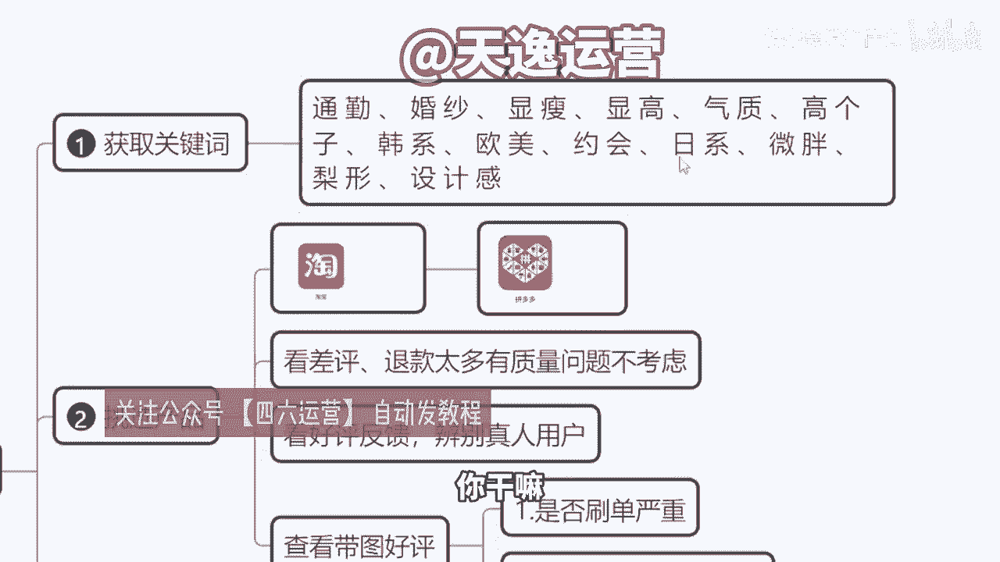

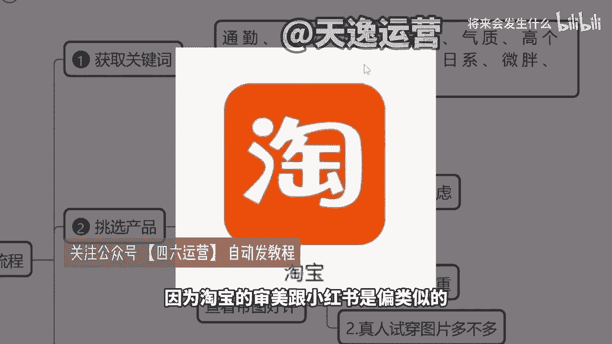

好，找到以后记住不用多多停留。你把那个图片保存下来，把那个款式的图多保存几个产品的图片上拼多多去搜同款。那么这个时候在拼多多它就有同款式，价格更低的产品了啊？那这个时候不能说我单纯看这个价格低。

我就跟他合作，是不是你要看评论那个买家秀是不是真的，还是说请的模特拍的假图。😡，或者说他差评多不多，因为我们新店有一个致命问题，你一旦退货率很高，会影响到你账号的流量。😡，啊，那退货率的原因是什么呢？

就质量你卖东西质量太差了啊，人家这个真的实在是受不了啊，给你退掉了。所以说我们得去看那个评论啊，你看一下人家的退货率怎么样，包括评论说这个东西质量到底好不好？如果说确实是OK的，就算价格稍微高一点。

没关系，我们就跟他先去合作，我们先把前期店铺评分拉起来。你的销量包退货率不高的情况下，后面我们的流量也会更大啊。好，那这个时候找到合适的产品，跟商家去联系，跟商家沟通啊，不要直接在拼多多下单，为什么？

因为你直接拼多多下单的话，人家那个商家帮你发货，那里面还有拼多多宣传单页，还有什么好评返现那些的很尴尬的，人家用户一看啊，我在小红说买的东西，原来是拼多多进来的。😡，肯定会退货，是不是？

所以说你要联系到商家，跟他发微信，跟他讲清楚。😡，你好，我这个产品要做转卖，我要做自己的品牌，麻烦您把发货人改成我店铺的名字。比如说你店铺叫小明之家，对吧？发货人就叫小明之家，地址无所谓。

地址是他们的就可以了啊。发货人改你的名字，然后包装和要求是没logo的，素的包装，里面不能放任何宣传单也跟他一切讲清楚了，商家是明白这个的啊，人家是知道人家做工厂都知道这个转卖的。好O讲清楚了。

有的商家好说话，就直接给你安排了不好说话，就说啊我们要收包装费，一个产品1块钱，那你就给就是了。对不对？好，O了，这就叫代发模式。那么代发的话，比如说一个产品，你代发的一个价格，找人这个帮你发货的价格。

可能那个产品的拿货价20，你进价的话，可能你去进货，囤货的话，可能拿货价才15。啊，我就建议大家前期你就先做代发，因为你本身没有多少的一个启动资金，当我们收入高了，你的利润高了，你再去拿底价。

像我们那些同学卖袜子的啊，你自己去。😡，找别人代发一双袜子，5块钱，拿货一双袜子，1块钱，这种你就可以进货啊。但是如果说这个价格差的不是很多，没必要进货啊，你就找人代发就行了。还更方便啊。

当你产产生订单之后，后台直接导出一个表格，对吧？啊，多少多少的这个多少双袜子啊，多少双这个产品，多少多少件产品，然后地址是什么啊，你一次性把这个表格直接发给商家让他跟跟他讲说您这边安排好发货之后。

帮我把那个呃就对应的订单号填到那个表格里面去，然后到时候你再挨个对吧？你往你那个店铺里面去输送，挨个去填就可以了。然后有一个问题啊，就是我们之后再。😊，传产品的时候会出现这个情况来给大家看一下。

就是比如说我刚刚有提到的一个货，像这个你看一下，像这种东西，拼多多里我们找的商家，人家那个图确实因为人家成成本低嘛，对吧？人家不会说费心思做美工，把那个图片搞得很漂亮，他就个白底一个杯子，看到没？😡。

但是那些卖的好的啊，通常这个你看这个手啊，这个白衬衫啊，这个背景啊，这个光影啊，这个图就很好看，很美观是吧？那怎么办呢？我又想跟他合作，我又没有好的图片。那这个时候我可以这么操作货，我就卖他的货。

图我从别人那拿。那这个图你既然没卖别的商家，那个好看的图片的商家的货，人家不可能给你，但是我们可以用一些技术手段，对吧？我把他图拿过来啊，比如说我到淘宝，我去找一下，哎，我看一下有没有卖这个产品的对吧？

有没有卖这个同款产品的啊，这个时候比如说我看了这样的一个床上四件套哇，好好看。😊，颜值好高是吧？啊，颜值好高。唉，刚好我在拼多多找到了同款的货，那么我是不是就可以用他的这个素材上传到我的店铺去呢？是的。

但是啊如果说有一点同学们，如果这个图你是这么复制粘贴的，是那么下载保存再上传的，还是那句话，你的代码是淘宝的代码。你传到小红书店铺之后，直接就违规了啊，直接就违规了。这个东西是啊，这是给自己判死刑啊。

不行，对吧？它不是原图，是不可以这样复制粘贴的那怎么办？😡，啊，拿工具啊，拿我们的一个插件，到时候给你们啊，拿这个插件。你看我们直接在手机安装，或者说在你的电脑里安装上这个插件。

手机电脑都能用PC端就电脑移动端就手机直接有一个你看这个啊下载以上全部信息的按键。我点击下载以上全部它就会把当初商家在上传这些图片的时候，采用的原图，没有淘宝代码的图片一次性给你下载下来。就这样的。😡。

你看几个文件夹给你罗列好，对吧？SKU图片呢详情图片呢，123456给你排序好。😊，啊，都已你排好，我给你们看这个图是不是真的原图啊，你在淘宝这里你都没办法放到那么大那么高清。我给你们看我这图。

这东西又不是我在卖的，这店也不是我的啊，就是咱们这个实实在在下载下来的。你看我放大。😡，啊，我这还是电脑啊，你们在手机看的会更清晰。来，你看我放大，我再放大清楚吧。😡，为什么？

这是人家真正的相机拍的原图，我们采集下来的啊，看到没？我还放大这个羊眼睛还这么清楚，这个抱枕还这么清晰，这就个原图啊，就等于说我们拿下来的这个素材的话，它是没有任何代码的，是原创图片。

那么你在小红书里面去上传的话，你的这个产品也会被判定为是原创产品的，是不会有任何流量限制风险的，明白了吧？啊，我们就用这个AI我们用这个工具去识别，用这个工具采集就行了。

无论是拼多多还是说这个淘宝还是说其他任何店铺的，你去找那个高颜值的图片来用啊。小红书对于这个审美要求是有要求的，尽可能找好看一点。你看像这种拍的就很好看，很有意境，对吧？啊，我再放大，包括换一张图片。

你看这也是一样的，我再放大一样是高清的。😡，我再放它一样是高清的，对不对？可以放到这么大来缩小这个图。其实这个小羊抱枕才这么小一个看到没有？这就采集的是原图啊，采集是原图。

那我们就可以做到第一个货我拿的又是便宜的是吧？图片我用的又是最好的啊，这个时候销量就不会有问题了，对吧？包括呢我采集下来，唉，这个文件夹以后，那我到时候上品呢，我是一张一张图上吗？一张张传。

那不是也很累吗，对吧？那也很累，你不需要一张张传，直接把这个我们会有商品工具啊，直接把这个文件夹直接传到那个网页就可以了，手机也可以操作，电脑也可以操作，直接传文件夹上去，它会自己帮你匹配好啊。

会自己帮你去匹配好，就是这样的一个方式啊，来O这个我们就解决了，对不对？然后店铺真的还是那句话啊，声音卡了吗？同学们其他同学卡了没有，没卡扣数字8啊，没卡扣个8给我回复一下。😊，我这没卡呀。😡，嗯，好。

卡了的，我们刷新一下啊，因为我是没有卡的。啊，我我实实在在讲啊，因为确实是挣钱的这个项目，我建议你们做，你们到时候做的越好。我前面也说了，你店铺达到一定的销售额，我是有奖金的。

我是巴不得你们多赚点钱的啊。所以说我给大家看一下，这实实在在我们一个宝妈啊，自己的一个心得体会，他什么情况呢？他是过年的时候直接辞职回家。原原来人家是在要企上班的啊，他过年是直接辞职回家。

现在全职在做小红书的，因为孩子在家里上学，你们可以听一下他的分享啊，这是他年前的时候给我拍了一个视频。他说老师我分享一下自己的心得。当时在我们的学习群里发的，我就保存下来给你们看一下啊。

你们可以听一下他的一个分享。😊，老师好，大家好，我先给大家汇报一下我的账号情况。我是跟小南老师呢做小红书快4个月了。那我呢最开始是做车载摆件的，大概测了两个瓶左右就直接出单了。这个呢是属于出单比较多。

但是呢利润其实是比较一般的。我做了第一个月呢大概是赚了7000多的样子。后面呢又同时在做抓夹跟厨房用品的这种号，一天呢基本上在稳定2000左右的利润。那我刚开始觉得做号的话呢，真的是要有耐心。

赚钱呢不能想着说我不劳而获。那我每天呢基本上是做四个视频加两个图文这样子就能够稳定到这样子的一个收入。我之前呢是在医药公司去做销售，大概一个月的话呢，到手也就才7000多块钱。但是在深圳生活的话呢。

我感觉真的是不够的。平时买一个东西哦都是精打细算的。那我呢是准备年后回家直接全职做小红书风口。有钱还是比较好赚的，所以大家一起加油吧。😊，啊，我觉得他这句话其实说的很好，这也是我当时我跟我的很多。

就是之前我们大的学生我在讲啊，我说这个市场它是瞬息万变的。不管是抖音还是小红书，现在知道小红书越来越多，你看都上春晚了，对吧？知道人越来越多，未来做的越来越多，就果跟抖音一样，刚开始好做，很好挣钱。

后面越来越难。😡，🎼这个东西是无法改变的，因为跟你竞争人越来越多了。但是如果说我们前期储备好了，比如说你的店铺我已经有销量在这了，那那些后面听说这个平台好再来做的人家是零销量。

他是没有办法跟你去比的对吧？因为我们已经有储备了。所以说现在我们尽快的去把这个店铺做起来，我们在有限的时间，我们去尽可能多赚点钱，这个是我给大家一个建议啊，然后这个是我们的一个店铺的这个玩法。

一定要做必须要做，一定一定要做。因为做店铺的话，到时候我给你们开的这个店铺的，咱们是有平台的一个流量推送流量扶持的。流量是要比正常别人开的店铺更大。人家开的普通个人店铺，那是完全流量他都进不来。

平台压根不推流的。😡，既然我们说到这个工具，我把商单也跟大家介绍一下。😡，商单的话是开店是这样的，开店是属于细水长流。你第一个月下来，可能一天我就四五个订单，四五个订单。后面随着我的粉丝的增加。

看到我作品的人越多了，然后我的订单慢慢的增加了啊，512万我的收入这样去叠加，它是有一个过程的。但是如果说接单他跟你的粉丝数真的有什么几万呢，你的浏览率啊，你的这个播放量没啥关系。

就是只要有1000粉就能开始挣钱，每天都是有单子的。然后像这种的话呢，如果说你们去做第一个月啊，收入不会低于5000块钱，有多少人想了解商单想了解的，我们扣一想了解的多，我就拿到前面来跟大家讲。

跟这个AI工具我结合在一块去跟大家讲掉啊。😡，想了解吗？OK想了解是吧？好，那我来说一下啊，商单是这样的，来，我们看一下啊，这个商单到底是个什么东西。我们带货其实大家大纲也知道了啊，商单呢就是一个广告。

😊，你发作品给别人的品牌打广告，就不是说卖自己的产品了，而是帮别人的产品打广告是吧？那这个时候呢，它是有，比如说我是蓝天牌牙膏。那么我作为商家来讲，我就先到小红书的官方平台，叫做这个蒲公英商单。

叫蒲公英的平台。然后呢，我去平台发布任务。😡，这个时候你的任务是有价格的。比如说它的一个价格是600，你不是说可以拿到600的啊。小红书人家分走的钱很高的。比如说他人家拿600块钱，对不对？

小红书要分走300元，作为平台的费用，你用我的平台宣传，我要收平台费300元。然后你的费用呢也是300元啊，你的费用也是300元，这个就是蒲公英商单里面，他那个模式，那如果我们成为了蒲公英的认证的接单。

就是认证的写手，这个叫做一个携手的一个身份啊，给大家看一下。😡，写手也叫编辑。你叫编辑，其实这个模式它并不是对所有人公开去招标，公开去招募的。就比如说我今天我啥也不是，对不对？我有1000粉丝了。

我是不是就一定能够开通这个普通易商单了，并不是的他作为一个写手和编辑来讲，相当于说是小红书平台对外招募的写手，你是来帮小红书写文章的那他对你的要求就跟你去找工作面试是一样的。要求你是某公司。😡。

在职在职或者说曾经任职过的。😡，编辑。你是某个传媒公司的编辑，或者说是品牌的运营。😡，运营你是有这个工作经验的啊，然后以面试的方式，他不是不用跟你面谈啊，就微信上聊啊，觉得说okK你有这个资质。

他就给你开通这个权限。😡，啊，但对于大家来讲，现在其实也没有，对不对啊？但没关系，这个到时候我们可以给大家去处理啊，一样的，以我公司员工身份直接给他报上去就可以了。那么达到1000粉之后。

你就可以在这个平台看到大量的订单，我们就可以去里面选择你想合作的商家啊，他们会对外去招募，或者说当我们在平台有携手的身份，有认证标志以后，商家会主动来找你，他会直接私聊你跟你去达成合作，这个都是有的。

是这样的一个方式啊，大家应该也知道了哈，对不对？那么我们看一下他的体验呃，他的展现形式是咋样的。我们其实今天在小红书看到的很多这样的一些达人，就好比如说这种同学们看一下啊，这个曝光黑名单。

热门美容仪别踩坑了。你看他跟你介绍了一大堆美容仪，然后呢，告诉你该怎么选，是不是？然后跟你讲了很多牌子，大家能看出来这是哪个品牌的广告吗？😊，能看出来吗？😡，是不是好像看不出来哪个看不出来，对不对？

是这个啊，第一个赔持。😊，啊，因为大家不了解美容仪啊，就是其他都是品牌。你们呃你们可以这么理解。😡，啊，其他都是品牌，只有第一个是杂牌。只有第一张图是杂牌，他这个广告写的很好啊。

就是他把一个杂牌跟其他品牌货全部放在一块儿。😊，然后让你误以为这也是个品牌啊，评论区他这个互动下单了赔驰飞驰，是不是？😡，这个就是他的广告啊，我跟大家讲一下，你们在小红书看到的所有的盘点。

不管是什么品牌，是个美容仪也好，是个剃须刀也好，是个香水也好啊。来，我们看一下香水，是个香水也好，是个狗粮也好，没有人会闲的没事干，给你做测评，来，我们再打开小红书这一个界面，你看这么多品牌。

难道说真的是这个博主，他自己自费掏腰包，买了这么多香水回家去闻吗？然后给你写总结吗？没有的。😊，没有的这就叫商单，这就是商单。来，我们看一下，就好比说这个账号啊。

看过这种类型的没有情商账号就是他的所有作品呢是在跟你互动啊，问你说啊，这个呃比如说桌上有5个领导，你手里呢有4支烟，请问怎么发烟才能让让5位领导满意，对吧？好，这时候评论区就开始互动了。

因为大家看到这个问题开始集思广益，还是回复了啊。好，你的账户活跃度不就起来了吗？对吧？浏览率不就起来了吗？好，那这个时候你粉丝上来了，你就能接广告了。你看啊，就这样的一个情商号中间夹杂了各种广告。

来这个烫发护理的。😊，这是一个商单是吧，他是不是真的自己去烫发，跟着他跟他分享，没有跟他没有关系的，是不是？然后还有呢防晒的。😡，定妆喷雾等。啊，面膜的看到没有是吧？然后呢，这种药的。😡。

🎼以及狗粮的啊狗粮的这都叫商单，他不是说闲的没事干，做了这么多测评，这个测评都不是他自己做的啊，这就叫商单。大家理解了没有？这个就叫做商单啊，这个叫商单。😡，那么这个单是什么样的一个情况呢？单子分两种。

一种呢叫做。实发订单。直发订单就是你不用写文案，不用找图片，商家全部提供。😡，全部提供。就像这个一样来，我们之前有很多新手刚开始做的时候都接这种单啊，因为这个单虽然很便宜啊，我跟大家讲。

这种单不怎么挣钱，一个单100150100块钱，150块钱那种。😡，嗯，给大家看一个，哎，我找一个之前有做商单的同学啊，找一个给大家瞧一下。来这个曾林慧的，我给你们看一下，我这个学生给我发了啊。

好多图片，这是最早在接单的时候，我都有记啊，就他每个单我都会记记录。然后你们看一下，这个是之前你看这个有没有档期合作，他这个是怎么讲的？你看下午写好图文发给你保子啊，这种就很便宜。

然后商家会直接给你安排好一切，因为他们有自己的这个品牌，有自己的品牌宣发，他会写好给你，你负责发就行了，但这个很便宜啊，因为你只是个工具人，对要帮他发一下就行。100块150块钱，钱不是很多。

然后这个叫直发单，你什么都不用干啊。但是由于现在订单竞争人数肯定是越来越多了，未来做这个行业人越来越多，你如果说没有写作能力，没有创作能力，只会做直发的话，你未来是没有市场的。因为他找谁发都行，对不对？

但如果说未来我们的账号，你的认证里面认证的身份是原创达人。😊。

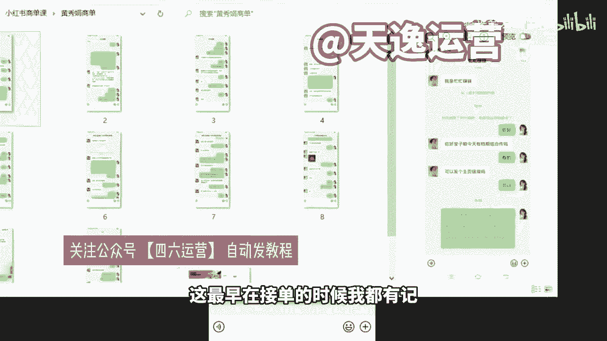

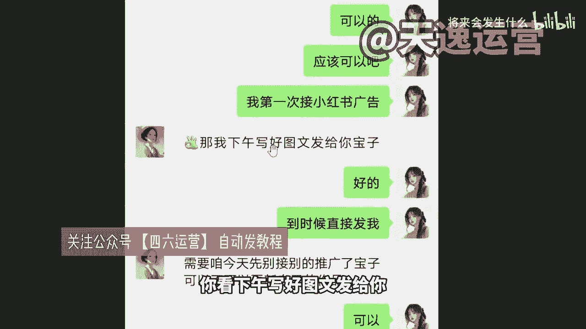

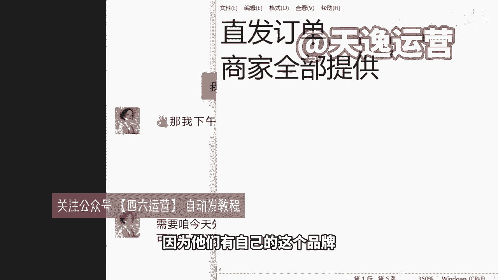

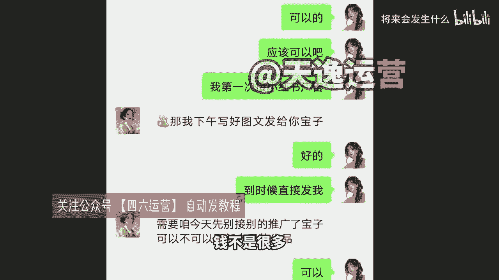

原创达人，那么你的价格就不一样了，你的价格就不一样了。如果咱们是1000粉丝数啊，那么你的单价最起码是310条，310条就是原创单是310条啊，你个别想打价格战的，你设个250、260240的也有啊。

但是通常300块钱是均价。那如果说粉丝越高，价格也是越高的。你们可以看一下他后面啊，他后面价格完全不是这个数了。然这么多广告啊，当时跟我讲的，你看他说我跟韩数运营说了，晚上给大家发，他同意了。

现在是接到函束的一个订单，一个订单是2000多块钱。😊。

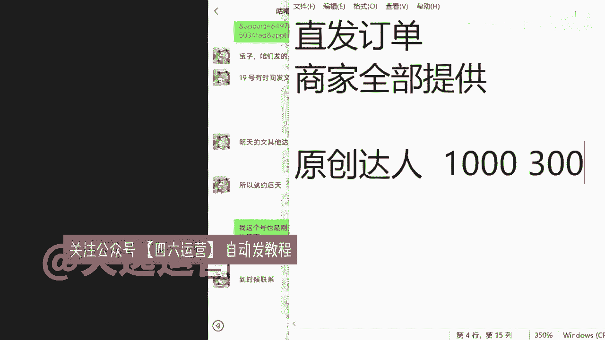

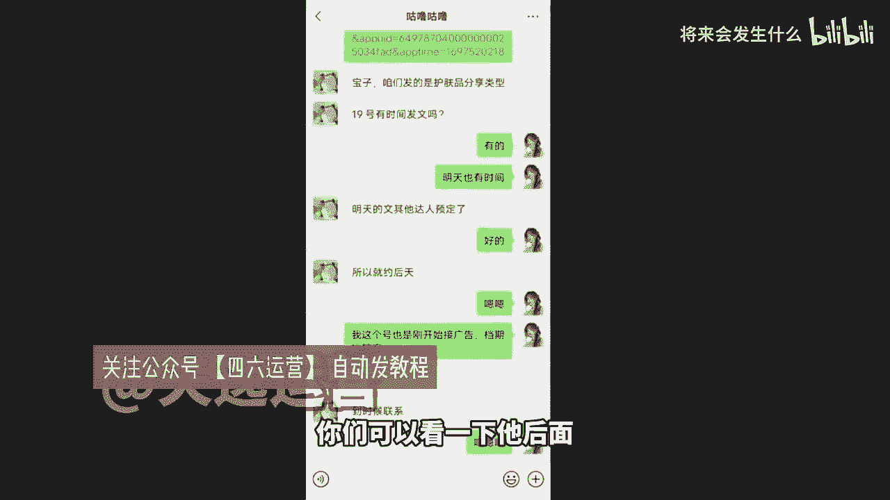

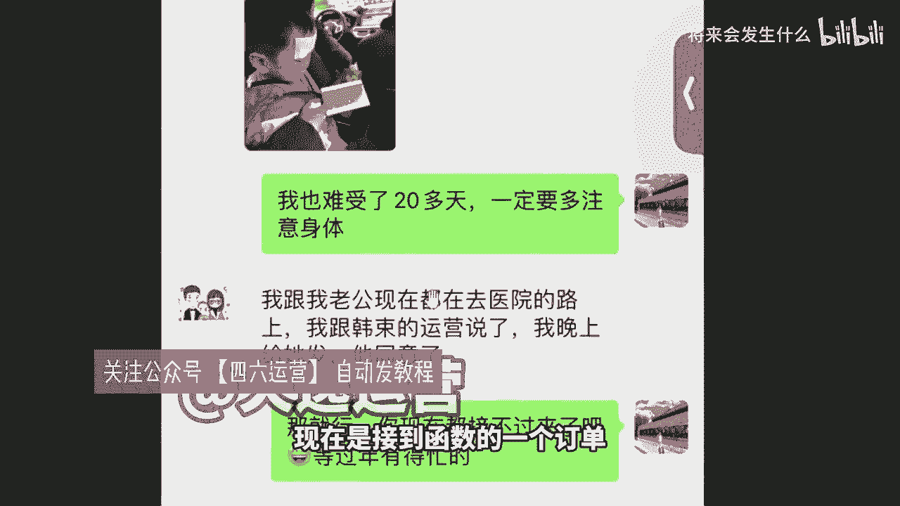

我给你们看他从过年啊，这个图是过年前截给我的。然后到目前我估计他单子应该还在叠加。他当时跟我讲说，过年不出去串串亲戚了，不去任何地方玩，就在家里。😡。

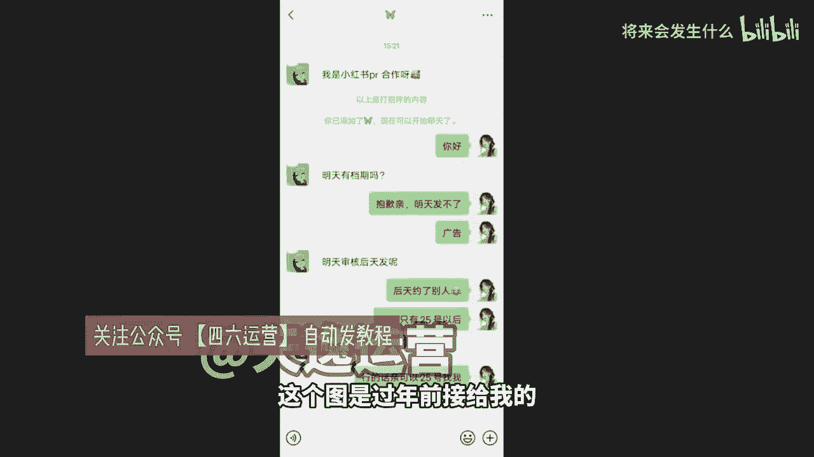

发作品看到没有？待接受79条，他那个时候啊才月初的时候，当月收入已经累计到7650了，就接都接不完的状态啊。这个就是蒲公英上单后台，看到没有？蒲公英商单后台79个待接受进行中8个。

所以我算他一条400500来讲，5001条来讲，你们自己算一下这是多少钱。😡，啊，因为现在小红数平台广告越来越多啊，我们现在手里都囤了好多，就是我们得完成，不完成的话，有违约金什么的。

或者说这个单子就派到别的公司去了啊，所以说我巴不得让你们去接。😊，巴不得你们来接啊，巴不得大家来接，巴不得你们来去承接这个东西。然后如果说价格高的来，我举几个例子啊，如果说做原创啥意思呢？

就是图片可以找商家要，但是文章我们自己来写啊，因为商家写文章很费时间，或者说图片我们也可以自己去找，自己去做，你们看一下啊，我拿一个那个这个是其他公司的，我来跟大家讲一下啊。

这个其他公司的一个号都注销掉的。我当时看到这个号的时候，我特别我就得特别心疼我当时我在想我跟我们团队想要要咱们花钱去收一些那个不挣钱的账号过来啊，你看一下啊，这个粉丝数初级达人啊，为签约这个号注销掉了。

因为不挣钱，别的公司的啊，600不算因为不能说是别的公司的可能就是一个小白座号啊，突然报号了，但是不知道怎么挣钱。你看啊6898个粉丝数截止到2月18号啊，这个18号过去很久了。

但这个数据因为他他是呃半个月更新一次啊，然后现在还没有更新6898看到没有？那么他的一个接单情。😊，情况什么样的？近30天来我们看他投放评估啊，就他那个单价多少钱，150，我记得你看到没有？150。

因为他没有原创能力，他只会直发。然后他是一个单都没有的。近一个月啊，一个单都没接到是吧？你没有原创能力，别人凭什么拿单子给你啊，我凭什么送钱给你，我找别人不行吗？对吧？

别人还有100块的那近60天我们来看一下，就等于说两个月以来，他注销号之前接了单没有，就接了4个？😊，还没就借了4个，对不对？就借了4个150，接这4个多少钱，800块钱吧，还600块钱，600块钱啊。

是不是这个很少的？但是我们看一下同样的差不多的一个粉丝数啊，来这个啊来我们之前一个学生这个号的话，粉丝数会稍微多一些，7000多啊，这个不是啊，来，稍等这个。😊，来这个5177个粉丝数看到没有？

5000多粉丝数，粉丝数没有别人多啊，但是它单价完全不一样。5000多粉丝数做原创。因为它这个是有原创认证的。你看样式素人，湖南长沙卫群任何公司都是普通人是吧？

自己有自己的本职工作就副业做一下这个小红书的700元的一个报价，同文报价700块钱一条，然后他的单子是多少个单月就这个就这个月的这个统计啊，不是说这个月啊，是从今天起，从今天往前面数30天。

它是近30天数据，从今天起往前数30天37个订单，37个订单，然后呢，是700元的报价，来，我们看一下37个订单，700元报价是多少钱啊，这是他这一个月的一个收益是2万多块钱，看到没有？

这完全是两个极端的这个效果。所以说原创很重要。那我怎么样去写这个原创内容呢，我们拿这个AI刚刚我们讲的这个AI来写，对吧？你直接点开种草文案，我们就说刚才的那个。😡。

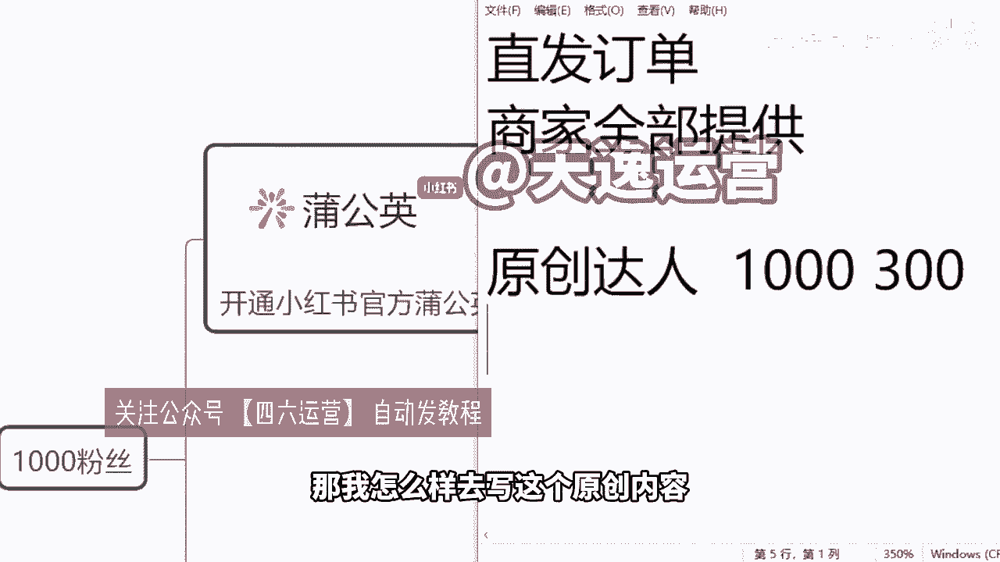

美容仪。因为很多同学说老师我是男的啊，我包括我是女生，我都不用美容仪，我根本不懂这个东西怎么办？我怎么写，人家要求我写250个字的产品描述出来，我不会。😡，来平那我们就选美容护肤，对吧？

我产品我选什么啊？我选来美容仪。😡，对吧，当然啊关于产品描述这一点，你要找商家给你列卖点出来，就是你要问他这个产品的功能是什么，让他把功能告诉你，你把功能填在后面，我们时间原因我就不写那些东西啊。

然后我们来点生成，对不对？这个时候语气也是一样的。你要去根据自己的需求来选，我是要友好了还是怎么地的啊，一般我选友耗比较多。那么同样的，我们点生成，这个文章它会在几秒钟的时间立刻给你写出来。😡，来。

你看就算他就算你不懂美容仪，没事儿啊。你看这里亲爱的护肤达人们给大家种草一款超级神奇的美容仪，你是否在为肌肤暗沉、细纹、痘痘烦恼？这款美容仪可是你的啊肌肤救星，看到没有？😡，功能直接给你拓展出来了。😡。

首先，其次最后来你看。😡，啊，首先呢提拉紧致，深层清洁，美白亮肤，以及搞定是吧？什么导导入导出技术啊，能帮你吸黑头吸毛孔啊，还能帮你把这个好的乳液给你导入到皮肤里面去，是不是来，你看我对这个不满意。

我再点换一换，它这个很细节，表情那些都给你选好了，对吧？卖点给你罗列好了，这个第一个好的点是什么？第二个好的点是什么，对不对？还告诉你啊，这个采用先进的声波振动技术，红光模式啊，等等。来。

这个东西好不好用，好用，咱们扣3个6，我看一下啊，好用，我们去扣3个6。😊，是吧你不需要你说我我不懂这个东西啊，怎么怎么地的是吧？我不懂这个产品，那没有关系啊，他会帮你写是不是他会帮你写啊。

来包括像这个产品除外的话，我们之后去做其他类型也是一样的。比如说我要做的是一个这个沐浴露啊，我要卖的是一个多芬沐浴露，你把牌子写上去都行，来沐浴露是吧？一样的，我直接让他给我去生成这个文章。

同样的帮你来写。而且每一次我们再点击换一换的时候，他生成的内容都是新的啊，都是完全不一样的。如果说你怕错过好的文章，那我每次生成之后，你把这个文章呢先复制保存到自己的那个手机里面，保存到一个文件里面啊。

保存到一个这个文档里面，然后呢再点换一换，再生成新的，到时候生成好几篇之后，我们选一个合适的啊，然后呢再去发给商家去审核就行了。然后但是这个东西呢，我们不能去跟商家讲说老板你让我来接你的单吧，我有工具。

你不能这么说啊，你要接单的时候怎么说，你拿到人家的。😊，任务之后，你等那么一个小时，一个半小时，你再把你选好的文章发给他啊，表现出一个真是咱们自己写的感觉。他如果说哪里有问题，咱们再做适当修改就行了。

那如果这一篇，他说不行，换一篇，我再过一小时，我再拿篇新的，立马又发给他。😡，是不是我可以说到最最起码一点，这种水平，这个文章写出来的一个效果肯定是要比咱们自己去写的效果要好很多的。😡。

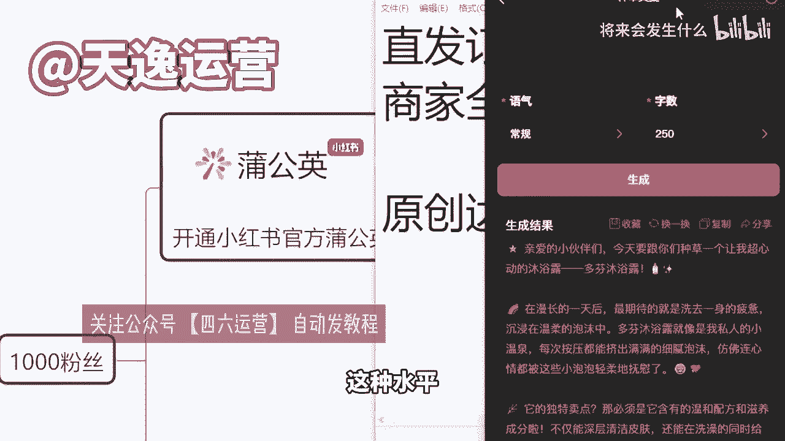

你这个东西写出来是要超过很多这个素人小白自己写的文章的，而且人家效率很低，对不对？那这样的话，我们接单是不是就不会担心了啊？那这个老师那既然接单的话，我要1000粉丝涨这000粉丝难不难？😊，啊。

我涨这1000粉丝难不难？呃？首先我跟大家说啊，我们到时候去做这个接商单的账号的话，我不用说我指定就做一个类目。比如说我这个号只发沐浴露，我这个号我就只发什么这个狗窝呀什么的，这个不是这样的啊。

你发啥都行，你发像刚才的那种情商也可以。😡，是吧然后你去发一个什么科普的那个作品也行，你去发一个这个影视解说都行等等啊。你去发一些这个语录合集啊，或者说搞笑段子合集都可以。就是只要我的作品是能有人看的。

不管是发啥类型，只要你的粉丝达到了1000，你的账号没有限流状态，我们的播放量是O的，那么你就能够去达到这个平台的审核要求，然后这个认证的话，我会帮你们开啊，因为像相当于说我前面也说了。

我是属于你的待教人。那么如果说这个单因为我们手里我们手里是有很多资源的，如果这个品牌放的一个单子是我们派给你的对吧？那么你该拿的那300会不会分给我一分钱不会分给我。

因为本身你跟平台的平分的这个单价就是300跟300，你300平台300，那么如果说这个资源，这个单子是我给你提供的对吧？你这位达人是我介绍到平台的。那么平台的300元里面会分给我50。😡。

分给我们公司50，这个钱跟你没有关系啊，就我们不会从你的获利里面去抽成。这个钱是由平台去分给我们的啊。所以说其实我们也相当于一个合作共赢的方式，你来帮我消化资源，你来帮我完成这个任务，完成这个呃订单。

那这个时候你能挣钱，我们也能获利，对吧？我们是走量，那你靠多接多赚钱就可以了。😡，是这样的，一00粉的话挺好涨的啊，一000粉的话，基本上我们到时候会给大家去做定位。一000粉的话。

7天10天左右是完全OK的啊。我们基本上其实三四天左右的时间是可以的。我给你们看一个吧啊，我们之前有学生做健身教练的。😊。

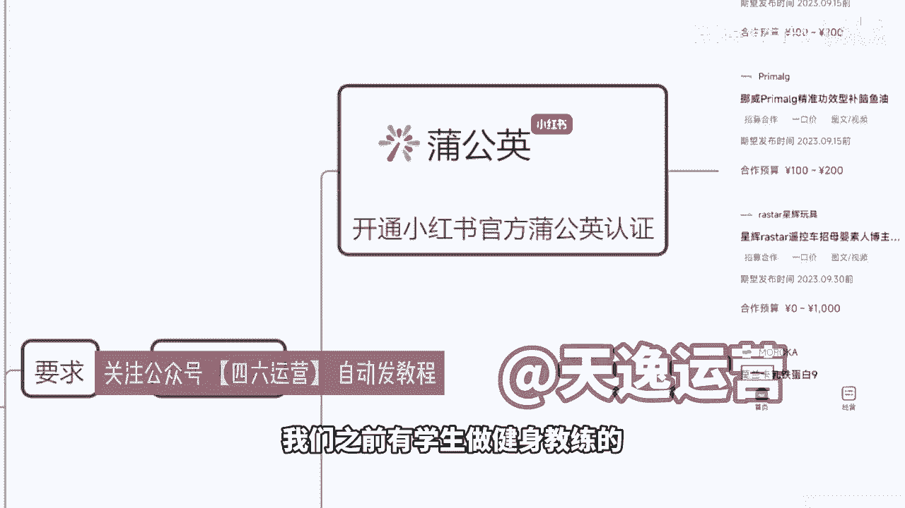

他是这样的，他是做了影视解说，但是说实在的，我不建议你们做影视解说了啊，因为他是去年的你们现在做影视解说，已经市场太做太多了。但是我今天不会在课堂里面去给你们建议说你一定要做哪个类型啊。我但凡说了。

咱们今天课堂几百号人啪啪全是做一个类型，你再做也不可能了，所以说这个我们以后私下再做定位，我们一定会把好做的类型，我们私下里给你一个人，每个人的类型是不一样的。

所以说这个不要在课堂问我说老师你推荐做什么啊，我不会回答的啊，这个东西不回答啊。然后但是呢这个视频视频解说，影视解说确实不建议做了，因为做人太多了。来，你看一下啊，他之前是做过抖音，做视频号。

没有效果的，因为他只是做给他们自己健身房引流嘛，对吧拍一些自己的那个健身视频啊，腹肌啊，这个胸肌什么的啊。然后但是呢他。😡，呃，其实这个大环境的原因啊，办健身办健身卡的其实越来越少了。

就大家很很难说再愿意去花一些额外的这个消费，去提升自己的生活品质了，对吧？更多愿意啊还不如在家多买2块排骨，所以说其实他们生意不好做，就跟我讲说想转行啊，做一下试一下别的这个项目。

然后后来你看啊他的涨粉是怎么的。你看下午昨天下午开始发视频，下午到晚上发了3个，今天早上涨了几十个粉丝，今天又发5个作品，现在是1200个粉丝了。所以说其实我们只要去抓住流量密码，我们是知道流量密码。

这个东西我很隐晦啊，我不能跟大家直说，就我们知道是发什么可以的。因为像我们作为平台的这个账号孵化来讲，孵化的运营商来讲，平台比如说他需要什么内容。😊。

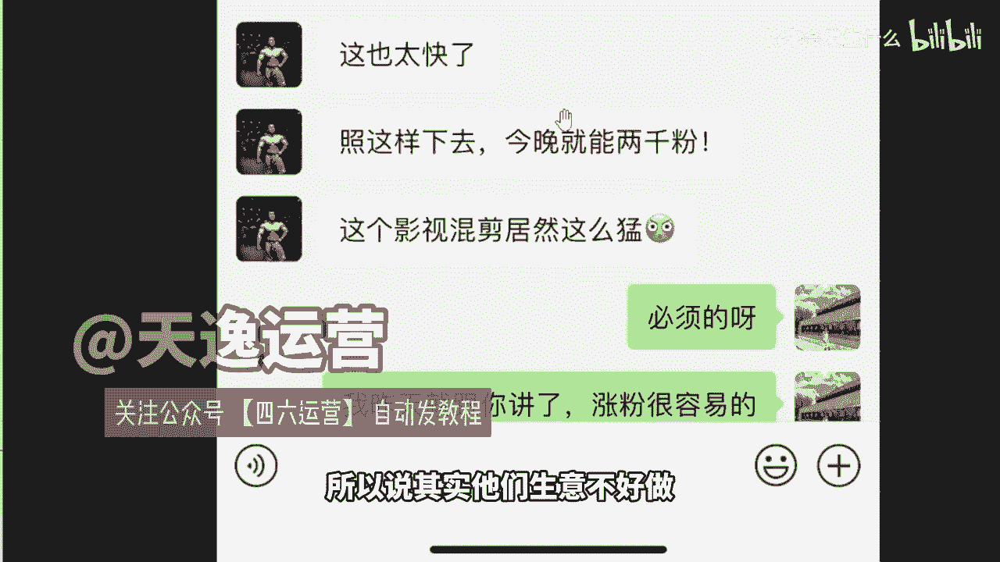

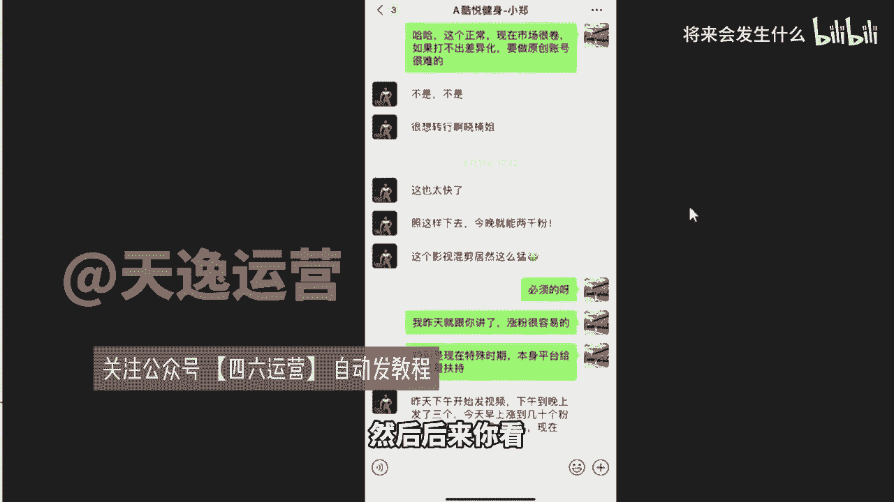

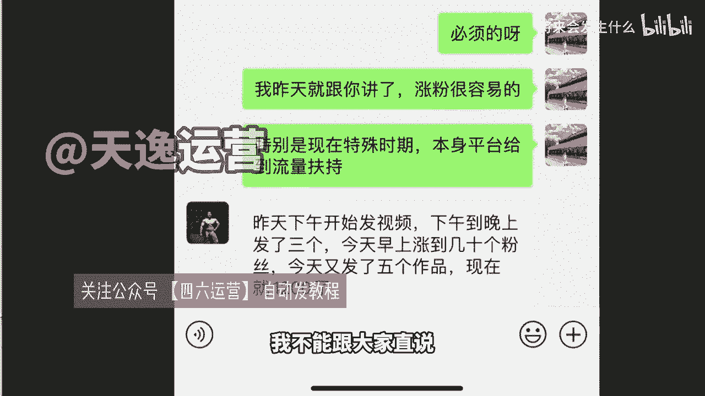

啊，哪个板块是缺的，他会给我们发微信的，他会跟我们讲说啊，你这边这个月或这个季度给我们提供几个什么什么品类的一个账号。OK他给我发了这个信息之后，我就跟我们自己底下学生讲说你们去做这个类型是这样的啊。

我们会直接给大家去安排啊，然后这个就是属于一个商单的形式。来，我给你们看，就刚才这个人啊，就刚才这个同学他现在接单价格很高的啊，你们一定要你们可以向他看齐，人家也是在过年的时候没少赚啊。

没在过年时候没少赚7681个粉丝，笔记数量33个啊，然后单价来你们看一下1800。😊，你们不要觉得说他挣的多或者怎么样啊，人家都是AI做的，都是AI工具做的，没有说他能力有多强，全部是AI生成的。

然后另外还有一个就是你们之后做商单想多挣钱的一个玩法啊，一个小的这个建议给你们就是我们刚才那个宝妈她在做的。你们会发现我给大家看的几个聊天记录，她的聊天记录的头像不一样啊，对她头像不一样。

人家好几个微信，他怎么操作呢？首先他自己的那个小红书号啊是有4个。😊，那么他今天拿这个微信跟这个商家聊完之后，签下了这个订单以后，拿到钱之后，他换一个微信再去加那个商家说你好，我这边有个千粉号。

你需不需要合作？😊，啊，拿AI反正生成又不一样的文章，对不对？又是一篇不一样的，又找这个商家再合作一遍，再收一次钱。😡，啊，直到没耗了为止。😡，就这个方式说实在的啊，你们也能干。因为本身我们确实有耗。

他就是能够挣钱的。有这个资源，有这个商家的一个资源之后，把它物尽其用啊，用到最大化。😡，🎼用到最大化就可以了啊。然后这个的话就是我们之后可以去做的一个方式啊。所以说人家为什么能挣钱，对不对？

为为什么人家挣的多，一个月最起码两三万的一个收入号多啊，人家是直接是一个订单接到，一直接到接不接不了为止的啊。😊，Yeah。然后包括还有一些玩法啊，这个我就简单跟大家说一下。因为今天时间原因。

包括后期呢可能我们做这个的会比较少，就是做商单和做店铺的话会居多啊，给大家讲一下什么叫思域。比如说你自己有产品，家里有茶叶的。😊，是吧有这个在莆田的啊，在深圳南邮的对吧？有点什么假包假鞋的啊，可以去卖。

对吧？做微商，这是一方面。另一方面呢，我相信大家其实也在呃我跟你们讲一个叫空手套白狼的玩法啊，这个简单跟大家说一下。😊，什么意思呢？有没有在小红书看到那种卖学习资料的？😡，看过没？

考研资料啊、英语四六级资料啊，小升初、初升高的学习资料啊，现在K12不是取缔了吗？不能办补习班，对吧？很多这个呃孩子家长啊就会在网上搜各种资料，各种考试题啊啊网届历届考试题给这个孩子去看。好，这些都有。

那么这个东西他要不要花钱，肯定是要花钱的。你就看这种东西啊，给大家看一下，我找一个类似这种的账号给你们瞧一下。😊，比如说他又有这个资料啊，来这里。卖考研资料啊，或者说这种你看考研英语资料分享。

我就拿这个来说啊，我们就拿这个作品来讲，你们觉得它是免费的吗？同学们，他这个分享是免费分享吗？😡。

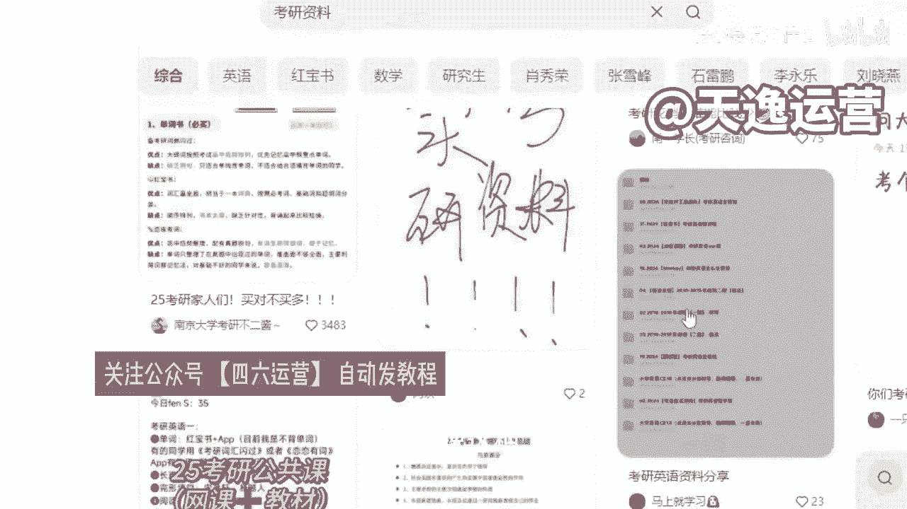

不可能免费啊，对吧？有句话叫知识不付费，永远学不会啊，天下没有免费的午餐都这样的。现在是知识付费的时代。就是你加到他的微信之后，真正他直接告诉你说哎，你要什么资料啊？好。

你说了之后594939收款码发给你付钱吧，是吧？或者说有更贵的啊，更贵也有，因为这个资料其实他们那种正版资料买过来，估计23000块钱左右。我们这边也有然后他们在卖的话，就几10块钱往外去卖啊。

我们现在有好几个学生在做这个东西，因为如果说你要做这个私域的话，对于你的时间要求很高。就是比如说你动不动要回微信消息吧，是不是啊，有人加你微信，你得去回复人家要买，你得给人家发收款啊等等。啊。

所以说这个适合时间多的，比如说你在家全职干的呀，或者说是学生的呀，可以啊，我就得有学生叫廖勇，然后他是在那个汉口学院。😊。

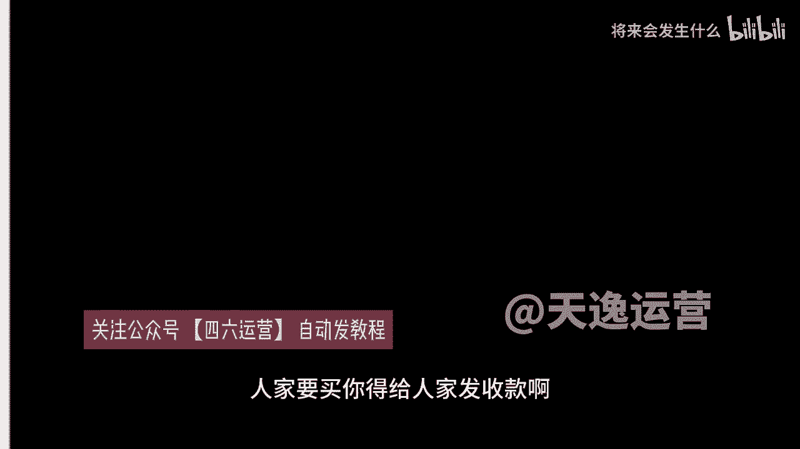

武汉上学的啊，学的是那个土木工程专业啊，然后他就是属于每天呢就卖卖这个学习资料啊，做他之前做的小升初初升高的。然后后来现在是呃改了，跟我讲说想卖一些那个英语考研英语资料什么的啊？

你要之前搞一个月搞7000多块钱呢啊，这个东西是零成本去变现的，是不是这个资料的话，我们现有你们到时候要的话，直接发给大家去做就可以了啊，这是一个方式。然后还有几个我讲一下这个本地市场引流。

大家知不知道什么叫做团购套餐啊，知道吗？团购套餐，美团里面有对吧？这个抖音里面也有，比如说我出去吃饭啊，我吃个火锅正常我直接付款的话，380，但是如果我在买个那个团购套餐，同样是这么多道菜。

200多块钱。😊，有吧，是不是买个奶茶喜茶啊，19。9块啊，然后呢，我买那个团购套餐券的话呢，只要12。9块，就是它会有这种折扣。😡，那为什么会有这么多人在宣传这个东西的？

而且你点进去他的账号发现他跟这个品牌也没啥关系。这种呢就是推广号，那我们也是可以做这个类型的。😡，我们也可以做这个类型。因为小红书它是要向抖音看齐的，任何抖音有的玩法。

小红书必然要一模一样的照搬都来一遍啊，所以说因为我们现在已经接到通知了啊，我们是今年接到通知的，给大家看一下，包括现在已经有这样的一个信息。小红书美团来势汹汹啊，要要做本地生活趋势啊。

就是要做这种无论是餐饮、娱乐、美妆等等啊，要做到这个线上平台来了，把这个折扣券优惠券做起来。所以说我们接到通知，所以说我们的这个工具呢也更新了这个方式。😊。

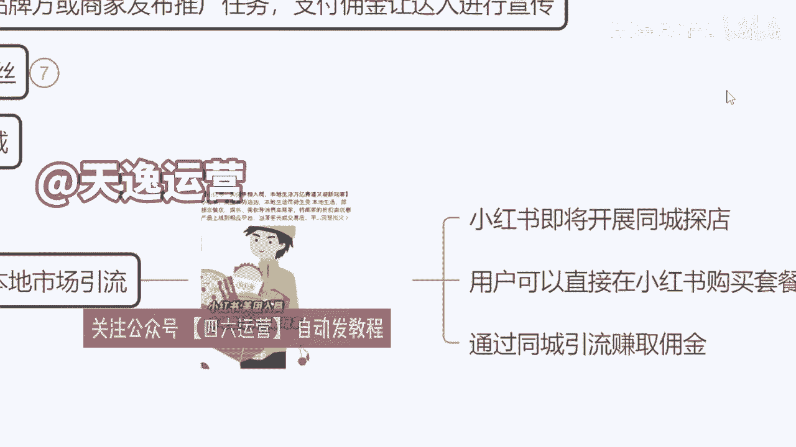

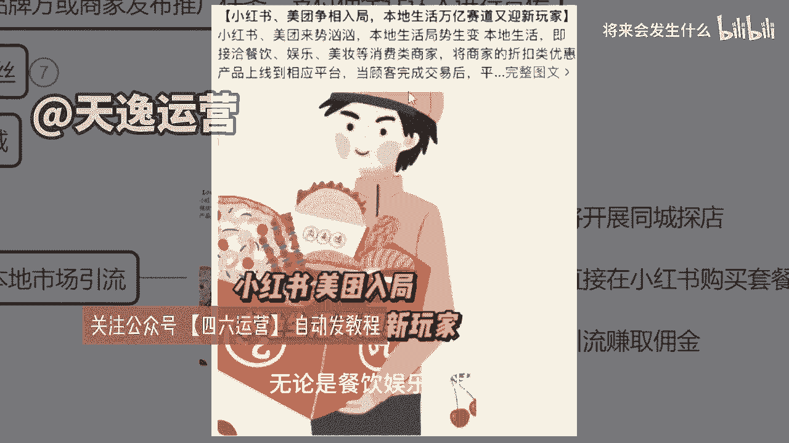

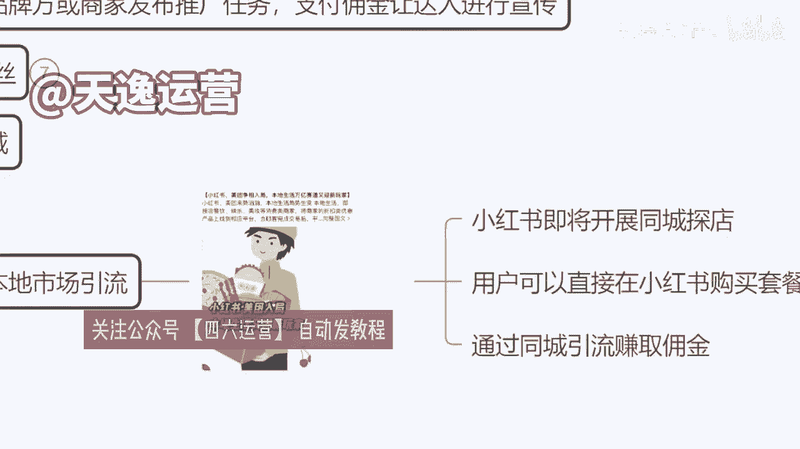

啊，来给大家看一下啊，就是这个。😊，种草文案之外，对吧？有探店文案，我们之后无论是做哪个城市店铺啊，就是你不用说哎我在呃这个长沙，但是呢我在那个街道的一个任务呢，它是什么呃，这个郑州的，没关系。

你的定位是可以随意选的，是可以随意改，到时教教大家怎么去改这个定位啊，你直接定位到那个城市，那家店铺的定位就可以了。然后信息把那个店铺名称写好，营业时间等等，填进去感受评价，大众点评里面到处可以复制啊。

然后探店环境等等一写，对不对？好，点击生成，它会自己帮你写一篇探店文案出来。😊，然后像这个图片的话，第一也是很好找啊，像这个大众点评啊，美团里面可以去找这个图片是吧？

或者说呢可以找商家给你提供都是可以的啊，都是OK的。然后这种价格的话呢，它是他是没有写做的一个费用，就是他不会说因为你写了这个文章给你钱，而是你有佣金。比如说我卖的套餐是200块套餐。

你能拿10%的佣金，就比如说你能分到20块钱，是这样的啊，是这个意思啊现在做这个东西的人，你们到时候去做，也是第一批是螃蟹的人，最早一批在做的。因为没啥没谁知道这个玩法，没事知道啊。

小红书毕竟他现在还没有上线，到时候一上线，我第一时间通知你们，你赶紧做就行了啊，还有一个呢是旅游攻略，包括现在你们在过年期间看到的这个哈尔滨很火，对吧？哇那么多人在推广哈尔滨，我跟你们讲啊。

放大你们血量的双眼。😊，去找一下那些推广光发景，没有人的自拍的光发景，没有一个人站那拍照的啊，那很有可能，包括那个文章写的天花乱坠，写的可好了，跟你一顿夸的那绝对就是收了钱的，绝对是收了钱的啊。

因为现在这个单子可多了。😡，张家界呀啊这个什么武功山呢啊北京的这个环球影城啊，是不是我们街道太多太多了啊，就是我们现在很多就人在发，它跟地区有关系。有的这个当地旅游旅游局啊，给的这个钱多的。

有一条500的，给的少的一条就三四百块钱左右，然后一样是可以直接生成的啊，这个旅游攻略可以写景点打卡可以写对景点的点评。比如说我我这就给大家写哈尔滨啊。😊，哈尔滨，我填进来对吧？游玩感受啊呃游玩感受。

咱们这个就随便写一下啊。😊，有趣。好玩，你当然不能这么敷衍啊，到时候咱们还是要多写一点来点生成。那么它会把这个比如说这个地方啊，它的住宿怎么住宿，交通怎么交通，对吧？我吃东西哪些东西好吃？

你看索菲亚教堂不可错过的，还有中央大街啊，夜幕降临，我在松花江畔等待一场震撼的冰灯秀，来看到没有？这东西厉不厉害？😡，就这样的，他能直接帮你写。包括如果我对这个我不喜欢一样的，我再去生成一个新的。😡。

是不是我再上上成新的，这个是目前啊我们都可以去做的。但是由于呢他肯定是没有我们前面说的那些那么赚钱。所以说我就简单跟大家介绍一下啊，玩法还是有很多。😊。

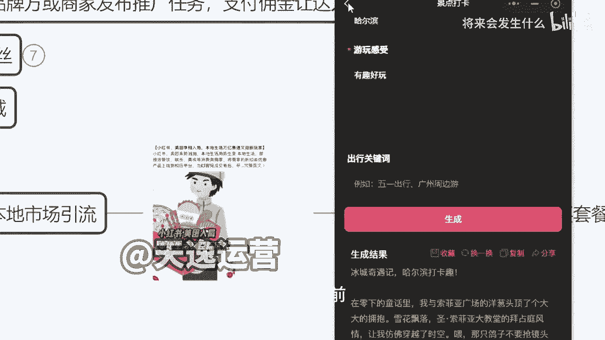

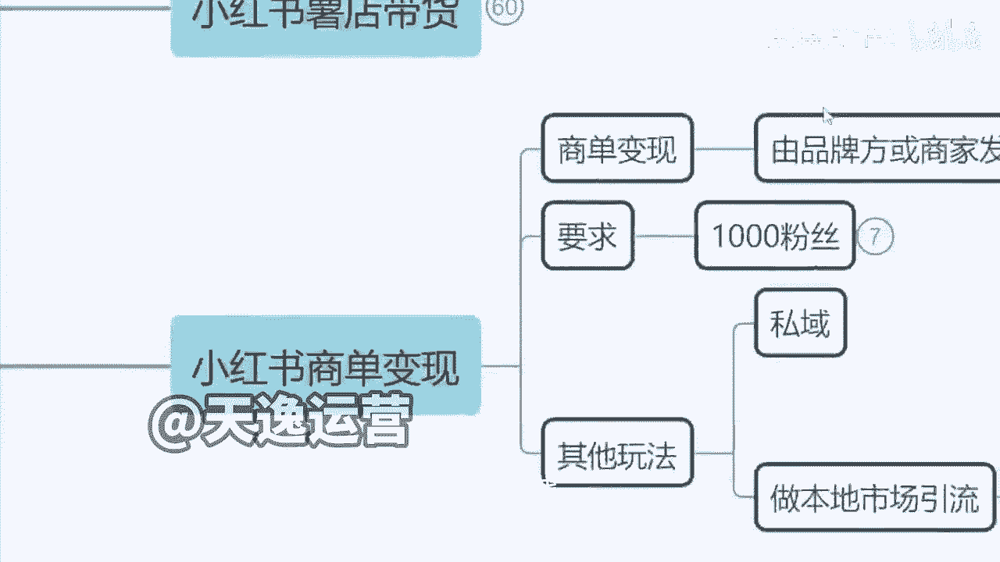