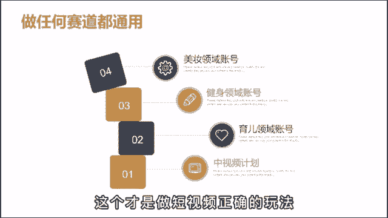

# 【2024高口碑最全抖音运营课程零基础入门课程】从0开始，转行抖音运营，你要知道的基础知识都在这了，包教包会，从抖音入门到精通，学习抖音短视频新媒体运营教程！ - P11：运营篇丨新手最快起号的方法 - 天天快乐丷 - BV1cJ4m1h78q

小白做短视频，从开始到放弃啊，都是卡在了不知道如何起号上，不知道怎么打标签啊，就一直这么稀里糊涂的坐着，直到放弃的那天，那其实做短视频新号起步是不需要原创的，也没必要原创，在这里呢不是说让大家去抄啊。

不是这个意思，而是说你是小团队运作或者个人在做账号，时间精力经济成本都非常的有限，你花费太多的时间在原创上，费劲巴拉的做出一个作品，那由于呢你对短视频的内容感知还不足，所以呢很可能怎么发都没有播放。

会长时间的进入到一个自我怀疑当中，就很容易放弃，所以呢新手在做短裙的第一步，就是要学会如何低成本的气候，我呢把它总结为三个阶段，第一步低成本喜欢打标签，第二步验证变现模型，第三步原创和个人IP啊。

我一个个给大家解释一下，那为了方便理解呢，我就用中视频来举例，比如做户外美食的账号，一般人都会想着说自己去采购食材，然后呢找个地方去拍做饭，那想法呢是挺美好，但实际做过你就会知道。

这个人力物力都是消耗不起的，在二线城市，三个人的小团队，各种花生加在一起，一个月就得3万，那怎么办呢，这是就去油管搬就好了，上面有好多优秀的博主也在发明时，他的画面声音场景跟你自己比起来。

只有过之而无不及，看你直接发就好，三个人呢一天剪个60条还不过分吧，用不用你写文案，就这么坚持发一个月，基本上有的号就能打标签了，然后第二步全力去测试变现模型，最简单的就是根据发的作品。

来找到合适的商品带货，然后呢还有星图广告啊，比如说会有一些厨房用品的商家来找你合作，第三个呢就是做培训啊，你就算起号的概率只有20%，60个作品，就是12号那个粉丝加起来至少都几百万了，在一个月的时间。

同时能起12个账号，累计几百万的粉丝，在外人看来是一件很恐怖的事情，想入行的人呢都会想要跟你学习，但是呢只有你自己才知道是你干的，再有点第三步，当你的变现模式跑通之后，就来到了原创环境。

而你不能一直靠这种玩法吃一辈子，得为了以后的长远来打算，不然呢像有些广告要把产品植入到视频里面，都是翻的，肯定做不到，就会啊错失很多的机会，所以这个阶段你就按照之前的视频风格去搭建，一模一样的场景啊。

比如做的是野外烧烤，你就去找个什么风景秀丽的地方，在一个小河边去堆个炊火啊，连他拍摄用的相机你都买同款的，争取完成一比一的复制到了这里呢，你之后再去参加个什么地方的直播活动。

就可以直接拿着十几个账号去参加活动，是补贴了，那这套起号流程呢啊你不只是在做视频，你做任何赛道都可以卸掉，比如这个口播领域，无论是做美妆健身育儿东西不错，你就把别人有结果的视频换个角度直接翻拍啊。

一天拍个30条都起来做短视频啊，和这个创业一样啊，你不要觉得说很简单，是个人都能做，它就是个概率游戏，学会去堆料来打破概率的限制。

