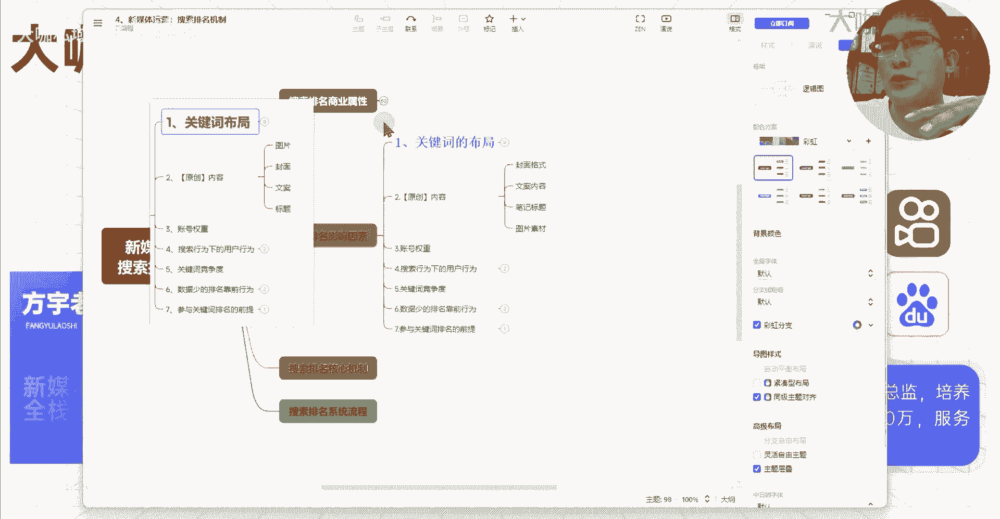
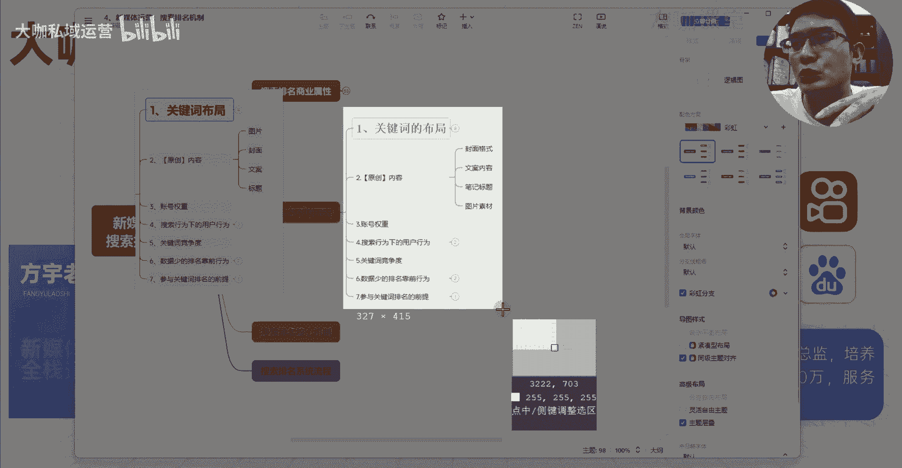
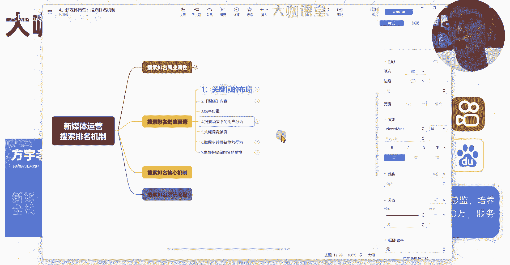

# 【300集顶级新媒体运营教程】小红书运营起号／涨粉变现／流量玩法／引流技巧 打造爆款账号就看这套包没错! - P15：14、新媒体运营第九课：笔记关键词搜索排名影响因素（1） - 大咖私域运营 - BV13VYveoEVa

Hello，大家好，我是方瑜老师，欢迎大家来到我们这一堂课，那么这一堂课呢，我们继续来讲，影响我们关键词排名的一些其他的因素啊，首先呢第一点就是关于我们内容的原创这一块，那么所谓的原创呢。

这里我再跟大家强调一下，我们做新媒体，我们做内容的这一块的一个原创啊，并不是说我们自己要做这种原创的构思，原创的这种脚本，原创的这种剧情，而是说我们的内容在我们的系统的审核看来。

你跟别人的这个文案文字整体的一个相似度，重复度，包括你的图片等等这些层面，我们是进行了一定的处理的，你比如说我们刚才准备的这篇文案对吧，我们呃这样直接拿过来是肯定不行的。

我们这篇文呢可能要通过一些AI工具，或者说通过我们自己的一个简单的写法，让这个文案去进行一定的总结，我们让它跟以前我是同样的一个意思，比如说边背单词边朗读，我们这后面的这些描述呢。

我们可能说也是跟他一样的表述呃的这个内容，但是呢我们的这个文字就完全不一样，我们用自己的方式来表述出来，让它变得不一样，OK这个就是我们讲的关于原创这一块，你的文案内容只要说有价值。

你把别人的价值呢通过一些其他的文字方式，你再讲出来，只要跟别人的文字内容不一样，这个就叫做原创，这里呢主要考察的原创点，分别是我们的图片封面，还有文案，以及还有我们的这个标题哈，以及还有我们的标题。

那么图片这一块呢，我们在后面放的这些呃素材图对吧，比如说我们做旅游的，我们会去拍很多很多这种风景图片对吧，比如说你做一篇笔记，关于旅游攻略的，那么如果说你这个时候直接用别人的图片，你把它下载下来。

然后你来发啊，包括这个封面，包括这个排版完全一模一样的，那么这个时候你的这个图片是绝对，或者也不说绝对啊，是有很大很大的这个可能和几率，是会被判为这个重复的，那么一旦说重复了。

那么你参与排名的这个可能性基本上就没有了，因为呃我们前面前面讲过对吧，在内容审核这一块，他就会审核你的这个内容的原创程度，如果是抄袭的，那么这篇笔记呢，基本上得不到这个比较好的流量。

那么到了后期呢我们会跟大家讲这个呃视频，或者说我们图片以及文案的这些消除的方法，对吧，同样的一个图片，我们在不改变图片内容的时候情况下，怎么去让这个图片能够去消除好吧，能够去让系统判定我们这个图片呢。

同样的一个图片它是不重复的，包括这个我们可能有些同学听过一些，像MD5值啊，或者一些其他的方法等等，很多好吧，很多一个是图片，另外一个是封面，那么封面可能说我们现在拿到一个视频，拿到一个笔记。

这个笔记呢别人的封面的排版呢，他做的还挺好，哎我们想用他的这种模式，那么我们不能拿过来直接用，但是我们可以去做什么呀，我们可以去做复刻它的封面，哪个地方放的是一个比较大的文字对吧。

哪个你比如说像这样的一个封面对吧，假设说我现在这里对吧，我的关键词布局，我的关键词布局，这里呢我给它呃加个粗，然后呢我给它改进改一个颜色，然后呢字体放大一点，OK那么这是我的一个封面，对不对。

那么如果说我现在要仿这个封面，要做成跟我一样的，怎么办，我呢第一个我改变这个呃文字的一个字体，我改变它的一个字体，我们来演示一下好吧，我来初步演示一下，因为我这里不能打开别的呃。

那个内容我这里来演示一下好吧，这里呢是关键词布局，我呢首先呢给它改变一个颜色，然后其次呢我来改变一下什么呢，改变一下它的一个字体，关键词布局，然后呢该加粗的加粗，OK然后呢关键词的布局哎这个是一个方法。

然后呢下面的所有的包括背景，我再统一给他们改一下什么呀，填充我给他们换一个嘛，我全部给他们换一下，OK我全部给他换一下，然后另外呢我再把这里的排序来给他，全部换成点实操写的东西啊，OK那么呢除此之外呢。

我还要针对第一个，比如说我这个图片放在前面是吧，我把图片放到后面，然后呢我把这个文案对吧，我把这个呃这里呢我字数再给它改一下对吧，封面格式，然后文案的内容对吧，标题，嗯笔记标题，然后图片素材，哎。

我在所有的内容保持跟他差不多的格式情况下，我来做一些微调，包括这里边的原创内容啊，这其他的一些这个内容，我来给它更改一些简单的字数，那么这个情况下面是不是就达到了，我们一个简单的去虫的这么一个原理。

对不对，那么包括我们的封面的格式，这个我们刚才就讲了我们的封面格式，你的图片呢平台去判断你的图片是否是抄袭的。

它通过的就是你的什么呀，通过你图片这些这些特征。

你的这个背景颜色，然后呢你的这个文字内容以及你的字体，还有颜色等等这些方式来判定，所以说你觉得我们来做封面的这样的一个驱虫，是不是就有了思路了，OK啊，这个我看不是看的不是特别习惯啊，我还是喜欢这个。

OK好，那么在这种情况下，我们的笔记的标题我们去重，然后呢图片素材我们去重文案内容去重，这种情况下，我们的原创内容基本上就能达到合格，OK那么除如果说你在内容创造这一块，真的。

你能够高效地去出一些非常优质的这种东西，那么当然你去做自己完全原创的东西，也是可以的，好吧也是可以的，当然从我们运营的角度来讲，我们谈的是一种技巧性的东西，我们在最少的人力物力的情况下。

我们怎么能够去提升我们整个内容的这个，原创程度啊，好吧这个是原创，然后其次呢就是账号权重了，账号权重呢这个是我在后期会重点去讲的，我们现在所有新媒体的运营啊，我们的任何一个平台，大家都不会去主动承认。

我们账号有权重这个东西，但是你们仔细去思考一下，平台在决定给每个流量的一个初始，给每个账号的一个内容的初始流量这一块，它是根据什么来评定的呢，比如说有些账号诶，它的体量就决定了它的内容一发布出去。

我的初始流量就会分发给至少1000个，1万个用户，但是你的笔记，你的账号，你刚起的这个账号，你的笔记刚发出去的流量，就只有那么一百两百对吧，那么这种情况下是什么东西来决定的呢，它绝对是有一个值对吧。

你这个账号现在处于什么样的一个层级，这个层级是根据什么的，我们知道系统哈，我们知道这个系统因为你对这个算法，对这个呃程序比较了解的情况下，你应该知道所有的这种平台，他们去做大数据分析。

去做每一个账号的分类规划，它都是通过什么呀，都是通过数值来体现的，包括我们计算机现在你看到的所有的内容，我这里展示的思维导图，我现在声音呈现给你们画线，画面呈现给你们都是通过什么。

都是通过计算机对我们的内容上面，我们内存上面的一个数字的0~1，零和一这么的一个解读，才能呈现画面声音和图片，这些给你们看，对不对，那么这些东西都是数字，那么系统在分析你的这些内容。

对每个账号去进行一个站内，我数据库里边的一个排序，或者说等级的一个判定，都是靠什么，都是靠数字来体现，那么数字是什么，数字其实就是你的一个权重高低了，这个东西是一定有的，如果说没有这样的一个机制。

我们所有的账号在系统里边都是动态的啊，都是不确定的，那么系统怎么才能，在千人千面的这种分发情况下，把这个内容精准地分发给，对这个内容感兴趣的用户的面前呢，这个你们想一下权重是一定有的。

所以说账号权重它也会影响你的笔记，他在某个关键词下面的一个排名情况，OK那么这个我这后面会重点讲，然后第四个呢就是搜索行为下的一个用户行为，搜索场景下啊，记住这里是指搜索场景下的用户行为。

不是说我们笔记分发出去了之后，正常的一个用户行为，搜索场景下的用户行为呢，对我们整个笔记的一个排名的影响是比较大的，比如说某些用户他在搜索这个呃，护肤的一个流程或者护肤步骤，那么下面展示几篇笔记。

有一篇笔记排名在第一，但是呢平台或者系统，他发现诶，这篇笔记在这个关键词搜索量比较大的关键词，下面，没有多少人去点击，100个人里边，可能只有两三个人去点击这篇笔记，那么剩下的人呢可能都去点击的第三篇。

第四篇，那么这种情况下，他可能会怀疑这第一篇笔记呢不适合排在前面，因为他的一个点击概率特别低，那么这个是一点，其次就是我们现在啊，我还是拿一个情况来展示吧，稍等一下，我们来来展示一下啊。

那么我们现在打开这个界面，打开这个界面，那么我们搜索一个关键词还是叫英语口语吧，OK我们搜索了之后，这比较吵哈比较吵，我先把系统静音了，稍等一下啊，免得待会儿呢耳机党承受不了嗯。

OK那么我们现在呢我们来打开一个视频啊，我们点击一个正常的好，我们进入这个视频之后，这个视频里边肯定暂停，这个视频里边啊，用户在点击这个视频之后，他的行为，我们用这个来模拟我们笔记的一个界面。

用户进来了之后，他的一个点击及行为，就是说比如说有100个用户，100个用户在搜索某个关键词，搜索这个英语口语的关键词之后，这100个用户点击了同一篇笔记，但是这当中他点击这100个用户。

点击这一篇笔记的时候，里边只有十个人给他点赞，给他收藏，给他提供数据好，那么这是一种，那么假设说这个时候这100个用户，他们又点击了另外一篇笔记，结果呢，当中有50个用户给这篇笔记提供了点赞。

收藏和这个投币啊以及评论等等数据，那么在系统判定来讲，他就会觉得哎，另外一篇笔记给用户提供的价值点，是不是就会更高，那么从系统的这个数据分析的层面来讲，他是不是会考虑把这个笔记往前靠，对不对。

这个就是我们讲的在搜索场景下，这个这个这个用户的一个行为数据啊，还有一个我们现在的一个非常关键的两个点啊，关键的两个点，这两个点呢是我们目前我们看不到的这些数据，比如说我们的搜索点击量啊。

我们的搜索点击量，比如说我们刚才我们返回这个界面啊，比如说我们现在搜索了英语口语，那么在英语口语的这个情况下面，呃，这个这个视频是排在第一的是吧，那么我们模拟刚才的一个场景，100个用户当中呢。

当中呢只有十个用户点击了第一个视频对吧，剩下的90个用户他们都去点击了这个视频，哎，那么用户的点击量，也就是说搜索同样的曝光的情况下，诶，你的排名甚至比较靠后，但是用户呢他偏偏点击了比较靠后的内容。

或者说它呃点击的更加靠后的，他点击的不是特别靠前的，它点击第二，第三甚至说更加靠后的，那么这种情况下，系统就会分析我的这个排名逻辑是否合理，那么这当中长期没有得到用户点击的这个数据。

是不是我就可以考虑往后靠，那么甚至说得到用户点击最多的这个笔记，原本他排名比较靠后，排名第四第五，那么这种情况下，我可能会考虑把他的一个排名提前，也就是在这个搜索场景下面，我可能会给他考虑提前啊。

排名提前，这个叫做搜索点击率，那么还有一个呢就叫做搜索跳出率啊，点击跳出率，比如说点击跳出去是什么意思呢，我现在有100个用户点击了这个视频，那么当中呢有这么五十八十九十个用户诶。

他们点击了一下这个内容，哎，停留了很短时间，立马就返回了，立马就返回了，这个呢就是你点击了这个笔记之后，你在里边多少用户是秒退的，这里边是平台有一个数据估值的，这个估值呢可能就是三秒五秒。

或者说更短的时间，这个呢我们没有办法得到准确数据，但是一定是有这么一个跳出率的，那么这个跳出率呢呃这是我影响，也是影响我们排名的一个关键因素，比如说有些用户对吧，我100个用户呢点击了某一个内容当中呢。

绝大部分用户他点击进去之后，进去之后他没有跳出，它停留时间还比较长，甚至呢它还有更深的一个PV浏览量，那么这种情况下，你的笔记一样会得到这种搜索场景下的，一个权重呃，一个分的增加。

你的排名有可能会告更靠前，这两个值呢是长文件的决定搜索排名的一个呃，它的一个结果，然后呢还有这个搜索场景下的一个用户，互动行为啊，互动数据这一块，这三个点是在搜索场景下。

系系统能够去分析出某些笔记该排在什么位置，由用户来决定的这么一个情况。

