# 【300集顶级新媒体运营教程】小红书运营起号／涨粉变现／流量玩法／引流技巧 打造爆款账号就看这套包没错! - P21：19、图文笔记：爆款笔记创作公式：第一节 - 大咖私域运营 - BV13VYveoEVa

Hello，大家好，欢迎大家来到我们这一节课啊，那么这节课呢我们跟大家来聊一聊小红书的呃，我们所有人关心的一个点，也就是我们爆款笔记的一个创作问题啊，就是我们怎么才能打造出来。

能够可以啊产生爆款的这么的一个笔记啊，那么在讲怎么去打造爆款笔记之前啊，我们先要了解一个问题，就是说呃在小红书上面啊，就任何一篇这个爆款笔记它的一个产生啊，都不是说是偶然性的啊。

也就是说我们之前所说的这个玄学啊，不是说完全是这样的，首先呢它必须得具备一个因素，就是它本身要有价值啊，它必须是优质的内容才有机会啊成为爆款啊，这个东西怎么理解呢，就是说我们去制作内容对吧。

你这个内容呢并不是说偏偏都能成为爆款，但是我们自己要保证我们做运营的，我们要保证一个事情，就是我们要保证我们自己输出的这个笔记，每一篇都是优质的内容，OK这优质的笔记呢。

就是我们成为爆款笔记的这个基本的门槛啊，可能说呃在早期2019年的时候，2020年21年的时候呢，小红书平台呢它的用户量呢还比较少啊，所有入驻的这种呃博主，他都能够在平台上吃到一些红利呃。

呃可能说他发一些笔记啊，这些笔记没有什么特点啊，也没有什么特色，但是呢就是平台会去给他推流，然后呢它的流量呢会不断的飙升，这个呢就是平台的前期的一波红利，这也是每一个平台在火之前它的一个性质。

所以说这个红利的话，在任何平台它都有，你像抖音刚出来那会儿呢，很多人都没意识到这个问题啊，怎么去做啊对吧，为什么呃，我呃那个时候我没考虑到去做抖音呢，为什么那个时候我没考虑到要去做小红书呢。

这个其实就是平台的一个红利问题，这我们大家没有办法去避免啊，没有人有这么前瞻性的这个视角，你像呃抖音，前段时间不是也出了一些啊中视频的这个app啊，和平台呀，到现在也还不温不火的，对不对。

你可能你也不知道这个平台它到底做的怎么样，我们投入了大量的精力在上面去做，那到底有没有值得我们付出的一个效果，这就是红利对吧，那么但是现在的话任何一个平台像小红书，抖音这些笔记越来越多。

竞争呢也是肯定越来越大的，呃那么平台上面所所所考虑的问题，他肯定要想的是留住用户，对不对，他必须要去给用户推荐用户喜欢的内容，也就是说把这些真正优质的内容，平台还觉得优质的内容。

或者说通过大量或者基础的这种流量去反馈，得来的这种优质的笔记推送给用户，那么他才能把用户给留住啊，当然这是呃我们平台的一个基础的运营规则，也有些呢财大气粗对吧，他可能有钱，他去砸呀啊，推广啊，付费呀。

投流啊，投这个呃薯条啊，或者说斗家呀等等，通过这种形式呢也能把笔记给引爆是吧，但是呢这些呢对于我们普通人来讲不太合适，所以说我们做小红书笔记的一个创作的一个，关键点对吧，我们要去打造爆款。

我们先要知道什么东西啊，我们先要确保对吧，首先第一个第一个要素，内容价值问题对吧，你先要确保你提供的内容每一个都是有价值的，然后呢再配合平台的用户推流的额，一个流量的这样的一个叠加的态势。

再结合我们这些呃，我们内容上面做的这个关键词的覆盖，用户得来的这个反馈的数据，要去保证我们每一篇都有机会能够成为爆款，OK这是我们运作的一个标准，这是第一个，第二个要素是什么呢。

第二个要素也是非常关键的点啊，第二个要素是非常关键的，就是我们很多人去创作小红书笔记的时候，你要去做的一件事就是选题啊，内容选题，什么内容选题呢，就是我们要去考虑对吧，你到底要创作什么样的一个内容。

才是当下平台喜欢的啊，在平台眼里是用户喜欢的，你要创作符合他们要求的这样的一个笔记话题，内容方向对不对，如果说你只按照你自己的标准，你去像一个机械人一样啊，你去麻木的去发去创作。

那这很可能你创作十篇笔记只有那么一两篇，或者说更少是符合这个平台当下这个用户，他们的一个搜索需求或者观看需求的，那么这两篇本身基数就比较少，你指望在这两篇里边再产生一个爆款，那基数更少了对吧。

你的概率问题啊，你的这个机会啊，成为爆款的机会也就更少，那么选题这块我们要根据什么东西来做呢，首先第一个，啊首先第一个就是我们的什么呀，就是我们要根据一些热点来做对吧，我们要根据一些热点。

这个是在我们任何平台上面去创作，从我们做新媒体运营开始，一直到我们后期的成长阶段，不断的要去重复操作的一个东西，热点啊是我们来流量最快的一种方式，但是我们很多人他并不知道怎么去蹭热点对吧。

我给大家举个例子，假如说你想在小红书上面做内容，你就要去考虑什么呀，你就要去考虑当下人们议论，比较火的这种剧对吧，电视剧你要去考虑大家考虑，大家目前当下都在议论什么，比如说我们某个电视剧这几天播出诶。

很火，里边有一个人物啊，受到了大众的议论，你发现你一搜这个电视剧下面有十篇笔记，里边有五篇笔记都在讨论这个剧，剧里边的某一个段落或情节，OK那这个东西你是不是可以蹭。

你是不是可以根据它来策划一下你的内容，来发一下，你是不是就有概率能挂上这个热点来给你推流，这是一个除了电视剧还有什么呀，还有我们的呃，这个小红书上面很多人喜欢的东西啊，嗯这是我们的什么呢，就是我们的瓜。

OK我们各种各样的瓜啊，某个地区啊，某个这个呃某个某某个某某某个某个区域对吧，出现了某种呢大家都喜欢吃的这种瓜啊，出了什么事件啊，什么问题啊，什么明星啊，怎么怎么滴呀，出什么问题。

那这种东西你一样可以去蹭，你一样可以去发，你可以去跟风啊，看一下这个他们发的东西啊，你把这个话题给他蹭上，那么你的流量基数肯定不会少是吧，这个吃瓜的心态呢，在小红书上面是特别风靡的啊，因为什么呢。

因为小红书上面的女性群体用户，确实她占比比较多，女性用户呢平时他们关注这一点呢，嗯兴趣也比较大对吧啊，就是关注各种各样的瓜对吧，然后呢第三点就是什么呀，第三点还有人嘛，对不对，我们什么名人明星啊。

或者说某一些某个领域的这个领军人物，然后呢出了什么样的结果，出了什么样的一个创作，然后呢这个人呢他最近有什么样的一个事迹，然后讨论的比较多，这个人你一样可以去蹭，一样也可以去挂，那么某些就自带流量。

自带光环的这种人物，在你的标题或者你的笔记里边挂靠了之后，你这篇笔记呢很有可能你的流量就会出现暴增，这是一个我们啊热点这一块呃，要做的一个瓜对吧，一个人还有一个是什么呀。

哎嗯等会啊热点我发现我的格式有问题，哎，缩写成影视，OK那这就是我们要考虑的一个是影视，一个是人对吧，除了人还有什么呀，还有事件，对不对，我们要去蹭一些我们可以蹭的这些事件，热点事件。

当下正在发生的这些比较火的这些事件，我们要从这些事件当中去呃，考虑一下怎么去把我们的内容挂靠上去，或者说我们的笔记发一篇，这样不挂靠的内容也可以对吧，我们就发一下这个事件相关的笔记。

这也是我们获取流量的一种方式，那么总的来说在热点创作这一块啊，就是我刚才强调的，不管你是刚做运营，还是说你后期做运营，那么你做热点这个东西呢基本上是一直伴随的，你像我们抖音上很多那种特别火的啊。

就是粉丝呢大概也有个几百万对吧，呃这种人呢他只要遇到热点他就会去蹭啊，只要遇到他热点，他就会去蹭，因为这个时候蹭热点基于它当前的一个数据，它又能形成一波流量的爆发，那么这些大V都在做。

那为什么我们不去做呢，OK这是我们要讲到的一个关于热点这一块，然后还有一个东西是什么呢，还有一个东西就是关键词，OK关键词，关键词这个东西我们前面跟大家讲过关键词库，是不是。

但是我们这里要讲的关键词就不一样了，我们这里讲的关键词，你可以把它理解为热门关键词啊，热门关键词，它我们之前所搭建的一个长尾关键词词库对吧，这个词库呢是基于我们所有发布内容。

也就是说我们去提供用户有价值的，这种需求点的内容的一个方向，那我们可能做某些项目，做某些产品，我们需要去铺设这些，去争取争夺更多的呃，某个关键词下面的一个排名的结果，和用户搜索这个需求的匹配。

但是我们创作热门关键词，是我们很多自己做账号，我们想去打造爆款笔记的这样一个自己的账号，我们必须去具备的一个东西。

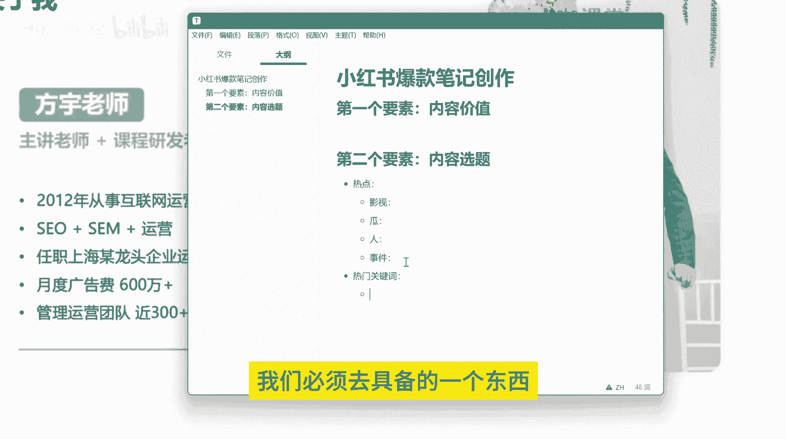

所谓的热门关键词我来给大家看一下啊，就比如说我们现在打开小红书啊。

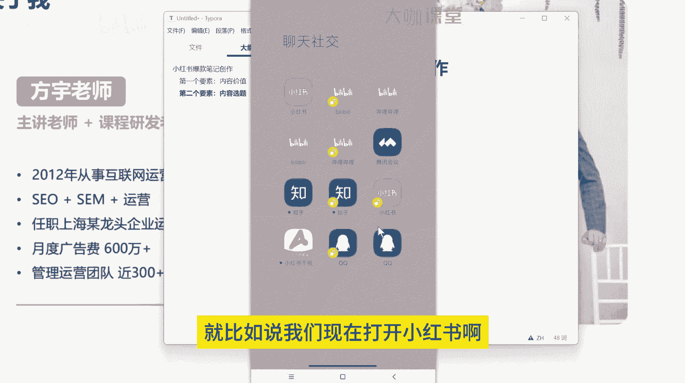

这是我刚才打开的一个界面呃，我们去创作这个关键词哈。

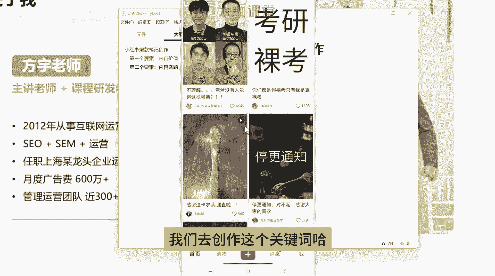

我们去创作关键词，比如说我们现在呃搜索一下对吧，我们搜索一下就这个考研啊，我们输入考研嗯，我们会发现下面会给我们推出来很多很多，这种对吧，搜索词是不是这种搜索词，从前到后，我们可以默认理解为。

它有一个基础的一个排序的需求，那么平台这一块肯定会去做的啊，我跟你们讲，平台肯定会在对这块搜索词的一个展现，有这样一个呃排序的一个需求，因为什么呢，他要去匹配用户的搜索需求。

他就必须得把大众用户比较关心的内容，往前靠对吧，这样才能匹配用户的一个需求，比如说假如说当前80%的用户，他在搜索呃，考研准考证打印的这个词，那么你把这个词放在最下面，那么用户在上面呢。

他就会他看不到下面的内容，他不会去浏览这么多，他可能继续打对吧，考研他会去打准考证啊，对准考证打印，Ok，那么这个过程当中，就增加了用户的一个什么行为呀，输入的一个行为，那假设说你现在考研准考证打印。

打印排在这个第二啊，就这个词的下面排在这个地方，那哎我这个地方好像显示不全啊，好吧，我说一下嗯，OK那么假设说现在用户搜索的这个考研，考研的准考证打印排在这个地方，那么他就不需要他只需要输入考研。

OK后面的内容他不需要输入了，他只需要点击一下这个东西，OK那就进入到了他想要的一个搜索结果，那么这就是关键词默认的一个，它就会有一个这样的一个排序的问题，平台不可能考虑不到这一点。

虽然说很多平台它不会承认这个东西啊，包括我们以前做百度搜索引擎的时候，百度也不会承认它有这个东西，他会说哎我的这个呃搜索词下拉框啊，我每隔一段时间我会更新，然后这个地方没有排序。

但是呃从我们运营的角度来讲，这个东西也是不存在的，假设我们来做这样的一个产品研发，我们就必然要考虑，把用户最需要的东西放在前面给他看，OK那么这是我们所关注的一个考研。

也就是说我们假如说我们现在做这个内容，我们就得考虑用户他去搜索的一个内容对吧，需要准备什么物品，报班有必要吗，全流程，那么这些词就是我们优先去创作的内容，我们就可以围绕着考研需要准备什么物品。

我们来创作它的三篇笔记啊，然后报班有没有必要，我们来分析一下啊，分析一下2023年的考研趋势，到到底有没有必要报班诶，考研的全流程怎么怎么的，我们围绕着这些东西来创作我们的一个笔记。

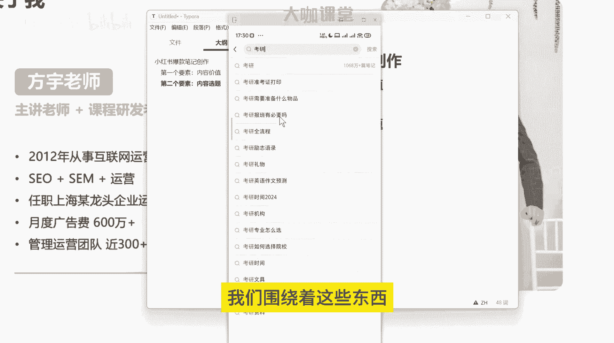

来创作我们的一个内容，这就是我们要考虑的一个热门关键词。

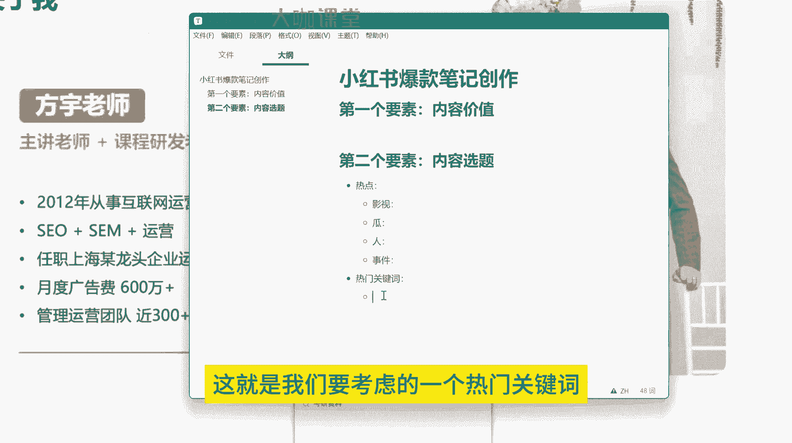

那么除了这个地方，还有一个地方啊，呃还有一个地方就是什么呢。

就是我们的一个笔记的创作灵感了。

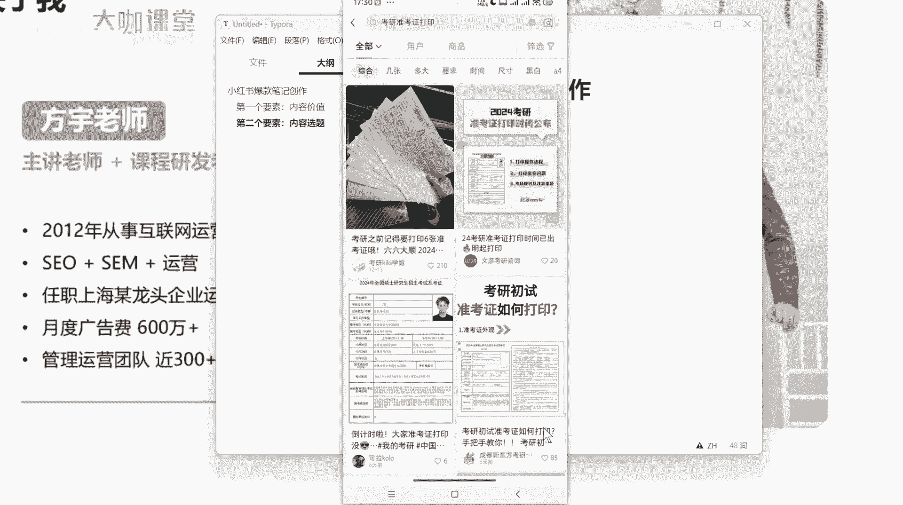

这个搜索发现我之前跟大家讲过了啊。

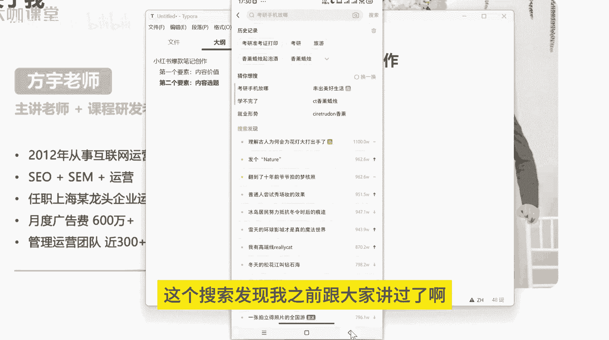

其实就是我们的热点事件了啊，然后呢我们的这个创作灵感呃。

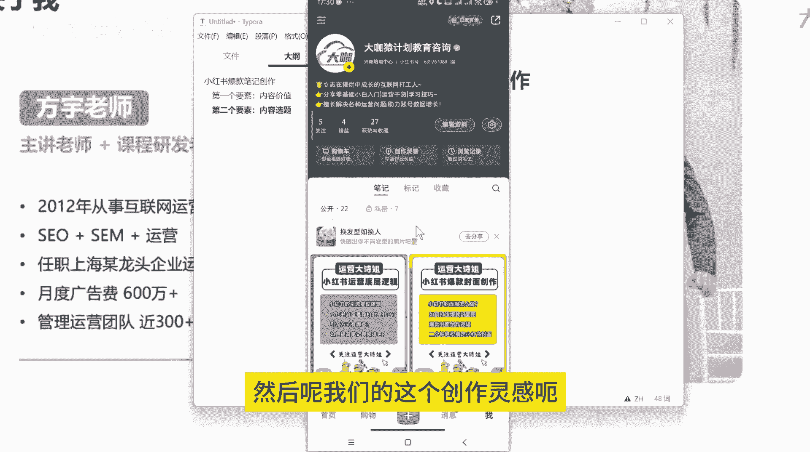

比如说在这个地方，我们在这个地方呢去挂靠一下啊，这个地方呢，虽然说虽然说这是官方推出的一些话题呃。

我们不一定能挂靠上，但是你挂靠的时候呢，他会给你一个基础的流量奖励啊，你发布了笔记，在这个地方他会给你发一些流量的奖励，有时候呢假如说你的笔记质量还可以，他给你的这一波流量奖励。

不管是两百五百还是1000。

都能够给你的笔记带来一定的增益啊，一定的增益，假设说你这个笔记质量还可以。

也没有违规，然后呢官方的给你的流量券，你又彻底用上了。

那么你的这篇笔记就可能对你的账号造成呃，形成形成一个很大的一个提升。

OK这是创作灵感这一块，我们现在很多人应该大概都知道这个东西，但是用的人依然不多。

因为什么呢，因为很多人觉得这个东西它没有用是吧，嗯我告诉你啊，这个东西它不一定没有用。

只不过呃这个东西呢，官方在给你用这个东西的时候，挂靠这个东西的时候，他会考虑会有一定的审核的要求和基础和门槛，OK但是你一定要去尝试这个东西。

OK这是我们的关于创作灵感这一块，以及我们关键词选题这一块啊。

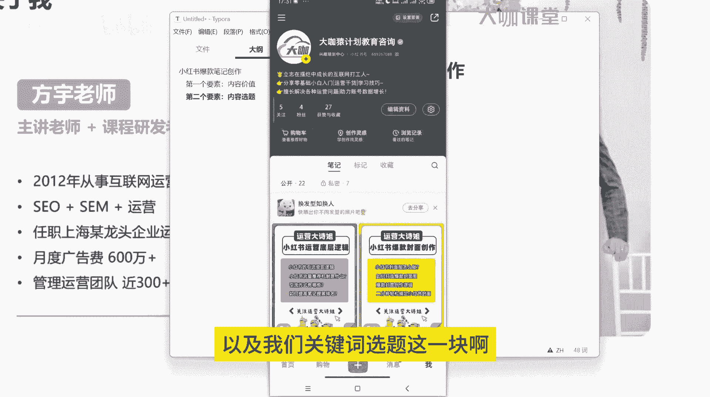

其实呢关键词这一块我们之前还跟大家讲过。

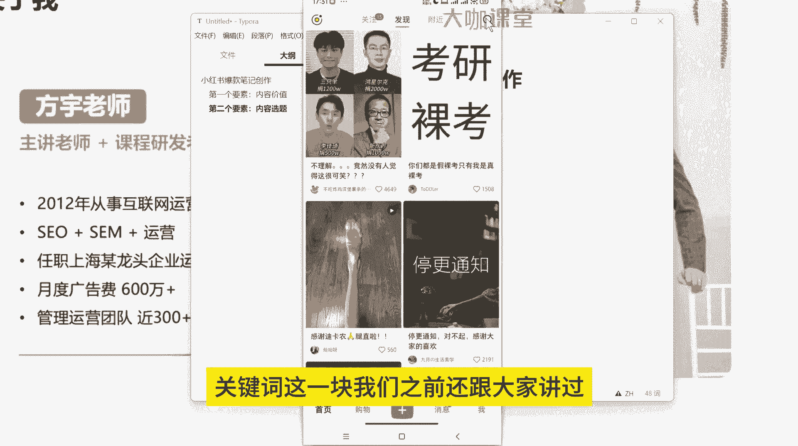

还有很多的内容，对不对，比如说我们还有二级考二级关键词，三级关键词，比如说我们刚才说的考研对吧，那么考研准考证，假设我们现在啊考研下面有这些词，我们现在来搜考研准考证，我们看一下。

下面给我们提供提提供什么打印下载，可准可证怎么打印啊，这个嗯这我只是给大家展示一下啊，但是虽然这个词它没有意义，但是呢我们再把这个词输入之后，它下面提供的这些下拉词，它本身就是我们的一个二级词。

甚至还有更多的它会有三级词，是不是我们来搜一下啊，全流程我们来看一下24在职专科生，艺术类会计花费本科生，这是不是就是我们的另外一个方向对吧，我们刚才考研没有这些内容，那么你围绕着考研来做。

你围绕着考研全流程来做这些内容，这就是你的一个创作方向啊，这是我们的二级词，还有三级词，对不对，在职在职科目啊，在职考研全流程规划，在职考研全流程报名要求。

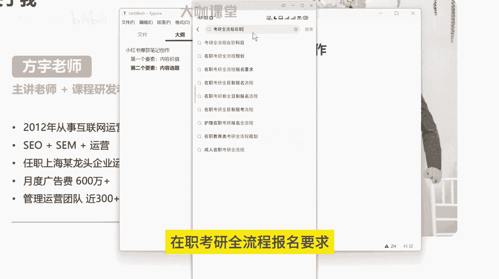

这是三级词了，对不对，这就是我们去考虑选题，考虑创作内容的时候，我们的一个基本方向，也就是说你要迎合平台的一个需求，平台展示了用户最需要的内容。

你就要根据用户最需要的内容来创作你的内容，你才有机会怎么样去呃蹭上这个热点，或者说你才有机会成为爆款，OK我们这里给大家写一下搜索词啊，我这我写清楚一点啊，一级搜索词，二级搜索词。

然后呢还有我们的这个创作灵感对吧，嗯这个地方呢我把搜索发现加上吧，其实呢它就相当于上面的一个事件的一个，综合体，OK那么这就是我们创作爆款笔记的第二个要素。

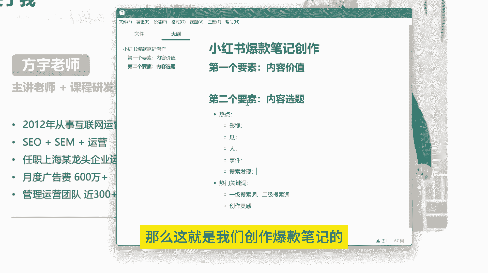

内容选题，OK那么下一节我们再跟大家讲一下，我们创建爆款笔记的一个关键的东西，几个关键的东西，封面标题。

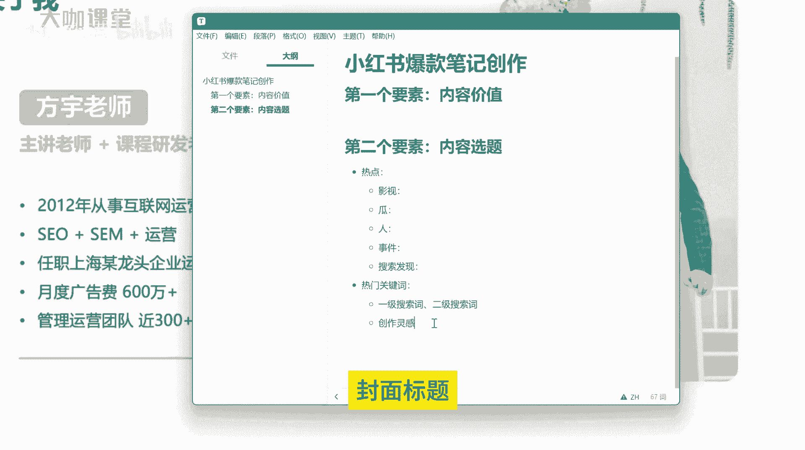