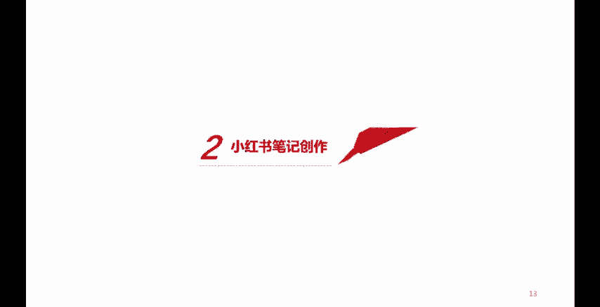
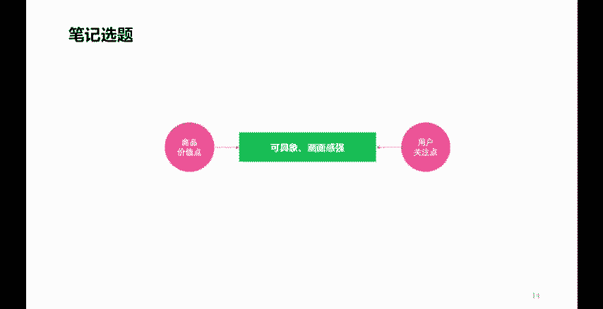

# 【600集精华教程】小红书运营新手起号 0-1新媒体运营必学课！不要荒废18-30岁，一切都还来得及 - P11：P10小红书笔记内容选题核心方法 - 轻松爆火了 - BV1gi421k7iz

各位朋友大家好，欢迎来到本次课程。这堂课呢我们继续讲小红书的运营。那么接下来呢，我们要讲的是小红书在账号准备好之后呢，接下来我们就要进入到一个小红书内容的一个创作环节。那么首先呢我们要再强调一个点。

小红书呢本身是一个内容电商平台。他通过笔记内容的创作呢来获取流量，获取更多的。兴趣用户，然后呢，将这些流量这些兴趣用户呢去更好的转化成我们企业或者是我们产品所需要的一个什么呢？实际的一个销售量。

那么小红书的笔记如何创作呢？那么接下来我们看首先第一个点，我们要考虑笔记的选题。

以及选题应该怎么选呢？不管我们做的是个人账号还是企业账号。我们首先能够明白的是我们在创作一篇笔记内容的时候，我们需要对什么样的商品。什么样的一个产品去进行一个什么呢？内容的一个分享创作。

或者是内容的一个展示或者推荐介绍。那么这个商品本身它都有什么样的优势呢？比如说这个商品的材质。这个商品的原材料。啊，这个商品的什么呢？工艺。啊，这个商品的什么呢？呃。

一些使用的一些方法或者使用的一些感受。商品的，比如说这个。服务啊，这些等等的都属于商品的价值点。那么同样呢，我们可以将这些价值点呢去联系，去结合一下我们所针对的这样一个商品的目标用户的一些兴趣的关注点。

那么我们的目标用户。针对于这些商品消费的时候，都有什么样的一些痛点，或者有什么样的一些共性的行为特征呢？那么基于这两个点。我们就可以联系出很多。具象的。一些选题点。

那么我们就可以将这些选题点呢成为我们一篇笔记的一个核心的内容构成。而且呢我们在创作笔记的时候呢，我们就要去思考。我们即将要展现的这个商品，即将要创作的。商品。他的。体现。都需要在哪几个方面？

我们是通过视频来体现呢，还是通过图片和文字的方式来体现呢？那么这就涉及到了我们商品。不管是图片还是视频。方面的一个实拍，一个创作。当然如果你是个人账号。啊，帮助一些商家去实现流量，实现一些带货的话呢。

你也可以要求商家来给你提供一些素材啊。那么当我们有了这样一些内容的时候呢，我们就要开始梳理我们这篇笔记的一个整体的脉络。我们就要去想。用户在购买这些商品的时候。最核心最主要的关注点在什么位置？

那么这个关注点呢，就可以成为我们这篇笔记的一个什么呢？首要的一个什么呢？内容诉求或者是一个切入点。甚至我们这篇笔记的标题。也可以围绕着这个点去进行展开。好，那么这个呢是关于一个笔记内容的一个选题。

帮我们找好了选题。捋好了这个创作的思路。接下来呢我们就要去看一下笔记内容应该如何去创作，有什么样的技巧。

