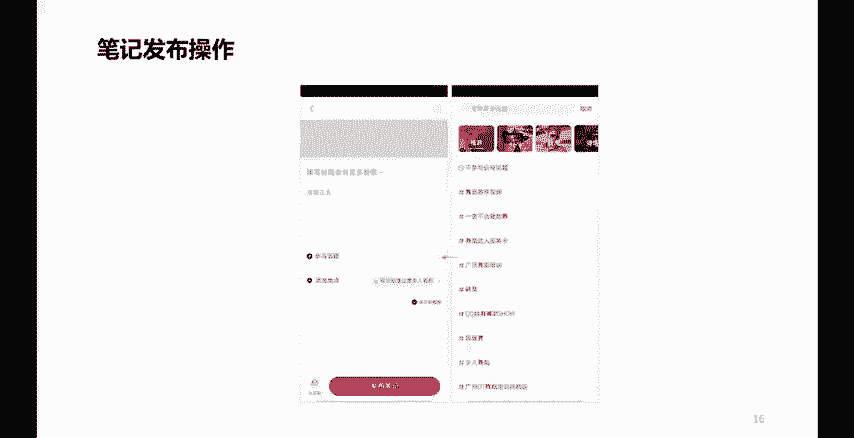
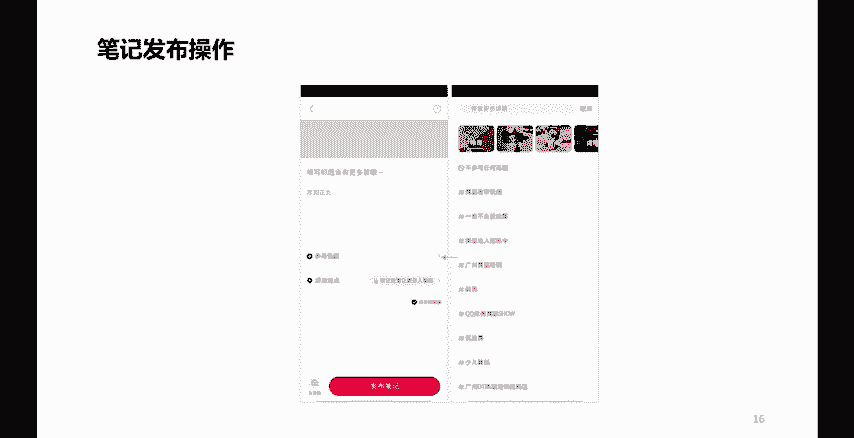
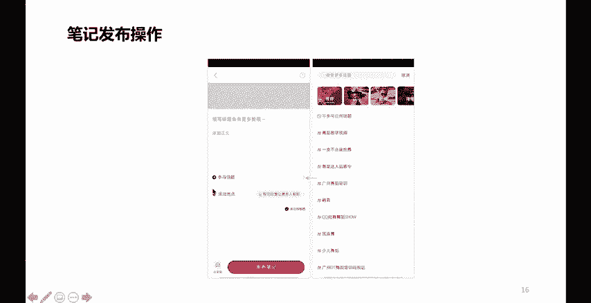
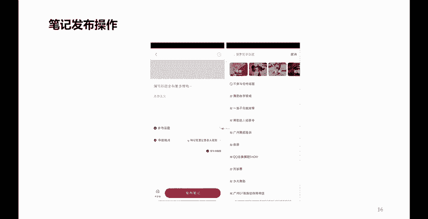
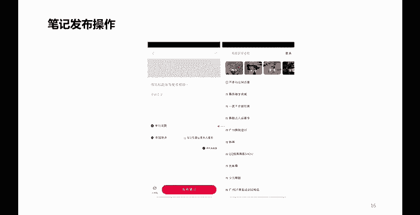
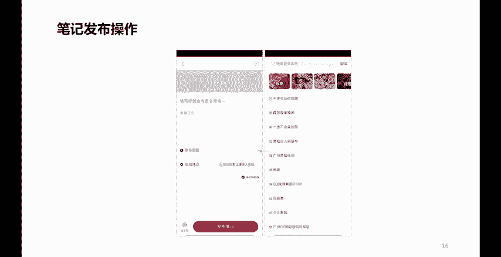
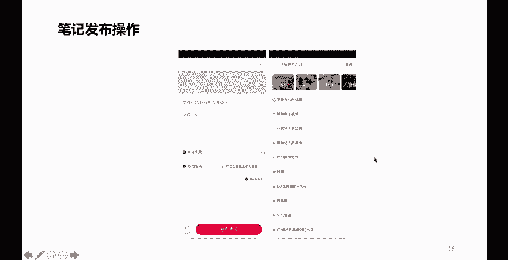

# 【600集精华教程】小红书运营新手起号 0-1新媒体运营必学课！不要荒废18-30岁，一切都还来得及 - P13：P13小红书内容分类创作 - 轻松爆火了 - BV1gi421k7iz

好，那么再往下看呢，我们在发布小红书的时候，我们不是创作内容了吗？创作内容在发布小红书的时候呢，往往呢在这个地方呢有一个叫做参加话题。是吧你看上面这个灰色的部分呢，它是要么就是上传你的视频。

要么就是上传你的这什么呢？图片，哎，多张图片，哪一张做封面是吧？图片上面是不是还要做一些图片当中的一些我们叫做画中标题哎，在图片当中做一些标注啊，是吧？做一些标签啊，哎，写一句话了，是吧？

要通过一些软件把它设计的特别漂亮，特别好看，色彩搭配要很唯美是不是啊，就是在视觉部分好，那么下面这儿呢是写标题啊，这儿呢是写我们的正文，那么这个地方呢就很关键了，参与话题。

我们在创作小红书笔记的时候，我们要去思考一个点。如果我们能介绍一些话题的力度，一定程度上呢是很容易把我们的小红书的流量呢往上推一推的。那么这个话题呢，虽然说借绍它有利有好处，但是呢不能乱借。

是吧你比如说你明明做的是口红，我非要用下这个。话题、舞蹈教学视频，那这肯定就有问题是吧？所以说你在参与话题的时候，你可以去搜索一下，或者通过这些板块去查一下。看看有没有匹配自己这个内容的一个话题。

如果有，那你就可以用过了。如果没有，那宁可不用。啊，宁可不用。好再往下是什么呢？添加地点。这个地点要不要添加呢？我告诉说各伟当然要。

啊，当然要。添加这个地点。那么地点呢，必须是你小红书登录的这部手机。真真正正所处的一个地理位置。这是最好的。那，比如说你现在在北京。啊，在北京哪儿呢？在北京的这样一个朝阳区。是吧。那么你的地理位置呢。

就可以添加北京市朝阳区啊相关的一个位置。啊，你不能说你在北京市朝阳区，你非要把自己的位置定位在什么呢？定位在这个其他的省份啊，或者是其他城市省份的一些城市。

那么这个呢也是会影响你最终的一个效果的。啊，为什么呢？因为小红书内容的推流呢，有一个叫做什么呢？同城推流同城。

啊，他会将你的内容呢进行同城用户的一个展现。那么我们知道同一个城市。啊，同一个城市呢，对于我们内容的效果呢肯定是有帮助的。有每个人城市都有每个城市的一个什么呢？一些什么呢？

文化啦、习俗啦啊或者是一些什么呢呃城市的一些精神啦等等之类的哈。所以说呢我们尽量呢要考虑同城，而且同城的这样一些分享呢，也有利于比如说有一些做线下实体店的，也有利于你线下的一些导流。

啊，线下的一些道访。所以呢我们在发布的时候呢，一定要注意这样一个技巧啊，要注意这样一个技巧。当然呢有的人说我可不可以通过电脑去发布呢？

当然也可以。电脑发布有什么好处呢？啊，这个呢就要说一说，我们在做小红书笔记的时候，如果说你做的是一个视频。啊，你做的是一个视频。那么这个视频呢，我们知道往往通过手机进行上传发布的话呢。

有的时候呢会丢失一些什么呢？丢失一些像素或者是影响视频的一些高清质量。所以这个时候呢，有些时候啊就是做视频的时候，我们就需要通过PC端来确保我们视频的一个高清的这样一个质量。那PC端在哪里登录呢？

大家可以呢去通过小红书平台啊，有一个创作者服务啊，在那里头啊，扫码就可以登录了。那登录进去之后呢，你就能看到有一个笔记发布的这样一个菜单，点进去之后啊，就可以进行发布了。啊，在我们的PC就是电脑端啊。

这是小红书发布的一些技巧啊。

