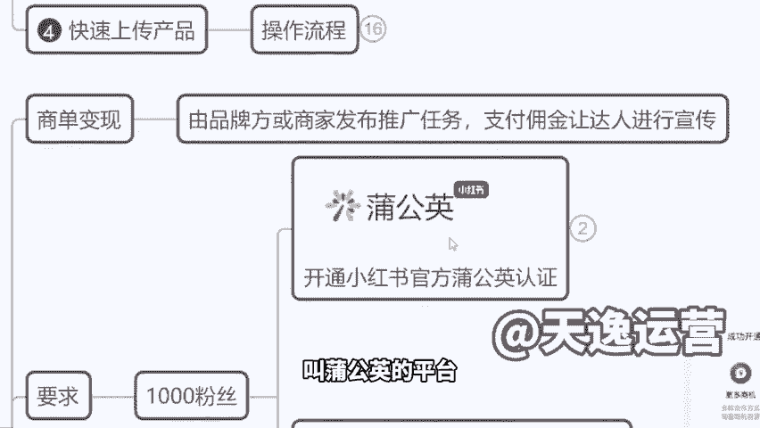

# 【600集精华教程】小红书运营新手起号 0-1新媒体运营必学课！不要荒废18-30岁，一切都还来得及 - P16：1.小红书商单变现，什么是商单 - 轻松爆火了 - BV1gi421k7iz

。Yeah。

🎼Yeah。既然我们说到这个工具，我把商单也跟大家介绍一下。😡。

商单的话是开店是这样的，开店是属于细水长流。你第一个月下来，可能一天我就四五个订单，四五个订单。后面随着我的粉丝的增加，看到我作品的人越多了。然后我的订单慢慢的增加了啊，51万2万我的收入这样去叠加。

它是有一个过程的。但是如果说接单他跟你的粉丝数真的有什么几万呢，你的浏览率啊，你的这个播放量没啥关系，就是只要有1000粉就能开始挣钱，每天都是有单子的。然后像这种的话呢，如果说你们去做第一个月啊。

收入不会低于5000块钱，有多少人想了解商单，想了解的，我们扣一，想了解的多，我就拿到前面来跟大家讲，跟这个AI工具我结合在一块去跟大家讲掉啊。😡，想了解吗？OK想了解是吧？好，那我来说一下啊。

商单是这样的，来，我们看一下啊，这个商单到底是个什么东西。我们带货其实大家大纲也知道了啊，商单呢就是一个广告。😊。

你发作品给别人的品牌打广告，就不是说卖自己的产品了，而是帮别人的产品打广告是吧？那这个时候呢，它是有，比如说我是蓝天牌牙膏。那么我作为商家来讲，我就先到小红书的官方平台，叫做这个蒲公英商单。

叫蒲公英的平台。然后呢，我去平台发布任务。😡。

这个时候你的任务是有价格的。比如说它的一个价格是600，你不是说可以拿到600的啊。小红书人家分走的钱很高的。比如说他人家拿600块钱，对不对？小红书要分走300元，作为平台的费用，你用我的平台宣传。

我要收平台费300元。然后你的费用呢也是300元啊，你的费用也是300元。这个就是蒲公英商单里面，他那一个模式，那如果我们成为了蒲公英的认证的接单，就是认证的写手，这个叫做一个写手的一个身份啊。

给大家看一下。😡。

写手也叫编辑。你叫编辑，其实这个模式它并不是对所有人公开去招标，公开去招募的。就比如说我今天我啥也不是，对不对？我有1000粉丝了，我是不是就一定能够开通这个普通易商单了。

并不是的他作一个写手和编辑来讲，相当于说是小红书平台对外招募的写手，你是来帮小红书写文章的那他对你的要求，就跟你去找工作面试是一样的。要求你是某公司。😡，在职在职或者说曾经任职过的。😡，编辑。

你是某个传媒公司的编辑，或者说是品牌的运营。😡，运营你是有这个工作经验的啊，然后以面试的方式，他不是不用跟你面谈啊，就微信上聊啊，觉得说okK你有这个资质，他就给你开通这个权限。😡，啊，但对于大家来讲。

现在其实也没有，对不对啊？但没关系，这个到时候我们可以给大家去处理啊，一样的，以我公司员工身份直接给他报上去就可以了。那么达到1000粉之后，你就可以在这个平台看到大量的订单。

我们就可以去里面选择你想合作的商家啊，他们会对外去招募，或者说当我们在平台有携手的身份，有认证标志以后，商家会主动来找你，他会直接私聊你跟你去达成合作，这个都是有的，是这样的一个方式啊。

大家应该也知道了哈，对不对？那么我们看一下他的体验，他的展现形式是咋样的。我们其实今天在小红书看到的很多这样的一些达人，就好比如说这种同学们看一下啊，这个曝光黑名单，热门美容仪别踩坑了。

你看他跟你介绍了一大堆美容仪。然后呢，告诉你该怎么选，是不是？然后跟你讲了很多牌子，大家能看出来这是哪个品牌的广告吗？😊。

能看出来吗？😡，是不是好像看不出来哪个看不出来，对不对？是这个啊，第一个赔持。😊，啊，因为大家不了解美容仪啊，就是其他都是品牌。你们呃你们可以这么理解。😡，啊，其他都是品牌，只有第一个是杂牌。

只有第一张图是杂牌，他这个广告写的很好啊，就是他把一个杂牌跟其他品牌货全部放在一块儿。😊，然后让你误以为这也是个品牌啊，评论区他这个互动下单了赔驰飞驰，是不是？😡，这个就是他的广告啊，我跟大家讲一下。

你们在小红书看到的所有的盘点，不管是什么品牌，是个美容仪也好，是个剃须刀也好，是个香水也好啊。来，我们看一下香水是个香水也好，是个狗粮也好，没有人会闲的没事干，给你做测评来，我们再打开小红书这一个界面。

你看这么多品牌，难道说真的是这个博主，他自己自费掏腰包，买了这么多香水回家去闻吗？然后给你写总结吗？没有的。😊。

没有的这就叫商单，这就商单。来，我们看一下，就好比说这个账号啊，看过这种类型的没有情商账号就是他的所有作品呢是在跟你互动啊，问你说啊，这个呃比如说桌上有5个领导，你手里呢有4支烟，请问怎么发烟。

才能让让5位领导满意，对吧？好，这时候评论区就开始互动了。因为大家看到这个问题，还始集思广益，还是回复了啊，好，你的账户活跃度不就起来了吗？对吧？浏览率不就起来了吗？好，那这个时候你粉丝上来了。

你就能接广告了。你看啊，就这样的一个情商号中间夹杂了各种广告。来这个烫发护理的。😊，这是一个商单是吧，他是不是真的自己去烫发，跟着他跟他分享，没有跟他没有关系的，是不是？然后还有呢防晒的。😡。

定妆喷雾等。啊，面膜的看到没有？😡，是吧然后呢，这种要的。😡，以及狗粮的啊狗粮的这都叫商单，他不是说闲的没事干，做了这么多测评，这个测评都不是他自己做的啊，这就叫商单。大家理解了没有？这个就叫做商单啊。

这个叫商单。😡。