# 【600集精华教程】小红书运营新手起号 0-1新媒体运营必学课！不要荒废18-30岁，一切都还来得及 - P17：2.小红书商单变现要求 - 轻松爆火了 - BV1gi421k7iz

。Yeah。

🎼Yeah。那么这个单是什么样的一个情况呢？单子分两种，一种呢叫做。直发订单。直发订单就是你不用写文案，不用找图片，商家全部提供。😡，全部提供。就像这个一样来。

我们之前有很多新手刚开始做的时候都接这种单啊，因为这个单虽然很便宜啊。我跟大家讲，这种单不怎么挣钱，一个单100150100块钱，150块钱那种。😡，嗯，给大家看一个，哎，我找一个之前有做商单的同学啊。

找一个给大家瞧一下。来这个曾林慧的，我给你们看一下，我这个学生给我发了啊，好多图片，这是最早在接单的时候，我都有记啊，就他每个单我都会记记录。然后你们看一下，这个是之前你看这个有没有档期合作。

他这个是怎么讲的？你看下午写好图文发给你保子啊，这种我就很便宜，然后商家会直接给你安排好一切，因为他们有自己的这个品牌，有自己的品牌宣发，他会写好给你，你负责发就行了，但这个很便宜啊。

因为你只是个工具人对要帮他发一下就行。100块150块钱，钱不是很多，然后这个叫直发单，你什么都不用干啊，但是由于现在订单竞争人数肯定是越来越多了，未来做这个行业人越来越多。你如果说没有写作能力。

没有创作能力，只会做直发的话，你未来是没有市场的。因为他找谁发都行，对不对？但如果说未来我们的账号，你的认证里面认证的身份是原创达人。😊。

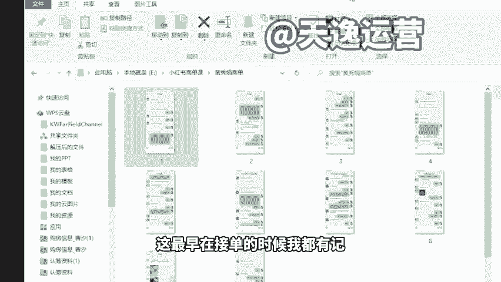

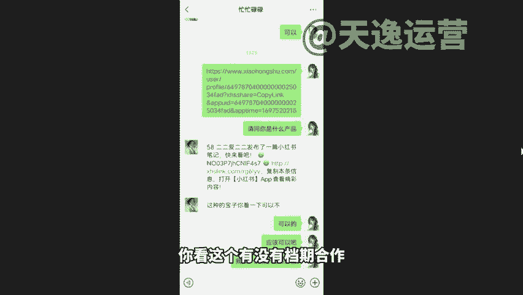

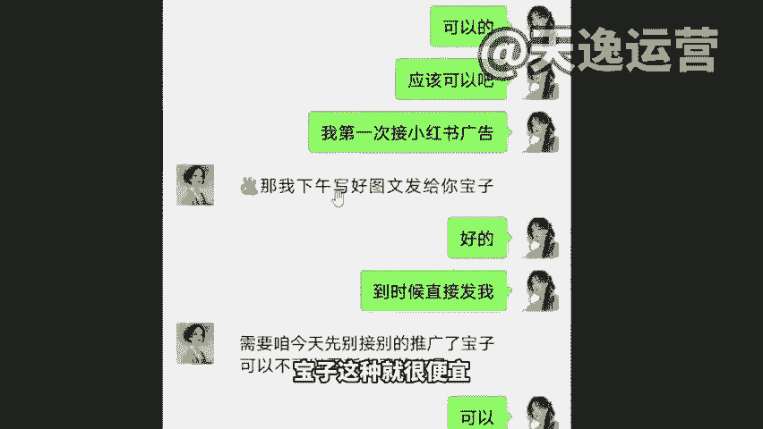

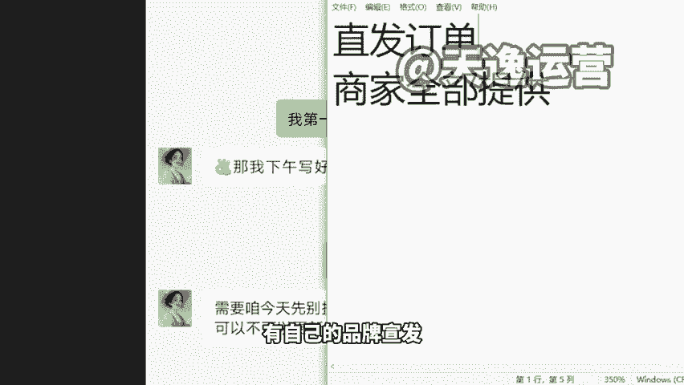

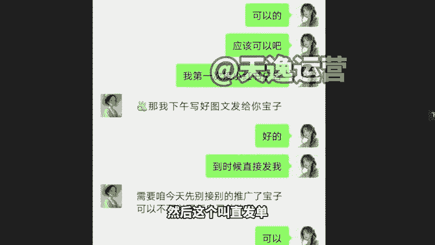

原创达人，那么你的价格就不一样了，你的价格就不一样了。如果咱们是1000粉丝数啊，那么你的单价最起码是310条，310条就是原创单是310条啊，你个别想打价格战的，你设个250、260240的也有啊。

但是通常300块钱是均价。那如果说粉丝越高，价格也是越高的。你们可以看一下他后面啊，他后面价格完全不是这个数了然这么多广告啊，当时跟我讲的，你看他说我跟韩数运营说了，晚上给大家发，他同意了。

现在是接到函束的一个订单，一个订单是2000多块钱。😊。

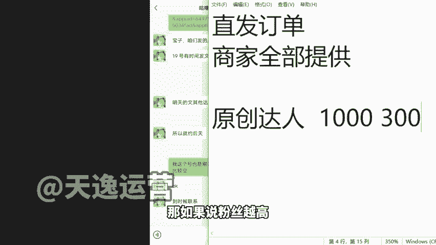

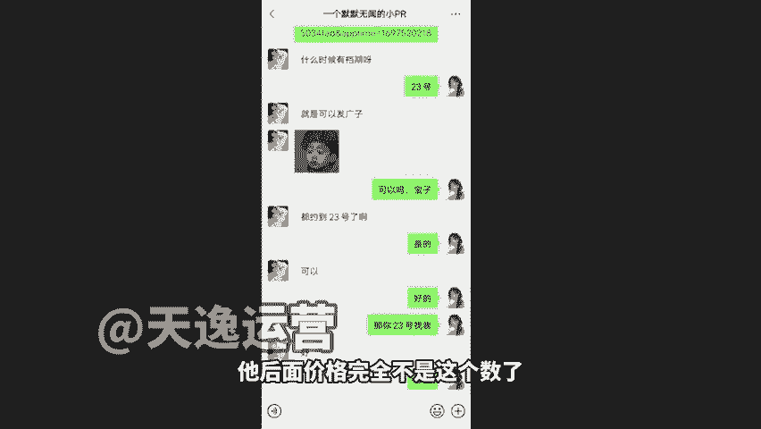

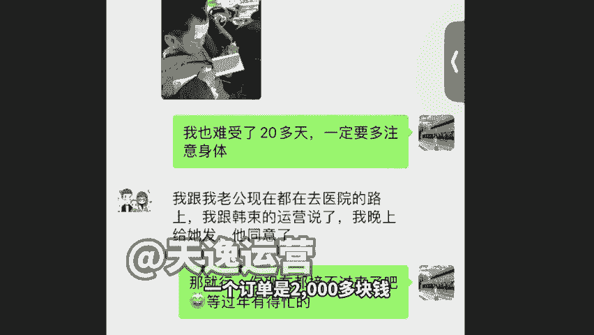

我给你们看他从过年啊，这个图是过年前截给我的。然后到目前我估计他单子应该还在叠加。他当时跟我讲说，过年不出去串串亲戚了，不去任何地方玩，就在家里。😡，发作品看到没有？待接受79条。

他那个时候啊才月初的时候，当月收入已经累计到7650了，就接都接不完的状态啊，这个就是蒲公英商单后台，看到没有？蒲公英商单后台79个待接受进行中8个，所以我算他一条400500来讲，5001条来讲。

你们自己算一下这多少钱。😡，啊，因为现在小红数平台广告越来越多啊，我们现在手里头囤了好多，就是我们得完成，不完成的话，有个违约金什么的，或者说这个单子就派到别的公司去了啊，所以说我巴不得让你们去接。😊。

巴不得你们来接啊，巴不得大家来接，巴不得你们来去承接这个东西。然后如果说价格高的来，我举几个例子啊，如果说做原创啥意思呢？就是图片可以找商家要，但是文章我们自己来写啊，因为商家写文章很费时间。

或者说图片我们也可以自己去找，自己去做，你们看一下啊，我拿一个那个这个是其他公司的，我来跟大家讲一下啊，这个其他公司的一个号都注销掉的。我当时看到这个号的时候，我特别我就得特别心疼。我当时我在想。

我跟我们团队想要不要咱们花钱去收一些那个不挣钱的账号过来啊，你看一下啊，这个粉丝数初级达人啊，为星约这个号注销掉了，因为不挣钱，别的公司的啊600啊不算因为不能说是别的公司的可能就是一个小白座号啊。

突然报号了，但是不知道怎么挣钱。你看啊6898个粉丝数，截止到2月18号啊，这个18号过去很久了，但这个数据因为他他是呃半个月更新一次啊，然后现在还没有更新来6898看到没有？那么他的一个接单情。😊。

情况什么样的？近30天来我们看他投放评估啊，就他那个单价多少钱，150，我记得你看到没有？150，因为他没有原创能力，他只会直发。然后他是一个单都没有的。近一个月啊，一个单都没接到是吧？你没有原创能力。

别人凭什么拿单子给你啊，我凭什么送钱给你，我找别人不行吗？对吧？别人还有100块的，那近60天我们来看一下，就等于说两个月以来，他注销号之前接了单没有，就接了4个？😊，那没就借了4个，对不对？

就借了4个150，接了4个多少钱，800块钱吧，还600块钱，600块钱啊，是不是这个很少的？但是我们看一下同样的差不多那一个粉丝数啊，来这个啊来我们之前一个学生这个号的话，粉丝数会稍微多一些。

7000多啊，这个不是啊，来，稍等这个。😊，来这个5177个粉丝数，看到没有？5000多粉丝数，粉丝数没有别人多啊，但是它单价完全不一样。5000多粉丝数做原创。因为它这个是有原创认证的。你看样式素人。

湖南长沙未任何公司都是普通人是吧？自己有自己的本职工作，就副做一下这个小红书的，700元的一个报价，同文报价700块钱一条，然后他的单子是多少个单月就这个就这个月的这个统计啊，不是说这个月啊。

是从今天起，从今天往前面数30天，它是近30天数据，从今天起往前数30天，37个订单，37个订单，然后呢是700元的报价，来我们看一下37个订单，700元报价是多少钱啊。

这是他这一个月的一个收益是2万多块钱，看到没有？这完全是两个极端的这个效果，所以说原创很重要，那我怎么样去写这个原创内容呢，我们拿这个AI刚刚我们讲的这个AI来写，对吧？你直接点开种草文案。

我们就说刚才的那个。😡。

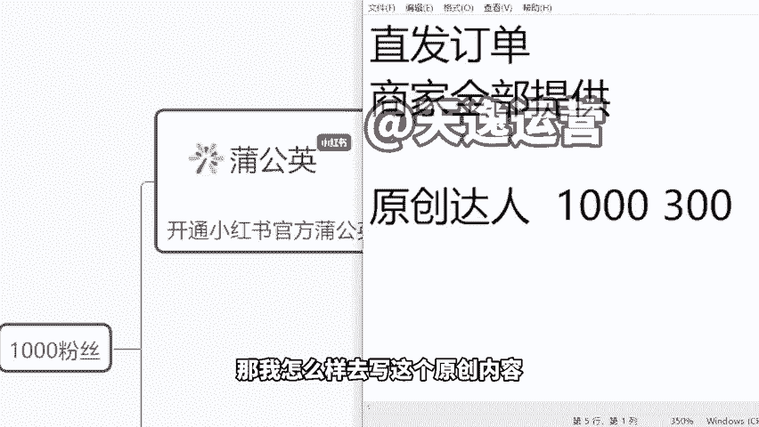

美容仪。因为很多同学说老师我是男的啊，我是包括我是女生，我都不用美容仪，我根本不懂这个东西怎么办？我怎么写，人家要求我写250个字的产品描述出来，我不会。😡，来平，那我们就选美容护肤，对吧？

我产品我选什么啊？我选来美容仪。😡，对吧当然啊关于产品描述这一点，你要找商家给你连卖点出来，就是你要问他这个产品的功能是什么，让他把功能告诉你，你把功能填在后面，我们时间原因我就不写那些东西啊。

然后我们来点生成，对不对？这个时候语气也是一样的，你要去根据自己的需求来选，我知道友好了还是怎么地的啊，一般我选友耗比较多。那么同样的，我们点生成，这个文章它会在几秒钟的时间立刻给你写出来。😡。

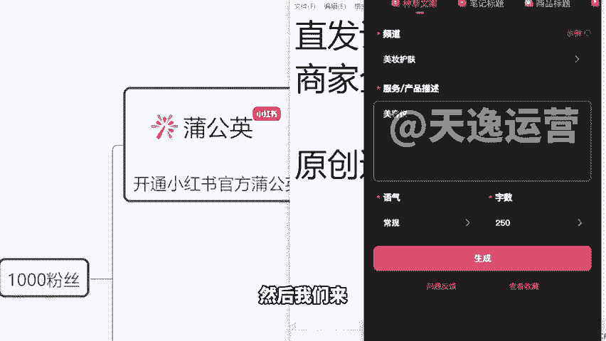

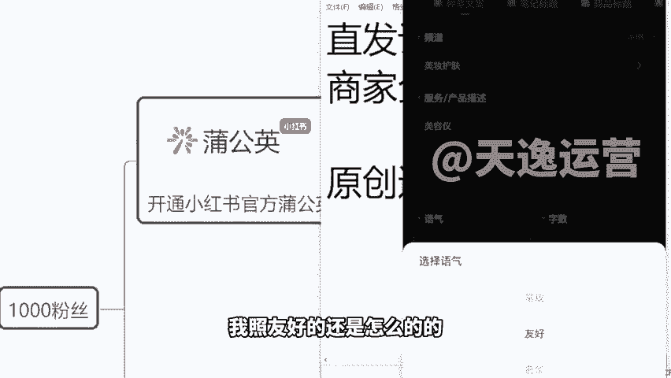

来，你看就算他就算你不懂美容仪，没事儿啊。你看这里亲爱的护肤达人们给大家种草一款超级神奇的美容仪，你是否在为肌肤暗沉、细纹、痘痘烦恼？这款美容仪可是你的啊肌肤救星，看到没有？功能直接给你拓展出来了。😡。

首先其次最后来你看。😡，啊，首先呢提拉紧致，深层清洁，美白亮肤以及搞定是吧？什么导导入导出技术啊，能帮你吸黑头吸毛孔啊，还能帮你把这个好的乳液给你导入到皮肤里面去，是不是来，你看我对这个不满意。

我再点换一换，它这个很细节，表情那些都给你选好了，对吧？卖点给你罗列好了。这个第一个好的点是什么？第二个好的点是什么，对不对？还告诉你啊，这个采用先进的声波振动技术，红光模式啊，等等。来。

这个东西好不好用，好用，咱们扣3个6，我看一下啊，好用，我们去扣3个6。😊。

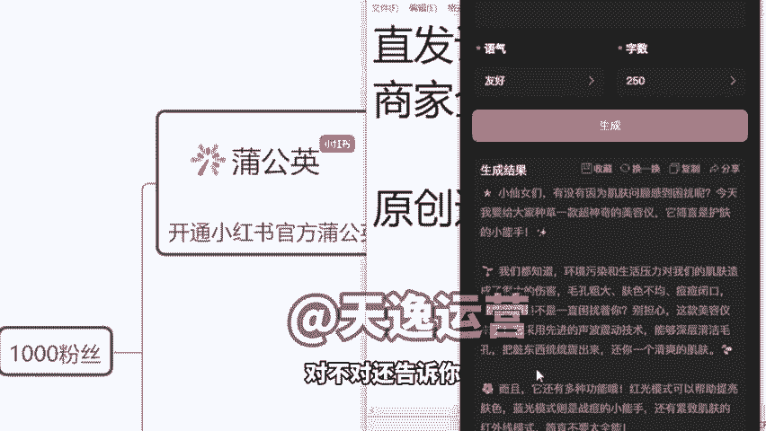

是吧你不需要你说我我不懂这个东西啊，怎么怎么地的是吧？我不懂这个产品，那没有关系啊，他会帮你写是不是他会帮你写啊，来包括像这个产品除外的话，我们之后去做其他类型也是一样的。

比如说我要做的是一个这个沐浴露啊。我要卖的是一个多芬沐浴露，你把牌子写上去都行，来沐浴露是吧？一样的，我直接让他给我去生成这个文章，同样的帮你来写，而且每一次我们再点击换一换的时候。

他生成的内容都是新的啊，都是完全不一样的。如果说你怕错过好的文章，那我们每次生成之后，你把这个文章呢先复制保存到自己的那个手机里面，保存到一个文件里面啊，保存到一个这个文档里面，然后呢，再点换一换。

再生成新的，到时候生成好几天之后，我们选一个合适的啊，然后呢再去发给商家去审核就行了。然后但是这个东西呢，我们不能去跟商家讲说老板你让我来进你的单吧，我有工具，你不能这么说啊，你要接单的时候怎么说。

你拿到人家的。😊。

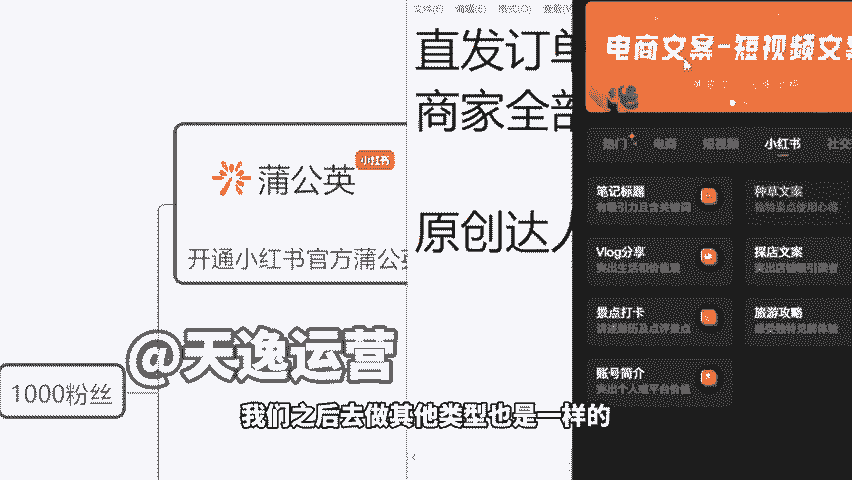

任务之后，你等那么一个小时，一个半小时，你再把你选好的文章发给他啊，表现出一个真是咱们自己写的感觉。他如果说哪里有问题，咱们再做适当修改就行了。那如果这一篇，他说不行，换一篇，我再过一小时。

我再拿篇新的，立马又发给他。😡，是不是我可以说到最最起码一点，这种水平，这个文章写出来的一个效果肯定是要比咱们自己去写的效果要好很多的。😡。

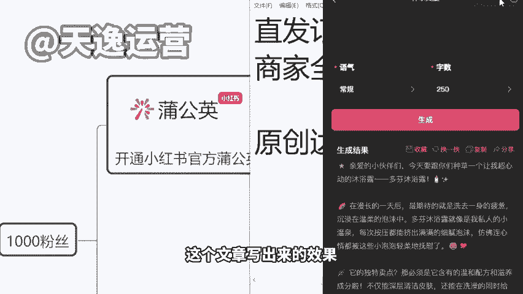

你这个东西写出来是要超过很多这个素人小白自己写的文章的，而且人家效率很低，对不对？那这样的话，我们接单是不是就不会担心了啊？那这个老师那既然接单的话，我要1000粉丝涨这1000粉丝难不难？😊，啊。

我找这1000粉丝难不难？呃？首先我跟大家说啊，我们到时候去做这个接商单的账号的话，我不用说我指定就做一个类目。比如说我这个号只发沐浴露，我这个号我就只发什么这个狗窝呀什么的，这个不是这样的啊。

你发啥都行，你发像刚才的那种情商也可以。😡，是吧然后你去发一个什么科普的那个作品也行，你去发一个这个影视解说都行等等啊。你去发一些这个语录合集啊，或者说搞笑段子合集都可以，就是只要我的作品是能有人看的。

不管是发啥类型，只要你的粉丝达到了1000，你的账号没有限流状态，我们的播放量是O的，那么你就能够去达到这个平台的审核要求，然后这个认证的话，我会帮你们开啊。因为像相当于说我前面也说了。

我是属于你的代教人，那么如果说这个单因为我们手里我们手里是有很多资源的。如果这个品牌方的一个单子是我们派给你的对吧？那么你该拿的那300会不会分给我一分钱不会分给我。

因为本身你跟平台的平分的这个单价就是300跟300，你300平台300。那么如果说这个资源，这个单子是我给你提供的对吧？你这位达人是我介绍到平台的，那么平台的300元里面会分给我50。😊。

我分给我们公司50，这个钱跟你没有关系啊，就我们不会从你的获利里面去抽成。这个钱是由平台去分给我们的啊。所以说其实我们也相当于一个合作共赢的方式，你来帮我消化资源，你来帮我完成这个任务，完成这个呃订单。

那这个时候你能挣钱，我们也能获利，对吧？我们是走量，那你靠多接多赚钱就可以了。😡，是这样的，一00粉的话挺好涨的啊，一000粉的话，基本上我们到时候会给大家去做定位。一000粉的话。

7天10天左右是完全OK的啊。我们基本上其实三四天左右的时间是可以的。我给你们看一个吧啊，我们之前有学生做健身教练的。😊。

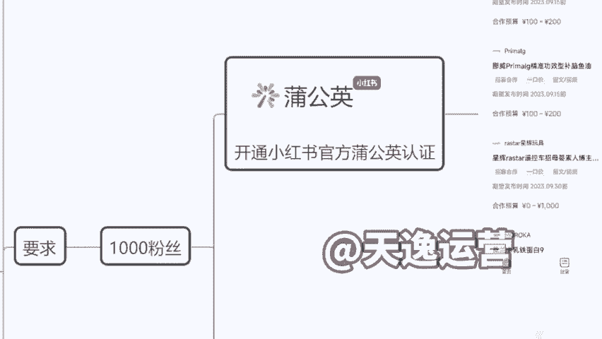

他是这样的，他是做了影视解说，但是说实在的，我不建议你们做影视解说了啊，因为他是去年的你们现在做影视解说，已经市场太做太多了。但是我今天不会在课堂里面去给你们建议说你一定要做哪个类型啊。我但凡说了。

咱们今天课堂几百号人啪啪啪全是做一个类型，你再做也不可能了。所以说这个我们以后私下再做定位，我们一定会把好做的类型，我们私下里给你一个人，每个人的类型是不一样的。所以说这个不要在课堂问我说老师。

你推荐做什么啊，我不会回答的啊，这个东西不回答啊。然后但是呢这个视频视频解说影视解说确实不建议做了，因为做人太多了，来，你看一下啊，他之前是做过抖音，做视频号，没有效果的。

因为他只是做给他们自己健身房引流嘛，对吧？拍一些自己的那个健身视频啊，腹肌啊，这个胸肌什么的啊。然后但是呢他。😡。

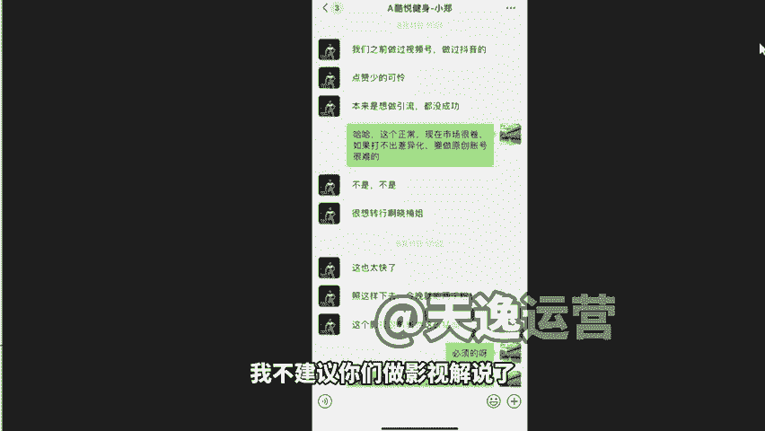

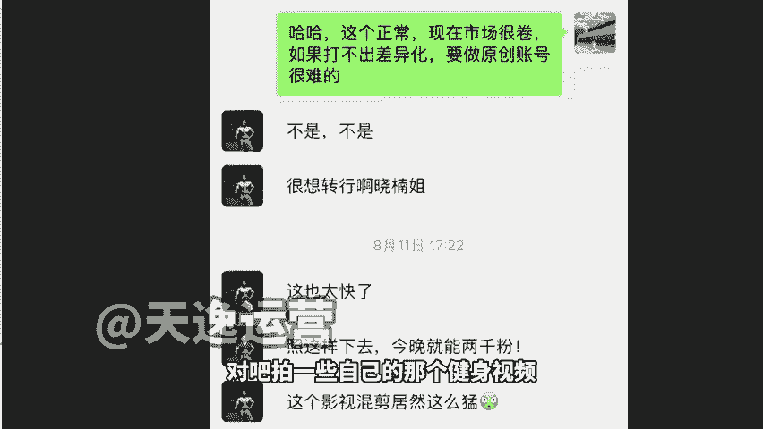

呃，其实这个大环境的原因啊，办健身房办健身卡的其实越来越少了，就大家很很难说再愿意去花一些额外的这个消费，去提升自己的生活品质了，对吧？更多愿意啊，还不如在家多买2块排骨，所以说其实他们生意不好做。

就跟我讲说想转行啊，做一下试一下别的这个项目。然后后来你看啊他的涨粉是怎么的。你看下午昨天下午开始发视频，下午到晚上发3个，今天早上涨到几十个粉丝，今天又发我个作品，现在是1200个粉丝了。

所以说其实我们只要去抓住流量密码，我们是知道流量密码，这个东西很隐晦啊，我不能跟大家直说，就我们知道是发什么可以的，因为像我们作为平台的这个账号孵化来讲，分化的运营商来讲，平台比如说他需要什么内容。😊。

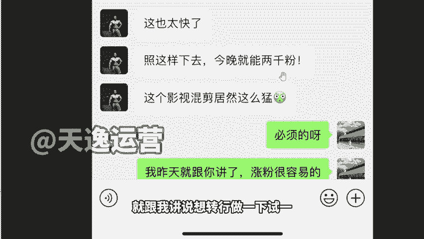

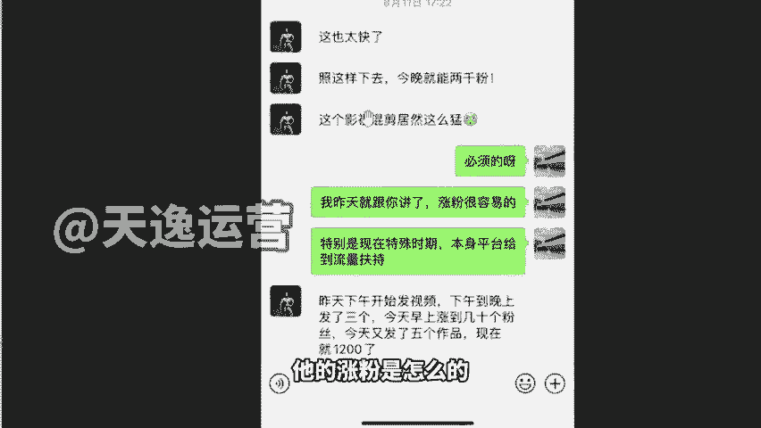

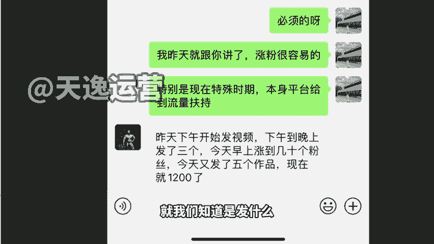

啊，哪个板块是缺的，他会给我们发微信的，他会跟我们讲说啊，你这边这个月或这个季度给我们提供几个什么什么品类的一个账号。OK他给我发了这个信息之后，我就跟我们自己底下学生讲，说你们去做这个类型是这样的啊。

我们会直接给大家去安排啊。然后这个就是属于一个商单的形式。来，我给你们看，就刚才这个人啊，就刚才这个同学他现在接单价格很高的啊。你们一定要你们可以向他看齐人家也是在过年的时候没少赚啊。

没在过年的时候没少赚7681个粉丝，笔记数量33个啊，然后单价来你们看一下1800。😊，你们不要觉得说他挣的多或者怎么样啊，人家都是AI做的，都是AI工具做的，没有说他能力有多强，全部是AI生成的。

然后另外还有一个就是你们之后做商单想多挣钱的一个玩法啊，一个小的这个建议给你们，就是我们刚才那个宝妈她在做的，你们会发现我给大家看的几个聊天记录，他的聊天记录的头像不一样啊，对她头像不一样。

人家好几个微信，他怎么操作呢？首先他自己的那个小红书号啊是有4个。😊，那么他今天拿这个微信跟这个商家聊完之后，签下了这个订单以后，拿到钱之后，他换一个微信再去加那个商家说你好，我这边有个千粉号。

你需不需要合作？😊，啊，拿AI反正生成又不一样的文章，对不对？又是一篇不一样的，又找这个商家再合作一遍，再收一次钱。😡，啊，直到没耗了为止。😡，就这个方式说实在的啊，你们也能干。因为本身我们确实有耗。

他就是能够挣钱的。有这个资源，有这个商家的一个资源之后，把它物尽其用啊，用到最大化。😡，用到最大化就可以了啊。然后这个的话就是我们之后可以去做的一个方式啊，所以说人家为什么能挣钱，对不对？

为为什么人家挣的多，一个月最起码两三万的一个收入号多啊，人家是直接是一个订单接到，一直接到接不接不了为止的啊。😊。

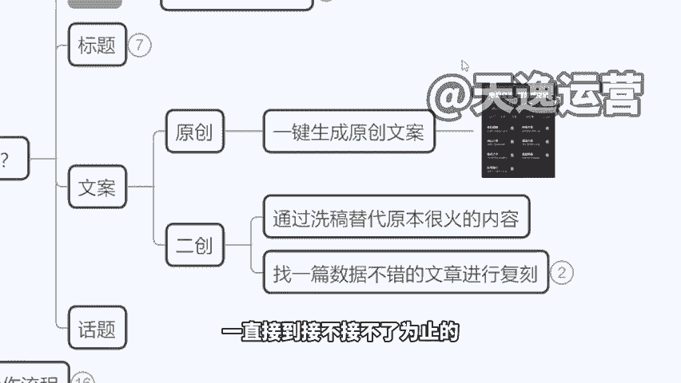