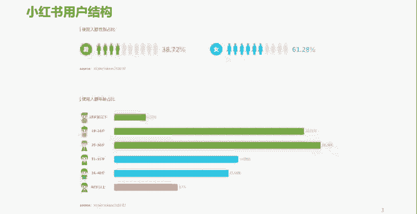

# 【600集精华教程】小红书运营新手起号 0-1新媒体运营必学课！不要荒废18-30岁，一切都还来得及 - P3：P2小红书的用户结构 - 轻松爆火了 - BV1gi421k7iz

接下来呢我们看一下小红书这样一个平台，它的整体的一个用户结构。

我们根据这个数据呢，可以看出来啊，在小红书整体的用户结构当中呢，是女多男少。那么这个呢也肯定。啊，大家也能看出来，也能感受到，平时呢喜欢逛这些购物平台，或者经常泡在这样一些购物APP上的呢。

多多是女性为主。😮，对吧那么并且女性呢。或者说年轻的女性呢，她是占据了我们整个消费市场，可以说是一个相对来讲是一个主导性的这样一个地位。所以呢现在呢我们也经常说一个词叫做他经济。

这个她呢是女字旁的那个她啊，她经济时代啊，所以说这个女性呢是小红书的主流用户。所以大家呢就要去考虑一下，将来如果做小红书的时候呢，就要去考虑一下我生产的这样一个小红书的内容。我做的这样一个内容。是否。

符合小红书小红书这样一个主流用户的一个喜欢的。是吧好，接下来看一下他们年龄结构。小红书的年龄结构呢是19岁到30岁，或者我们可以这样理解，20岁到30岁的用户为也核心，相对来讲呢是偏年轻一些。啊。

相对来讲呢偏年轻一些。而且呢是以女性为主。那么大家就知道了，如果你公司的目标客群正好匹配。啊，小红书的这样一个用户特征。那么小红书肯定也会成为你的公司的不二之选。啊，或者是一个重要的一个选择。

但是如果你公司啊这个产品针对的目标客群。跟小红书的主要用户大相径庭。啊，很不吻合。那你在这上面你就要去考虑一下是否。要去将小红书作为你的一个主要真理。所以我们了解这些数据呢。

最主要的目的呢就是能够让我们将来在做小红书运营的时候，不管是是否选择小红书。啊，是否将小红书作为一个主要的一个平台或者阵地？在小红书上面生产一些内容。应该符合什么样的人的一些阅读习惯。

或者一些内容的一些胃口。😮，啊，我们呢就有了一个大概的一个什么呢？图谱那有了一个大概的一个参照。那么这个呢就是小红书的一个用户结构。

