# 【600集精华教程】小红书运营新手起号 0-1新媒体运营必学课！不要荒废18-30岁，一切都还来得及 - P5：P4小红书的导流营销逻辑 - 轻松爆火了 - BV1gi421k7iz

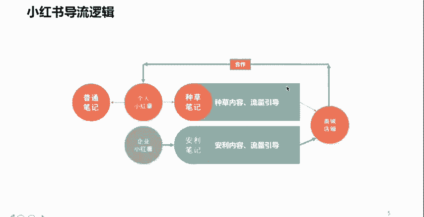

好，那么我们先简单的了解一下小红书的一个什么呢？导流的一个逻辑。

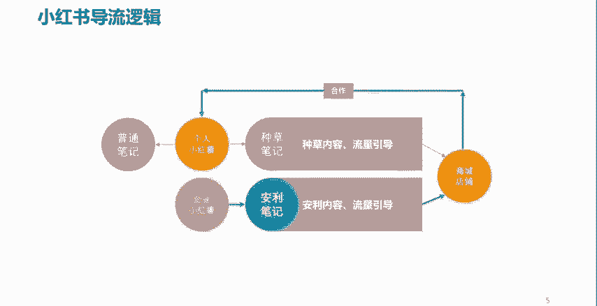

我们看一下。

我们在小红书上面呢，把一个个人呢，我们把它叫做小红薯是吧？当然呢，企业也可以叫小红薯啊。

我们作为一个个人的一个小红书用户，我们可以去分享一些内容。那么在小红书上面呢，这个内容呢，它叫做笔记啊叫做笔记。为什么叫笔记呢？

你想想。第一个小红书呢，希望自己的这样一些用户呢能够持续性的。

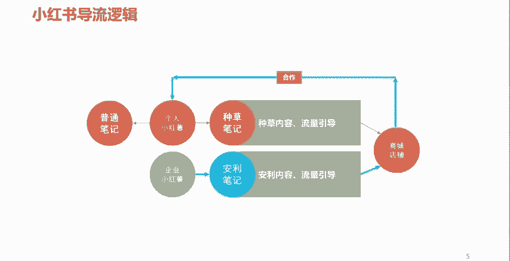

啊，去创作一些什么呢？商品或者是一些购物的一些体验一些分享。

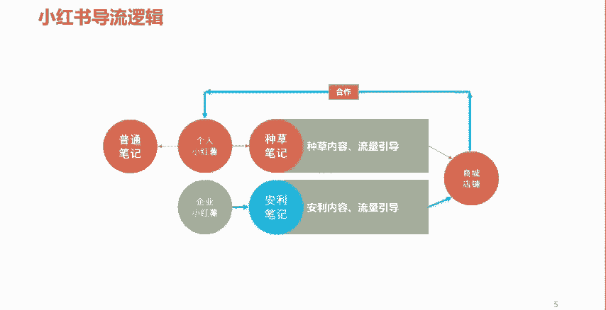

所以呢你每一次购买一些东西，或者看到一些好物啊，或者是体验到了一些好的商品，你是不是要记录啊，是不是要分享呀？所以呢这个呢他就把这个教程了一个笔记。

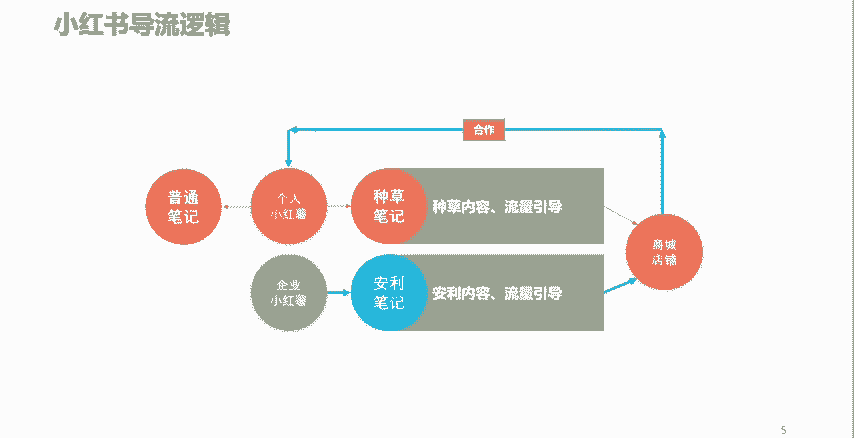

那么个人小红薯啊个人小红薯呢，它可以做。比如说我可以针对于某一个商家的产品。

针对于某一个单品，或者是针对于某一系列的产品，商品，我可以去进行一个什么呢？分享。

啊，比如说我买了一件上衣。

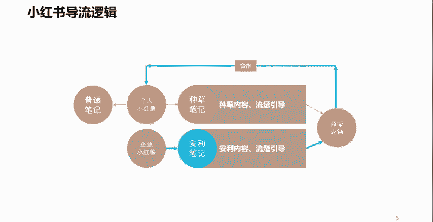

这件上衣穿上去之后呢，哎显白显瘦，材质也好，面料也舒服，款式呢颜色百搭，对吧？那么像这种衣服买回来之后呢，我觉得挺不错的。😡。

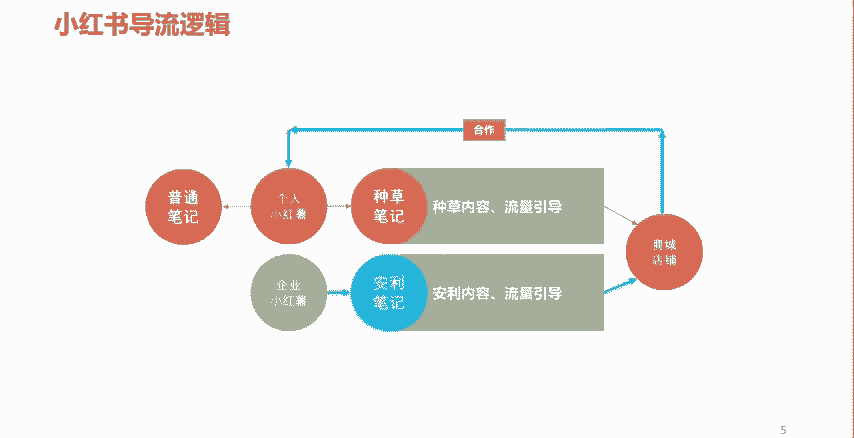

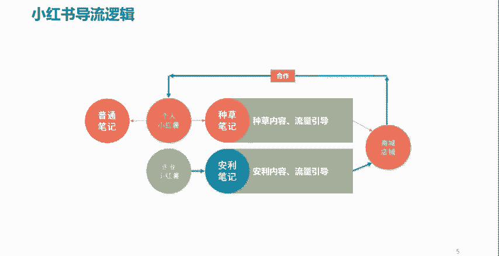

哎，我就可以通过小红书去进行一个分享。

啊，让更多的人看到这个笔记之后呢，可以呢去关注我买的这个商品。哎，这个商品真不错哈。哎，在哪买的呢？我也去看一下是吧？哎，就可以起到这样一个作用。那么这样呢流量就很容易来了。😊。

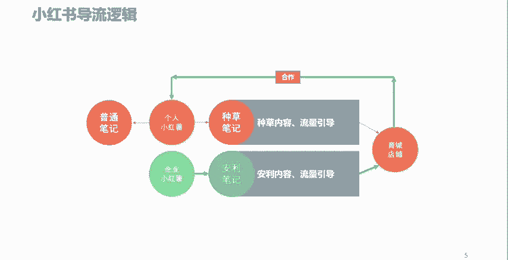

对吧他通过这个笔记呢，相当于就是在辐射。

哎，对这方面感兴趣的一个人。

然后呢，去到什么呢？看到商家的这样一个商品。

甚至说什么呢？去到商家的这个店铺或者商城里头。然后呢，进而产生销售。

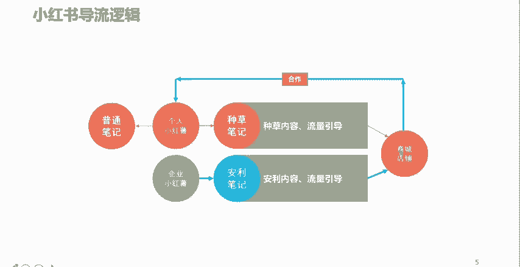

同样如果是一个个人小红薯做这种内容，做的非常的优秀啊，做的很好啊，也会呢被一些商家呢主动性的关注到啊，进而呢去做一些合作。😡。

啊，比如说我是一个做美妆的一个小红薯。

我做的内容呢被一些商家呢看到了。这些商家呢哎认为我的小红书这个美妆的笔记内容呢，写的还算是有质量。

再加上呢，这些。商家呢他本身呢他也是做这种什么呢？美妆客户类的。

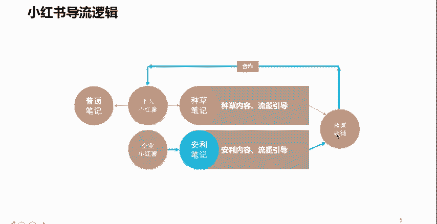

所以呢他可能就会跟我进行一个合作类的沟通。那么这样呢，也会。

产生一种什么呢？个人创作的一种变现。

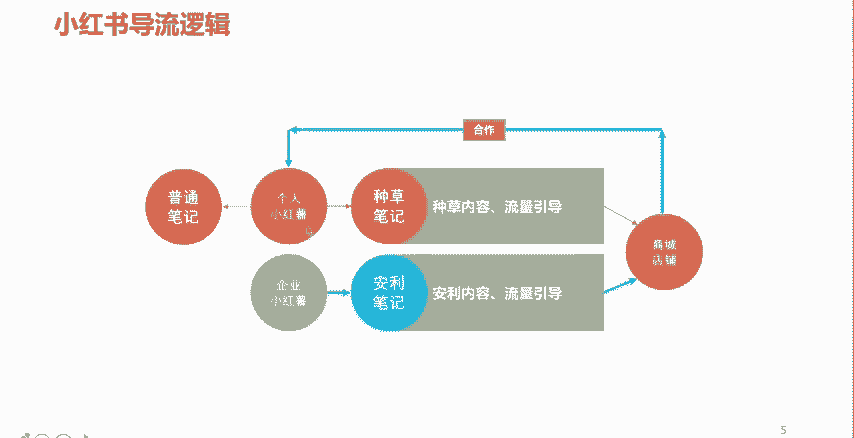

当然了，在小红书上面呢，还有另外一种身份，另外一种性质的一个账号啊，这也是常见的。第二种。第一种是个人，第二种就是企业类的小红书。

啊，企业类。

那么企业链类呢，一般情况下呢是针对于自己的一些商品呢，可以去进行一些推荐。

介绍啊，或者是我们用个网络词啊，就是案例给你。

啊，那么这样一些内容呢，就是什么呢？企业呢可以通过这样一个平台呢，向我们的用户啊，向企业的目标消费者去进行一个商品的一些什么呢？利好或者是什么呢？一些优点价值点的一些释放。

从而呢让自己的目标用户哎目标消费者呢哎能够看到这个内容，看到这个内容之后呢，会对自己的产品呢产生一定的什么呢？兴趣或者欲望。😮。

从而呢我们能够把这些目标用户、目标消费者呢导流到企业自己的店铺或者是商城当中。

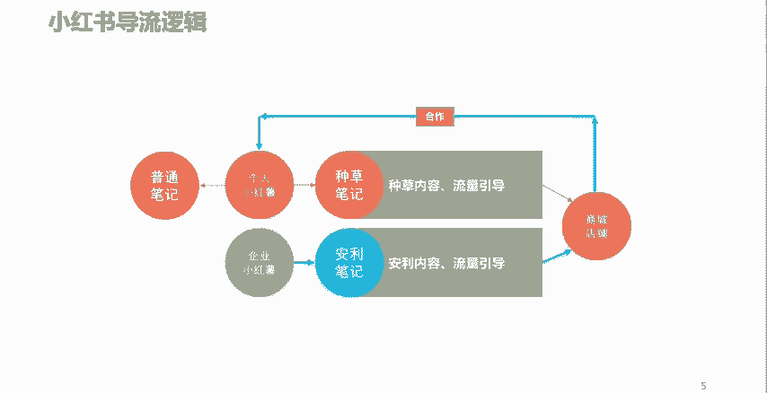

进而产生销售。

啊，当然我这儿呢还写了一种。😮。

有的个人小红书呢，他做这个内容，他不会带货，也不指望着什么合作。可能他就是纯粹的把小红书呢啊把把小红书呢当成了一个什么呢？当成了一个自己记录或者是分享的一个平台啊，每次呢去写一些普通的一些笔记啊。

去写一写分享一下，或者说有的人呢把小红书呢当成一个自媒体在做啊这种情况呢也是有的。我们也是经常能看到。😡。

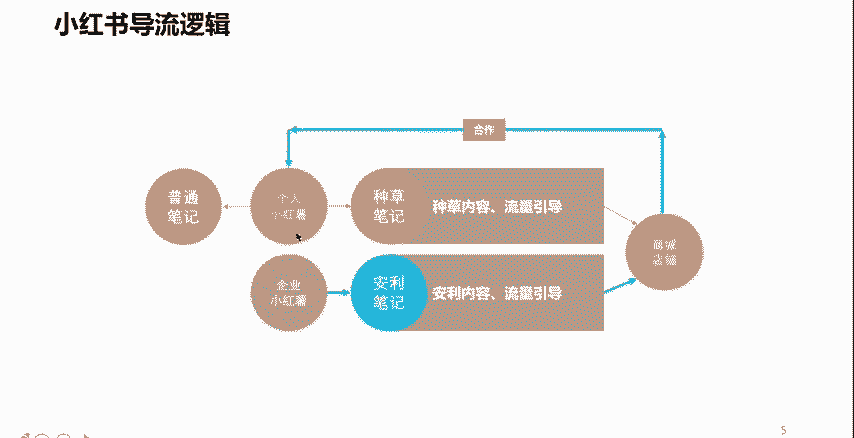

但是从专业的角度呢，我们应该发挥小红书本质的一个最根本的价值，就是通过不管是个人还是企业的账号，去通过内容创造流量。

将流量呢进行一个什么呢？合理的转化。

啊，也就是不管是个人还是企业，通过这个平台呢，可以实现变现营收。

那么这个呢就是小红书最根本的一个导流的一个逻辑。

啊。好，那么讲到现在呢，其实呢整体上呢先给大家讲了一下小红书啊，是一个什么样的一个情况，是一个什么样的一个平台。希望很多人呢要正视这个平台啊，也是一个非常不错的一个平台啊，也是在我们运营当中呢。

经常会用到。😊。

