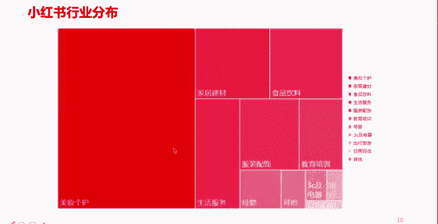
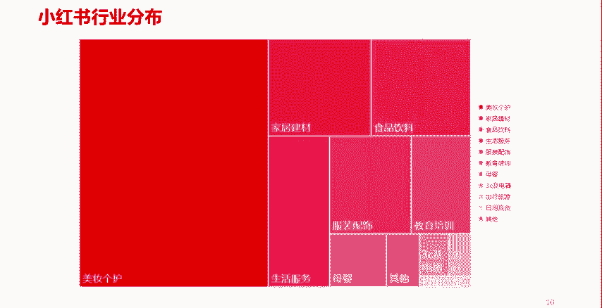

# 【600集精华教程】小红书运营新手起号 0-1新媒体运营必学课！不要荒废18-30岁，一切都还来得及 - P9：P7小红书平台的行业分布情况 - 轻松爆火了 - BV1gi421k7iz

那么再往下，我们看一下。小红书的。主要内容的一个分布啊，你比如说。占到了半壁江山的啊，占到了半壁江山的还是美妆客户。所以这也就不难看出为什么小红书的主要用户是年轻的女性了。是吧好。

第二个是家居建材类的是吧，包括食品饮料类的。然后还有什么呢？生活服务啊，服装配饰，这也是一个大类啊，这也是常见的啊，包括教育培训。😊，啊，像其他的呢也有一些啊这些。所以大家在做小红书的时候呢。

也可以基于啊基于这样一个内容的分布啊，内容的比重啊去考虑。嗯，去考虑一下。是否。涵盖了你所在企业的一个什么呢？业务类型或者是商品的一个类比。啊，所以说我们知道做小红书或者我们在任何一个平台上去做运营。

必须得考虑这个平台的主流的用户都喜欢什么样的内容。因为每个平台都有每个平台的特征。对于每个平台的用户的喜好。对吧嗯，这个你是不可更改的啊，不可更改的。所以说呢一定程度上呢。

我们要去借着这样一个东西去做我们自己企业的一些哎电商，或者做我们个人想做的一些有意思的或者是优质的内容啊，这是小红书行业整体的一个分布。

