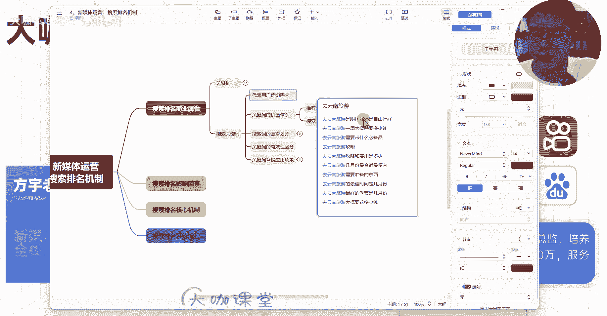
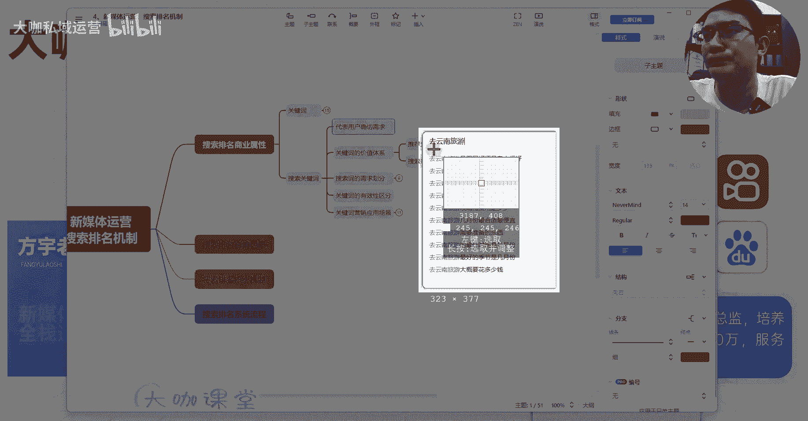
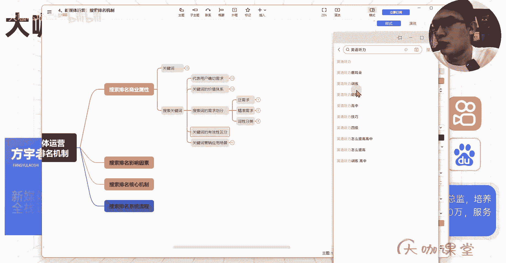
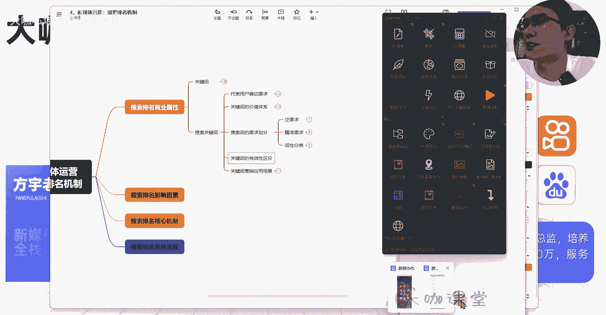
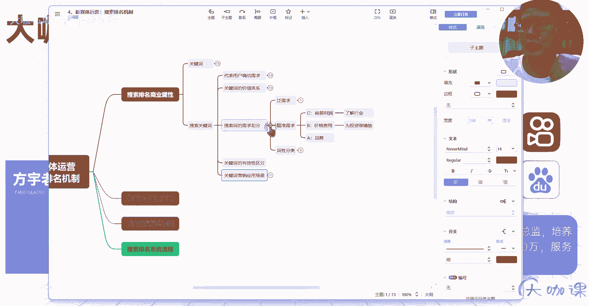

# 【7天搞定新媒体运营最全教学】全流程小红书运营技巧 起号／涨粉／引流／变现 打造爆款账号的绝佳课程！ - P13：12、新媒体运营第七课：搜索关键词划分及应用 - 大咖私域运营 - BV1fqeEeFE5u

Hello，大家好，我是方宇老师，欢迎大家来到我们这一堂课，那么这一堂课呢，我们继续来聊关于关键词这一块的一个知识点，那么上一堂呢我们来区分了，简单区分了一下这个核心词和长尾词，对不对，那么这一节课呢。

我们具体了解一下关键词这一块，它背后所代表的意义，以及它的价值属性，以及它的应用场景等等，好，那么我们先来了解第一个点，每一个关键词，我们在上一堂课，我们来做测试的时候，是不是了解到了每一个搜索词背后。

它都代表了用户的一个确切的需求，对不对，那么我们再来根据这个点来做一下拓展，那比如说我们打开这个搜索引擎，我们现在呢我们来搜索一下这个去，我们去搜索一下旅游吧，去，去云南旅游好。

那么我们把这个玩意儿给它拿出来嗯，我们重点来研究一下这个方面，去云南旅游是跟团好还是自由行好，那么用户搜索这个词的情况下啊，这个词我们拿这个关键词来举例，用户他想了解的需求是什么。

他想了解的需求就是我是去我要去云南旅游，我到底是跟团呢。

我还是选择自己一个人自由行呢，这个是不是用户的一个具体的搜索需求。

他想了解的这个点对吧，我们把它放到这里，每一个关键词背后都有它精准的搜索需求对吧，到底是要跟团还是自由行，那么这个就是用户的一个选择选择的策略，然后呢去云南旅游一周大概需要多少钱，这个用户他想了解什么。

他想了解去云南旅游的一个具体的预算，我要贷多少钱，我要花多少钱，然后呢花的钱少了呢，呃还可以考虑考虑，花多了呢，可能我就不考虑了，对不对，我或者说我去规划一个大致的预算。

那么这个时候你要针对去云南旅游的这个，这个用户，针对他现在要了解的预算，这个这个需求，你可以提供什么样的内容，你可以提供一个笔记，或者说一个视频去帮他讲一讲，我从某某地出发，然后到云南。

然后呢除去路费之外，然后在云南某些地方住宿啊，吃啊，然后打卡呀，景点啊，最后的来回的路程啊等等，这些费用到底大概是预算多少，我怎么去规划，那么这个是不是你可以做的内容。

那个这个结合我们之前讲到的内容定位，我们是不是可以在内容这一块把价值给用户，给他塑造，完全对吧，然后呢去云南旅游需要带什么必备品，那么这个东西怎么做内容呢，我们针对用户的这个搜索需求点。

我们去讲一下在云南旅游它的气候，它的季节，然后呢它的这个啊气温啊气温，然后呢嗯他的这个呃比如说证件对吧，然后呢我们可能护肤的情况下，我们紫外线比较强对吧，云南这个地方呢它紫外线比较强。

我们怎么样能够合理的去防紫外线，然后的话呢早晚温差我们怎么去解决，然后有时候在户外遇到什么样的一个突发情况，我们可能要必备哪些东西，那么针对他的这个需求点，我们是可以提供这些内容来去给大家解决。

然后整个旅游攻略，这个旅游攻略呢呃某笔记平台上面是大把的，我们怎么去塑造这一块的内容，找一个攻略，其实这个可以写的方向就很多了啊，旅游攻略费用对吧，关注的是具体的旅游攻略，还有它具体的一个旅行费用。

然后几月份最合适最便宜，对不对，这个用户呢他有两个需求点，首先第一个最合适的月份，我们就跟他讲，诶云南可能四季都适宜，但是呢取决于你是在南方还是在北方，你适应环境的一个能力怎么样，然后云南这一块呢。

哪些地方它的气温是稍微比较低的，然后哪些地方呢，它的阳光的紫外线又比较充足的，或者它的景点又是特别适合我们夏天去避暑的，等等等等，然后呢他哪些地方呢是呃景区开发的，还没有那么完全哎。

有很多自然生态这个地方建议你去对吧，然后某些地方呢又是呃这个这个这个外地游客，不太友好的，这个当地的商贩啊等等各种形式啊，啊这些一些不好的点呢，你来简单列举几个点，那么用户是不是对你的这个内容。

他感兴趣的程度就会提升，OK然后呢还有这个需要准备的东西，那么这个也是我们刚才讲到的一个点对吧，我们上次也讲到了呃，用户在关键词这一块，他的这个需求可能是差不多的，但是他的这个搜索词可能就不一样了。

你看啊，去云南旅游需要准备的东西和，去云南旅游需要带什么必备品，这两个词，他们的一个方向和需求点是不是大致一样的，对不对，但是呢用户他的搜索行为就不一样，只要他的搜索行为，它的搜索词有不同。

哪怕他需求是不一样的，你下面的展示结果，你的这个搜索排名的结果，它就有可能有区别啊，搜索结果的排名就会有区别，这个大家要理解一下，所以说为什么我们要去研究关键词，OK这个是代表用户确切需求的一个点。

你们一定要理解关键词它的价值，然后的话呢，第二点就是我们整个关键词的一个价值体系，的一个构成，那么我们知道我们在做新媒体内容的时候，不管是我们的B站还是我们的短视频平台，或者说我们图文笔记平台。

你的内容分发啊，就是推荐分发，就我们内容发布出去之后，平台给你把内容推给用户对吧，比如说你像我们打开这个平台，我们在这里看你刷到什么内容诶，感兴趣，比如说我对这个游戏感兴趣，我点击一下。

然后呢我对其他的内容，这个美女感兴趣，我们点击一下美女的这个视频，这个是基于什么，基于兴趣分发兴趣需求，那么兴趣需求这里边就是什么呀，他的这个绝大部分流量都是兴趣流量，情况下面会有很大一部分的泛流量。

也就是很多人可能对你的内容呢，他只是简单的感兴趣，但是他没有到兴趣那么急切的地步，他可能说呃你发这个东西呢，我想了解一下，我点进去看看好吧，我只是围观一下，我只是了解一下，但是到了搜索的这个场景之外。

我们所有的想要去做，我们做私域的，或者说我们去做这个企业产品推广，或者说品牌规划的，那么这一部分你就要注意了，所有的你做搜索场景下得来的流量，都代表着这个用户呢，他是有具体的一个需求。

你把这部分的流量拿来之后，你的才会有更多的什么呀，私域成交，对不对，你才有更多的这个更精准的私域成交，所以我们以前会做个什么事呢，我们做搜索，我们会把这个搜索场景下的这个所有的关键词，我们全部罗列出来。

就像我刚才讲的，可能有一两千个词，我们针对每一个词去做内容，那么这一个平台上可能有数千条内容，是我们提供的，那么在这种场景下，我们排除几率的问题，排除大部分内容不过审的问题，那么剩下的存活下来的问题。

哪怕有个几百条啊，或者说千把条的这种情况下，那么你在这种情况下，你是不是能够在这个行行业里边，覆盖的这个流量范围特别广泛啊，特别广泛，那么这里我们要谈到一个非常关键的点了，就是核心关键词和长尾关键词。

它的一个流量构成，这个一定要了解流量组成，核心关键词，它永远是占据我们某一个行业里边，20%的流量，你们不要以为行核心关键词它的流量很大对吧，核心关键词它的流量很大。

但是这个大针对于行业来讲它就不一样了，你比如说我们在前面讲关键词，讲到这个英语口语，对不对，这个英语口语里边，具体有多少用户是对你的产品，或者对你的业务感兴趣的呢，可能只有那么一小部分，这一小部分人。

我们还在没有通过这种确切的词汇，去对它进行区分的时候，我们还不知道里面到底有多少，对不对，但是如果说我们针对什么呀，我们针对长尾词去做铺设的时候啊，我们针对长尾关键词。

我们针对长尾关键词去做内容铺设的时候，他的流量就能占据到行业里边的80%，那么就像我刚才说的，我呢罗列出数千条这个长尾词对吧，那么这些长尾词呢，每一个词下面可能说每一个词都只有那么几个。

十来个或者几十个的搜索量，然后呢核心词对吧，核心词每一个词的搜索量呢可能都呃，呃一个核心词呢可能都有几千的这样的一个呃，它的一个搜索量对吧，几千个用户在搜索这个核心词，那么长尾词情况下。

每一个长尾词它代表了这么多少，代表了这个十几个搜索流量，我就按少的来算十几个，那么如果说我能在这个长尾词的覆盖的量的，情况下，我达到数千条的情况下，你的流量是多少，你的流量是远远超过核心词。

而且长尾词的流量还是越来越精准的，它还是精准流量的，你比如说像这种长尾词，我们达到一定层级之后，一定的量级之后，你每一个词来的用户，他是不是都可能跟你的这个业务比较相关。

我们能够抓住用户的一个精准需求啊，是不是，那么这个呢就是我们流量的一个组成，或者说我们整个流量的一个价值体系了，然后呢，还有一点就是关于关于我们的这个什么呢，我们关键词的需求和划分啊。

需求划分什么意思呢，关键词他一定是有泛需求和精准需求的，泛需求是什么呢，泛需求我们来举个例子哈，嗯泛需求我们来举个例子，比如说，呃我们就以英语口语来讲吧，比如说想要了解英语口语的人。

他在这一块搜索这个英语口语的这个人呢，他可能想了解的这个需求呢是多种多样的，五花八门的，那么你即使说你的内容在英语口语下面，得到了一定的量级，那么如果说你的内容是做的，关于英语口语的一个提升方法。

那么另外一个人现在搜索英语口语的这个人，他可能只是想看一下英语口语的这个对话视频，那么这种时候你的需求跟他匹配吗，你的需求跟他自然是不匹配的，他只是想去看一下视频，看一下这种搞笑的啊。

或者说从里边看一下这个别人对话的一个场景，那么这我只是举个例子啊，那这种情况下你的内容不匹配了，你排在下面他会点击吗，它不会点击，所以说在这种情况下，泛需求的关键词啊。

它在这个地方不太能为我们展示什么呢，不太能为我们展示用户，它是否能够跟我们的内容匹配，那么我们再举个简单的例子，我们还是一样，我们来搜索英语口语嗯，好那么我们看一下啊，这下面有一个叫做英语口语。

连读和英语口语跟读，那么这个东西嗯，这不太好展示啊，这不太好，这个不太好演示，那么我们我们以英语来展来来看吧，那么英语听力磨耳朵，然后英语动画片，然后呢英语音标，英语听力对吧，英语听力，英语的语法。

英语的音标，那么这种词汇，它是不是就代表了他的一个泛需求对吧，这种词汇你很难，你是否能单独从一个英语语法上面去考虑用户，他现在想要了解什么呢，是不能的，然后音标啊，音标是可以的，然后英语听力呢。

英语听力这个有没有办法没有办法，对不对，英语听力练习，英语听力提升，我们把听力打进来嘛，我们就可以知道用户的搜索方式啊，英语听力训练英语听力的一个睡眠，还有他的一个技巧，还有四级怎么提高对吧，是不是啊。

大部分可能是跟这个比较提，怎么提高是有相关的，但是助眠这玩意呢对不对，然后我们再在这个地方去搜索一下，我们换一个平台，英语听力，这个上面还显示测试对吧，然后呢短文还有训练app。

还有哪个好英语听力翻译器，在线翻译什么的，这些这能代表他们的一个具体需求吗，没有办法，这个就叫做什么，这个就叫做泛需求，那么什么叫做精准需求呢，我们比如说我们现在拿一个加盟行业吧。

我们就拿这个加盟行业来举例，那么如果说我们现在用户在搜索一个关键词，他搜索诶，我加盟某某某某店，他利润怎么样，我加盟加盟某某店，他的一个前景怎么样，你们觉得这一类用户他们现在的需求是什么。

您觉得他现在的需求是什么，他们现在的需求在了解行业，对不对，这个呢是初步需求，我们把它我们以前呢会把这一类的呃，关键词给它区分为C类级别的词，C类级别的词呢，就是用户的需求还不是特别明确。

他还不是特别要想了解你这个项目，他可能不仅在了解加盟你这个项目，他可能在了解另外一个创业项目，他还在可能了解了解呃其他的一些项目对吧，加盟你这个小吃店对吧，还加盟这个什么洗衣店或者加盟什么其他的。

他在了解行业，那这个时候呢你把用户直接拉过来，你还要经过对他呃，你还要告诉他哎我这个行业真的好，然后呢告诉他之后，他让他想想选择这个行业之后，你还得让他来选择你的品牌，你还得告诉他。

我相对于我这个品牌有什么优势，我在这个行业干了多少年，我有哪些哪些呃扶持等等，那么这是有一个多重转化漏斗的，对不对，这个是了解行业，那么如果说某些词用户呢，他现在了解到的是呃加盟某某店。

比如说我加盟一个小吃店大概要花多少钱，然后呢他的一个费用预算大概是多少，需要哪些东西，需要哪些资质，那么这个时候他是什么层级啊，他就已经对这个行业产生了认可，他就想来加盟这个行业。

但是呢这个时候他又在徘徊，他在比价对吧，他在对比，他在评估衡量，对不对，这个时候呢，就是他已经在做为为为投资做打算了，我为投资做铺垫是吧，他已经认可了这个行业，那么这个时候。

我们如果说我们能够去着重做这一类的关键词，你想一想所有的用户搜索价格啊，搜索费用啊，搜索加盟啊这一类的内容之后，在下面的排序结果里边你比较靠前，那么这个时候你得到的这些用户，你的转化可能性。

你的转化漏斗是不是越来，是不是可能性就更高了，对不对，我们这个就是它的一个精准需求，那么如果说现在有用户，他去搜索加盟某某某某某某品牌加盟怎么样，靠不靠谱，他好不好，他这个呃呃扶持怎么样。

那这个时候具体去了解品牌的，那么这个时候是不是，这个用户已经到了成交的边缘，那么你做这一类用户的一个词条的时候，你是不是应该把自己的品牌，所有的内容去给用户展示出来，你要告诉他搜索这类品牌。

它本身就对你有一定的了解了，他已经知道你这个品牌了，他现在想跟你这个品牌合作，那么你这个时候是不是要去充分的体现，你告诉他我们真的很好，我们真的很优秀，你要找我合作，是不是这个就是一个最高等级的。

这个这个这个这个我们叫呃，他的一个用户的需求，我们把它放在A类，对不对，A类品牌价格费用价格费用，然后前景利润，这就是用户的一个需求的分级，也就是我们讲的搜索关键词的一个需求划分了。

然后呢我们其实还可以通过什么啊，通过词性分类，我们以前呢会把关键词也通过多种分类方式啊，那么这个精准根据需求分类以及根据词性分类，它只是关键词的一个划分方式，不代表说完全就得按照这个来。

我只是现在跟你们讲这些点，我们以前呢会分为通用词，疑问词和竞品词对吧，通用词里边呢它会有很多，就是比如说英语口语，你像我们在这里哈，我们来简单啊，我们叫语英语听力吧，英语听力训练啊。

英语听力训练这个属于什么，属于通用词对吧，英语听力技巧，英语听力技巧，这个属于通用词，那么疑问词呢，我们来看一下英语听力怎么提高，这个是不是疑问词，对吧，英语听力怎么提高。

或者说呃加盟某某项目需要多少钱，加盟某某项目，它的前景怎么样，它的利润怎么样，然后呢这些是不是属于疑问词，然后竞品词是什么意思呢，竞品词就是我们以前做广告投放的时候呢。

我们就你还还记得我们刚才说的这个品牌词吗，品牌词一定是成交比例最大的，对不对，那么我们以前做搜索引擎呢，我们会去做一件事，就是你比如说我们有客户，我们有同行诶，它的品牌效应比我们高。

那么那个时候呢我们的搜索引擎是可以办到，就是用户在搜索别人的品牌名的时候，诶它在下面出现我们的广告，这个能理解吧，这个就是我们以前做竞品词的一个方式，当然现在呢有一些也还是可以做。

也就是说用户他对别人的品牌，认可度比较高的情况下，那么这种时候相当于他已经对这个行业认可的，我就从竞品那边的一个品牌词，来把这部分用户强行转化到我这边，来让他来了解我，让他来误以为我是某某某。

然后让他来点击这个广告，然后最后我们的这个销售再去进行跟进，这个呢就是竞品词啊，我们以前这个竞品词呢，也是买词的一个比较大的一个量，因为什么词能决定用户是否能够直接成交。

那么这些词就能够是去加大投入的地方，OK好这个是词性的一个技术分类，然后呢关于关键词的一个有效性区分哈，有效区分这个是呃，我们在分析词性的时候要用到的，比如说我们现在是做这个英语听力提升的。

这么一个班级对吧，我们在做这个事儿。

我们来做这个课程，那么接下来呢我们在找这个词的时候，我们来分析一下。

我们来看一下这里边的词啊，这里边的词你像英语听力，磨耳朵这个词儿算不算是有效，这个词儿是无效词，训练是不是有效词，诶，它是的，然后助眠算不算助眠不算啊，助眠是不算有效词的。

你用户他搜索的这个词跟我们不相关，跟我们的业务可能没有多大需求，那么这一类词我们就要放弃，我们做这一类词的内容有什么意义，暂时没有意义，我们做搜索词，我们做精准搜索词一定是为了什么。

一定是为了获取精准流量的啊，我们在规划这个搜索词的时候，这搜索词一定是跟我们的业务强相关对吧，你如果是去做什么呢，做兴趣分发，你去做这个账号的一个养成，那么这个时候呢你做这些内容呢。

泛流量的内容是可以的，但是方向性不同对吧，关键词一定是有针对性的，然后技巧四级怎么提高，然后呢，训练这些都是跟我们这个行业里面比较有效的，那我们再看一下，比如说英语英语口语，嗯我们搜索英语口语。

他的练习零基础跟练发音课程跟连读，然后跟读，这些其实都是跟我们的业务有相关性的啊，有相关性的，那么有些时候呢我们会出现一种某种情况下，这个词儿跟我们不相关，是什么呢，就是呃有这个同行的搜索词。

那么我们有一些词呢，呃就是你在这个地方呢，这个地方其实叫做下拉词嘛，这个叫做下拉词，那么有一些下拉词的展现，他可能是因为同行的大量搜索，比如说我们某个同行，他们做英语的这个训练的提升的啊。

当然我们不是做这块的啊，假设对吧，你现在做这个英语的这个学习提升，那么你的同行呢他的体量非常大，他的运营的员工呢可能达到几百人，千把人，那么这些人他们天天去在某个地方去搜索，那么他的一个搜索体系呃。

比如说他想要今天要发内容，那么很多人来搜索英语口语的呃，这个这个这个训练视频，英语口语的训练素材，那么这个时候他可能就在去找这些素材内容，拿过来，自己去做制作内容，然后来做分发。

那么这些东西是原本用户不去搜索的，他不会去这么去搜索，那么这个词呢我们也叫它叫做无效词对吧，无效词，那有效词和无效词你们要去做一下区分，那如果说你在一个无效词下面，花了很大的一个精力，你要去做内容。

结果发现这个词下面根本没有多少真实用户，那么你努力的方向就出了问题，OK然后呢关键词的一个营销应用场景呢，也给大家讲一下，基本上分为这么四种，首先呢第一个就是为了精准获客。

那么我们前面我们所有做精准词的一个目的，我们来做这个搜索词，和我们正常的去做内容分发，比如说你现在，你如果说你要给公司去做这个营销业务，你去做图文笔记，去做种草，你搜索了这么一批关键词。

那么你的目的是什么，你的目的要么就是为了去精准获客对吧，要么就是种草和品牌营销嘛，所以说你做精准获客这一块，你的这个呃呃你就需要去用到这个关键词对吧，我们需要通过大量的长尾词去铺设大量的内容。

然后第二个呢就是广告投流了，广告投流的话呢，这个不管是我们的B站还是其他的短视频平台，或者说图文笔记平台也好，他们的这个头瘤里边都是会根据什么啊，根据人群的属性，人群的设备年龄性别。

以及我们还可以通过关键词来确定，哪些用户在搜索这些词的时候，他可以看到我们的广告，那我们刚才搜索这个英语口语的时候，是不是看到下面有一个这个，这个这个起飞推广的广告。

啊啊这里有一个这个这个起飞的一个图标嘛，那么这个就是呃，别人在这个搜索词下面投放的一个广告，那么我如果是想了解英语口语的，我这么一个用户，那么我就可能在这个搜索词下面，刷到他的所有的广告投流。

在这个关键词这一块，都是能够得到一个非常精准的客户的，因为关键词就代表了，我们可以通过关键词来筛选，我们要做哪些关键词，通过我们刚才精准需求里边，比如说我们做品牌的，我们做价格费用的这两类关键词。

我们重点去投流，我们让排名更加靠前，那么这个时候我们是不是能够通过投流，去快速获得大量的这种用户，有了这种用户，假如说我们的产品或者服务都还不错的情况下，你是不是就能够获得大量的成交。

你比如说我今天来组织这个项目，我有钱来投流的话，我是不是能够我今天开启大基建账户，我明天我就有客户进来了，但是你做自然流就不一样，你做自然流，你需要花费一定的时间去铺设内容啊，去运营账号啊，提升权重啊。

提升流量层级啊，通过这些运营技巧来把账号的流量做起来，但是广告就不一样，广告就是你花钱你就有客户，然后呢产品种草和品牌营销这两种也是一样，这两种呢也是需要去做关键词的，那么你做产品种草。

那么你的关键词就是什么，就是你的产品对吧，比如说我们在某笔记平台，我们某一个平，你某一个产品，我们需要去快速做这个大量的曝光，那么我们就需要让这些素人号去分发的时候，在他的tag标签里，在他的标题里。

在他的文案里去讲我们这个产品怎么样啊，然后带上我们的这个产品名称，那么我们做品牌营销也是一样，品牌营销呢，有可能是我们自己呢去做矩阵的分发，也可能是我们去找素人来帮我们去分发，这两种方式都可以。

一般呢我们做品牌营销的话，还是尽量自己去做这个呃，内容也可以啊，当然如果说你预算比较充足的情况下，你找素人，找达人分发都是OK的啊，都是OK的，那么这种情况下你的内容只要发出去了，比如说你叫某某品牌。

然后你去别人去搜索的时候，诶发现这个平台上找不到你的任何信息，那么他怎么能认为你靠不靠谱呢，那如果说你这个时候你在上面有大量的这个，你分发了很多关于你们品牌的介绍啊，你们品牌的这些内容啊。

然后这些案例啊，物料啊等等，那这个用户他是不是能够通过这个方式来，先提前了解到你，然后对你产生一定的信任感是吧，你像我们什么可口可乐啊，还有什么其他的这个一些大品牌啊，他们都是有一定的营销在内部的对吧。

你没有品牌营销，你就做不到你的这个品牌人尽皆知，OK那么这是关键词营销的一个应用场景。

那么这节课呢我们就先讲到这里。