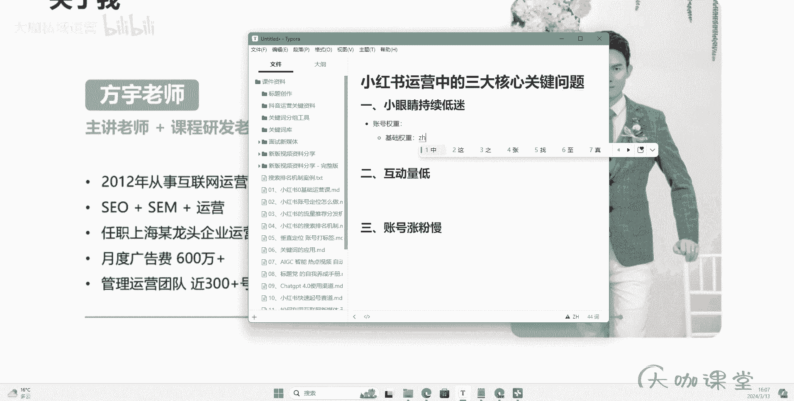
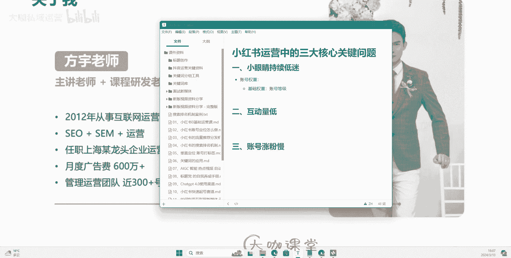
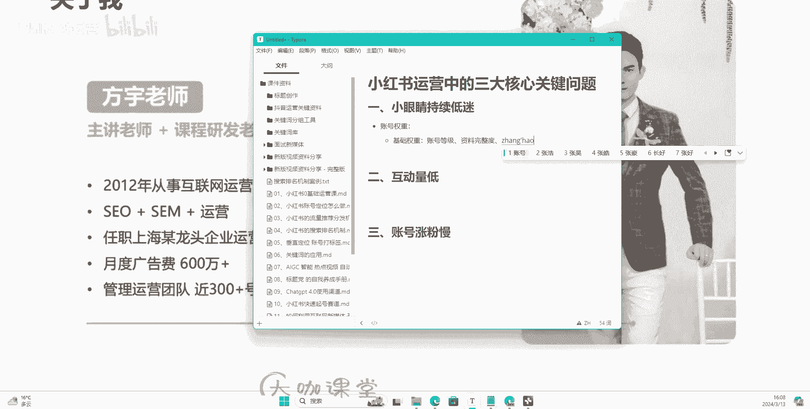
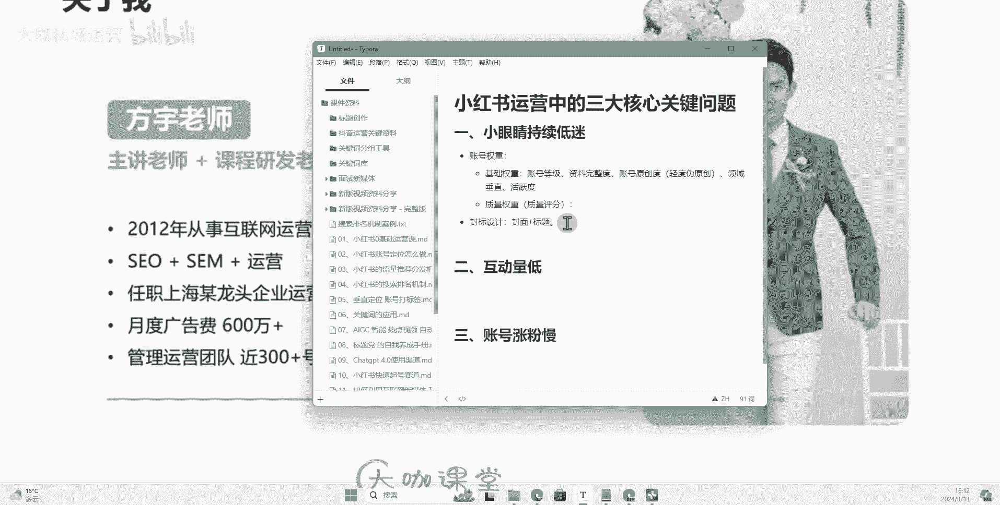

# 【7天搞定新媒体运营最全教学】全流程小红书运营技巧 起号／涨粉／引流／变现 打造爆款账号的绝佳课程！ - P25：23、图文笔记：三大核心运营问题：小眼睛持续走低 - 大咖私域运营 - BV1fqeEeFE5u

Hello，大家好，那么这节课呢，我们来针对我们所有人做小红书运营。

可能遇到或者说大家最关心的三个问题。

来给大家做一下解答，那么分别是哪三个问题呢，一个是我们的呃笔记的小眼睛持续低迷。

也就是说我们的阅读量很低很低。

而且呢持续很长一段时间，然后呢第二个呢就是我们的笔记发出去了啊。

有小眼睛可能说五百一千，但是它的互动量很低。

我们的点赞收藏数据没有几个的这种情况，然后第三个呢就是我们的账号涨粉非常慢啊。

那么我们来看一下分别都是什么问题导致的，首先第一个呢小眼睛持续低迷。

那么小眼睛其实代表着什么呀。

它代表的就是我们的一个流量分发，以及我们具体的一个笔记的一个点击率，那么影响我们小眼睛有哪几个点，我们一个一个来拆分。

首先第一个呢是我们非常重要的一个，叫做账号权重。

那么账号权重这个东西呢，嗯还是一样啊，老生常谈的一个问题，可能说平台不认可，但是我告诉你们这个玩意儿，它就是有可能说在平台那边呢，它不叫权重，它可能叫评分。

那么我们一般来告诉大家，就是账号权重这一块我们分两块啊，一个是我们的基础权重。

基础权重有哪些呢，我们所谓的基础权重啊。

就是我们每一个人去入驻小红书的时候，你在小红书上去创作内容，你作为一个创作者。

每一个人都能得到的一个基础权重分，那么这个权重分的话可能是一个固定值。

如果说你把这些方面的东西呢都做好，那么大家都在同一个起跑线。

那么如果有一些层面你没有做好，那你这一块的权重分可能只是那么零点几分，但是你就是你会少那么零点几分，你的起跑线就会比别人退那么零点几。

那么基础权重一般我们包含啥呢，嗯首先我们来看第一个。

像我们的这个账号的等级对吧，我们账号的等级这个大家应该都知道哈。

掌握书上面分别呃，有我们的这个新手的这个尿布，主奶瓶鼠。

困困鼠，泡泡鼠，甜筒鼠对吧，还有小麻薯，文化鼠等等等等，这些是我们属于一个账号等级，这个呢是我们持续运作，持续去提升的一个方面，这个是我们的一个账号等级。

那么账号等级呢肯定是越高，那么越好对吧，你正常情况下。

你的笔记呢没有什么违规行为，然后呢你也是按照平台的这个正常的。

有活动可以去参与的去参与，你的账号呢整个呃表现都比较优秀。

比较正常的，那么这个分呢大家是非常容易得的，那么其次还有什么呢，就是我们的一个资料完整度。

资料完整度这个东西呢，就是呃像我们的这个名称。

还有我们的这个头像以及我们的简介，另外呢就是我们像编辑资料这一块。

我们主页有一个编辑资料，我们进去填写的像职业地区。

学校以及我们背景图对吧，我们的一个呃穿搭这一块需要填写的这些资料。

我们都把它填写了，我们保证这些能够提供给我们去完善。

个人信息的层面呢，我们就把它完善一下，花费不了我们多大的精力，这个呢也属于我们基础权重分的一种。

然后呢其次就是我们笔记的一个啊。

我们账号的一个啊原创度。

账号的原创度这个东西怎么理解呢，并不是说一定要求大家非得自己去写啊。

自己去写这个文案，自己去写这个原创的文案，用自己的感觉来写，而是说我们这个账号提供的内容。

不是说原封不动的搬运别人的素材，搬运别人的内容，我们去做参照。

做参考，最后整合自己的这样的一个东西是可以的，我们叫它什么呀，我们叫这种方法叫做轻度委员胖。

啊这个东西事情是一定要他去去做的，因为我们起号前期，我们的流量其实包括我们的笔记。

前期哈，我们是呃，是基本上可以理解为是做给平台去看的。

那么平台呢通过你这部分的一个笔记呢，去观测你的一个笔记的数据啊。

观测你笔记的一个原创的程度啊，跟站内的一些素材的一个重合度啊等等。

这个是我们的笔记原创度，你绝对不能说因为这一块啊。

因为素材啊对吧，因为你的内容啊就产生了一定的违规，这个是我们完全可以去避免的。

那么其次呢就是我们的领域垂直，这个呢分也是我们能够拿到的，做领域垂直就是你做哪个方向的话题。

你做哪个方向的产品，你就一直做这一块的内容好了。

我们就不要中间去切换其他的东西，那么这个也是我们一直在跟大家强调的。

它非常简单，但是呢很多人他就是愿意在这个方面去犯错，这个我也不知道为什么哈。

这个是关于领域垂直，然后呢其次还有什么啊，我们正常的对吧，活跃度对吧，我们保持一个更新频率，其次的话就是我们账号呢去参与一些什么呀。

我们去参与一些呃热点啊，啊平台发布的这些活动啊，包括我们的这个呃创作灵感啊。

这些提供的一些活动，我们能参与的去参与一下啊，然后呢，其次就是我们正常的一个评论的一个回复。

如果说有用户去回复你，或者说私信或者是评论你的回复。

这些正常的能去做的，咱们就去做这个呢我们叫做基础权重对吧。

那么呢还有一个就是我们的一个什么呀，质量权重这个东西呢。

质量权重啊，这个就是我们需要去通过我们的运营去获得的。

一个东西，我们也可以通通过它来叫做我们什么呀，就是我们的账号的一个质量评分。

这个质量评分呢其实我们可以解给它，理解为，就是我们账号日常的一个运营数据的一个表现。

也就是说你的账号，只要你在质量这一块把控的过关，那么你的这个所有的东西呢。

你的运营的这个封面标题，还有你的这个账号的整体的一个调性。

你的这个分享的精神你都做的还可以的话，你的质量评分是会不断往上提的。

那么通过这一部分的一个账号权重呢，它平台呢就能决定给你推什么样的一个。

流量层级，OK那么这个呢是我们的一个账号权重哈。

还有一个是什么呢，还有一个影响我们小眼睛持续低迷的。

一个关键的问题就是我们的一个封标的设计。

封标设计指的是什么呀，指的就是我们的封面和标题。

我一直跟大家强调，小红书上面，它的展现形式和我们抖音是不一样的。

它除了在视频点击进入视频之后，能够持续上下滑，他的其他的笔记。

在首页这一块，都是通过用户已经在一个预览界面，他去观看这些推给他的这些笔记的封面。

能否吸引到他，他会来决定这个点击。

那么呃标题呢可以说是作为一个补充，但是最核心的就是我们的一个封面。

那么封标呢是决定我们整个笔记点击率的，一个非常关键的因素，那么点击率就是我们通常所说的这个小眼睛。

对吧，那么如果说你的封面和标题你设计的不好。

那么哪怕你提供的这个内容价值点再高。

那么你也依然没有点击数据，那用户都不点击你的笔记，你哪来的其他的数据来告诉平台。

你这个笔记的质量好呢，所以说没你在封面和标题这块的设计有问题。

平台呢就会判定你的内容质量，不符合用户的需求。

那么你也没办法短时间内突破，你当下的这个流量层级，所以说我们一直强调大家。

你的封面和标题，可以作为你整个小红书运营当中的一个，重中之重的一个关键点。

OK那么这是我们第二个因素还有什么呀，还有就是我们的一个经常讲的叫做内容需求。

可能说我们在封面和标题这一块。

设计的还很不错对吧，但是呢你切换的这个内容。

你选择的这个选题点，你今天做的这个笔记，它有可能不是当下用户。

你的用户他们最关心的需求点，对不对，我举个例子。

比如说我们之前讲到过这个化妆这个赛道对吧，你可能说诶你对。

你今天做一篇这个，快速出门化妆的这样的一个内容。

但是呢这一段时间内，大部分的用户他们关注的一个需求点。

可能就在于诶这个呃化妆怎么样，能够呃这个这个新手化妆教程嘛。

可能说大部分用户他们最近期就是关注的是个，新手化妆的攻略对吧，你的用户他们关注的是这一个点。

但是呢你提供的就是一个快速出门化妆的内容，那个你的选题的方向。

就跟用户的一个需求点错开了，那么哪怕你封面设计的再好。

或者说你呃用户点击了你的笔记，但是你的内容不是他要的。

那么你是不是一样也没有数据对吧，那么可能化妆这个呢还比较笼统。

我们再举个例子对吧，我们家居这一块啊，用户呢最近你的大部分用户。

他们可能比较关注诶这个沙发怎么选，但是呢你发的都是诶窗帘怎么选对吧。

大部分的内容呢你你的用户他关注的是这个点，你做的却是另外一个点。

你们俩的需求错开了你平台呢，它给其实给给大家做了这个提示。

就我们选题这块也讲到了，我们做选题的话，要根据用户的一个需求来，它的一个需求是会变化的。

也有这个呃前后的一个就是怎么说呢，需求点的一个排序，比如说我们拿到100个用户的需求关键词。

这100个需求关键词里边，肯定是有一些需求是用户排在前面的。

最主要的需求点，所以说我们做内容这一块。

我们就要想办法满足当下用户最关心的点。

哪怕说我围绕着这个点持续去创作，这都没问题。

但是就怕我们在选题这一块，你选择了当下用户不关心的点。

那么呃我再举个例子是吧，我们做这个呃穿搭的对吧，或者说我们做服装的。

你呢在冬季，你拼命的去给别人推这个夏季的衣服对吧，你呃夏季穿什么短袖啊。

穿什么搭配呀，可能说有这么一部分群体关心，但是很多用户他更关心的就是我冬天对吧。

穿什么保暖衣比较保暖，质量比较好啊。

我穿什么样的一个羽绒服，它的这个性价比又高，看起来又时尚又暖和是吧。

这是当下用户最急切的一个需求点，我们要挑的是这个东西，对不对，这是内容需求。

那么其次啊还有一种情况哎，也比较少见的一种情况就是什么呢。

就是我们的账号本身异常，就是说很多同学可能会遇到一种情况。

就是我的这个账号我运营的确实呢还可以对吧，然后呢我的这个账号整体也没有出现违规对吧。

我所有的这些东西呢都还是呃能得到一些呃。

我至少是从我的程度来讲，我设计的这个呃结构或者说我内容需求。

我的标题封面都还挺好的，为什么我的流量就是几十很不正常。

我持续发持续发就是几十一百，这样子就突破不了啊。

那么这里我给大家举几个例子，一种情况有可能是因为你的一个IP环境异常。

IP环境异常，什么意思呢，就是我们很多企业，或者说我们自己在做这个账号的时候。

可能会做到这个矩阵号对吧，你举证号的运营，有有些同学呢他用的是同一个IP。

也就是说所有的小红书，他哪怕登录在不同的设备，他连的都是同一个WIFI。

那么同一个网络情况下，如果说有其他的账号，因为一些特别严重违规行为导致账号被封禁。

那么有可能啊。

有可能会导致平台封禁你的IP对吧，封禁你的IP。

如果封禁IP，也就是说当前IP网络下嗯，你的这个局域网下，其他的账号有可能也会受到一定的影响。

尤其是我们新起的账号是吧，你在这个地方。

在这个IP网络下面，你去新搭建的账号，你会发现你怎么去做，你的流量就是起不来，就是几十甚至三十五十这种非常夸张。

那么这个呢，可能就跟你的IP环境有一定的关系。

所以我们一直讲我们做小红书的矩阵，一定要做什么呀，做IP隔离好吧。

那么这是一个IP环境异常，另外一个呢就是设备异常啊，设备异常指的是什么呢。

指的就是我们呃最常见的一种情况，就是我们的一个多开啊，多开我。

我跟大家讲一个情况，就是有很多现在做这个矩阵的朋友啊对吧。

他们在运营账号的时候呢，会用这个小米的一个设备，因为小米呢它的一个多开使用起来确实挺方便。

然后呢呃他们去用这样的一个小米分身啊，也就是系统多开，他可能会觉得诶。

这个可能跟微信的这个分身是一样的，应该是特别稳定的，但是呢经过我测试哈。

你使用多开来登录这个账号，以及你使用这个本身的这个小红书的app。

来登录你的账号，两者流量就是会出现你多开的这个流量。

它就是低，然后呢你正常的app上面登录的这个账号，他的流量就是非常正常的。

那么如果说你遇到这种情况，你的流量持续低迷，你就得考虑下是不是使用了这个多开。

如果说有可能的话，那么你就换一个，或者说你这个账号呢有可能也已经废了啊。

如果说一一般我们因为账号异常这种情况，我们想把这个账号挽救起来，可能非常难。

这个就是从账号本身的这个环境以及嗯，就是说白了就是环境这一块吧。

可能产生的一些问题，这账号呢可能给你拉入黑名单，或者什么样的都有可能。

当然呢这个不完全绝对哈，不完全绝对，也有说通过这个多开的这个app。

去把这个小红书账号运营的还不错的，那么这是一种情况啊，这就是一种情况。

所以说我们如果说你遇到你的账号，发现这个小眼睛流量持续低迷。

你就要去检查一下你的这些内容点啊，我们说的这几个点你是否有全部做到位好吧。

那么这是我们三大核心关键问题的第一个。

