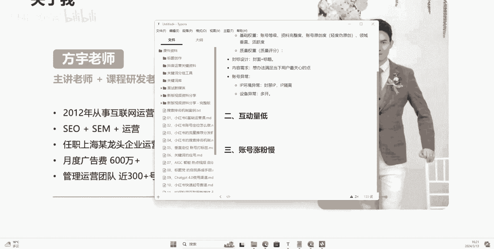
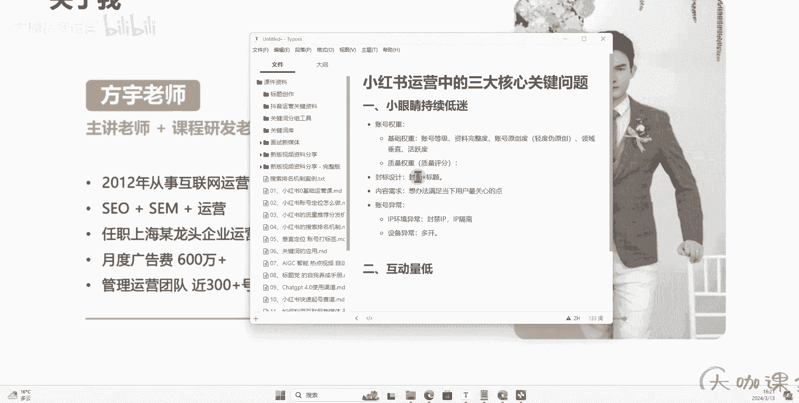
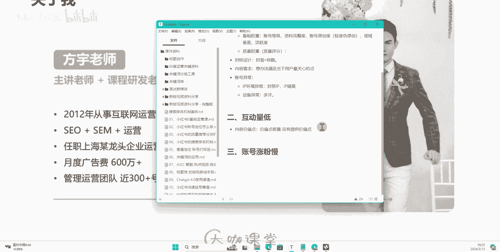
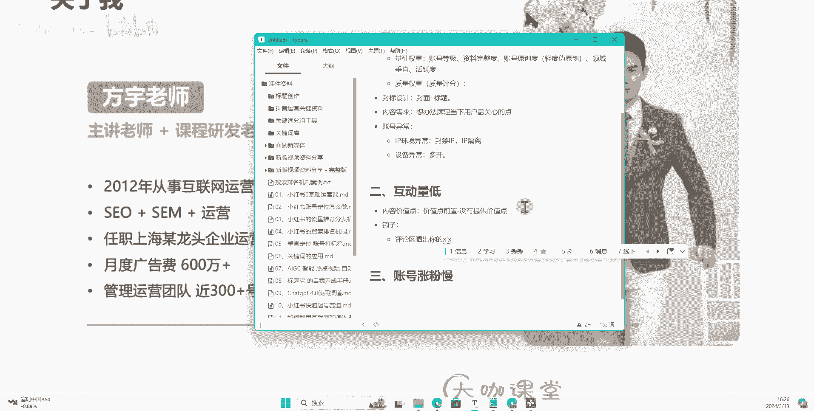
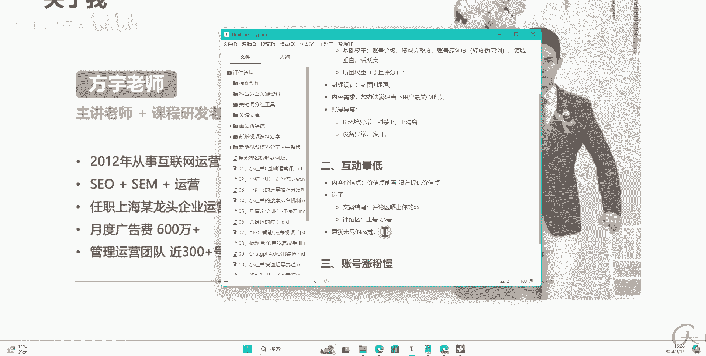
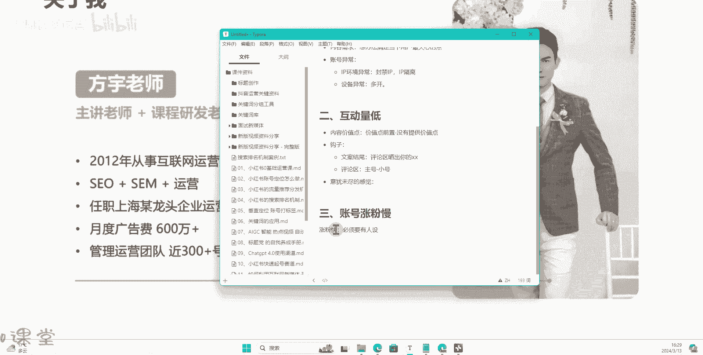
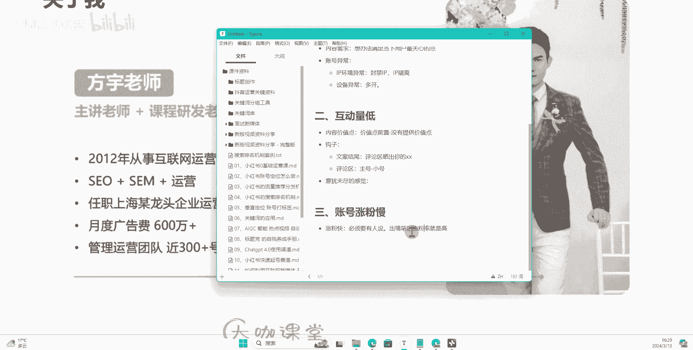
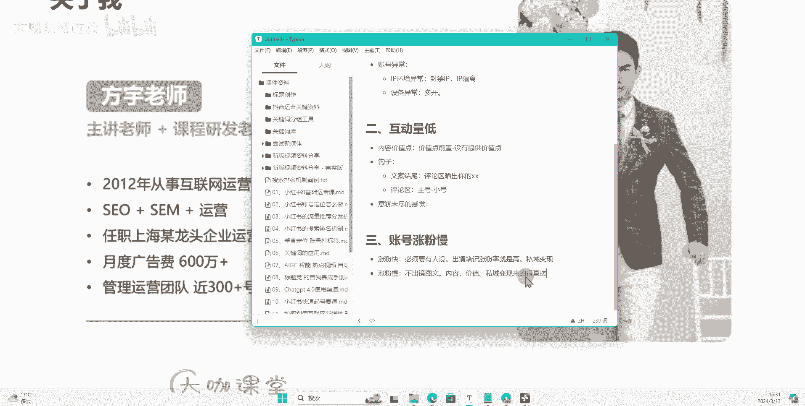
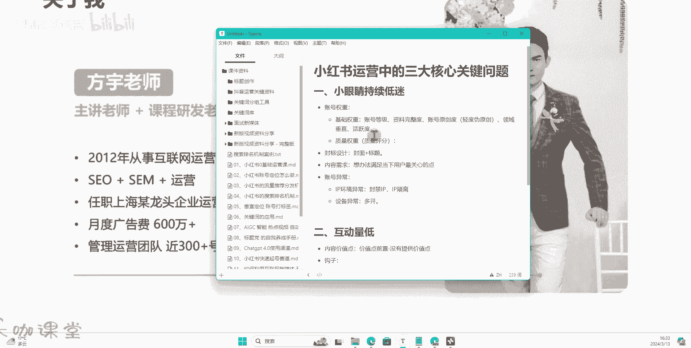
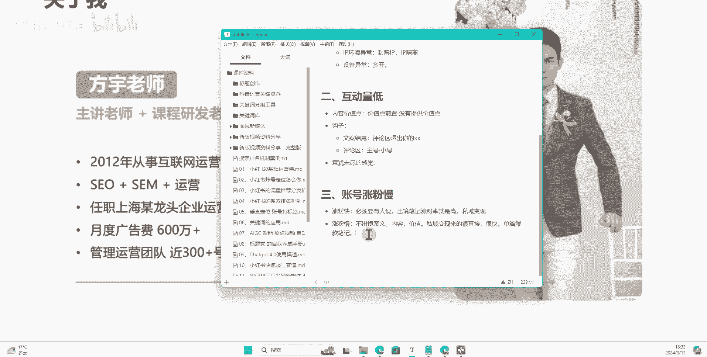

# 【7天搞定新媒体运营最全教学】全流程小红书运营技巧 起号／涨粉／引流／变现 打造爆款账号的绝佳课程！ - P26：24、图文笔记：三大核心运营问题：互动低、涨粉慢 - 大咖私域运营 - BV1fqeEeFE5u

呃，hello大家好。那么上一节课呢我们针对小红书运营中的三大核心关键问题，小眼睛持续低迷。这个呢给大家做了一定的解答。那么接下来呢我们来聊另外一个点，也就是如果说你遇到了你的笔记持续互动量低。

到底哪里出了问题。OK那么这里呢我来跟大家讲一下，就是有两个啊非常关键的核心点。首先第一个呢。

第一个是我们的内容价值点是否满足了。那么我一直跟大家提啊，跟大家讲，强调就是我们现在做小红书运营，你一定要关注你的账号的一个笔记的它的一个价值点。你是否有真真切切的满足了用户需求点。

我们呢在假设啊你现在小红书的这个笔记。他的小眼睛还可以的情况下是吧？有那么300500，或者说啊甚至说200。那么嗯我们去设想一种情况，这20030500里边有没有可能有你的精准用户。那么这个问题呢。

大家可以想一下，其实的话我告诉大家，你只要拿到的流量，有流量的分发，那么这些里边是绝对是有包含你的精准用户的，不管你做什么赛道。只要有这个流量分发。

你的关键词包含了你的笔记内容里边做了这个关键词的一个定向标签打了。那么这部分流量里边你一定是有你的精准用户的，不管这个精准用户有多少，它是一定有的。那么这部分用户进来之后啊。

一开始他的一个比例一直到最后我们笔记产生爆款之间，它的一个比例呢是呈逐步增加的一个态态势。比如说一开始给你分发300个流量，这300个流量里边可能至少有30个到50个，至少啊是有是你的基准用户。

那么这些用户进来了之后，他没有给你点赞收藏以及给你评论的一个内一个一个问题，你觉得可能是出在哪里呢？那么我们想一下，你的笔记有小眼睛是代表什么呀？其实就代表了他有点击行为，对不对？他点击进入了你的笔记。

但是他跳出了，他立马就返回了。这是什么问题？这就是因为你的内容没有提供用户他吸引的价值点，或者说你没有把价值点前置，对吧？两个点，一个是价值点前置，一个就是没有提供价值点嗯。没有提供价值点。

这个很好说呢，就是你的笔记里边一堆废话，甚至说你的封面或者说你的内容图里边根本就没有提供你封面上要告诉用户的东西。然后呢呃甚至说你的文案这一块，你也没有给用户提供一个清晰的排版。

或者是让他看起来很舒服的这样的一个结构，让他一眼能从你的笔记当中得到他想要的东西。比如说我们去写一篇关于旅游攻略的这样的一个笔记。他的笔记呢从上到下肯定是包含哎第一天去哪里旅游旅游路线，然后呢。

哪个地方建议去花多长时间，坐什么车，对吧？从这样一排下来，然后第二天去哪里然后哪些景点呃，优先去啊，坐什么车，什么路线，第三天等等你做这样一个直接的结构一个下来，这个就是我们提供价值点，对吧？然后呢。

还有一种情况就是我们的一个价值点潜置的问题。可能说你这篇笔记文案啊，当中你提供的这个价值的有价值的东西。但是呢你前面加了一堆废话。哎，欢迎同学们啊，欢迎大家来到我们的这个呃看到我这篇笔记啊。

其实之前啊一直怎么怎么样啊，然后呢呃讲讲故事啊什么。😊，真的谁愿意看你这些故事呢？用户呢，他看你的笔记，一定是通过封面想要去进入到你这篇笔记，得到他自己想要的东西，这个是非常关键的。

也就是说你的价值点一定要要么就是没有废话，要么就是你的价值点必须要往前面放。哪怕说你要放钩子，你也得放在最后，而不能说往前面前置。这个是我们前期起好的时候，大家一定要注意的点。内容价值点前置。

还有呢内容一定要去提供就是用户，你至少说你做的这篇笔记，那么根据我们提供的这个加大家的一个选题的方式，你一定要提供满足当下用户需求。也就是我们这个选题的一个关键内容。这个就是我们的内容价值点。

这个非常关键。我一直跟大家讲，就是你只要你的笔记封面标题设计的好，你只要有点击率，其实我们是有很多很多办法可以让我们的精准用户来了，我就能让他给我产生点击数据啊，我们的点赞收藏，甚至是评论。

这个是完全有办法可以办到的。当然前提就是取决于你到底会不会在这个文案里边加上，或者说你这个封面图片，里边的文案图里边，你到底有没有办法提供他想要的价值点，这个就是我们提供的价值啊。

也就是说我们内容为王的一个核心嘛。那么第二个呢，就是我们讲到的一个钩子，对吧？

我们时常说呃拍短视频要留钩子，对吧？我们做文案也要留钩子，是不是你呢在这个我们前期跟大家讲的时候，就是前面几节课跟大家聊过，就是你留钩子这一块呢，我们可以通过正文的文案内容去留，然后呢。

也可以通过什么呀？在评论区去留，对不对？这两个方式都能够让你的这个笔记有一定的互动数据。那么文案里边留啊。在文案里边留可以说，哎大家来参与一下这个互动，在评论区晒出你的对吧？晒出你的。

某某对不对？这种方式很常见，为什么咱们不去用呢？就是非常简单的对吧？这个是我们的一个文案区。嗯。本案结尾对吧？然后呢，还有一个就是我们评论区。评论区呢用自己的方式，你可以用自己的一个主账号去告诉大家呃。

需要你资料的，或者说呃有没有遇到同样情况的。呃，或者说你最近是什么样的一个呃这个这个这个这个呃你最近是什么样的一个情况，在评论区打出来都可以，或者说呢你用小号对吧？一个是主号，然后呢。

另外一个呢是小号来配合着在评论区配合主号来做这个评论的引导，这些都是可以去做的，没有多大难度，真的很简单，好吧，你用这些方式，你不要说就是我们之前说的，你不要去做纯纯的去做分享嘛，对不对？你分享的。

你还得告诉别人，哎，我这个内容是吧？呃，有一定的价值，你呢要参与我的这个评论，对吧？我肯定是有一定的目的的，对不对？😊，那么其次呢还有一个小方法，对不对？互动量低，是不是啊？还有一个小方法啊。

还有一个小方法，就是我们可以可以做出一个什么样的一个感觉呢？就是我们内容啊让用户有一种意犹未尽的感觉。什么意思呢？就比如说我的封面上我告诉大家，哎，护肤呢要讲究这18个步骤啊，这18个步骤。

但是我没有办法完全提供嘛，对不对？我的文案里边可能只讲那么一部分，我讲的1到8，对不对？还有呢10个点，哎，我写不完。然后但是呢我整理成了一个什么呀？我整理成了一个攻略的视频，或者说一个教程一个方法。

一个图册，然后需要的在评论区扣个一，我私信发给你，或者是呢我的文案图里边呢呃就是我封面后面这个图片里边，我只放部分内容，对吧？我只放个8条，或者说我放个6条，剩下的写不完，在最后张图写一上评论区嗯。

呃打个一，或者说评论区扣一个什么想要等等等等，我私信发给你，这都是一种方法。就是呃内容需求和价值。然后呢配合咱们的勾子，再配合咱们一些其他的玩法。你想提升互动点是非常简单的。

这个就要靠咱们有一定的思维和有一定的这个认知来做这个事情。好吧，这是互动量低解决办法。

第三个呢就是我们账号的一个涨粉慢。那么这里呢我要跟大家说一下啊，如果说你的账号遇到涨粉慢，你就要看是这两种情况啊。我们首先我来跟大家讲一下小红书上面的涨粉呢，它是有一定的。呃，我们知道啊小红书上面呢。

它目前呢一个是视频，对吧？然后呢，一个是图文。那么我跟大家讲一下涨粉和不涨粉的一个情况。第一个涨粉快是什么样的一个情况呢？涨粉快必须要有什么呀？涨粉块必须要有人设，人设是怎么来的？

人设是怎么来的？人设并不是说哎我在我的介绍里边，我的名称里边，我告诉大家我是谁谁谁对吧？人设是怎么来的，人设是非常关键的一个东西，你必须要有出镜，对不对？你出镜告诉别人，我是我是谁，对吧？

你经常经常能够刷到我，哎，你对我的印象已经比较熟悉了。那么呢哎觉得我讲的还可以，不管是图文或者说是视频，那么出镜的这种笔记，他的涨粉率。😊，就是高好吧，出镜。

附近的涨粉率就是比较高。然后呢呃但是也有一个也有一个问题哈，也有个问题，这也同不讲了，涨粉快对吧？出境人设高。但是这种呢如果说你想去做私域变现，就会稍微有点困难。😊，他不是说稍微有点困难。

而是没有我们下面要讲的这个图文笔记来的更加直接。私域变现啊，那么我们如果说做视频，对吧？然后呢，我们做这个呃出镜类型的图文啊，当然一般的啊出镜的话肯定是以视频为主的哈，比较多啊为核心。

那你做这一块的内容呢，你的人设你的涨粉会比较快。但是呢你的思域变现呢就会来的稍微慢一些啊，来的稍微慢一些。待会儿我再跟他讲是为什么？然后其次，涨粉慢。涨粉慢就是我们的一个图文啊，我们不出镜的图文。

不出镜的图文，涨粉就是慢，因为什么呢？因为这样的一个账号，他没有人设，对吧？没有人设用户他看到这篇笔记，可能说哪怕你是作为一个机构，但是用户看的是笔记，他看的是什么呀？他看的是内容，文字内容。

还有你封面，以及你里边提供的这些内容组里边的内容，他看的是价值。对不对？他看的是价值。也就是说，如果说价值提供了很多用户，他就得到自己想要的东西，他不会再理你后续的，不会说什么给你点个关注啊。

他了不起给你点个赞，收藏一下。哎，方便后续自己啊可能说有可能回来回看，这就是不出镜的一个一个点。但是。图文类型不出镜的图文类型，它也有一个优点是什么呢？它的思域变现来的很直接啊，来的很直接，而且很快。

为什么呢？因为小红书有一个特性，就是它的一个搜索搜索的排名呢呃搜索排名这一块呢得出来的结果。呃，你们可以想一下什么样的人他会去搜索，他有什么样的一个需求，他会才会去搜索呢？对不对？

他肯定是当下有迫切的这个需求，想了解这个事情，对吧？他才会去搜索。那么搜索的用户呢就代就代表我们刚才说的他的需求很直接。他得到你的笔记了之后呢，你的笔记里边一定一旦有我们设的这些钩子，或者说内容点。

他一定会在评论区或者说啊也不是说一定啊，就是绝大部分绝大概率，他就会通过你的这个私信，或者说你的一些设设立的这个钩子，他会去联系你啊，他会去联系你会去跟你交流，这个就是图文笔记的一个优势。

比就是说图文笔记这一块呢，他其实更在乎的是单篇笔记啊。单篇爆款笔记，也就是说图文他就更在乎我们的笔记到底有没有爆款。然后呢，我这个笔记参与的排名怎么样？

在什么样的一个搜索词下面能够在第一屏搜索词的第一屏能搜到我们的笔记。这个非常重要啊，非常重要，也就是说呃他的思域呢来的变现来的很直接啊，这就是我们这一块的一个呃一个重点。如果说你的账号遇到涨粉慢的。

你就得看一下你的账号是否有能力去凸显自己的一个人设。当然也不是说呃一定得出镜啊，一定得有人物这样的才能够就就就就才能去完成这个人设啊，就是我们其实还有办法，也有办法能够通过一些其他特殊的这种运营方式。

让我们的账号能够得出一定的人设。但是它远远没有我们出境的这种笔记来的这个人设来的更快更直接好吧，这就是我们跟大家讲的这一节讲呢。如果说你的账号遇到互动量第一，有哪些问题，你的账号涨粉慢。

你去点退一下你的账号有没有遇到这些问题O。

