# 【7天搞定新媒体运营最全教学】全流程小红书运营技巧 起号／涨粉／引流／变现 打造爆款账号的绝佳课程！ - P2：1、新媒体运营第一课：标签 下的流量分发算法 - 大咖私域运营 - BV1fqeEeFE5u

hello，大家好，我是方宇老师。欢迎大家来到我们这一堂课。那么这一堂课呢，我们先要跟大家聊一下一个我们做新媒体运营必须要了解的第一堂课，也就是关于平台的一个流量分发算法。什么是流量分发算法呢？

就是我们不管做短视频也好，还是做图文笔记也好，我们发布出去的内容。也就是说你刚注册这个号，或者说你这个账号有挺久了，你发布出去的作品，它是有这个播放量和这个小眼睛的。那么这一部分的播放量和小眼睛。

每一个数字背后，它到底代表了什么，以及我们从一开始的三五百的这样的一个播放一直增长到我们后期125000或者1万甚至几万，以及它能够成为大爆款的这样的一个前提。

这也就是我们整个流量的一个构成和流量的来源。那么这里呢我们首先要了解一个概念就是叫做创作者标签和用户标签。那么我们先来了解一下什么叫做创作者标签。😊。

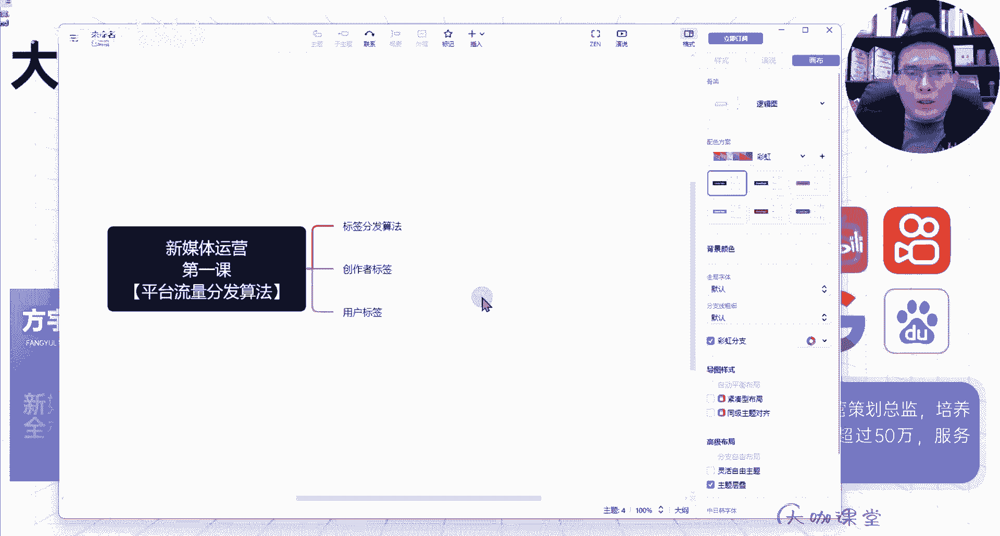

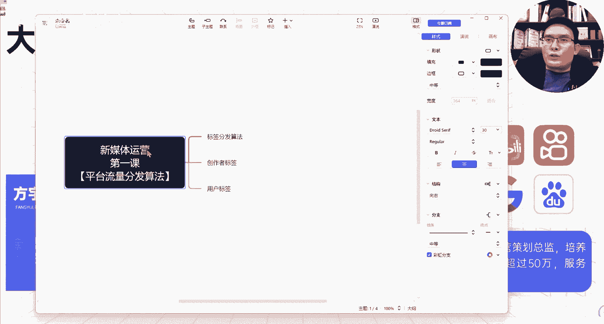

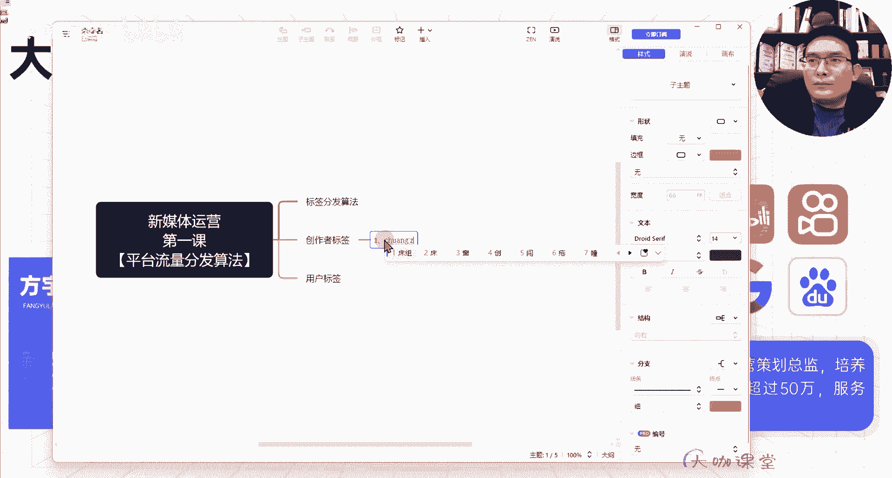

创作者标签是什么呢？就是我们的账号。刚才我们讲了，我们发布第一个内容之后，我们的这个平台，它会把我们现在的这个账号啊识别成一个身份叫做什么呢？就是创作者啊，创作者你发布内容之后，你的账号呢。

平台就会认为你是已经成为了一个创作者。但是这个时候就会有一个问题，什么问题呢？

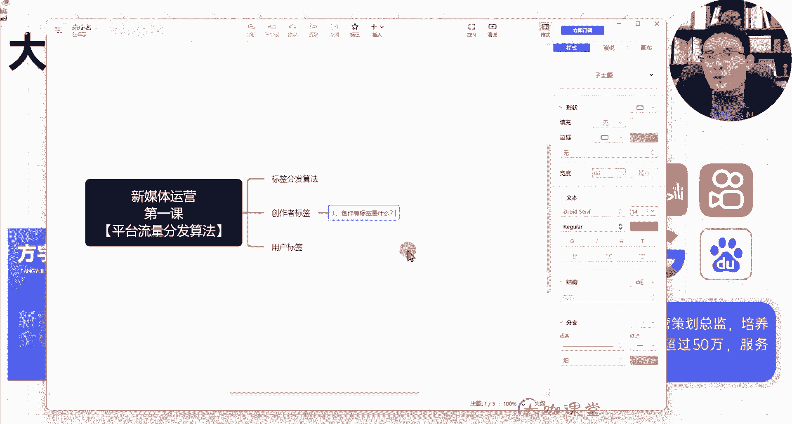

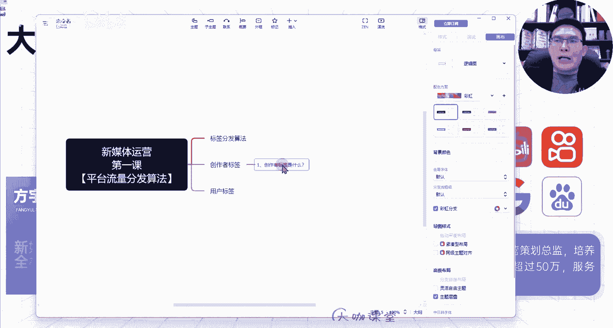

你虽然发布了内容，但是你的这个内容啊。平台并不知道你的内容是讲什么的。我们可能想着我们有时候发内容呢，我们的标题，我们的这个口播文案或者说我们的笔记内容以及我们的这个tg标签。我们的这个首图封面。

我们是不是都是讲了我们是做什么的对吧？比如说我们是做一个女性女装穿搭的这么一个视频或者说笔记。我们在这些地方都会去凸显我们的标题关键词，这些地方都会凸显。那么平台为什么我写了这些东西，它还会识别不了呢？

就是因为现在我们所有的平台，包括这个短视频或者说图文笔记平台，我们的这个内容的一个判断的一个机制都是通过什么呀？都是通过机器审核的。并没有说你发布的内容，他们会有后台人工去看你这篇内容是讲什么的。

然后再去给你做分发，现在的新媒体平台都是有非常完善的这个分发的流量分发的一个机制以及内容判断的一个机制，包括你的内容是否合规。你的内容是讲什么的，这个都是通过平台的一个算法。

它的一个非常强大的一个大数据。😊，分析的这么一个系统来判断的这也是我们这一堂课要交给大家非常核心的一个概念啊，也就是说我们刚开始成为创作者的时候，你的内容你是没有一个。

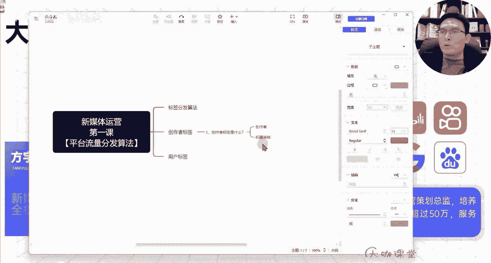

精准的标签的。那么没有精准的标签。那么这个时候你的播放量又是怎么来的呢？包括你的小眼睛，它又是怎么来的呢？我们可以理解为这个时候你发布的内容，你的播放量以及小眼睛它们都是什么呀？都是泛流量。

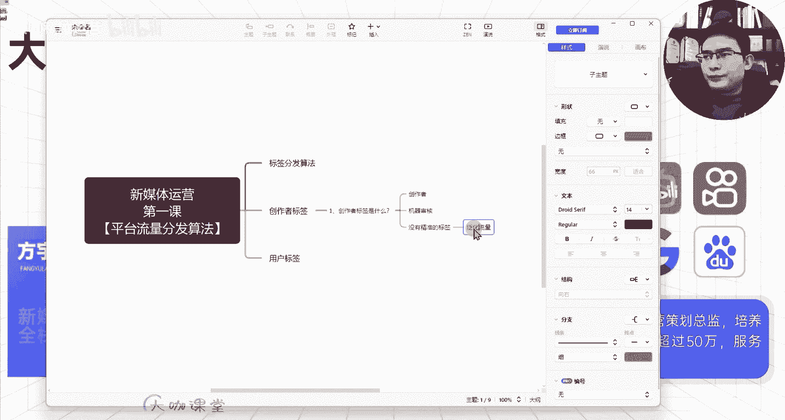

什么是泛流量？泛流量？就是说你这些内容，现在分发的这些用户都是不精准的。你是做穿搭相关的女性穿搭相关的。

他可能把你的这部内容分发给了那些四五十岁的这种呃中年大叔或者老大爷或者说这种十五六岁、十七八岁的这种小孩，甚至说这种四0多岁、50岁的这种呃中年男性，也就是说你的这部分流量啊，他是不精准的。

因为平台的系统现在没有办法去判断你的内容是讲什么的。他不会通过你的标题，你的tg文案以及你的封面来判断他会通过什么呀？通过分发的人群，😊。

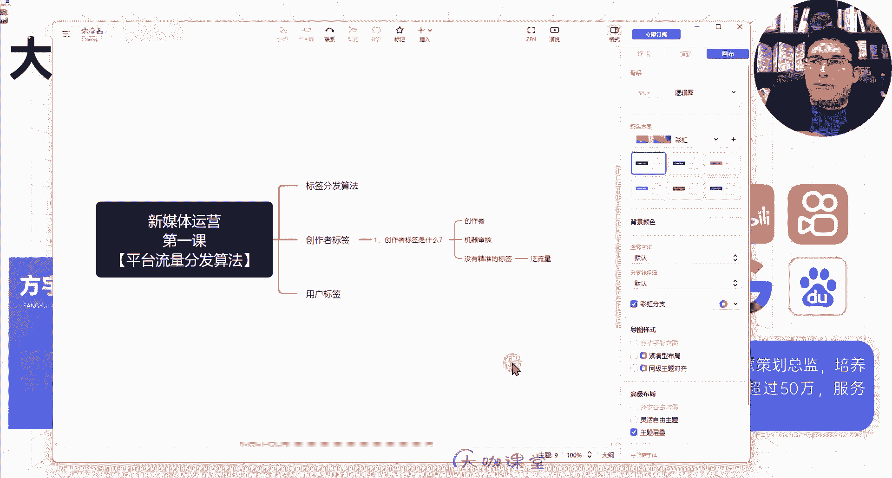

通过分发人群来判断你的内容是什么的。那么这个时候我们就要有一个东西，就是平台呢他会给我们所有的创作者去打上一个标签。这个标签是关于什么内容的。你这个创作者是做什么做什么赛道的，你是产出什么内容的。

那么这个东西叫叫做创作者标签。我们呢前期的账号分发流量上不去，以及我们的流量来了，并且没有给我们的内容提供这些互动数据都是基于什么？都是因为我们的创作者标签不精准。好，那我们来看一下创作者标签。的作用。

很简单，创作者标签的作用就是系统用于判断你的内容是关于什么的。

那么这个标签的一个判断它能直接影响的结果，它就决定了决决定了你的内容最终分发给哪些人群。

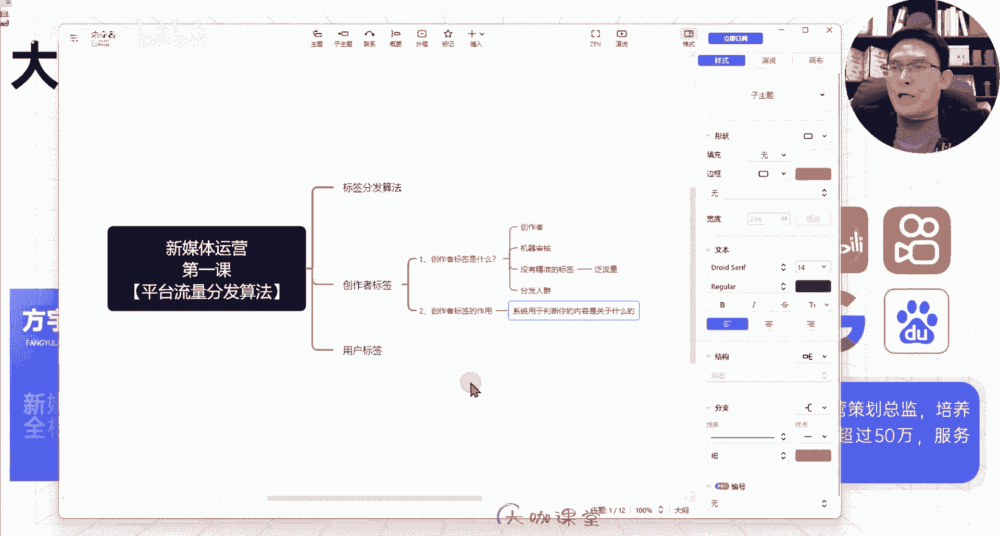

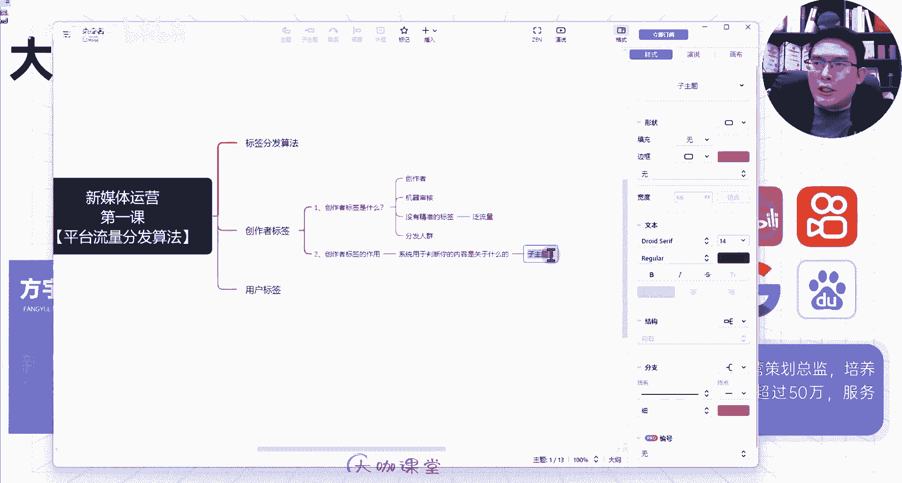

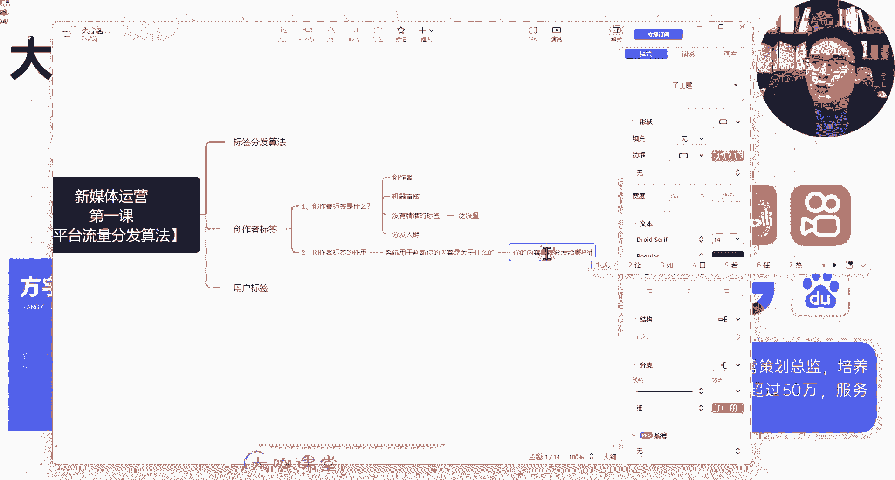

他会通过给你的账号打上的标签。比如说我的某个博主，我我现在的一个账号，我长期去创作关于这个女装穿搭的内容。在系统成功识别了我的内容之后，他就会在后期把我的内容不会推荐给所谓的泛流量。

他会推荐给很多对我们女装穿搭特别感兴趣，或者说他曾经浏览过有一定停留时长的这一部分人群。那么在这种精准的推荐下，会得到一个什么结果呢？如果说分发精准的情况下。

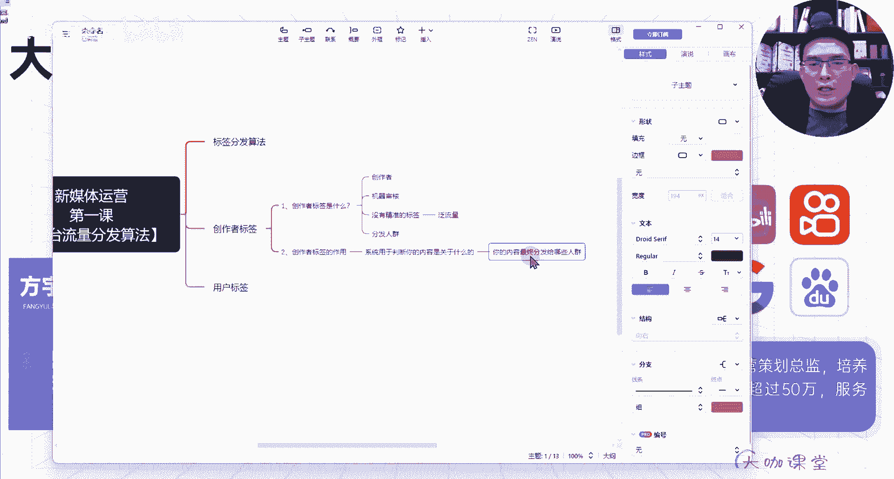

啊，你的。

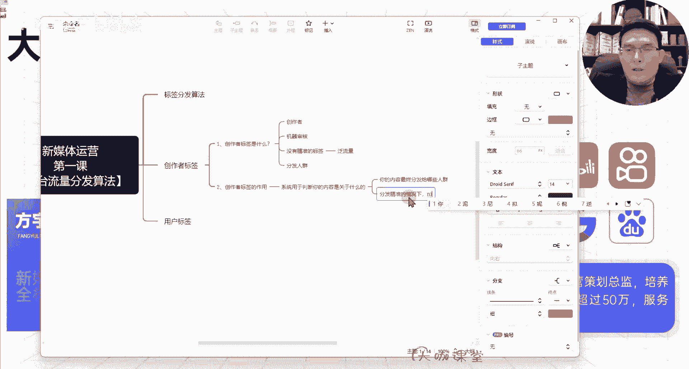

流量数据会越来越高。

会越来越高。如果说分发不精准的情况下。你的流量数据。

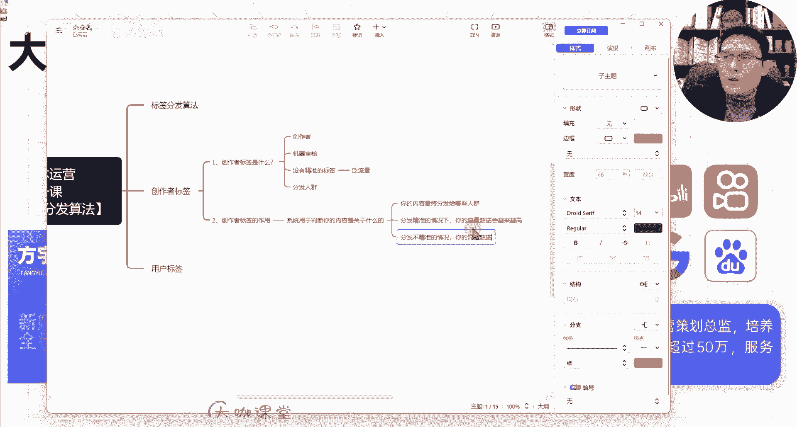

就会越来越差。就会越来越差，这个很很好理解你的视频分发的人群，他对你的内容感兴趣，会有一个什么样的结果。它会在你的内容里边会有一定的停留。那么当然这个是在我们内容创作比较优质的前提提下。

他会在你的内容上面有一定的停留。停留了之后呢，对你的这个内容，你制作的这个内容的质量比较高。那么这部分人群里边特别感兴趣的，他会给你提供一些数据支撑，什么数据支撑。比如说点赞收藏或者说评论等等行为。

这个是一点，对吧？那么如果说分发人群错误的情况下，会得到一个什么结果呢？就是我们前期讲的泛流量的这种情况下，所有的用户他浏览你的内容呢，他的跳出率是特别高的，什么是跳出率。

就比如说一个用户他在浏览短视频的时候，他划到了你的内容，他可能瞬间判断出这个内容他不感兴趣，他就直接划走了啊，直接划走了。那么这个时候算不算一个播放量，在短视频平台上面，它算一个播放量。

但这个播放量提供的数据会特别差啊，他的停留时长可能说一秒都不到，对吧？😊，啊，可能说呃还有呃哪怕说两三秒这种对我们这个视频的一个数据增益都不是很大，对吧？都不是很大。那么这部分数据一旦多了之后。

平台就会可能判断你这个创作者他提供的内容很差。那么我可能限制你的一个流量分发，在没有确定你这个账号是做什么内容之前，我限制你的个流量分发，这是什么呢？就是我们通常提到的一个限流。

也就说我们很多人去做账号，你做了短视频之后，你会发现后面你的流量持续起不来，或者说你的流量反而越来越差，最精最最明显的是什么呢？比如说我们有些同学他们去做这个营销性的内容，我们企业拿去做这个短视频。

你的短视频上来，大家就想着我要通过这个短视频去告诉别人，我是做什么产品的啊，如果说我不讲我的这个产品呢，可能这些用户呢，他就不知道我做什么，甚至他不联系我。但是这一点呢就是一个非常错误的一个举措。

你在前期你的这个内容不通过一些其他的方法来吸引用户停留。呃，你的在这些不精准的流量的前提下，所有的用户呢他快速。😊，划走了之后，它就会对你的这个视频形成一个负面的一个影响。你这样的视频发的多了。

你发个十0条50条，在这些所有的视频表现数据都比较差的情况下，你的这这个账号，它后期的流量呢是持续，它是起不来的。那么你的账号可能运营到最后就废了。好吧，这个就是我们关于讲的创作者标签，它的作用啊。

那么第三点我们要来了解一下。

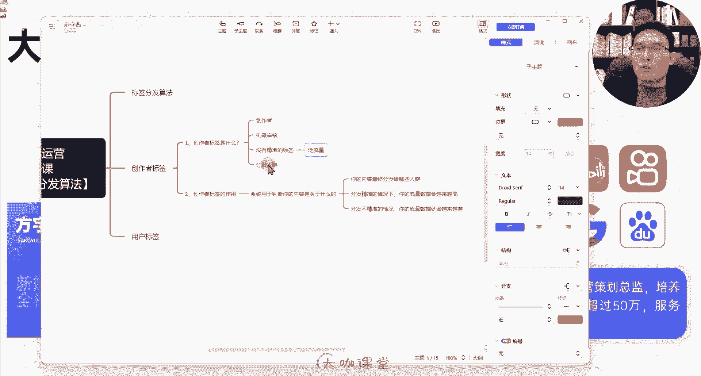

关于我们。关于我们账号的第一波。第一波流量的第一波流量这个东西呢，我们知道账号初始。刚开始是没有标签的啊，是没有准确。是没有准确标签的。那么这个阶段我们刚才讲了，它会分发这个泛流量，泛流量有哪些特性？

泛流量有哪些特性？我们刚才讲的，首先第一个性别不精准。

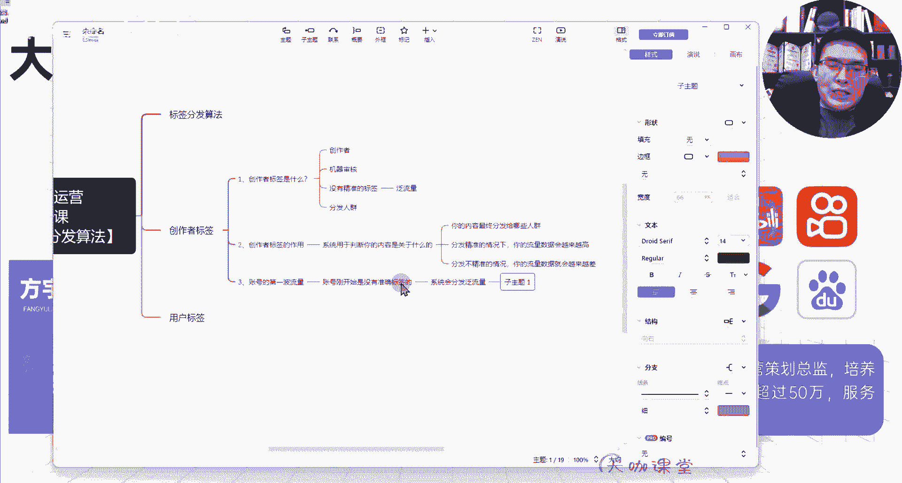

然后可能说年龄不精准。

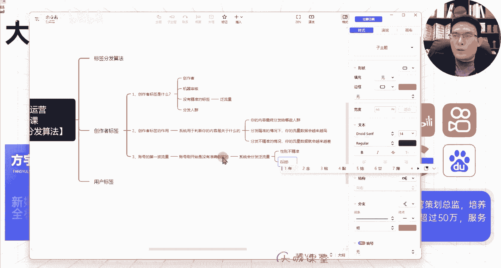

还有什么？还有我们的兴趣爱好。兴趣爱好不精准。那么这种情况下，我们做垂直赛道内的内容，我们得到的前期这些不精准的流量，就代表了它表现出了我们账号的一个数据呢？

在后台所能看到的我们的玩波以及跳出这些数据都很不可观。那么如果说在这种情况下，我们来推我们来想一下，我们来设想一下年龄不精准，性别不精准以及兴趣爱好不精准。那么这种情况下。

还有没有什么办法能够让我们前期把流量拉起来。有啊有我们做什么样的一个内容呢？就是娱乐性的内容。

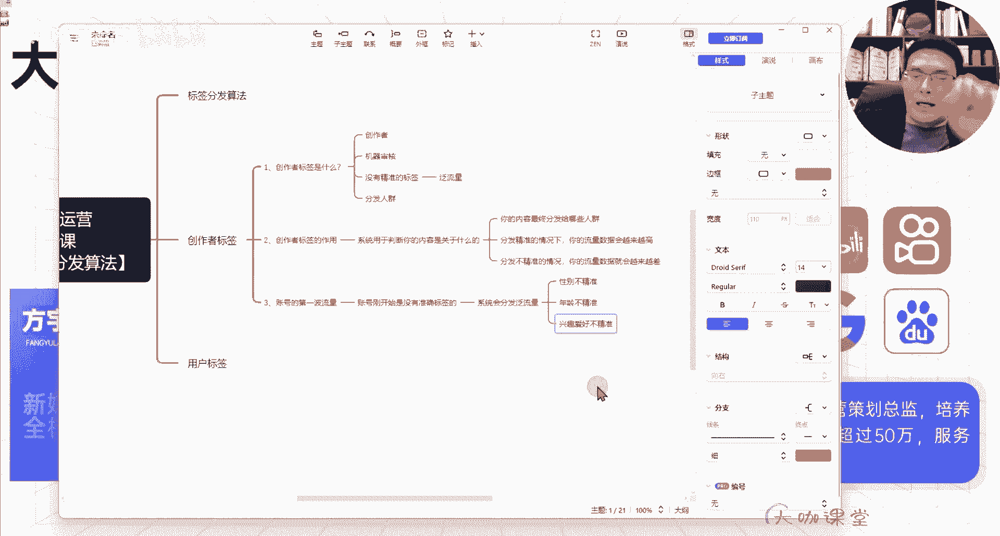

我们做泛流量这部分人群喜欢的内容。什么叫做泛流量人群喜欢的内容？比如说我们做搞笑的段子，对吧？或者说我们去讲一些新闻热点类的事情，以及说我们去做一些呃吃瓜呀猎奇内的内容。

你们想一想这部分的内容是不是能够涵盖绝大部分的人群。我们假设说有1万个流量，对吧？那么这1万个流量当中，我们做这个穿搭赛道的，可能当中对这个穿搭内容比较感兴趣的，只有那么10个用户，对吧？10个用户。

这个是毫不夸张的。那么这10个用户，你能否抓住他们对你的这个视频流量提供高的数据用于系统来判断你的内容比较优质呢，是没有办法的。10个流量的这个基数太少了，而且这是一个很现实的情况。

但是如果我们做搞笑这个段子一类的，或者说我们做新闻热点类型的内容，这一类的内容关注他的用户群体，可能1万个流量当中有8000甚至9000都有可能这个取决于你的内容创作。😊，做成什么样，对不对？

这就是我们前期很多人去做这个账号啊，你们去做一些这个综艺视频的剪辑，做一些这个呃娱乐的明星的这些八卦呀段子啊，为什么这一部分的内容，它的流量会好一些呢？就是因为这一类的内容。

它的标签是契合大部分人群关于短视频，他刷短视频的，它一个具体的需求。很多人刷短视频是为了什么？就是为了娱乐，对不对？它就是为了娱乐就是想打发时间，所以说你做这一部分内容它就更容易起。

但是这部分内容你要想一下，它是否是你当下想做的一个赛道，是不是？然后呢，这一部分的内容后期的一个变现以及账号的一个发展以及涨粉的这样一个过程，对不对？这些是我们要考虑的问题。😊。

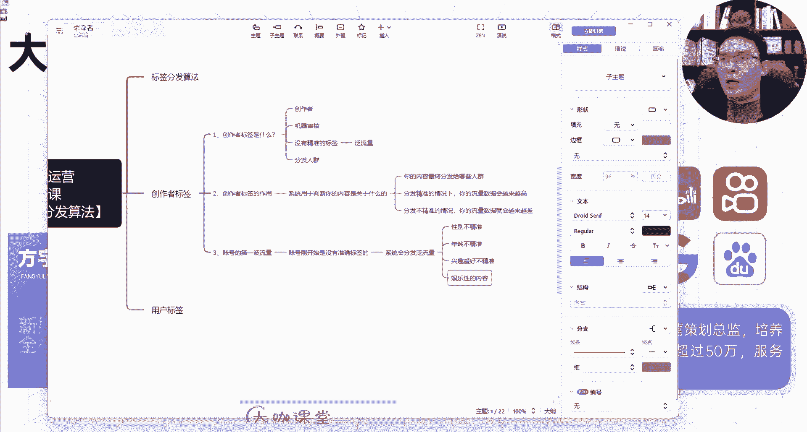

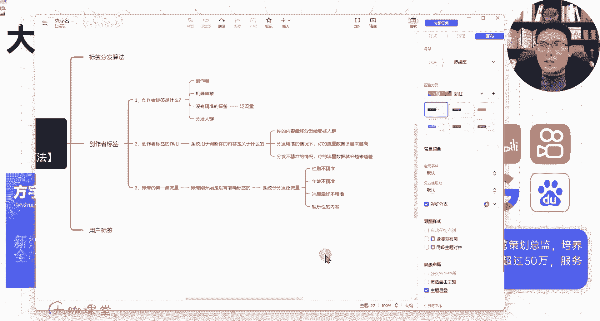

娱乐性的内容，比如说搞笑段子。然后的话。

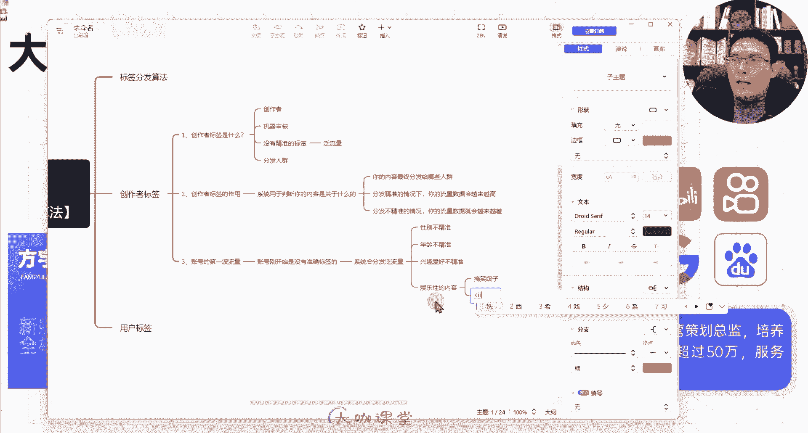

新闻热点以及吃瓜猎奇一类的。那么这一类的内容呢，它就比较好起。这个是我们讲的关于系统分发泛流量的一个它的一个举措。那么剩下的还有一什么这个阶段账号没有标签的时候，我们的流量其实还有一个什么意义。

平台还能拿来做什么？其实就是对我们的内容。

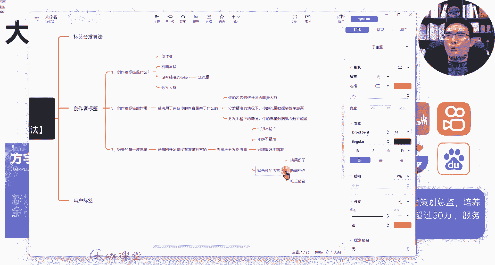

对内容进行一个测试啊对内容进行一个测试，测试什么呢？测试我们的内容是关于什么的？待会儿呢我们用一个非常经典的一个数据，我们来告诉大家，我们来演示一下这个平台来判断我们内容到底是关于什么的这样一个过程。

好吧。

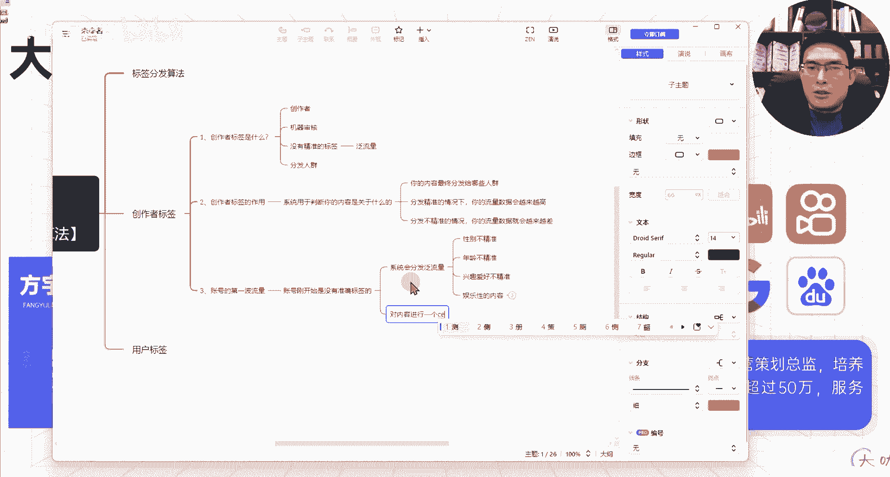

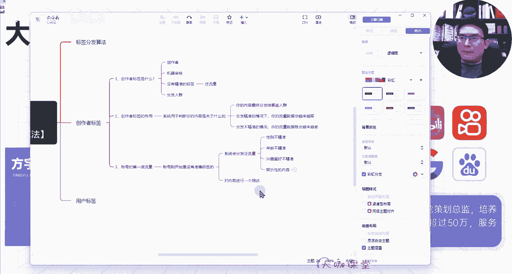