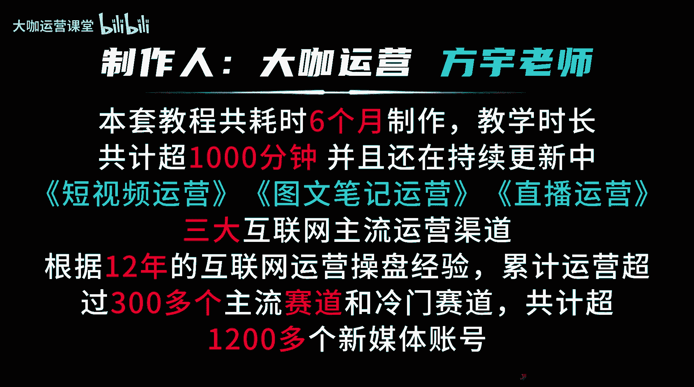
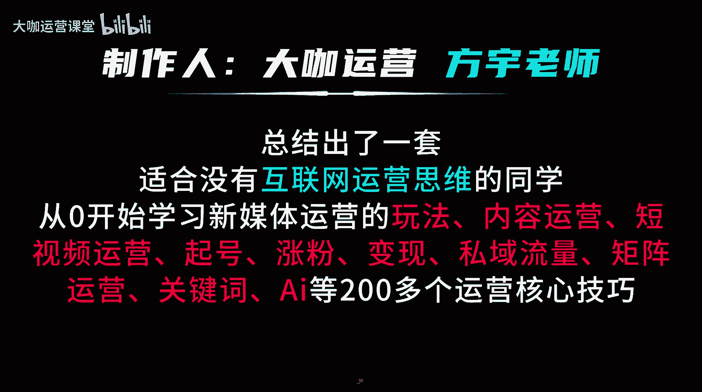

# 【8月全新新媒体运营教程】全网最全小红书运营技巧 起号／涨粉／引流／变现 手把手教你打造爆款账号！ - P1：001.新媒体运营 全套教学课程 必学第一课 - 大咖运营课堂 - BV15aWWekEcj

视频教会你新媒体运营，这是一套截止目前你从未见过的新媒体运营板，块最全最新最深层的教程。

本套新媒体运营教程共耗时六个月制作，教学时长共计超1000分钟，并且还在持续更新中，其中包括短视频运营，图文笔记运营，直播运营，三大互联网等主流运营渠道，根据12年的互联网运营操盘经验。

累计运营超过300多个主流赛道和冷门赛道。

共计超1200多个新媒体账号，总结出了一套适合没有互联网运营思维的同学，从零开始学习新媒体运营的玩法，内容运营，短视频运营旗号涨粉变现，私域流量矩阵运营关键词，AI等200多个运营核心技巧。

Hello，大家好，我是方宇老师，我从2012年开始步入互联网运营领域，截止目前呢，已经有超过12年的互联网运营操盘经验，从2023年开始，我在B站分享的新媒体运营公开课视频呢。

累计播放已经超过130万，那么这个播放数据呢在将来还会越来越高，那么这期间呢，我也帮助了很多想要从事或者转行，新媒体运营的同学，成功拿到了具有一定实操运营经验的岗位offer，那么我在教学从业期间。

也带领和教学过超过100多家的企业运营团队，帮助他们呢去搭建新媒体的运营渠道，账号规划，运营方案以及项目规划的SOOP等等，同时呢我也会去教他们如何系统化的去运营一，或者说操盘多个账号，那么本套课程呢。

我会结合我12年以来的运营经验点，针对目前互联网的主流的四个大方向，进行深度讲解，分别是图文笔记运营，短视频运营，直播运营，以及时下的互联网新兴产物AI的实战应用，那么本套教程呢我会以通俗易懂的方式。

以小白能够理解的方式深入为大家讲清楚，目前的互联网各大平台的底层流量推送逻辑，账号的流量层级增长规则，搞清楚流量它到底怎么来流量呢，又如何提升账号的权重呢，又该如何去运营新手呢，他又如何能够从0~1。

打造一个账号的爆款内容，不管是短视频也好，还是图文笔记也好，通过运营的手法和技巧，让我们把所有在新手眼里，本来无法把控的运营问题变得能够做到，不如爆款复刻模式复制等等。

那么这套教程涉及的干货知识点会非常非常多，当你开始学习的那一刻，我相信你会停不下来，并且呢每一节课你都会反复查看。

