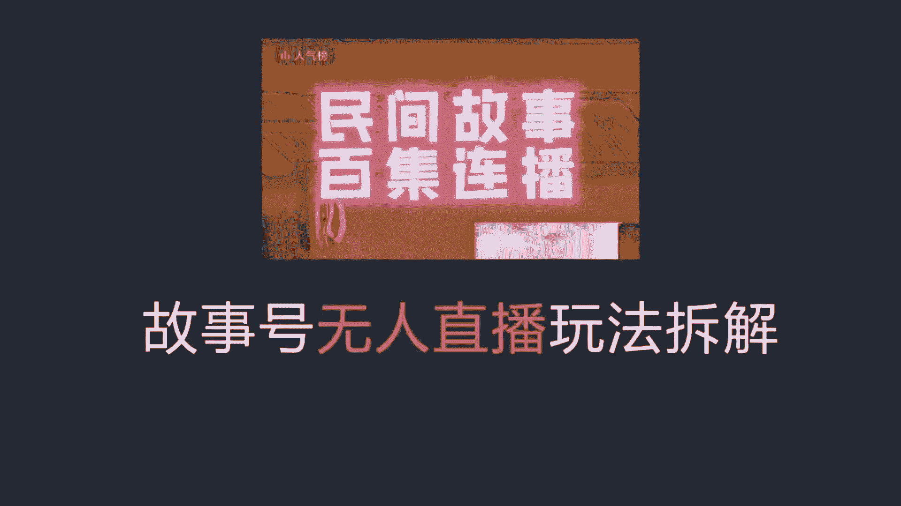
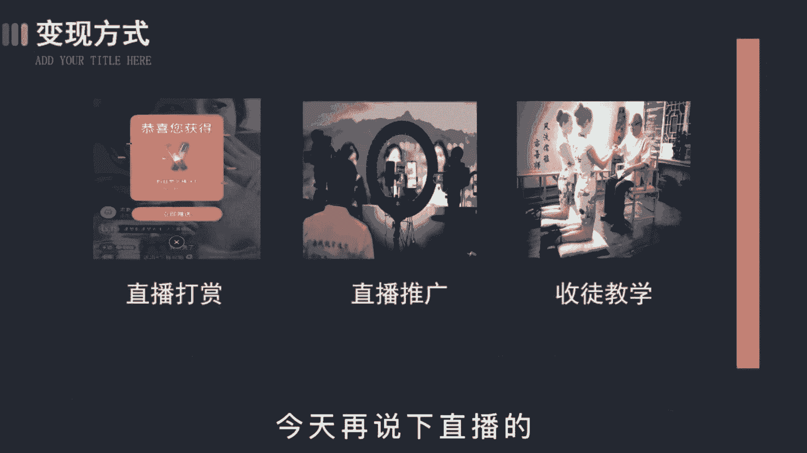
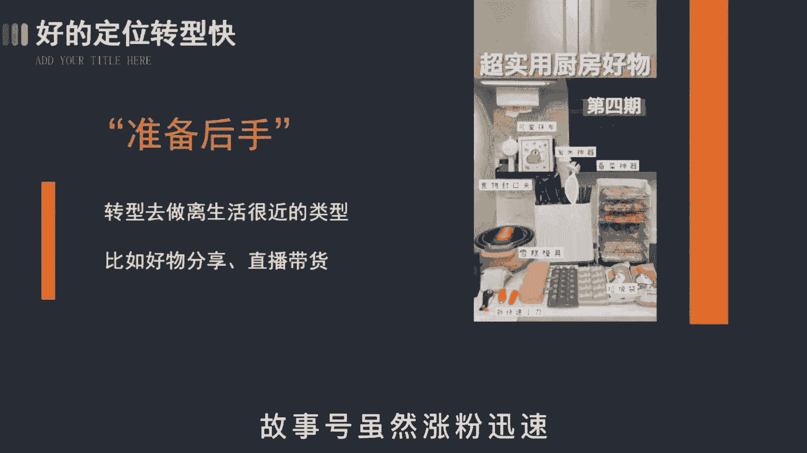

# 【99集精华版】花了2.8W买来的抖音课程！目前B站最完整的抖音运营教程，大佬亲自教学抖音起号运营变现，真的很简单！小白记得收藏！ - P11：变现篇丨抖音故事号直播玩法（3） - 真得爆了哦 - BV1SJ4m1G76C

故事号无人直播怎么搞，这大概是最详细的拆解了故事，好的直播和短视频的制作是不太一样的，单靠手机啊没办法完成，所以呢你必须要准备一台电脑，电脑呢是用来开软件挂直播的，第二个呢是养号。

这个养号呀和别人说的可不一样，没有那么多的骚操作，不会让你立马破播报或者吸粉什么的。

主要是为了养粉丝，因为开直播的条件是要有1000个粉丝才行，所以啊这段时间你需要不断的发视频，吸粉或者土块的话，你刷一刷，唉，你懂的，然后呢是直播时长，有的朋友觉得肯定是越长越好，搞什么日不落直播间。

一波波24小时，这是大错特错的，你要这么操作，不出几天就会封号处理，涉嫌营销虚假直播什么的，所以啊最好的时长是控制在6~10个小时为宜，不要太长，也不要太短，就跟上班一样。

这样平台就会认为你是一个正常人，我给你正常的评分，一般来说呀连续播一周后，你的直播数据呢就会有所提升，这里要注意的是，当你发现数据停滞不前，比如说观众不涨反跌。

你就得及时的关闭直播间，等几分钟重新再开卡一下，直播广场增加你的曝光度，这就好比你的作品上了热门之后，会有更多的播放量一样，我这边实测的数据是能保证开播30分钟，场关总数可以达到1300~1600左右。

一旦开播呢，左上角就一直不断的惊人，每两秒钟就会进来一个人，这时呢就算是卡上直播广场了之后，会获得源源不断的推流，那昨天呢讲了视频的变现手段，今天来说一下直播的主要呢三个方面。

第一个是直播打赏，当你能做到直播间每天能有几百上千人，在现实收益也是很不错的，我身边有个小伙伴就是场均都不到千人，但每天光打赏就有一两百，这还不算视频端那边的收益，然后再过段时间把账号权重再养一养。

搞个三五百是没问题的，第二个是直播推广，当你的粉丝达到了一定的量级，就可以接一些推广业务，不了解的呢，你就去点一下别人直播间的小风车，诶，你就知道了，广告推广结算方式有CPA，按效果付费，有CPM。

按展示付费的，第三个是收徒，做影视号也好，同称号也好，各行各业都会有收徒的现象，这很正常，没啥可说的，你会发现很多粉丝较多的账号，都会在名字后面加收徒二字，收费啊，才几百左右，高了呢也没人愿意学。

毕竟也没啥技术含量，不过呢这个在中期是变现的大头故事哈，虽然涨粉迅速。

但这种玩法不见得长久，所以为了保险起见，我也给大家准备了后手艺，当你发现账号被警告或者同行开始弃坑的时候，你可以转型去做好物推荐，去搞食品带货，这些品类呀，离生活很近，也是长辈比较关注的视频类型。

改个名字重新做号，不会让大家觉得很突兀。