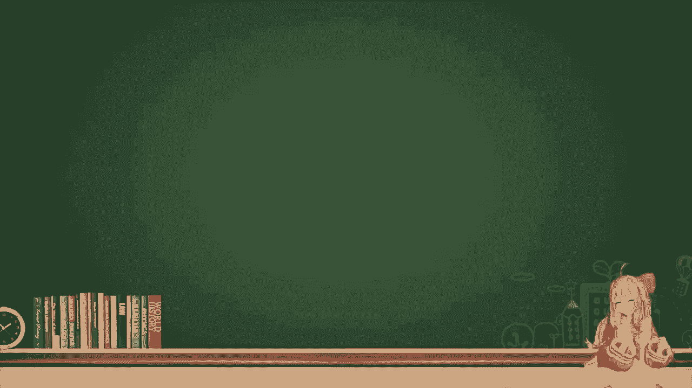
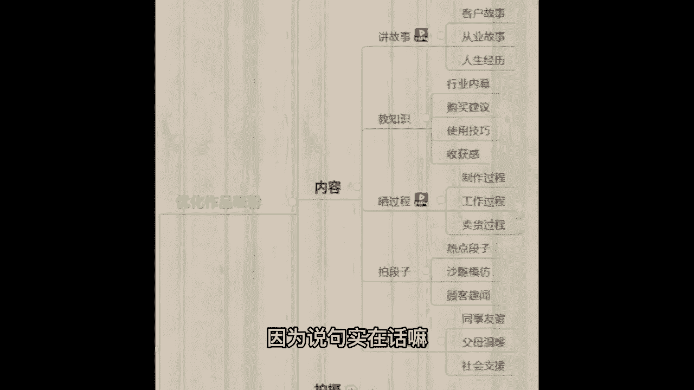

# 【99集精华版】花了2.8W买来的抖音课程！目前B站最完整的抖音运营教程，大佬亲自教学抖音起号运营变现，真的很简单！小白记得收藏！ - P17：15、视频类型3-6 - 路易胃疼阿 - BV1xZ421q7Rs

然后接着低温度，低温度也是剧情，它的剧情不一样了，他拍的是这种温暖的正能量的这种剧情啊，比如说同事友谊父母，温暖社会资源，并且我现在跟大家说，现在抖音除了年底的流量狂欢大风口以外。

还有一个流量风口的扶持，就是三农流量扶持，有没有处于农村的同学可以给老师，我扣个666，我看一下，包括是农村的，包括在农村的同学可以扣666嗯，现在如果你不知道拍什么，你还处于农村的话。

我建议你可以拍一下农村的美食，或者说记录一下农村的生活，这个能够给你很大的三农流量扶持啊，接下来我先带你们看一下，低温度的视频是怎么样的，看完之后可以把你的感受扣在公屏上啊，对，♪ 海浪无声 ♪。

将夜幕深，老板面多少钱一碗，♪ 奇怪漫过天空尽头的角落 ♪，大老板来碗面，空气里永不不要香菜，♪ 沉睡的哥 ♪，你的面怎么回事，老板不是说了不要香菜吗，哦什么啊，不能吃，给你换一碗。

真心说出来去哪来烟波，拿着那人不要了，扔火可惜了，帮我吃吧，去死好，老板，谢谢你飞来远去，♪ 怕你离我而去 ♪，♪ 更怕你永远停留在这里 ♪，老板你什么时候记性变得这么差了，嘿嘿那你什么时候把这酱菜吧。

谁无暴风尽于此岸，守得云开见月明，♪ 海浪无声将夜幕深深淹没 ♪，♪ 漫过天空 ♪，好，我看完了，咱们班有的同学觉得比较感动，是不是来这种视频的目的就是为了让你感动，戳你心窝。

他就不是为了让你觉得有意思了啊，那么像老师，我去拍，我去拍，老爷爷吃不起面了，我花十块钱给他买了碗面，有人看吗，没人看他这个视频啊，看点就在于反转，情理之中，意料之外，让别人觉得哇原来是这个样子。

或者本身就能猜到，但是看到之后还是有感触，这就是这类的视频能够给我们带来的，像你做视频啊，你刚才有同学说哎老师我不知道做什么，我思路乱了，我告诉你啊，不用乱了思路，这15个里面你就选一个去做就可以了啊。

你就选一个，你不要说老师哎呀，我这个想做一点，那个想做一点，这个也想做，那你肯定乱，你就正儿八经的，我说的这些你就15个选一个去做就可以了，你别都做啊，领域不垂直就选一个，这样就不乱了，然后接着做完了。

如何判定你作品好坏啊，给你几个词，第一个词有趣，看完了能让别人哈哈大笑，第二个词有用，看完了能给别人带来一个收获感，第三个词有感，看完了能让别人有感触，甚至有点小感动，三个词但凡能占一个就是个好作品。

就三个占一个就就够了，但是你要三个词，哪个你都不占啊，那我说实话你得想一想，你的视频还缺点啥，包括你可以下课让我帮你瞅一眼啊，这都是没问题的，这些老师我给你初步的先讲一下内容环节。

因为说句实在话嘛，你不可能指望我两个多小时给你讲完一节课，你刷一下啥都会了，那不可能咱俩得一对一沟通，才能了解具体情况啊，这就是咱们的内容环节，来这个环节自己啊知道有哪些了，在公屏上面给老师。

我扣个666，我看一下，每一个什么玩意都会了，那不太现实，对不对，咱先稍微的知道有哪些，你好找好你备选的，或者你想做的。

