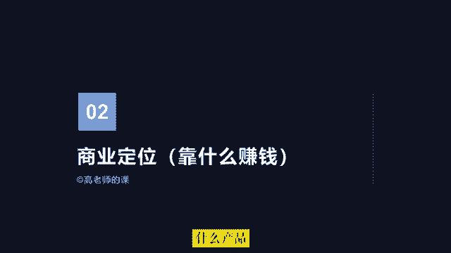
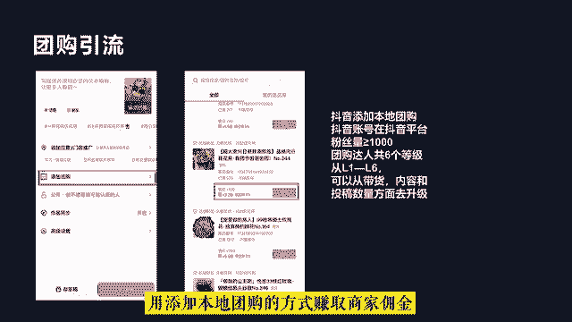
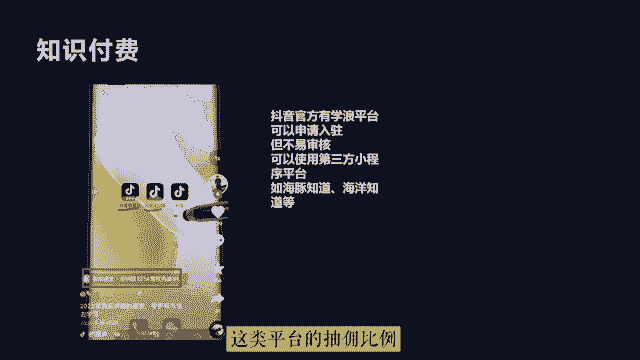
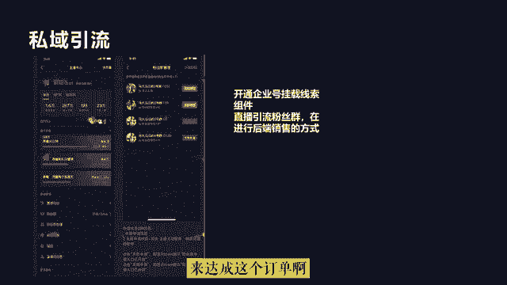
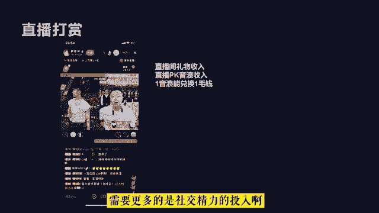

# 【99集精华版】花了2.8W买来的抖音课程！目前B站最完整的抖音运营教程，大佬亲自教学抖音起号运营变现，真的很简单！小白记得收藏！ - P3：2.变现方式 - 真得爆了哦 - BV1SJ4m1G76C

好同学们，各个赛道的账号类型，我们讲完了，下面我们来看一下商业定位，所谓的商业定位，就是你打算在抖音中靠什么赚钱的问题，我们经常在抖音中看到有的账号发作品，作品流量上来就开直播，然后开始专注做直播带货。

例如疯狂小杨哥，彩虹夫妇等，这类是属于达人直播带货，他们是靠给商家带货赚取佣金的方式来变现的，还有一部分自身有才艺表现能力比较强，具备娱乐性，前期拍段子等，拍的段子被很多人喜欢。

粉丝涨起来之后就开始开直播pk或者表演才艺，以满足大家的娱乐需求，然后在直播间收取直播打赏的礼物，收到礼物呢在抖音中可以体现，这也是变相的一种方式，直播打赏在抖音中，不管做什么类型的账号。

最终都要考虑变现的问题，否则将无法持久，这就是为什么有的粉丝很多的账号，做着做着就停更的原因，很大一部分是因为账号无法解决变现的问题，难以维持创作的成本，所以我们在做账号之初。

就应该把我们的变现路径想明白，通常就是很多人所说的商业模型是什么样子的，这就是商业定位，简单来说就是你最终要靠什么方式，什么产品。

什么服务来赚钱的问题，在抖音中大体有以下几种比较常见的变现方式，第一短视频直播带货，带货的方式是抖音重点打造的商业核心，抖音电商，所以在抖音中，大部分博主最终变现都会优先考虑如何去带货，有的一拖短视频。

短视频带货的开通条件是，个人需要达到1000粉丝，企业的话认证之后零粉就可以看通，然后呢交纳500元的作者保证金，就可以开通商品橱窗，在商品橱窗中可以通过去精选联盟里边，进行商品选品。

然后呢发布视频时添加商品就可以了，如果有人通过短视频购买商品，那么作者就会得到相应的佣金，但是目前来说，短视频带货单纯依靠一个账号流量极不稳定，且需要大量的时间去创作优质的短视频。

所以很多人都会采用账号矩阵的方式，甚至开设剪辑工作室，通过团队化批量化的操作来测评做视频，如果是出境博主，具备IP属性的，一般都会进行直播带货，直播带货可以依托自身IP效应增加粉丝信任。

当然直播带货需要个人开通商品橱窗，然后在开播的时候挂上商品链接，就可以，对于企业来说，从某种程度上可以解决粉丝信任的问题，所以通常有的企业也可以不用打造IP，就可以直接开始直播带货。

但前提是需要具备专业的直播电商团队，第二广告商单，一个账号把粉丝做起来，最直接的商业价值，就是可以通过星图广告来接品牌广告订单，通过新闻广告博主可以进行广告报价，品牌方会根据博主粉丝量。

粉丝画像以及粉丝粘性，在短视频中投放广告，这种方式也是大部分网红IP都在做的变现方式，最基础的我们可以参与抖音短视频投稿任务，不过需要抖音账号，在抖音平台粉丝量大于等于1万。

也有抖音的图文任务及图文形式的作品，也需要抖音账号，在抖音平台粉丝量大于等于1万，而且近30天内发布过两篇图文题材的内容，才可以接到这种类型的广告，通常我们看到一些大V在抖音短视频中植入。

广告的形式是星图中的抖音传播任务，需要抖音账号在抖音平台粉丝量大于等于10万，第三团购引流，对于本地生活的商家来说，通过抖音团购来进行线下引流，是目前广告成本比较低的方式，也是很多商家在当前营商环境下。

提升自身竞争力最佳的手段，粉丝在直播间领取商家的抖音团购券，然后拿着团购券再去线下进行核销，商家利用这样的方式，通过抖音来进行引流，获客和店铺宣传，当商家发布抖音团购券的时候呢，可以设置佣金比例。

团购或者探店达人呢，就可以在发布短视频的时候，用添加本地团购的方式赚取商家佣金。

中视频伙伴，中视频伙伴计划是抖音联合西瓜视频，为创作者提供广告分成的账号变现方式，创作者可以通过拍摄一分钟以上的横版视频，同步到虚化视频中，平台会根据播放量和流量价值来自动分成，在抖音中做影视剪辑。

故事解说，旅拍VLOG的账号通常都会采用这种变现方式，想要加入中视频伙伴计划，抖音视频需要同步到西瓜视频中，发布至少三个原创横版视频，视频的累计播放量达到1万7就可以，第五小程序计划啊。

针对一些随拍类的，文案类的，图文类的户外类的账号，通常嗯时长比较短的视频可以添加小程序推广，小程序推广计划的开通，也需要粉丝量大于等于1000知识付费，如果是知识分享类的账号。

可以开通学浪或者入驻第三方平台，售卖自己专业领域的课程，可以通过短视频挂链接，或者直播挂学浪小黄车，或者是课程小程序的方式来实现变现啊，其中第三方小程序平台有海豚知道，海洋之道等。

这类平台的抽佣比例相对来说比较高啊。

一般都在10%左右啊，呃第七呢就是私域引流，针对客单价比较高的产品和服务，通常会通过抖音开通企业号来获取线索，或者是直播引流到粉丝群，再进行后端销售的方式来达成这个订单，实现最终成交变现。

这是C引流啊，第八呢就是直播打赏，娱乐主播呢通常采用的变现方式，就是通过pk连麦，或者是才艺表演以及聊天的方式，来收打赏礼物呃，赚取音浪收入，在抖音中，音音浪能兑换一毛钱，但这种方式的变现并不稳定。

