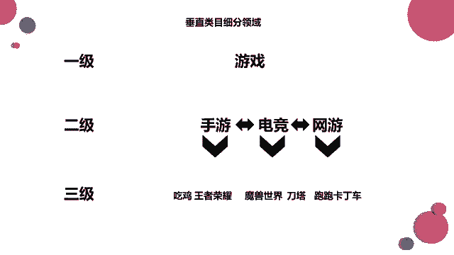
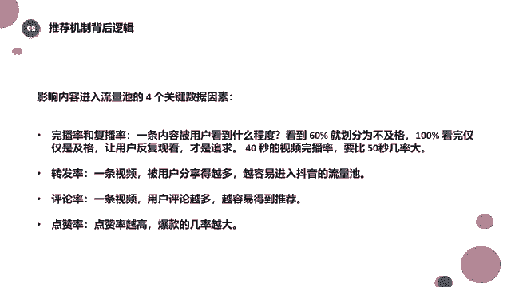

# 【99集精华版】花了3.8W买来的抖音课程！目前B站最完整的抖音运营教程，大佬亲自教学！小白记得收藏！ - P11：垂直类目细分领域 - 牛老梗 - BV1fm421E7dt

好了这一块我们就不再讲了，就简单给大家讲几个知识点，讲几个知识点哈，啊那么这个时候还想跟同学们说的是什么呢，好像说的就是刚才我们不是讲到啊，内容标签这一块嘛，就是希望同学们做东西的时候。

做视频的时候都做得比较垂直，都做的比较垂直，那么其实账号的垂直度也是有级别划分的，唉刚才在讲的时候也给大家提到过，所以这个垂直的这个分级我们来看一下，就简单的同学们举了一个例子啊。

我们经常说做账号要做垂直，那么肯定有同学捡紧紧的就想到了，我要做美食，我就一直做美食呗，我要做游戏，我就一直做游戏呗，对不对，可能就认为美食和游戏就是我们的垂直领域了，其实这个也没错。

但是这个仅仅属于一级垂直领域，那么除了一级垂直领域之外呢，我们还有二级垂直领域，一级三级垂直领域，大家可以看一下啊，我以游戏为例子，比如说我决定了我要做游戏，这个是一级的垂直领域。

如果说我只是在这个垂直领域里去做的话，那么我可以去做啊，什么呀，我做手游也可以，我做网游也可以，对不对，游戏嘛我甚至是什么线下游戏都可以，对不对，这是一个大的垂直分类啊，里面游戏多种多样对吧。

那么一级垂直分类下还有二级垂直分类，因为游戏下面有手游，有电竞，有网游，对不对，非常多，那如果你做游戏分类下的手游的话，这又是一个二级分类，那么手游里还有什么呀，有吃鸡，有王者荣耀，有什么啊。

什么DDD第五人格是吧，还有什么我的世界对吧，这些都属于手游啊，那这些游戏全都可以做，但如果你做电竞的话，可能有什么魔兽世界，Dota，什么魔兽争霸什么的，你做网游的话可能更多了什么啊，叫什么网游。

有什么网游啊，英雄联盟对吧啊，其他的我都不太清楚了啊，那这些你你做了二级分类里面里面的这些游戏，全部都可以做，然后除了二级这个这个垂直类目之外，还有一个三级，三级的话就要细分到游戏本身了。

比如说你做手游啊，你做吃鸡或者是做王者荣耀，你选择一个你的电竞，你做魔兽世界还是DOTA，你做网游，你是做跑跑卡丁车还是做这个英雄联盟，对不对，这个细致下来的划分，它分一级，二级三级。

甚至这个三级你还能再往下细分，比如说我玩吃鸡，玩吃鸡的话，我玩哪就是哪个模式，对不对，我只玩哪个模式，王者荣耀我只玩哪个模式，这是王者荣耀，我只玩哪个英雄，对不对，比如王者荣耀里我只玩那个叫谁嗯。

安琪拉，如果王者荣王者，我只玩安琪拉，那我这个啊就是叫叫什么，我这个视频，或者我这个账号里面，就是全部都是关于安琪拉的一些游戏视频，对不对，是不是啊，我玩吃鸡，我可能只去同一个，就是地图上，对不对。

那我的视频全部都是在这个地图上，或者我玩吃鸡，我只玩剧情类的，我只玩剧情类的，那我这一整个视频，或者这一整个就是账号里的视频，全部都是剧情类的对吧，这个能理解吧，所以说垂直类目的细分领域呢。

它有一级二级三级四级，其实大家啊大领域小领域都是可以去做选择的，这个也是根据你们自己来自己来决定的，大家能懂吧，所以在这里给大家补充一个小的垂直类目，这样的一个细分领域。

也有记得第一节好像第一节课上课哦，第二节上课的时候，还有同学不知道什么是垂直啊，不知道这个垂直领域的一个概念啊，所以今天稍微给大家再细化的讲一讲，因为今天有些内容也会涉及到这一部分好吧。

然后我们接着再往下讲，接着再往下讲啊，这一块呢就不用看了啊，这就是我们刚才看到的那几个数据，就不给大家再讲了，大家应该都知道了。

