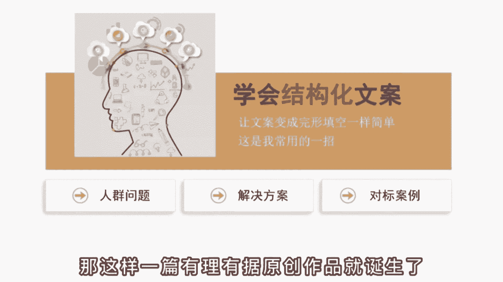
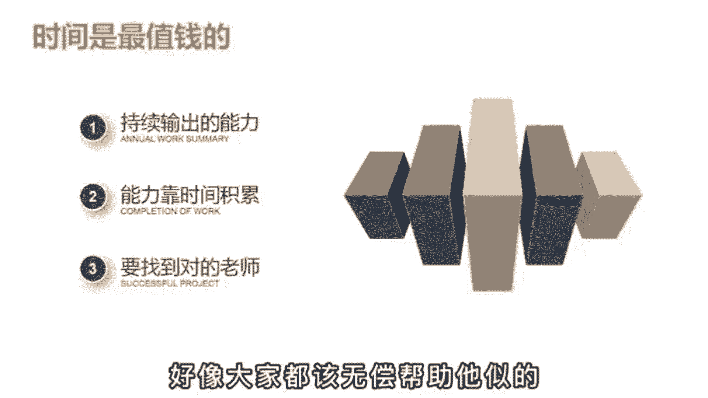

# 【99集精华版】花了3.8W买来的抖音课程！目前B站最完整的抖音运营教程，大佬亲自教学！小白记得收藏！ - P21：基础篇丨抖音的文案怎么找 - 牛老梗 - BV1fm421E7dt

说啥也不做抖音，做短视频最崩溃的就是写文案啊，群里有个伙伴刚做短视频一个月，说什么也不继续干了，天天写800字的文案稿，还没啥人看。

说自己都快成精神病了，然后呢他就问我，有没有一种输出方式可以不这么累，在自己一个人做的时候，也能保持作品的数量和质量，我说啊有是有，但是手段呢有点不值啊，我是不太推荐的，但是呢有一个大V就是靠这个办法。

积累到了上千万的粉丝，这个办法是什么呢，其实用一句话就可以说明白，任何一个图文平台出现过的10万加内容。

你都可以用短视频的形式再做一遍，什么意思呢，啊比如说你在朋友圈看到了一个10万加的文章，大家都在转发，说明这篇文中经被至少10万个人认同，而是能产生情绪共鸣的高质量内容，就比如说这个讲拼夕夕砍价的文章。

普通人呢就是满腔的愤怒，而觉得终于有人发声，给出了口恶气，然后呢你也想蹭这个热点，但是你自己说三言两语肚子就没货了，怎么办呢，哎你就去某号某呼搜索相关的话题，你用口播的形式再拍一遍就好。

要做其他领域呢是一个道理啊，比如说你觉得健身减肥是一个好的项目，赛道卖轻卡零食或者减肥代餐什么的，有搞头，但你是门外汉不懂，那这个呢还是有这个办法，那你就去找爆款文案，就这么讲，三个看的多了，说的多了。

粉丝呢也就对了，你呢也成了行业的专家。

这个呢是第一个阶段，通过转换输出的方式来帮助自己快速记考，因为曾经火过的内容已经可以在乎，那第二个阶段呢就不能这么用了，万一让人发现你都没有自己的观点，迟早口碑人设又崩溃，那这时你就得学会结构化文。

把你的文案变得像完形填空一样简单啊，比如说我常用的一个结构，一提出一个精准人群的问题，第二给出具体的解决方案，第三给出实操的对标案例，你看这不就是填空吗，当你第一阶段积累了一定的知识储备后。

第二阶段就会很好做啊，比如还是减肥这个问题，我能提出哪些问题呢，你新手健身该怎么提升计划，减肥做什么运动最有效，少吃多餐对身体有没有影响，然后你就按照1234给出具体的意见。

再给出一个已经瘦身成功的案例来佐证观点，那这样一篇有理有据的原创作品就诞生了。

那这个呢就是结构化思维的好处，很多人啊为什么做不起来账号，就是因为他肚子里没货，没有办法持续的输出，然后呢还不愿意花时间去积累啊，只想速成，那小速成呢也行对吧，你付费向有经验的老师学习。

他花时间花钱得到的经验，肯定是对你有帮助的啊，你做半年都想不通的点，可能老师的一句话你就醒过来，但有部分人啊，他自己的时间是不值钱，也不尊重别人的时间啊，我关注你，你就该为我免费解答。

不然呢我就取关威胁或者直接割韭菜。

