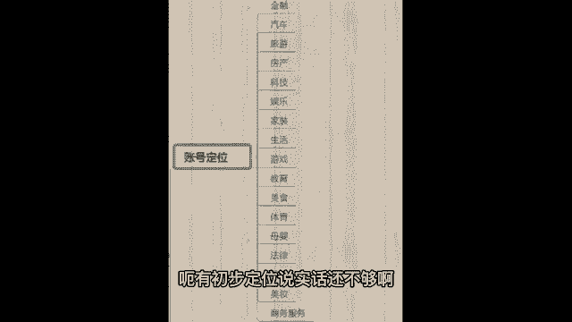
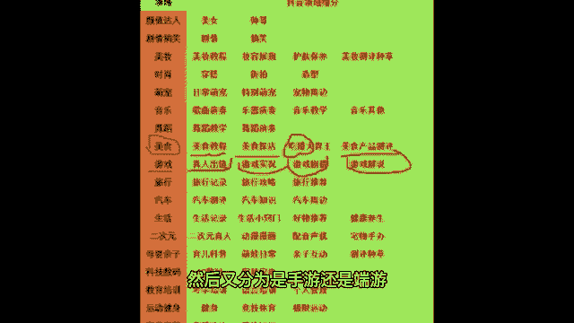
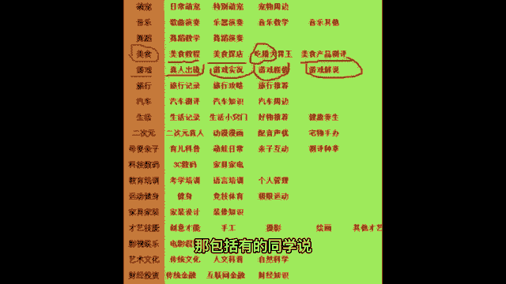
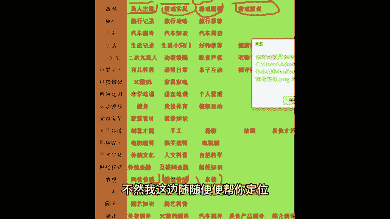

# 【99集精华版】花了3.9W买来的抖音课程！目前B站最完整的抖音运营教程，大佬亲自教学！小白记得收藏！ - P3：2、怎样定位账号 - 周处打三害 - BV1bm411z73c

那接下来我就直接教你怎么涨流量了。前面的这个前景咱们已经了解清楚了。那么我希望这个时候拿出你的笔记本，这里的干货会非常的密啊。那来想要涨流量，咱要有一个准确的账号定位，不要把咱们的抖音账号发成朋友圈了。

今天发放我美美的自拍，明天拍拍我去哪玩了，后天拍拍我干什么了，来发成朋友圈，谁喜欢看朋友喜欢看呃，陌生人可不喜欢看你的朋友圈啊。那么我们怎么找账号定位呢？

就是说围绕一个领域去做老师我把抖音的17个标签给你们展示在我的公屏上啊，来你们先浏览一下，基于自己基于你喜欢的领域，或者是你擅长的领域，或者是你想做的领域，你可以选择一个把它扣在公屏上面。

咱们肯定不可能这十几个全做呀，全做，那就不领域垂直了啊，那样不好。😡，哎，你看咱们班有同学要做美食类型了，很不错啊，哎，生活类型也不错。其他同学呢你们想选择哪个领域去做啊，房产？😊，生活美食还比较多。

游戏类型，金融嗯不错，宠物类型啊，每次看到有宠物类型的，我都觉得这个以后的视频绝对很可爱好，游戏美妆嗯。😊，好，游戏发行人口播做哪个领域的口播呀，情感口播、养生口播、育儿口播、知识口播、科普口播，对吧？

非常多。好，老师我先看到这儿啊，先给咱们同学送上一朵小鲜花，有初步定位是非常好的表现，值得表扬你们。那接着嗯有初步定位，说实话还不够啊？跟着老师一起来看一张图，我们要有一个领域细分也就是二度定位。

举个例子，咱们班刚才有同学说老师我做美食。好，美食是个大类啊，它还分为美食教程教别人做菜，美食探店探访一些好吃的店铺吃播哎，把摄像头立那吃东西也是美食，美食产品的一个测评也是美食，那你具体做哪一类。

有的同学说老师我做游戏，好，你是做那种真人出镜的游戏呢，还是做游戏实况，或者是游戏剧情，游戏解说，然后又分为是手游还是端游，对不对？哪个类型的游戏很。😊。

全啊，那包括有同学说嗯老师我看看还要做什么的呢？做情感类型的，你是做两性情感，还是做婚姻情感还是做亲情，对吧？我们要细分出来，今天我也会给8名积极互动的同学课下进行一个一对一的二度定位。

我就不在课上定位了。因为课上咱们班这么多同学，你说我一个一个定位。那这节课咱都上不下去了。呃，其次呢老师需要了解你和你沟通，我要和你通过话之后了解你的具体情况才能帮你，不然我这边随随便便帮你定位。

也是对你不负责任哈，所以你认真听课，对吧？被我记住，只有好处，没有坏处，这就是我们的一个账号定位，那么你们就围绕初步定位，刚才打在公屏上的什么家装啊、金融呀，这种游戏呀、服装啊、娱乐呀。

这是你们初步定位。😊。

