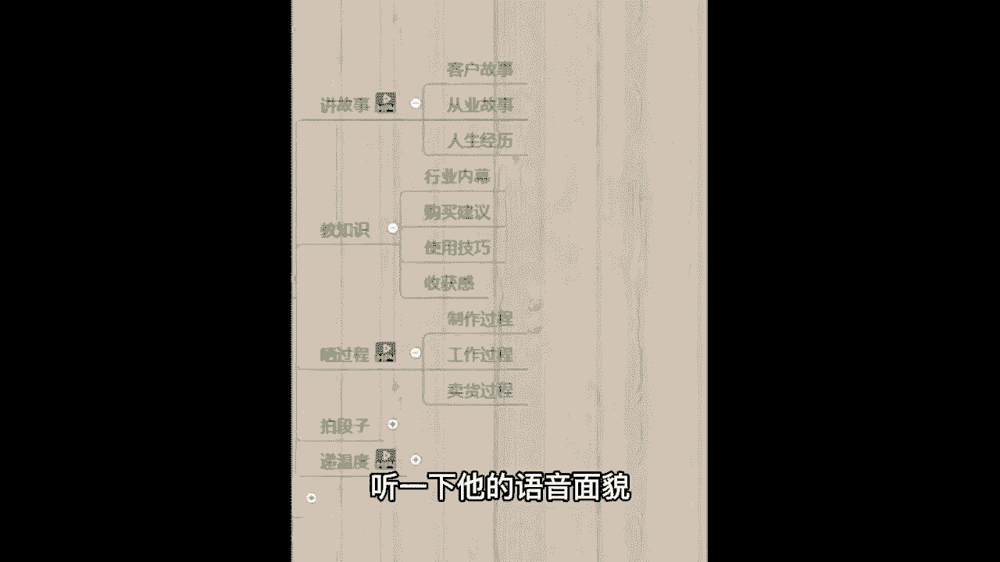
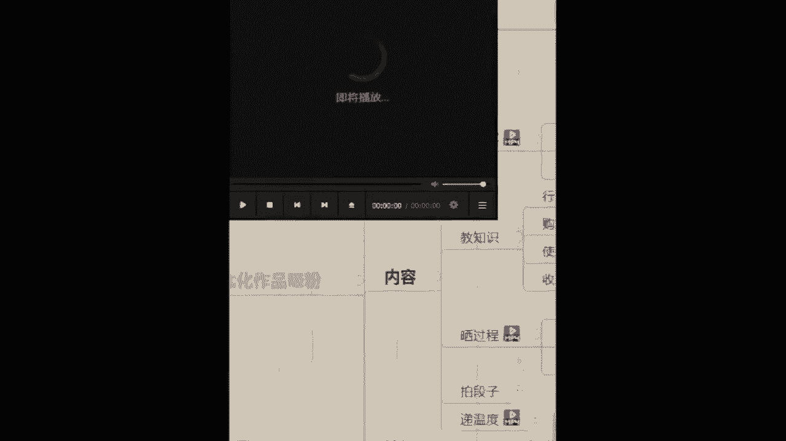
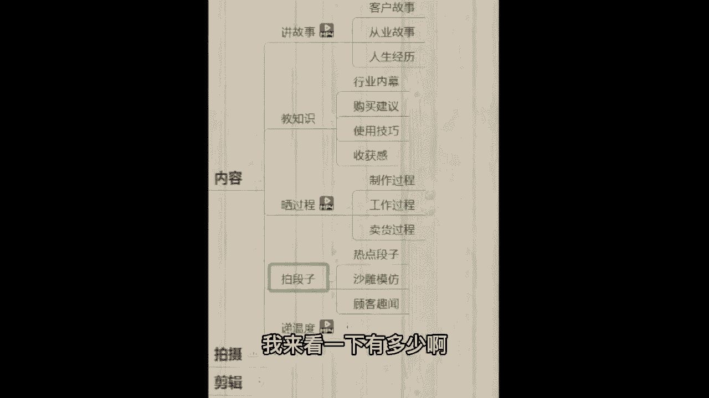
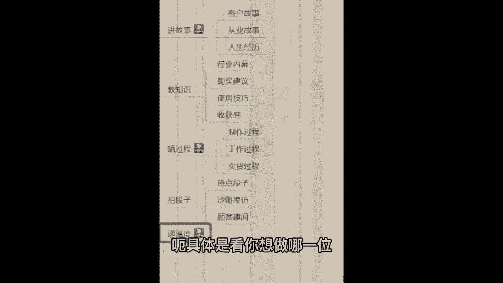

# 【B站全网最强抖音运营教程】2024最干货的抖音运营起号高阶教程 抖音短视频拍摄剪辑／涨粉／就业 直播运营从入门到实战全干货！月入3万不是梦！ - P21：14、学员分享-5 - bid白了个白b - BV1L7421R7Qa

抖音一个月能赚多少钱呢，就拿海椒举例子，他现在有122万的粉丝，我可以给你们听一下他的普通话，听一下他的语音面貌。

咱们同学可以猜一下海椒一个月能赚多少钱，在抖音上面。

Hello，微课的教育老师们，你们好，我是你们的学员，我叫梁海娇，我是去年8月21号，通过小飞老师的介绍，后来去听了阿果老师的公开课，但是我没有听阿国老师的公开课，之前我有去了解别的教育的老师的公开课。

但是我觉得他们老其他老师讲的课程都没有，阿狗老师讲的比较动心那种啊，听到阿果老师的公开课以后，就是说知道抖音他的前程，他的逆势是非常好的，后来我就抓住了这个机会，我就交了学费。

后来就9月份我就是正式上课，一边学习一边发布作品，我也是非常感谢阿果老师的指导，前期的话我是不懂得如何定位的，他也有很耐心的给我定位和后面变现方面，他也是非常有耐心的给我指导，给我解答的。

我的解答老师是加菲老师，他是非常有耐心解答我的任何一个问题，特别是前期我对这方面一点都不一点都不懂，因为我的小，我的文化只有小学六年级的文化，比如说拍视频剪辑视频这方面了，都是零基础的。

后面通过他们老师的课程，就是八一老师嘛，基础班就是八一老师讲的课，他讲的是非常好的，他讲的课程真的是呃讲的非常的详细，任何一个点子上他都会讲到，还有其他学员，当时我们也说八一老师的课讲的真的是非常好。

后面我也有我也有听过呃，晓峰老师的课程嗯，后面就通过万国老师的指导，八一老师的课程，还有张飞老师的解答，小飞老师我也平时跟他谈谈心的，前段时间一两个月前，我经常有问题，我都会去问巴依老师。

我觉得巴依老师他这个人很好，真的很好，他不是我的解答老师，大家都是很回答我的问题，这样的情况下我就把账号做起来了，目前的粉丝的话也能给我带来一份经济的收入，但是一个全职宝妈来说，这份收入已经很满足了。

嗯感谢大家，也感谢老师的指导啊，新的学员们，如果说你们看到我的视频的话，你们也要努力自己多去操作，多坚持更新作品，发布作品，微课教育老师们都是很好的，都是很负责任，很有耐心解答我们的问题的，你们放心吧。

希望你们也一样能把账号做起来。

感谢大家，拜拜电。

OK我们看完这个视频了，我给你看这个视频的目的主要是，首先第一点让你听一下海椒的普通话，另外一点猜一猜他的收入，一会儿我把这个环节讲完，在拍摄环节，带你们揭秘一下海椒的一个月收入啊。

我们直接去官方平台查，因为口说无凭，抖音就是一个行业，你只要了解这个行业，不管你多大岁数，不管你什么学历，什么文化跟这个没关系啊，接着我们往后看，拍段子来，想做类似于对口型，搞笑剧情，沙雕段子啊。

顾客趣闻的这种段子类的同学，可以公屏上给老师，我扣个一，让我来看一下有多少啊。

像嗯拍段子我还是实打实的给你看一下，比如说我有一个学员，他是干什么，他是做在工地上上班的，很辛苦啊，就是工地大家所谓的开玩笑的那种，搬砖的的确确在工地上班之前，你看他自己拍的一个播放量。

他也是直接拍搞笑的，2000多播放量，3000多，2000多播放量，后期啊通过学习之后呢，直接给老师的反馈，说老师我这播放量快要破500万了，评论涨粉还在涨，我不知道该怎么回了。

就很紧张呃，希望咱们到时候也能体会一下，播放量暴涨的一个心情啊。

那么同时呃像这种拍段子啊不难只，但是你不能说你本身自己是一个特别腼腆，特别害羞，不好意思的人，那肯定不行呃，拍这种段子就是为了让别人哈哈一笑嘛，让别人觉得有意思有趣，有这种表演成分就行了。

后期你不知道拍什么，老师会提供这个段子的素材，段子的脚本给你，这个完全是不用担心的。

