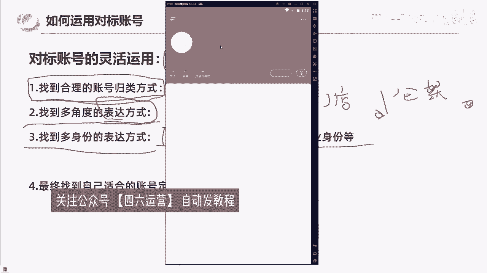
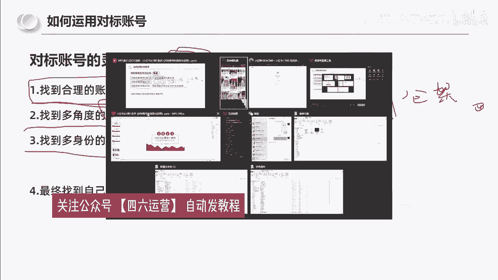

# 【B站全网最强新媒体运营教程】2024最干货的小红书运营起号高阶教程 抖音短视频拍摄剪辑／涨粉／就业 直播运营从入门到实战全干货！月入3万不是梦！ - P1 - 萝卜头不会整活 - BV12b421v78J

要说最近什么项目最火，那就必须要提到小红书电商，最近几个月，几乎整个互联网都在讨论小红书电商，我关注的几个商业博主啊，包括一些付费社群都在讨论他，我朋友圈月入五位数甚至六位数的比比皆是。

这个项目在年初的时候，我其实就让团队跟进测试，我还在市面上买了一些课程学习，到现在单人单店一个月能做个一两万块吧，今天我就用一个视频详细的给大家拆解一下，就是小红书电商到底怎么玩。

我会把整个小红书电商的流程，包括一些注意点，比如怎么开店，怎么选品，怎么做流量，一次性给大家讲清楚，你甚至都不用再去看别的相关视频和培训了啊，你就跟着我的视频去按图索骥就足够，你在这个事情上开始盈利了。

视频的结尾呢，我还会给大家准备一份资料，里面有我找的课程啊，对你运营小红书电商呢会有很大的帮助，有需要的直接去拿就可以了，言归正传啊，整个项目的逻辑啊其实也非常简单，它就三件事，第一个呢开店。

第二个选品，第三个流量，我们一个一个来讲，先说开店呃，开店其实没什么好说的，首先就是打开小红书，然后点击左上角的菜单图标。

再选择创作中心，然后点击更多服务这个选项，选择店铺，点击立即入住就可以了，你就按他官方要求的提交资料入驻就行了，我居然看到有人把小红书开店包装成一个项目，拿出来卖，居然还有不少人买，这也是很奇特。

这里跟大家说一下小红书店铺的两种形式，个人店和企业店，其中个人店有两种，分别是个人店和个体工商户店，个人店只需要身份证，加1000保证金就可以开通了，个体工商户呢还要多一个营业执照，企业店呢就多一点。

企业店有三种啊，有包括那个普通的企业店，有专卖店和旗舰店，企业店都需要营业执照，而且还要缴纳600个年费，我们刚开始运营小红书电商的时候，你直接选择个人店就可以了，我们实测下呀，企业店和个人店一样。

平台并没有对企业店有什么流量倾斜，唯一的区别是个人店你只能开一家，而一份营业执照呢，你可以开三个店，你一个店如果都没做好，你开再多的店都是没有用的，而且小红书电商啊。

我觉得是不适合店群形式去做的，这是因为小红书的流量机制，它的电商自然流占比非常低，那你铺再多的电量再多的货有什么用呢，所以只要你看到有博主跟你讲什么小红书店群，我都觉得是在扯淡，小红书是要做矩阵的哈。

但不是店铺举证，而是账号矩阵这个后面的流量获取，那里我会跟大家细说，开店的成本呢有这么几个，第一个就是1000块钱的保证金啊，不做了可以退，第二个呢是平台的扣点营业额的5%，第三个呢是支付渠道的费用。

大概每单是0。7%，第四个就是自己的流动资金啊，一开始大家做呢可以用无货源的方式去做，是对资金要求也不高，你刚开始呢准备个2000块，3000块完全够了呃，开了店以后呢，我们下一步就是选品。

我们应该在小红书上卖什么的，选品其实也简单啊，在其他平台上的爆款，大概率在小红书上也能报，目前小红书呢我是推荐三个渠道进行选品的，第一个是通过某东，某宝上面找那种小红书平台调性的爆款产品，呃。

身边有做电商的朋友，他自己在某宝的店铺卖的爆款，搬到小红书上，第一篇笔记就开始出单，第二篇笔记单量就已经破百了，第二个呢是通过某音的那个精选联盟，你在某音的精选联盟排行榜，你可以看到现阶段哪些品卖得好。

只要符合小红书用户调性的产品，直接搬运测试就可以了，第三个就是某多多的这个销量排行榜，选择适合小红书的类目排行榜，从中选择相应的爆品搬运到小红书，整个选品的逻辑就是，我们要利用市场来帮助我们选品。

而不是自己在那瞎想，我们要借助大卖家的选品能力，来弥补自己选品上的不足，所以我们只要判断一个东西啊，就是这些排行榜上的爆品，是否跟小红书的人群有匹配的可能，如果有，我就搬过来测一下对吧。

相当于是借助了别人的能力来帮我们自己选品，这样反而是最快捷，而且是最稳妥的选品方式，肯定比你瞎测成功率要高很多，然后等你这个产品上架以后呢，就到了最重要的环节了，我们应该如何获取流量。

小红书它是个种草平台，你店铺九成以上的流量都是来自你发的，发的笔记，这就是为什么我之前说小红书不要铺店群，而要做账号举证，尽可能多的发笔记耗流量，它的通路就是用户通过你的笔记，对你推的产品产生兴趣。

然后到达你的店铺完成购买，你堆一堆店铺对吧，你铺一堆店铺一个还不如多发笔记，多发几篇笔记的这个效果好，所以怎么在小红书上发笔记对吧，就是你小红书电商是否成功的关键，小红书这个平台你直接发硬广。

我觉得效果非常差对吧，本来小红书的用户群体认知就比较高，你直接发广告就没有办法获得信任的啊，更不要提转化了，你发笔记的时候一定要用一个素人的角度，你知道吧，就是用户的角度去切入。

站在用户的角度去做种草内容，而不是官方视角，这才是真正有效的呃，这种种草笔记怎么做，其实也很简单，就是去各大平台的商品评论里找，比如某音某宝，某东的商品买家秀，找到好看的素材。

你直接copy下来用嘛对吧，文案呢在买家评价上去做修改，这些买家的评价就是商品用户的使用体验，天然的适合用来做这个中考笔记，而且可以说是取之不尽了啊，然后当你单个账号的SOB跑通了是吧。

我们就可以开始举证引流了啊，通过批量上小红书账号，批量发布笔记给我们的店铺来引流来放大，那基本上整个小红书的电商的运营啊，就是我上面分享的这些，外面不管多少钱的培训啊，3000块也好，6000块。

1万块也好，其实就是这些东西，有些培训可能还没有讲清楚啊，根据上面几个点，我给大家准备了一份资料，里面包括了小红书账号起号运营的方法，以及一份小红书电商的视频课程，你如果打算经营小红书电商。

你也不用看别的东西，就跟着这份资料做足够，你开始盈利了，有需要的点赞加关注，在评论区回复红书电商，我分享给你，要有自信啊，你是最好滴，知道吗，今天我们跟大家分享的是。

小红书从0~1系列对标账号的筛选与运用，那么我接下来要讲的内容还是老规矩，都是一线的实战干货啊，我们大概预计花费一个小时跟大家做分享完毕，那么我们整个分四个板块去做一个分享，第一个是了解对标账号。

第二个呢是如何找到对标账号，第三个是如何运用对标账号，以及有效对标与无效对标，那我刚刚问了大家啊，我们怎么什么是对标账号啊，有一个人回答了，说同赛道数据好能复制的。

那这个答案是否正确呢，我们往后看啊，其实对标账号是什么啊，在我看来，对标账号其实是分狭义的理解和广义的理解，对标之后，狭义的理解就是，未来你希望做成什么样的一个账号，给自己一个参考方向。

一个前行的一个参照物，那对标账号的广义理解呢，就是只要是账号内容，能够辅佐你来做出未来运营决策的，都可以作为对标账号，只是说广义的对标账号，你可能参考借鉴的是它的一个选题，一个标题或者是他变现方式啊。

甚至引导客户添加你私欲的方式，那我们来看一个例子啊，为什么说我们要找对标账号，我们从学习美术到学习音乐啊，不管你学任何一种艺术，基本上啊临摹是第一步，我们可以看到在美术学习的这个过程中啊。

像我就是学美术出身的啊，那这个呢就是美术生可能都画过的，一个大卫的一个头像，那我们发现一个事情啊，你们觉得一号大卫，2号大卫和3号大位谁画的更好呢，123谁画的更好呢，所以我们会发现说。

当你把大卫做成当成一个对标的，一个头像去做的话，作为一个产品的话，有的人画出来是一号的样子，有的人画出来是2号的样子，有的人画出来是3号的样子，那么在这个过程中啊，在这个过程中。

每个人本身他对艺术的一种感觉，对产品的描述出来的形式就不一样，那也就意味着是什么，我们根据不同的描述，也可以选择2号，也可以学习一个3号，所以学习是最快的方式啊，那我们再往后看。

那么什么叫广义的一个对标呢，就像我们刚刚看到大卫一样啊，相同的一个大卫石膏，像不同的人画出不同的样子，那相同的产品，不同的人写出来的笔记给人的感觉也是不同的，那我们再看到偏狭义的一个对标啊。

还是一个石石膏像，但是你会发现不同的人，他的创作手法开始发生的区别，一号大卫它使用的是素描方式，2号大卫它使用的是油画方式，3号大卫它使用的是雕塑，二次创造的方式，所以相同的产品。

不同的展示方式也是不同的，那我们对账号的广义理解是什么呢，再确定一下啊，就是对标账号的管理解就是内容能够辅助做，辅助自己做出未来运营决策的，它可能是标题，可能是选题，也可能是变现方式等参考。

那像我们现在啊所看到的右边的这个图片，就是我在小红书网页版搜索芒果啊，搜索出来的一些内容，那这个图片我第一眼我就发现了它的奥秘，我不知道你们有没有感觉到，就是这一个一号内容。

这一个2号内容和这一个3号内容，它都属于数据很好的内容，一个3。7万点赞，一个4万点赞，一个3。3万点赞，而且他们表达的内容形式是一样的，就是吃芒果用什么样的一个方式是超级好用的，让我们再往后看啊。

你会发现说这三篇笔记啊，它数据都很好，而且他都只是讲用勺子吃芒果的这种方式，那我们可以看到这一篇笔记啊，3。7万的点赞，他是什么时候发布的呢，是4月19号啊，22年的4月19号。

那这一篇笔记呢右边的这篇呢，它是22年5月18号发布的啊，它的数据呢是4万的一个点赞，那我们再来看一下这一篇左边的笔记啊，是22年4月9号发布的，它是3。3万点赞，那么在这篇笔记中。

我们可以发现说他就这个作者艾特出来了，真正的原创，第一个发现这个方法的人啊，他是22年的3月20号啊，它的数据是1。2万点赞，那我们发现说一个芒果的内容啊，被一个素人他发现了。

但是被有敏锐的创作者进行了二次三次创作，拿到了不错的数据，那我们来看一下这四个人的数据结果啊，一号发现这个就第一个发出芒果，可以用勺子吃啊，用用勺子吃芒果，比切芒果切盘要更加的方便快捷的人啊。

他是38个粉丝，那么二次创作的啊，有的是138粉丝啊，有的是10万粉丝啊，有的是5。4万粉丝，所以当我把芒果的这个事情拎出来之后，你们现在能够理解什么是一个基础的，一个对标了吗。

啊芒果的这个案例就是在告诉大家，账号内容能够辅助自己做出未来的运营决策，可能是标题选题或者变现方式，那我们可以看到啊，这四篇数据都很好的，内容中原创内容的标题是吃芒果的正确方式。

那二次创造用的是终于找到芒果的正确吃法，太开心了啊，以及终于找到了芒果的正确打开方式，和吃芒果方法，超方便实用好用，请问一下这四个人，他们有借鉴，第一个原创的是芒果正确方式的这个标题吗，是没有的。

对不对，所以他们借鉴的是什么，他们借鉴的是选题，就是我们来分享用勺子吃芒果这件事情，就能获得大量的流量，所以他们借鉴了选题，那么我们再来看一下，我们切到这个网页版来看一下。

来看一下这四个账号的一个实际情况啊，实际情况我告诉大家是什么样的呢，就是真正的原创的人啊，他38个粉丝，他发了将近四五十篇笔记，但只有这一篇数据，OK而这个138粉丝的，他是属于他真的啊。

用了他看了他的笔记，他用了他的方法去吃芒果，他也觉得很好，所以他也发了，但他不是真正的内容创作者，所以他也只有138个粉丝，而右边的这两位他们是真正的做内容的啊，做创作的。

他们看懂了这些这个选题的一个数据，的一个有效性和爆发力，所以他们进行了二次创作，所以他们做到了10万粉丝5万粉丝啊，但是我想问一下大家，吃芒果的，一个用勺子吃芒果的这样的一个方式的分享。

他为什么会有这么多的点赞收藏呢，符不符合最开始跟大家说过的真诚分享，友好互动，我真诚地分享了一个吃芒果的方式，所以我拿到了观众的友好互动好，那我们再来想一下啊，我们为什么要找对标账号呢，几个点啊。

第一个点是对标账号，能够有效提供前行的参考方向，第二个对标账号的类型多样，能够更快给我们找到内容的制作方向，第三个对标账号的数据代表着市场结果，可以提取精华，第四个制作出来的内容有对比。

可以找到差距去缩小啊，就像我们前面所看到的大V1样，你有对比，你是去临摹的，有差距，你就可以去缩小这个差距，但是如果你没有一个参照物，你都不知道你画的好还是不好，那么第五个就是我们可以借鉴选题啊。

借鉴封面，借鉴优化思路的一个理解，第六个是依据对标账号的数据表现提取报点啊，这个JS我们会细细的展开。

那么右边有一幅名画啊，是小鸡吃米图，那我们可以看到啊，对标的过程中，我们还可能发现一种情况对吧，就是左边是被对标的啊，右边是我们有一些朋友啊，有一些朋友的一个结果是吧，这个就变成了什么小鸡啄米图。

我想问一下大家，这个叫有效对标吗，这个算对标吗，一个小鸡吃米图，一个小鸡啄米图，所以有对标，就能让你知道你哪个地方没有做好啊，而且大家在后面的一个字内容的创作过程中，不要轻松的觉得说啊，我做了内容。

我的标题跟他是一样的，所以我就能报，你真的看一下你的内容是不是像这两幅画一样，出现了巨大的理解差异，那为什么要去做对标呢，就是第一个啊，从抄袭到超越啊，到钞票。

那么第二个点我们来讲什么呢，讲如何找到对标账号，那么对标账的几种收集方式啊，我已经给大家罗列出来了，第一个是关键词查询法，用户名搜索结果，第二个是关键词查询法的笔记搜索结果。

第三个是通过数据软件平台筛选，第四个是跨类目对标，那么第一个啊来看就是通过关键词的查询法，这个我们一般是用到手机端啊，我们在手机输入童装中啊，我们可以看到用户这一栏啊，可以看到用户这一栏。

我们可以看到名字中包含童装的这些账号啊，可以对它的内容进行一个检索，这里我讲一个知识点啊，讲一个知识点，就是笔记数与粉丝量的对比，是账号运营能力的体现，是账号运营能力体现，我想问一下大家，A运营啊。

100篇笔记增加了1万个粉丝，B运营啊，500篇笔记增加了1万个粉丝啊，他们的目标用户都是一致的，拿到的目标都是一致，请问是A厉害还是B厉害，A厉害还是B厉害啊，我再跟大家强调一下啊，今天的知识点啊。

笔记数与粉丝量的对比是账号运营能力的体现，所以我们在研究账号的过程中，我们尽可能多去看一下，他是如何通过少量的笔记来做到更多的粉丝啊，像我对吧，我通过29篇装修笔记做到了1万粉丝。

所以我每篇笔记的增粉量在300以上，那我们接着往下去看啊，对标账号的几种方式的，第二个点是关键词查询法啊，这个我们用网页版的小红书就好了，网页版的小红书啊，在网页版的小红书搜童装。

结果它会有一排关联词的出现啊，关联词出现，那这里有春夏春款啊，公主裙连衣裙，幼儿园穿搭等等啊，它是有关联词的，自带关联词，那么通过关联词，我们可以去进一步啊，把同窗这个类目进行深化啊，像连衣裙对吧。

会出现这么多内容，像公主裙啊，又会出现公主裙的一些笔记内容，那么第三种啊，我们对标账号的一个收集方式是什么呢，是通过数据软件平台进行一个筛选，好像数据软件里他们可以筛选博主，筛选笔记。

筛选实时的一个笔记本低粉豹纹版啊，以及商品的七天15天的一个销量排行榜，这是第三种对标账号的收集方式，第四种对标的一个设计方式呢，它是跨类目的一个对标啊，我们借鉴的是标题是封面，是选题。

是运营方式甚至导流方式啊，这个我不具体展开，但是我们实际上是可以做到跨类目对标的啊，举个例子，我们看到这一篇笔记啊，它的标题是澄海玩具还比1688便宜，你敢相信吗，我想问一下大家啊，我们跨类目对标啊。

我们觉得这个标题很好的情况下，我们怎么样去写一篇母音的标题，我再把这个标题念一遍，你们去构思一下怎么样去写母婴童装的标题，打在评论区好吗，他的这个标题是澄海玩具还比1688便宜，你敢相信吗。

大家思考一下啊，我们借鉴这个标题的手法，去写一篇母音的标题啊，这一篇标题是什么，是澄海玩具，还比1688便宜，你敢相信吗，那同理，我们是不是可以把澄海玩具这个词换掉啊，认真叉叉童装啊，还比1688便宜。

你敢相信吗，比如说这个啊，第二个这个标题我们可以看到啊，这个标题是啥，是顺德本地人分享不踩雷系列啊，容桂美食篇，那如果说我们觉得这个标题很好，我们把它对标到我们的母婴账号去做，那就可以是什么。

就是不是他的他这个标题的吸引人的点在哪里，在顺德本本地人分享啊，我不是美食达人啊，我不是乱七八糟的带货博主，我是本地人，分享让人天生觉得更真诚，那我们把这个标题套进去，就变成了什么什么样的身份跟真诚呢。

比如说是童装对吧，那可能就是，童装啊或者叫童装产二代是吧，分享啊不踩雷系列，或者说10年童装人啊，分享不踩雷系列，他这个叫荣贵美食片，那我们就可以说衣服材质片啊，这也是属于跨类目的一个。

跨LIM的一个对标和借鉴，那包括像这一篇笔记啊，4000多的点赞薅羊毛啦，1688婴童服装同源工厂便宜这么多啊，所以我们通过一些对标账号，可以是同赛道对标，也可以是差异的对标。

我们都可以给自己提供一个灵感，所以对标账户能够给大家提供更多的信息，为什么我们要通过对标账号，是因为什么，是因为实际上90%的事情，其实都有人想到要怎么做了，而90%的方法都已经有人在做了。

所以你们90%问题的答案，其实都在对标账号里，我问一下大家，童装有几种卖法，通过小红书是不是可以通过店铺挂车，是不是可以通过店铺引流，是不是可以通过群营销啊，我们把群插件对吧，上次给大家讲解了。

所以说那我就看到了这个牧童妈妈童装，他都已经到第九个群了，而且有358人了，那我们是不是可以通过这个账号去加入他的群，去看他是怎么在群做成交的，同样的在陈先生童装供应链这个账号里啊，他有一篇置顶的笔记。

打开是这样的，就是这张图啊，这其实这个就是他的笔记内容，这个就是他一篇的笔记内容，这个不是他主页啊，这已经是他一篇笔记的内容，他就画了一个圈，很多人找不到我们字母加数字，这个就是我们的朋友圈。

那这是不是通过主页置顶笔记啊，导流的一种方式，所以90%的答案其实都在对标账号里，那么对标账号的使用意义啊，我们再来跟大家灌输一遍啊，接下来我们会继续让你们更深入的理解啊，第一个。

对标账号能够有效提供前行的参考方向啊，就是你的账号要怎么做，对标账的类型多样，能够更快的让我们找到制作方向，第三个对标账号的数据代表着市场结果，可以提取内容精华，第四个制作出来的内容有对比。

可以找到差距去缩小啊，第五个借鉴封面选题优化思路的理解，以及提取报点，那么综合用一句话来说啊，对标账号的使用意义是什么，对标账号的使用意义是让我们从偶然的，从偶然性的数据中找到必然性的规律。

大家把这句话打在评论上好吧，大家把这句话打到评论区，加强你们的对这个知识的一个系数啊，从偶然性数据中找到必然性规律，大家把这句话打在评论区好吗，从偶然性数据中找到必然性规律。

为什么我们要从偶然性的一个数据中去，找到必然性的规律呢，是为了抬高笔记的数据下限，抬高笔记的数据下限，我们的笔记能否获得几千点赞甚至几万点赞，甚至上10万的点赞互动，这个是需要运气的。

但是你把你的笔记下限抬到几十个点赞，是可以通过自己的运营技巧和找对标，去完全实现的，所以我们找对标是从偶然性的数据中，找到必然性的规律，从而抬高笔记的数据下限，那么对标账号的一个学习收集习惯啊。

这里我跟大家分享一下，也是我自己把29篇笔记，做到1万粉丝所在用的一个方法，第一个动作是，童装，那你们通过刚才所说的对标账号的寻找方式，找到你们觉得优秀的账号，关注他，关注它的作用是什么呢。

是你可以定时翻阅账号主页，查看是否有报文出现，趁热打铁，还记得刚刚那个芒果吗，从3月19号到4月20号到，4月20几号到5月份，连续四篇笔记全都报了，但是如果是你们去分享芒果，有多少人能想到。

从芒果的用勺子吃芒果这种体验，翻出去创作内容呢，根本想不到，但是我们如果看到了别人这样的方式，他报了，我们能不能赶紧去尝试做二次创作是可以的，所以说我们是定时翻阅账号主页，查看是否有豹纹出现，趁热打铁。

这是第一个动作啊，关注10~20个学习账号啊，定期去翻他的内容，如果他有很好的表现形式，穿衣方式，赶紧趁热打铁，第二个动作是什么，是在你们的小红书收藏里面，建立至少三个专辑文件夹。

建立三个专辑文件夹分别是什么，是标题灵感，标题灵感以及封面样式，封面样式，还有选题方向，选题方向啊，我问一下大家，你们觉得标题封面和选题这三个哪个重要，打在评论区好吗。

标题封面和选题这三个你们觉得哪个重要啊，我建议大家啊，建在自己的这个小红书的收藏夹里，建立至少三个专辑文件夹啊，分别是选题封面以及标题，因为优秀的内容数据，好的内容它本身就是市场检验出来的结果。

所以我们把好的东西的灵魂提取出来了，用在我们自己的身上，会让自己更快拿到结果，所以我们将日常刷到的笔记，有收获的进行分类就好了，不一定需要你做的类目，不一定是要你做的类目，明白吧，好那有人我看一下啊。

有60%的人认为封面重要，有20%的人认为标题重要啊，然后没有人认为选题重要啊，实际上我告诉大家啊，这三个其实都挺重要啊，都挺重要的，当然按照小红书的推流逻辑，因为它不像抖音，他推荐一篇内容。

它会自动播放，它封面是推荐四篇笔记对吧，小红书的封面是推荐四篇笔记，所以我们必须把标题和U封面优化好，人家才会点进来，在你标题和封面没有优化好之前。

那人家可能都不会打开这篇笔记了，那我们第三个我们来说什么呢，来说我们如何运用对标账号。

对标账号，对标账号的灵活运用啊，这个地方我希望跟大家去共同创作啊，那我先告诉大家什么叫对标账号，什么叫对标账号的借鉴形式，那么如何运用对标账号呢，我们要想把这个对标账号运用好。

首先我们要知道怎么去分类啊，所以我们要找到合理的账号归类方式，找到多角度的表达方式，找到多身份的表达方式，最终找到适合自己的账号定位和表达方式，那这里啊我们来以童装举例，以童装举例啊。

找到合理的账号归类方式，我能想到的啊，比如说我们是可以按照展现场景去分类的，比如说我们去搜童装或者公主裙啊，等等一系列关键词，它出现的内容，我们是不是可以给他做一个场景的分类。

这一篇内容它是在室内拍摄的，还是室外拍摄的啊，第二个我们是不是可以做第二个分类，是它是有模特的还是无模特的啊，还有什么分类方式吗，大家想一下啊，大家动动脑筋，因为你们学会怎么去梳理账号。

怎么样去搭建这个账号的分类方式，但你知道怎么分类了，你就知道怎么样去看别人报的内容，那你知道怎么样看别人报的内容，去进行有效分类，那你就知道你的内容和别人内容差在哪里，明白吗，所以我们第二个。

我们可以找到多角度的表达方式，第三个是什么，找到多身份的表达方式啊，比如说爸爸妈妈啊，这篇笔记的一个，发布这篇笔记的人是爸爸还是妈妈，还是外婆，还是爷爷啊，或者说甚至是后妈，是不是，那我想问一下大家。

如果你们去发童装的内容，你们会选择什么方式去发布呢，是我妈妈，我给孩子买了一件心爱的童装，还是说，作为后妈，我给孩子买六块九的衣服有错吗，还是说作为爷爷爷爷提前啊，孩子还没生爷爷就就已经把衣服买回来了。

你们觉得我刚刚的这三个方式哪个更吸引人啊，你们觉得我刚才三个方式，后妈给孩子买一件有六块九的衣服有错吗啊，或者说我们能不能用，用其他的身份去做这样的一件事情，大家还记得一个有趣的故事吧。

有一个这个小朋友啊，拾金不昧啊，送给了警察叔叔啊，作业是不是，所以啊不同的内容你们看到之后，创作者的身份，他们可以进行一个分类啊，账号的展现形式可以分类，同样的啊，像刚刚有人在评论区说的。

产品做成九宫格啊，进行一个拼图，那这是不是属于一个表达方式的分类呢，那我们现在啊有人说啊，我们可以通过九宫格分类，还有没有更多的方式想一下，肯定是有的，有方是一九宫格，有方是二，有方是三啊，有方是四。

九宫格，算是一种分类，对不对，那同样的，比如说我们在货架上展示货架，货架啊，以及以及戴老师说过的啊，我们去门店对不对，戴老师说过，我们直接去合适的朋友的，这个童装的门店去拍摄素材，是不是一种表达方式啊。

以及什么，甚至仓库是不是等等等等，所以你们要知道怎么样去运用对标账号，首先你们要学会分类，然后你们就会发现有的身份，有的表现形式和有的展现场景，他是天生有流量的，能理解吧，理解理解，打个理解好吗。

我打个666好吗，有收获打个666好吗，有收获打个666，我喝口水啊。

那么这个地方，我带大家啊，我们去实际运用一下怎么样去寻找到对标账号。

来啊我们先讲先讲先看一下啊，这个是手机端啊，比如说我们通过手机端搜童装啊，我们可以看到在用户端啊，我们可以看到第一个账号。

他是400篇笔记，23万粉丝，每篇大概增长了600笔记啊，这个地方我把这个屏幕给大家拉大一点，好你可以看到这个这个账号的数据啊，怎么样还可以啊，还可以啊，那么你发现没有，他用了他的这个内容啊。

有一个共性，我不知道大家发现没有，就是他的所有的内容，他的封面都加了一句话，叫富养女儿穿搭，富养女儿穿搭，看到没有好，那我问一下大家啊，这些内容的展现形式是不是不一样的对吧，这个属于什么场景。

这个属于我们来看一下什么场景啊，女儿的衣服别乱买了，这里都是整套搭配好的。

喜欢就收藏关注吧，不然刷着刷着就不见了，我的世界缤纷，这个属于室内室内模特混剪，室内模特混剪，那么这个属于什么女儿的衣服。

别乱买了，这套还加了一件什么。

室内没有模特啊，合集室内没有模特合集，好这是一个账号啊，那我想问一下大家，你们在看这个账号的过程中，你能你们能告诉我是有模特的数据好。

还是没模特的数据好吗，我带大家看一下这个账号啊，我们怎么去看账号，看一下大家啊，就是要当我们去分析一个账号，我们就要看他数据高的内容，数据高的内容啊，像他这种账号，那就以以1000大几百为单位。

这是我们看到的一篇1200点赞的内容，这是有模特的对吧，而且是亲子装啊，这里有篇4000的，这里有5000的，这个是什么啊，也是有模特的啊，而且他的标题还很重复，孩子就是要在还小的时候尽情给他打扮啊。

这里一句话，富养女儿穿搭，好这有一篇1000的，看到没有，他也用了同样的一句话，孩子就要在还小的时候尽情给他打扮，接着看我们看上千的内容啊，这个也上千了，然后这个呢就左边这个。

他是这个也是属于应该是模特没有出镜的啊，这个封面是没有出镜的，好看到没有诶，这个地方看到没有，他是不是测试了一个什么情况，他测试了用虚拟卡通人物做封面，看到没有，所以我们的出镜方式除了有人真人无人。

还有什么，还有虚拟卡通，之前有人想到过虚拟卡通形象吗，是不是，那你会发现他做了尝试，只是他的尝试结果怎么样不好啊，一个16个点赞，一个20个点赞，那我们继续往后看啊，这两篇也是一样的。

用的虚拟卡通人物100多点赞啊，七个点赞，所以从他这个数据啊，我们可以看出来虚拟卡通人物，至少他测试的结果是放弃了，那我们再看一下这篇1000多点赞的，又是属于什么，属于真人出镜对吧，真人出镜。

所以从目前这个账号的数据，我们能看出什么东西，就是他尝试了虚拟人物出境，然后虚拟人物并没有拿到很好的数据，然后他一直在用富养女儿穿搭这六个字做内容，以及什么啊，以及尝试着人物出镜和人物不出镜。

那么根据数据比较好的笔记，我们可以发现啊，像这篇4693个点赞，他也是人物出镜，所以我问一下大家，是人物出镜的数据更好，出镜数据更好还是不出镜，数据更好，出镜还是不出镜啊，把你们的答案打在评论区好吗。

像这个1450个点赞啊，是这个小朋友啊，穿着这个衣服是出境数据更好，还是不促进数据更好，出境还是不出镜啊，所以你们要通过分析对标账号去归类归类，找结果，找字的一个内容方向，同样的我想告诉大家啊。

其实这个人物他也是还有区分的，有的人物他有素人感，有的人物是模特感啊，所以也是我们可以去区分的，那这个账号我们看到这里，我们再看第二个账号啊，这个账号是13。6万粉丝啊，他总共是我看下多少篇内容啊。

这个账号叫做童妈啊，女装童装专业店415篇笔记啊，13。6万粉丝，我们来看看他的账号数据，他也是一样的，他用了富养女儿穿搭，看到没有，看到没有，大家这两家店啊，首先搜到两家店。

他们都把富养女儿穿搭放在了首页，我想问一下大家，这个是不是规律。

是不是运营的规律，他们能做到十几20万粉丝，他们每一篇都把富养女儿川大打在封面上，是不是规律，是不是规律，那我想问一下大家，你们知道富养女儿穿搭这六个字，打在这个封面上还有什么好处吗，她吸引什么人群。

他信的是舍得为孩子花钱的人群，她是舍得为孩子花钱的人群，对不对，因为我是富养女儿，我不是穷养女儿，所以他能吸引的就是舍得为孩子花钱的人群，我们可以看到它的内容啊，我们现在也在往下刷啊。

比如说我们可以看到说4000多点赞的，这一篇笔记啊，他是孩子出镜啊，然后我们再往上看啊，像这两天它是属于大人出境啊，大人出境的数据就没有上千，我们再来看这个2600点赞啊。

这个目前从封面上看没有人物出镜，这个8000点赞的看一下啊，这个是小朋友出镜，对不对，那你有没有发现一个点，就是他们的这个所谓的小朋友的模特，其实他打扮出来是有一种高级感和精致感的。

我觉得这个穿搭已经是不是传统的那种，小朋友的穿搭了，那么我们再看到右边这一篇，1212点赞的，他也是大人出镜，还是小爱出镜啊，大人出镜的数据根还是小数据更好，我们可以看到啊，这个1443。

最右边这个啊富养女儿穿搭啊，她也是富养女儿穿搭，那中间的亲子装啊，数据没有更好，所以我们可以通过别人的数据，通过他们最爆的内容去看到我们的内容方向，是双人出镜还是儿子出儿童，孩子出镜还是母亲出镜。

像这一篇699，六百九百六十九点赞的又是小朋友出镜啊，那我们是不是还可以做一个归类啊，比如说现在的三篇笔记中，这一篇它是属于一个户外场景，看到没有，他应该是在类似于一个大堂前台的地方，这样一个充电宝。

那我们是不是还可以去进行数据分析，它究竟是在户外的表现数据好，还是室内的数据表现好，就是我们是在一个随机的场景数据好，还是在一个刻意的数据好啊，你像他也在尝试看到没有，像右边这个戴眼镜的这个笔记。

它是在户外的一个停车场的场景中，啊看到没有，1619点赞啊，他是在户外的一个场景中下雪啊，他这两篇笔记你们不要看啊，你们不要看这个笔记，只看数据，只看标题，这一篇458点赞的啊，爸爸给孩子穿衣服。

和这个1619点赞的，爸爸给孩子穿衣服，我想问一下大家，爸爸给孩子穿衣服，这个动作爸爸被拍进去，他是有意的还是无意的，大家打在评论区是有意的还是无意的，我们再继续看一下啊，啊包括这个啊，大家意识到没有。

是有益的，因为在户外的环境中，爸爸给孩子穿衣服，这一张照片是比你在服装店里穿好，站在那里像模特一样拍照，是更有场景感和真实感的，所以这个运营其实我觉得它是一流的运营。

它能够捕捉到我刚才所说的分类的场景的差异，那包括这一张啊，是小朋友也是在大胆走路的一个姿势，那我想问一下大家，这个是什么区别，这个是不是动态动态封面和静态封面的区别，因为这个人物是明显拿着手机往前走。

他是没有那种刻意感的，这是一个动态图，那我们再往往往往继续看，看到没有，这个1403的这个中间的这个笔记，他是不是小朋友在等电梯的一个照片，它也是人往前走，所以这也是一个动态图，动态图啊。

包括像这两篇啊，看到没有，他又报了一篇数据很好的，2700的，他是怎么报的，他是，拿着衣服，妈妈拿着衣服，这个衣服没有挂在架子上啊，就是有一双女人的手拿着这件衣服，这是不是一种表达方式，是不是一个场景。

有人物衔接的关系，在挑衣服的关系，那么他报了一篇2790的笔记之后，他又继续拍了一篇，就是有人物在旁边准备取衣服的这个动态，所以所有的数据，好的内容都是值得你去仔细分析的，它是什么样的场景。

它是有人还是没有人啊，他配了什么样的道具，他出了手没有出手，它是静态的还是动态的啊，大家我问一下大家有没有收获。

今天有没有收获，有收获打个友好吗，有收获打个有，所以我带大家，我们实实在在的去看别人的账号，到底什么叫做对标，什么叫做对标。

那我想问一下大家，像这种啊，像这种账号我们都可以看到，这种就属于什么无模特静态在服装店内拍的，我想问一下大家，他的数据好吗，它的数据好吗，知道为什么要找对标吗，知道为什么要找对标吗。

啊包括有人提到的合集合集就一定数据好吗，啊，所以实际上有人刚刚在评论区打了一条弹幕啊，就是这个孝成啊是模仿这个同妈的啊，那实际上从运营水平来讲，同妈的这个账号的运营水平肯定是最高的，他确实有模仿的嫌疑。

但是他模仿他只模仿了一个啥，他只模仿了一个标题啊，比如说我要富养女儿穿搭，她没有真正的去把同妈的一些，所有的运营思路给理解，没有像童妈一样去做多个角度的尝试，它所有的场景基本上都是在服装店里拍摄的。

所以它有一种刻意感，而童妈她在干嘛，她一直在尝试是不是跟我当时做我的账号一样。

我不会因为说我的数据有400个点赞了哦。

我就满意了，我把我的数据拉到上千点赞，我就满意了。

不管怎么样，我们永远在尝试，永远在对标，那这些账号当它的数据不好的时候，我们是不是现在能发现原因呢，我想问一下大家，为什么这个账号的数据不好，你们能告诉我原因吗，是真的是因为他的古装风大家不喜欢吗。

啊这个账号我觉得他的产品还是非常有特色的，非常有特色的啊，基本上都是属于这种裙子啊。

基本上都是属于裙子，我想问一下大家，如果是你们这个账号是你们的，你们要怎么优化，现在脑子里有没有思路了，是不是这个人他是在把同样的一个事情啊，做了几十遍上百遍啊，就是把衣服挂在这里拍。

他是不是也会有困扰啊，为什么我的数据这么差呀，为什么我的点赞就三个四个呀啊我可能运气好，有30个点赞，看到没有，他好不容易运气好，有一瓶100个点赞了，而他的下限是多少是五。

所以我刚刚前面给大家是不是讲过，我们去找对标，是提升账号的下限，从什么，从偶然性中找到必然性，明白吗，从偶然性中去找到必然性好。

我们再继续看一下，好像这种合集账号，对不对，那我想问一下大家，这个合集账号他数据好吗，数据好吗，我们看一下啊，目前还可以啊，到这一条还可以啊，四个四个的合集啊，它的下限大概是上百张的样子。

这个是上百赞啊，300赞它是属于444张图拼图的数据，哎看到没有看到没有，这一条袜子，这一条袜子啊，它有4673个点赞，4673个点赞，在这个场景中啊，左边的这个袜子，但是我想告诉你。

这个商家的运营并没有很优秀，你们知道为什么吗。

我想问一下大家，当你有一篇笔记，能够出现4673个点赞的数据的时候，你们会想到什么操作啊，你们会想到什么操作，能告诉我吗，为什么我说这个运营啊，他并没有很优秀，他绝对不算顶级S级的运营。

我告诉大家结论啊，为什么，是因为它没有复制，你都知道这个角度有4673个点赞了，你为为什么不把这个角度，隔一段时间再发一次呢，对不对，而这篇笔记如果我们是卖袜子的，我们刷到了。

我们是不是可以收藏到我们的专辑里面，作为封面的专辑，因为他这一篇我们去分析的话，是封面吸引人还是标题吸引人，所以我告诉大家，我们找对标不是一个今天一天做完的动作，我们的对标和学习是一个持续的对错。

所以这张图片对卖袜子的账号来说，是有绝对参考意义的，如果卖袜子的刷到这篇，他一段时间内去复制，这个一定是可以把下限提到几百个点赞的，大家相信吗，好那么继续往下去看啊，诶又有意思了哦，大家发现没有。

这一篇笔记，最右边的这篇笔记，它有700多个点赞，还有700多个点赞，它是什么，它是把饰品挂到一起，我想问一下大家，这个袜子和这个饰品它有没有关联性，有没有关联性，是不是属于我们把产品挂到一六。

用一个45度角去拍摄出很多的产品，是不是有关联性，所以这是不是一个共性，我们是不是发到了一个惯性共性啊，包括他尝试的货架诶，我们发现没有，这又有一篇又一篇500个点赞的。

他是不是把这个视频放到这样的一个角度对吧，沉淀很多的情况下，是不是数据也挺好的，所以我们在分析别人的过程中，我们要找的什么，要找的是怎么样让数据好，然后可复制提升自己的一个内容下限啊，那你相信他啊。

他也不是说没有做尝试啊，看到没有，其实这一篇也是一样的，他也是一个袜子斜拍的角度，300多点赞，她也做了尝试啊，比如说母亲拿着衣服拍啊，宝宝在在这个篮子里面拍啊，是不是也是一种方式啊，甚至货架，等等啊。

所以这个运营它的优点是什么呢，他会去尝试啊，会去尝试，但是他趁热打铁啊，和这个趁势追击的这个运营思维啊，稍微差了一些，差差了一些，所以啊我告诉大家，为什么说最后啊我们是要干嘛。

我们是要找到适合自己的账号和定位，为什么我们要找到适合自己的，因为不是所有的表现形式都适合你，比如说我们看到的目前数据最好的啊，她有一个可爱的女儿，对不对，在外面去拍摄。

那如果你的孩子还是一个半个月大的baby，对不对，或者是已经是一个读高中的男孩子，你怎么去拍这样的内容，你是不是没有创作条件，对不对，那同样的有的内容它是属于拍照好看的，有的内容它是视频创作出效果的。

那如果你没有视频，那是不是不适合你，所以我们要通过种种的归类方式，和和这个角度的整理，去找到适合自己的账号定位和表达方式，能理解吧，最后你们是要找到自己的账号定位和表达方式，所以最后啊我给大家讲一下。

有效对标和无效对标，因为你们在找的过程中呢，其实有可能会踩坑的啊，因为在我接触这么多删掉的过程中，我发现了几个坑啊，第一个是什么，是他们找到一个大几10万的粉丝的账号，但是我们去看笔记的时候。

就是他这一篇，他这个账号可能就是20万点赞啊，20万赞啊，5万的粉丝看这个数据很牛逼，但是你看他的笔记，你会发现他最近的20篇笔记，可能就是五个点赞，十个点赞，那这种账号它其实是运营过早的账号。

它的积累是因为平台初期的红利，所以这种账号对你们来讲是没有对标价值的，所以我讲叫无效对标，那么第二个账号是啥，是粉丝量过大的账号，可能是平台选出来的案例账号，大家知道今年啊。

今年小红书皮呢要做直播选出来的案例，账号是谁吗，把谁打的，把这个人的名字打在公屏上好吗，所以如果你要去对标，你要尽可能跳出平台的一个案例账号，因为平台的案例账号是你没有对标意的，平台。

会用各种流量和资源去总结去帮他打起来，知道吧，第三个是啥，第三个是持续投放流量的账号，持续投放流量的账号，因为你们在刷的过程中，也有一部分笔记，右下角是有赞助标签的。

那这种账号它能带来的流量不一定是自然流，而你如果是做自然流的情况下，这种账号对你来说没有建议，如果你是打付费流，那赞助数据高的笔记肯定是对你有借鉴意义的，因为它只有这个笔记出效果。

他才会持续去投这个笔记，大家能理解吧，第四个是啥，是也是比较容易踩的一个坑啊，就是只有数据没有咨询的账号，就是在我们刚刚所看的这些账号里，其实我们可以通过他的评论区去看到，有人有没有人在下面评论。

怎么买怎么买啊，在哪买多少钱，有这些评论意味着什么，意味着观众和消费者有购买欲，如果没有，意味着这个东西只是点赞收藏高，所以不要去对标这种只有数据，没有咨询的以及什么。

以及不要去对标近期数据不稳定的账号，为什么我在抖音，对不对，曾经有一个炫劳力士表的账号，是不是很牛逼啊，导演叫小蛋，是不是枯燥无味的生活啊，那当他把运营换了之后，这个账号数据一下就下来了。

所以如果一个账号他的数据不稳定，那么你要意识到他是不是可能更换了运营，所以我们找对标啊，要先把对标账号拎出来，再反问一下自己，这个账号是有效对标还是无效对标，把无效对标的账号剔除掉。

然后找到我们的一个规律，那有效对标有什么特征呢，第一个特征是什么，是半年内数据优秀的账号，半年内数据优秀的账号，因为他3年前就已经做了10万粉了，和三个月做1万粉，那肯定是后者对你的借鉴价值更大。

因为3年前的运营方法和涨粉方式，可能更加的简单啊，第二个是粉丝增长速度快的上，好，比如说你哪怕他现在只有1000个粉丝，但是你发现他总共才发了半个月，一个星期，他七天15天就做到了1000粉丝啊。

这种也是属于有运营人才在做才能做出来的，第三个是什么，是评论区咨询量大的账号，因为如果你的目标是卖货卖货卖产品，那你就一定是要以评论区去判断，他的咨询量怎么样，是否有消费动因，那么第四个是什么。

是我刚刚所说的数据下限高的账号，因为一个账号的运营是否优秀，我会看两个指标，第一个指标就是他粉丝增长的速度对吧，比如说他是通过500篇笔记去做到1万粉丝，还是通过100篇笔记，他就能做到1万粉丝啊。

这里还记得我用了多少篇笔记吗，我用了29篇笔记做到1万粉丝啊，一个是这个水平的差异，第二个是看数据下限啊，有的账号五个点赞，十个点赞啊，500个啊，十个十个50个。

那有的账号它是三百五百一千三百五百一百，那你肯定是要去关注这种数据下限高的账号，因为你去获得几千几万个点赞是需要运气的，但是你能够稳定的获得300个点赞，这个是运营的实力在那里的明白吧。

所以再次给大家啊去讲一下，所有自媒体平台的运营，其实就是这12个字，找对标，拆爆款，多尝试要坚持，那我今天跟大家详细讲的内容是什么，是如何找对标，对不对，我们怎么样找到有效的对标。

怎么样去通过对账号的一个分类方式，去套到这个账号中，去找到数据下限高的表达方式，那么面对你们后面还有什么，还有财报款，还有多尝试以及什么，以及要坚持再牛逼的运营啊，他牛逼也是需要尝试的。

他不是把脑门一拍诶，我按这个方式拍会爆，我按那个方式拍去报，不是的，越牛逼的运营，他越会尊重这个市场的一个客观规律，为什么，因为本身小红书每天就有大几10万的笔记，新的笔记投放到市场中。

本身这个事是这个笔记它能获得上千的点赞，就已经是千里挑一的了，就相当于什么就相当于什么，就相当于说小红书它是开卷考试，就像我啊，我读书的时候，如果说你把我放在全年级第100名。

那我考试成绩就在200名以内，但是我最牛逼一次我考了全年级第59名，你们知道坐在我旁边的是谁吗，是全年级第19名，其实就是这个逻辑，小红书是开卷考试，他的这篇笔记已经在排名中拿到了好的排名。

你就要去研究它，借鉴它，所以最后呢就是我们要做坚持啊。

再坚持好，今天的分享就到这里，更多干货慢慢更新，有问题评论区见，就是大家是19年用小红书还是二零还是二，122还是23年才用小红书，还是没用，小红书可以告诉我一下，然后我针对大家的情况来决定。

说我的内容的一个速度啊，现在是08：16分啊，我们预计一个小时可以讲完，然后剩下的时间呃，我们进行一些简单的答疑，OK好有19年有二有2220223年的啊，OK好50%的人啊。

应该是用来小红书有一段时间的啊，也有刚开始用的啊，好的我大概大概清楚了一个情况，那我简单的做个自我介绍吧，呃我的我用的网名啊，叫福克斯装修笔记，是某top1电商平台的一个认证讲师。

那我应该相信大家应该也猜得到，top1是哪个电商平台啊，因为我们自己出去讲课的话，正常来说是要报备的，然后这一次呢，我们去组织咱们的这个小红书的一个淘金，互助计划呢，也是属于一个临时起意。

就觉得说市面上有很多那种噶韭菜的是吧，卖个9991299啊，包括一个chat GDP啊，卖个2000多，我们觉得反正这不是我们的风格吧，然后这一次组织啊，我们是相当于说是无组织无预谋的。

就是大家觉得说可以去给大家做一点事情，因为不管是我也好，还是戴老师也好，还是大一老师也好，我们其实三个人都是在不同的城市，而且有自己不同的公司，而且是纯实战派的呃，我上一次分享是什么时候呢。

是上一次我去带这种带队去做这种新平台研究，是20年的时候做视频号，那个时候有一个学员叫小七，他后来成为了视频号，保险行业的一个扛把子，也是非常不错的，那我跟大家分享一下，就是在我上一次。

在对20年带队的这个过程中呃，我最后的一个感受啊，就是往往能够出结果的人，是他提前就有自己的变现方式，或者说商品的人，因为他自己有变现的产品，他对自己的产品足够了解，他对这些东西呢。

就有更强的一个欲望和目标去做，但是呢针对咱们啊有一些小白的这个同学是吧，可能之前没有在电商上去卖过东西，或者说没有在自媒体去做个账号，没有赚过钱，那么对于你们而言，我说真心的啊。

我觉得就是说可以降低一下咱们的一个目标，因为我们看到的就是说现在以我为例啊，我可以用20几篇笔记做出1万粉丝的账号，这是基于我10年来的一个内容积累，就是我可以很快的去了解到一个平台，他要什么。

我可以很快的去判断这个类目能不能做，要怎么做，谁做的方式离钱更近，这都是需要基本功的，所以说接下来呢那我就不浪费时间了啊，马上进入正题啊，感觉大家进来的差不多了，那么我们今天讲的主题是。

小红书运营的一个底层逻辑，我们怎么样从0~1来做出1万粉的账号，那么先是我们来看一下啊，今天讲四个大块，第一个是了解小红书的一个平台，第二个是小红书平台的一个底层逻辑，第三个是小红书用户的一个使用逻辑。

以及我是怎么样从零起号月破百万的啊，我是大概是平均去年应该是做了将近1000万的，一个线下的成交额，那今天我会弱化这块部分，会主要跟你们讲账号和平台怎么去做，然后整个的这个内容绝对是纯一线的实战干货。

我敢说，这个东西你们在外面应该是很难很难听到的，因为大部分就是说公司比较大的话，这个老板他不会是自己一线的操盘手，他操盘有别人，而我的账号是我自己选题到内容到全流程，是我一个人独立完成的，虽然公司有人。

但是我做小红书是属于2019年，是属于先行研究，所以我是没有用任何公司资源做出来的，那我们先了解一下小红书的一个平台啊。

就是说先看一下小红书平台一个官方定位啊，这这张图是小红书官方的图片，他的描述什么是生活方式，平台和消费决策的入口，凭借真实向上，多元的社区氛围，小红书已成为年轻人不可替代的啊入口。

所以小红书给自己打的标签真实是排第一的，向上社区以及消费者绝对入口。

那这个第二个呢它是讲到了高净值，高净值人群超1亿的月活用户，70%的一线和这些一些东西，但这些数据是中间的，我们把官方的这个资料说成人话是什么意思呢，就是在目前现阶段的这个网络平台当中啊。

我们可能会刷抖音，可能会刷快手或者B站，知乎甚至微博，那我们会在这些平台上去接触很多很多的信息，那我们小红书和他们之间是发生什么关联的呢，就是因为他们从这些平台上啊，从这些平台上收获到信息之后。

他们在穿梭到小红书来进行一个研究，通过小红书进行浏览啊，然后进行一个影响决策，要么他们会在小红书进行拔草，因为小红书他自己有官方商城啊，要么他们会直接在其他的平台进行一个购买，这是小红书的一个决策时刻。

好那我就跟大家用说人话讲啊，就是小红书这个平台它到底是怎么火起来的呢，其实他是经历了抖音的一个四，将近4年的一个增长，因为抖音在它这个4年的一个野蛮生长时期，它的变现方式其实是经历过N种样式的迭代。

我不知道你们有没有人刷到过啊，最开始的抖音快手变现，他们是主播，只要有粉丝，你在直播间，你开直播就有几千几万人在线，这个时候就已经开始有商家，比如说比如说啊，比如说你们是主播。

你们的直播间有几千人上万人，而我是一个卖面膜的商家啊，我就会告诉大家，我非常非常的喜欢你，很喜欢看你的内容，我的这个面膜在天猫旗舰店卖199啊，在京东卖199，但是针对你直播间的粉丝。

我拿出几百单来做福利，只要多少钱，只要39块九，那个时候是抖音最开始的一个变现模式，就是商家直接打板，打板之后直接卖货，然后主播给这个商家挂人，我想问一下大家有经历过这个时刻的人吗。

有经历过的打个友好吗，有经历过这种卖货的吗，叫打连麦卖货，那再往后走，抖音开始推出了一个小黄车，就可以进行一个通过小黄车去购物，那这个时候他是什么玩法呢，他们就有很多的人啊，跑到这种源头的水果产地啊。

大爷大妈啊下跪说，求求大家了，我的苹果滞销啦，橘子滞销了呀，就用感情牌啊，用视频去吸引大家去下单好，但是这些东西现在是不被允许了啊，那么再往后走，像一些美妆的，他们又研究出一个什么样的一个玩法呢。

就是一次性投放上百个达人账号，比如说啊我老婆她买的那个酒酿面膜，我记得买过酒酿面膜，买个那个薏米茶，买过那个号称是协和的，美白美白的那个小瓶瓶的，后面都上新闻了啊，协和说根本他们就没出过这个产品。

那么这个操盘的打法就是，可能你通过一个博主对吧，你说这个美白能这个东西能买白，可能你不信，那OK我买通100个博主，甚至几百个博主，我让你九点钟刷视频，A说它有用，B也说它有用，C也有用，刷的越多之后。

就造成一个从众心理去进行一个收割，而这一系列下来啊，就有不少人收到货之后，他就会发现什么，就会发现自己踩坑了，然后也就开始变得谨慎，那怎么样防止大家上当呢，所以这个时候其实小红书的价值就开始体现了。

因为小红书它的定位是种草的一个分享社区，而且它的算法对普通人很友好，有大量心地善良的人在里面分享，包括面膜的使用感受啊，防晒霜的一个真实效果对比图啊等有效信息，所以小红书就相当于他为大众提供了一个产品。

好坏的一个体验的一个分享平台，你们如果片面点的去理解，也可以理解为它是一个避坑平台，但是然后又，由于前期有很多的海外购物经验分享，小红书它的前身是做海外购物分享的，积累了一批高素质高学历。

高消费能力的用户，高素质高学历，就决定了他们的语言表达会更加的客观，他们拍照的能力和展示能力都更强，所以他们给用户的感觉会比商业的博主，要更加的真诚啊，可信度更高，也就慢慢积累下一批女性用户为主的用户。

那么抖音和小红书，如果说在我的视角里，我们去做一个对比，就是抖音现在是专业的玩家居多，里面的鱼龙混杂啊，有正有正向的啊，也有玩套路的，而套玩套路的是层出不穷，而小红书呢它更倾向于普通人真诚分享的平台。

里面，信息的密度是比较大的，你可以筛选出有用的避坑指南，生活方式，所以其实就让我想到啊，就像我们以前用淘宝是吧，最开始我们在淘宝上买衣服啊，可能只需要有衣服在上面挂着，就会有人去买，那再往后诶。

商家觉得说好像好评这个东西，对消费者决策起到关键作用，那可能他们就会在好评上面啊，比如说我搞100个买家秀，自己弄100个账户去说这个衣服有多好看，穿上去效果有多好，但是消费者他也不傻呀，他发现说诶。

我买回来的衣服和好评里面的衣服不一样啊，怎么办啊，消费者就开始不看好评，我们开始看差评啊，那有的商家又变聪明了，你看差评是吧，那我就在差评里面去做文章，通过差评去让你认可我的产品品质。

比如说啊比如说一个一个一件卖一件衣服是吧，他可能说给的是一个差评，但他说虽然衣服质量还可以，价格也合适，但是配送太慢了，这个差评我给定了，像这种的语句，看似他是一个差评。

实际上它还是向你传递了用户的正向认可，所以商家和消费者他一直在博弈，而大部分人我们在抖音，如果说去买到了这种不好的商品，你去曝光，他其实拿到的流量是很有限的，而小红书这个平台不一样啊。

如果说你在上面买了什么不好的产品，不好的体验，第一素人的流量权重和大大的博主，可以说几乎没有太大的区别，第二小红书它有搜索流量，因为我们是基于什么，基于我们在某些短视频平台刷到了这个产品。

比如我刷到一个是吧，这个又刷到一个什么面膜啊，号称能够美白，那这个时候因为我之前上过当了，所以我这一次我就希望说我在小红书平台，再去搜一下，而这个时候当他搜这个面膜的时候，可能他就进来一个测评的帖子。

那测评的帖子可能就告诉他，这个面膜不如另外一个面膜啊，然后这个消费者的性质就被影响了，所以小红书，它基本上就是给我觉得片面的理解啊，就是避坑平台，它的内容就类似于说豆瓣的电影评分啊。

以及大众点评的一个美食评分一样，那虽然到今天为止啊，平台里也会有很多的素人分享，但是同时也掺杂了很多的这个商家啊冒充信息，但是这个平台整体来讲，还是非常有这个使用价值的，那小红书平台的一个底层逻辑。

就是我在做小红书平台的时候的底层逻辑，首先我们去做一个东西，一定要了解一个平台的要什么平台要的东西。

你给他，他自然就给你流量，那么我想问大家一个问题啊，假设现在你们啊是一个开淘宝开天猫旗舰店的，现在你手下有五个，有五个客服来回复这个客户的咨询，你店里有2000，现在每天有2000个咨询啊。

你会怎么去分配，是平均分配2000÷5个人，每个人平均分配400个，还是怎么分配，还是说不平均分配，你们可以告诉我吗，你们思考一个问题啊，现在你们的身份是天猫旗舰店的一个老板，你有五个客服啊。

然后有2000个客户咨询你们怎么分配是吧，这同学很配合啊，说的是平均分配这个其他的啊，其他的朋友啊也可以啊，继续去多互动，因为我知道你们的水平，就决定了我后面讲的一个东西的重点和速度啊。

有人说不理能下单呢，不会多问啊，这个兄弟你在跟我开玩笑，你一个开天猫旗舰店的，你说2000多个客户咨询，你有五个客服，你跟他跟我都不理啊，有人说按需求比例，有人说按能力分配，有人说平均分配好的。

那如果说这五个是新人的话，那基本上来说的话，第一轮肯定是先平均分配，但是你们往后走，你们会发现一个结果，就是每个人的能力是不一样的，那我们可以看到那通过一个星期的数据下来，那我们现在发现了张三。

他的成交是4000块钱，李四是3000块钱，玩五是8500块钱，赵六是6500，孙七是1000，我想问一下你们，接下来你们准备拼怎么分配呢，我相信啊，假设你们是一个老板的话。

你们是不是会希望王五能够拿到更多的客户，因为王五的销售额是8500元，他是张三对吧，和李四的double，所以这就是我们啊，假设我们开店的一个商业逻辑，那到了小红书屏呢，你们就去思考小红书平台。

其实对于小红书而言，我们他手上拿到的东西是什么，他手上拿到的是访客对吧，我们打开手就变成访客了，然后呢他手上会有多少呢，会有新增笔记，那你觉得他分配比例怎么分配呢，它就像我们去开店铺驿站。

他前期比如说我们现在同一时刻，这一分钟有500篇笔记，新到诞生了，它一定是给这500篇笔记啊，一个平均的一个初始流量值，然后通过初始流量值的一个数据表现，再次再去决定二次分配和三次分配。

所以那我就想问一下大家，第二个啊，问题就是小红书平台他最想要的东西是什么，你们有想过吗，是用户停留还是新增还是成交额，你们可以在评论区啊，可以在评论区告诉我，你们觉得小红书平台最希望要的是什么。

我来看一下啊，这道题，这道题挺有技术难度的，所有打停留的啊，停留的是正确答案，停留的是正确答案，因为我现在用的词是什么，是最希望要的是什么，为什么我告诉你用户停留是最关键的啊，因为不管是小红书也好。

抖音也好，快手也好，微信也好，他们都在干一件事情，就是要争取用户的时间，为什么，因为你后面所有的成交额，你的这个电商的变现，广告的变现都是要基于用户在使用你这个软件。

包括你们所说的用户新增新增看上去很重要，但是你要明白，但我们愿意用一个app，愿意一，新增只是早和晚的问题，如果一个app你一天只用2分钟，或者说你一个星期你都不想打开一次，你觉得这样的新增有意义吗。

所以我们就想到以前是吧，我们以前看电视的时候还记得吧，以前电视台的核心关键数据是要啥，是要收视率，对不对，收视率电视台有了收视率，他就可以去插播广告植入对吧，可以接一些大品牌的一个广告。

所以对于这种平台也好，其实不管小红书抖音，微信淘宝，他们都是希望有用户停留，有用户停留才有一切可能，那这里又有一个问题，就是我们希望用户停留，那就需要有好的内容让用户去停留下来。

但是小红书的平台它是一个机器，如何让机器去判断内容的好坏呢，啊我们都说内容为王，你们有想过没有，如何让机器去判断这个笔记的好坏呢，如何让机器去判断笔记的好坏，机器一篇笔记灌输下去，其实它是没有办法啊。

算法，机器是没有办法完全去识别出内容的好坏的，它只能通过一些数据，所以我们能够看到的，点赞收藏评论转发这四个东西，其实就是一个用户的反馈，对于机器而言，系统推荐两篇笔记啊，A笔记和B笔记各500个报关。

A笔记获得了100个点赞，B笔记获得了十个点赞，那机器就有理由判断A笔记更受用户欢迎，能理解吧，我相信你们都能理解的好，所以说整个来讲小红书平台，它其实就是基于用户停留的需求啊，用户时长的需求。

通过机器去判断你的内容是否是用户喜欢的，能够让用户留下来的，因为我们自己是不会在我们不喜欢的内容，去浪费时间的，所以那整个来讲的话，大的方向我跟大家分享一下，就是小红书平台现在有哪些红利呢。

第一个是流量红利，因为小红书目前的月活应该是两个亿左右啊，我估的，然后23年刚刚上线了网页版，这个流量红利就意味着说，如果小红书未来的月活能够在接下来23年，24年达到5亿的话，他有两倍的流量Buff。

就是你做相同的事情，它是有两倍的流量Buff，如果小红书能够到7。5到8亿的用户，用户就有三倍的buffer，是你做相同的事情，这也是为什么我会去在119年去做抖音，我们做一一抖音是19年6月份。

我做小红书是21年10月份，我永远因为作为一个老互联网人，我永远是要抢平台的前瞻视角，前这个流量加成的，所以说抖音我我们现在有在做，我们还会接下来还会去做，但是现在的抖音的流量已经见顶了。

所以我们其实早做和晚做同样的一个项目，差距不大了，没有流量红利了，那第二个点我们讲的是素人红利，就是小红书平台对于素人笔记的，其实是很友好的，而且最近小红书平台。

他把这个广告的门槛从1万粉下调到1000粉，也可以开通，这是你能感受到，他不是去捧这种大博主的一个心态，第三个叫搜索红利，就是笔记，在小红书的笔记才可以获得，长期且持续的搜索访问量。

3000小眼睛的笔记拿到100万小眼睛，这是我实际的我的后台数据，这个等下你们后面呃可以给大家看一下啊，第四个就是电商红利，小红书今年对于电商有很多的动作，类似于早期的小黄车的推出，包括最新拿到的信息。

小红书的这个本地团购也在内测了，就是你通过笔记可以直接上架，本地的一些优质商家，所以我觉得就是说对于一些小白而言啊，你这一次可以把你的目标定到，你知道怎么样去做内容，做有效的内容，然后电商这个东西。

你可以就是说你不要把自己的要求拉太高啊，在这一次因为后面还有本地团购等着你，这个你们可以看一下，我有一个习惯，就是我会统计我每一篇笔记，每一天的一个最后的一个数据，这一篇的话是截取的一个曲线。

它是从这应该是几百的播放到了9万多播放，而且这张图是我应该是去年结的，现在应该是继续往上走的，这个我没有去拿数据最好的图片，所以说小红书最牛逼的地方是什么，就是它的长尾流量是我见过最牛逼的。

长尾流量是我见过最牛逼的没有之一，包括你们可以看到右边啊，它的搜索，我的笔记，我的搜索量是77，所以都是搜索进来的，搜索进来就越精准，那么总总结一下就是小红书平台快手，他们的差异在哪里呢，快手抖音啊。

我觉得他可能更倾向于之前的优酷，土豆是用户一个欣赏观看视频的一个工具，而小红书呢，它有点类似于百度加知乎的一个结合体，我们在百度可以查到怎么去，一些比较好更深入的东西，比如说IPHONE怎么去拆机。

而小红书它有百度加知乎的一个，这种调性的一个感觉。

我们接着往后走啊，那么小红书我们要去做的话，我们了解到平台之后。

我们还要了解用户的一个使用逻辑，可以看一下这张图啊，这张图是我去研究用户的一个一个流程图，我们可以发现说小红书平台你打开之后对吧，他给你推荐的是四篇四篇笔记啊，四个封面对不对，四个封面。

那么我们的行为轨迹是不是要么你就有有兴趣，你就点进去，要么你没有兴趣就下滑了，而点进去的里面要么就是看完所有内容啊，要么你就是看完离开了，是不是，那还有第三个是什么，思考一下思考一下，动一下你们的大脑。

我们打开小红书啊，我们小红书给我们推送了四篇，四张封面，我们要么点进去看完，要么我们看完离开了，还有一个选项是什么，有没有人能够想得到啊，今天的内容你们能够动起你们的脑子，我相信会让你们。

可能是今年收获最大的一个小时，看一半啊，这个这个朋友没有名字，但是我觉得回答的很漂亮，就是还有一个选项就是没有看完，离开了，没有看完离开了，没有看完离开了啊，所以说看完所有内容之后的路径。

他又选择没有互动离开以及有互动离开，以及进入个人主页啊，以及接下来的路径，所以这是我去研究用户，其实我就是研究我们自己，那你们有没有这样的一个思维是吧，我们再往后走，那么小红书平台做账号和抖音。

它到底有什么不同呢，第一个就是我们刚才所说到的啊，它的其实是属于信息的推荐方式就已经不同了，因为抖音打开软件，它是直接推送一条内容并自动播放的，你们不感兴趣，你们就会去刷到第二条，而小红书打开软件。

它是推荐四条内容，它没有自动播放的，你们不感兴趣就直接下一条了，所以就意味着是什么，说明抖音的开头很重要，因为抖音是自动播放，而小红书的封面标题非常重要，如果你的封面标题不行，对不起我。

我一个我都不会点进去看，我直接下面四个了，所以说小红书的标面标题封面非常重要，大家现在应该能这个解，这个拆解，你们应该能意识到封面标题的非常重要性啊，那么你们去思考一下，或者说啊你们有女朋友的。

有男朋友的对吧，或者你们在同事你们去研究一下你们的同事，他在刷小红书的时候，给他四篇笔记，他是怎么样去阅读的一个顺序，他是从一看到2~3到四，还是他打开手机扫一眼直接划了，还是说打开眼扫一眼直接点了。

就我个人而言，这四篇笔记我是不会按顺序1234去看的，我是扫一眼的，扫一眼也就意味着说一秒钟的时间，四篇笔记，其实每一篇笔记连半秒都不到，所以说这个封面标题非常之重要。

那么小红书平台啊做和抖音还有一个什么区别，其实他们的账号的运营方法也是不一样的，抖音平台你们去运营一个IP，其实主要还是要去博这个系统的一个，推荐流量啊，不用想办法去破圈。

而小红书它是因为社群属性和搜索流量大，它还可以通过账户笔记为形象展示，去他人评论区吸引目标用户啊，像右边这个案例啊，是我前几天刷到的，就是这个人在这篇笔记啊，这篇笔记讲的是啥呢。

这篇笔记讲的是就是没有听妈妈的话，拿着家里的钱去开店，就压力很大啊，他就在评论区说，我也是对家里报喜不报忧，开奶茶店最多负债500万，不敢跟家里说，每次问只能说还行，因为奶茶店太卷，最后去做压。

结果没想到一年把负债还清，还把生意发展到全国，就意味着他这个其实传递了一个什么信息，一年他是负债500万，一年还清就意味着说什么，说他一年赚了500万，然后下面还有一条评论，不过你们家味道确实不错。

就是价格高，不知道是不是一样是吧，还有一个用户好评，看到没有，所以如果说我想问一下大家，如果是你们看到了这一个人，你们会不会点他的头像，会打会好吗，不会打不会，如果这篇笔记是你们刷到了。

你们会不会点他的头像去看一下，因为他负债500万啊，一年还清会对不对，那我想问一下你，你们点了他的头像，进了他的主页，和他发一篇笔记，你们看完了进他的主页，是不是达成了同样的一个目标。

就是把你吸引到了他们的主页里面去，是不是，所以这就是小红书的一个魅力，它可以通过评论区去吸引用户，不是只能够通过内容去吸引用户啊，那那也就意味着说对不对，比如说是不是就我以服装举例啊，我们用服装举例。

我们换位思考一下，假设这篇笔记他讲的不是开店亏钱的事啊，啊或者说我还是开店开店亏钱啊，就是呃找爸妈借了10万块钱啊，开开童装店啊，开不下去了，会不会小红书会不会有这样的笔记，肯定会有。

就是那些开童装店开不下去的，那么是不是可以在评论区去说，现在实实体店的东西卖那么贵，怎么可能开得下去，我在我在朋友群里买的一件小朋友的T恤，才六块九毛钱，而且跟实体店29块九的质量差不多。

谁还愿意去实体店买东西，我想问一下大家，这一句评论区有没有杀伤力，是不是你们就可以理解啊，同样的小红书他现在还干了一个什么事情，今年啊我发现他把群聊的一个这个好友数，就是一个人可以进群的上限。

已经我现在已经建到15个群了，之前我只能建五个群，现在能进15个群，那也就意味着说，它的这个玩法会更加的多样化了，包括它还可以，他还他还有一个官方页面招募群友，你建群之后，他还他还给你提醒你。

你可以发布笔记招募群友，所以这个玩法就有很多种方式了，好那我们就问，那么接下来我们的问题就来了，那我们的笔记封面如何脱颖而出呢，已经知道每次打开推荐四篇笔记，我们怎么样把封面做到超越他人呢。

尽可能高的拿到点击呢，啊这里我插一个问题啊，我插一个问题，就是平台能够给你们的，给普通人的唯一的一个数据，你们知道是啥吗，就假设啊我们200个人全部发笔记，他能够唯一给的东西是啥，你们知道吗。

它能够唯一给的东西叫这个叫报关，啥意思啊，就是把我们的笔记推送到别人的手机上面，这个动作让你的手机看到这四篇笔记，这个动作叫曝光，就是平台唯一能做的，就是让你们的笔记出现在别人的手机屏幕上面。

他只能做到这一步，他没有办法让看到你这个笔记的人点进去，他也没有办法让他点赞，所以很多时候你们的小眼睛是由什么决定的，是由你们的点击率决定的，假设平台给这四篇笔记都给1000的报关，都给1000的报关。

假设这篇笔记1000的报关里有200个人看，就会显示你们的左下角就会显示小眼睛，其实这个叫小眼睛，它是属于阅读数，但是平台给你的不止200，它可它可能给了你1000，明白吗，明白吗。

同样的这只猫它可能也给了1000个报关，但是因为这个猫比较吸引人，所以他有300个小眼睛，那就是30%的点击率，所以你的眼睛只有200，你的眼睛别人有300，不是说平台给了他300，给了你200。

而是你的点击率会影响好啊，那我告诉大家，我是怎么样去提升我的封面呢，接下来的这个方法，如果大家看了有用，就在评论区回复有用好不好，我的选择是啊，这是我的一个封面，我的选择是我做出了我的封面之后。

我把很多个封面放到一起，我把我的放上去，看我是不是最能跳出来的那一个，我把我的封面放在这个手机的示意图上，看下能不能跳出来，我把我的封面放在这四个里面，能不能跳出来，有用打有用吗，有用打有用。

因为我跟大家说了，我们这一次的三位老师全是实战派老师，我不会去跟你们说什么啊，标题的三个方法啊，这个吸引人的三个方法，我讲的就是我在用且确实有用的东西，接下来还有更多的干货啊，咱们继续啊。

大家也可以再去继续啊，咱们继续好，那么问题来了啊，就是笔记封面我们如何脱颖而出呢，啊这是我今天从网页版上啊，截图的十几个，那么画重点来了，就是在之前啊，在在今今年啊，网页版推出来之前，我们要思考的是啥。

我们要思考的是四篇笔记啊，我们要思考的是四篇笔记，我们怎么脱颖而出，但是网页版出来之后，网页版的推送是是多少，是是这样推送的，是我是黄红框里面的一个推送啊，我是把两个拼到一起了，那就意味着说美。

如果说你要考虑到小红书后面的流量，他如果是手机端进入，你是四进一，他如果是网页版刷的话，你是15进一，是不是对你的封面要求更高了，那么这一张图我为什么截给大家看啊，我想跟大家讲一个点，讲一个点。

就是以网页版的一个阅读质感，我把这个同样啊这种在备忘录打字啊，这种算很简单，一个展现形式，这一篇笔记算一号笔记，这一篇算2号笔记，这一篇算3号笔记，这一篇算4号笔记，你们认为1234里面哪一个是。

如果你们选择这种表现形式，会会认可的方式，1234你们更认可哪一种方式，二对不对，为什么，因为二不仅它的标题更加的显眼，他还画了一个红圈做视觉引导，而一是吧一的字，三的字啊都是属于字都有点看不清了。

四还好一点，在晚网页版的视角里，四个字还是比较清晰的，而二的标题更加的清晰，而且他还用了这个用了这个红色，对不对，这就是我们把就是东西好坏是怎么来的，我告诉你们封面好与坏，标题好与坏，就像什么。

就像我们给我们的对象拍照一样，你拍一张照片可能就只能拍出50分，那我们怎么样保证自己的对象，能够选出好看的照片，是不是咱上来先给他干个100张，是不是你在100张里面选，你总能选出好看的吗。

所以我们去做小红书做封面，我们两种方法，一种是我们去看100个封面，找出我们觉得好的去学习，还是我们做100个去选一个呢，肯定是看嘛，对不对，然后讲到这个服装啊，我今天还去找了一下服装的例子。

就是我们如果去研究账号啊，我们要去向有结果的人的学习，因为我已经告诉大家，标题和封面非常的重要，那什么叫有结果的人呢，我觉得第一个你要看他的数据是否稳定啊，像这个账号，他前前面的数据还是比较稳的啊。

点赞都在100以上，可能最近的流量不行，但是它能够连续几天拿到100点赞的这种账号，他其实一定是对平台有内容理解的，如果一个人对平台的内容不理解，他的数据就会变成什么，可能突然它有一条100点赞。

1000点赞的，但是再往后他无法连续，他无法连续，就是优秀的人，他的下限是更低的，就是我们没有人能够说，我一定能写出1万点赞的笔记，但是优秀的人他的下限可能就是100，但是如果说你对平台没有那么了解。

那你的笔记完全就是开概率，那这个账号它的特点在哪，因为你们要讲要可能有人会选择做服装，那我给你们简单讲一下，就是第一它的定位，它是专门研究篮球穿搭细分是吧，第二个他是小众篮球穿搭。

第二个为什么我说这个账号有用，是因为我们通过他的评论区，你去看是会有人找他要链接的啊，求第一套裤子的链接，他不是简单的说我给你点个赞吧，点个收藏，我走了，你会在评论区看到有人要要是什么。

是代表购买欲是不是好，那我还找了几篇其他的这个衣服去看啊，像这个账号也是比较有特点的，这个账号他的一个拍摄角度是非常固定的，而且他的数据也很稳定，这个账号数据也很稳定啊，然后这个账号人家更直接了。

蹲价格侠，价格侠什么意思呢，就是谁谁去了店铺，翻到了这件衣服的价格，告诉我这个直接就是考虑到价格层面的，能考虑到价格层面说明什么，说明这件衣服他已经心动了，那么我们再往后看第三个啊。

这个账号他叫野生塔塔，这个账号他也是很固定的一个商品，对不对，我们讲了，账号定位清晰，他的账号定位是什么，账号定位就是这种他这个叫什么叫JK是吧，学生日常的这种风格，然后他的目标客户也很清晰是吧。

就这种感觉很相似啊，它的效果有没有有人家会问他裙子哪家的啊，他说海胆举例子好，那接下来问题来了，其实这三个账号它的变现方式是不一样的，是不一样的，你们来看一下啊，这个人家是告他是告诉别人。

我的裙子在这家店铺买的，这个也是告诉别人我在哪里买的这个衣服，而这个呢这个是发链接谁，我先问一下大家啊，就是篮球啊和这个黑衣服和这个水手服，你们觉得这三个哪个更赚钱，或者说哪个的运营水平更高。

你们有这种感觉吗，就运营水平来讲啊，是打篮球的高还是黑衣服的高，还是水手服的高，有人说篮球啊，有人说第二个，有人说第三个，啊你们觉得篮球是吧，其实我我我讲我的个人观点啊，我讲我的个人观点。

可能我会觉得黑衣服的高一些就就变现手法，就变现手法，这个篮球它是卖衣服嘛是吧，他可能是没有上限的，但是就这个账号定位而言，就账号定位而言，我觉得黑衣服的呃段位高一点。

因为第一个它的这个数据更加的稳定是吧，篮球它是稳定稳定100加，那也就意味着黑衣服一篇是他的十篇，第二个黑衣服的这个质感更高级，单价应该也会更高一些，这是我的个人观点，我的个人观点啊。

就是黑衣服的整个调性，它就不是简单的说我要卖衣服这一件事情，本身它是我在卖衣服的这个事情里面，我去选择更高客单，更高预算更有钱的这个客户群体，而且我告诉你们，这三个账号里面有两个账号其实是有模板的。

这个水手服它就是在走，就是在出快出门的这个位置拍这个黑衣服，它就是在这个位置拍，而这个篮球它是户外，户内，包括这个停车场都拍，所以从这个拍摄的一个这个角度，和拍摄的一个成本啊。

我们可能拍一条这个成本是差不多的，但是你做篮球的这个账号，他是一直在想我今天在哪拍，明天在哪拍，而这两个剩下的黑衣服和水手服，它是有模板的，但是我只要有新衣服，我就知道在哪拍了。

而且他的这个模板是持续有数据的，这也是为什么我说黑衣服的，他这个运营水平更高，它的拍摄模板更加的明确，不用每天去抠脑袋，我明天怎么拍，它的数据更加的稳定，它的质感更加的高，至于他变现手法是挂店铺也好。

还是挂链接也好，其实他有了这个运营能力，只是他自己洗，只是看他自己想怎么玩而已，他想轻松一点，他就挂店铺啊，他想复杂一点，他觉得赚钱多是卖衣服，他其实完全可以挂链接的，他的运营能力是最高的。

那么最后啊第三个板块来讲讲，我是怎么样去起号，去月破百万的啊，这个其实是讲的是怎么样去做成交，那可能针对大家来讲，我因为我是擅长去往思域导的。

成交会讲少一点，我会讲这个账号的运营思路，然后啊总共总共我分了四个步骤，第一个步骤就是我要掌握平台的规则，我第一步一定是了解平台，第二步是什么，是获取种子，客户植入钩子啊。

让人把别人从这个网络上调到思域里来，因为我是擅长思域啊，第三个呢是做成交，那第四个是什么，是做复购，分了四步很明确的，那么我要做这四步的时候，那我要研究我自己了，我作为一个用户。

我用小红书app的原因是什么呢，那我前面给大家讲了，是避坑啊，是查资料，比如说小红书已经牛逼到什么程度，我告诉你，如果你是一个女生啊，她可以牛逼到你到长沙来游玩，你去拿几个打卡点，他都给你标出来。

他不是哪几个景点，他去拿几个打卡点，拍什么样的机位的照片好看，他都能给你标出来，所以小红书它是有价值的，有干货的，有攻略的啊，这是第一个，第二个，当你看到笔记的时候，你点进去是为什么啊，这些问题比较多。

我不一一展开，但是是我去做的时候会想的问题，那么第三个就是当你看完笔记后，你点赞收藏评论的原因是什么，我会经常问自己的，比如说我一个我比如说我给这个笔记点了个赞，我想下为什么要给我点个收藏。

我想为什么要收藏，那么再看一下数据层面啊，其实最开始的数据我是跟大家啊，我是跟大家没啥区别的，可能一开始就十个赞，20个赞，这很容易，对不对，30个赞，然后我通过我刚刚给你们看的啊。

我对封面的一个优化方法之后，我马上把数据拉到了上百的点赞收藏，上百的点赞收藏，而且是稳定的，对不对，这个158，这个190一个176，这也是也是几个月前截的图啊，现在的这些数据肯定更高了。

但是你们发现没有，我又从100多优化到了上千点赞啊，后面我就开始上千点赞了，收藏加点赞肯定是过千的，这个图都是半年前的了吧，应该至少是我做了什么，你们知道吗，我告诉大家，我就做了两个字一件事。

这个叫做迭代，就是我没有认为自己找到了100多，200多点赞的一个方法，我就觉得我很了不起，我在想办法去做得更多，所以我选择了这个方法，其实我就已经有效了，但是我又尝试了这种方法，我没有要封面。

我换了一个样式，那这个样式数据起来之后，我就继续用了数据更好的样式，那我问一下大家，你们有没有想过，为什么后面的这个会比前面会数据更高呢，你们能不能想得明白，假设你们是一个观众啊。

你现在你们现在不要当自己是一个运营，你现在就当你是个观众，为什么，你们为什么后面的这个数据会比前面的会更高，告诉大家啊，我后面我去复盘，我去分析的是，后面的比前面的这种内容含量会更高。

就是戴老师前几天说的一句话叫意图胜千言，这个封面的信息量比这个方面的信息量要大，信息量来讲的话，这个是小，这个是中，这些的信息量是大，这是密密麻麻的一个表格，所以这个信息量是最大的。

同样的还有一个问题是什么，是因为它的信息量非常之大，所以他不点进去，根本看不清，能理解吗，它可以看到标题，标题，它可以看得清净水方案，净水器啊，浴霸，但是他看不清型号，我看不清型号。

我又想知道这个东西的结果，我怎么办，我是不是要点进去，能理解吧，能理解吧，因为看不清，所以他要点进去，这是我后面复盘的，所以点赞提升的秘籍啊，我跟你说，绝对绝对只有八个字，就是真诚分享友好互动。

你们自己去看小红书的这个这个官方啊，他们有很多账号就跟你讲八个字，真诚友好分享互动啊，真诚分享友好互动，但是啊从流程上来讲，我们可以猜四个动作，分别是点赞收藏转发评论，那我想问一下大家啊。

你们知道点赞撬动点赞的秘诀是什么吗，你们知道撬动收藏的秘诀是什么吗，你们知道撬动转发的秘诀是什么，你们知道评论的秘诀是什么吗，我来告诉大家两个好不好，我跟你们说两个，你们自己带着两个回去思考。

撬动收藏的秘诀是什么，你们看一下我的这个账号啊，看一下我的账号，其实有一个特征是收藏比点赞高的，你看这篇笔记啊，6800的点收藏，6300的这个点赞，包括像这篇啊1300的收藏，六六百六的点赞。

基本上你们随便看1900的点赞，3100的收藏，你看到今天啊我的数据优化结果是什么样的，是我的数据结果是这样子的，就是你可以看到我快速的从上百个点赞收藏，优化到大几百，直到全部接近，很多都是上千的数据。

像这一篇啊，4400的点赞，9500的收藏，你们知道收藏的秘诀是什么吗，我告诉大家收藏的秘诀是我想问大家一个问题，两个选项A啊，A拍一个视频是他做饭的一个过程，比如说他做了一道长沙的特色菜啊。

茶茶这菜是啥呢，这个茶茶有茶色菜，我一下子没想明白啊，我想一下啊，比如说剁椒鱼头吧，香菜啊，他A做拍了一个剁椒鱼头的制作过程给你们，拍了一个剁椒鱼头的制作过程加菜谱，你们觉得这两个是过程的。

收那个点收藏的人多，还是有菜谱的，好我告诉大家一定是过程加菜谱的人多，为啥因为制作过程我看一遍，我记住了，所以这个视频跟我以后没有关系啦，但是这个菜谱它可能有多少克啊，他有更精确的一个东西。

所以说我们会有一部分人他去收藏这个菜谱，能理解吧，所以就是说你的信息量，是他当时那条视频无法消化完的，所以他就要收藏，如果说这个东西他当时消耗完了，对不起，他就没有收藏的必要了，听懂掌声好不好。

听懂打个掌声好不好，再讲一遍啊，你的内容如果是他看完他就知道的，比如说啊，我今天告诉你怎么在支付宝上领五块钱红包，他看完他就知道的，他不会再给你收藏了，他跟你说拜拜了，你的内容是啥。

你是支付宝一个月有五次领取红包的机会，这种东西人家就收藏了，为啥因为他一天他记不住啊，所以他就他觉得收藏，所以收藏最后是干嘛，最后是吃灰的，但是你们就要把握收藏是怎么来的，是他单条视频他觉得有用。

他又记不住，消化不掉，所以他要放到收藏夹里去，收藏的秘密，讲完了我再给你们讲评论的事啊，我们刚才讲了撬动评论，我给你看一个我做的一个案例啊，这篇笔记，我置顶了一条评论啊，我这篇笔记什么时候发的。

是2021年11月份发的，2021年11月份发的，那么在2022年3月，我置顶了一条评论，是有一个观众他看了我的笔记，然后他在说我买的这个锅炉啊出现了问题，商家不负责任，品牌不负责任啊。

那你看我的回复是什么，我的回复是我帮你置顶，希望后面的姐妹能帮忙顶一下，争取厂家早日帮忙处理，所以你们可以看到这一篇笔记，他的这一条的点赞有300多，剩下的只有30多，我想问一下大家。

数据是不是就拉动了，那我是不是也是在真诚的帮助别人，因为我这篇笔记每天有三四千的访问量，因为我会统计数据，所以我在真诚的帮助他，那么其他的人看到了也愿意帮助他，所以他们给他评论点赞。

这是不是拉动了数据来，我们再来看一条，再来看一条啊，像这一篇4800的点赞，7900的收藏，这一篇有多少评论呢，有1200条评论是啥呢，是这一条是这一条评论，我在22年7月份的时候，我21年发的比较。

我在22年7月份的时候，我发了一条，就是说我家装修延期了，我家装修延期了，然后如果大家希望知道后面哪一台洗烘套装，性价比高的话，你们可以留言，我收到再回复，为什么我会这么去说这一句话。

是因为我发现我发了这一条之后，有很多人在下面评论说蹲洗衣机，蹲洗衣机，所以我把那条评论置顶了，所以如果你们可以看到他，有大量的人在下面就评论一个字，就是蹲，因为我跟他们说什么。

我说你们想知道我最后买了什么，你们就在我评论区回复一个蹲对吧，你们评论了我就我就告诉你，所以我后面啊也是做到了，是不是他们问我，我就告诉他们了，那我问一下大家，如果我不去把评论区，我不去做这个动作是吧。

我啥也不说话，他们会在评论区去打蹲吗，我这一条笔记1200个评论蹲应该有三四百，这是不是拉动评论区的数据，能理解吧，还有其他的啊，还有其他的一些细节，我就不一一展开举例了，我们继续去讲，所以到第二步啊。

就是第二步是啥了，就是我们通过我们的内容是不是获得了报关，我们怎么样去获取这个客户啊，第一步是获得笔记和获取报关，第二步是获取我们的目标用户，去添加我们的微信啊，因为我是思域玩法，我下面讲的思域玩法。

但是同样的原理是一样的，比如说我做私域的玩法，我思考的就是当被一篇笔记，被人家被吸引了之后啊，他什么情况会进入主页成分多，然后什么样的内容跟账号，人家会认为不可信，不靠谱啊。

什么样的情况你会希望和作者取得联系啊，这些问题都是在我做的过程中，我就会反推的，我会我会自己代入，就比如说我看了十篇笔记，由谁是我想关注的，有谁是，我一看这个账号，我就觉得这个人靠谱可信。

有谁的账号是我一看，我就觉得这个人有可能是个骗子，不能信，像刚刚那个我问一下大家啊，你们觉得刚刚那个卖鸭脖的还记得吧，前面那个搞加加盟的，在别人评论区说，自己从负债500万到赚了500万的。

你们觉得那个人是好人还是马扁，告诉我好不好，前面那个卖鸭脖的，你们觉得他是好人还是马扁，他说他自己负债500万，一年赚回来，他是好人还是马鞭，啊你们说的是麻痹是吧，为啥呢，因为。

因为第一这个数据太浮夸了，第二它的主页内容就是搞加盟的，加盟这个东西马扁的概率很大，是不是，所以你们就会感觉说你是会想看，但是他这种东西吧，其实对对一些有过认知的人，或者说清楚加盟套路的人。

是会让他觉得不可靠的好，那我们再往后思考，就是什么样的情况让你加微信，你也不会加，以及私信加微信领取资料和主页，网盘置顶放资料，你们会如何取舍，哎其实这个其实这个问题啊。

和这个和这个和这个戴老师他的操作是一样的，如果你们当时你们有没有想过啊，如果当时你们通过他的抖音账号，进了他的粉丝群，他说你们要加个人微信才能发资料，你们一定是有一些人不会去加他的，那戴老师是怎么做的。

他是你们进群，他把链接二维码对吧，发到群里面了，然后只相当于直接把资料给你们了，所以有的时候你会发现说强制别人加微信，再给资料和你只要进去我就给你，我没有说我要强制链接。

你的意思是不是后者更加让人家能够看到真诚，是不是，同样的，你们又可以带着这个思维往后面去思考，什么样的情况，你去看小红书笔记的时候，你看着看着你会打开淘宝店，去搜索店铺或者关键词。

是不是有人有有人说他是真不想加人，是不是，所以就是我们要思考的轨迹是什么，我们要思考的轨迹是人心，要思考的轨迹是人心，而不是套路，因为戴老师是真心对你们的，他压根就没想加你们。

他就是觉得说我知道小红书怎么做的，我想分享他分享了诶，我有一些资料我可以整理给你们，我给你们了对吧，我想去带一群人去尝试做小红书这个事情，那么谁愿意来谁就来，所以他是真心的，所以我们今天会相遇，在这里。

所以那到我这后面你要做私域的话，你还会遇到什么问题，就是那你加了人之后，你怎么做好友管理，对不对，你要不要建群，群里面的人谁是值得帮助的，每个人的想法都是不一样的，就即便是咱们的100多个人群，对不对。

你会发现有人有不同的价值观的，同样的一个群，他的利和弊是什么啊，微信群邀请好友拒绝还是通过这些，就是我在做这件事，做这个事情的过程中会经常思考的问题，我之所以能思考出答案，能做出答案。

是因为我先把这些逻辑想明白，想明白之后再决定我要怎么去做，然后我再问大家一个问题啊，这三个问题会跟大家相关，精准的用户推给商家没有成交，是谁的问题，是用户的问题还是商家的问题，还是博主的问题。

博主把精准的用户推给商家，没有成交，是谁的问题，你们能弄明白吗，没错啊，是商家的问题，这里我给大家分享一个事情，就是我在最开始去做这个模跑模型的时候啊，就是首先啊我这个装修的过程中，我所添加的粉丝。

我是真诚的对他们的，所以我在做的事情是帮他们出，找到好的产品去压了价格，去给他们做成交，并且我跟他们讲的很明确，我自己的成交价你不要问我，我肯定比你低，但是我做到一点，我不赚你们的钱。

就是比如说这个市场这个事情，这个东西人家商家正价卖1万啊，我可以帮你们谈到九千五九千，但是你不要问我是多少钱买的，因为我也不想骗你，所以我对他们也是真心的，那这个地方我想跟大家分享一个什么事。

就是说精准的用户给到商家没有成交，是商家的问题啊，这个大家答案都是对的，那我也不再去展开，所以如果说你们在小红书拿到了精准的流量，你挂了产品没有成交，那就一定是产品的问题，明白吧啊以及我还会去思考。

那装修时我们喜欢的东西，跟我们想花钱买的东西有什么区别，这句话翻译一下是啥，翻译一下，就是比如说我们现在去逛商场，去买衣服，买鞋子，我们最后买回来的是我们最喜欢的那一件吗，同学们。

很多时候不是因为我们最喜欢的衣服，可能你一摸一看吊牌1500，一双鞋子，你一看1200，但是我们其实是带着预算去买东西的，可能我最喜欢的是1200，但是我看了有一双鞋只要六七百，他在我的预算内。

所以我会选择买预算范围内的，是不是，所以我会深刻地去研究说我搞装修的过程中，我到底看中了什么，我买了什么，为什么，那为什么我要去思考，因为我要做的是用户成交，不是所有看上的就一定会买。

而我要研究的是成交了什么东西，为什么会成交，而那些容易被别人看上的喜欢的，而又成交率很低的，那对我而言就不是好的商品，那还有一个问题啊，就是装修用户想花钱买产品，那为什么要在我推荐的商务这里买呢。

这是不是跟你们的问题有点像，小红书的用户在小红书刷笔记，不是只有你们在挂车，为什么要在你们的笔记下面买呢，这个逻辑你们是要想明白的，所以我想的很明白，我告诉我粉丝群的人，我帮你们找的是好产品。

而且我把找产品的这个过程我有告诉他们，比如说我星期一到哪里看到什么东西，我发给他发到群里，星期二我看了什么发到群里，星期三我发的什么发到群里，然后我告诉大家我选哪一个，以及我能拿到的价格是多少。

所以我不是说因为装修啊，跟你们卖的这些东西都不一样，它是一个非常高客单，而且非常复杂的东西，所以我会把整个的这个选品的过程，去分享给他们，然后会明确的告诉他们，这个东西A比B比C的东西，它好在哪。

差在哪，然后再去告诉大家，我为什么买A然后价格是多少，所以在这个过程中啊，像成交的突破，其实对我来说就已经很简单了啊，像这一个粉丝的话，他基本上他家里，这个这个这个这个啊这个应该是五六个东西。

跟着我一起买了四个东西，在我看来他是很赚的，因为他没有花任何的时间，我跑油都不知道跑了多少箱油，而且还没赚钱，他还买的比市场价低，而且这个事情我能做成，其实我还是完成了小红书的这个调性，就是真诚分享。

我是真诚的在做事情，我没有说我是因为谁给的佣金高，所以我就帮谁卖，我一定是找到好的东西，然后去告诉他们啊，这个包括这个成交也是一样的啊，这里啊跟大家讲一个细节，就是当我在21年10月份启动账号的时候。

到22年4月份啊，我整个这个这张图，这个PPT是去年4月份那个年年审过的，下个月呃呃5月18号要去杭州，是第3年了，那个讲师的认证，我在2月份的时候成交了20万，我在3月份的时候成交了170万。

4月份成交118万，这个数据我觉得不重要，重要的我觉得是这个玩意，这玩意为什么我要在4月份的时候去开，我前面的成交证明，你们能想到吗，就是当我有了成交之后，我为什么要在swift的时候去开成交证明。

你们能明白能理解吗，大家思考一下，为什么我会在4月份的时候去开一个成交证明，因为我要借力打力，这个其实跟你们做小红书也好，跟你们以后做任何东西都是有关联的，什么意思，其实真正的山寨不是说你拿很多的钱。

你拿很好的资源去跟别人去拼，真正的商战是什么，我们作为小白起家的，我们作为小白起家的人，包括你们，你们要在这个互联网上去赚到钱，你们往往是以小博大，你们是田忌赛马，要在局部劣势中去战。

去产生战争的一个赢家，讲人话就是你要在你没有就商家是什么，它可能是你1万单，我给你多少价，你5000单我给你多少价对吧，比如说我们去辛巴买榴莲是吧，你能拿100吨，我给你多少钱一斤。

比如说给你二十五一斤，你只有一一千单，那我给你28，你只有100单，我给你31斤，是不是这样的，那真正的山寨，你们要掌握到我如何只有100单的情况下，我要争取到他给我1万单的价格，为什么要这样子。

因为你只有把价格压低了，你有利润空间了，像你们做电商，你有利润空间了，你人做人做事的动力是跟你赚多少钱有关系的，你你一个月下来，你上班赚3000，你做小红书赚1000，你第二个月没动力了。

你一个月赚3000，你做小红书一个月赚5000，你这个月嗷嗷的，所以说真正的商战是你在用小资源的情况下，去撬动商家的好政策，所以说我去开这个证明，是要给后面的商家看的，我已经做到这个成绩。

你的这个东西我预估我能做几百万，你干不干，所以说我这个门窗的价格是怎么谈的，我上来我就跟他说，我1000个平方，你能做什么价，我说我家有几套别墅，1000个平板，你给我什么价啊，他就给我一个价格。

我说我告诉你，我没有两套别墅，我只有30个平方，但是我有一个小红书账号，你相信我按这个价格给我，我给你再找啊，970个平方，然后给他做到了，所以这其实是跟大家穿插了一个。

真正的你在落地过程中的一个商业经验，那你们去做这个小红书是不是一样的，是不是可以拿到自己的一个基础的成交，再去网上去做，那包括思域的复购怎么去做，是不是怎么去做复利增程，我去看工地对吧。

两款瓷砖一和二就是大家会在一和二之间抉择，你可以理解为两个口红的颜色，我会去拍两个照片去分享给别人，所以人家会把我的内容分享给他妈妈看啊，把他的同事啊分享分享给，包括我看的东西。

我都会做很多的东西去分享给他们，就是真诚分享，友好互动，那么最后总结一下啊，就是我觉得作为电商商家，一个小红书的一个破冰流程呢，你们要明确内容是有区别的，有的内容是吸引眼球的，有的内容是调动思维的。

有的内容是有下单欲望的，这是三种不同的内容，我们到网页上看一下，好吧。

给大家看一下啊，客户怎么来的，给大家展开一下吧，这篇笔记，这篇笔记就加了200号人来给你们看一下。

怎么带你们看一下，记得啊，内容的三种形式，内容是有吸引眼球的，调动思维的和有下单欲的，如果说你的目标是去卖货，那你就要做有下单欲的内容。

来我们看一下啊，来问你们吧，像这种是吸引眼球，这个茅台是吸引眼球的还是调动思维的，还是下单预的。

这个茅台他就两瓶茅台是吧，啥也没写，然后有互动，有数据，这种属于吸引眼球，下单月还是调动思维啊，眼球是吧。

眼球思维下单这个吸引眼球的好。

这个呢2。4万拿下20件家具，这个是眼球思维还是下单月，下单吗，我想问一下大家，这个地方哪里有下单，哪里有下单，你假设你是一个读者，你从他的评论区看，哪有别人想找他下单的这个欲望，没有的，有思维。

就是人家会去看它里面的东西，有字啊，比如说618双11的购买时间，但是没有找他下单的，是不是他的评论区，你们可以看吗，没有没有人找他买，这个是思维，这个是没有下单的。

就是用户对于这个作者来说是没有下单的，这个啥眼球思维下单月。

给他找一个找一个这个有下单欲的，啊啊这种这种这个这个是啥，眼球思维下单域，这个啊第一次退茶位费成功结算，这个是眼球思维，下单月，这个是思维啊，思维就是如果你们看了这篇笔记之后。

你们会去思考他的这个东西做法对不对，然后这个做法你有没有必要学，你学了有没有用，这个是思维，来我们要找到有下单欲的东西，因为你们要卖东西，你们要知道什么叫下单玉。

如果这个东西都没有下单欲，你做了之后他没有成交，那太正常了。

看我吧。

告诉你们什么叫下单预，随便看，眼球四位下单月能看见这个小字吗，我只想知道结论，长沙买哪家，我只想知道哪里可以安装，同长沙，求推荐，求推荐求推荐求推荐，求推荐，已关注，求推荐，求推荐，求推荐，求分享。

求推荐，求推荐，求推荐，再看这一篇，我只想知道结论，长沙买哪家啊，这是同一篇，看这一篇好吧，我主同长沙，麻烦拉我进群，你选好了吗，选哪家，我看吐了，拿不定主意，同长沙，想进群求笔记，再给你们看一下啊。

这一篇求推荐求推荐求推荐啊。

所以你们要有意识的去区分吸引眼球，调动思维和下单玉，如果说你们赚的钱，你们是要赚陌生人的钱，那你们就是下单预，如果说你们想赚粉丝的钱，那么你们需要有调动思维能力和有效单月，然后接下来你们还要干嘛。

你们还要明确学习的账号，明确运营的方向和明确运营的结果，还记得我给你们看的三个卖衣服的吧，如果不管你们自己要做什么，其实就是四句话，找对标，拆爆款，多尝试，要坚持这12句话，我做任何一个平台。

其实就是靠这12个字，先找对标装修就研究装修水果，研究水果衣服，研究衣服视频，研究视频拆爆款，你要去去猜到别人的这个东西为什么会爆啊，这个东西，反正后面还会有老师去分享具体的东西，但是你知道就这四个是。

第三个是多尝试，第四个是要坚持，然后我想问一下，大家告诉我你们这一次的目标是什么好吗，做出一篇100点赞的笔记，是你们这次的目标，你是小白，你就评论100点赞，如果是1000点赞就评论1000点赞啊。

你们的目标就是，只要做出一篇这样数据的笔记就行了，如果你们的目标是做出100粉丝的账号，就打100粉丝，1000粉丝就打1000粉丝，做100成交就打100成交，1000成交就做1000成交。

100利润就打100利润，1000利润就打1000利润，大家定下自己的目标好吧，看一下大家的目标啊，大家都给自己定一下目标，我看一下你们的目标，然后也给后面的这个分享啊，来确定大家的一个，翻一下嗯。

好的好的，你们打着啊，因为我到时候会去把这个数据啊，我会去分析一下，这个尽量啊去帮助大家达到自己的一个目标，好吧好吧，然后希望大家知道龟兔赛跑赢的不是兔子，是龟，有的人他很聪明。

但是他可能觉得说这个事情对他来讲太简单了，他不愿意去做，反而真正出结果的人是坚持不断迭代，往后走的人好，接下来问答环节，大家有问题就提问啊，我讲了75分钟，稍微差了点时，大家有问题的提问啊，有人问啊。

怎么让人关注涨粉啊，这个问题就是说，但你的内容是对别人有价值的时候，其实这么理解吧，这么理解我这个问题我怎么回答你啊，你的问题是怎么让人关注涨粉，你打开你的小红书，打开你的小红书，打开你的关注列表。

你扪心自问，你问你自己，你为什么要关注他，再看第二个人，你为什么要关注他，再看第三个人，你为什么要关注他，你把列表分析完，分析你自己心里会有答案，第二个是一天几篇笔记发布，这个看你自己。

看你自己就是内容的发布数量啊，我觉得这个没有固定的一个要求的，你像我如果去写这种原创内容，我基本上我真的三四天三四天我才能干，一边出来，这个自己把控就好了，啊有人说做了一个多月，出了三单全退了就暂停了。

这就是我后面说的嘛，要尝试，其实很多时候你能够出三单，其实就已经代表着你对产品，对内容是比不脱单的人要强的，这个时候那你要去找这个问题在哪，出三单，退三单是什么原因造成的。

就我你可以看到我做这个事情全流程的过程中，我问了自己很多的问题，每个问题我心里都有答案，啊黑梦问怎么让人产生互动性，互动性，我刚刚你你如果后面来的，你看一下回放吧，我大概在五六十分的时候。

我拿我的账号说了，怎么样去调动收藏，调动评论互动，什么互动就是点赞收藏评论转发收藏和评论，我都已经给你们看了，实际我是怎么做的，啊有人说我开店一周，现在每天还有十几20个的赞，浏览量也是有个几百个。

但是一直不出单，不知道该不该换屏，这个你就是你要去看具体的东西啊，你这个我没有看到具体的笔记，具体的商品我没办法判断，你也要去查你的这个类目，你不出单，究竟是你的价格比别人卖的都高。

还是说就是说你先确定你的产品有没有问题，如果你看了小红书，同样的产品，你觉得你的质量比他好，或者说相同质量你的价格比它就是合适一点，或者说价格也差不多，你觉得你的产品没问题的情况下。

那你再把你的这个曝光和笔记内容放大一点，啊有人问做人设带的产品必须是一个行业吗，我这么回答你这个问题，对于这个东西啊，我这么回答，你看你这个人的销售能力有多强，销售的最高境界是别人相信他这个人。

不管他卖什么产品都会去买，你就想一个道理了，不管是罗永浩也好，还是董宇辉也好，没有说他只能卖一种产品的，销售的最高境界是卖人，卖产品是前期，啊有人说我们卖水果怎么有那么多内容找对标，你在小红书。

你去搜产品也好，搜水果也好，收这个方式也好，其实你们去他是有无限种方法的，包括助理今天在群里买了，你卖水果，你只能去发水果吗，可不可以，假设我是一个开水果店的，我可不可以发我的就是说创业日记啊。

我开了一个店，今天卖了多少单，明天卖了多少单，可不可以发创业日记，我可不可以用另外一种形式，一种心态啊，就是不要把思维局限在啊，我是卖香蕉的，我就天天拍香蕉，天天拍香蕉，你去小红书搜一下香蕉。

你看下什么样的东西有下单欲，只要是有下单域的内容，都是你可以研究的内容，刚开始小眼睛数多少是正常的，个人理解，个人理解，小眼睛，我觉得你新发一篇内容，200左右的小眼睛是正常的。

如果说你的东西你一发只有100个小眼睛，然后你接着发几篇都只有100个甚至40个，50个，我的经验啊，是这个账号的权重是比普通账号要低的，我会建议你直接注销，重新注册，因为我曾经有一个后面有一个账号。

就是这样子搞了，搞了两次，就是一发就是100个，50个，60个，我注销重发，注销重发，我第三次我发一篇，就在就拍了个窗户，200个小眼睛之后，我再发同样的内容，那篇笔记点赞加收藏就过百了。

好有人说怎样找到适合自己的对标账号，我觉得你们去思考对标账号啊，第一个是要思考几个问题，第一个是这个账号它是否能够达到你的目标，你的目标，如果我就是100个点赞或者说100个粉丝。

那只要他能够内容能够吸粉，能够有人互动，那就已经是属于你能够借鉴的对标账号了，如果你的内容是希望卖掉东西的，那你就一定要找有下单欲的账号，下单预可以从评论区可以看出来，有下单预的账号里找到之后。

比如说你找一十个20个里面，再从这一二十个账号里面找它的内容，你也能够创作出来的，然后第三个是这个内容它可以持续更新的，再然后你不是说再，然后你可以持续去找你这个赛道的东西，你可以去继续去迭代你的内容。

它不是说你一定是固定的一个东西，怎样才能输出更高质量的内容和优化，我觉得你能够输出更高质量的内容和优化，一定是你对用户要看什么更加更加理解，又或者说嗯你可以去看，比如说你要去讲一个知识点吧。

嗯举个例子打family这个单词FA m i l y，那我们同样是英语老师，同样是英语老师，我们去讲单词FLFAMILY，那我不管别的老师怎么讲，我会告诉你怎么去记住这个单词，family是家庭的意思。

F代表father，爸爸and mother妈妈，I love you，所以爸爸妈妈我爱你，就是family家庭，那么我用这样的一种方式去讲解family这个单词，是不是一下就比那种纯讲单词的高级多了。

那这种内容就会比纯讲单词要好，那我会我是怎么来的呢，是因为我看到了这一条，我当时就觉得这个老师真牛逼，我记得很清楚，我相信我今天告诉你们，family等于father and mother。

I love you，你们这一辈子都会记住，所以好的内容就是多刷多看，多借鉴，更高质量的内容啊，如果你没有原创高质量内容的能力，你就多看看了，你就有灵感，好有人说小红书开店红利能有多久。

嗯其实红利这个词呢它是一个大盘数据，真正你能够赚到钱的人，其实红利一直存在，因为消费需求是没有改变的，因为人永远有需求，那平台红利的话，我觉得就是到他这个日活月活见顶的时候，我自己啊个人判断。

我估摸着小红书这个app，我爸妈还是不会去用的，他们虽然会用抖音，会用微信还是不会去用的，所以13亿人减去老老一辈的，我估计到67亿的这个用户没问题，还有两倍的增长，没啥问题吧，两到三倍。

有人说权重是经验吗，还能在哪里看到，而账号权重是这样的，不用过于神话，我简单跟你们说一下账号权重是什么逻辑啊，就是我们大家去发内容都是正常权重，但是如果说我的粉丝，我的账号有1万粉丝。

也只意味着说我的起始曝光，比你们多给一点而已，但后面大家还是公平的，但是如果说你的账号数据异常，比如说人家发都有两三百个小眼睛，你一发就只有100个几十个，这个就属于账号异常，就这三种情况。

一种是大账号有一点点基础的加成，第二个是正常账号，大家其实都没啥区别，第三个就是异常账号，没有其他的更多的悬念了，啊有人说听完我的接下来怎么做，接下来大一老师还会再去给你们讲，详细的定位的内容啊。

我们今天讲的主题是，小红书平台运营的底层逻辑，和我是怎么样从0~1把账号做到1万粉丝的，啊有人说小眼睛正常200浏览情况下，是发布笔记后24小时吗，对就你发完一天有个200眼镜，你这个账号就是正常的。

然后有人说需要养号，养号这个东西呢严格意义上来讲是个伪命题，但是你可以养一养养号的作用在什么，在告诉平台你要看什么和不看什么，就是比如说我们你像我我做装修，那我就会去看一些装修相关的东西，比如说设计师。

比如说设计方案，而不是去看那个这个小姐姐是吧，你越看的越多，小姐姐她越给你推，小姐姐，就是还是要让自己在使用这个平台的过程中，自己做的这个类目，还是要占据25%到30的阅读量吧。

我觉得其他的你想看什么还是可以照常看的，好吧，那我看大家没有什么太多的问题了，那今天的分享就到这里，感谢大家啊，接下来还会有大一老师去给大家分享账号定位，以及更多的实战干货。

这一次所有的三位老师全是实战派，没有一个理论派，好吧。

