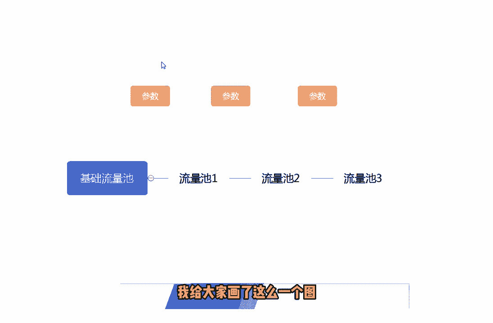
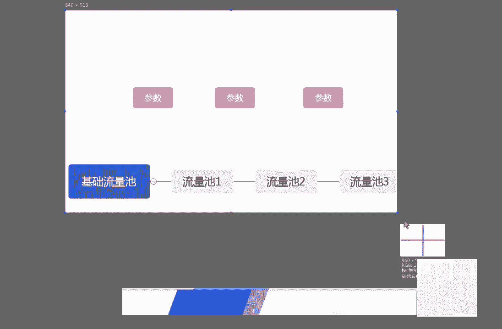
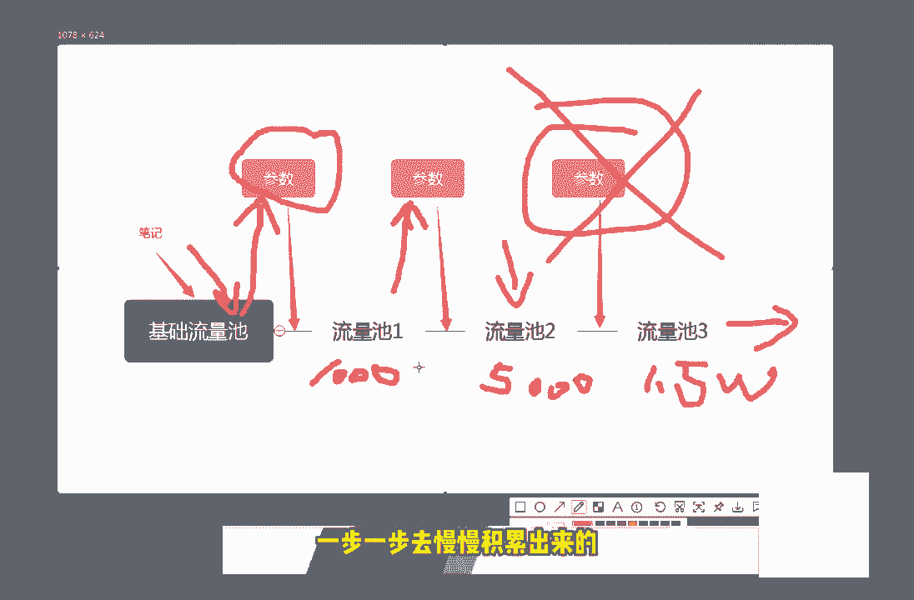
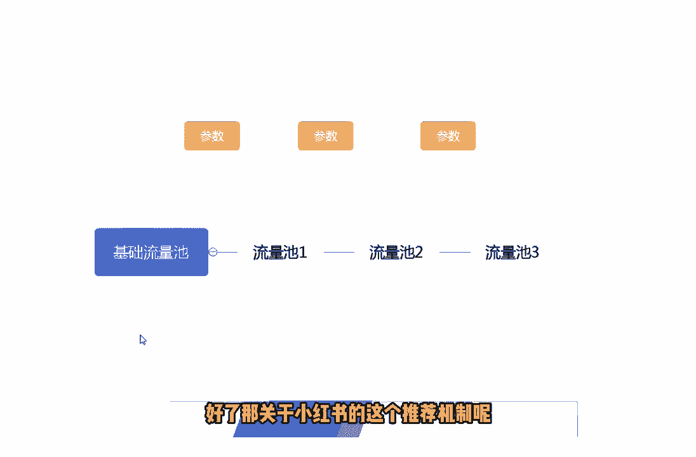

# 【B站全网最强新媒体运营教程】2024最干货的小红书运营起号高阶教程 抖音短视频拍摄剪辑／涨粉／就业 直播运营从入门到实战全干货！月入3万不是梦！ - P4：第3节：小红书流量推荐机制讲解！ - 推哦怕 - BV1dz421a7WP

我们这一小节课呢来和大家简单的讲一下，小红书的推荐的一些机制和规则，其实小红书的推荐机制和规则呢和这个抖音，包括头条这些平台的逻辑都是差不多的，用户呢以及内容都会被打上相应的标签。

就比如说我们在发送这个笔记的时候呢，都会被系统打上这个标签，然后呢每篇笔记都进都会进行机器审核额，看一下这个检测出来的这个内容是否有违规，如果没有的话呢，就会进行一个大数据的一个算法匹配分发。

就像我上一节课和大家说到的检测的一些词汇，包括检测的一些词语，都是会在这个里面进行进行到一个呃一个作用，如果如果这时候系统检测到，检测到你是由相关违规的话呢，如果这个机器啊，也就是这个程序这个算法。

它不能确定它会进行相应的一个调整，就是说会把这个有疑问的东西，过给这个人工去审核，如果人工再去审核的话呢，确定是没有问题的话啊，然后才是进才是能进行分发匹配的，如果你的这篇文章啊。

这篇笔记又被机器判定为这个违规，然后又被人工判定为违规的话，那基本上就会去被关到一个小黑屋里面啊，就会被限制账号发言啊等等这些这些操作，另外的话呢我们这个在推荐的时候呢。

系统会提取这个笔记中相关的一些关键词，图片的标签啊，话题啊等等来分到对应的这些类目里面啊，其实大家在一开始注册这个小红书的时候，也就发也就会发现了呃，小红书呢会要求每个用户去选择，自己的这个地理位置。

包括喜欢的一些领域，他为什么要选择这些领域呢，也就是为了让大家去啊，给自己的这个兴趣打上一个标签，然后呢他就会根据这些兴趣，然后匹配我们相关的一些笔记，然后呢进行内容的一个分发啊。

下面呢最后呢要和大家说的呢是推荐后呢，不代表用户就可以搜到这个笔记，因为这个笔记呢必须要被小红书去收录才可以，这里面呢给大家提个醒啊，就是我现在在外面也也看到很多的这个，一些机构啊。

或者说一些这个呃做项目的人啊，他会说百分百分百包这个小红书去收录，这里面大家一定要注意一下，就是目前来说的话，几乎是不可能有百分之百包收入的，包这个小红书收录的，这里面大家一定要注意一下，如果说有的话。

那基本上95%吧，可能是骗子啊，这个大家一定要注意一下，如果对方说有包收录的方法的话，最好呢是去验证一下，而不要说直接就去给对方转账，或者说要对方帮忙去收录，最好是去验证一下。

如果对方确实有这个实力的话，再进行转账，再进行合作也不迟，因为根据我们现在这个操作，小红书的这个难度来看的话呢，这一块去要小红书去收录的话还是比较难的啊，然后呢，我这里再给大家说一下。

这个小红书的一个推荐机制吧，很多人都会说这个小红书的推荐机制呃，会很奇怪，他的一篇笔记呢，呃比如说20分钟之前看，可能是1万个阅读，对吧啊，可能是个是个这么一回事，然后呢过了一会又变多了。

然后又过了半个小时呢又变多了，那为什么会产生这样的一个情况呢，这里面呢也很简单，我给大家画了这么一个图。

啊我给大家画了这么一个图，用这个图呢来去理解的话，就比较很容易比较去理解了，那我们最开始的时候发了一篇笔记呢，啊发了一篇笔记呢，发了一篇笔记之后呢，系统会对应的分配到一个，基础的一个流量池里面。

基础的一个流量池里面，啊这个基础的流量值呢可能不会太高，然后呢因为只是一个基础量，可能只有两三百，或者说一两百的人去啊，会被系统推荐到这个推荐到去看你的这个笔记，但是为什么会有更多的这个流量池呢。

就是因为在你的这个笔记，在被别人看的过程中呢，如果说你的笔记被别人点赞转发以及收藏，也就是我上面所写出来的参数啊，这个参数就是说点赞点赞转发收藏额，我们的笔记发给这些基础流量的时候呢。

然后通过这个参数来判断出来，我这边画给大家画一下，而当我们的笔记，当我们的笔记发到这个流量池里面之后呢，啊如果这个流量池里面的这些用户，他的反他的反馈都是比较好的话呢，它进行了一些转发。

收收藏以及点赞以及点赞对吧，那对应的这个参数呢就会产生一些变化，产生变化，如果这个参参数产生变化之后呢，达到了一额，达到了往下一级推进的这么一个机制之后呢，这个笔这篇笔记呢就会推荐到下一个流量池。

那下一个流量池呢可能是1000起步，1000个人，如果说这1000个人看了你的这个笔记之后呢，点赞转发以及收收藏，这些指数呢依然是比较高，依然是达到了某一个阀值对吧，那他就会推荐给下一个流量池。

下一个流量池呢可能是5000，可能是5000，啊可能是5000，然后这5000个流量值之后呢，再根据这些这些参数的这些占比，如果还是比较不错的，那就可能推到1万或者是1万5啊，这个大家要注意一下啊。

这个后面的我就不去画了，然后呢他就是这么一个推荐机制，如果说你的这个笔记它的反响是比较好的话呢，它是逐步逐步去被炒热的，不是说不存在说你一个笔记发下去，立马就会有1万个人看到，或者说有5000个人看到。

这个是不可能的，他都是逐步的去推荐的，推荐的这个流量池呢是也是越来越大的，直到你不能满足于这个参数为止啊，直到你不能满足于这个参数的话，那就只只能是停止在这个参数前面的，一个流量池里面。

所以说这个是相关小红书的一个推荐机制，希望大家了解一下小红书的推荐机制呢，并不是说一蹴而就的，而是我这边这张图呢和大家讲的这么多啊，他是一步一步一步一步去慢慢积累出来的。

好了，那关于小红书的这个推荐机制呢。

