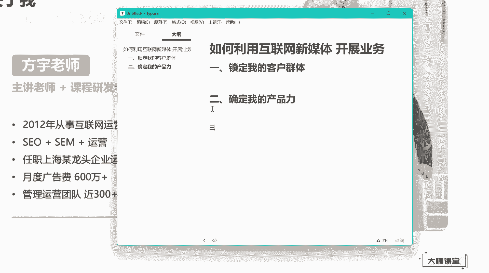
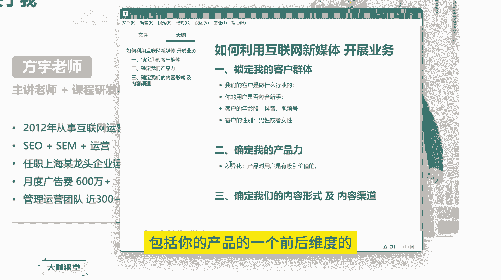
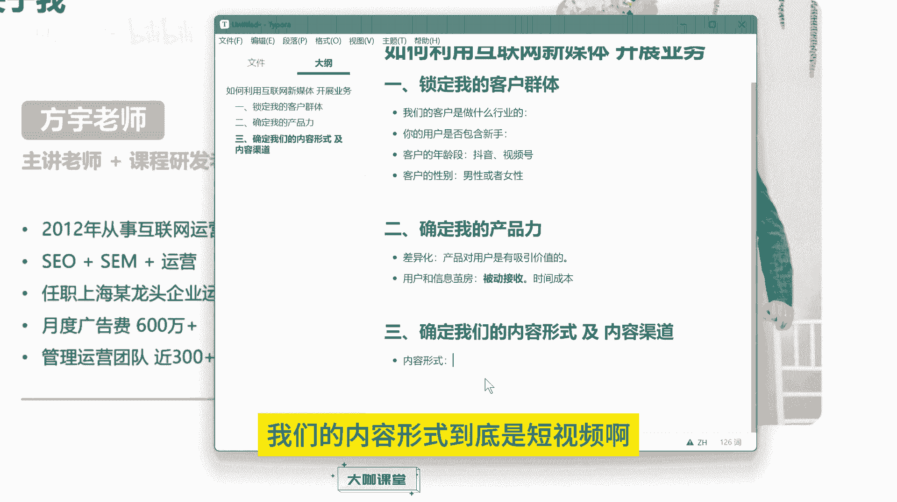
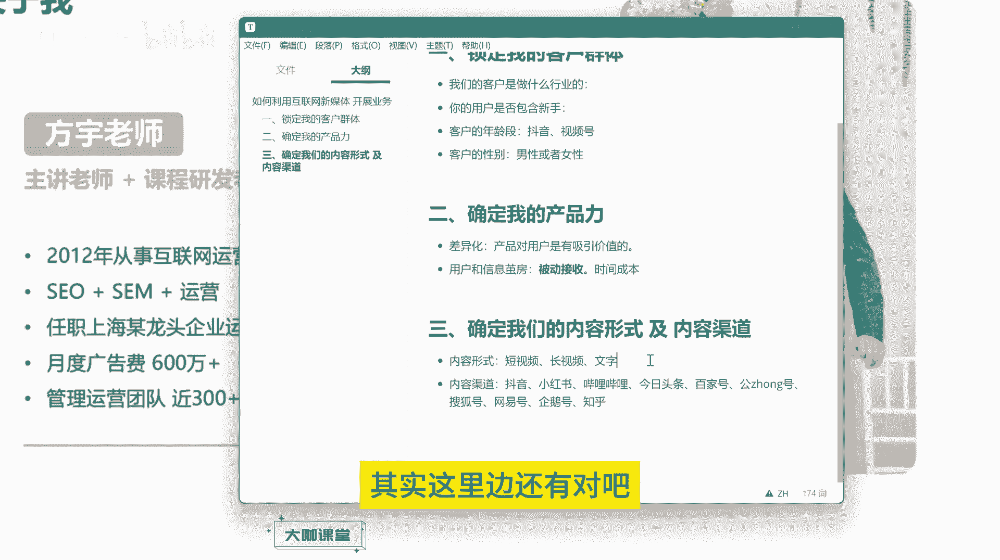
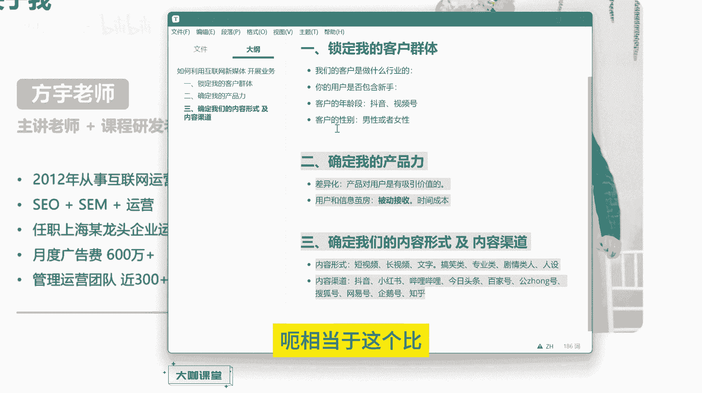
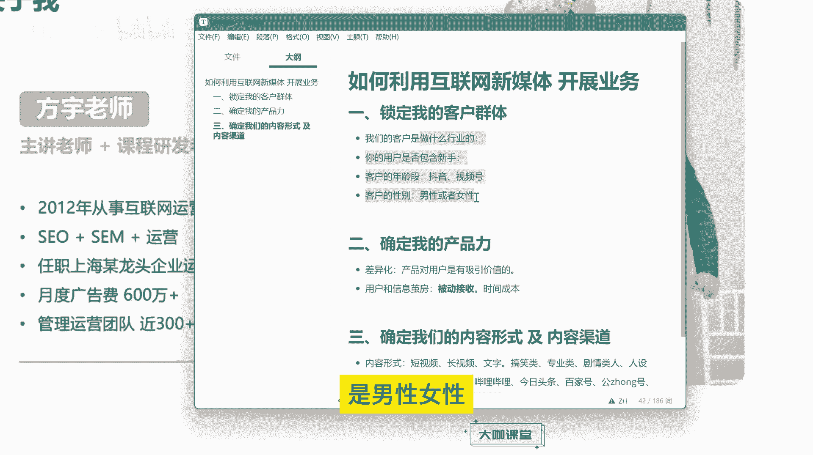

# 【B站全网最强新媒体运营教程】2024最干货的小红书运营起号高阶教程 抖音短视频拍摄剪辑／涨粉／就业 直播运营从入门到实战全干货！月入3万不是梦！ - P5：01.3：运营核心  如何利用互联网新媒体开展自己的业务 - 大咖私域运营 - BV1Wm421K7Yp

hello，大家好，欢迎大家来到我们这一节课。那么在之前呢呃我们有学员联系到说呃想自己呢在互联网上做一些业务啊，有知识付费类型的考研的呃考供的，也有这个目前比较火的做这个AI培训的相关的很多的业务。

就是大家想了解，就是这自己的这些产品，怎么去在互联网上去开展，怎么去找客户等等等等。这些。那么通过连麦啊和多种一些远程的方式呢，去跟呃他们聊了一下啊。

反正呢就是呃很多人发现他们在这一块呢确实还是比较空白的，就对整个互联网的一个运营的呃产品运营的一个趋势和方向都呃比较迷茫。所以说呢这节课呢，我就跟大家来聊一聊。就是如果说你想在互联网上开展你的业务。

做你的产品，我们到底应该怎么去做。好吧，那么这里呢呃我来分析的一个方式啊，假设说我现在接到一个项目，我来分析一个项目，到底在怎么在互联网上开展业务的方式和步骤有3个啊，有3个。😊。

总的来说可以有3个。首先第一个我需要去锁定我的客户群体。

啊，锁定我的客户群体。啊，这是第一步。然后呢，第二步我还要做什么？第二步呢，我要去确定我的一个产品力。

呃，就是我要去考虑我的产品可以给用户带来哪些价值。他为什么会为我的这个产品买单？然后我的这个产品相对于竞品对标来讲，我有哪些优势啊，这其实在我们之前呃课程当中讲到的去获取差异化，去获取我们特色的这个点。

其实也是去增强我们产品力的这一个重点，对吧？呃，这是第第二点，那么第三点。

第三点就是确定我们的内容形式及。内容渠道。

O。呃，内容形式，也就是说我们要去确定我们的内容到底最终是做成短视频的内容，还是做成长视频，还是做成图文笔记啊，我们的内容渠道就是像抖音B站小红书今日头条、百家号以及搜狐等等这些平台啊。

我们到底在哪些平台上面去重点营铺设我们的营销内容。我们的客户他们到底聚集在哪些平台上面。我们需要通过这种方式来分析，来确定我们去创作和营销管理平台的一个前后的一个先后顺序和重要性地位。

OK我们先来看第一步去锁定客户群体这个东西啊。

呃，我们首先啊我们需要通过多种多样的分析方法，我们去了解我们的客户群体，他们都是哪些人，他们是做什么行业的，是吧？客户。

嗯。客户是做什么行业的对吧？我们的我们的客户是做什么行业的，什么意思呢？就是呃假设说啊你现在开展的业务是在互联网上，对吧？我们要在互联网上去开展我们的业务。那么我们的客户他有可能他是做传统行业的。

比如说他是开工厂的，他是做餐饮的啊，或者说呃做一些线下服装的，那么这些客户他们要去获取，或者是找到我们的内容，他们是去哪找呢，对不对？他们最常使用的软件是哪些是吧？呃，这些客户群体。

我们就要先去分析一下呃，去了解他们的一个使用平台的一个喜好。那假设说你的用户对吧？他是大学生群体呃，他是这个呃宝妈类型的，那么大学生群体可能钻研于呃有这个抖音B站小红书都有对吧？如果说是宝妈群体。

他们呃聚集的平台是哪些B站啊，B站是没有的。啊B站比较少啊，像小红书和抖音那。

肯定是更多的，对不对？那么我们通过这样的一个分析方式，就能确定哎，就我们这个行业的一个用户啊，他们呃经常聚集在哪些平台，这是第一个分析方式，对吧？我们的客户他到底是做什么行业的，然后呢。

第二个就是我们之前有学员咨询的时候，他这个想开展这个AI相关的一些培训的课程，对吧？他想了解一下呃，这个业务怎么发展，那么课程这一块啊，还有一些做编程的用户，对吧？那么你就要考虑一个问题。

你的用户是否包含新手，对吧？😊。

如果说你的用户里边有新手啊，有小白，那么这些人你要怎么去把你的产品去推给他们。比如说你做的视频，你做的笔记，他们是否有兴趣去看啊，一开始是否能够被吸引住，是吧？这是一个很关键的点。

那假设说你做的内容呢层次度、深层度很高，入行这跟着学习的门槛非常高。那这个时候你做你你那这些新手用户，他们看到你这个视频就相当于是知难而退了，对吧？他没有办法去理解你讲的这些内容也没有这些技术基础。

那你做的这个呃专业化太高的放在前面，那可能就引起不了别人的一个兴趣，你的内容的观看程度也会大幅降低，好吧，那如果说你的专业程度针对的是内容进阶的群体，提升的群体，他们本身有一定的基础。

那你就要考虑你这个内容应该要啊做的更加的专业，更加的具有技术竞争度。O这是一个点。

然后还有什么呢？我们还要去区分对吧？我们客户的年龄段。啊，年龄段这个东西是一定要区分的。因为我们现在整个互联网呃流量比较分散。呃，用户呢他可能在这个今日头条网易新闻啊，也可能在抖音、小红书。

还有这个哔哩哔哩这些比较热门的新媒体平台。那么不同年龄段，他们使用这些app的一个方式是不一样的那假设说现在你的用户群体，可能就在40岁左右对吧？4030多40，然后甚至说在50岁左右。

那么你的这些客户群体，他们首先啊抖音是毋庸置疑的嘛，对吧？抖音是毋庸置疑的，但是抖音上面竞争力又大，你短期内你又做不起来，你需要去考虑一下有没有别的渠道更好做的。那么这个时候假设你去花了精力。

你去做了哔哩哔哩O那么哔哩哔哩上面我们都知道他是年轻人的二次元的这个文化的圈子，哔哩哔哩上面聚集了很多很多的年轻人。那你在上面花了很大的精力，你去投入去做产品做内容。

这个时候你反而你得不到你想要的一个结果，因为大部分人他对你的这个内容他不感兴趣，这个根本就不是他们这个年龄段的人去想去刷的。😊。

OK那么这个时候呢你这个方向就错了。那你这个业务就相当于是倒了一半了。那如果说甚至说你去做这个小红书，小红书上面的用户人群。首先呢呃之前呢是这个女性群，女性群体呢能够占到百分之八九十。

然后现在的话呢可能是呃比例占到60多。但是啊但是剩下的这些群体，有男性用户，但是呢他们是吧？他们更倾向于更年轻化的这样的一个元素。O小红书上面呃，那么你如果说在这上面去做内容。

那么你的用户群体也可能不在这个上面，除非说你是做那些呃女性方面的一个产品，对吧？可能说年龄稍微大一点这种产品，你在小红书上做比较合适。但是如果你做的是我们普通的这种业务，对吧？

你的这个年龄段里边有包含有有男有女，可能说男性客户还比较多一点，那么小红书上肯定不是你考虑的渠道和方向，对吧？那你假设你是这个年龄群体，你就应该考虑什么呀？你就应该考虑抖音还有我们的视频号这两个渠道。

你就得往这个方向去重点发。😊。

假设说抖音不好做，对吧？你短期内没有办法见到更好的效果，你自己去考虑一下你适不适合做视频号啊，视频号里面的视频，视频号里边的直播，对吧？

这一块你要不要去搞起来O这是我们根据客户年龄段来判定我们内容形式的一种方式。然后其次还有客户，我们刚才讲到的对吧？客户的性别。你的客户的主要群体，男性占占比更多还是女性占比更多。

那么之前呢我有一个学员跟我聊说他的这个行业里边他做的一个产品呢，女性用户居多呃，年龄呢可能呃三四十左右吧，20多的也有呃，但是呢他想在就是我不是我我是跟他建议去小红书上面做嘛，就是他去看了一下小红书。

发现在上面找不到多少对标的这对标的内容，他就怀疑说这个平台，哎这个平台是不是不好做，或者说不适合我来做。因为没有同行去开展嘛，其实他完全想错了啊，这是小红书这个平台的一个性质啊。

我我们前面跟大家讲这个用户标签的时候，其实已经很明显了。就是你理解用户标签的这个形式。😊。

大家知道用户他在这个分散的平台上面，他是不断的流窜的，他既在抖音，在也在小红书，尤其女性的群体用小红书的人，他是必然他会用去会去用抖音的，不管他用的多与少。那么用抖音的，他不一定用小红书，是不是啊。

这是一个方向啊，但是女性用户群体这个如果说呃基于小红书他的这个社交圈子和他这个文化属性，你你我们客户大部分是女性，那么他就必然在小红书上会有啊，必然在小红书上会有，不管他是什么年龄段，他喜欢什么东西。

小红书上面的女性群体用户占比那么大，他是肯定有你的客户的，而且他会显得更加集中。抖音上面呢其实就相当于说它就相当于一个江湖。这个江湖里边什么门派各式各样的人他都有。

但是小红书他就相当于是一个什么是一个宗派，他里边所有的人在里边都特别集中，而且属性呢特别精准，这就是我们要去抓的。你发现没有你的客户啊，没有你的这个同行或者竞争对手在上面去做，这恰恰是一个好的事情。

你这个时候去做你的内容不可能存在，只要你的用户，他是女性啊，他对你这个行业，他是你的一个呃就是你的一个精准用户或者说是你的用户群体，他在小红书刷到你的内容，他就必然会去看啊，这个你不用去考虑太多。

不用说因为没有同行去做啊，我就不去做这一块的内容。可能这个平台不行，这个是不存在的啊，不存在的，你一定要理解现在互联网他的一个共性。O那么这就是我们确定客户的一个性别。如果说是男性对吧？

男性我们去制造内容就要去考虑类似于呃男性喜欢的东西，像什么美女对吧？然后电子类的产品。😊。

一类的产品，然后手工艺类的产品，还有一些呃各种拆解啊，还有各种这个呃机械类相关的这种东西。那这可能就是我们男性比较大众化关心的东西。那如果说你的用户是女性群体。

你就更应该去想办法知道女性用户他们更感兴趣的情感方面的啊，对吧？还有一些呃搞笑的这类类型的题材或者说女性比较刚关注的这个能跟你这个产品靠上边的这种内容，就是你应该去考虑的内容形式。

O这是我们其实我们就是应该是我们讲的这个第三点的啊，内容形式和内容渠道。但是这是我们呃确定客户性别能给我们的业务带来的一个方向之一啊，也就是男性或者女性，对吧？😊。

这个是非常重要的啊非常重要的。我们大致先以这么几个方式去区分我们的呃用户去看一下我们用户群体，他们到底什么样的。如果说你把这些东西做好了，那么你的脑子里边基本上就有一个你用户群体的一个基础画像了。

针对这些用户画像，你再来根据我们的运营的一些经验呢，和我们的一些方法，数据等等，再去确定我们的内容和我们的产出的一个渠道，你大概脑子里边就明白了，我在哪里做，我做什么内容。O那么第二点确定我的产品率。

那么这个呢呃假设我们现在去接一个新的项目，这个东西是你必须要研究的啊，也就是说哪怕你的东西没有特色，你也要想着反而的让他有特色啊，你不能说别人做的什么东西啊，我去做一模一样的。

或者说呃我做的我只基于我现状，我去做这样的一个产品，这个是一定不行的，我们做任何东西呢，都要讲究一个非常关键的差异化，对吧？你要跟别人有不一样的地方，也要有一样的地方，对吧？我们要去包含。

并且呢要去增长啊，保证我们的产品对用户是有一定的信。😊。

价值的。

产品对用户是有吸引价值的。不管你是从自身的角度出发，还是从多层角度出发，你都要考虑用户他对你的内容产生兴趣了。到最后他为你的价值付费买单，这一定是有他的理由的。用户呢他是理性的，然后呢。

我们作为呃产品提供方，你的产品到底能不能提供保障你的产品到底有没有这个能力，前期中期后期这些东西，你都要把这个东西做我要做好一个规划，呃，包括你的这个呃包装，对吧？包括你的产品的一个前后维度的一个策划。

这些东西都是你要展现给用户去看的。如果说你的产品力不够，对吧？你再去呃做营销做这个内容呃，他可能就是没有办法达到你想要的一个这样的一个结果，因为互联网上面所有的用户呢，就是我们可以把它理解为什么呀？

就是信息呢在表层宏观的层面上来讲，呃，用户对信息这个东西呢是透明的，对吧？啊，信息对用户是透明的，就是说他可以在你这里接收到信息。那同样也可以在别的地方介绍到信息，那么你要保证至少在用户看。

你的第一眼，你他能发现你这个东西跟别人有不一样哎，有价值。然后呢呃就是还有之前我们有人议论过的一个点，就是现在所谓的一个信息减房嘛，对吧？那么我们这叫之前呃有些直播间对吧？卖产品，可能他卖79对吧？

但实际上的这个产品可能只需要二三十块钱在别的地方他就能买到。但是79这个东西呢，他就是能够卖出去，这也是基于一定的产品力和信息减房造成的。因为我们很多人他会下意识的就是怎么去理解。

他会从他认为的这个角度，这个平台，哎，他具有性价比。哎，这个平台他给我的东西就是便宜。哎，从我日常接收到的信息来看，呃，比如说他的一个标准价呃，就是呃79是吧？然后呢呃或者说99对吧？

然后呃我在他这里看到的，哎他这里是79确实比别的地方便宜，而且呢哎有保障，对吧？这个就是吸引用户的点，也是我们信息减房造成的。但是如果说用户他愿意去深挖啊，他愿意去别的地方去找去搜索去查找。

他也能发现哎这个东西原来。😊。

它并不值79，它可能只有29的1个程度。因为别的地方卖的就是29一模一样的东西。但是你们这个地方你们就要注意啊。

用户啊去呃是现在啊用户和信息之间的一个啊和我们互联网信息之间的一个这样的一个关联。用户和信息，因为什么呢？因为我们现在很多用户他们接收信息啊，都是通过什么呀？都是通过被动接收的形式啊。

都是通过被动接收的形式，被动接收形式有什么，有一个什么样的坏处呢？他就会造成信息检房的一个形成。也就是说我们只会看到平台给我们推送的内容，只会看到别人愿意给我们看到的信息，不管这个价格是贵的。

是好的是坏的，我都会去接收。那为什么用户不去主动接收呢？是因为有一个东西叫做时间成本。

我们现在所有人的时间都非常的宝贵，我们去做一件事情，专心的去做一件事情，肯定是有目的的对吧？我们要去主动接受，肯定是有目的的。有目的的这样的一个，他就会带有一个时间成本。

那被动接收的一个好处就是他推给我了，我可能看了一下，哎，我要么划走，我要么停留一下。

他强制性的推给我了，他就会在我的脑海里形成一个意识啊，这就是一个信息减房的一个形成啊，信息减防的一个形成。

行。方。信息信息。

检房，嗯，这就是信息检房的一个形成。因为用户是被动接收的。我们平时我们的时间基本上都耗在手机上了，对吧？耗在抖音上了，耗在各种新媒体平台上了，耗在看电视，看电影的时间了。可能有时候我们还会在纠结哎呀。

我刷抖音，刷着刷着，我连看电视的时间都没有了，是吧？那么我就更不会去花时间去搞一些去搜索一些，我暂时还不是特别需要的这种信息。我特别比如说我看到一个产品，我就必须要去了解一下它的价格，它的优势。

它的这个呃出产地等等等等。我不会去了解这些东西是吧？因为我没有这个时间，我还要刷下一个视频，我刷完了这个抖音呢，我还得去看剧，对吧？有时候看着剧呢，可能呃中间抽空刷那么一会儿抖音啊。

这都是趁着中间的间隔时间来去接收信息的，所以说我们现在很多人除了一些特别的目的之外呢，他们的呃接收信息的方式，最主要的来源就是被动接收，这也是信息检房的一个造成啊，这就是我们确定我们产品的的这一点。

我们之前不是跟大家讲嘛，就前面啊刚刚我。😊。

大家讲就是产品力这一块，不管你有还是没有，你一定要去把它。

突出你有这样的一个产品的一个价值，对吧？你一定要突出它的价值，并且呢你还要去扩大你的价值。不管是呃这一块的成本是一定不能去呃忽略的对吧？产品力这一块呢是我们现在互联网这一块成交的一个主要的一个东西。

OK主要的一个东西，首先是流量，对吧？也就是我们的用户，用户有了之后呢，我们就要通过我们的产品去吸引用户。那么有了产品信用用户去付费，成交了之后，我们就要考虑什么呀？考虑后续的一个服务了。OK。

那么确定我们的内容和形式内容形式，以及我们的内容渠道，其实就是前面我们分析得出来的结果。首先呢我们的内容形式是什么？

我们的内容形式到底是短视频啊，长视频。

还是文字对吧？文字我们发在哪？小红书头条、百家号对吧？搜狐号、网页号啊，以及这个腾讯企鹅的，还有这个公众号等等这些地方都是我们文字类型的内容可以发布的地方，甚至说还有某些专业学术性的网站，对吧？

那假如说是短视频，短视频的话呢，你肯定是发在抖音上面，对吧？小红书可能也可以同步发对吧？短视频内容为主的形式，呃，抖音为主，对吧？然后呢呃西瓜视频这些地方也可以发，如果说是长视频，呃。

知识类型的就你的内容呢干货时间比较足的，像我们这样一节课讲个十几分钟20分钟的，你就得考虑放在什么地方放在学习用户比较集中的地方，也就是哔哩哔哩对吧？那这就是我们长视频，还有呢假如说你的内容，对吧？

你的产品像这个什么机械呀，对吧？像什么一些传统的呃卖一些这个家电类型的东西呢，你就要考虑什么？你可能要考虑百度的爱采购啊，或者说呃环球环球网或者说一些其他的这个呃这个。

这个这个也就是说我们之前的呃就类似于什么来着？我们以前传统的这个电商的渠道的一些网站，阿里巴巴对吧？还有中国供应商等等，这些网站可能就是你要做这些机械类的产品，或者传统的这种呃实体类的商品。

你要考虑的渠道，这就是我们的内容形式，以及我们内容发布的一个渠道，对吧？😊。

对吧内容渠道啊，我们常见的内容渠道呢，抖音啊、小红书哔哩哔哩。然后呢呃文字类型的，还有我们的今日头条。大家好。然后呢，我们的这个公众号。啊，公众号还有什么呢？呃，像我们的这个呃搜狐号。网，一好。

还有什么呀？还有我们的这个呃企鹅号。等等等啊，这些平台，这都是我们现在新媒体互联网这一块的内容主要的分发的一些渠道啊。当然还有一个非常重要的一个知乎啊知乎那是一个问答平台。好吧。

你可以理解为知乎是一个知识类型的一个问答平台。可能很多人在上面看小说啊那么这就是我们通过分析我们的客户群体啊，确定我们的产品力，以及我们最终的一个内容形式，内容渠道这一块就解决了我们到底做什么样的内容。

我们的内容发在哪些地方，对吧？然后呢，这个内容形式，其实这里边还有对吧？我们还要确定可能你要做搞笑类的啊，那这就比较多了是吧？搞笑类的或者说呃这个专业类的。😊。

剧情类的对不对？人设是不是等等很多等很多很多东西我们都可以从这个地方从前面的分析，在这里得出一个结果。OK那么这样的话我们就能确定我们后面做什么样的内容啊啊再结合我们之前什么呀。

我们之前跟大家讲的一个关键词库这一块的一个搭建。那么我们所有的东西就可以照着这种业务形式去在互联网上去铺设我们的内容。不管你是做企业好，做个人号涨粉也好，还是说你在这一块的话，那个去实现变现啊。

去开展自己的业务思域啊，举经啊等等等等，都是通过这样一整套的分析模式，一直到最后的一个落地来实现我们最终的一个结果啊，当然这个是比较呃相当于这个只是相当于一个草图啊，我们具体的分析内容。

我们在那个前面的几节啊，就是说呃先看到这些用户，你可以说往后面翻几节有讲到我们怎么去分析用户群体啊，我们怎么去寻找差异化。然后呢，我们的内容形式，像短视频，还有长视频啊，或者说文字类的内容。

怎么去创作结合AI等等的。这这是我们后面。😊。

讲的东西，也就是说这是一个草图，对吧？我们还要基于每一个点，客户群体里边，我们在具体细化再去做细细分。比如说我们刚才讲到的我们的用户群体他是宝妈，对吧？他是职场精英，他是男性女性，他是18岁到25岁。

还是说25岁到35岁，或者说我的这些用户群体，他们是学生啊啊应届毕业生啊，或者说什么什么样的，就是要去做一个详细的区分。再根据这个画像去确定我们给他们看什么内容啊，是他们感兴趣的。

才能提高我们整个内容的一个什么呀播放率点击率，然后呢这个互动率等等等等，这样就能形成我们整个的一个运营的这个盘子的一个开展。好吧，OK那么这是我们这节课跟大家讲的一个主要的东西啊。

可能说有些啊废话比较多啊，就是呃主要结合我自身对整个互联网的一个理解，以及帮别人分析这个产品的一个策划等等这一块来的一个呃灵感和方向，也是帮大家屏幕前各位如果说你们有想去开。😊。

展自己的业务，你可以捋一捋我跟你讲的这些东西。然后呢，结合你自己的产品和行业，你来分析出一个画像来，你大概就能知道这个东西怎么去做了。OK好，那么我们这节课就讲到这里，我们下节课再见。😊。

