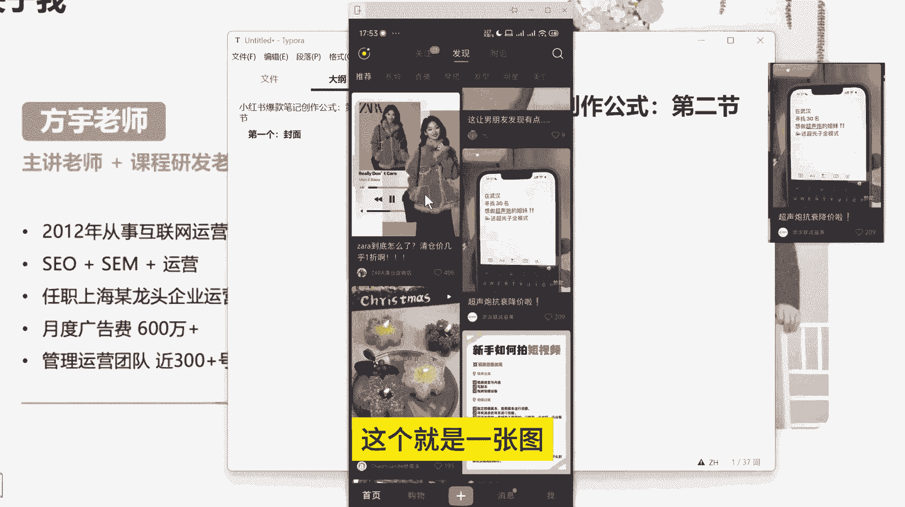
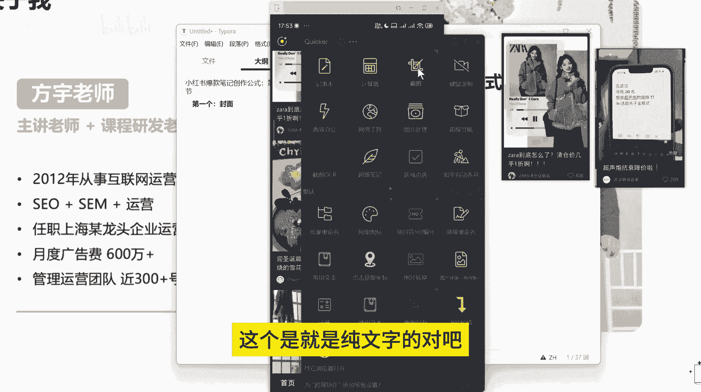
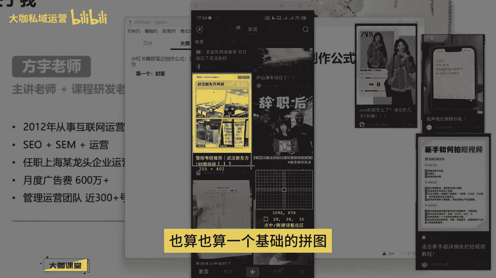
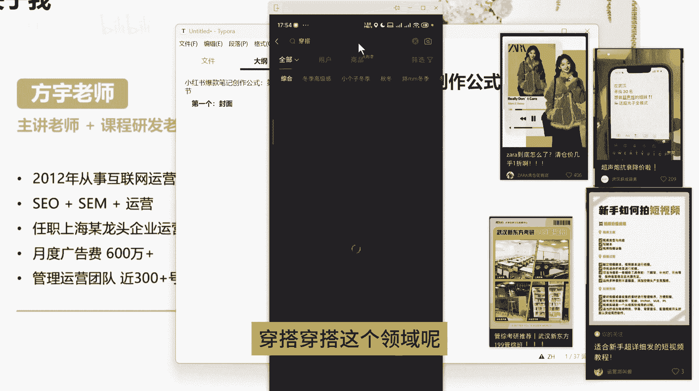
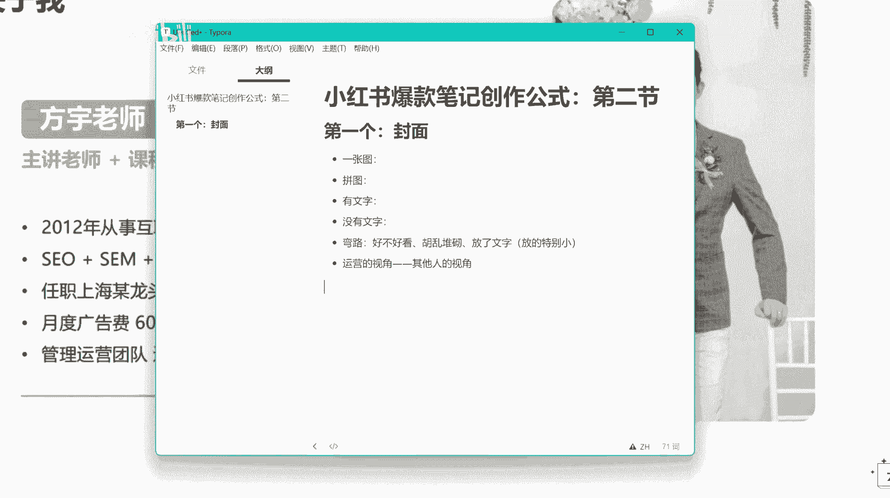

# 【B站全网最强新媒体运营教程】2024最干货的小红书运营起号高阶教程 抖音短视频拍摄剪辑／涨粉／就业 直播运营从入门到实战全干货！月入3万不是梦！ - P7：01.5：小红书爆款笔记创作公式：第二节 - 大咖私域运营 - BV1Wm421K7Yp

hello，大家好，欢迎大家来到我们这一节课。那么上一节呢我们跟大家聊了一下小红书爆款笔记创作的这样一个呃核心点，以及我们创作的一个方向和内容选题。这一块啊，就是能够产生爆款的这些基础的东西，呃。

那么如果说呃我们真正的要去打造一个爆款笔记的话，除了我们的方向和我们的价值之外，我们最需要的还有几个点是什么东西呢？就是第一个是我们的封面，对吧？😊，啊。第一个。封面对吧？

我之前呢在这个课程当中跟大家讲过啊，小红书这一块呢，它跟抖音不一样。抖音的这个封面呢可能在主页上面体现的还比较明显。但是呢在正常的内容当中呢，现在可能短视频这一块就靠前面的3秒3到5秒来吸引观众，对吧？

但是我们小红书笔记不一样，它是靠什么呢？它是靠你的这个封面标题这些东西来结合产生你这样的一个内容的一个点击率。我们抖音呢都是啊内容主动的推送到用户的手上，也就是说不管说它呃对这个东西感不感兴趣。

它最它至少要停留那么个一秒1秒到2秒的时间。而我们小红书不一样，小红书的笔记它是通过瀑布流的形式展现的。那么所有的笔记呢都放在一个界面当中。我们可以来看一下。小红书的所有内容它都放在这一个界面当中。

那么用户在这个浏览的界面当中呢，在这个界面当中，也就是首页他去刷这个内容的时候，如果说他不产生点击，他对你的内容是不可能有任何的这样的一个创作价值的，或者说互动价值的。

只只有他对这个内容产生了点击行为之后，后面的停留时长对吧？点赞互呃，这个收藏评论等等这一些内容才能成为用户对你这篇笔记的一个互动收益。所以说怎么说呢？所以说就是我们的封面还有标题。

就决定了我们这个笔记到底能不能被产被产生这样的一个点击行为。那么封面它有多少种创作形式呢？我们总结下来就是首先第一个啊。😊，封面的创作形式啊，第一个就是一张图OK这是一张图。然后呢，还有就是拼图对吧？

拼图形式，然后呢，还有是什么呢？有文字的。还有是没有文字的。那么这几种是我们小红书上常见的这种呃封面的形式。一张图的话，那么假设它呃有文字啊或者没有文字，我们来看一下。

像这种这种你们觉得它是有文字的还是没有文字的呢？就这种封面。啊，其实我们看起来这种封面的话，你可以理解成它是有文字的。因为正常我们在刷这样的一个那种这个手机屏幕界面。然后呢。

我们看的是这个封面里边的文字内容，在武汉寻找30岁什么什么的呃，这种这种姐妹，对不对？那么这个东西呢呃用户关注的是这个点，他关注的是文字区域。

他不是关注你这个手机O他先是通过你这种只不过说这个东西呢这个封面呢，他通过这样的一个手机输入这样的一个形式呢，让别人能吸引别人的一个目光来产生这样的一个点击行为。但是真正能让他去对这个笔记感兴趣的时候。

感兴趣的点还是在于其中的内容。然后这个呢。😊，这个就相当于是什么呀？这个就相当于没有文字的，就一张图，对吧？这个就是一张图OK这个是一张图的形式。然后呢，这个是什么呀？这个是就是纯文字的对吧？😊。

这个相当于是纯文字的。纯文字的形式，我们也可以把它将它理解为有文字的形式的一个封面。那么这个封面就是通通过什么东西来吸引别人感兴趣，就是通过醒目的标题这种形式来告诉别人我这篇笔记有什么样的价值。

我能提供什么样的内容。OK我下面还列了这么多的表，这每一个地方啊列表每一个里边都包含了你想关注的这个节点。OK让他们来关注这个东西，最后呢产生一个点击行为。那么这个也是一张图，我们来看一下有没有拼图啊。

😊，这个算不算拼图呢？其实这个也算啊这个也算拼图。啊，也算也算一个基础的拼图。然后的话呢我们再看一下。

拼图我们直接来找吧，对吧？我们来搜索一个词儿。穿搭穿搭这个领域呢拼图应该是比较多的啊，比较多的，比较流行的一种方式。也就是把各种样式的衣服展现在我们的封面上面去让大家去看。哎，让大家去看。

那么这个形式呢就是呃内容展现的会比较多。你像这种拼图，对吧？这种拼图九宫格、四宫格，还有这种呃六宫格的等等等等，非常多啊，非常多。我们具体采用哪一种形式，怎么去搭配。

怎么去让我们的封面能够产生让别人去有兴趣点击的这样的一个行为，我们要要去要去策划一下这个东西啊，要去策划一下这个东西，我们往上面去翻啊，我们拿这个标题，拿这个封面来举例啊。😊。

拿这个封面来举例。我们假设啊我们拿这个东西来来做一个对比。我们假设现在你发的啊东西啊，一个穿搭或者怎么样的啊，这个东西这个这个封面，一个穿搭的这个封面，那么你下面的标题写的不是特别好的情况下。

你的这个笔记出现在首页O出现在首页。那么如果说他是对穿搭感兴趣的或者怎么样的，你觉得这个标题啊，这个封面有没有可能吸引他的兴趣，让他通过封面来产生点击行为呢？对吧？我们先不考虑标题，我们就来看封面。

就这样的一个封面，从穿搭的角度来讲，他有没有可能吸引起别人的一个点击的这样的一个兴趣，就是说哎这个这个封面还还挺有意思，里边的内容还挺不错。哎，我想我想点进去看一下他讲的是什么。从图片的角度来讲啊。

从我们运营的角度来讲，这样的一个封面是不太够的啊，是不太够的。因为什么呢？因为这样一张图表达不出来我们要表达的什么具体的一个意思。那么用户呢他看完了这个封面，他不懂，他就要去看标题对吧？他就要去看标题。

那么假设说你这个时候标题没有吸引起别人用户的兴趣O。😊，这个点击就肯定是没有了。那么这个点击行为没有了呢，我们就缺失了一个数据是吧？那假设我们来看右边这个右边这个呢它是采用拼图的形式，有文字的一个形式。

秋冬保密羽绒服穿搭O那么这个图片首先吸引起用户的就是各种各样的这种衣服在这个上面展现，可能他这个还有点密密麻麻了，还比较小，它主打的一个什么呀，主打的就是一个量，我给你很多的量的一个推荐啊。

那么这个呢就能让用户在看到封面的时候哦，这个笔记他是讲这个羽绒服穿搭的，那么他就会对这个笔记产生一定的兴趣。首先在封面这一层，它产生了兴趣。然后其次他还会再去看你的标题OK。😊，那么他还会去看你的标题。

不会说因为你的这个封面呃优质或者说戳中了啊，除非说啊除非说你这个封面直接戳中了他的用户的一个需求点，上面也有文字或者什么样的内容，他才会直接点。那么大部分的用户他会看一下这个封面。

然后再看一下这个标题O这个标题和封面差不多的吸入了兴趣，他才会去产生点击行为。那么也就是说我们做运营在这个地方，大家可以理解一个思维，就是我们尽可能的减少用户去分析我们内容的这样的一个时间维度。

我们要让他刷到这个最显眼的这一个部分，一眼就看到我讲的是什么，我这个点能戳中你的需求。那么我们就能大幅度的提高我们这篇笔记的一个点击率，所以说封面的创作技巧就展现在这里，你要怎么去想办法让你的封面。

让别人看起来能看得懂你讲的是什么？而且你这个封面里边的内容是用户喜欢的，这就是我们关于封面这一块的一个创作技巧，真正的封面做起来呢？其实并没有那么多，我们一定要讲究做的多么多么好看。

我们一定要保证的是什么，一定要保证在你的封面上面，你要让用户能够一眼看。😊，清楚你的一个需求点，对吧？那假设说像这个。像这个这个这个图片对吧？这个封面如果说不从穿搭这一块去考虑，可能用户关注的是什么呀？

关注的是他的一个风景和他的一个拍照去了，是不是？那这个是用户的一个关注的焦点，用户的关注的一个焦点行为，那么到下面标题上面这块才会显示什么小个子1。5米穿搭分享合集。那他这个标题他去了人群，对不对？

他去锁定了人群，一个是小个子对吧？一个是一米5啊，还有一个是穿搭穿搭是他的主题，那么小个子呢是他的人群，1米5就是啊跟小个子一样，他锁定了对应的人群。那么这些人群看了这个标题之后哦。

明白他这个是展示这个小个子穿搭的，哎，他得点进去看一下，我是一米5的身高，我到底我能不能拍出呃穿成这样拍出他的一样的一个图片的一个效果，这是用户关注的一个焦点行为，对吧？

那么如果说你创作的内容是关于知识分享一类的内容。那么你就更要考虑你的封面能不能吸引起用户的一个兴趣行为，对吧？假设说这个新手如何拍短视频，对不对？那么呃用户扫到你这个封面的第一眼。他看关注的是什么呀？

他关注的是这个地方，对吧？他关注的是这一句话，他关注的是新手如何拍短视频。O你这个标题能不能让用户感兴趣。我假设说我对新手怎么拍短视频比较感兴趣。我最近想知道这个技巧，那么看到的这篇笔记。

他第一眼刷到的这个点，他就会去点产生点击行为。然后下面的这些内容呢起到什么作用的呢？下面的这些内容起到就是辅助作用。其实他看的并不是特别清楚，他点进去了之后，他才能把这个东西呢看的特别清楚。

甚至说去翻译，他还会期待你后面提供更多类似的这样的一个技巧啊，知识点啊，比如说呃拍摄的镜头选择对吧？拍摄的环境拍摄的灯光，他都想他以为你提供的这些东西。

就是通过这个封面这样的一个技巧去让别人产生这样的一个疑虑。O这是我们呃做封面这一块的技巧啊，知识分享，像我们很多考研的对吧？培训的然后共考的还有很多很多领域的这块跟知识挂钩的，还有我们AI培训的这一块。

他们做的基本上都是都是要这样去做，你不这样去做的话，你的内容吸引不起用户的一个兴趣是吧？这是我们关注的一个点。😊，然后呢，像这个呢是不是像这个呃这也是一个穿搭啊，做的一个穿搭的一个封面，哎艺术感比较足。

那么这个封面怎么去锁定这个穿搭需求的一个人群呢，对吧？他可能是什么呢？就是很多人他刷到这个笔记哎，也就是说首页推荐啊，首页推荐刷到的这篇笔记这个衣服的款式，我还挺喜欢的，我就想进去看一下是吧？

那么这个封面就是用户他看的是什么？他看的就是这个衣服，哎，他喜欢这个衣服，那么这个笔记用户想看的是什么？他想看的是羽绒服的穿搭，对吧？他想看的是羽绒服的穿搭，这两个需求点是不一样的，而且呢这个笔记呢。

他本身，你看一下这个呃什么什么到底怎么了清仓价几乎一折O他就是跟衣服相关的，这是一个牌子嘛，对不对？他就是跟这个衣服相关的内容，用户看的不是穿搭，他看的是这款衣服哎，这个衣服好看。

我想进去看一下这个衣服呃，姐妹们评价怎么样对吧？在哪里有这个渠道优惠等等等等，他关注的是这个点，O这是我们创作封面的一个技巧，嗯，像这个艺术感呢。啊这个传达案很多这个这种的内容，我们自己去做内容的时候。

我们就要考虑这个问题。我们这个内容到底有没有办法做的，让用户能够对我们的封面产生兴趣点。那么之前呃其实跟大家提过，就是我们在小红书上面呃这个首页的结构，我们刚刚也讲了嘛，对吧？

我们在首页刷到这些笔记的时候，用户产生点击行为或者吸引他目光的行为，一定是先是封面再是标题啊，先是封面再是标题。所以说你做好封面，你才能去吸引用户来对你这个笔记产生第一步兴趣的一个关键的点啊，关键的点。

那么这几种形式呢，你可以结合你自己的这个内容来看，我们通常会怎么做呢？呃，如果说你没有办法确定，我们通常就会通过呃我给大家的一个对标账号的分析表格，我们先去找这种数据比较好的账号。

把他的这个账号里边的呃笔记热门笔记的一个形式，把它列出来，对吧？呃，截个图，然后呢我们再去看一下它的主页提供的是什么样的内容，对吧？我们看一下它主页里边呃讲的是他的这个封面是怎么做的。它的主页的这个格。

是风格有没有办法吸引我的兴趣来对这个账号产生一个关注行为，然后再从这个账号里面获取知识点。这是我们呃策划的一个是封面，第二个是我们主页的一个风格。OK这是我们讲到封面这一块创作，大家一定要注意的技巧。

很多人呃去做封面，走的一个弯路是什么呢？他就是考虑什么呀？好不好看，对吧？我这个封面做的好不好看啊？他关注的不是我这个封面有没有给用户提供需求啊，好不好还好不好看？这个东西呢。

说实话每个人有自己单独的一个审美，我们不能在这个地方去呃死磕，对吧？呃，真正的好看，在我们运营看来的一个好看，就是要把用户需要的点凸显给他吧？所以说我们之前很多呃人问哎。

这个为什么呃我是我们公司有设计人员。但是为什么这个图，他就总是做不出来我想要的东西，甚至还赶不上我自己做的，这就是我们运营的一个视角，对吧？这就是我们运营的视角和其他人的视角问题。😊。

OK运营运营的视角永远是从什么呀？永远是从我们的这个用户的角度去出发的啊，包括我们以前呃做这个搜索引擎优化的时候，就说我们做网站，我们就会会去关注一个东西叫做热点分析图。比如说我们打开一个网站。

它有头部有尾部有侧边左侧右侧，我们会去通过一些数据去分析用户点进我们的网站之后，他点住点哪些地方的按钮点的比较多，它在哪些区块去停留的时间比较长，它的鼠标在哪一块啊，来回的去滑动。

那么通过这样的一个分析数据。首先呃热点的关注，首先是在最左侧内容的最左侧，然后以及第一屏的最上层，这是用户关注的点比较多的啊，所以说我们包括我们现在对吧我们现在的这个对象挪到了这个app上面对吧？

我们运营的对象挪到了这个APP上，小红书和抖音上面对吧？抖音就不说了，小红书，我们关注的第一点，首先焦点肯定在这第一屏嘛，对吧？焦点肯定在第一屏嘛。然后我们的视线是怎么样？我们视线是从上到下啊。

用户的视线是从上到下来关注的内容，他心里会默认有一个排序的一个感。觉得OK那么我们就要怎么去呢？我们就要在用户目光最吸引的地方，通过这样最大板块的这么大面积的一个东西去抢占用户的一个视觉焦点。

这就是我们封面营销的一个呃关键的东西。OK那这是我们呃讲的弯路啊，这个弯路其实还没讲完啊，刚才讲岔了啊，就是弯路这块呢其实一个是好不好看，对不对？还有一个什么？我们很多人做封面的时候。

还有一个什么就是胡乱堆砌啊。😊，啊，胡乱堆砌，就是把一些杂七杂八的没有用的东西啊。比如说他会考虑把这个封面上面，哎为我放很多好看的小娃娃，小熊在这四四周啊，做一些装饰啊。

做一些什么东西的来让我这个东西看起来，封面看起来很可爱啊，这也是一个呃我不能理解的一个形式啊，就是你加了这些东西呢呃用户的视角看起来，他没有办法集中在这一个点，他会被你这些东西去分散。

分散的目光呢就导致你这整个东西啊，就用户看起来很杂乱，他找不到他自己要看的焦点，这是胡乱堆砌。然后呢，还有一些人犯的错点，就是他在这个封面上放了文字，对吧？假设他放了文字。😊。

他的这个文字呢放的特别小，对吧？它这个文字放的特别小，对吧？那么如果说你考虑一下，以你的一个角度呃，你这个封面对吧？我们来截个图哈，假设说这个这个是我们的封面，对吧？你的你的这个封面放到这个上面。

你只能放到这么一点，那么他看不清楚你这个内容的时候，他就不会花时间在你这个笔记上面停留，是不是？那么你把内容放大，对吧？你你把内容放到这么大。比如说这个封面我们来给他截个图演示一下啊。

我们把它放到这么大。😊，我们把它放到这么大啊，对比一下我们刚刚的用户看过去，一眼都能看到你这个内容主题讲的是什么啊，他不需要去费神的去分析，去聚焦会神的去看一下这个封面上面讲的是什么。

那么这个也缩短了用户的视线，聚焦在你封面上面的一个时间点。既然你放了东西，你而且你的这个内容呢放的还可以，你的文案写的还可以，也挺吸引人的。你就要想办法让这个东西让用户能够一眼去看清看清楚，看明白。

这是我们做这个封面要注意的几个点。OK那么这节课呢呃虽然说我们没有带大家去走一个封面。但是我相信如果说你以前在封面上面有这些误区的。那么经过这些对比，还有我们讲解它背后的原理。

你应该能够知道做一个什么样的封面足够是足够吸引人的O那么这是我们这节课分享的一个重点。下节课我们继续讲标题这一块和以及我们文案这一块到底怎么创作。

