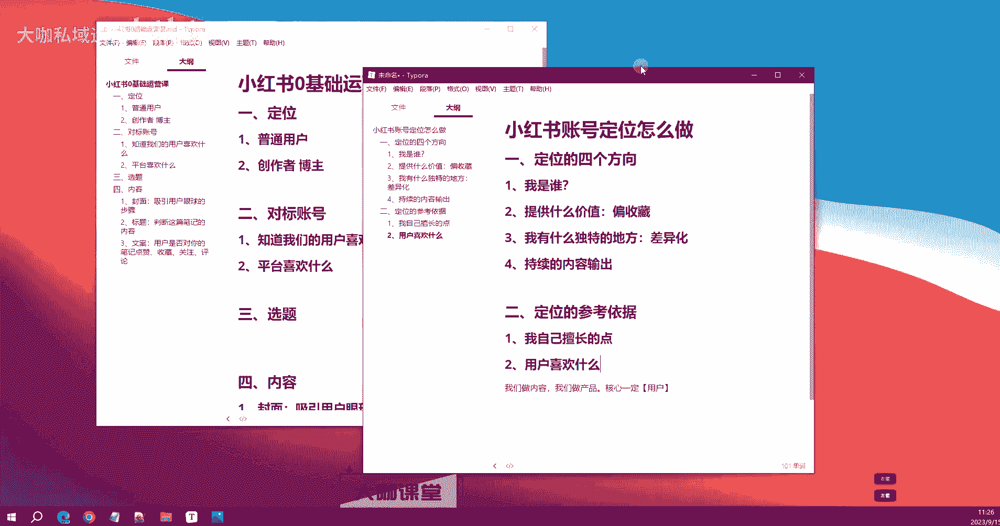
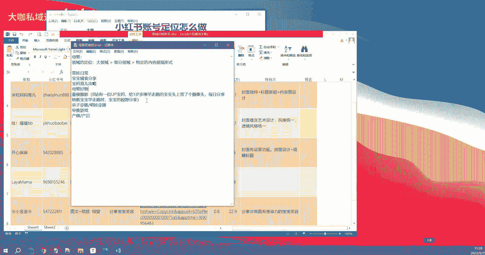

# 【B站全网最强新媒体运营教程】2024最干货的小红书运营起号高阶教程 抖音短视频拍摄剪辑／涨粉／就业 直播运营从入门到实战全干货！月入3万不是梦！ - P9：01.7：新媒体运营-小红书的领域垂直定位怎么做 - 大咖私域运营 - BV1Wm421K7Yp

OK好，欢迎大家来到我们这一堂课。那么呢我们在上一堂课当中教大家去学习了小红书的一个账号的运营。从零开始。也就是说我们刚启号开始一直到我们确定了可以发布内容的这么一个阶段。

一直到我们去爆款的这样一个阶段，总共的一个四个步骤啊，第一步呢是去做定位。那么定位呢也就是打造我们的人设，对不对？让平台给我们打上一个垂直标签，知道我们是在这一个领域当中的一个优质博主。

那么能够把我们的笔记推送给我们希望看到这一类笔记的这类人群。那么这是定位的一个作用。那么第二个我们讲到的对标账号。那么对标账号它的作用就是让用户啊让我们知道我们的用户是喜欢什么的。

我们的平台希望我们发什么。那么这些内容我们都可以通过对标账号，哎，也就是我们去找到的在我们这一行业这一领域当中做的比较好的。这一类账号他们当下那些数据好的这些笔记，我们通过这些内容可以分析得出这两个点。

那这也是我们后期要创作内容的一个方向，或者说我们长期的一个参考拓展啊，也就是说我们后期需要在这方面去完善的一些东西。那么第三个就是选题。那么选题呢，它其实是我们第四步。

也就是做内容的一个前置的第一前置的步骤。也就是说我们做内容一定是有依据的，也就是说比如说我今天想发一个内容。那么我一定是自己心里要清楚，哎，这个内容它有什么样的一个参考性。这个内容是不是用户喜欢的。

或者说这个内容是不是在当下平台希望我们去发送的这样的一个内容。好，那么这就是选题，选题这一块非常非常的重要，也是我一直强调的就是你的笔记，你的账号啊，有些人啊可能说他在垂直领域已经做的还不错的。

但是他领域啊定位也做的非常不错。但是它就是不能出爆款，可能的原因就在于你的选题出了问题。那么选题这一块，我们告诉大家，就是你一定要明白自己今天发的笔记，它有什么样的一个意义。

而不是自己单独想发什么就发展。好吧，那么这个是选题。四个我们讲到的就是内容内容这一块，我们聊到了封面是特别重要的一个步骤，对吧？封面呢是起什么作用？它是起到吸引用户眼球的一个作用。我们补充一下。

吸引用户眼球的步骤。那么标题标题是对我们这个内容，也就是说你的封面唉，让用户有眼前一亮的感觉。他注意到你的在这么每一个屏幕小红书的一个屏幕当中，现在有4个笔记能够给你看到，对吧？

4个到6个的这样的一个样子。那么在这几个笔记当中有一个笔记，通过封面唉吸引到了用户的眼球。那么第二步就是用户他会去注意你的标题，通过标题来判断你这篇笔记是关于什么内容的，对不对？那么就第二步就是判断。

这一篇。笔记的内容是否是自己感兴趣的啊？是否是自己感兴趣的。那么第三步呢就是唉前两步没有问题，我们吸引了用户的眼球，也吸引了用户的呃目光兴趣。那么接下来就是让用户产生点击行为。他点击了你的笔记进去之后。

还开始浏览你的什么东西啊，一个封面后面的个图片，对不对？然后还有你的文案。那么这两个步骤文案以及具体的内容，他决定了用户是否。啊，决定了用户是否对你的笔记。点赞收藏。以及关注等行为。那么这一套流程下来。

如果说你前面两个步骤没有问题。那么到了第三步，你在内容策划这一块没有太大的问题的时候，你这篇笔记对当前用户的一个吸引的价值就完成了。他的点赞收藏，还有关注等等行为以及评论哈，以及评论等等行为。

就会让你的这篇笔记进入下一个推荐谁，就是用户他判断用户行为的时候啊，也就是平台他在判断当前这个用户的行为的时候，觉得这个用户是喜欢你的内容的。那么平台认为你的内容它是有价值，或者说它是认可的。

就可以把你的笔记往后面去推送更高的流量值，这就是我们整个小红书运营的一个完整的体系。当然所有的内容做起来是需要具体的去细化，怎么去研究，怎么去做的。那么今天第一这一堂课啊。

我们就来带大家去了解一下定位这个东西我们应该怎么去做好，好吧。我们先把这个文件保存一下。啊，然后我们新建一个啊这个内容就叫做。定位怎么做？小红书账号的定位怎么做？那么这个问题呢。

我相信也是很多做小红书这一类人群的，就是你想起一个账号，你想在小红书上面做一个赛道，有些人会遇到这样的一个难题。就是我并不知道我这一块的一个定位，我应该做什么产品，对吧？我的定位。

我的人设我应该怎么去打造，那么这是非常非常重要的一步，也也也在这一步啊难倒了不少的同学。那么首先我们来了解一下小红书账号的一个定位，包括抖音啊等等。我们这一类新媒体平台。你的这个账号的定位。

他总共啊是我们可以分为4个或者。那么第一个。我是谁？嗯。定位的4个。是个方向吧。啊。Yeah。こ吧。好，那么首先第一个是什么？第一个就是我是谁，对吧？什么意思呢？就是我需要告诉用户啊。

我需要让用户看到我这个账号的时候，第一眼他能明白，哎，我是一个什么博主，对吧？我是一个彩妆类的博主，我能够给你提供彩妆类的意见。我的所有的笔记都是关于彩妆一类的啊，或者说穿搭一类的。

你在我这里你能获取到非常非常多的一个就是什么呢？就是参考价值啊，你能在我这里学到非常非常多的这种行业里面的知识，那么这就是告诉你哎，我是一个知识博主，我是一个有价值的博主，这个时候就是告诉用户，我是谁。

对吧？然后第二个是什么呀？明白。我们做账号定位的第二步就是让用户明白我们可以提供什么价值，对不对？用户关注你一定是有一个前提的。那么关注你对你产生了一定的兴趣。

或者说他觉得你这个账号现在提供的以后提供的，或者说你之前提供的内容对我也比较有参考价值，我就愿意收藏，我愿意关注你。那么这个时候呢大家一定要明白一个道理啊。

我们中国人在互联网上面的这个行为是特别特别偏收藏价值的。好吧，偏收藏价值的什么意思呢？就是说白了大家都喜欢收藏啊，都喜欢收藏，关注收藏。那么这样的一个行为，就相当于是我给你这个账号呢。

我觉得你这个账号后期能够源源不断的给我提供的价值，或者说当下有我参考的。那么可能说我一时之间还不知道我能你这个账号能给我提供什么具体的价值，但是我能明白哎，你是有潜在价值。我也愿意关注你。

那么这就是我们用户他产生一个关注收藏你账号这么的一个行为的逻辑的一个本质，好吧。那么这是呃我们提供的一个价值。那么第三个我们就需要去。完善一个东西，这个东西叫什么呢？也就是说我有什么独特的地方。

对吧什么意思呢？就是呃我们现在做新媒体，整个互联网，你大家都知道环境以及我们现在的所有的就是内容这一块是基本上偏于过剩的那也就是说你想让用户对你的这个账号产生一定的关注行为。那你一定要是有一个什么呀？

你一定是有独特的地方，这个独特的地方是什么意思呢？就是。呃，我跟其他的账号之间有什么不一样，对不对？有什么不一样？然后我能够我这个账号，我有什么就是别人没有的啊，我能提供给你的这也叫什么呀？

这个东西其实也叫另外一个啊，叫做我们的差异化，对不对？就是我们去做定位的时候，我们要考虑我们后期提供给用户的内容，或者我们发布的笔记，有什么别人没有的。那么这个地方这些差异化的内容怎么去做，怎么去找。

那就我们后面的内容呢会逐步去给大家介绍，我们去分析对标账号，我们去分析行业里边的用户需求的时候，你就能把这些东西给他做出来。好吧，那么这是我们要讲的一个点，就是。差异化啊，我们的第三个步骤差异化。

那么第四个点是什么啊？为什么。응。我可。そ是。嗯。OK那么第四个点第四个点是什么呢？我们一起来看一下。第四个点，也就是说我这个账号能否提供持续的内容。好吧。持续的内容输出。我们知道用户他关注你这个账号。

他要刷到你对你的这个账号后期的一些笔记视频也好，产生持续的这样的一个数据互动，他要给你点赞，要给你持续把你的视频把你的笔记的完播这些东西给你完善下来。那么需要什么呀？需要我们持续的去创作内容啊。

持续的去做内容输出，也就是说你的这个账号，你后期是否有能力去做持续的一个更新。那比如说有些人啊他做这个账号的定位和价值。在这一块他做的确实很独特啊，很独到，但是有一个问题就是他创作上面非常非常的困难。

有些时候我们可能需要创意啊啊，比较好的这种剧本呢等等等等来做这样的一个内容输出。那么这个时候就会遇到一个难题。我的视频，我的笔记的更新周期会非常长。你或者说有时候做着做的干脆，我们自己都不想做的。

那么这个时候我们一定要。注意这个点好吧，一定要注意这个点。你在前期做定位，做选题的时候，你一定要明白，哎，我这个方向后期是否有可以持续输出的一个内容。如果说我没有持续输出的内容。

粉丝你关注你的这些人就有可能对你遗忘啊，就有可能把你遗忘。那么呃遗忘之后呢，他可能不会跟你取关啊。但是啊你就会逐渐的边缘化，边缘化了之后，你后期输出的内容，你再想把这个账号再做起来，那可能会比较难。

这也就是说我们有时候谈到的一个账号的一个就是长期停工之后的一个激活的问题。所以说你在前期做定位的时候，一定要明白我们的内容是一定要有一个持续的输出的一个方向的前期一定要把这个问题提前考虑好。

不要等我的笔记输出了一定的量之后，哎我前期连续更了一个礼拜两个礼拜或者三个礼拜的样子。然后呢呃选题差不多了，啊，觉得很累，我我想不出来内容，那这个时候断更，那就没有。好吧。

这个时候呢会对你的账号产生一定量的影响。虽然说这个影响不至于说特别致命啊，但是对于你的这个账号的健康状态、发展周期，或者说让平台判定你账号脱离新手期的这样的一个周期有可能会延长。

所以说我们建议大家你在做好定位的时候，一定要考虑好你后续的一个持续性的内容输出。好吧。那么这个呢就涉及到我们的一个内容方向。OK那么我们知道账号定位怎么做，对不对？那么我们还要了解一下什么呀？

我们还要了解一下我们自己做这样的一个定位的时候，我们需要拿什么东西去参考，对不对？我们怎么才能确定这个定位它一定就是准确的，或者说这个定位它方向是正确的啊，用户是喜欢的。好。

那么我们接我们接着来讲第二点。好吧，来讲第二点。这个第二点呢就是我们的定位的参考依据。我们打垂直啊，我们做定位一定是有一定的参考的。那么这个时候我们依据什么来确定我们自己最合适的领域。

以及这个领域是否用户喜欢啊。那么我们来看首先第一点。我们要明白自己喜欢什么啊，也就是说我自己擅长什么。你你先你当前要做的这个领域啊，我们建议大家，你一定是要去做自己比较擅长的东西。好吧。

我们可能有时候大家觉得哎互联网上现在有很多人在小红书上面做一些比较特殊的板块，对不对？这个变现周期也非常短，变现的这个方式也特别快。好吧，然后有些人是心动了，他想去做。那么这个时候我告诉你啊。

你如果想去做这些东西，你一定是有一个前提的。你对这个行业或者对这个东西，你了解那么一点，或者说你自己曾经有参与过，你有实施过，你知道它完整的实施流程。如果说你不知道，你就是看着别人做的哎，挺好。

那么我也想去做这个时候，你一定要谨慎，好吧，你一定要谨慎。我不说最后你是否有投资吃亏的那个风险，我只告诉你，你在这当中会浪费你大量的时间和你个人的一个参与度啊，在在消耗你的一个精力。那么你做定位的时候。

一定是要去做自己的擅长的点。不管是以后做变现啊，或者做其他的项目，一定要先把这个。流程自己走一遍。那么这就是我跟大家讲的第一点，要做自己擅长的点。那么第二个。你要做什么？第二个，你要知道你的用户啊。

或者说用户喜欢什么，对不对？啊。用户喜欢什么？那么这个用户喜欢什么？我又把它分为两个点。第一个就是广泛的用户喜欢的东西。也就是说我们在还没有，比如说我没有自己的产品啊，我没有自己的产品。

没有自己独特的东西的时候，我要去考虑我去我想去做一个方向去深耕挖掘一个方向。我就朝着这个方向去做。那这个时候你一定要了解一下大众的喜好，对不对？那么短短视频新媒体领域的人群的喜好是什么呀？就是娱乐。

对不对？然后知识啊，然后生活对不对？美女等等等等这些是用户喜欢的泛娱乐的这个东西。那么你就要从这里边去考虑你做的这个东西，你想去做的这个点是否符合用户喜欢的这种呃这种点，对吧？

那如果说你是一个特别偏冷门的点。那这个时候这个冷门的冷门的领域当中，你怎么样才能把它做出花来啊，你需要花费多长的周期，你需要做哪些比较有特色的内容。这个时候我们一定要依据啊这个点你做的这个。定位啊。

你做的这个方向定位一定是用户他喜欢的。如果说呃你做一些呃乌七八糟的这些东西呢，比如说我们抖音上呢曾经有一个吃桃桃的这个案例，我相信应该有同学知道这么一个人。那么这个东西呢可能说还有部分用户他是喜欢的。

但是这个他偏离了大部分人群的这样的一个呃风向。那有可能他就会遇到一些问题。比如说我们最近某些主播啊，在在带品的时候呢，可能也会出现一些问题，对吧？说话言辞上面偏离的用户所喜欢的点。

那这个时候你就一定会出问题。那么这个点我告诉大家是什么呢？就是说。我们做内容也好，对吧？我们做内容也好啊，还是我们做产品。我们最终的核心一定是啊核心一定是用户啊核心一定是用户。你不管做什么。

一定不要背离的用户，好吧，我们尤其是做运营做内容。你的内容发出去之后，你要知道你这篇内容对用户有什么样的一个价值，这个是非常非常重要的。只要你的内容有价值。你的选题没有问题。

你的选题是平台喜欢的是用户喜欢的OK那就完了，你就等着你的账号去报好吧，然后配合一些其他的操作，你这个账号是绝对不会有问题。那这就是我们讲的我们定位参考的一个依据点，你就是用户喜欢的东西，我们才能去做。

好吧，那么用户不喜欢的，不感兴趣的，或者说你提供的内容完全没有价值，就相当于是这种糟糠一类的东西，你就不要去做了啊，浪费时间，或者说你最后也有可能作废一个账号。O那么这是用户喜欢的点。

那么第三个点是什么呀嗯。

啊，第三个点怎么去判断？第三个点，其实也就是我们要去研究对标账号，他们在做什么，对不对？啊，对标账号都在做些什么？每一个领域它都有啊，你可以去做详细的细分。你做完细分之后。

这个细分领域当中还会有各种五花八门，很多精彩的这种发展方式啊，很多内容的形式。那么这个时候你在这当中做哪些内容形式呢？就我们可以去看一下对标账号他在做什么？我们把他做的内容啊，像我昨天做的这个表格一样。

我们把他的内容给他细化一下。哎，我看一下这个呃这个用户他我们的对标账号，他做的这些内容有没有什么，我们哎可以参考的内容，对不对？啊，稍等一下啊，我们看一下。啊，这是我们之前讲的去做对标账号，对吧？

我们要去分析一下他的这个账号里边提供是什么样的内容，它有什么一些唉独特的地方。比如说分享一个非常具有感染力的宝宝的一个笑容。哎，这个笑容呢让我看到都感觉非常有感染力。

他是不是宝宝啊母婴生活陪伴带娃日常里边的一个可以参考的点，对不对？那这是我们需要去了解的一个就是去做细分，这些东西都可以从我们的对标账号里边去了解，对吧？除此之外呢，其实还有非常多，对吧？

我们要去做定位里边，我们要去分析大领，每个大领域，比如说宝宝辅食，我们去观察做辅食一类的账号，他们在这一块有做什么内容。宝妈育儿攻略的。那么这些人群他们平常的内容形式是怎么样的。

他们是拍的视频还是写的图文偏多，对不对？他们的发布时间，然后他们的这个休制休，也就是说他们笔记的一个修改的一个频率啊，修改的时间。等等等等，这些都是我们可以去观察到的。好吧，这也是我们教给大家。

你在做你的领域，屏幕前的各位同学，你们在做你们自己的领域的时候，可以去考虑的一个问题。好吧，那么呢如果说。

啊，如果说。