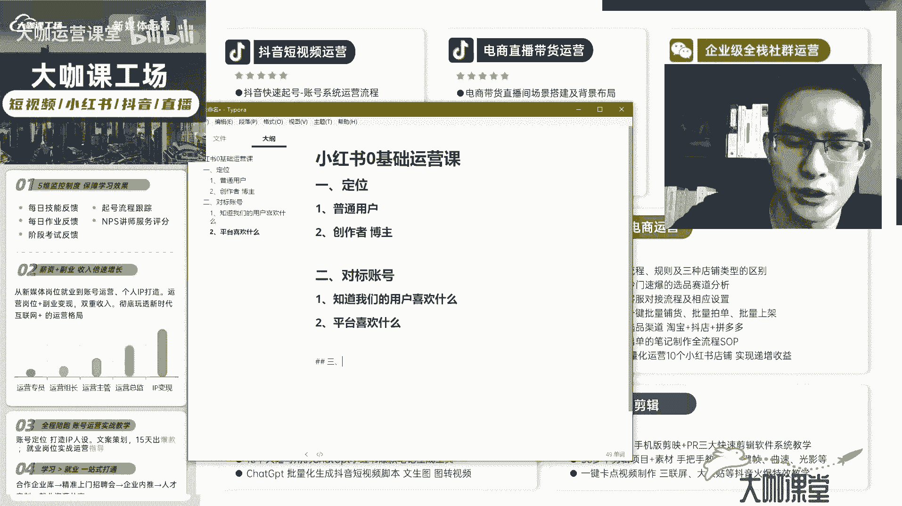

# 【B站最全的新媒体运营教程】小红书起号／抖音直播带货 ／短视频剪辑 ／AI创作 ｜只需7天入门到精通 全方位教你如何玩转新媒体！ - P2：01.1.1：新媒体运营-小红书笔记运营的完整运营逻辑和思路 - 大咖运营课堂 - BV1mb421b7RQ

欢迎大家来到我们小红书运营的这个第一课，好吧，这一刻开始，我们就要正式进入到小红书的整个，运营体系当中了，那么通过这一套内容呢，我们会教大家玩明白，小红书的一个总体的运营流程。

那么我们知道现在我们做小红书，一定不是脑子一热诶，我进去之后，我想做点内容，我想发展内容，我突然之间我就想火啊，我想拥有粉丝，因为什么呢，因为小红书比抖音现在可能稍微好做一点，对不对。

小红书呢那个他毕竟是图文啊，可能对我们来说门槛低一点，但是我要告诉大家的就是，你去做小红书，你一定要明白啊，小红书他到底我们从一个零粉的账号啊，从一个没有笔记的账号，一直做到我们有几万粉丝。

我们有几10万粉丝，上百万粉丝这样的一个账号，它的总体的一个过程是怎么来的，好吧，那这就是整个的一个运营流程，我们把这个东西呢去告诉给大家，那么你以后在做小红书的时候，哎你就知道。

那么我今天想做这个产品，我起这个产品的类目的一个账号啊，不管是给公司运营也好，还是给自己运营也好，我知道剩下的东西怎么去做啊，我有了想法之后，我第一步做什么，第二步做什么，第三步做什么。

那这就是我们要考虑的东西好吧，那么我们废话不多说，就进入我们今天正式的课程内容好，我们一直讲究啊，在小红书运营当中呢，它是有步骤，有步骤和流程的，那么我们一般把小红书的整个运营流程，分为四个步骤好吧。

我们来一个一个给大家讲。

首先第一个步骤是什么呢，首先第一个步骤也就是我们的定位啊。

也就是我们的定位，我们一直讲你不管是啊想做什么东西啊，你是给自己做账号也好，还是给企业做账号也好，你的这个账号啊，做内容一定是要先选好自己的定位，那么有些人呢他做小红书就不一样，诶，他今天发一个美食的。

明天发一个自拍的，后面呢，可能后天还发一下自己的这个什么感想啊，人生感悟等等等等之类的，那么发这样的内容呢，呃呃他可能还比较坚持对吧，发了半个月个把月啊，一两个月可能觉得哎我发的内容。

我设计上都非常精美，因为我出去旅游的时候，我这个照片呢也也也经过设计了的啊，我也经过滤镜了的啊，我的封面啊，标题啊，我也想过了，为什么我的东西就是没爆呢，其实啊这就跟有些人。

他现在做这个小红账号的一个定位有关，你做这个账号啊，我们去告诉大家，你去把这个定位想好了之后，他的一个主要核心思想就在于，你这个账号的内容一定要是做垂直的，做垂直，什么叫垂直。

就是你要去考虑你这一块的内容，是不是你的用户啊，或者说平台他们能不能看到啊，能不能识别到你这个账号，他就是做这个领域的，对不对，那么我们一直讲垂直垂直垂直，那么什么叫垂直。

垂直就是说啊其实就是一个打标签的过程，对不对，那但是很多人对这个东西有一定的误解，他们觉得诶打标签就是啊，我现在来做这个账号，我一直发这个账号的内容呃，比如说我是做美食的，我天天发零食啊。

我发各种美食的这种夜宵啊等等等等，是不是这样的内容一发平台就可以判定我啊，判定我是给我打上标签对吧，我是这个美食领域的一个垂直的博主播，不一定好吧，不一定我们所讲究的垂直打标签有几种方法啊。

有几种有几个有几个你需要注意的点，首先第一个就是这个标签啊，这个打标签它不光是针对你啊。

不光是针对你打标签，针对两个，一个就是普通用户嗯。

普通用户什么意思啊，就是比如小红书平台或者抖音平台，所有的用户他都是有自己独特的标签的，好吧，独特的标签，这个东西呢也是抖音刚开始火起来的时候，能够在互联网干到现在这种程度，他当初引以为傲的一个算法。

什么算法呢，就是他会给每一个用户打上一个标签啊，这个用户诶他浏览什么样的内容频率比较高啊，比如说他经常刷美女的视频，诶，这个人呢他可能就喜欢看美女的，然后这个人呢经常刷汽车的视频诶，刷到了汽车视频。

他就会停留的时间更长，OK系统又给这个用户打上一个，可能对汽车类内容比较感兴趣的一个标签好吧，那这就是给用户打标签，那么给用户打标签的作用在哪里，作用就是为了给这个用户持续推送，他喜欢的内容。

比如说平台他发现这个用户诶，他喜欢汽车啊，喜欢美女好吧，那么我为了能够让这个用户持续留在这个抖音，留在我的这个小红书上面，我就必须得想办法去给他推送这一类的内容，好吧，这是推送这一类的内容。

这就是给平台要给用户打标签的，这样的一个意义好吧，现在呢其实这个玩法呢，所有的这种平台都在用啊，也就是说啊我们现在的这种定向推送好吧，定向推送也就是你们理解的这是普通用户。

那么第二个是什么，第二个就是我们的创作者。

对不对啊，我们的创作者也可以理解为博主，对不对，那么博主创作者，他是平台一定要去给我们去打标签的，那么打标签的意义在哪里呢，我刚才也说了，普通用户抖音识别了他的标签是吧，给他打上了标签。

识别了他是喜欢什么样的内容，那么接下来他就要去给他推相应的内容，那么这个推的东西，它就必系统就必须要确保这个东西它是准确的，对不对，比如说嗯我识别你的一个账号，你做的是这个美女的各类的一个跳舞的视频。

OK那我识别成功了，我就把这些视频推送给这个博主来给这个用户，这个用户喜欢看这类内容，他就可以留下，但是如果如果出现了一个岔子对吧，这个用户呢我给他打了标签诶，他喜欢骑车一类的。

但是我去给另外一个博主打标签啊，这个这个博主呢经常更新一些那个玩具呀，或者什么样的这个玩具里边，可能包含这种小型的汽车模型，对不对，可能包含这一类的内容，或者说有时候一些手工创意者这种呃铁丝绕圈。

做成这种摩托的这种啊这种手办，但是呢刚好我这个用户他只喜欢关注汽车，他对这类内容，他可能他就是他不感兴趣，哎那么系统打错了标签，给这个博主打错了标签，他把这一类的内容往这个用户这里推。

那么就会形成一个什么样的结果，就这个用户呢他看到这个视频他就会刷走啊，就会刷走，那这个时候就给两方造成的影响，一方就是这个用户觉得这个平台上面的内容，他都不感兴趣，他可能会用户流失。

那么另一方面就是用户刷到了你的视频，但是你的视频呢不能让它产生停留，那么这个时候，你的视频会有一个什么样的东西出现，就是你的曝光唉你的这个文博OK没了啊，你的点击你的文波就没了，它会瞬间刷走。

那么系统也会认为你这个东西不对啊，用户不喜欢我，那么我就不给你推流量了，那么这就是我们平常讲到的定位，垂直打标签这一块，这个底层逻辑，底层作用很多人都知道诶，我做账号，我要做垂直，我要打标签。

但是你不知道你打标签的作用到底是什么，你只知道这个东西是给别人推送，对不对，但是你要明白它背后的一个逻辑平台，需要什么样的东西，它为什么平台一定要给你的博主，给你的这个普通用户打标签，那么博主打标签啊。

你知道啊，用户打标签是有多种多样的，它怎么识别你这个用户发布的内容创作者，你就一定全部是汽车领域的，那这个就涉及到我们的一个运营技术，也就是我们的一个垂直对吧好，那么这是关于定位，那么今天给大家扫扫盲。

这是定位啊，也就是说我们不管是做小红书也好，做抖音也好，你一定要考虑的，就第一个一定要把自己的定位做清晰，那么这是涉及到你后面账号能不能被推送，能不能做起来这个前置条件。

OK那么这是第一点，那么第二点是什么，我们经常关注的第二点是什么，第二点就是我们的一个对标账号，好吧，对标账号，嗯我在睡，第二个就是我们的一个对标账号。

OK那么我相信现在有不少同学。

你们应该已经明白，这个东西或多或少应该也听过对吧，我们都跟大家讲，你在做小红书账号之前，一定要先找到你自己的这个对标账号，那么对标账号它的意义在哪里啊，我也给大家做一下拆分对标账号，它的意义就在于。

我们能够通过我们这个领域做的比较好的，这些账号，通过他们发布的内容啊，他们的内容里边标题怎么取得，他们封面怎么去设计的，他们文案里面包含了哪些东西，我们能够发现这种做的比较好的它啊，也就是说这些内容。

它就代表的是我们的用户喜欢的内容，对不对，我们去做这样的一个账号做内容，我们一定要考虑的是这个内容啊，应该是我们的用户，他们是感兴趣的，那如果说你光凭着自己的想象去做啊，我觉得这个东西用户喜欢。

那恰巧这个东西可能用户不喜欢平台，而又给你产生了一波推送，那这波推送呢用户不接收，他不买账，那完了你这个笔记本来可以报的，它没了，那么可能平台认为你这个账号它不优质啊。

那么你的这个过新手期的时间可能会延长，对不对，那么我们现在做对标账号的一个根本的目的。

你一定要明白它有两个点对吧，有两个点我一来跟大家讲，就是我刚才讲的第一个点啊，明白啊，通过对标账号，通过对标账号，我们能知道，我们能知道我们的用户他们喜欢什么，对不对，我们的用户喜欢什么东西好吧。

对标账号里边所能报的内容，对标账号里边啊，这个他的点赞高的啊，他的这个评论多的，评论底下发布需求多的，那代表这种内容，就是我们这个行业的用户喜欢的那这一类内容，你为什么就不可以去模仿对吧，去拓展去延伸。

对不对，那么这就是我们对标账号的第一个作用，啊我把它剪短一点，OK知道我们的用户喜欢什么，那么第二个点还有一个点，还有一个点，那么就很多人不知道，我们找对标账号可以发现一个什么规律啊。

可以发现平台喜欢什么样的内容，这是一个非常有意思的点，好吧嗯。

我们现在做运营运营的是什么呀，对吧，我们运营一个平台的账号，运营的是什么内容，第一个是用户，对不对，我们需要去用我们的这个账号发布内容，去吸引用户，吸引粉丝群体啊，提高我们的数据。

那么第二个我们运营的是什么，运营的其实就是平台的规则，对不对，我们需要去明白平台他喜欢什么样的内容，诶那么平台喜欢什么样的内容，代表着什么呢，它其实就代表着对不对，代表着用户所喜欢的。

代表着平台这个他为了留住用户，用户们所需要关注的内容，给用户们推送的东西，对不对，那么这个时候我们发现了这个规律，我们就可以迎合平台的这个喜好，对不对，我们去做，有时候很可能这些数据对吧。

我们发现一篇笔记它推出去之后，用户在底下的评论不多对吧，然后他的但是他点赞收藏等等数据也还可以，然后他的小眼睛也还可以，这个时候就出现一个什么问题，就是这个内容，可能就是平台发现大部分这个领域人群。

他们喜欢他就会去推送啊，这个博主他做的这一类的内容，它的更新频率等等，这些行为喜好比较符合平台的一个规则，那么这个时候就是我们去找对标账号，它的一个作用对吧，我们需要去发现啊。

去研究我们的用户他们喜欢什么样的内容对吧，我们去找十个对标账号，然后这十个对标账号我们去分析啊，就能分析出来我们用户喜欢什么东西，然后通过这十个对标账号，他更新的内容，他的一个状态啊，他的一些私信。

他的评论怎么做，我们也能发现平台他喜欢什么样的内容，那这个时候我们运营的这两方，是不是都得到了一个解决的方向和路子，对不对，那么这就是我们现在去做平台运营的一，个根本的原则，我们一定是有理可据啊。

这个有据可依的好吧，那么这就是我们这个点啊，我们去找对标账号的目的，这里呢也给大家看一下啊，就是我们去找对标账号，一定不是自己想着怎么怎么啊。

去关注，去看一下账号就完了的，我们一定是要有一个详细的分析的。

那么这里我给大家看一下我们的呃，一个这个对标账号的一个详细的分析的表格，好吧，你们可以参考一下这个表格来，那如果说你现在想做小红书领域的，你们一定可以参照这个表格来分析一下。

你们觉得你们这个行业里边做的比较好的，比如说这是我们一个同学做母婴的账号，对不对，那么母婴里边他可以去关注这个账号，哎他做的是什么呢，他做的是育儿知识分享，还有一个呢是做纯育儿知识分享什么呢。

它就是类似于其他领域的这个资料分享的类型，还有一些是做宝宝辅食DIY日常的，它的数据怎么样，他做了多久，这个账号才能实现这样的一个呃效果，比如说有些账号哎他有7万粉丝，但是呢他做了才不到半年。

然后他的内容呢更新第一篇是在这个半年前诶，他现在这个数据增长的特别猛，那是不是我就可以考虑这一类的内容，比较它的用户群体特别庞大，而且这个内容更吸引人，对不对，那比如说我做这个宝宝辅食的。

宝宝辅食的可能受众群体小，对不对，然后呢他的这个粉丝呃可能有个56万，但是呢他的这个账号做的非常久，19年就开始做了，做了这么久才6万的粉丝量，但是他的这个所有的现在的笔记数据呢，也还过得去。

他的这个设计风格等等也还行，那这个是不是可以我们作为避雷，或者说我们可以做参考的一个点对吧，那这就是我们去找对标账号，去分析我们的一个做内容的方向，分析我们后期要避开的坑啊。

这就是我们做找对标账号的一个根本的意义，你需要去分析每一个，你这个账号可以做参考的点好吧，这是我给大家列出来的一个呃方向，那么如果你要去做小红书，那这个时候你的这个对标账号，你就可以按照这个表格来好吧。

那么这是关于对标账号，那么第三个点好吧，第三个点就是我给大家讲的，我们运营一个账号，从这个账号开始，没有啊，没有这个笔记啊，粉丝也没有从零开始，我们的第一批第一篇笔记完整的产出之后，他的第三步是什么。

第三步就是，他的第三步就是选题咳。

那么什么叫选题啊，我跟大家讲一下这个概念，就是我们现在去发布小红书的笔记，一定不是凭着凭着我们自己的想法，就比如说我们觉得诶我今天发什么内容比较好，可能说这个用这个东西呢是我灵感一貌。

这个东西啊可能发出去比较好，用户可能喜欢对吧，所有这一类的东西。

那么这个点我告诉大家，千万不要这样去做，你现在做小红书讲究的是什么，讲究的是短期快速效率啊，能够迅速出爆款的这种结果，那如果说我们在这个行业里边，我们坚持去发发个半年年榜，其实也可以起来，对不对。

也有一定的机率起来，你把这我前面这两个点做好，其实也有一定的几率起来，但是我们现在讲求的一个什么，讲求的是一个效率，讲求的是一个速度，那这个时候我们就要保证，我们所做的每一篇笔记，它需要符合什么点。

需要符合这两个点对吧，我们对标账号这里的两个点，第一个我们的笔记一定是我们用户喜欢的，第二个我们的笔记一定是平台喜欢的好吧，那么可能我在这里跟大家讲的平台喜欢什么，还有用户喜欢什么。

这两个点其实很多人觉得他是重合的啊，但这里呢它不是重合的，那么后期我会跟大家详细的去讲，怎么去分析这个笔记是用户喜欢的，还是说平台喜欢的。

那么怎么去从哪些方面去佐证啊，怎么去发现这些选题，那么这就是我们跟大家讲选题的这个重要性。

呃选题呢我们其实把它分为三个阶段啊，也分为三个阶段，这三个阶段其实就是我们的一个账号的前期，中期以及后期，也就是说前期也就是账号，我们我们发的第一篇笔记，一直到我们的第30篇笔记以内，这几篇笔记里边。

我们发的选题都是根据什么来的。

那么这我们就会去一一告诉大家，嗯比如说啊我把这个给看一下啊。

比如说我们告诉大家去选题，首先初期初期我们要做哪些选题。

它的内容在哪里对吧，那么这就是我们要跟大家去讲，一定不是选题。

一定不是自己想什么啊，就发什么，一定是有依据的好吧，这是我们后期要跟大家讲的，那么这是第三个选题，第四个是什么呀，嗯嗯第四个是什么呀，我们刚才是不是已经看到了，对不对。

第四个其实就是我们小红书的一个内容，对不对，也就是我们的内容板块啊。

小红书的内容板块啊，我们先说图文笔记，它包括什么呀，图文笔记其实就三项对吧，就三项，第一项就是我们的标题对吧啊，其实第一项就是我们的封面啊，第一项就是我们的封面，第二项是什么，第二项是标题。

第三项就是我们的文案好吧，每一样都有它独特的我们要去研究的东西，比如说封面，我们要把封面设计的足够吸引人，足够有吸引力，用户看到封面的第一眼，我就想点进来好吧，我就想点进来，那么呃你像我们现在刷小红书。

刷这个小红书，小红书它的它的这个呃呈现形式，封面一定是给用户带来视觉冲击力，最大的一个板块，对不对，那么我不说全部啊，至少说大部分刷小红书的用户，他首先第一眼映入眼帘的，那么可能啊肯定啊他就是封面啊。

就是封面，还有一部分人呢，他就啊对标题可能觉得特别敏感，但其实吸引我们眼球的第一个肯定是封面，封面上要有什么呀，要有内容，对不对，那么我们封面上要有吸引用户的点，那么用封面好看哎。

仅仅吸引起了我们用户的兴趣，那么用户呢对这个封面产生兴趣之后，他就会看你的标题，标题上面我们需要标注清楚，我们这个这个笔记是关于什么的，对不对，比如说我们是关于这个呃结婚的时候，这个首饰的一个选择诶。

他觉得这个东西我刚好需要，对不对，那我就点进去看一看，那么进去看了之后，进去之后就是什么东西啊，进去之后就是我们里边的文案，以及我们封面上面包含后面的一些图片，这些内容就是我们要呈现给用户的。

那么其实你做好了前两部内容啊，那么你就已经成功了一半了，懂不懂，成功了一半了，那么剩下的就是用户需要对你的一个文案，和你的图片感产生兴趣，就说你要有价值提供给它，那么它才会对你的笔记产生一个什么呀。

点赞对吧，收藏这么这两个数据就能够形成你这个笔记，它的一个推送的一个前提，对不对，持续推送的前提也就相当于我们做抖音的时候，流量池对不对，完播率啊啊，然后他的这个呃，以及这个点赞分享等等等等这些数据。

那么我们文案的价值，其实它就它就需要体现在这里，我们就需要把这个文案做的足够优秀。

让用户能够产生点赞以及收藏的这种冲动，让我们的笔记能够持续往流量池里面，更深层的流量池里面去推，那这个笔记就成为了爆款，它是必爆无疑的，这就是整个小红书，它的笔记从零开始一直到爆款。

爆款出现的这样一个整个逻辑。

那么我相信啊，我今天给大家梳理的这个逻辑，一定是颠覆了很多人对小红书运营的一个，整体的一个啊，就是你的这个价值观啊，也就是说你的这个认知好吧，颠覆了你的认知啊，就是说很多我们很多人现在可能接触到的。

看到的一些视频，看到的资料都非常片面啊，非常片面，或者说非常老旧，你看的都是几年前的东西，跟现在这个完全没法比，那么我们是以完全实战派的啊，这个内容是以完全实战派的，去教大家怎么去运营，怎么去做啊。

那么首先第一个定位对吧，第二个去找对标账号，对标账号它的作用在哪里呢，然后呢我们怎么去找选题，我们需要选题，我们发的内容一定是有根据的，这个内容一定是是是什么呀，是我们的用户才喜欢的。

以及我们平台他当下喜欢的，还有我们的内容这块封面标题文案，它是怎么样让用户产生一个点击的冲动，然后接下来呢给我们的笔记提供一些数据，像点赞收藏评论这些好吧，那么这就是我们这一堂前置课要给大家聊的。

关于小红书运营的整个系统逻辑，那么下一堂课我们就正式进入到了小红书的啊，真正的运营当中了，好吧，那么我们呃一定要把这个视频收藏好好吧，如果喜欢的给老师送个鲜花啊，给老师啊，收藏点赞，评论一下。

鼓励一下好吧。

