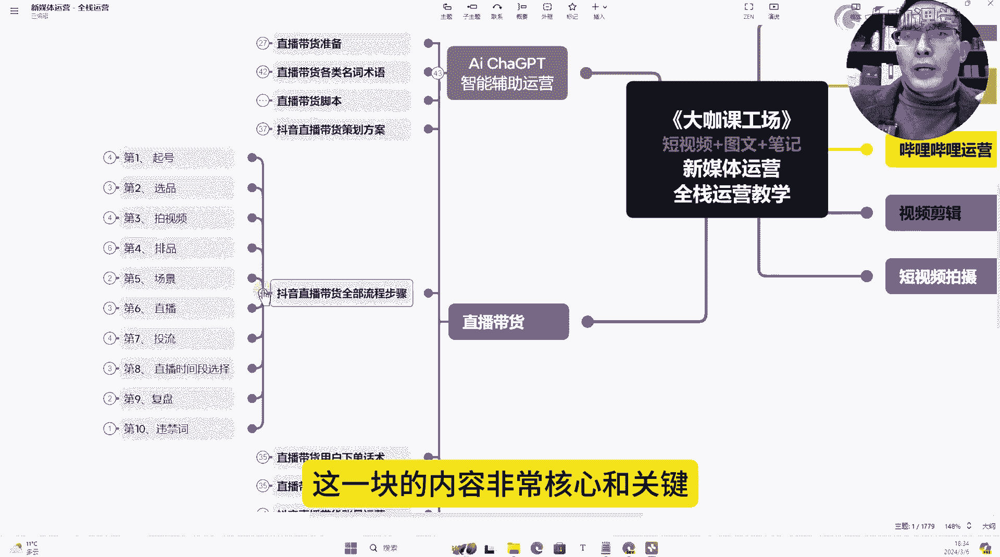
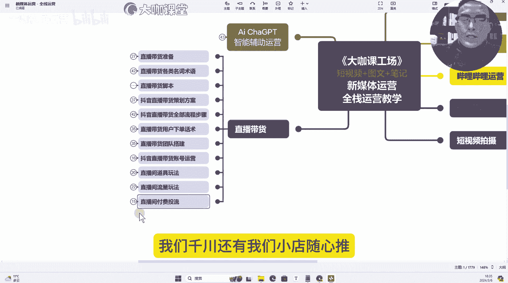
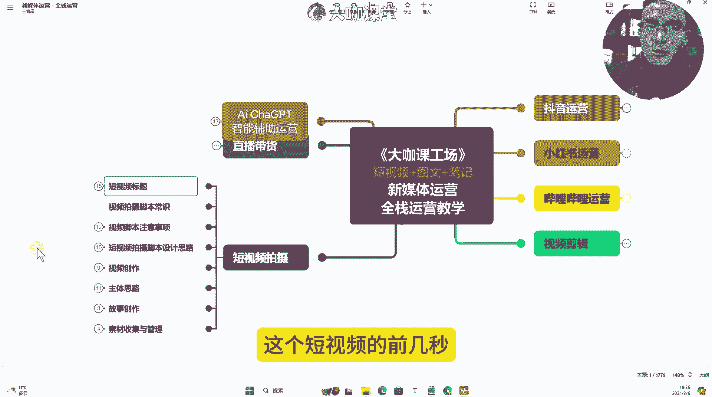
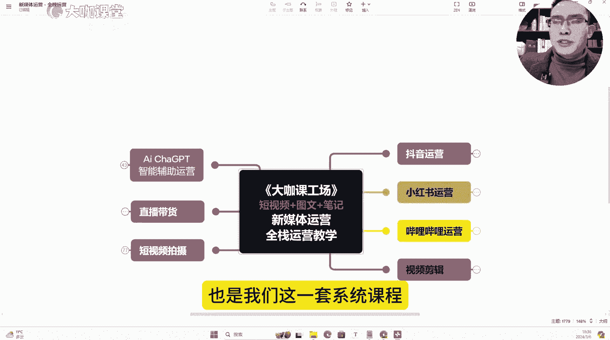

# 【B站最强新媒体运营课程】零基础必备全平台运营技巧 小红书运营技巧／短视频拍摄／抖音直播带货／文案写作技巧 一次性学完学会！ - P1：001.2024年最强新媒体运营学习路线规划图 - 大咖私域运营 - BV1gVWaeZEJJ

好欢迎大家来到大咖新媒体课堂，我是大咖课堂的方宇老师，2024年，我们每一个想要做好新媒体这个领域的同学，不管是自己做账号还是新媒体就业求职，或者是咱们的企业主。

想通过互联网这么一个媒介来推广自己的产品，那么有三个方向，是我建议大家必须要学习和掌握的，一个呢是短视频运营，还有一个呢是直播带货，另外一个呢是我们的图文笔记运营。

这三个方向呢涵盖了当下互联网的三个核心，主流运营点，那么现在我们一起来看屏幕上的这份新媒体，全站运营思维导图，那么这一份的思维导图呢，我们一共有1779个节点，包含4万5210一个汉字。

那么我们具体来看一下这一份思维导图，它到底在我们这一套后续的课程当中，能够教给我们哪些东西，首先我们来看关于抖音运营，这个呢指的是短视频运营板块。

我们来看一下它的内容体系，首先呢在短视频运营板块呢，我们需要去学习一些短视频的一些基础，像抖音这个平台的它的一些概念，或者说我们需要一开始去做账号，我们需要去了解的一些官方号。

能够提供给我们的一些流量扶持，和我们可以看到一些呃。

平常分享的这个活动等等这一些内容，那么关于短视频流量算法这一块。

我们需要去学习整个流量算法的一个基础，包括账号的一个冷启动，然后呢数据加权。

还有呢延后爆发，流量触顶等等，这些是我们的流量算法，还有我们五个最重要的数据指标，怎么去拿下这些数据，然后呢我们最核心的十个运营的要素。

这些呢都是我们要去做短视频运营这块，要去了解的，以及我们做抖音这一块。

要去关注的账号的全局定位，账号的一个布局情况，我们短视频流量的一个分发啊，它的几个最重最重要的点以及我们的小店，还有我们账号权重的一个管理，我们怎么去提升我们账号的一个权重。

我们的账号呢怎么去养号，以及我们怎么去打造我们的垂直领域。

还有短视频运营的一些细分的技巧，我们怎么通过抖音这个平台呢，去实现个人账号的一个变现模式，以及抖音这个平台上面的一个，矩阵运营的方法啊，还有我们的快速起号的赛道。

这是我们这一套视频要提供给大家的，关于短视频这一块，那么关于短视频这一块呢，我需要给大家说一下，就是抖音，目前作为我们互联网这个比较主流的一个，核心的互联网的新媒体平台。

那么我们掌握它的短视频运营的技巧和方法，那么我们可以思考一下，其他的平台是否能够去共用呢，比如说我们现在的视频号，我们的这个快手，还有西瓜视频等等这些短视频平台，你们觉得这个方法其他的平台能用吗。

这是关于抖音短视频板块。

其次呢就是我们最核心关键的小红书运营板块，那么小红书是我们当下最经典的一个。

图文笔记运营平台在这一块呢，我们需要去学习整个小红书系统化的一个，起号的方向和思路，也就是说当我们去做小红书这个平台的时候，我们第一步应该做什么，我们起号的第一步应该做什么，第二步应该做什么。

我们的定位垂直怎么去打，然后呢，我们怎么在我们这个赛道找到可以弯道超车的，这种差异化的内容组合，这个是我们快速起号要去考虑要去学习的东西，还有呢我们在小红书这个平台呢，去做官方号的运营的时候。

我们怎么去玩转这个平台的一个机制，怎么配合我们的品牌以及素人号的运营。

把我们的这个品牌的一个，整个在小红书上面的这个铺设给它打开，还有呢我们小红书最关键的六个，可以给我们带来一定流量的这个隐藏的流量值，不要小看它，它在我们喜好的前期带给我们的帮助非常大。

还有呢我们关于小红书素人号的一个运营方法，以及我们的私域引流到底怎么去做，那么小红书相信大家，如果说你们呃有去想去做这个平台的，你们应该知道小红书的私域引流是很多客户的，他们的一个重要的需求点。

还有呢就是我们店铺运营怎么去做，以及我们小红书的达人种草的一个运营，小红书KOCKOL怎么去结合。

我们怎么去找，然后广告报价返点，我们去自己去做这个账号变现的时候。

到底怎么去收取，怎么去谈，这个是小红书板块，还有我们独家去研发的。

关于哔哩哔哩这个平台的一个运营方法，运营体系，那么B站这个平台的一个算法机制，它的我们去选择不同赛道，他的一个用户画像到底是怎么样，然后呢我们刚开始起号的时候，选择哪些赛道。

比较容易能够得到哔哩哔哩这个平台的一些，创作激励的一些扶持，还有呢我们关于内容运营这一块，怎么去把我们up主和平台之间的关系，结合的更加紧密，还有呢我们的爆款选题方向，以及我们内容运营的一个流程。

我们B站的一个商业属性，我们品牌方的入驻，怎么去完成这一块的一个内容的啊契合度，还有呢我们自己个人账号的一些变现的逻，辑和方式，有哪些可以让我们up主直接变现的一些呃渠道。

那么呢还有关于品牌号的一个营销运营。

以及呢我们举证号这一块的一个运营啊，这是我们哔哩哔哩平台。

那么剩下的比较重要的一个，就是我们的一个直播带货了，那么直播带货这一块你可以说你暂时不去做，但是你不能说你不了解，直播带货是我们当下新兴的，最火的一种电商营销模式，互联网的电商营销模式。

你去做直播带货，你就必须得知道，直播带货的人货场到底怎么去搭，直播带货的前中后期，我们应该准备哪些东西，怎么把这场直播给他做好。

以及直播带货各类我们需要去了解的，它的名词术语到底代表了什么意思，它能够带给我们什么样的一个结果。

还有呢最关键的直播带货的脚本到底怎么写，这个脚本我们需要怎么去拿下。

我们在直播间的所有的人群，那么这是我们关于脚本，还有呢直播带货的一个策划方案。

直播带货全部的流程和步骤，他的旗号选品视频的拍摄。

短视频的一个结合运营牌品场景，直播投流以及我们数据复盘等等，这一块的内容非常核心和关键。

还有呢就是我们抖音直播带货的一个账号，的一个系统化的运营，我们从零开始启动一个要做直播带货的账号，我们到底怎么把这个账号的，能突破前期的这么一个呃新手期，或者说我们这个这个直播带货。

能够把我们这个自然流和付费流，能够完整地结合起来，这是我们直播带货的一个账号运营，还有我们直播间的一个道具的玩法，我们直播间的一个流量的一个细致的玩法，自然流，我们账号的一个权重到底是怎么来的。

然后呢我们付费投流，我们签穿。

还有我们小店随心推，这些板块的内容到底怎么去做，那么这是我们这一套系统课程，要带给大家所有的内容点。

然后呢最后两个啊，最后三个一个是我们的短视频拍摄和视频剪辑。

这两个板块就不多，不用多讲了，视频剪辑是我们必须要去学的，我们的视频剪辑呢融合了我们目前剪辑，我们短视频这一块，配合短视频这块剪辑最核心的点转场特效定格，关键帧，还有我们所有的这一块短视频的一些打法。

到底怎么去给它剪辑出来。

这是我们视频剪辑这一块的内容，还有呢关于拍摄拍摄这个东西呢，我们需要考虑到的是。

就是我们短视频的一个标题，还有我们的一个脚本，怎么去写我们短视频的一个构思，我们的选题方向，我们的文案到底怎么去写，我们怎么样通过我们去构思这个短视频的。

前几秒去克制我们的人群，来拉高我们的这个完播率，那么这就是我们在短视频创作这一块，需要去考虑的，它不光考验的是你的一个拍摄手法，还考验你在短视频这一块它的一个结构。

这是我们关于短视频拍摄，还有视频剪辑，那么还有一个非常重要的点，也是我们这一套系统课程。

独家的一个最优化的点，也就是说跟着这一套视频学下去，你能学到一个非常关键的。

我们目前ChatGPT AI，智能辅助运营这一块的内容，那么我一直说我们现在做于互联网的运营，AI chi g b t是我们做运营的，必须要去掌握的东西，我们可以想一下，我们目前做整个新媒体。

我们是基于什么样来串联，我们的用户和我们之间的一个关系呢，是基于内容，那么内容是由什么东西产生的呢，就是由我们的文字产生的，那么我们目前接触到的最牛的下载GPTAI，这个系统，它就是一个文字生成模型。

它能够帮我们去拆分我们的一个爆款啊，帮我们打造我们的一个人设，帮我们写我们的短视频脚本，那么我们以前直播间的脚本，短视频的脚本很多都是我们自己去写的，但是呢现在有了这个AI ChatGPT。

它就可以来帮我们生成，只不过我们很多人可能会遇到的一个问题，就是明明这个ChatGPT，我们可能使用的就是plus版的4。0，但是你没有办法让他配合，你把这个内容写的就是让你足够满意。

这个呢可能基于什么呢，基于一个是我们的对话模型，另外一个呢可能是我们PROMAP的一个指令，调教方式，我们没有用好，那么这个AI其实我一直跟大家说，他就是一个机器人，一个非常聪明的机器人。

他的知识库比我们任何一个人都要庞大，你知道的他知道，你不知道的他也知道，但是为什么有时候我们对话，就是没办法满足我们的需求呢，就是因为我们没有办法，我们自己不知道怎么去让这个机器人。

他去充分的了解我们的一个跟他对话的需求点。

那么我们就需要学习，整个chi g b t到底怎么去把它用好。

我们怎么去快速上手ChatGPT，还有我们的一个进阶的教学，还有呢我们整个AI对话功能这一块，我们去了解3。5和4。0，对话模型的一个区别，还有呢我们去利用一些特殊的方式来训练，我们的AI。

让它能够更好的理解我们的一个呃产品，或者说我们对话的意思，以及我们去搭建一个非常成熟的，能够帮助我们工作上真正实用的一个GPTS，这么一个小程序啊，这个程序呢是呃GPT平台上面的啊。

我们去搭建这样的一个程序。

让他专门为我们这个行业来服务，这就是我们要去了解整个AIAI这个东西，你要用好。

它真的是需要一定的方法，如果你用不好，那么你真的只是一个娱乐性的对话工具。

这是我们这一整套视频，要带给大家的所有的学习方向，那么这些东西呢你掌握了之后，你在互联网上，你做任何一个行业，你做任何一个产品，你都会有非常清晰的思路，你能够知道在这个方向上面。

怎么去找到互联网上我对应的人群，然后呢怎么去通过我的内容展现形式，把我的产品推送给我的用户，并且让我的账号，他的流量逐步上升的这样的一个态势，最终让我把这个账号给它做起来，这就是整个系统化的教学和方法。

然后呢我们现在屏幕上的这份思维导图，以及我们后续课件当中涉及到的一些资料，我们都会分享给大家，那么这些内容呢，同学们可以在我们视频下方的置顶评论区，以及我们视频下方的简介信息。

可以领取到我们这所有的资料，那么这是我们这套课程，我们这套视频的一个关键核心点，那么希望所有我们屏幕前的各位同学，觉得这个内容还行的还可以的，请不吝啬给我们的视频来个一键三连。

或者说分享给你身边的朋友或同学，让他们来看一看最新的互联网这块的流量，和我们的一个账号，它到底是怎么玩的，那么我们下一节课就正式进入。

