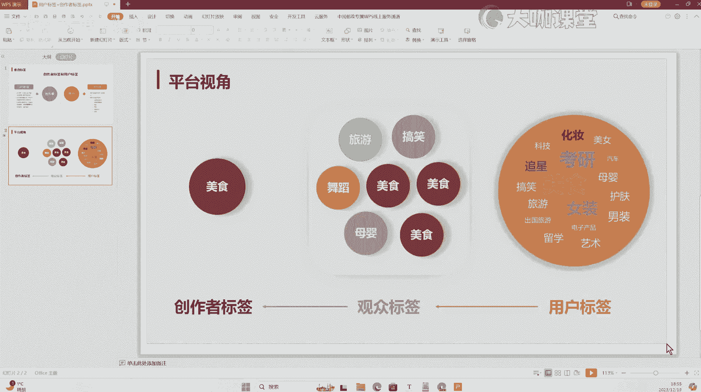

# 【B站最强新媒体运营课程】零基础必备全平台运营技巧 小红书运营技巧／短视频拍摄／抖音直播带货／文案写作技巧 一次性学完学会！ - P3：01.1：全网首发 账号垂直标签 平台核心流量分发算法 - 大咖私域运营 - BV1gVWaeZEJJ

Hello，大家好，欢迎大家来到我们这一堂课，呃，我们这堂课呢主要跟大家聊一聊，关于创作者标签和用户标签这两个东西，还有就是我们时常经常听到的啊，垂直标签啊，给这个创作者打标签，账号打标签。

这个标签到底是什么东西，这个标签怎么来的，那么我们来聊一下，这个底层的一个平台的算法和逻辑，那么其实之前呢我有在视频当中给大家分享过，就这个东西它是什么意思啊，怎么来的啊。

也通过一些图鉴的方式帮助大家去了解，但是有些同学还是反馈说呃，还是没有太理解啊，就是说半懂不懂的一个意思哈，那么所以说呢，这一节课我就用呃这么几个模型的方式，还有我们具体内容的一个形式来告诉大家。

这个东西它到底是怎么玩的啊，这个东西到底怎么来的，平台到底怎么去给我们的账号打标签的好吧，那么首先呢我们来看一下啊，这里有一个创作者，一个用户创作者呢他有一个创作者的标签，那么我们知道在第一个啊。

就是你这个账号发布第一个内容之后呢，平台会识别你为创作者加用户的一个双重身份，什么意思呢，呃就是只要你发布的内容，它会把你判定为一个啊创作者这样一个性质，但是这个时候你是没有明确的标签的，也就是说。

这个时候平台他并不知道你创作的内容是什么，那么这个你不要去管诶，我拍的是什么，我拍的是母婴的旅游的啊，相关的我的标题也是这么写的，这些东西都没用，我跟你讲平台，他不会去分析你的视频。

你的笔记里边讲的是什么，他只会通过用户的一个反馈，来判断你的这个内容到底是属于什么的好吧，那么下一步我们就来讲，这个东西到底是怎么判定的好吧，那么这个就是我们要跟大家讲的啊，作品啊。

它平台是无法精准定位的啊，但是这个时候会有一个什么呢，它会给你一个基础的流量数据观测，我们的一个标签，用户的一个浏览行为啊，这些浏览行为呢逐步给你的视频去加分啊，让平台来判定你的账号发布的都是哪些内容。

你的这个视频的内容是关于哪一块的，这就是平台判定的一个方法，是不是非常非常智能啊，非常高端好吧，那么这是我们关于创作者标签这一块，然后关于用户这块呢，呃我们要了解用户标签的几个特征啊。

用户标签的几个特征，我们只要开始用抖音或者小红书这么一个软件，你立马就会有一个标签，这个标签呢它具有多种多样的一个性质，并且呢是一个交叉集合的这样的一个性质，而且呢用户标签呢它还存在一个什么呢。

存在一个可变性，什么意思，就是说你比如说我们抖音啊，你会发现你现在去浏览一个视频，你这个视频呢呃你观看的时间稍微长一点，或者说完播率达到了70%左右，那么你剩下的你会频繁的刷到，跟这个内容相关的视频。

那么怎么破除，就是你刷到这一类的视频，要么就是你手动点击不喜欢，要么就是你刷到的快速滑走，不要再去看，但是呢按照我们正常的一个啊用户行为，就我自己使用的一个感官来讲，我前面浏览过类似的视频。

你后面再给我推，那么可能我还是会去刷，我还是会去看，那么这就是你用户标签短时间的一个可变性，好吧，这就是我们内容浏览时长，小红书也是一样，它没有抖音这么夸张啊，但是他一样会根据我们用户在某篇笔记里边的。

一个停留时间，停留时长，来判断你对这篇笔记的一个感兴趣的程度，OK然后另外一个就是我们的点赞收藏，收藏的一个数据，这个来的更直观嘛对吧，你点赞了哪些视频，你收藏了哪些数据。

平台就能知道你喜欢哪些的内容好吧，然后呢其次就是我们的地区啊，地区呢就做我们线下的这些活动啊，啊的门店相关的一些内容，还有我们的年龄，我们的经济能力，我们的设备等等，这些都是在后台可以去观测到的。

你这个当前这个用户的它的一个标签啊，就这样一个划分，OK这是我们初步跟大家讲一下，创作者标签和用户标签的一个概念。

那么接下来我们就要通过这样的一个内容，去看一下创作者标签和这个创作者标签，它到底是怎么来的，它跟用户标签之间的一个呃，这样一个相互引导的一个关系，好吧，那么我这里准备了三个内容。

我们用这个幻灯片的形式来看啊。

首先呢我们点击啊，从当前开始，呃这是我们的一个平台视角，OK那么我们看一下，首先呢这是我们的一个创作者标签对吧，这个时候呢就是我们发布了视频之后，我们账号刚起号的阶段，我们是没有标签的。

这是我们的一个标签没有的啊，这个是无的，也就是说平台这个时候，他没有办法判定你是什么内容，OK那么下一波他就会给我们推荐什么呀，给我们推推荐我们的观众啊，就是把我们的视频分发一一波，一部分这个基础流量。

就是有一部分这个基础的这个用户来观看，这些用户呢他们都是有标签的，这些标签可能是旅游，可能是搞笑，可能是舞蹈，母婴美食等等，相关的，每一个用户都有它的一个核心的主标签啊，核心的主标签。

那么这个时候呢这些用户来观看了我们的视频，并且给我们的视频呢，形成了一个啊基础的互动数据，假设说你现在的账号，你发布的是母婴相关的内容啊，那么我这里准备的比较直接，比较明显，假设你现在发布的是美食啊。

不对是美食相关的内容，那么我们来看一下这些数据，给我们提供支撑之后，能够就把我们的账号判定成什么样的一个啊，首先一个旅游的用户看了我们的视频，OK这个时候呢你因为是美食。

可能假设啊这个人他对美食不感兴趣，OK他滑倒了好吧，第二个是搞笑啊，这个人呢他的主要标签就是看各种各类的，国内外的这种搞笑的段子啊，视频之类的，他对美食不感兴趣，OK那他划走了。

接下来是舞蹈的一个特别喜欢看各种舞蹈的，看各种美女的这种账号，他来点击了你的视频，OK没有完播立马划走，那么接下来诶是一个美食的观众，诶他看了你的内容，这个时候呢。

他停留的时间比前面其他的用户停留的时间诶，长了一点，甚至说他还有可能给你点了赞收藏啊，那这个时候呢你就有一个基础的一个加分项了，OK这个时候加了一分好，那么我们接下来看，剩下给你来了一个母婴的用户。

这个母婴的用户呢，他平常就关心一些育儿啊，或者说带娃的等等相关的一些内容，特别喜欢看小孩子相关的视频是吧，那么他可能看到你的视频他并不感兴趣，但是呢呃他可能呃平时也吃一点美食嘛，他看了那么一下。

浏览的时长比前面的稍微长了一丢丢，但是还赶不上刚才我们那个美食的用户诶，他也划走了，那么这个时候呢可能只加那么一丢丢，那么前面的一个美食可能加一分，这个时候呢这个母婴相关的用户，他可能进去呢加了0。

3分，那么前面的其他的用户没有加分，OK我们再来看剩下的又来一个美食的用户，OK这个美食的用户他就是喜欢看美食，它的核心的呃标签就是美食，天天看各种美食，分享各种美食的做法玩法等等。

那么他又给你增加了一个停留时长，又给你的视频加了一分，那么这个时候我们就有2。3分了，好那么接下来我们再看还有新的视频啊，新的用户进来，这些新的用户进来，他也是关注的是什么美食区域的。

OK他又给你加分了，因为只要是跟你这个标标签相关的，你制作的内容没有问题的前提下，那么你这个领域领域的用户刷到了，他是一定会给你形成加分项的，OK那么这个时候呢你的这个账号。

你发布的这个视频就有一定的分数，那么我们把这个量扩大之后啊，我们把这个量扩大之后，是不是就能得到一个数据，是不是哪些用户，他在你的是一个视频里边停留的时间最长，甚至说形成了互动的行为。

是不是非常好的去判定呢，这个这个你的视频是什么内容，那么平台呢它就是通过这种形式来判定的啊，虽然说我这里把它简化了，但实际上这个过程还是比较复杂的，没有我演化的这么这么简单。

OK那么完成了你的账号就有了一个基础标签，诶，美食的是吧，这个东西就出来了，这就是我们整个创作者标签和我们的观众标签，也就是我们用户标签之间的一个协作的过程，那么我们千万不要以为就是很多人有个错觉。

我们的内容平台判定我们的内容，是通过我们的文案呢，哎通过我们的视频内容啊，啊我们的这个标题，还有我们提供的这个呃，文案里边的标签来判定的，这个不是的哈，就是平台上面现在千人千面。

它实现的一个逻辑是跟用户息息相关，平台判定的内容，他不看你内容讲什么，他只看用户给你的一个互动行为，OK当然呢也会有一点啊，也会有一点有一点基础分数项，但是不会特别夸张啊，特别夸张，他不会说。

因为你标题带了美食，你标题是某个地方的小吃，他就认为你的内容是美食相关的，不到这种程度。

因为呃平台的算法确实非常智能啊，K，那么接下来我们再来看一下，关于用户标签这个东西啊，也就是平台上面他们去呃呃去收集的。

或者说他们收集的这个用户的相关的一些数据，那么我先退一下啊，嗯稍等一下，我们来看一下啊，我们这里有美食对吧，我这里呢以一个美食用户的一个关注角度，我们来研究一下平台对用户这块的一个数据，标签的一个划分。

首先呢呃这是一个美食的用户对吧，美食标签为主的用户，这个标签里边我们讲，假设这个用户他就是以看美食为主是吧，那么他的标签这个一定是最大最亮的，OK那么其次呢还有像什么考研啊，追星啊，女装啊。

旅游出国旅游留学艺术，电子产品，男装护肤等等等等。

K，那么这些呢都是这个用户它会具有的标签特性，这也是我们前面跟大家讲的呃。

用户标签的一个交叉集合，它是各里各个层面都有的，就像我们刚才跟大家提到的吧，我们有一个呃这个母婴相关的这样的一个标签，它不是移到这来了吗，对吧呃，但是呢他只加了0。3分，可能他关注的一个重点是母婴。

但是呢它里边又有一些美食相关的标签，他在里边停留了，在你的视频视频里边呢停留了一段时间，然后呢给你的视频通过这样的一个标签，给你加了一点分，这个也是一个啊基础的一个加分项。

然后这就是我们整个平台去收集用户标签，的这么一个逻辑和流程，K那么如果说现在屏幕前的观众，你们对我打的这个标签，你们来分析一下对吧，你们来分析一下这样的一个用户，他是什么样的一个用户，啊。

啊我们来看一下这个这个用户，他会是一个什么样的用户，首先美食女装考研化妆追星，OK是什么呀，很明显嘛对吧，一个女大学生哦，这样的一个人群画像她就出来了，平台是非常容易能够通过这些东西去判定，这个用户。

他是什么样的一个身份，什么样的一个角色，他喜欢什么样的内容，我给他推什么样的内容，这就是平台上面非常厉害的一种，根据内容来留住用户，根据用户来判定你内容是什么东西，你的这个账号是做的什么内容。

讨不讨用户的喜欢，你的这个视频的质量等等，这样的一个整个的逻辑，那么我相信通过这样一个呃动画演示的过程呃，我们很多观众应该能够理解，所谓的我们现在各大平台上面的一个呃，根据兴趣来分发内容的一个整个逻辑。

这也是我们呃流量的一个来源途径啊，也就是说平台为什么会给我们分流量，为什么会有我们的用户来参与评论，参与我们的互动收藏等等等等，这是它的一个整个过程，而这个标签呢，也侧面体现了我们现在很多人讨论的。

一个什么东西啊，就是我们现在人呢，他每一个人在互联网上都是透明的，你是没有隐私的好吧，你只要去用了他的平台，你去用了他的软件，用了他的app啊，你刷了它的内容平台，就会立马形成你的一定的标签。

而且这个标签还会逐步进化啊，逐步演化啊，去贴合你个人的一个使用习惯，把你的方方面面给透露出来，这真的是一个非常牛的一个存在啊，也就是我们现在很多人担忧的一个东西，就是呃你们以前说的这个大数据对吧。

呃互联网上的信息透明，这个你们通过我这样的一个讲解和演示，大概大家都能够知道好吧。

这是关于呃我们运营去分析这个呃，就是算法和流量推荐逻辑的这个最第一步啊，就是你必须要明白创作者标签，它到底是怎么来的，它是一个什么东西，平台是怎么给你打上这个标签的，你的用户，你的流量是怎么来的。

这是我们整个核心，OK那么听完这个视频，如果你觉得牛逼的啊。

请把我们这个视频收藏一下，给我们点个赞，一键三连。

