# 【B站最强新媒体运营零基础教程】2024吃透全平台运营技巧 小红书运营起号／抖音直播带货／短视频拍摄剪辑 7天出爆款看这个包的！ - P38：20：新媒体运营-小红书内容选题-账号中期 - 大咖私域运营 - BV1XW421R7wF

OK好，欢迎大家来到我们这一节课，那么上一节课呢，我们讲了关于小红书内容选题的一个初期，那么我们简单回顾一下初期里边的内容。

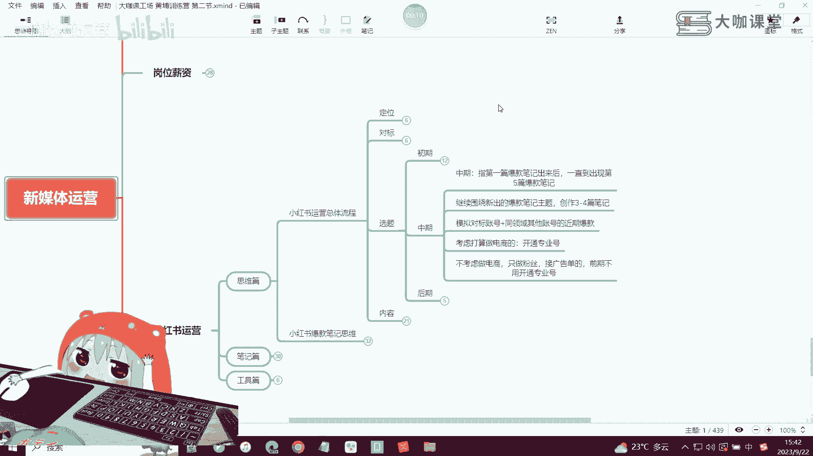

我们讲到指的是我们小红书账号刚起号，或者说调整账号之后的一个开始阶段，这个阶段的话大概是一到两周，或者说是半个月左右的一个样子，那么这个阶段你需要去发布的一个内容，它是依靠这五个点来做的。

首先第一个是关于搜索发现，那么搜索发现就是我们点击搜索框之后，然后下面出现了一个类似于抖音的一个热点，或者全网热点，这么一个东西，那么搜索框呢我们也之前也讲过，就是你点击了搜索之后。

那么搜索这个界面给你弹出来的这些推荐词啊。

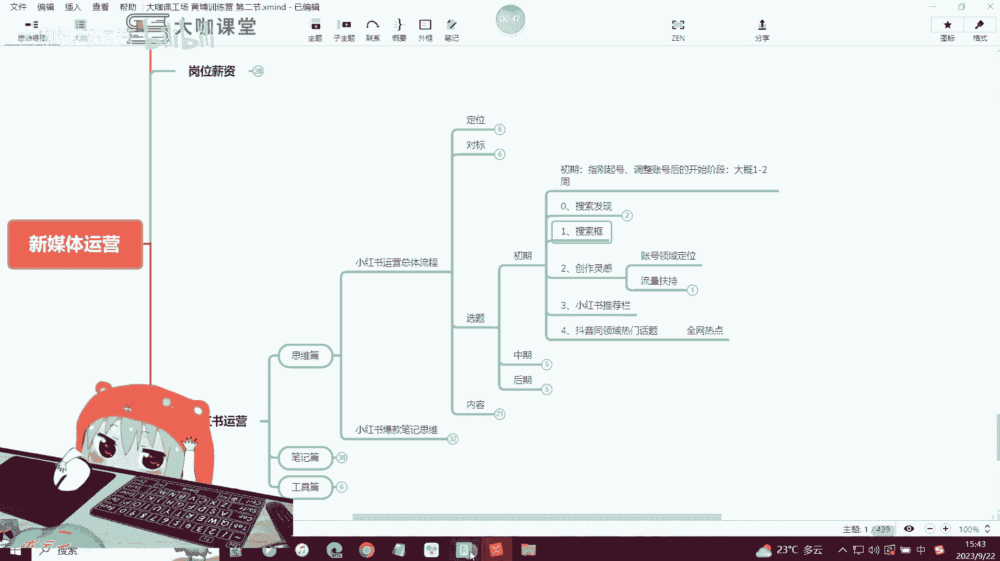

下面给你弹出来的这些推荐词。

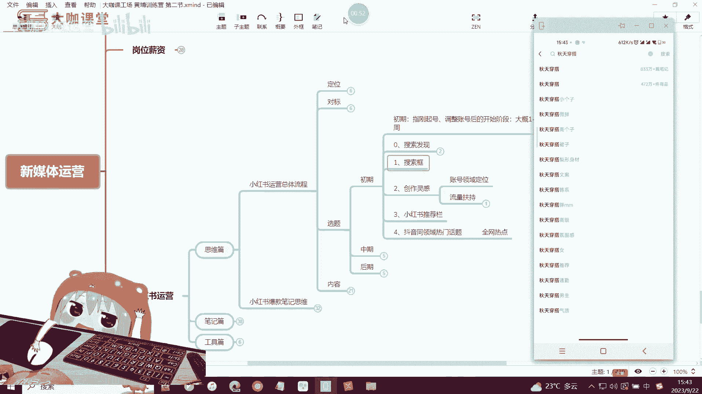

OK就是这些推荐词，那么这个呢其实就相当于是搜索推荐。

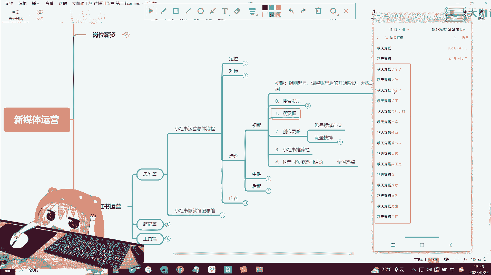

好这个是我们讲的一个搜索推荐。

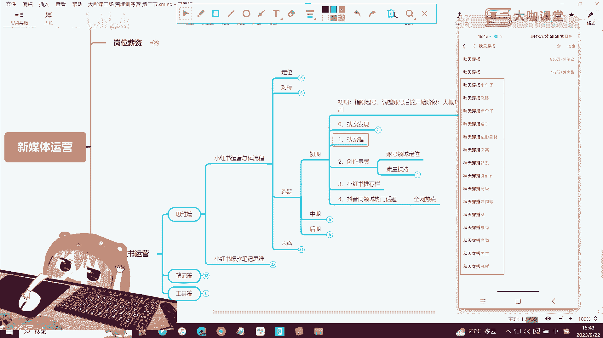

然后呢创作灵感就是我们点击账号的一个主页，进去之后呢，有一个创作灵感，这个灵感里边呢创作灵感有当下平台的一些呃，比较热门的一些领域，或者说一些热门的这种创作的方向，那么如果你在这一块去结合创作灵感。

去创作内容，它有两个优势，第一个是可以快速帮助你去做账号的一个领域，垂直定位，还可以给你一定的流量扶持，那么如果说我们讲了一个点对吧。

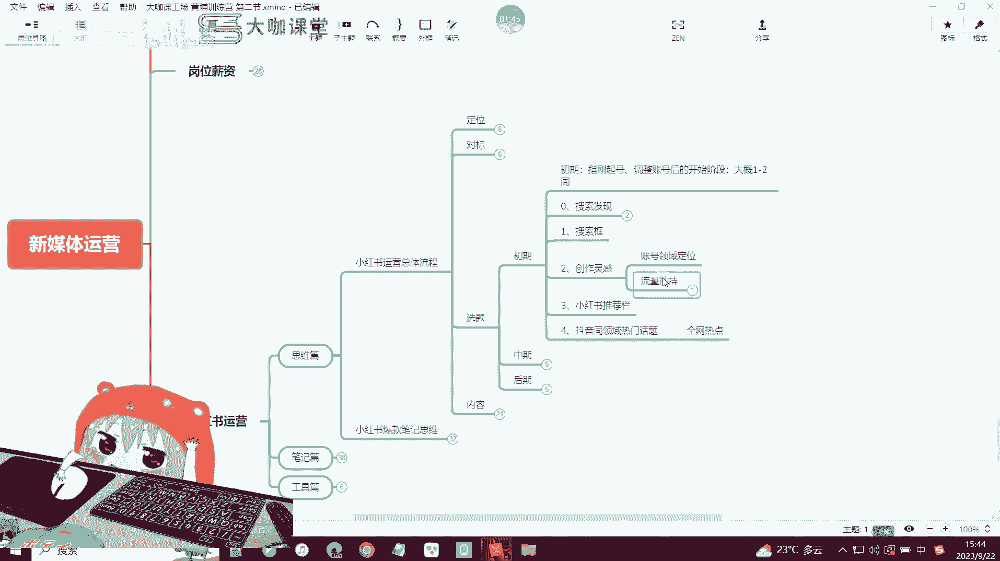

如果说如果说你的创作灵感中，没有跟你的领域相符合的推荐方向，那么这个时候你就要看一下，你的账号里边有没有发布一些笔记，你的笔记里边的标题文案，或者说封面这些内容策划上面有没有出现问题。

也就是说导致平台它没有办法准确判断，你发了哪些内容，你的账号可能跟哪些领域有关，好吧，那么你这个时候这如果说你发了笔记之后呢，你的创作灵感是肯定会有的，创作灵感里边呢也能能找到系统。

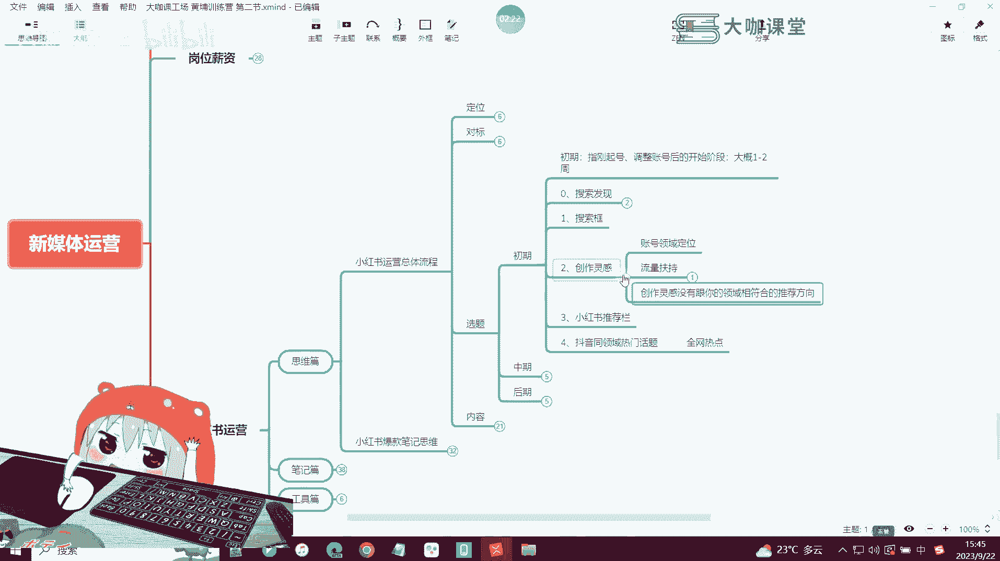

也会给你推荐与你的领域相对应的这样的话题，OK那么第三个我们讲到小红书的推荐栏，也就是说我们点击搜索完之后啊，我们搜索一个关键词，比如说我们搜索秋天穿搭，然后搜索完了之后，下面呢呃在结果的上方。

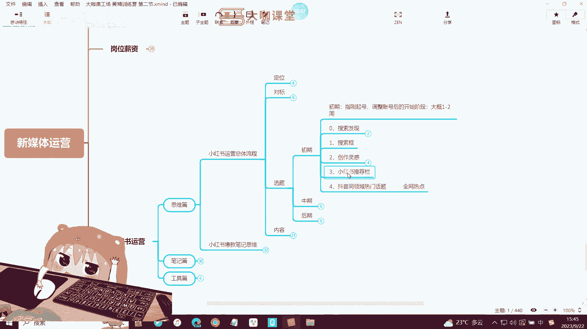

会给你推荐一些这样的一个内容啊，也就是在这一排像梨形身材微胖这一类的内容。

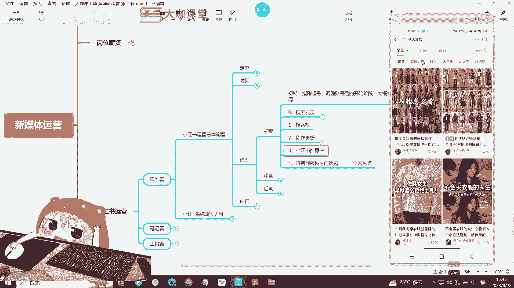

那么这就是相当于是系统给你的一个提示。

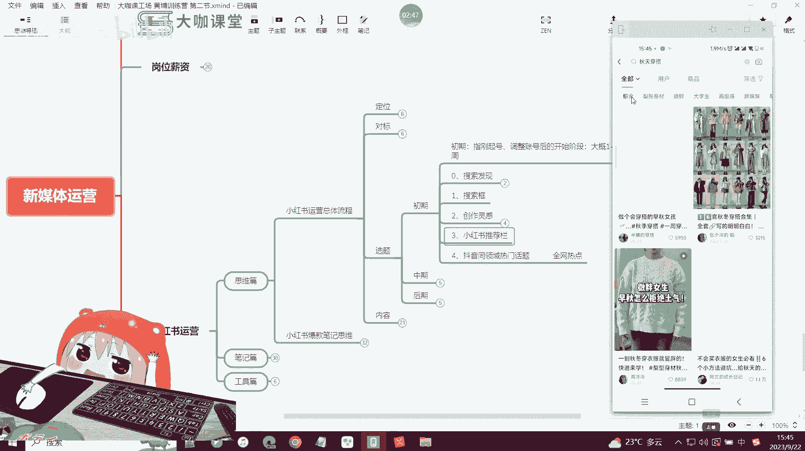

我们可以往这个方向去做创作，然后呢像抖音全领域的热点我们都可以去做。

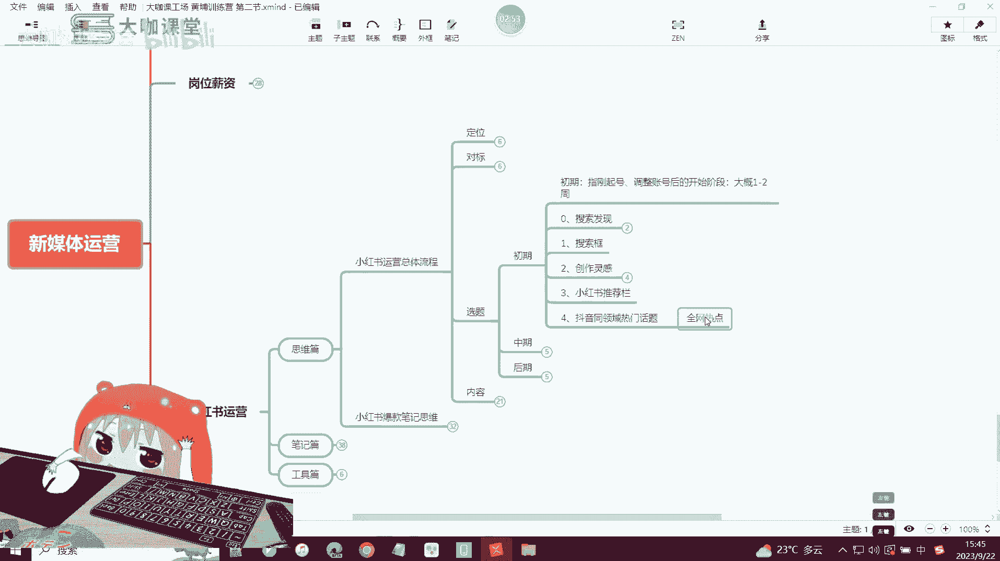

那么这是关于我们初期起号的五个方向，OK5个方向。

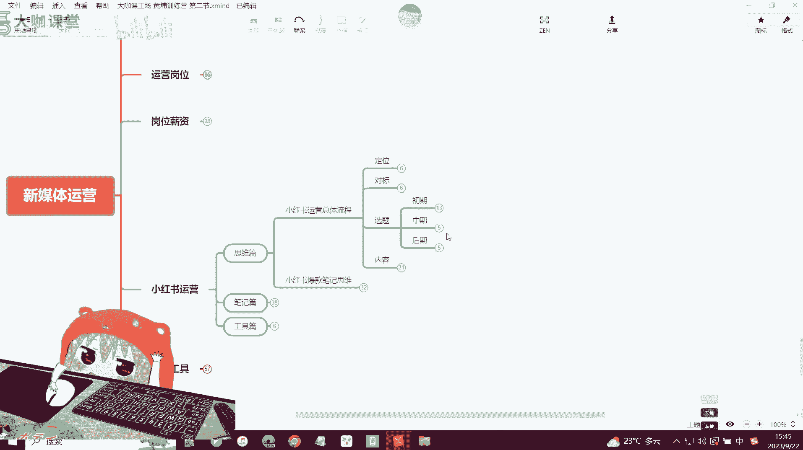

那么我们今天讲中期和后期，中期是什么意思呢，就是我们这里写了啊，也就是指的是你的第一篇爆款笔记出来之后，一直到你出现第五篇爆款笔记，这样的一个呃时间段，也就是说你的第五篇爆款笔记出来之后。

那么这个时候呢，你的账号。

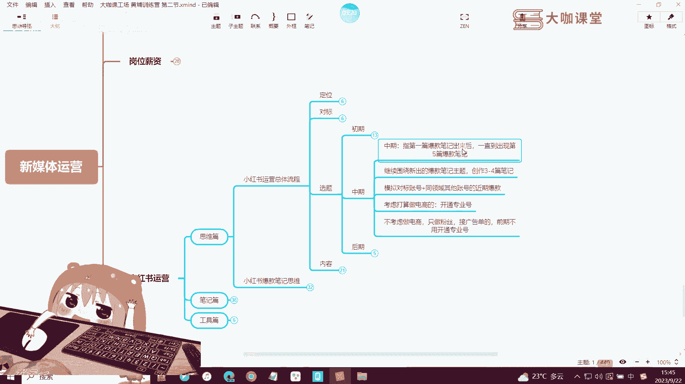

其实就相当于是已经步入到了一个中期阶段了，中期阶段也就是说啊进入到了一个上升阶段。

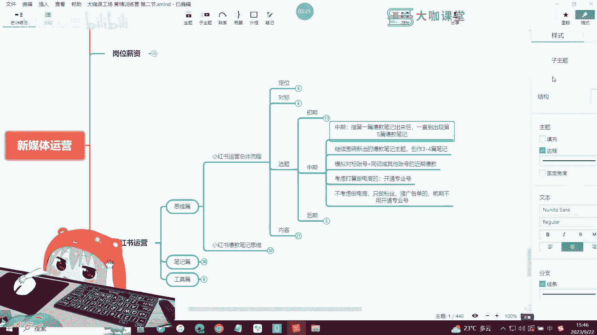

OK那么这个阶段我们应该做什么样的内容，首先第一个，继续围绕你新出的爆款笔记的一个主题，创作3~4篇笔记，那么这个我就要跟大家讲一个很重要的观念，就是我们在小红书创作的过程当中，一定要明白一个道理。

就是什么呢，爆款笔记的，可复刻可复刻性，也就是说如果你账号出了爆款笔记，那么这个时候你不要想着啊，我去做一些，再考虑做一些其他的内容，那这个时候你就赶紧去围绕着，你已经报的这个笔记。

去继续创作同类型主题的笔记，那比如说你创造了一个关于秋天穿搭，韩式的对吧，那么这个韩系的风格里边啊，这个女装对吧，女装有什么样的一个衣服，那这个时候你这个比例爆了，那么同样的你还可以围绕着呃。

韩系穿搭这样的一个主题，去创作另一套这个推荐的这样的衣服的笔记，那么你的主题可能就是韩系对吧，然后穿搭这样的一个主题，你围绕着他去创作，那么你继续创作3~4篇笔记。

那么接下来你这些笔记也有可能会小爆一波，小爆一波可能没有你第一批爆的时候，这个流量那么多啊，但是他也会给你推荐一些流量，这是存在一定几率性的事情，那如果说你后面你比如说你每天都有报的。

或者说你两到三天有一篇爆款，那么你后面创作笔记的时候，你就围绕你这些爆款呢每天去创作一篇，围绕着这个做个一两天两三天，那么你一定是会看得到效果的，OK那么我们到了中期账，中期账号到了中期的时候啊。

我们第二件要做的一个事情，就是模拟我们的对标账号，以及我们同领域其他账号的一个近期爆款，这个其实跟这个意思比较意思比较相近啊，就是说我们这个地方，围绕着新出的一个爆款笔记。

其实是去模仿模拟我们自己的一个笔记，那么这个时候第二步，我们去模拟对标账号和同领域，其他账号的一个爆款，就是说我们要去看别人，哪些东西在这两天或者说这几天有爆了诶，他突然比如说他昨天发了一个笔记诶。

他今天我一看他的一个数据，就已经出现了猛增啊，点赞有个上千，然后评论呢有几百这种笔记，你就可以立马去做复刻啊，就立马就可以去做复刻，然后同领域的其他的比较关注的，这种优质账号一样，有时候去分析一下啊。

去看一下他们有没有这两天有爆款的笔记，那么你这个时候你就可以去做了啊，但这个东西呢有一个注意事项啊，有一个注意事项，就是如果你的账号还在初期阶段。

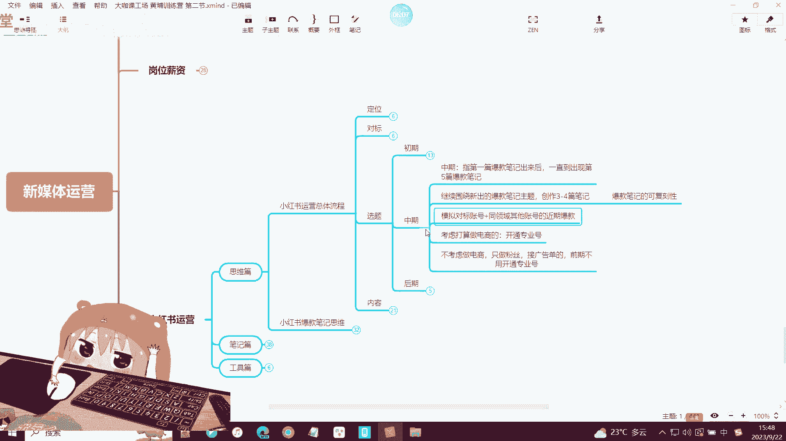

也就是说你没有满足你的自己的账号，出现第五篇爆款笔记的时候，你就不要做这个操作了，记住一定不要做这个操作，OK一定不要啊，当然我这里讲的是有特定方法下的完全的模拟。

那如果说你是有办法自己可以去做这种类模拟，也就是说呃你可以把这个东西呢。

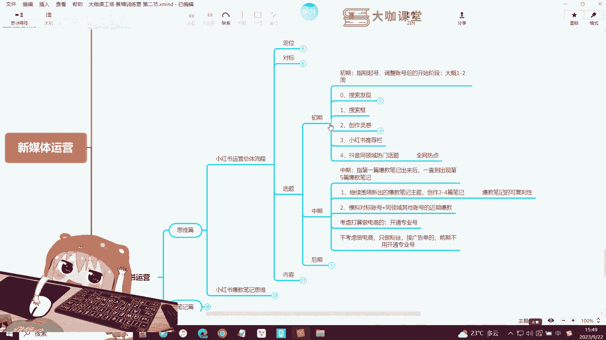

比如说他做的这个内容，你可以完全的用一种崭新的内容去复刻的话，也可以，但是如果说你是按照呃他的一个风格，它的内容的方向，它的关键词，它的文案这种方向去，也就是说七八十%的这种复课笔记复刻。

那在你的账号初期的时候，千万不要去做这个操作好吧，如果说你去做了这个操作，可能导致你的账号会出现一些严重的问题，因为我们不要小瞧平台的它一个一个什么呀，它对内容的一个识别的能力，因为可能首先文字文案啊。

也就是说标题跟文案这一类的，我们先不谈，这个系统是百分百可以识别到的，然后呢像你图片里边的文案内容人物，其实他一样是可以识别的好吧，不要小看平台的一个系统的一个能力，它是可以识别到你发布的很多。

所有几乎所有的内容，他都可以去通过机器系统来识别，那么如果说你在初期账号没有什么权重的时候，你来去模拟人家啊，你去抄袭，或者说啊你去复刻，然后呢你也不能把这个就是比如说他有张图，你想拿过来直接用。

那这个时候系统就会判定你是什么呀，你是抄袭啊，那这个时候你作为一个初期的账号，也没有任何权重，那么账号平台如果说随时给你封了，或者给你限流，那是再正常不过的事情，那么你想做起来可能就挺难了。

这个账号那么这两步完成啊，这两步继续做啊，就是持续做的一个内容，那么到了后面呢你就要考虑，如果说你是打算做电商的啊，也就是说你打算在小红书上面去开通店铺，那这个时候你就要去开通一个专业号。

那如果说你不打算做电商啊，你只是做粉丝接广告单的，那么我们前期呢，可以暂时先不用开通这个专业号，我们正常的做自己的笔记，然后我们做矩阵，把这个笔记，把这个账号运营好就可以了。

那OK那这是我们本节课跟大家讲的账号，我们的这个小红书账号。

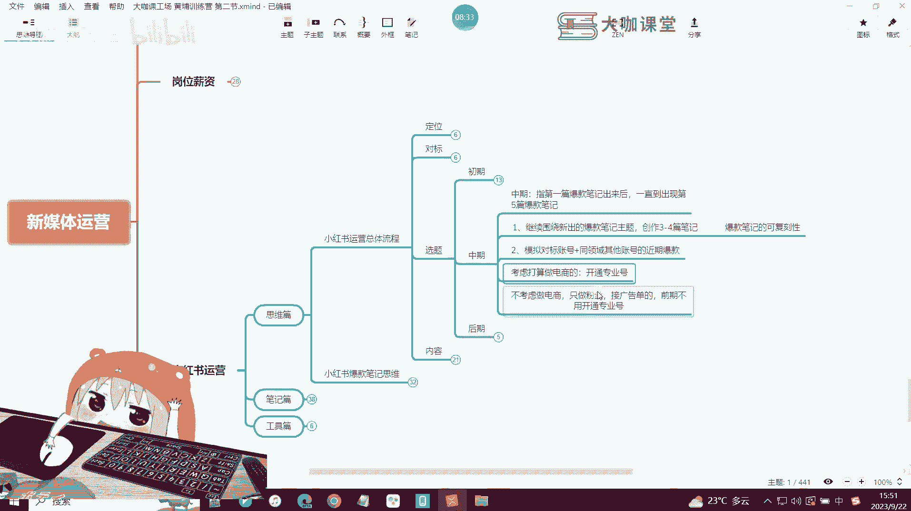