# 【B站最新零基础新媒体运营课程】小红书运营技巧／短视频变现／直播带货／剪辑拍摄 全平台运营玩法 流量获取包教包会！ - P19：17、新媒体运营 垂直赛道的选择问题 - 大咖私域运营 - BV1LSvKe4E42

哈喽同学们大家好。

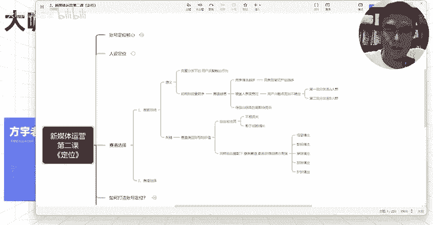

欢迎大家来到我们这一堂课，那么我是方宇老师，那么这一堂课呢，我们跟大家一起来研究研究。

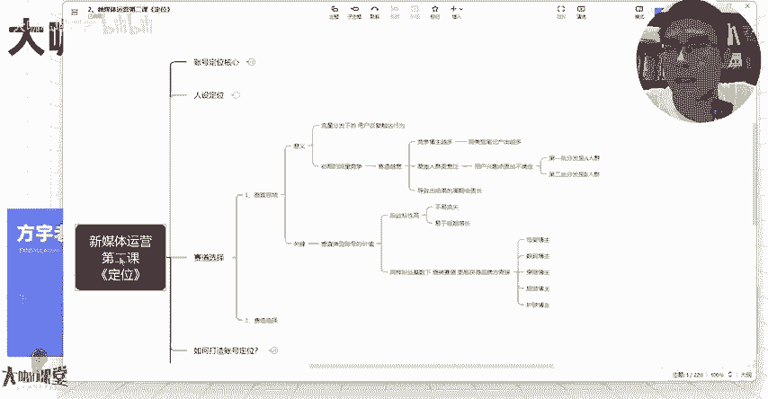

关于赛道这一块的一个选择问题，那么在我们首先去决定我们要做什么。

赛道之前呢，我们要先了解我们这个赛道。

后期的一个发展方向问题，就说我们要先知道赛道这个东西啊，它的一个核心定义就是。

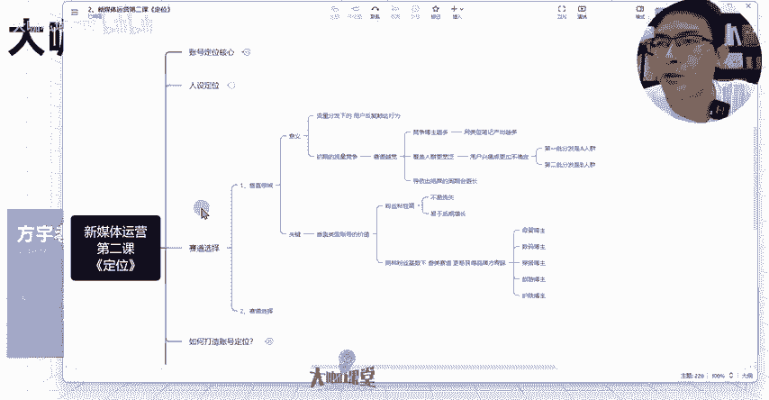

我们到底现在去做新媒体，我们选择赛道这一块到底要遵循哪些原则。

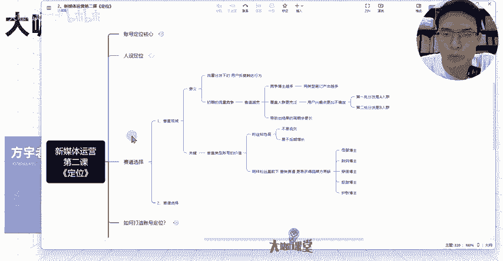

我们才能够尽量大程度的一个保证，我们这块赛道能够做起来。

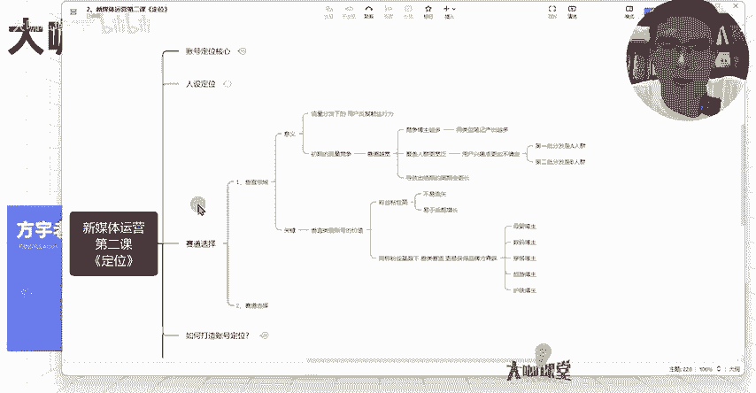

那首先第一个呢要大家去研究清楚的，就是关于垂直领域这一块，很多人都知道我做这个新媒体赛道，我要去做垂直对吧，我要去做细分，但是你们根本就不知道为什么说要这样去做。

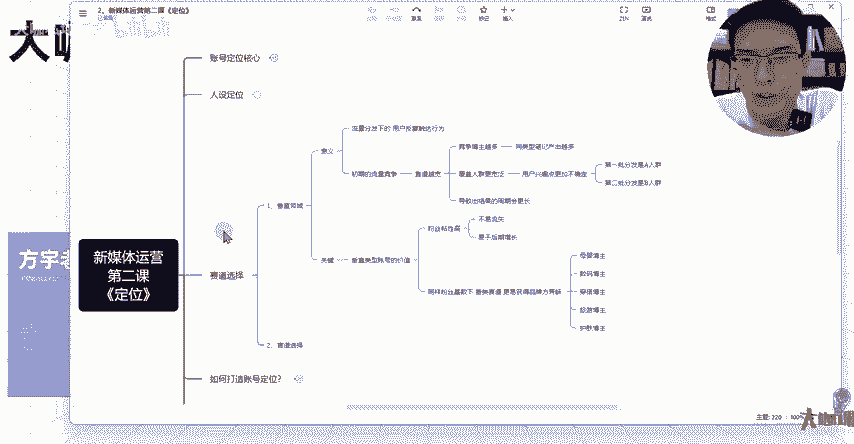

他的一个影响的根本意义到底在哪里对吧。

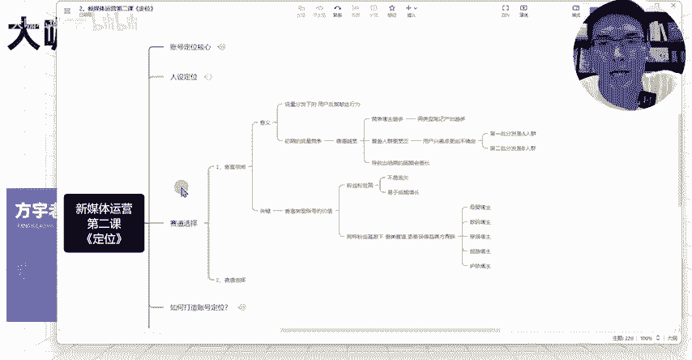

那么我们就一起来看一下，首先第一个呢就关于意义这一块，就是它的一个呃。

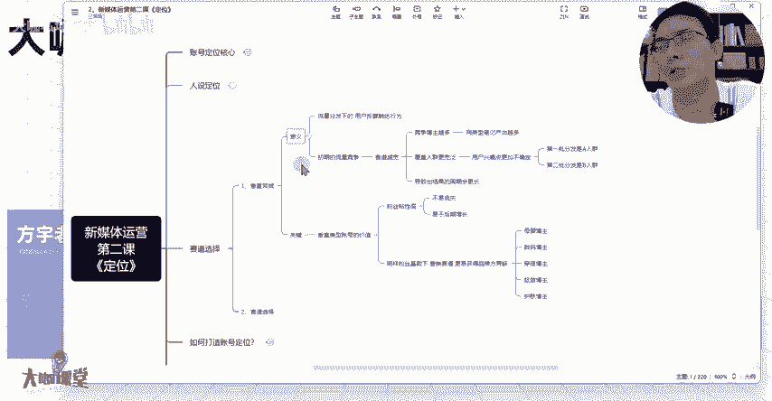

为什么说是我们要去做垂直领域这么一件事儿，第一个呢就是关于流量分发下的一个用户的。

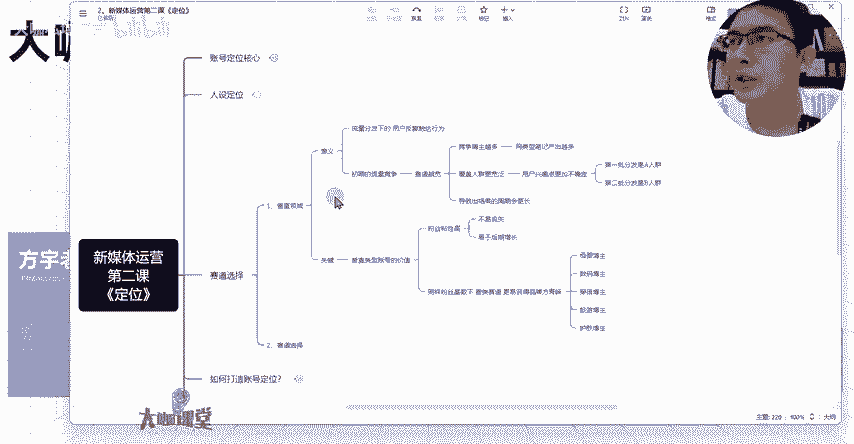

他的一个触达行为啊，应该说是用户的一个反复触达行为。

什么意思呢，比如我们现在去做新媒体账号，你的笔记他会第一批分发给一批人群对吧。

你的第一篇笔记，前五篇笔记，每一篇笔记。

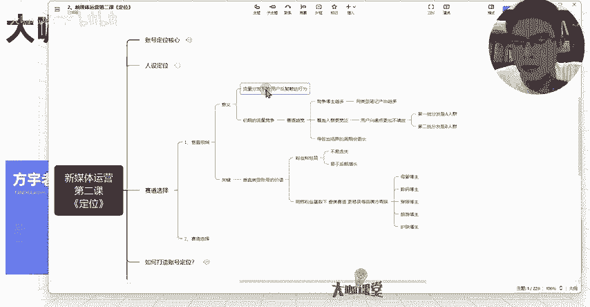

我们前期讲了这些笔记的一个初始流量，都是在做人群测试，对不对，那么我们之前呢跟大家打造过一个模型呃。

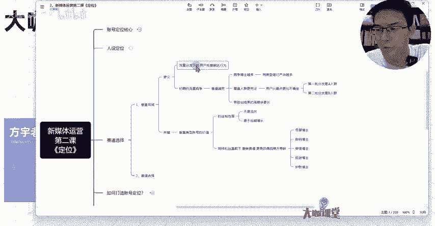

我们第一篇笔记呢分发给500个流量。

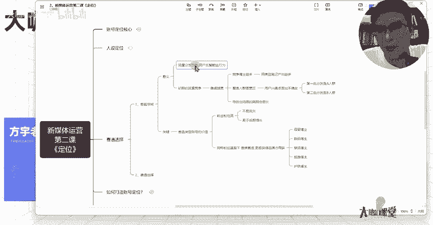

那么这500个流量当中，可能有十个是我们这个赛道的一个精准用户，比如说我们是做穿搭的。

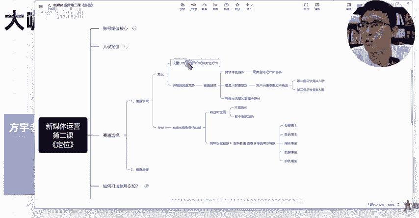

那么有十个用户呢，对这个呃大学生的一个穿搭吧，我们做大学生的一个穿搭分享。

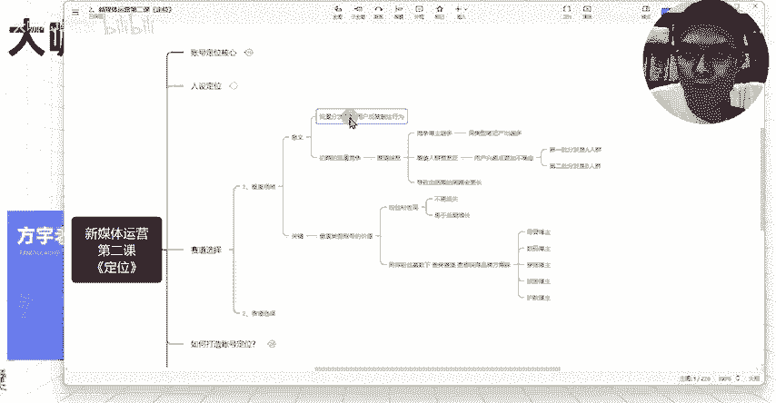

那么有十个用户，他对这个大学女生的一个穿搭比较感兴趣，然后呢。

它对我们内容呢，呃产生了一个比较长的这个停留时长，然后呢，其中呢有那么3~5个人给你提供的数据。

OK那么这个时候呢用户啊，我们的平台可能判断你这个笔记呢，有没有可能是跟这个和大学生穿搭相关的呢。

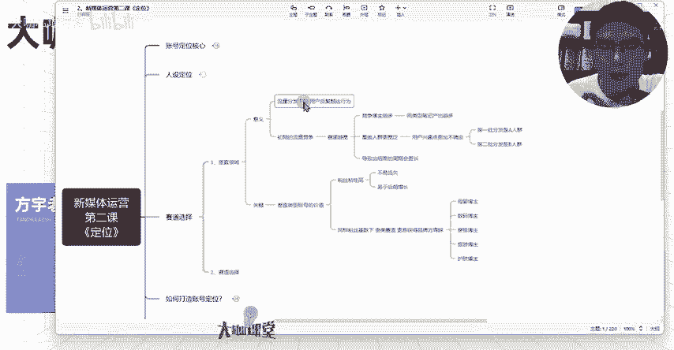

他还无法确定，对不对。

那么下一波你的第二批笔记，他有可能根据你上一批笔记的这些用户行为啊。

他继续给这十个用户，甚至说更多的，比如说二十三十个用户，50个用户继续去推你这个关于什么呢。

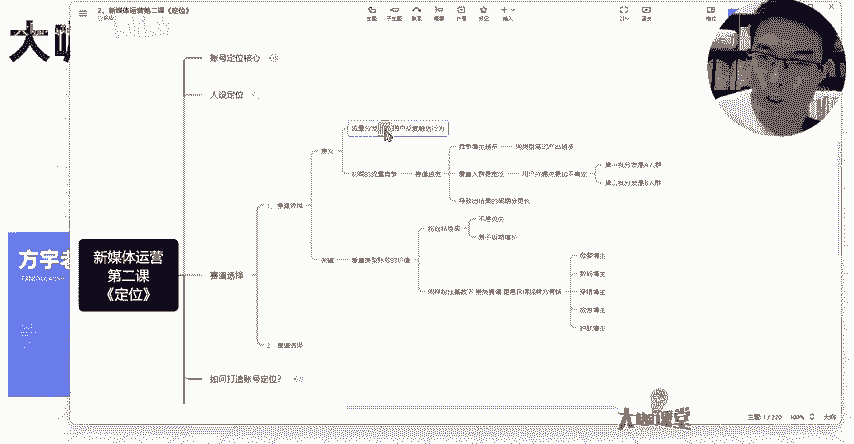

关于这个穿搭相关的这种呃内容。

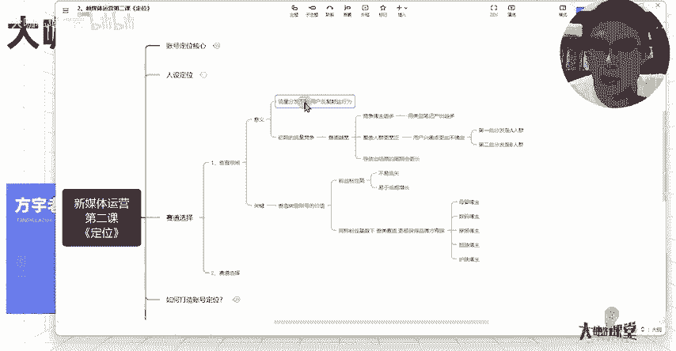

也就是说在我们第二批500个流量里边，可能有50个用户呢，他对这个穿搭有呃一定的兴趣。

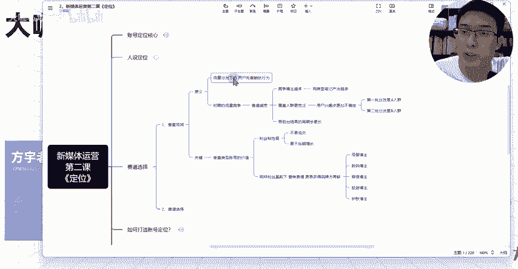

但是这50个当中又有十个用户，可能有十个用户哈，是之前对你的笔记还比较感兴趣的。

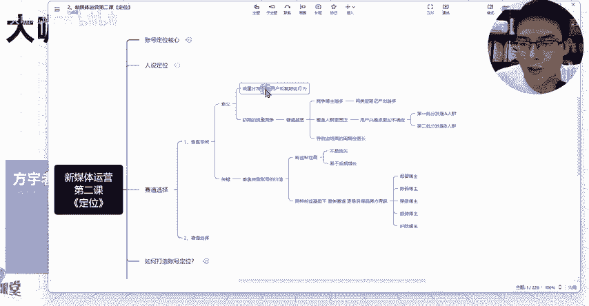

然后呢，其中呢有五个用户可能会必然刷到你的笔记。

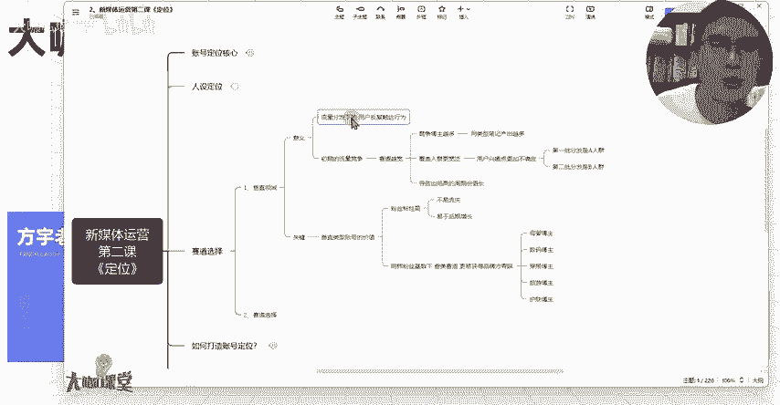

这五个用户就是对你的笔记有一定的，这个点击数据，然后呢甚至还对同类型的笔记呢。

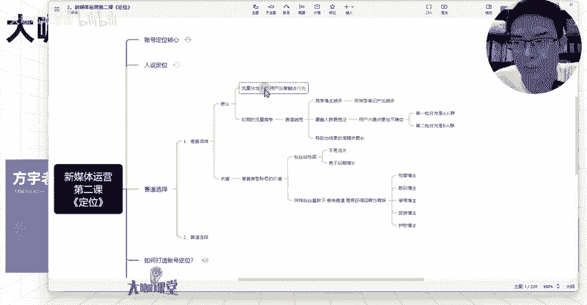

哪怕说他没有点这个互动数据，它对同类型的笔记呢也有一定的停留，时长和浏览行为。

那么这五个人他是必然会刷到你的笔记的，那么假设说你之前是做一个穿搭的对吧。

大学生穿搭相关的结果呢，你后面去讲了一个关于诶。

你今天上班遇到的一个遭遇啊，我们有一个情况来分来来来做预算与这个推测。

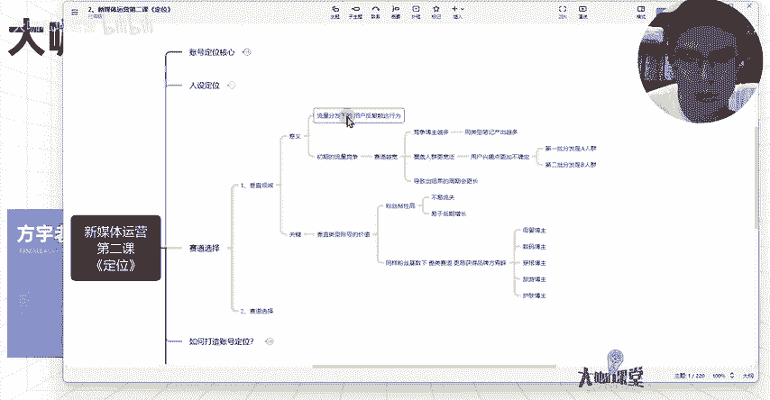

你呢分享了一个，我今天作为一个30来岁女性的一个上班的。

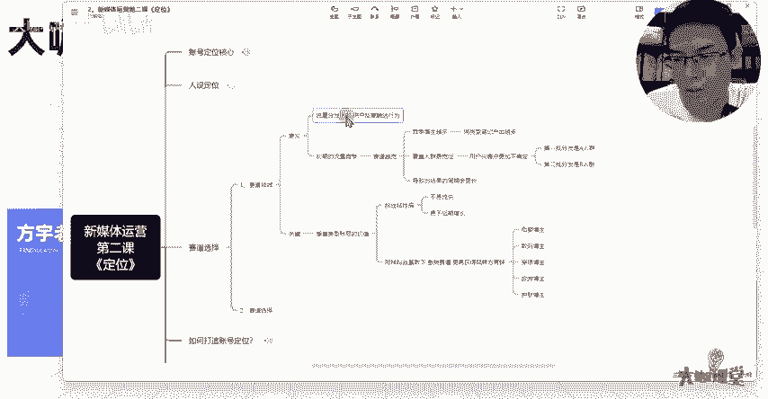

这样的一个情况，我遭遇了一个什么样的一个不公平的待遇，或者说啊我上班遇到哪些烦心事儿。

那么你之前对你这些内容，对你的这个大学生穿搭感兴趣的这部分用户。

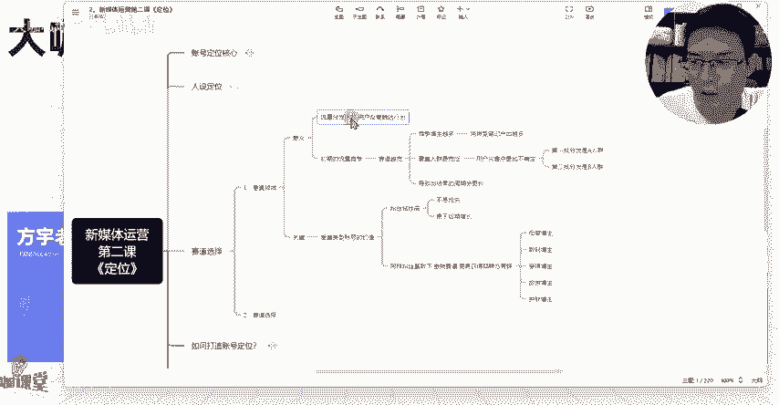

他在刷到你这个内容的同时，他大概率不会对你现在发的这个跟他呃。

目前需求不匹配的这一类内容呃感兴趣，也就是说他同样刷到了你的账号。

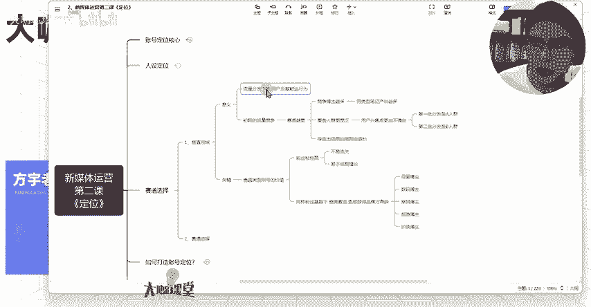

但是在不意不经意之间他就刷走了啊，刷走了他刷到你的这个笔记内容。

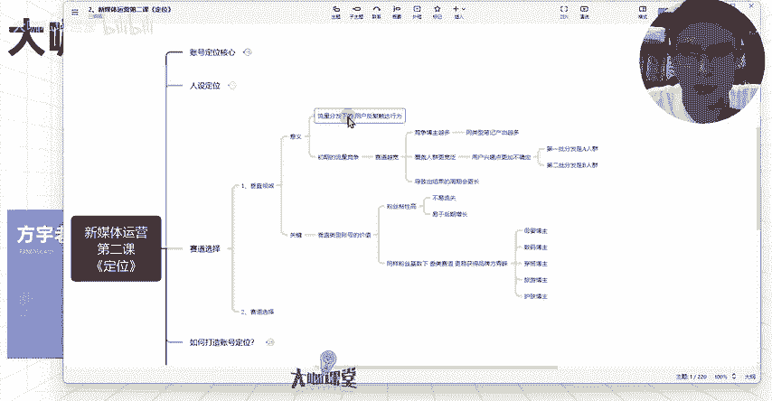

在他的这个四篇笔记的陈列当中，但是他刷走了，那么这五个用户的流失。

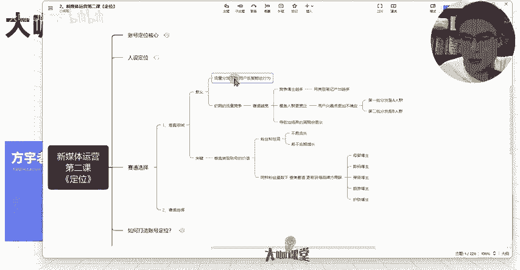

会给系统提供一个什么样的一个呃，这种感觉呢就是之前对你内容感兴趣的用户啊。

你现在同样分发的这个内容，他们既然不感兴趣了。

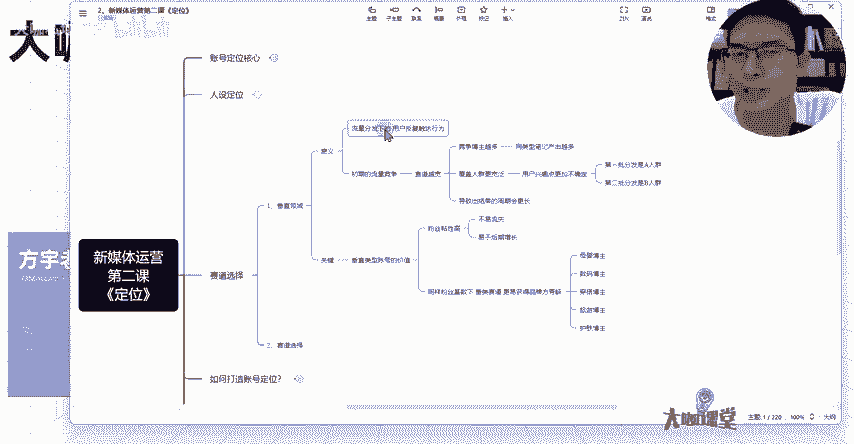

那么系统会不会觉得呃之前的判断失误哎，系统，但他没有这样的一个思考过程。

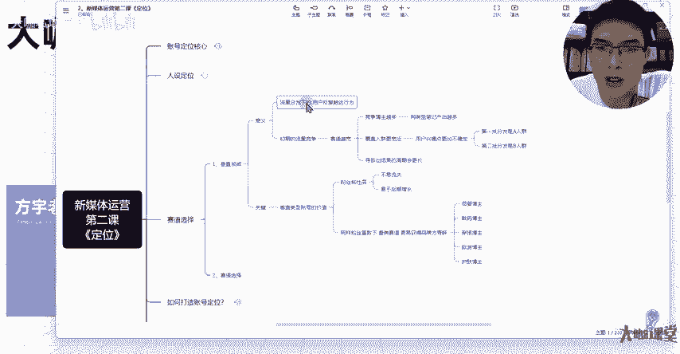

他只会觉得之前的分发是错误的，有误，OK那么你现在的这个。

如果说你这一篇笔记分发的另外50个，那什么来着，50个，整个全部50个。

对大学生穿搭感兴趣的这部分用户群体，他们都没有给你提供一个很好的数据，OK那么这个时候呢。

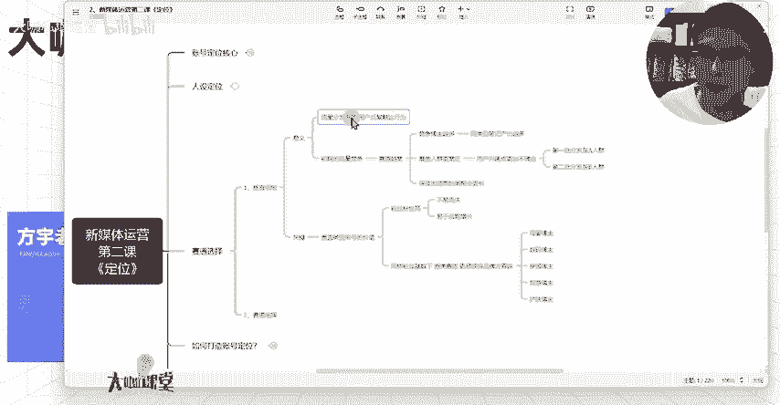

系统它可能首先第一个在大学生穿搭这一块呢，你的这个内容分发呢，它有可能就会给你降低这一块的权重。

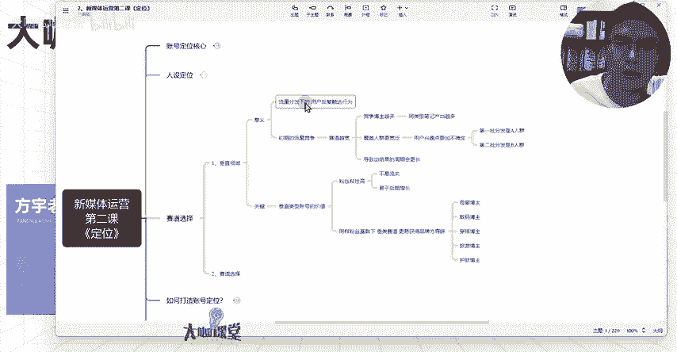

那么假设说你这500个流量当中，有这么一些人，刚好这么五六十个。

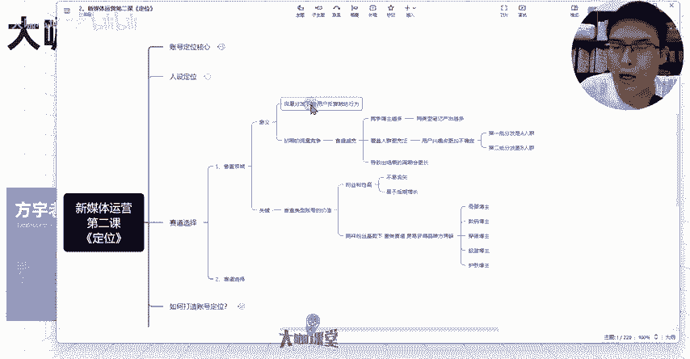

七八十个，或者说十几个这种用户，他们对你今天分享的这个什么来着。

女性成长类的话题，就比如说我今天上班遭遇的这些问题，或者说呃我的这个呃共同的这种遭遇啊。

呃或者说我一些不公平的待遇啊等等这种情，他们他们还挺喜欢的这种情况下面。

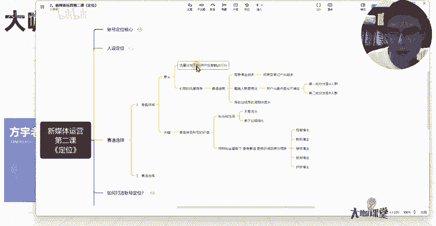

那么你们的下一篇笔记就可能导致系统诶。

他再一次错误的判断了，你下一篇关于穿搭的内容要分发给哪些人了，这就是我们在笔记分发里边。

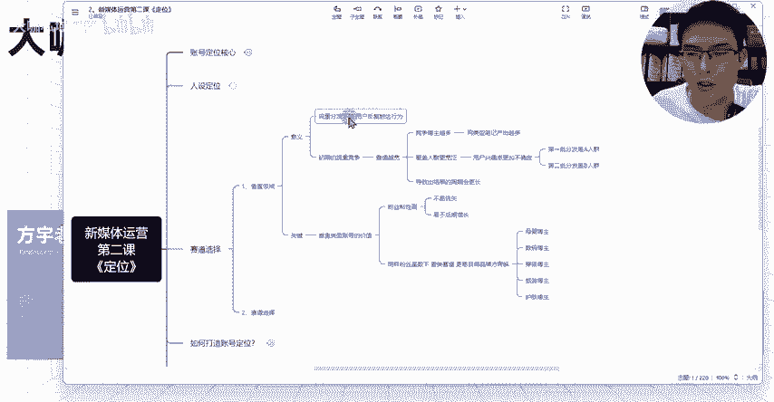

用户的一个触达行为，他能够给系统反馈出，你对你的这个笔记类型的一个判断。

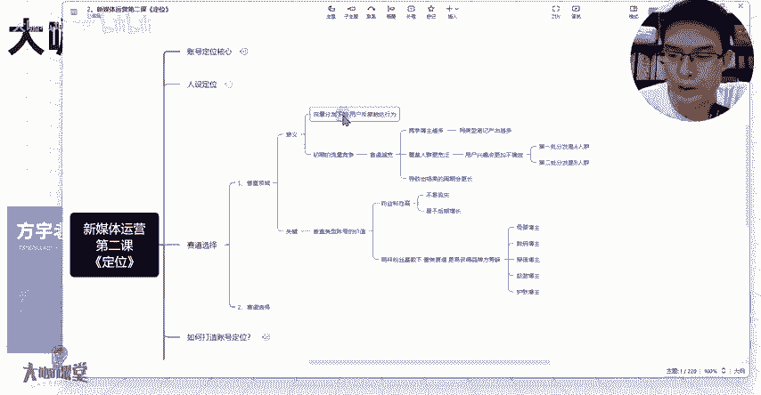

所以说我们要去做垂直领域对吧，你的垂直领域呢能够在这个人群触达这一块。

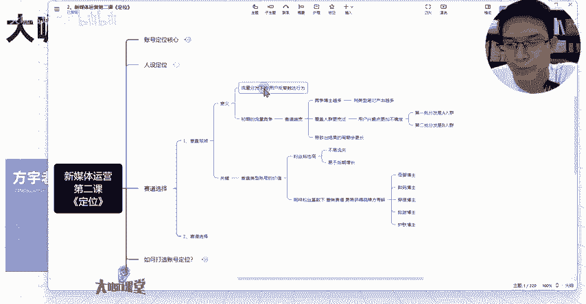

就至少说他浏览过你的内容，那么他大概率还会额刷到你的内容。

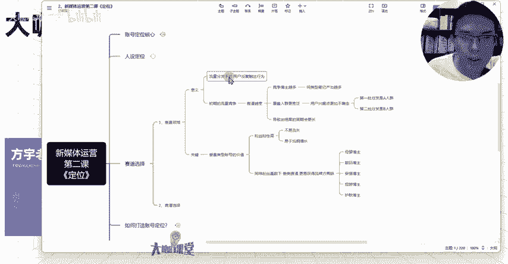

那么这个时候，只要你保证你的内容质量没有问题的前提下，他们很有可能就还有除了他们之外。

还有更多的人，他可能会给你提供一个数据支撑，就至少说点击率这一块可能你就能拿到对吧。

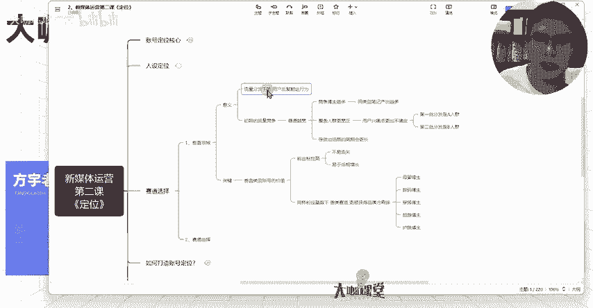

有了点击率，后面我们就要拿的是什么，我们的停留时长，我们的这个跳出率。

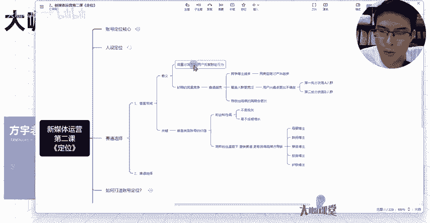

还有我们的这个互动数据，是不是这就是我们要拿的东西对吧，这就是我们为什么说要做垂直赛道呢。

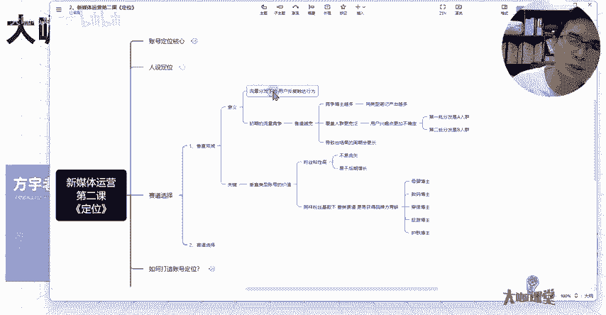

你的垂直赛道你在人群这一块，你能锁的更加的精准，也能够更加利于你的这个账号。

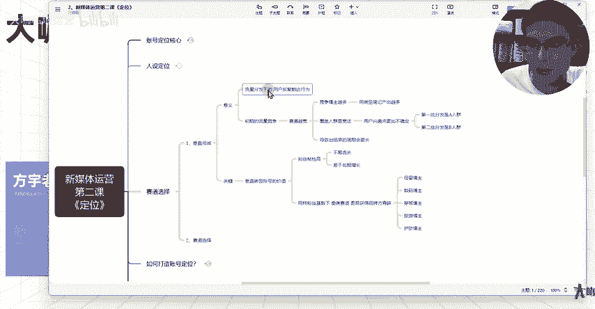

他有一个快速的一个成长，OK那么第二个呢就是关于初期的一个流量竞争。

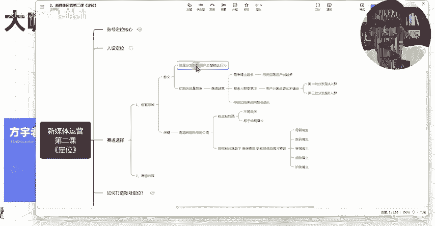

我们的账号呢初期发布的这个笔记啊，你的这个流量分发是有一定上限的。

我们之前讲流量层级的时候，讲讲你这个呃账号的一个分发情况的时候，也大致提到过。

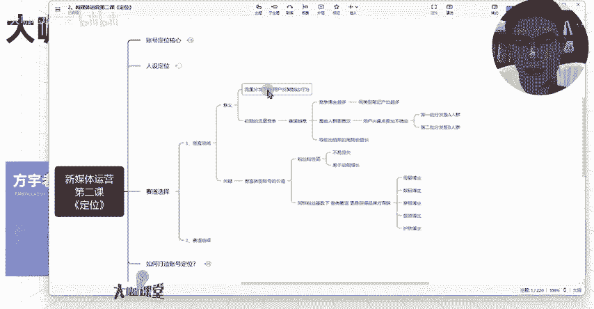

这个后面我会细讲对吧，你的流量分发它是有瓶颈的，系统，不会因为你的这篇笔记。

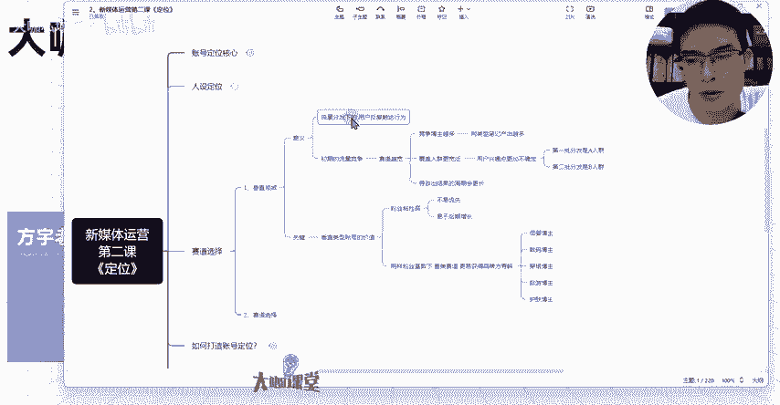

它有一个还行的这种数据，它就持续去给你分发流量，你的流量有上限。

到了这个上限的情况下，你怎么能够在这个上限的这个基数下，跟你这个同类目的其他的账号去竞争流量呢。

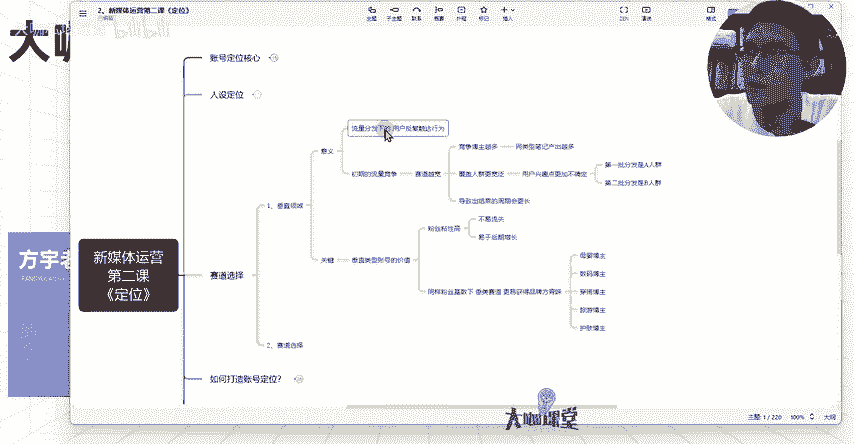

对不对，这个就是我们要考虑的一点，如果说你在初期的时候。

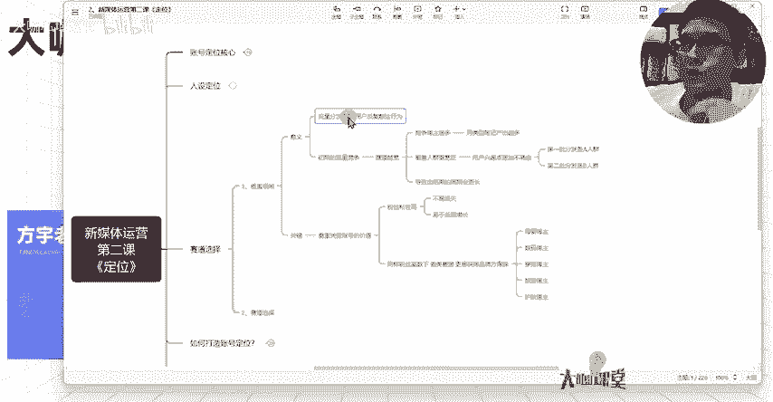

你所涉及到的这个流量范围越宽，那么相应的在你这个赛道里面。

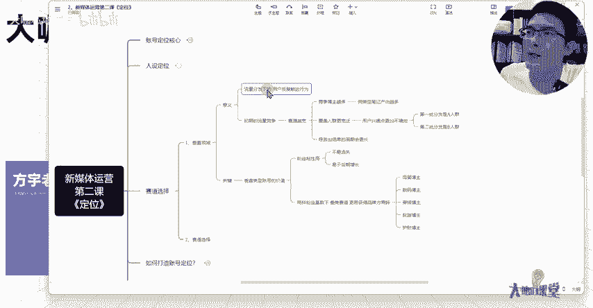

竞争的这个博主啊也会越多，那么竞争的博主越多。

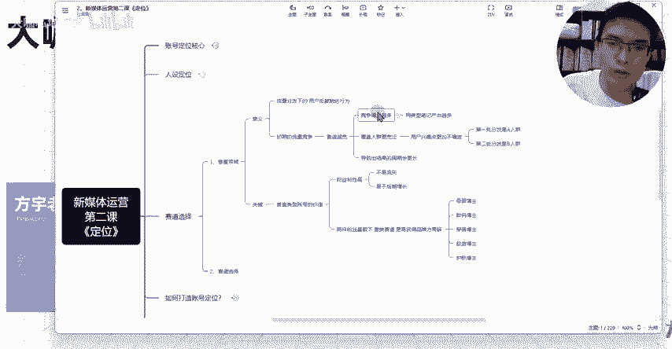

他就有什么样的一个意思呢，你今天做的一个大学生穿搭的类目啊。

假设说你不是做的大学生穿搭，你是做的各种类型的穿搭啊，你今天讲这个穿搭，你明天呢又讲的是微胖的穿搭。

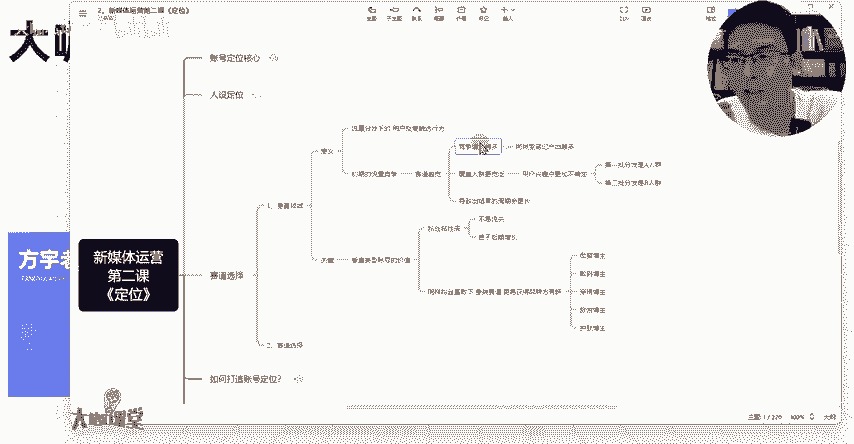

然后后天呢讲的是通勤穿搭，那么在这几篇笔记的一个反复覆盖当中。

虽然说你是跟穿搭相关对吧，但是在这同样做这些内容的当中，做通勤的有这么1万个博主对吧，做这个大学生穿搭的又有1万个博主，你本来只跟大学生穿搭的1万个博主做竞争。

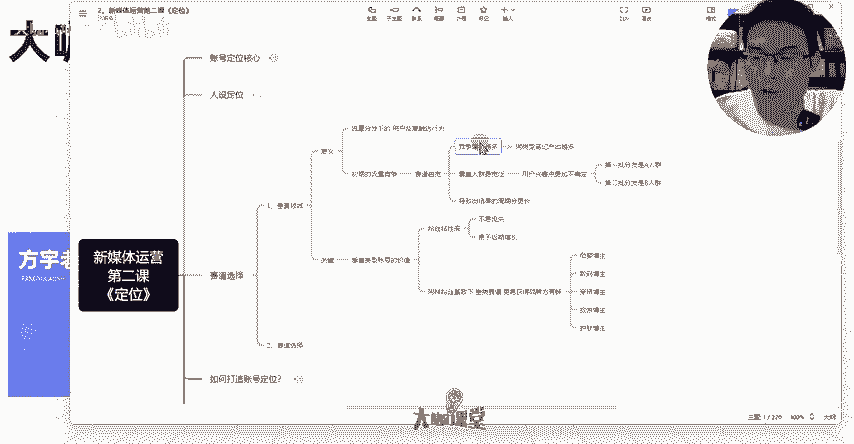

结果现在你变成了你在跟3万个博主再去竞争。

那么每天3万篇笔记当中，你去抢这么点流量，然后呢和你相对于你在1万篇笔记当中。


你去抢这么多流量，哪一个更容易让你分到一些更精准的。


或者说让你的笔记，在这个领域当中能得到一些呃，比别人能得到能更有优势呢。


是不是这个就是我们要考虑的一个点对吧，你的赛道呢如果说没有去做细分。


你做的宽，你在当前这个赛道做的宽，它的影响在这里，那么如果说你的账号是。


今天发一个这个赛道的内容，明天发一个那个赛道的内容，那么相应的你的这就不是竞争高的问题了。

你这就是你的一个账号，后期分发精准度的问题了，OK然后呢就是额覆盖人群范围更宽泛嘛对吧。


那么这也是我们要讲的一个点，我们刚才讲的这个通勤对吧。


我们讲了大学生的传达，我们还讲了什么，还有一些其他的这个呃职场传达等等。


那么这种情况下面，你的笔记，它所分发的这个用户是他的一个兴趣点。

是不确定的，那么其实我们刚才讲这个用户的一个。

触达行为啊，也是讲到了这一点对吧，你的通勤穿搭，或者说你微胖人群的一个穿搭。

他们分发的人群是不一样的，也就是说我们现在我为什么之前跟他说。

我们有些同学会问对吧，我同样一篇笔记，我发在我这个账号上，面，额横流量比较高对吧。

我把这篇笔记我再发到另外一篇账号上面，另外一个账号上，为什么他的流量就这么差呢。

是我因为我没有驱虫的原因吗，我这么跟你们说吧，或者说你在同样一个账号里边。


你把同样的一篇笔记你发两次，你的这篇笔记，两篇笔记他分发的人群都不可能完全一样。

就是一定是会有差别的，所以说你在做不同类目的一个呃。


不同细分赛道的笔记的时候，你的分发人群不一样。


那么这些人群，他们的一个兴趣点就更加不一样了，那你要考虑一下喜欢微胖穿搭的这一类人群。


他们可能啊我假设哈，我假设这类人群他们喜欢看微胖的穿搭。

他们同时可能更关心什么，他们更关心诶有没有什么好吃的。


有没有哪里好玩的，或者说什么演唱会呀，或者什么其他的呀，举个例子啊。


那么这种情况下他们关心的是这个点，对不对，那么关注通勤穿搭的人群，他们的兴趣点除了关注通勤穿搭。

他们还关注什么，他们必然就是不太关注什么呢，微胖的穿搭啊，不是说必然哈。


我是现在是把这两个人群呢做了一个呃，整体的一个区分开啊，整体的区分开。

你不用在意我字面的意思，现在这两个人群，他们的之间的一个需求点不重叠，那么关注职场穿搭的这一类人群。

他们可能同时关注什么，关注这个呃消费啊对吧。


关注这个生活啊，家居啊，宝宝啊等等，他们可能关注这些兴趣，但是他们相应的对一些年轻人的东西呢。


呃可能关注的会相对来讲少一些，那么这种情况下。

你用户的一个兴趣点，他就没有办法确定到，他们是跟你的这个类目去进行强相关的。

那如果说你在做这一块的笔记对吧，你是做什么呢，你做这个通勤穿搭的。


然后结果呢，你今天做这个大学生穿搭的，这个优惠的这个合集啊。


这个呃便宜又好用，然后呢又显身材等等这种合集，那么这些点他可能并不是关注通勤穿搭。


他们喜欢喜欢关注的点，那这个时候用户兴趣点不确定不统一。


和你之前的分发不不相同，那这种情况下。

你的这个流量它也会相对来讲更加的不稳定啊，不稳定，然后呢整体的这种情况下来。


就会导致我们的账号呢能产出结果的周期，本来说可能说两个月对吧。


三个月就说按照你们目前的水平去玩对吧，但是呢结果在你这种操作下面。


他的一个产出结果周期有可能会更长对吧，半年或者说甚至更长时间都有可能。

甚至一直做不起来都有可能对吧，这就是我们前期要避免的问题，然后第二个呢就是我们现在做垂直类型账号。


它的一个关键点垂直，那垂直类型的账号呢。


它能给我们带来的价值呢有两个方面，第一个呢就是我们的粉丝粘性高，粉丝粘性高呢就是你是做这个大学生穿搭的。


你关注的这些关注你的这些用户群体，他们已经群体这个目标已经固定了。


这些人呢他是大学生，对吧，然后呢他们关注这些便宜好用的东西。


所以说你给他们推荐的东西，他们只要关注你，他们相信你。


那么你后期推荐的东西他就更容易信服，他，就更容易产生什么交易行为，对不对。

然后呢这些粉丝呢他们更愿意相信你说的话，所以说你的粉丝粘性高，对你整个后期账号的一个流量增长。


就不至于说你的流量起伏波动特别特别大。

比如说我今天发一个笔记，我有那么500赞对吧，我明天发一篇笔记，我后天发篇笔记都只有几个赞。


这种情况下它的一个波动就是不正常的，所以说我们在你粉丝粘性或者粉丝质量。

比较高的情况下，对于你账号后期的一个增长。


他是会有很大的一个增益的，OK然后第二个呢就是在我们垂类赛道的情况下。


同样的粉丝基数下，你的账号做的越垂直，那么你的这个品牌方。


找你合作的这个价值点也就越高，你比如说呃，像某图文笔记平台上面。


推一些护肤的这个新品啊，或者推一些美食的这种新品啊，在上面呃。


你的账号越垂直对吧，那么品牌方找你的可能性也就越高，你得到的收益的情况下也会越高。


那同样的有些账号他发了这个装修的。

然后呢也发了这个生活分享的，也发了这个呃，散步啊，跑步啊，运动啊等题材相关的。

这个时候如果说是一个母婴的账号，他来品牌，他要去做推广，他肯定会优先考虑一个始终做母婴品类的。


知识分享啊，或者说话题的这么一个博主。

他不会去考虑做我们刚才说的这种比较杂，赛道的这种账号，OK这就是我们在变现这种情况下。

我们需要考虑的一个是我们的变现，另外一个就是我们的流量的一个逻辑。


