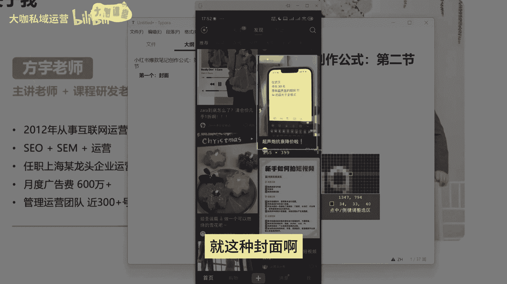
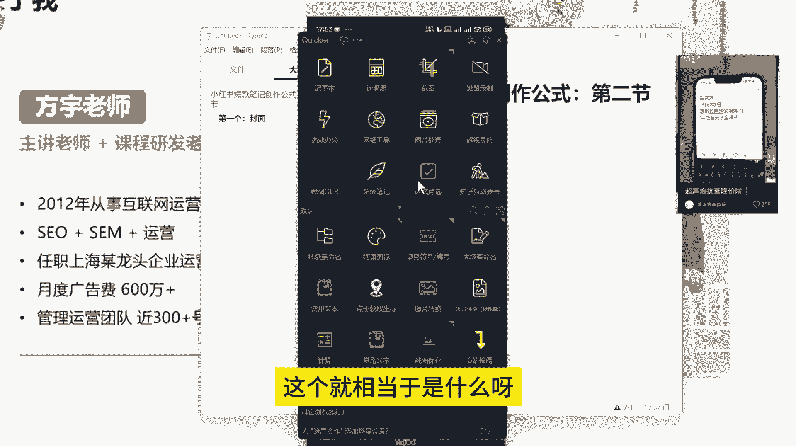
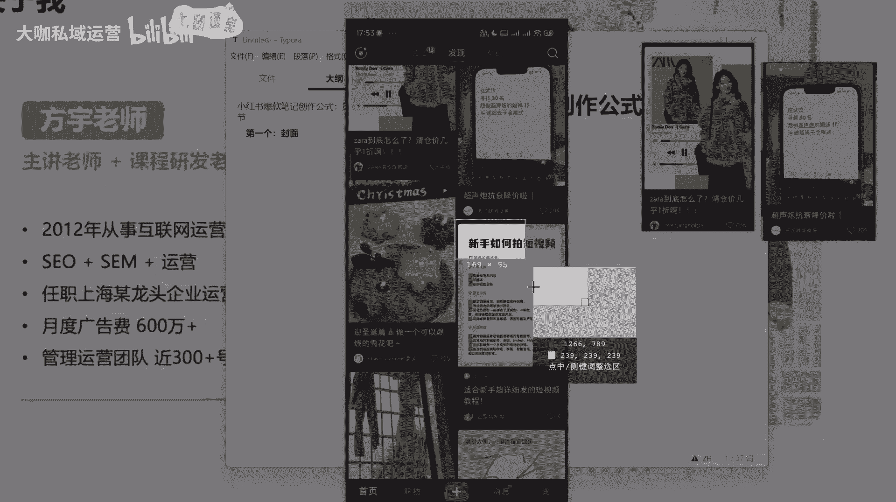
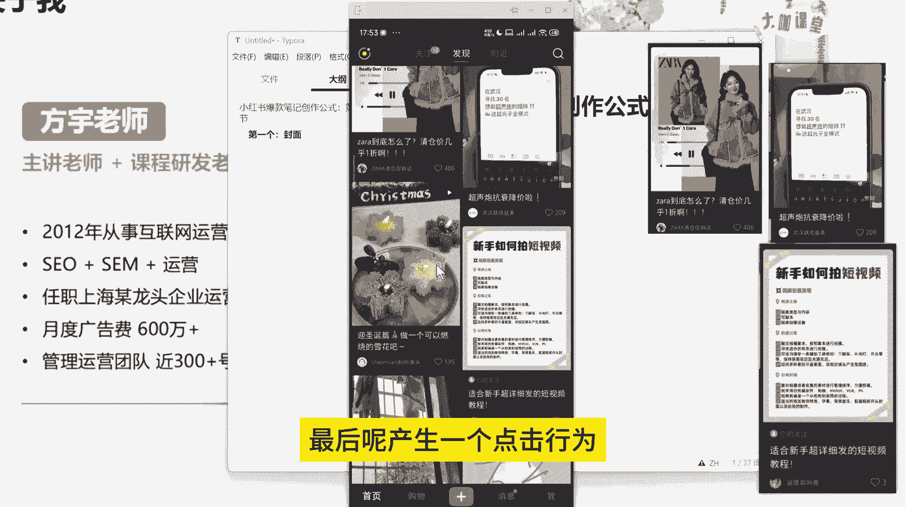
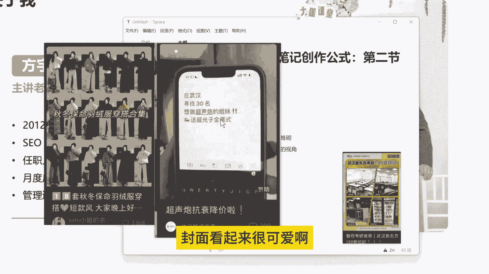
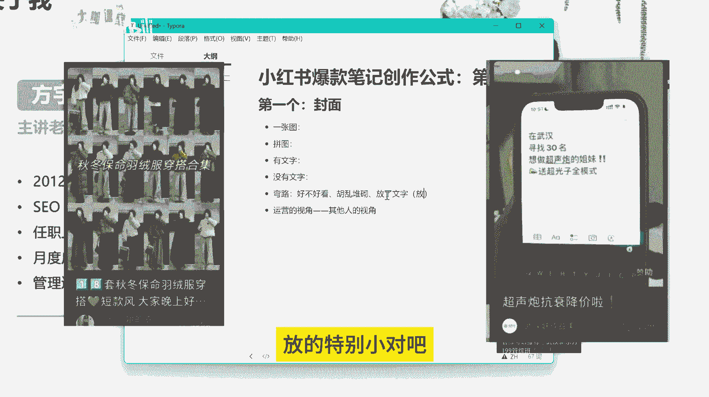
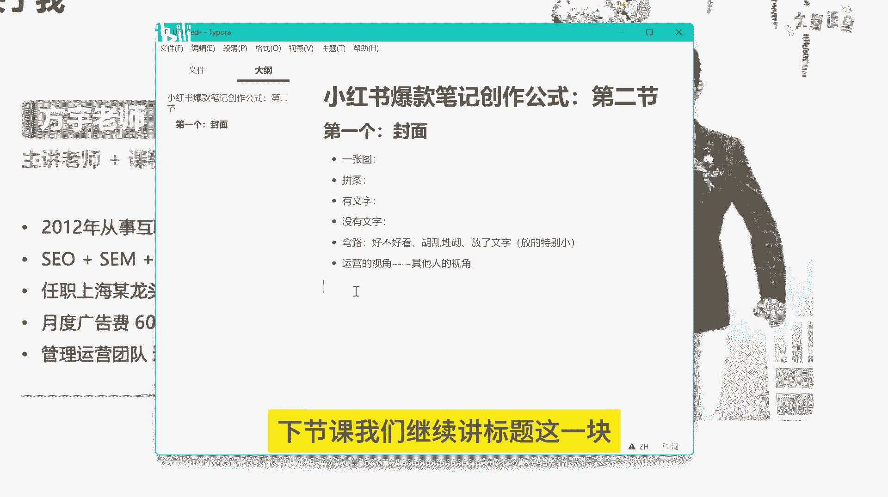

# 【B站绝版零基础入门新媒体运营教程】小红书运营起号／抖音直播带货／短视频拍摄剪辑 ／7天高薪就业 整整200集 全程干货无废话 学完轻松进大厂！ - P7：01.5：小红书爆款笔记创作公式：第二节 - 大咖私域运营 - BV1GS411P7ZP

Hello，大家好，欢迎大家来到我们这一节课，那么上一节呢我们跟大家聊了一下，小红书爆款笔记创作的这样一个呃核心点，以及我们创作的一个方向和内容选题这一块啊，就是能够产生爆款的这些基础的东西，呃。

那么如果说嗯，我们真正的要去打造一个爆款笔记的话，除了我们的方向和我们的价值之外，我们最需要的还有几个点是什么东西呢，这是第一个是我们的封面，对吧啊，第一个封面对吧，我之前呢在这个课程当中跟大家讲过啊。

小红书这一块呢它跟抖音不一样，抖音的这个封面呢，可能在主页上面体现的还比较明显，但是呢在正常的内容当中呢，现在可能短视频这一块就靠前面的三秒，3~5秒来吸引观众是吧，但是我们小红书笔记不一样。

它是靠什么呢，它是靠你的这个封面标题这些东西来结合，产生你这样一个内容的一个点击率，我们抖音呢都是啊，内容主动的推送到用户的手上，也就是说不管说它呃对这个东西感不感兴趣，他最他至少要停留那么个一秒。

一秒到两秒的时间，而我们小红书不一样，小红书的笔记它是通过瀑布流的形式展现的，那么所有的笔记都放在一个界面当中，我们可以来看一下，小红书的所有内容他都放在这一个界面当中，那么用户在这个浏览的界面当中呢。

在这个界面当中，也就是首页他去刷这个内容的时候，如果说它不产生点击，它对你的内容是不可能有任何的这样的一个，创作价值的，或者说互动价值的，只只有他对这个内容产生了点击行为之后，后面的停留时长对吧。

点赞互呃，这个收藏评论等等，这些内容，才能成为用户对你这篇笔记的一个互动收益，所以说怎么说呢，所以说就是我们的封面，还有标题，就决定了我们这个笔记到底能不能被产，被产生这样的一个点击行为。

那么封面它有多少种创作形式呢，我们总结下来就是首先第一个啊，封面的创作形式啊，第一个就是一张图，OK这是一张图，然后呢还有就是拼图对吧，拼图形式，然后呢还有是什么呢，有文字的，还有是没有文字的。

那么这几种是我们小红书上常见的这种呃，封面的形式，一张图的话，那么假设它呃有文字啊，或者没有文字，我们来看一下像这种这种。

你们觉得他是有文字的还是没有文字的呢，就这种封面啊。

其实我们看起来这种封面的话，你可以理解成它是有文字的，因为正常我们在刷这样的一个那种这个，手机屏幕界面，然后呢我们看的是这个封面里边的文字内容，在武汉寻找30岁什么什么的啊，这种这种姐妹对不对。

那么这个东西呢呃用户关注的是这个点，他关注的是文字区域，它不是关注你这个手机，OK他先是通过你这种，只不过说这个东西呢，这个封面呢，它通过这样的一个手机输入这样的一个形式呢，让别人能吸引别人的一个目光。

来产生这样的一个点击行为，但是真正能让他去对这个笔记感兴趣的时候，感兴趣的点还是在于其中的内容，然后这个呢这个就相当于是什么呀。

这个就相当于是没有文字的，就一张图对吧，这个就是一张图，OK这个是一张图的形式。

然后呢这个是什么呀，这个是就是纯文字的对吧，这个相当于是纯文字的。

纯文字的形式，我们也可以把将它理解为，有文字的形式的一个封面，那么这个封面就是通通过什么东西，来吸引别人感兴趣，就是通过醒目的标题这种形式来告诉别人，我这篇笔记有什么样的价值，我能提供什么样的内容。

OK我下面还列了这么多的表，这每一个地方啊，列表每一个里边都包含了你想关注的这个节点，OK让他们来关注这个东西，最后呢产生一个点击行为。

那么这个也是一张图，我们来看一下有没有拼图啊，这个算不算拼图呢，其实这个也算啊，这个也算拼图啊，也算也算一个基础的拼图，然后的话呢我们再看一下拼图，我们直接来找吧对吧，我们来搜索一个词儿穿搭诶。

穿搭这个领域呢拼图应该是比较多的啊，比较多的比较流行的一种方式，也就是把各种样式的衣服，展现在我们的封面上面去，让大家去看诶，让大家去看，那么这个形式呢就是呃内容展现的会比较多，你像这种拼图对吧。

这种拼图九宫格，四宫格，还有这种啊，六宫格的等等等等，非常多啊，非常多，我们具体采用哪一种形式，怎么去搭配，怎么去让我们的封面能够产生，让别人去有兴趣点击的这样的一个行为。

我们要要去要去策划一下这个东西啊，要去策划一下这个东西，我们往上面去翻啊，我们拿这个标题，拿这个封面来举例啊啊嘶拿这个封面来举例，我们假设啊我们拿这个东西来来做一个对比，我们假设现在你发的啊东西啊。

一个穿搭或者怎么样的啊，这个这个这个封面，一个穿搭的这个封面，那么你下面的标题写的不是特别好的情况下，你的这个笔记出现在首页，OK出现在首页，那么如果说他是对穿搭感兴趣的或者怎么样的，你觉得这个标题啊。

这个封面有没有可能吸引他的兴趣，让他通过封面来产生点击行为呢对吧，我们先不考虑标题，我们就来看封面，就这样的一个封面，从穿搭的角度来讲，它有没有可能吸引起别人的一个点击的，这样的一个兴趣。

就说诶这个的这个封面还挺还挺有意思，里面的内容还挺不错，哎我想我想点进去看一下他讲的是什么，从图片的角度来讲啊，从我们运营的角度来讲，这样的一个呃封面是不太够的啊，是不太够的，因为什么呢。

因为这样一张图表达不出来，我们要表达的什么具体的一个意思，那么用户呢他看完了这个封面，他不懂，他就要去看标题对吧，他就要去看标题，那么假设说你这个时候标题没有吸引起别人，用户的兴趣。

OK这个点击就肯定是没有了，那么这个点击行为没有了呢，我们就缺失了一个数据是吧，那假设我们来看右边这个，右边这个呢它是采用拼图的形式，有文字的一个形式，秋冬保命羽绒服穿搭，Ok。

那么这个图片首先吸引起用户的，就是各种各样的这种衣服在这个上面展现，可能他这个还有点密密麻麻的，还比较小，它主打的一个什么啊，主打的就是一个量，我给你很多的量的一个推荐啊。

那么这个呢就能让用户在看到封面的时候哦，这个笔记他是讲这个羽绒服穿搭的，那么他就会对这个笔记产生一定的兴趣，首先在封面这一层他产生了兴趣，然后其次他还会再去看你的标题，OK那么他还会去看你的标题。

不会说因为你的这个封面呃，呃优质或者说戳中了啊，除非说啊，除非说你这个封面直接戳中了它的用户，用户的一个需求点，上面也有文字或者什么样的内容，他才会直接点，那么大部分的用户他会看一下这个封面。

然后再看一下这个标题，OK这个标题和封面H差不多的吸引，有了兴趣，他才会去产生点击行为，那么也就是说我们做运营在这个地方，大家可以理解写一个思维，就是我们尽可能的减少用户去分析。

我们内容的这样的一个时间维度，我们要让他刷到这个最显眼的这个部分，一眼就看到我讲的是什么，我这个点能戳中你的需求，那么我们就能大幅度的提高，我们这篇笔记的一个点击率，所以说封面的创作技巧就展现在这里。

你要怎么去想办法，让你的封面让别人看起来能看得懂，你讲的是什么，而且你这个封面里边的内容是用户喜欢的，这就是我们关于封面这一块的一个创作技巧，真正的封面做起来呢其实并没有那么多啊。

我们一定要讲究做的多么多么好看，我们一定要保证的是什么，一定要保证的是在你的封面上面，你要让用户能够一眼看清楚，你的一个需求点对吧，那假设说像这个像这个这个这个图片对吧。

这个封面如果说不从穿搭这一块去考虑，可能用户关注的是什么呀，关注的是他的一个风景和他的一个拍照去了，是不是，那这个是用户的一个关注的点焦点，用户的关注的一个焦点行为，那么到下面标题上面这块才会显示什么。

小个子1米5穿搭分享合集，那他这个标题他Q了人群，对不对，他却锁定了人群，一个是小个子对吧，一个是1米5啊，还有一个是穿搭，穿搭是它的主题，那么小个子呢是他的人群，1米5就是啊跟小个子是一样。

他锁定了对应的人群，那么这些人群看了这个标题之后哦，明白他这个是展示这个小个子穿搭的诶，他再点进去看一下，我是1米5的身高，我到底我能不能拍出呃，穿成这样，拍出他这一样的一个图片的一个效果。

OK这是用户关注的一个焦点行为对吧，那么如果说你创作的内容，是关于知识分享一类的内容，那么你就更要考虑你的封面，能不能吸引起用户的一个兴趣行为对吧，假设说这个新手如何拍短视频，对不对。

那么呃用户扫到你这个封面的第一眼，他看关注的是什么呀，他关注的是这个地方对吧，他关注的是这一句话，他关注的是新手如何拍短视频，OK你这个标题能不能让用户感兴趣，我假设说我对新手怎么拍短视频比较感兴趣。

我最近想知道这个技巧，那么看到你这篇笔记，他第一眼刷到的这个点，他就会去点产生点击行为，然后呃下面的这些内容呢是起到什么作用的呢，下面的这些内容起到的就是辅助作用，其实他看的并不是特别清楚。

他点进去了之后，才能把这个东西呢看的特别清楚，甚至说去翻页，他还会期待你后面提供更多，类似的这样的一个技巧啊，知识点啊，比如说呃拍摄的镜头选择对吧，拍摄的环境，拍摄的灯光，他都想他以为你提供了这些东西。

就是通过这个封面这样的一个技巧，去让别人产生这样的一个呃疑虑，OK这是我们呃做封面这一块的技巧啊，知识分享，像我们很多呃考研的对吧，培训的，然后公考的还有很多很多领域的这块，跟知识挂钩的。

还有我们AI培训的这一块，他们做的基本上都是这样，都是要这样去做，你不这样去做的话，你的内容吸引不起用户的一个兴趣是吧，这是我们关注的一个点，然后呢像这个呢是不是像这个呃，嗯这也是一个穿搭啊。

做的一个穿搭的一个封面诶，艺术感比较足，那么这个封面怎么去锁定这个穿搭需求的，一个人群呢对吧，他可能是什么呢，就是很多人他刷到这个笔记诶，也就是说首页推荐啊，首页推荐刷到的这篇笔记诶。

这个衣服的款式我还挺喜欢的，我就想进去看一下是吧，那么这个封面就是用户他看的是什么，他看的就是这个衣服诶，他喜欢这个衣服，那么这个笔记用户想看的是什么，他想看的是羽绒服的穿搭对吧。

他想看的是羽绒服的传达，这两个需求点是不一样的，而且呢这个笔记呢它本身啊，你看一下这个呃什么什么的，到底怎么了，清仓价几乎一折，OK他就是跟衣服相关的，这是一个牌子嘛，对不对。

他就是跟这个衣服相关的内容，用户看的不是穿搭，他看的是这款衣服，哎这个衣服好看，我想进去看一下这个衣服呃，姐妹们评价怎么样对吧，在哪里啊，有这个渠道优惠等等等等，他关注的是这个点。

OK这是我们创作封面的一个技巧，嗯像这个艺术感呐啊这个传达啊，很多这个这种的内容，我们自己去做内容，他说我们就要考虑这个问题，我们这个内容到底有没有办法做的，让用户能够对我们的封面产生兴趣点。

那么之前呃其实跟大家提过，就是我们在小红书上面呃，这个首页的结构，我们刚刚也讲了嘛对吧，我们在首页刷到这些笔记的时候，用户产生点击行为或者吸引他目光的行为，一定是先是封面再是标题啊，先是封面再是标题。

所以说你做好封面，你才能去吸引用户，来对你这个笔记产生第一步兴趣的一个，关键的点啊，关键的点，那么这几种形式呢，你可以结合你自己的这个内容来看，我们通常会怎么做呢，呃如果说你没有办法确定。

我们通常就会通过呃，我给大家的一个对标账号的分析表格，我们先去找这种数据比较好的账号，把他的这个账号账号里边的呃笔记，热门笔记的一个形式把它列出来对吧，呃截个图，然后呢，我们再去看一下他的主页。

提供的是什么样的内容对吧，我们看一下他主页里边呃讲的是谁，这他的这个封面是怎么做的，他的主页的这个格式风格，有没有办法吸引我的兴趣，来对这个账号产生一个关注行为，然后再从这个账号里面获取知识点。

这是我们呃策划的，一个是封面，第二个是我们主页的一个风格，OK这是我们讲到封面这块创作，大家一定要注意的技巧，很多人呃去做封面，走了一个弯路是什么呢，他就是考虑什么呀，嗯好不好看对吧。

我这个封面做的好不好看啊，他关注的不是我这个封面，有没有给用户提供需求啊，好不好看好不好看，这个东西呢，说实话每个人有自己单独的一个审美，我们不能在这个地方去呃，死磕对吧。

嗯真正的好看在我们运营看来的一个好看，就是要把用户需要的点凸显给他是吧，所以说我们之前很多呃呃人问哎这个为什么呃，我是我们公司有设计人员，但是为什么这个图他就总是做不出来，我想要的东西。

甚至还赶不上我自己做的，这就是我们运营的一个视角对吧，这就是我们运营的视角和其他人的视角问题，OK运营运营的视角永远是从什么呀，永远是从我们的这个用户的角度去出发的啊。

包括我们以前呃做这个搜索引擎优化的时候，就说我们做网站，我们就会会去关注一个东西，叫做热点分析图，比如说我们打开一个网站，它有头部，有尾部，有侧边，左侧右侧，我们会去通过一些数据去分析。

用户点进我们的网站之后，他点住点哪些地方的按钮点的比较多，他在哪些区块去停留的时间比较长，他的鼠标在哪一块啊，来回的去滑动，那么通过这样的一个分析数据，首先呃热点的关注首先是在最左侧，内容的最左侧。

然后以及第一屏的最上层，这是用户关注的点比较多的啊，所以说我们包括我们现在对吧，我们现在的这个对象挪到了这个app上面对吧，我们运营的对象挪到了这个APP上，小红书和抖音上面对吧，抖音就不说了。

小红书我们关注的第一点，首先额焦点肯定在这第一平嘛对吧，焦点肯定在第一平嘛，然后我们的视线是怎么连，我们视线是从上到下啊，用户的视线是从上到下来关注的内容，他心里会默认有一个排序的一个感觉的。

OK那么我们就要怎么去呢，我们就要在用户目光最吸引的地方，通过这样最大板块的这么大面积的一个东西，去抢占用户的一个视觉焦点，这就是我们封面营销的一个关键的东西，OK那这是我们嗯讲的弯路啊。

这个弯路其实还没讲完啊，刚才讲岔了啊，就是弯路这块其实一个是好不好看，对不对，还有一个什么，我们很多人做封面的时候，还有个什么，就是胡乱堆砌啊，啊胡乱堆砌，就是把一些杂七杂八的没有用的东西啊。

比如说他会考虑把这个封面上面，因为我放很多好看的小娃娃，小熊在这试试，四周啊做一些装饰啊，做一些什么东西的，来让我这个东西看起来封面看起来很可爱啊。

这也是一个呃我不能理解的一个形式啊，就是你加了这些东西呢，呃用户的视角看起来，他没有办法集中在这一个点，他会被你这些东西去分散，分散的目光呢，就导致你这整个东西啊，就用户看起来很杂乱。

他找不到他自己要看的焦点，这是胡乱堆砌，然后呢还有一些人犯的错点，就是他在这个封面上放了文字对吧，假设他放了文字，他的这个文字呢放的特别小对吧，他这个文字放的特别小对吧。

那么如果说你考虑一下，以你的角度，你这个封面对吧，我们来截个图哈，假设说这个这个是我们的封面对吧，你的你的这个封面放到这个上面，你只能放到这么一点，那么他看不清楚你这个内容的时候。

他就不会花时间在你这个笔记上面停留，是不是，那么你把内容放大对吧，你你把内容放到这么大，比如说这个封面我们来给他截个图演示一下啊，我们把它放到这么大，怎么我们把它放到这么大啊。

对比一下我们刚刚的用户看过去，一眼都能看到你这个内容主题讲的是什么啊，他不需要去费神的去分析，去聚焦，会神的去看一下这个封面上面讲的是什么，那么这个也缩短了用户的视线，聚焦在你封面上面的一个时间点。

既然你放了东西，你而且你的这个内容呢放的还可以，你的文案写的还可以，也挺吸引人的，你就要想办法让这个东西，让用户能够一眼去看清，看清楚看明白，这是我们做这个封面要注意的几个点，OK那么这节课呢。

呃虽然说我们没有带大家去走一个封面，但是我相信如果说你以前在封面上面，有这些误区的，那么经过这些对比，还有我们讲解它背后的原理，你应该能够知道做一个什么样的封面，足够是足够吸引人的。

OK那么这是我们这节课分享的一个重点，下节课我们继续讲标题这一块和。

