# 【Tik Tok运营】2024（最系统）保姆级自学抖音国际版Tik Tok运营教程，Tik Tok起号开店到爆款店铺必学全套电商运营流程，全程纯干货，通俗易懂！ - P1 - 心脏细胞 - BV1fY8veAErP

经过一年多的摸索啊，到现在为止呢，我的存款啊已经有这么多了，看到了没有，像这种玩法，它其实就是宅在家里面，平均每个月下来大概也就这个数，这可能对于一些大佬来说啊，并不算多，但对比我之前做客服通宵两班倒。

我一个月才拿了四五千，所以我觉得相比较起来，我现在是已经很满足了，那如果说你能看得上我这个收入不嫌少的话，可以给我来个免费的三连加关注，我把这个实操的方法呀好好给大家讲一下，其实非常简单。

但是需要你去坚持这个零门槛的副业啊，他平均下来是啊一个小时180块，只是大部分人啊都没有沉下心去了解和操作过，这个方法，其实只要有心，谁都可以去做，只需要一部手机啊就能够搞定了。

如果说你平时的业余时间比较多，也想靠这个方法增加一些额外收入啊，那这个方法就非常适合有空闲时间的上班族，那废话我也不多说了，直接给大家实操演示一下吧，首先我们随便找到一个短视频平台。

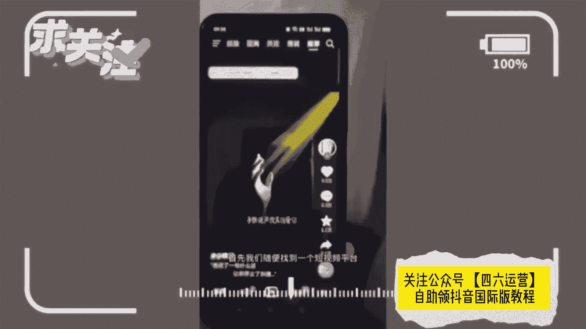

去找到它的搜索框，比如我们填写一个人间清醒的话题。

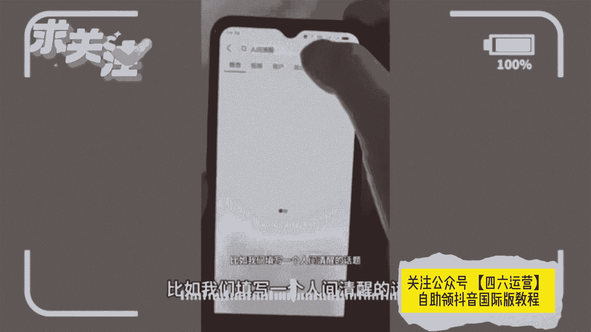

找到播放点赞比较好的视频。

复制它的链接到小程序里面提取文字，然后把文字粘贴到智能二创里面。

这样它会在原有的文案基础上，给我们生成一个原创的一个文案了，本文案的意思啊没有发生改变，但是每一个字都在原文案的基础上有所不同，生成好了以后。

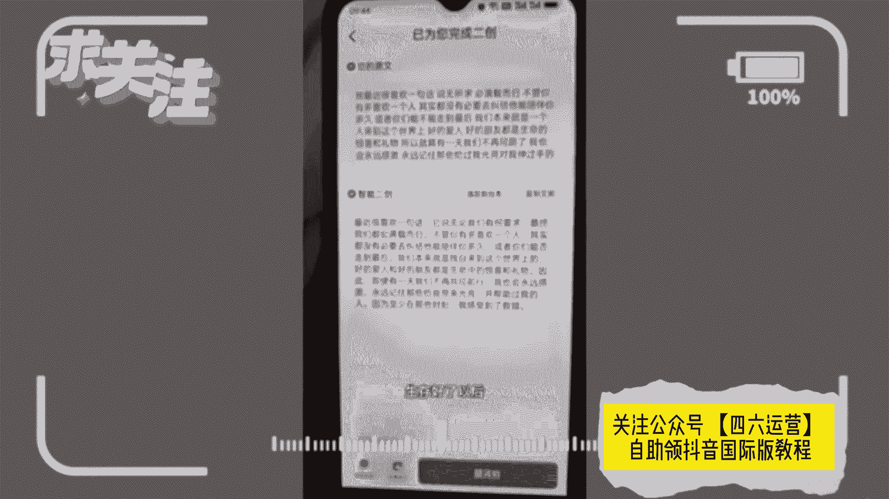

我们把这个文案给它复制下来，再切换到我们的翻译软件，把文案翻译成英文的，那为什么要英文的，而不是中文的呢，因为我们发布的视频啊，是给老外看的，不是给自己看的，然后打开我们的手机剪辑软件。

找到一个文字成片，再把我们复制好的文案给它粘贴进来，然后再点击右上角的生成视频，那这样他就会根据我们的文案，自动给我们生成一个原创的一个视频了，生成好了以后，我们点击右上角导入剪辑。

来给大家看一下效果吧。

Recently，I like a sentence，Very much。

It says that no matter，What we ask for，We will return home，Full of food in the end，No matter。

How much you like someone，There is no need to worry about，How long he can accompany you。

Or whether you can go to the end，We came to this world，Alone。

Good lovers and good friends are surprises and gifts in life，Therefore even if one day。

We don't move forward together，I will always be grateful and remember。

Those who have brought me light and helped me，Because at least in those moments，I felt reading med。

效果的话还可以啊，你们是不是想着这样就导出了，视频完成以后先别着急导出啊，我们再用下面的这些小工具啊，对它进行一个二次的处理，然后再把素材呢给它替换一下，这样才能让视频啊达到真正的原创效果。

由于时间有限，在这里呢我就不多说了。

处理好了以后，我们点击导出就可以了，然后我们再把导出的视频。

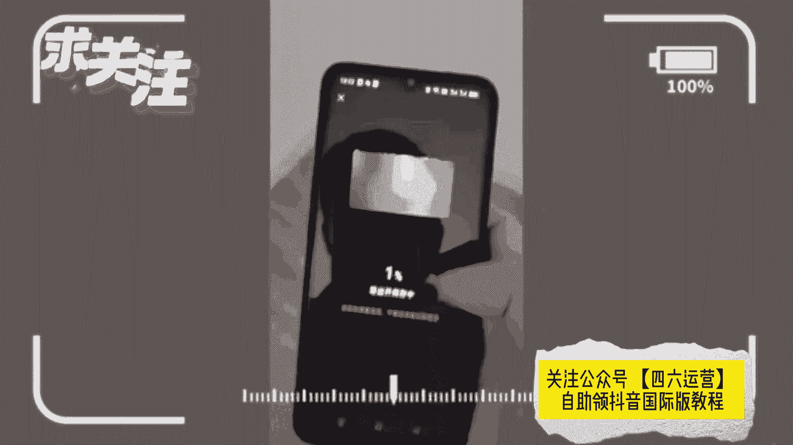

发到自媒体平台上面去，那有一份播放平台就会给我们结算一份佣金，其次我们还可以在视频的下方挂上商品链接，就像我现在给大家举例的这个视频啊，就可以挂上书本，背景音乐，U盘等等等等，都是可以的。

那变现的方法还是很多的，只是大家还不知道，像你们平时刷到我这种视频啊，你们可能还不知道他是如何变现的，我说的这些啊只是一个比较粗浅的一些玩法。

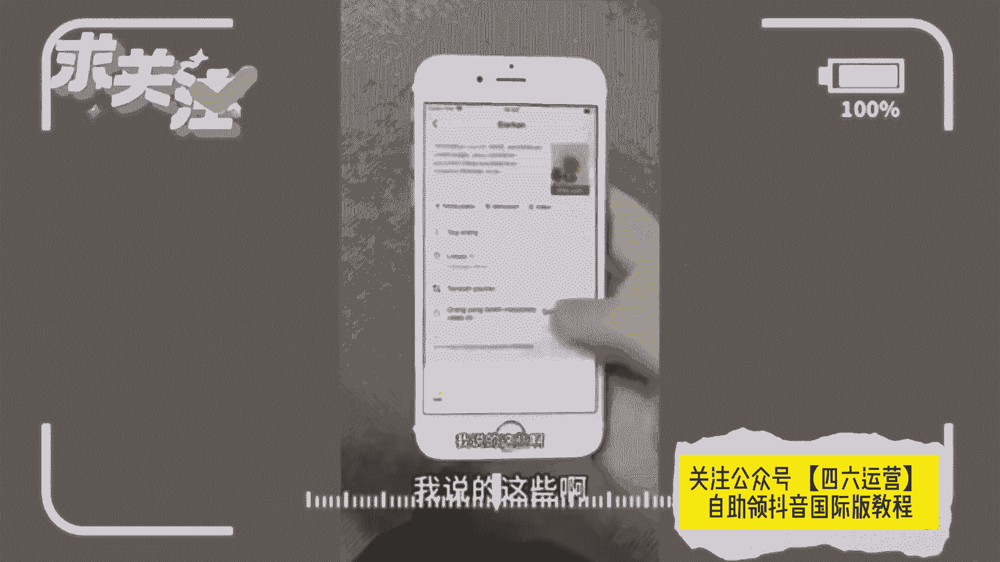

一般的日用品啊，国内外的差价基本上是10~15，那咱们勤快一点，每天花一个小时啊，更新个五六条视频，一天包个100单，那一单是10~15，保守一点一天是不是就能挣1000多块了，那如果说你一个月啊。

你报1万单呢，那大家回去啊仔细的算一下这个收益好不好，那我们再回想一下，这个方法不需要你去直播，也不需要你去带货，甚至啊也不需要你去拍摄，就用这个方法还是非常简单的，如果说大家都知道的话。

很快就能掌握财富密码了，那我给大家讲一下，会赚钱的和不会赚钱的人啊，永远活在两个世界，前者呢是处处是机会，后者啊处处是壁垒，真的很割裂啊，但也确实值得我们去深思，那具体的操作流程啊。

我已经整理了一份详细的资料了，那如果有需要在评论区扣个一关注我，我免费的分享给诸位，即抖音TIKTOK的认知以及未来的趋势，在讲之前，我希望大家能够说，去把自己珍藏多年的笔和纸给它拿出来。

给他做到一个登记，有句话说得好啊，叫做好记性不如烂笔头，把今天老师我所讲到的所有重点给他登记起来，好给大家看一下，今天咱们这堂课能够学到什么内容，分为三个点，首先国际抖音为什么会这么火。

第二目前跨境电商它的趋势，第三国际抖音它该如何去做到一个变现，咱们先从第一个知识点来做到一个学习，国际抖音它是什么呢，先从这一个点开始，国际抖音，它是字节公司旗下的一款社交娱乐平台。

于2017年5月份来做到一个上限，那愿景的话呢是激发创造带来愉悦啊，就是抖音国际版啊，和国内的抖音，他们俩是亲兄弟，但是他现在更多的会倾向于，短视频加电商的平台，就他必将走向国内的一条老路。

他会和我们现在的国内抖音变得一模一样，因为他的公司是同一家叫做字节跳动，他们的老板也是同一个叫做张一鸣，那国内抖音他都这么的成功了，那未来它必将走向国内抖音这么一条路，好。

那这个就是国际抖音TIKTOK，简单给大家来去介绍一下，了解一下，那紧接着我们来说一下第二个点，就是国际抖音和国内抖音来做到一个相比，有哪一些优势，角度比较多，咱们先从第一个角度，创作者的角度。

首先国内抖音，他对于创作者的专业技能要求是比较高的，剪辑拍摄文案等等，他都是相对的要更加的专业一些，因为国内的优质创作者是太多了，第二个角度内容，国内抖音内容的话呢，内卷的太严重了，没有什么特色的内容。

你很难从这个赛道当中去做到一个生存，第三人群角度，国内抖音人群是非常单一的哈，面向的话呢只有华人，而国际抖音TIKTOK它面向的话呢是全球化，人群是更加的广泛，第四平台规则。

国内的抖音它已经是非常成熟了，各方面的闭环都已经都已经是形成了，每个环节都需要更加合规化，而TIKTOK它就相当于咱们3年前的国内抖音，平台还不太完善，也不太严谨好，那这个的话呢就是为什么如此之火啊。

我们选择的一个原因，那紧接着我们来讲第二个，目前跨境电商它的趋势，当下跨境电商你要去面临怎样的一个现状，就很多，咱现场的话也可能有在做亚马逊的，有在做速卖通，独立站去拼范儿，哎虾皮等等等等啊。

一切这样的一个跨境电商平台，那可能接下来这几个点啊，你会深有体会，第一那物流成本它现在的话呢是变得非常高，运输时长可能是诶半个月，甚至的话呢是一个月的时间，第二付费流量呢是越来越贵了啊，竞争非常的激烈。

第三产品出口海外的要求是非常严格，你要有相关的产品认证，第四平台的合规化运营呢也是越来越重视了哈，海外仓储费它是非常的高的，如果说你库存堆积唉，你需要增加这样的一个成本，这么给大家讲。

像你如果说去做的这个国际抖音，第一个点物流分方面，国际抖音它是有一个物流补贴，物流的补贴的，你的费用不会说那么的高，第二我们去做国际抖音，他的话呢流量他不需要花钱，它是免费流量。

只要各位你们去发布这样的一个作品，你的播放量上去了，那他们就会进入到各位同学们，你们的店铺里面去购买东西，而你发布作品这个东西它需要花钱吗，他不需要吧，所以说啊对于这个流量来讲，它是一个免费流量。

产品出口还还啊，产品出口他的一个要求比较严格，需要相关的一个认证，你比如说你想要去做亚马逊这些平台，你比如说你想要去卖玩具。

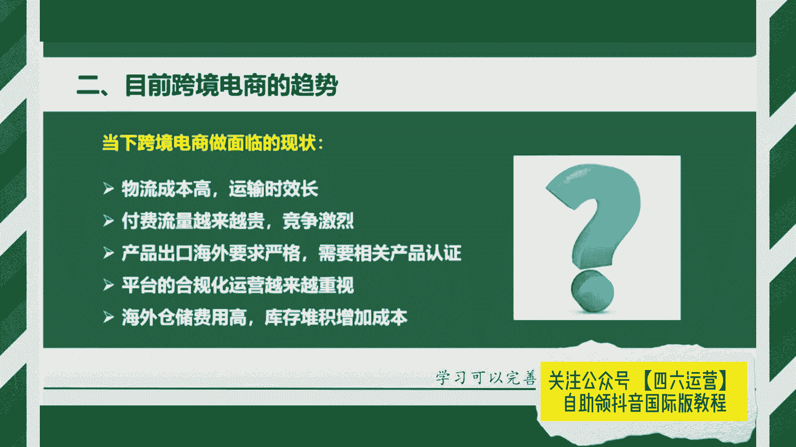

就各种各样的一些证书，但是如果我们去做这个诶国际抖音，我们可以去做带货，或者说我们可以去运营其他的一些平台，都是可以的，可以运营一个小店相关认证，各方面的话呢目前也是不太需要的好。

那像现如今国际抖音它也是刚刚才火起来，而且的话呢很多地方还是不太完善的。

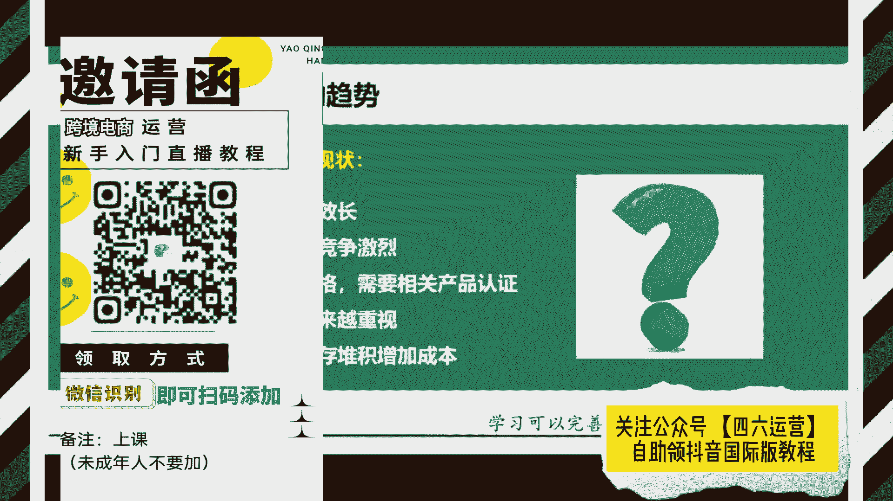

完全是可以去做这么一件事的，来咱们接下来往下讲讲重点，国际抖音该如何去做到一个变现呢，它的变现方式啊会变的多一些变现，首先带货直播私域或者其他变现，咱们一个一个给大家做了一个分享。

首先先讲第一个带货变现，讲带货，首先有一个联盟分销，利用亚马逊联盟，速卖通联盟，或者说EBAY联盟等分销平台，将分销产品链接挂在你的国际抖音，TIKTOK的一个账号的主页就可以了。

第二独立站SHINGF，你有货源也好，没货源也好，你都可以去做这么一件事，你只要将自己的产品链接，或者说是店铺的链接挂在TIKTOK的主页下方，就可以了，这第二个第3TIKTOKTIKTOK的一个小店。

亚洲印度尼西亚，马来西亚，或者说泰国，越南这几个地方的小店都可以开，但是你得要有本土的营业执照，什么叫做本土呢，本土的话呢就是在当地的营业执照，你比如说你有印度尼西亚，印尼马来西亚的营业执照。

泰国的营业执照，那可能对于有些同学来讲门槛会比较高，那还有一个是欧洲，欧洲的话，那就是英国，目前咱们中国的营业执照，就直接可以去开通英国小店，所以对于大部分同学来讲，英国是我们当下的不二之选。

这是TIKTOK小店，第4TIKTOK的呃，TIKTOK的一个小黄车，开通小店，它是自带小黄车的，小黄车是什么，视频左下角有一个小黄车，刷着刷着视频它就会弹跳出来。

但是的话呢每区你需要去借助这个shopping fire，来去做的一个开通啊，那shopping fire的话呢它是一个独立站，嗯相对的话呢门槛会比较的高一些啊，你得要先去开通一个独立站。

才能够说开通这个小黄车，这个就是带货挂链接，带货或者开通国际抖音小店来做到一个带货来，第二个第二个的话呢叫做直播变现，那直播的话呢分为两种，第一种的话呢叫做无人直播，你录制好视频之后呢。

你进行一个循环播放，你比如说像我们在国内抖音上刷到的诶，在放成龙的电影，再放李连杰的一个电影，还在放某某某谁的电影，那对于这个电影来讲，那咱们不能够说直接的去放啊，这个东西的话呢是涉及版权问题。

涉及版权，而我要告诉大家的是，它背后的逻辑，就是你可以去放一个东西，放什么呢，比如放视频，你可以放什么剥鸡蛋壳的呀，比如说橡皮筋勒这样，那个西瓜的呀等等一系列的哈，往这方面去想，很多你可以进行循环播放。

而外国人呢他有一个习惯就是给小费，你在睡觉之前，你把录制好的视频放到直播间，一直循环播放，第二天起来，你可能就是有百八十块钱的一个收益，这就是无人直播好，还有一个是有人直播娱乐直播。

那这个对主播的要求他是比较高的哈，他需要一门海外的语言，就比如说你得要懂英语，你不懂英语，那你确实只能够在这个屏幕面前对着这个屏幕，阿巴阿巴，那不行的，那人家不会给你送礼物的嗯。

你要能够和这个直播间的人群进行互动交流，人家才会给你送礼物，第二带货直播，你可以结合独立站或者小店来做到一个变现，进而提高自己的转化率，你可以直接在你的直播间去展示这个产品，如果说他们需要。

你就引导他们在你的视频，在你的直播间下方，小黄车直接可以选择做到一个购买好，这个就是直播变现，还有一个啊思域变现，私域变现的话呢，就是把主页挂链接的那个位置，不要挂卖货的一个东西，不要挂卖货的链接。

挂成你的联系方式，你比如说邮箱，what's up啊，这些的话呢都是还可以的，哎你能够说去挂FACEBOOK或者说YOUTUBE啊，上面的话呢，这个联系方式也可以，就是去做到一个相互的引流。

你可能两个账号，两个三个社交娱乐账号都能够火起来嗯，还有一个是CPA的推广，在账号主页挂一个app下载链接呃，用户下载并且使用，而且付费了，你就能够从中获得一定的佣金收益。

但是这一类呢大部分都是灰色产业哈，不太建议大家去做嗯，账号的话呢很容易和谐啊，来再讲一个其他变现，其他变现就是大家可能熟悉的创作者基金，首先各位年龄的话呢要大于18周岁，这第一个要求。

第二你要有1万个粉丝，第三你的账号作品30天内发布的内容，要播放量大于10万以上，这就是创作者基金收益的话呢，现在一般般一般般，然后还有一个是网络红人，利用海外网红接广告，整合海外的一个资源。

网红的资源对接国外的一些品牌方，厂家去做品牌出海，你赚取广告差价相对暴利哈，这个就像你们在国内，这个就像国内同学们刷到的一些视频，视频中央的话呢，他是不是穿插在那个广告，如果说你能火起来。

那你就能够说有品牌方联系各位，那这个一单的话呢这个利润还是蛮高的嗯，还有这个TIKTOK的服务商，比如网络环境搭建买卖账号，代开服务，和这个物流服务商软件的一个分析平台的代销。

像这些的话呢都是可以去做的一个变现渠道啊，变现渠道比较的多啊，未来的话呢，咱们会将一一详细的去做了一个讲解，那像今天的话呢，咱们这些内容呢就先给大家去做了一个分享了。

咱们未来还有非常多的一些知识和内容啊，这只是第一节课，先给大家来去讲解一下，未来你要去朝着的哪一个方向去前进，哪一个变现渠道去发展，这个咱们一堂课一堂课去做的一个学习。

咱们会见分晓的，欢迎观看本节课程啊，那这节课的话是给大家去讲解，苹果手机如何下载安装TIKTOK好，那也是作为一个新手小白去上手，来做TK这个第一步的一个操作啊，那首先这节课的话分为以下几个知识点。

给大家进行一个讲解，好，第一个知识点的话，就是如何去进行苹果手机的抹机啊，苹果手机的话，当然我们用的是是自己常用的，是国内的这个国行的手机，但是呢我们要把它模拟成海外的这样的，一个版本。

那我们首先要对这个手机进行什么进行抹机啊，那第二个的话就是一个邮箱的注册啊，因为这个邮箱是我们后期要用来注册，TIKTOK来使用的啊，所以说邮箱的话也必须要去注册好，第三个的话就是如何去注册好。

自己的一个海外苹果id啊，大家都知道我们在使用苹果手机的时候，自己的这个手机上都必须要有一个id啊，如果说你没有这个id的话，你是没有办法在这个苹果手机里面去，下载app的啊。

所以说我们一定要有这个苹果的id，第四个的话就是一个网络环境的搭建啊，网络环境的一个搭建，那第五个的话就是我们整个手机的一个，伪装环境的检测啊，因为我们为什么要去检测它这个环境呢，如果说你的环境不对啊。

或者说有问题，那你在后期运营这个TK的时候，他肯定会出现问题啊，会肯定出现问题，所以说我一定要把这个环境给它检测好，那第六个的话就是一个账号的注册及TK，界面的一个认知啊，那首先的话我们一个一个来看啊。

一个一个来看，那在讲这个第一个知识点之前，给大家先讲一下这个苹果手机的一个选购啊，因为有很多同学他在这个购买手机之前，他不知道要购买哪一款手机好，虽然说苹果手机这个就只有这一个系统啊。

但是呢它的种类还是要比较多的对吧，比如说像苹果6S啊，苹果七苹果八对吧，苹果叉哎等等很多很多，那这边的话，老师给你们推荐他选购的一个基础啊，就是6S啊，6S就可以。

因为老师这边的话也是在用这个苹果6S啊，就说你也没必要就说购买一个特别贵的啊，比如说用这个苹果13啊，苹果12等等啊，这样一些手机的话是没有必要的啊，因为我们只是说用它来去做一个账号啊。

所以说买一个二手的苹果6S手机就OK了，但是呢对内存这方面的话，其实还是有一点小小的要求啊，就是你最低的话是32G啊，不然的话你在运行这个TK的时候，后期肯定会卡啊，肯定会卡。

所以说一般建议大家就是在使用的时候啊，就是在购买的时候最低32G啊，就是它的一个运行内存啊，当然如果说你购买64啊，128这个的话都是没有任何问题的啊，那如果说你购买更高的，比如说像苹果七，苹果八啊。

还有苹果X十一十二啊，13等等都是完全OK的啊，就是最低的配置的话，我们就建议大家去买这个苹果的二手的，这个6S啊，就OK了啊，那第二个的话就是一个渠道啊，很多同学不知道在什么地方去购买。

首先第一个的话就是淘宝嘛对吧，大家平时这个用的最多啊，还有京东像咸鱼都可以啊，但是有一个点就是大家在购买之前，先这个询问厂家，这个手机的话能不能这个恢复出厂设置，也就是说能不能抹机啊。

如果说抹不了机的话，那这个手机的话你购买来也是不能去使用的啊，还有第二个点的话就是你在选取购买的时候，问一下这个商家啊，他这个手机里面有没有id，为什么呢，如果说这个手机里面有id没有退出的情况下。

你在这个抹机的过程中，他让你输入密码，那你不知道对吧，所以说这个也是没有办法进行抹机的，所以这两个点的话大家需要注意一下啊，小小的细节，那如果说你真的不知道在什么地方购买啊。

没有这个值得信赖的一个地方的话，那你怎么办，你要找老师啊，老师这边的话可以帮你推荐啊，帮你推荐，那这个的话就是我们前期做一个手机选购啊。

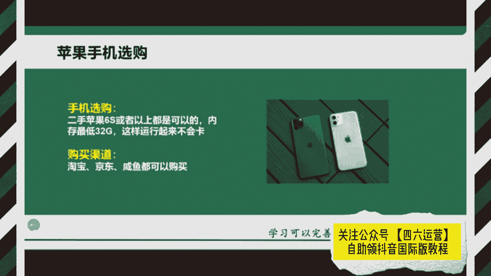

需要给大家去讲的，那接下来给大家去讲一下，这个邮箱的一个注册啊，邮箱的一个注册，那在前面我刚讲过啊，为什么我们要去注册这个邮箱，就是这个邮箱用来注册我们后期的，比如说TIKTOK的一个账号啊。

以及我们的这个苹果id啊，以及我们还要注册其他的一些东西等等啊，也就是后期都会用到这个邮箱，那邮箱的话，我一般推荐大家去注册这个outlook的一个邮箱啊，outlook那当然你注册谷歌的话也行啊。

注册一些其他的海外邮箱也可以，但是老师这边就给大家统一啊，让你们去注册这个outlook邮箱，那为什么要推荐大家去注册这个邮箱呢，首先第一个点他注册的话比较简单比较方便啊，比较简单比较方便。

而且的话也不需要你去呃，输入这个手机号，每天的话你都可以注册三个邮箱啊，每天可以注册三个，但是呢，那这样的话你换不同的一个IP，他也可以注册三个啊，就是说你只要在一个IP上，他每天顶多就三个账号啊。

不过你每天都可以注册嘛，所以说这个也就是说无限循环的这个注册啊，你邮箱的话是完全不缺的啊，那我这边会给大家去进行一个详细的演示，首先第一个的话就是电脑端的一个注册啊，第二个的话就是一个手机端的一个注册。

因为考虑的考虑到了有很多的一个同学，他可能没有电脑啊，所以说我这边也会给大家进行一个，手机端的实操演示好，那接下来的话我就给大家去这个演示一下。

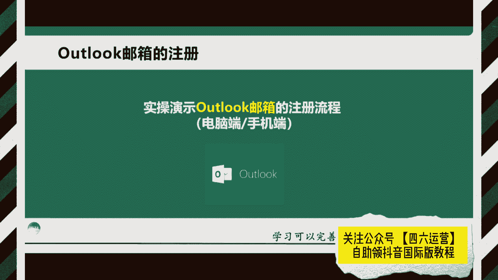

这个注册的一个流程啊。

接下来我给大家实操演示一下，outlook邮箱的一个注册啊，这个是电脑端的一个演示实操，那首先我们在浏览器里面去搜索这个outlook啊，搜索outlook，那我用的是这个微软啊。

就是笔记本这个自带的这个浏览器好，就电脑自带浏览器，那你们的话用其他比如说谷歌360都可以啊，那么直接在这里去搜索OUTROOK还是outlook，直接搜索，然后搜索进来之后的话。

就是第一个可以看到吧啊就这样的，直接点击进去啊，那点击进去之后的话，我们往下面拉一下，这里有个创建免费账户，然后我们点击，然后这个加载是比较慢的啊，加载是比较慢的。

那这个前面给大家讲过outlook邮箱的话，它每天可以免费注册三个啊，就是不需要绑定手机号的一个情况下，可以注册三个，相对来讲还是比较方便的啊，那进入到这个界面之后，我们就需要干嘛呢。

需要去输入对应的这个电子邮件啊，电子邮件啊，比如说我叫卡尔CARR卡尔啊，然后呢我再打几个数字啊，比如说6688啊，看一下行不行啊，OK这个用户名已被占用啊，那我就需要改一下了，比如说857857啊。

也被占用了是吧啊，在后面再加一个TTOK857哎，好下一步OK啊，这个是没有被占用的啊，这里的话就需要我们的，输入我们的一个账号密码啊，你们自行来进行一个设计就行啊，进行设计就行。

OK然后我们点击下一步，然后这里的名字的话就是英英文就行，好随便选，比如说c a r car啊，这个我把C放在前面啊，这样打打卡二啊，然后我们就点击下一步啊，然后这里的话就是出生日期啊。

这类地区选择中国没关系，好中国就可以是吧，然后呃比如说你要去住在其他地方的，也没有关系啊，就是这个地方的地区的话，就不用去管他啊，然后这个地方的出生年月日啊还是一样的，一定要大于18周岁啊，记住啊。

大于多少18周岁，比如说1996好月份的话，你就随便去写了啊，随便去写这个就没关系啊，然后我们点击下一步，这里的话加载会比较慢一些啊，你们就耐心的等待就行，OK这里的话就是呃请回答问题。

以证明你不是机器人吧，啊这是一个验证啊，这个选出骆驼啊，找骆驼哪一个是骆驼啊，点击这个，这是一个图形的验证啊，这个相对来讲都是傻瓜式的操作啊，没有什么难度啊，很简单啊。

这个的话就是提示你是否保持登录状态啊，你可以点试以后，也或者说点击辅都行啊，我就点击服，OK当出现这个界面的时候，他就已经在进入这个邮箱了当中了，啊啊那进来之后你可以看到啊。

这就是我们已经注册好的一个outlook的一个邮箱啊，你看欢迎这个加入我这个奥特克的一个账户啊，你好啊，欢迎使用新的OCO账户，通过什么可以联系啊，等等乱七八糟的这些东西是吧啊。

这个就是我们一个电脑端注册outlook的一个邮箱，的一个整个实操过程啊，要怎么去看你的账户在哪里，点右上角这里啊，右上角这里的话它有一个C啊，你点击一下就是你的账户这里啊。

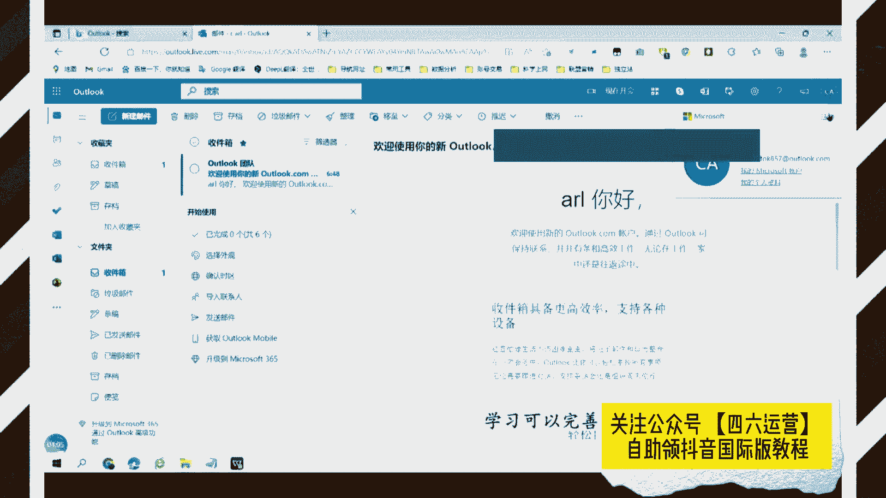

你可以看到这个，就是你刚刚所注册的这个邮箱啊。

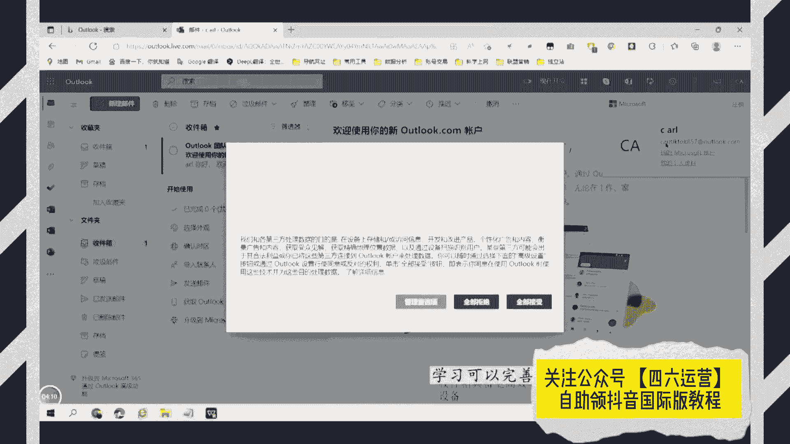

它整体的名称啊，整体的名称可以看到吧啊就在这个地方啊，然后这个的话就是电脑端注册啊，outlook的一个全过程，那给大家演示到这里。

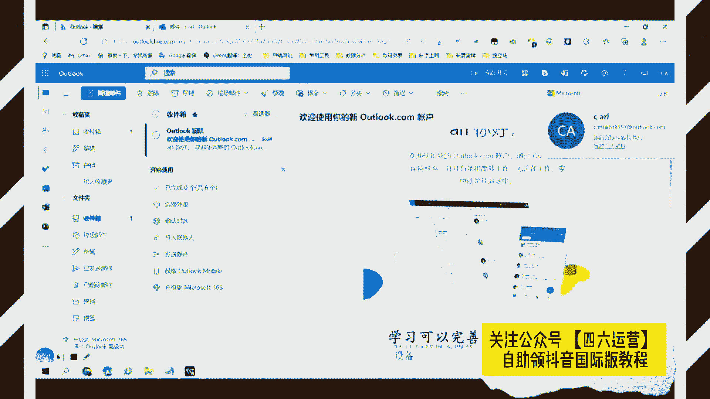

OK好，那接下来我给大家去讲，进行这个苹果手机安装TIKTO的一个流程啊，我把它主要划分为以下九个点啊，第一个的话就是手机抹机啊，这是第一个小小的步骤啊，一定要记得，首先当你拿到这个手机之后。

要对这个手机进行抹机，那某集完了之后需要设置设置哪些东西呢，首先第一个的话就是设置好它时区啊，比如说举个很简单的例子，我现在要去做这个美区的这个，TIKTOK的一个账号。

那我把这个市区肯定要给他改成美区的啊，比如说洛杉矶的好，纽约的对吧，把信号的时区给他改过来啊，那第二个的话就是一定要把它的低位给它关闭，那为什么要把它定位给它关闭了，如果说你把定位不关闭。

它定位的是我们中国的地区好，那我们要模拟成海外的地区的话，一定要把定位关闭啊，定位关闭，第三个的话就是把他的语言给他修改过来啊，语言给他修改过来，第四个的话就是关闭广告跟踪啊，关闭广告跟踪这一个点的话。

就是有些系统它是有的，有些系统没有啊，没有的话你就不用管，有的话你就把这个关闭就行啊，那第二个的话就是我们要做的一个流程的话，就是注册海外的一个苹果id啊，海外id的话我们可以用QQ邮箱啊。

或者说谷歌邮箱以及像outlook邮箱啊，这几个邮箱都可以去使用啊，如果说其中一个不能用，你可以换其他的邮箱来注册啊，换其他邮箱来注册，那第三个的话就是在这个苹果的商店。

也就是apple store里面去登录，这个自己的一个海外id啊，这个一定要记住啊，很多同学他会在手机的设置里面去登录，这个是非常不可取的一个做法啊，这里一定要强到大家在这个商店里面登录，为什么。

因为很多在这个设置里面登录，它会出现验证啊，导致你这个id这个登录不上去啊等等，还有一些其他的问题，所以说这边强烈建议大家啊，就直接在这个apple store里面去登录好的。

也就是说它的苹果商店里面去登录，这个海外id好，这是一个小细节，大家可以做好笔记啊，第四个的话就是登录之后，那我们要去这个淘宝购买一个五美金的礼品卡，那为什么要去购买五美金的礼品卡呢。

也就是我们下面对应的这个小火箭啊，第五步啊，就是你要安装这个小火箭的时候，它是需要付费的啊，因为这个小火箭的话它需要2。99美金啊，2。99美金，那所以说我们需要购买一个五美金的礼品卡好。

那很多同学有一个疑惑，哎老师这个小火箭的话，它不不是2。99美金吗，你为什么让我购买一个五美金呢啊，那其实这里同学可能不知道啊，因为你在注册这个id的时候，他在选择地区的时候有一个什么问题呢。

就是有一些州啊，有一些州他是不免税的啊，不免税的话，他会在你购买的时候扣除相对应的手续费啊，所以说你购买三美金的话，这个呃在付费的时候他就不够用了啊，所以说一定要让大家去购买一个五美金啊。

这就是一个小细节啊，大家也不要去说啊，为什么我购买三美金不行啊，你就直接购买五美金啊，他完全就可以使用了好吧，那接下来给大家去讲的，那我们在这个中国啊，在中国的话就是你在不翻墙的一个情况下。

完全是可以去访问我们国内的这个抖音的对吧，但是TIKTOK它是海外的啊，那海外的话我们要借助一些这个，然后呢去给它翻出去啊，这样的话才能够去访问到它啊，那由于这个话题比较敏感。

我就在这里不给大家去详细的讲解啊，就是这里推荐大家使用的话，就是这个just my sucks啊，这个网站里面去购买啊，当然待会我也会给大家去一一的去详细演示，每一个步骤啊。

那第七个的话就是使用这个小火箭啊，进行这个扫码啊，也就是扫哪里的这个二维码了，就是你刚刚前面购买的这个just my socks啊，这个网站里面的这个二维码啊，购买之后，他在这个购买的服务里面。

就会看到你购买的这个节点啊，然后就是把这个二维码给他扫进去就行啊，然后连接啊，那第八个的话就是我们做TK之前，一定要去做的一件事情啊，就是检测环境啊，检测伪装环境一定要去做啊，如果说你不去做的话。

你不知道你的手机它的伪装度是多少，也就是说你的伪装环境的话，它是个二三十啊，这种情况下肯定不行啊，也就是说你的伪装环境的话，至少是这个百分之百啊，或者说90%啊，90%都是可以的啊，那用到的网站的话。

就是我后面给大括号里面的这个啊或delete啊，这个网站啊，那第九个的话就是我们要去这个app啊，这个store里面去干什么，搜索下载我们的一个TIKTOK的一个app嘛对吧，那你搜索下载下来之后的话。

就可以进行账号的一个注册啊，这也就是我们在苹果手机端安装TIKTOK，以及注册账号的整个流程啊，我把它大致分为九个步骤啊，那接下来的话我会针对这九个步骤，一一的给大家进行一个详细的演示实操教程啊。

同学们的话要注意听啊，也要做好相对应的笔记好吧。

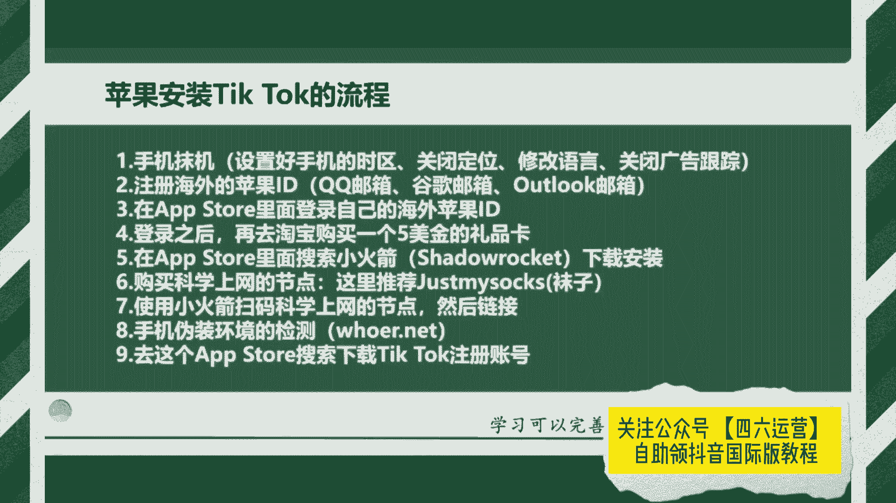

那首先第一个啊，我们来给大家去演示一下，这个苹果手机抹机的一个流程啊，那苹果手机的话这个比较多对吧，比如说像苹果七，苹果八等等啊，苹果11，苹果12，苹果13啊，这么多对吧。

那今天的话老师就以这个苹果6S为例啊，给大家做一个演示啊，那其实苹果手机它的系统都是一样的啊，同一个系统，所以说它的某机的话，它大致都是相似的啊，如果说有个别你不懂的啊。

你都可以截图或者说拍视频发给对应的解答，老师啊，这边的话都会给你进行一个讲解啊，那今天的话老师这边的话就以这个苹果6S啊，作为一个母鸡啊。

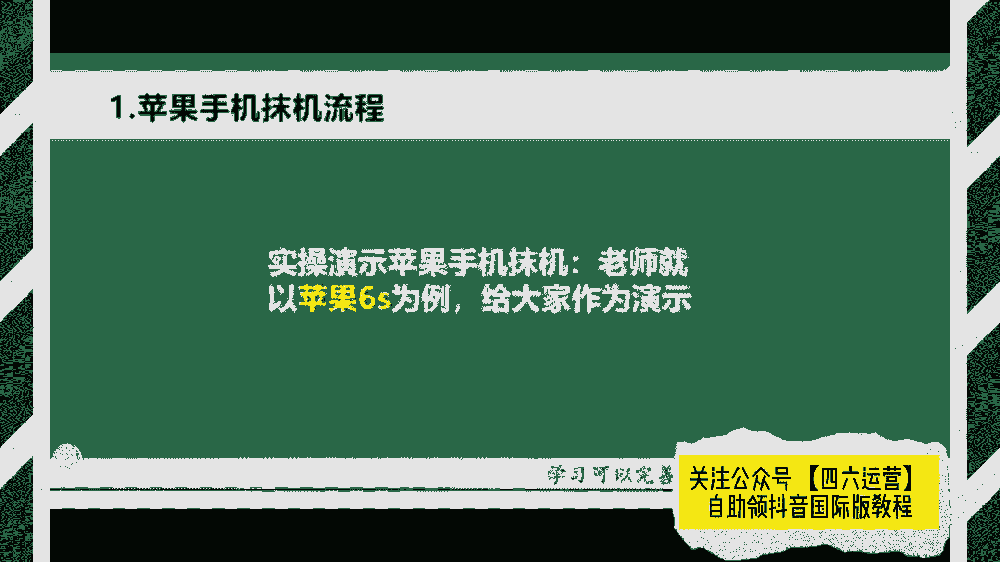

给大家去进行一个详细的演示好，OK那接下来的话给大家实操一下苹果手机，某机的一个教程，嗯啊这个手机的话是老师用的苹果6S啊，以苹果6S给大家为例进行一个某机实操，那首先的话这个就是一个新买的手机啊。

而且的话什么里面都没有下载，里面是没有插卡的啊，然后就连接了一个WIFI，那接下来的话我们怎么去给它进行抹机呢，首先点到这个设置里面去啊，点到设置里面的话，然后往下面滑啊，往下面滑。

然后呢找到这个通用啊，就是通用这里点击通用，然后呢点击通用之后呢，滑到这个地方有个还原啊，点击还原，然后呢上面第二个抹除所有内容与设置，然后点击这个啊，然后呢抹掉IPHONE再继续啊。

点抹抹掉IPHONE，那在这一步之后，他手机的话就会重启啊，就是进入这样的一个界面，大概这个过程的话就是呃一到2分钟啊，一到2分钟这个看手机啊，每个手机的话它都不同，有的手机的话它进度比较快。

有些手机的话它进度的话相对比较慢，同学们的话就在这个地方，耐心的等待一下就行啊，OK好当他这个重启完成之后。

它就会进入到这个界面啊，进入到这个界面之后，我们应该怎么做呢，直接按这个手机啊，这个home键就是中间这个小圆圈啊，按一下啊，按一下之后它会出现一个语言的选择，那我们肯定是要选择这个英文啊。

就是你要去做台湾的话，你可以选择繁体的中文，那如果说你要去做英国美吹啊，你就直接选择ENGLISH啊，选择英语，那进来之后的话，这一步就是我们要去选择国家的时候啊，就是地区的时候。

那我们直接划到最下方啊，选美国，找美国的话就是这个啊，you know it states啊，当然老师的英语不是很好啊，大概就是这个意思就是英语啊，额选择英国和美国啊，然后选完了之后。

直接点击这个下面这个蓝色的啊，还是一样，现在的话直接点击这个中间的白色的往进走啊，这里的话就需要大家去选择一个呃这个WIFI，然后呢连接上啊，就是你自己的手机开个热点，或者说你自家的WIFI都可以啊。

我这边的话连接一下，OK当它连接上这个WIFI之后，就需要设置这个手机啊，大概就是稍微等他那么一分钟左右啊，这里的话他也是比较慢的啊，就是跟之前重启的那一个时间段差不多，OK进入到这个界面之后的话。

我们就直接点击上面的啊，这个蓝色的这里点击，然后呢这里就是让你去输入你的这个id，那我们肯定是没有的啊，后期再去输入啊，在某机的过程中不需要去输入id，然后我们点击第二个点第二个了，然后点不使用啊。

然后在这个进来之后，我们点中间蓝色的这个地方点蓝色的，然后呢我们点最后一个就是第四个这一步啊，然后呢我们检点不使用啊，第一个OK然后进入到这个界面之后，我们就点最后一个。

然后呢这里的话就是让你去输入你的id，然后你就暂时先不用点中间这个蓝色的，然后呢点这个稍后再去设置啊，中间蓝色的，然后呢点这个不使用，Ok，那这里的话就是他苹果的一个协议啊，苹果的一个协议。

然后呢我们点击agree同意啊，好这一步的话就是一个定位跟这个数据分析，然后我们点这个下方的啊，就是第二个这个，然后我们点这个设置啊，然后还是点这个中间的啊，然后这里的话也是个定位，我们点第二个。

然后点OK就把定位关闭，然后这个SIRI啊，这个东西的话我们也是稍后去设置啊，点第二个，然后这个时间的话我们也是点第二个啊，还有这个app的苹果的一个数据分析，然后我们点不去啊。

然后这里的话就是一个界面啊，深浅，然后我们点这个默认的就行啊，这里的话也是一样，就总共一个按钮啊，你直接往下点就行啊，这里也是一样的，OK那这样的情况下的话，我们的这个手机就进来了啊，都进来了。

但是呢还没有抹去完成，那我们需要干什么，需要设置啊，需要设置它的这个语言时区跟定位这些啊，OK然后呢我们给他点到这个设置里面去啊，设置里面进来之后，它会跳出一个这个啊，就是访问WIFI与数据。

这个的话我们点第一个啊，一定要点第一个就是第一个WIFI与数据，蜂窝数据啊，点了之后的话，我们滑到这个设置里面去点开设置，然后呢找到time时间啊，这个date跟time这个就是日期与时间。

然后呢我们把这个定位给他，找到这个美国的洛杉矶啊，so l o s啊，就是美国洛杉矶的一个简称啊，如果说大家不知道的话，可以自己自行去百度啊，然后搜索点击这个OK，然后这里的话就是美国洛杉矶的一个时区。

你看看到他现在已经是改过来了哈，然后我们再点返回，然后点返回了，找到这个隐私啊，就像手一样的这个东西，点击进去进去之后的话，先看下定位有没有关闭啊，因为我们刚刚在这个某机的过程中，已经把定位关闭了。

所以说他这里没有显示啊，然后这个地方也给它关闭啊，然后点返回啊，再点返回，Ok，那这样的话就是整个的操作的话，就已经完成了啊，已经完成了，那有些部分的话它是有这个广告跟踪的啊。

有些有些手机版本它是没有的，广告跟踪的话有你就给它关闭，没有的话就不用关啊，广告跟踪的位置的话也给大家去讲一下啊，就是在这个定位下方啊，定位的第2号有有的是没有的啊，那这个手机的话就是整个设置啊。

就是已经设置好了啊，然后很多同学会发现哎，这个上面的这些app好像都是在等待当中啊，还没有下载，要怎么办呢，你点击一下啊，点击一下它就是否访问这个WIFI数据啊，你点第一个啊，访问允许啊。

那你看可以看到吧啊，他所有的app就开始下载了啊，就是因为你刚刚没有点允许啊，然后这样的话，就整个的手机已经给它磨机完成了啊，好OK啊，那接下来的话我给大家去讲这个第二个步骤啊。

第二个步骤的话就是一个海外id的一个注册啊，海外id的一个注册，那在前面我给大家讲过，就是我们在app store里面去下载这个app的时候啊，它都需要一个id啊，就是你们国内用的手机对吧。

用过苹果手机的同学都知道他必须要有这个id，因为你没有id，你就下载不了这个软件啊，下载不了这个app，所以说一样的，那我们还是要注册这个海外的id好，那注册海外的id的话。

我这边也会给大家进行详细的一个演示，首先的话电脑端应该怎么去注册啊，手机端应该怎么去注册啊，详细的教程的话，我可以给大家一步一步来进行一个实操好吧，那接下来的话我就给大家去实操一下。

这个演示的一个流程啊。

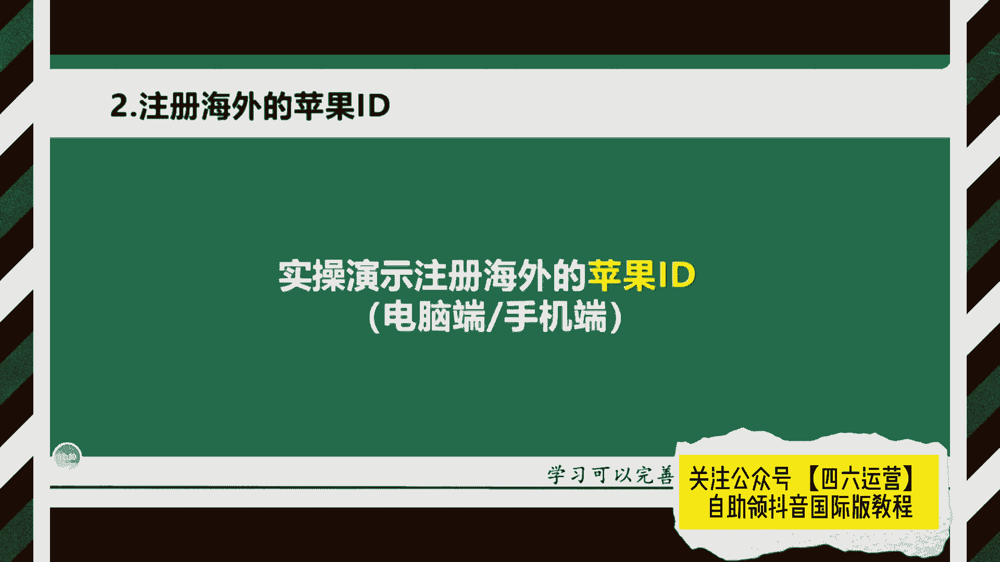

啧大家好，我是卡尔老师，今天的话给大家录制一个电脑端，如何去注册海外苹果id啊，首先的话我们打开这个自己的浏览器，你自己那边的话有谷歌就打开谷歌，如果说没有谷歌，你使用其他的浏览器。

比如说像360安全或者说其他的都可以好，打开浏览器之后，在这个浏览器的搜索栏输入iPod id啊，就是苹果id的一个官网，就这个官网啊，apple id的com，然后输入进去之后的话。

点这个右上角可以给你们放大一下，右上角这里的话有一个创建您的id啊，然后点击一下，点击进去之后，这里的话就需要去填写你的这个姓名啊，包括这个名字啊，这里的话你可以随便去填写啊，比如说哈哈啊。

但是这个填写的话就是用英文就行啊，就随便填写都没关系啊，随便填写都没关系，然后第二个的话就是地区地区，这类的话我们需要选择美国，一定要去选择海外的地区啊，海外地区不要去选择国内的啊。

然后这个出生日期的话，这里的话我们就需要去填写到这个，大于18周岁就行啊，比如说1997啊，或者是1996都行好咳，然后这里的话就随便去选择啊，日期只要大于18周岁就行，一定要记得。

就是这个国家和地区要选择海外的，比如说你要注册美国，你就选择美国，注册英国，你就选择英国就行，然后这里的话就是你的邮箱，那我这里的话给大家准备了一个outlook的邮箱，outlook邮箱。

然后给它添加上去密码，这里的话也是一样的啊，密码的话就需要设置一个八个字符大小写数字，然后我这边填写一下这个密码，OK密码填写完成，这里的话需要输入我们自己的一个手机号啊，这个手机号的话就填写一个。

这个我们自己国内的就行啊，1738434，OK啊，输入这个手机号之后，输入这个手机号之后的话，点击下方的这个验证码啊，就是他有个验证码的输入，OK然后呢点击这个继续啊，前面的这些东西的话。

我们都已经输入的差不多了啊。

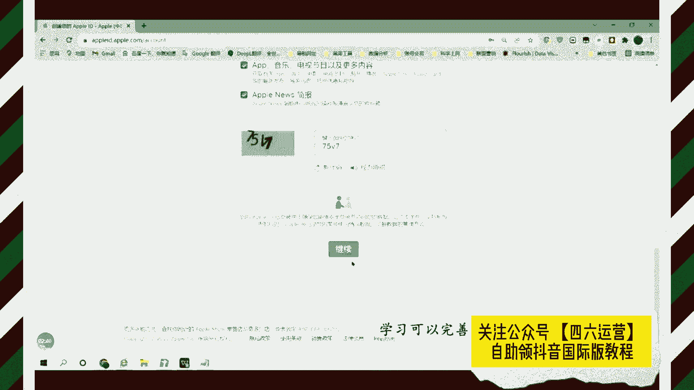

直接点继续，然后他会在你的这个邮箱里面。

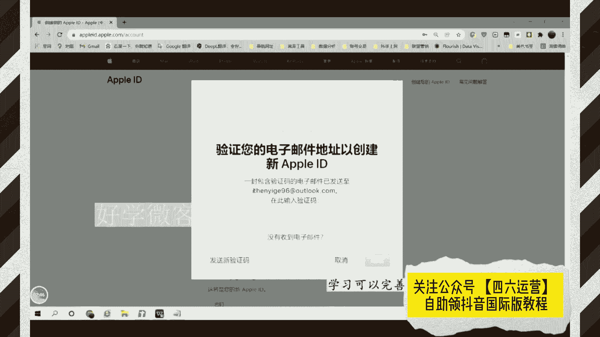

发一个这个验证啊，就是你的邮箱里面发一个验证码，然后你去你的邮箱啊，因为我在这个注册之前已经登录了我的邮箱，可以看到这里就会发一个邮件过来，然后你点击打开好。

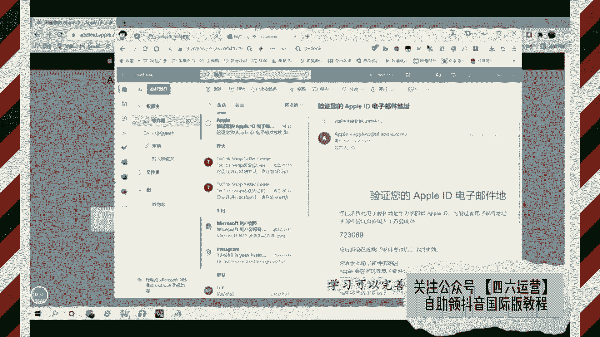

这里复制这个验证码啊，回去再贴到这里去，然后点击继续，然后呢他会在你的手机的话发送一个验证码啊，这个的话就是验证验证手机的接个码，稍等一下，6673033，OK然后点击继续。

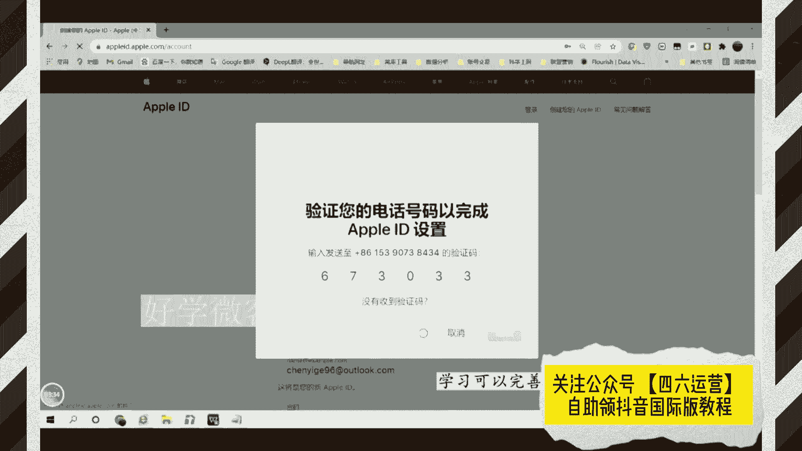

好那这个的话就是我们的这个呃，整个的一个id就已经登录好了啊，都已经进来了，那我们接下来的话，就需要去给他填写他的一个付款信息啊，需要填写他的一个付款信息，那付款信息的话，然后需要在什么地方呢。

就是点击这里啊，下方的话有付款信息这里，然后呢点击这个添加付款方式啊，然后把付款方式给他添加上去，那这里的话就是我们因为注册的是海外的，这个id嘛，所以说我们需要这个海外的信息。

所以说我们还需要一个海外的身份信息网站好，然后的话就把这个信息填写进去，我找一个海外的信息网站好，稍等一下啊，打开我们的这个浏览器，然后在这里去输入海外人哎，海外人信息，海外人身份信息啊，信息网站。

OK然后点击第一个啊，进去之后的话就是这样的啊，我们可以把它对应的信息，比如说像他的街道啊，城市啊，邮编以及这个周还有电话都给复制过去啊，也就是说我们的id里面需要填写什么。

然后我们给他复制什么就可以啊，然后可以这里地方美国啊，就付款方式的话，他这里选择的是无这个地方的话，我们不需要管它，不需要动好，默认就行，然后接到这里的话，我们就把它复制过来，可以看到吗，这里有街道啊。

然后你把他这个复制过来，添加到这个街道里面去，然后像这个楼号这些地方你都可以随便填啊，就填个一就行啊，填个一就行，城市的话需要给他复制过去啊，因为城市的话他能够查得到啊，城市又需要还有周周的话。

他这里可以看到吧，周的话它是英文，但这个英文的话我们不知道他是哪个地方的啊，所以说我们需要把它翻译一下，比如说复制这个搜索一下这个谷歌翻译，或者说百度翻译都行啊，这两个这两个东西的话都可以翻译啊。

就是正常我们日常用的这个翻译的软件啊，百度翻译谷歌没有翻墙的话，可能进不去，OK然后的话复制刚刚的这个周可以看到吧，这个阿拉巴马州啊，然后呢找到这个周阿拉巴马州啊，好这个是ya啊，这个应该是翻译错了啊。

这个是亚拉巴马州啊，然后找到这个周之后，我们还需要去把他的邮编啊，就这个邮编给他填写进去啊，填写进去，然后呢再把他的这个电话号码也是一样的啊，他这里应有尽有啊，就给他一一对应。

说白了就是给他复制粘贴过来的一个事情啊，然后呢你上面的这个账单的一个送货地址啊，已经填写完成了之后，它这里有一个什么拷贝账单寄送地址哎，直接拷贝，因为你下发的这些送货地址也需要填写吗。

哎你直接点击这里拷贝拷贝就行，然后公司这里的话可以填也可以不填啊，要填的话填个一就行啊，这些东西都不是很重要，因为他只是说借助美国人的身份信息，然后呢我们来把它注册一个账号啊就行。

把这些所有信息都填写完成之后啊，填写完成之后，点击这个右边的更新啊，点击一下点击更新啊，当它出现这个界面的时候，就已经更新完成了啊，就是他已经储存好你的更改了，然后把这个关闭啊。

然后呢回到我们的这个付款信息，刷新一下，付款方式这里刷新一下，我们之后再点击进去啊，再点击进去啊，OK你可以看到你的这些所有信息都在了吧是吧，那这个情况下的话，我们就是把整个的一个苹果id。

从最开始的注册到后面的付款方式的填写好。

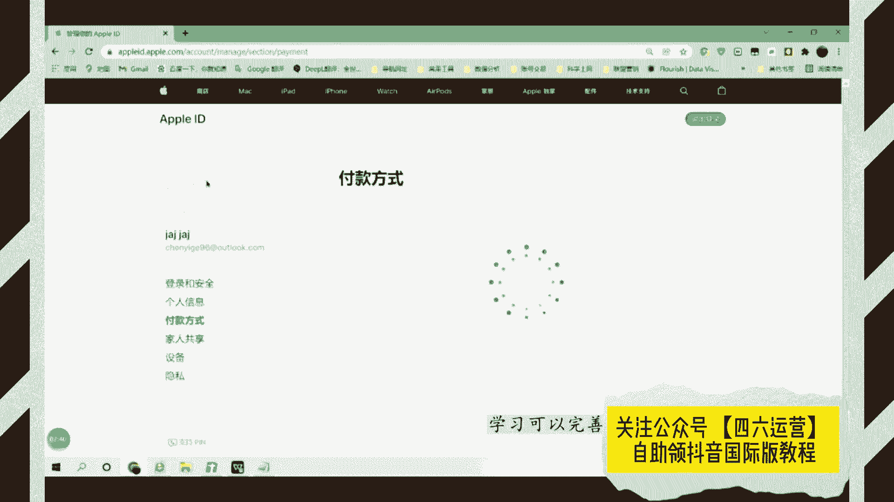

整个都填写完成，OK那接下来给大家去讲一下这个第三个啊，就是在商店里面去登录，自己注册的一个海外苹果id啊，这个也是非常至关重要的啊，至关重要的，大家要做好笔记。

一定在这个apple store里去登录，不要在自己的设置里面去登录，记住啊，不要在自己的这个手机设置里面去登录，好吧好，这里我给大家进行一个重点的一个强调啊，重点的一个强调。

因为很多同学在这里就犯了一个小错误啊，就是很多同学他会在设置里面去登录啊，千万不要这样去做啊，记住在apple store里面去登录，也就是我们常用的这个苹果的商店啊，苹果商店好。

那接下来我给大家去实操演示一下这个海外id，它登录的一个流程啊。

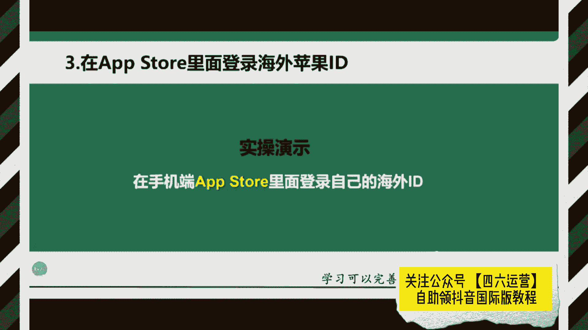

Hello，同学们好，今天的话我给大家录制一个，在手机端登录自己的一个苹果海外id的教程啊，那首先的话我们拿到了这个手机的话，是抹过机的啊，一定要记得就是抹过机的，抹完机之后的话。

连接上自己的一个WIFI或者说自己的热点，那这边的话老师在这个录制的时候，连接的是我自己的热点啊，就是在联网的一个情况下，然后呢我们登录自己的海外苹果id，然后登录的时候的话，一定要记得在这个苹果商店。

就是这个app store里面去登录啊，就是apple store里面去登录，然后我们打开我们的这个im star，那打开之后的话大家可以看到啊，进来就是这样一个界面，进来之后的话。

我们点击这个右上角这个地方啊，打开这个右上角这个头像啊，然后在这里呢输入我们的注册好的，这个id的账号和密码啊，稍等啊，随便的话输入一下。

呃656234on close o u t r o o k点COI，然后呢我这边的话密码就不给大家去看了啊，我这边的话输一下密码。

OK啊，输入密码之后的话，我们点击啊，就是把你的账号跟密码输入完成，输入完成之后，我们点击下方的这个登录啊，就是左下角这个啊点登录，点击，由于你的账号的话注册下来是新的账号啊。

新的账号的话他会发送到你的这个手机验证，可以看到吗，就是你的手机会接受这个验证码啊，这个的话就是你在你的手机号就可以看到，贴个码就行，我这边的话我梳理一下，272237272哎，输错了，272。

237OK好，输入验证码之后，它就会自动跳转到这一步，然后你就等他这个加载啊，因为他又上去的话还能转圈圈啊，到达这一步的话，就很多同学就不知道怎么操作了啊，一直问老师对吧，然后今天的话就给大家去讲一下。

到达这一步怎么操作，因为由于你的账号的话，他是新的账号，新的账号的话，你第一次登录它会有一个验证啊，就会有一个验证，我们点击右边的这个检查啊，游戏验证一定要记得点击右边的这个好。

点击右边的点击那点击进来之后的话。

它就会跳转到一个你填写信息的一个界面了啊，就这个地方的话就是一个协议啊，你就不用管它是什么协议，你点击这个右边的开关给它打开，打开这个开关本来是关闭的，然后你把它打开啊，打开之后的话。

我们点击右上角的这个下一步啊，就是右上角这里next，然后点击下一步啧，点击下一步之后进入进入到这个步骤，大家的话一定不要乱动啊，一定不要乱动，就是直接看都不用看，因为你在注册你的这个id的时候。

你将这些信息都已经填写完了，所以说在这里的话不需要动它，然后呢点击这个右上角的下一步啊，一定要记得点击右上角的下一步，然后我们点next下一步，OK到达这里的话，你就点击这个下滑的啊。

蓝色的就只有这一个啊，点击蓝色的OK这种情况下的话，就是你将你注册好的这个海外的苹果id，就已经完全登录到你的这个手机里面去了，可以看到吧，就是你这个账号已经完全登录上了啊。

这个的话就是一个海外id的一个登录教程啊，登录教程，那今天的话就给大家录制到这里，第四节课，TIKTOK分口中如何找准自己的一个定位啊，那这节课的话主要分为以下几个点，大家开始讲解啊，那第一个呢。

第一个点的话就是企业品牌应该如何去进行，一个布局，第二个的话就是结合自身找准这个定位，也就是后期所发展的一个方向，然后第三个的话就是目前在TK上的一些，爆款的一些类目啊。

第四个的话就是快速找到TK上的一个，大卖产品啊，那这个结课的话是相对来讲，前期是比较重要的啊，为什么这样讲，因为你如果说对于自己没有一个更深刻的认知，定位不明确的话，你对后期的这个内容运营。

其实有很大的一个弊端啊，所以说一定要找准自己的一个定位很关键啊，就是后期到底适合自己怎么去做哪些产品啊，或者说怎样的一个发展模式啊，这些都需要自己后期去做一个定位的啊，那首先的话讲第一个点就是企业啊。

我们应该如何去布局我们的一个TK账号啊，那目前的话给大家在这里列举了这么四个，就是已经在海外布局的，我们的国内的一个大品牌啊，大品牌，然后第一个的话就是阿里巴巴啊，大家都知道是吧，第二个话小米。

第三个的话就是这个OPER啊，第四个的话就是花西子啊，那你看像国内的这些知名品牌，已经早已在TK到开始了布局啊，那为什么要去讲这个点呢，也就是说证明T开，它目前的一个趋势是非常好的啊。

国内的很多知名品牌客户，他都能够看到这样的一个发展前景，所以说他早已经在开始布局了，那我们如果说学有人学，他是一些知名的一些品牌商啊，或者说是一些工厂商家啊，那我们也可以做这样的一些品牌布局啊。

就是把自己的一个品牌给它推广到海外去啊，是非常好的啊，因为你当这件事情如果说已经成熟了，你再去做自己的一个品牌化运营，那其实是很难去做的啊，因为现在目前来讲它的这个品牌化运营啊。

还是相对来讲比较简单的啊，就是整个的市场还不够饱和啊，还不够饱和，所以说我们有很大的一个空间去发展啊，很大的一个空间去发展，那首先的话再给大家去讲一下，这个注意的一些细节。

首先的话我们的这个头像简介昵称啊，一定要专业，跟你的这个品牌化息息相关，就像我前面给大家看到的对吧，这几个品牌，你会发现人家的这个logo，跟这个下面的账号的名称都息息相关啊，非常的有强关联性。

让用户第一眼看到啊，这个就是某某某品牌啊，一定要有这样的这个标识啊，所以说我们的头像，我们的简介，我们的昵称啊，一定要跟你的品牌化，或者说你的这个产品化有强相关啊，这样的话才能够有独特的标识。

用户第一眼就能够看到你这个产品，跟你的这个账号啊，能够记在心里啊，这个是哪个哪个品牌，哪个哪个产品对吧，那第二的话就是自身的一个资源啊，先想一下自身的话有哪些优势啊，能够结合利用身边的哪些资源啊。

那第二个的话就是对接资源，就说你身边没有对应的一些资源之后，你可以去利用身边对接到一些资源啊，对接到一些资源，比如说呃海外达人啊，或者说海外的一些服务商模特啊等等，或者说一些这个网络红人。

帮你去推广自身的一些产品也可以啊，或者说一些代运营商服务等等啊都行，那自身的话，比如说我有工厂，我是一个产品啊，我主做这一款产品，我有自己的工厂，那你可以将你自己所做的这款产品。

以这个品牌化的形式去出口啊，就是出口海外啊，所以说先想一下自身的话有哪些这个优势啊，有哪些这个可利用的一些资源啊，我相信大部分同学的话，他都是没有任何资源的啊，但是没关系，但是这个品牌化运营。

我在这里还是要给大家去讲的啊，我相信有一些同学，他是有自身的这样一些优势的啊，因为我之前教过的一些学员，他就有啊，比如说他自家有工厂啊，而且的话他也在海外有一些相对应的呃，海外的一些人脉资源啊。

就是一些留学生啊，还有一些这个海外的一些品牌方啊，他都有这个很高的很好的一个合作啊，那对于他进行一个自己以工厂的一个产品，出海的话是完全有利的啊，完全有利的，所以说先想一下自身的一些优势有哪些啊。

那接下来给大家去讲一下，这个结合自身的一个优势啊，找准定位啊，我在前面刚刚讲过，我相信有一些同学，他本身就是没有什么资源的啊，或者说也没有什么优势，甚至说连这个跨境他都不知道不了解啊。

那这种情况下的话怎么办呢啊，首先考虑一下这自身的一个实际情况啊，是否有一定的这个跨境经验，为什么呢，因为你有跨境经验，你再去做这个TK，那就好很多，因为你有跨境的基础对吧，有跨境的基础，有跨境的经验。

相对来讲，比如说后期的一个物流，后期的一个发货，后期的一个这个呃退换货啊，以及这个选品等等，那这些的话你都是有跨境相关的对吧，你都有基础，对于你来讲，那其实这些都是一些啊基础的性的东西啊，你有了解对吧。

你至少做起来会轻松很多啊，那再一个的话就是身边有没有海外的一些资源，什么叫海外的资源啊，比如说海外的一些朋友留学生啊，或者说海外的一些客户啊，长期合作的一些客户，来帮你去推广自身的一个产品啊。

销售到这个海外去啊，将国内的产品销售到海外去，因为你有这样的优势，别人他没有啊，别人他没有，如果说别人要有这个资源，那肯定得需要花钱，所以这就是你自身的一个海外资源的，一个优势啊，还有的话就是有无货源。

那很多同学会想啊，老师我这边没有货源，就没有办法去做这件事情了吧，可以好无货源有无货源的这个打法，有货源有有货源的这个玩法啊，所以说不要把这个事情讲的太绝类啊，很多同学他一提到货源就非常的这个害怕啊。

老师我没有货源，我怎么办啊，这个都是小问题，我们做跨境，我们做TK最重要的是什么，最重要的是选品，而不是说货源跟物流，很多同学他会一想到发货，一想到这个货源他就头疼啊，其实这个都是小问题啊。

你作为跨境最重要的一个点就是选品，你的品选好，至于后期的发货，至于后期的这个货源，他都就迎刃而解了啊，迎刃而解了，所以说最重要的是选品，而不是说物流跟货源，所以这些都不是呃。

都是同学所没有必要去担心的东西好，所以说后期的话一定要记住，你有货源，你就可以走自发货，就两个点，有货源你就走自发货，没有货源，你就考虑走一件代发啊，走一走一件代发，或者说后期的话你做东南亚这一块的话。

我们有这个东南亚的这个海外仓啊，你可以考虑走我们的这个东南亚的一些产品啊，大家记住我们这边的话只有东南亚这块好，那第二个的话就是自身是否有这个团队啊，首先为什么要讲这个团队呢，如果说你是单个人啊。

单枪匹马来做这件事情的话，他你自己的一个时间能力都是有限的啊，你没有办法在短的一个时间内，有一个很大的一个效果，那当然如果说你自身有搭建团队，比如说你之前就是做跨境的，有优势，有自己的一个团队啊。

这个下面有好几10号人啊，二三十号人，那这样的话，你可以考虑搭建一个属于自己的一个T开团队，那这样的话你就可以有很好的一个分工什么的，有做账号的，有去做带货的，有去做直播的啊，有去做选品的等等。

分工明确，这样的话对于你后期运营这个TK，它是有很大的一个帮助的，因为什么，因为如果说你是单个人，一个人来去运营这个东西的话，那相对花的时间跟精力要特别长啊，不是说你短短的一两天或者说两三天。

一两周就能把这个事情做好的啊，所以说很多东西都需要你自己去经手，你自己一个人来做啊，所以这个就是有无团队的一个优势啊，那结合这四个点的话，大家可以思考一下，那我这四个点到底有哪些是我有的。

哪些是我没有的，然后呢节省自结合自身的一个实际情况，然后来选择后期要去发展的一个定位啊，要去发展的一个方向，这个是很关键的啊，一定要想清楚，不然你对于后期来讲的话，其实呃对于这块发展的话。

是不太有不利于你自己的啊，不利于你去发展啊，首先的话一定要想好自身的一个定位，至少你在后期应该朝哪块去走啊，当然我后期也会针对你们每一种情况啊，给大家去做详细的一个规划啊，就是应该朝哪块去发展啊。

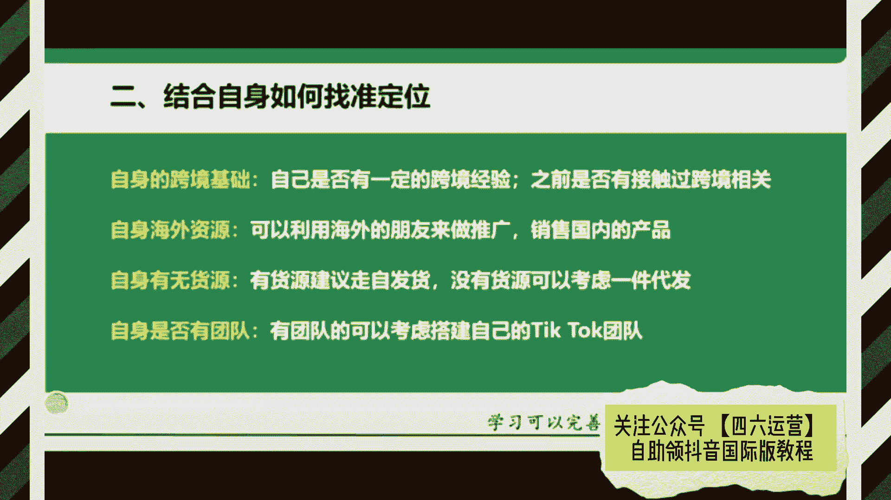

OK那第三个的话给大家去讲一下，这个目前在TK上面的一些爆款的一些类目啊，其实这些类目的话都是有数据可寻的啊，有数据可查的的，那这个的话就是我给大家去找的三款，这个数据分析的平台啊。

那国内抖音的话它都有自己对应的一些平台，数据分析平台，那一样的，海外的话它也有对应的一些数据分析平台啊，首先第一个的话就是teach啊。

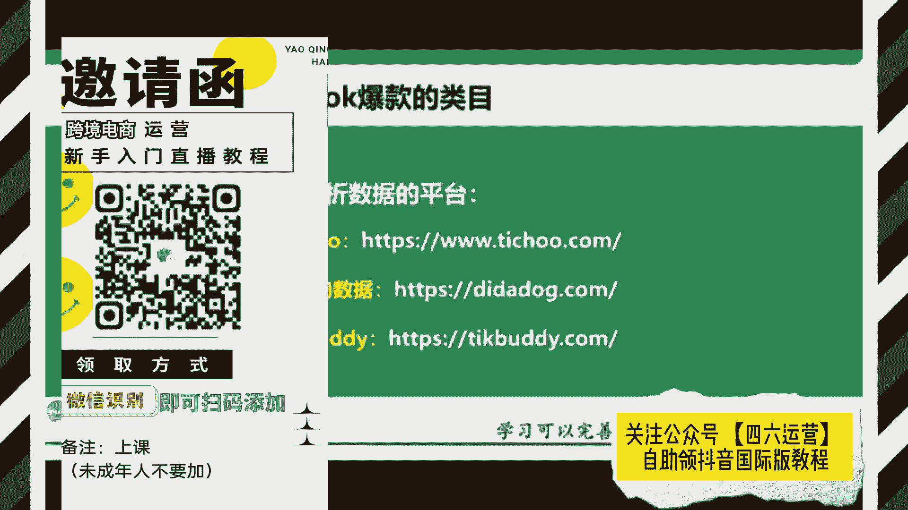

这个工具，那这款工具的话主要是针对于这个带货直播啊，电商这一块来分析的，那这个迪打狗数据那相对来讲话是比较全啊，里面有包含了这个达人的数据，每天发的作品以及像这个热门视频，热门音乐标签等等啊，都有啊。

那第三个的话就是这个呃tk bar底啊，应该是这个这么读吧，那老师的英文不是特别好啊，就这款工具的话它也是一样的，跟第二款工具都是一样，相对来讲比较全啊，那相对来讲比较全，我给大家去展示一下啊。

那我这边的话给大家打开这三款工具啊。

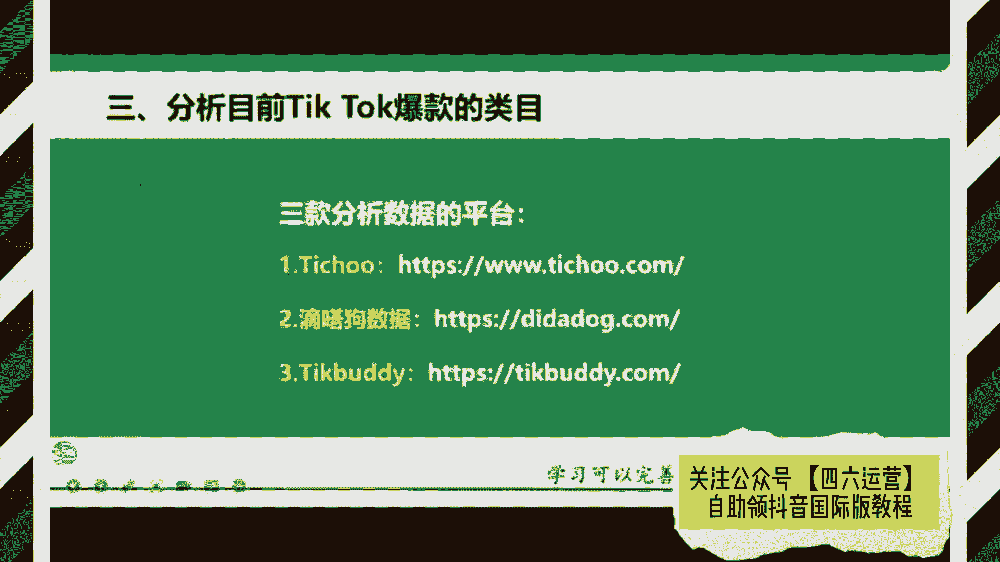

第一个的话就是teach，第二个呢就是滴打狗啊，第三个的话就是这个TK班班底啊，应该是这么这么读吧啊然后就是teach，teach的话你可以看到啊，这边的话它有我给大家翻译一下，因为它是英文的。

那teach的话，它需要在翻墙的一个情况下去进行一个实操啊，如果说你的电脑没有翻墙，那你就进不去啊，在这里给大家去讲一下哈，啊有很多同学的话，如果说你电脑没有翻墙。

那你就看这个电脑端如何去翻墙的一个课程啊，我也会录给大家啊，首先可以进来看到啊，这里的话就是挡泥板啊，这个是翻译的问题，它其实的话这里就是一个排行榜，然后这个的话就是一个创作者。

然后中间这里的话就是一个产品啊，那这个软件的话它是收费的啊，是收费的，那这三款软件唯一一个不收费的话，好像是后面这一款软件啊，就是这个TK呃，BARDY啊，就这个软件的话好像是不收费啊。

其他两款软件的话都是要收费的啊，但是呢如果说你想要去使用免费的也可以啊，使用免费的也可以，那我们学这个软件是用来干什么呢，就是我刚刚所讲到的一个功能数据分析，还有呢选品啊，就是爆款的一些类目。

我们来看一下啊，简单给大家来讲一下，可以看到这里的话，我点的是这个teach的一个数据，然后这里是选的产品，然后呢我们来看一下这个前面几个相关的，卖的比较好的一些产品，首先第一个是什么口罩啊。

那这个口罩的话相对来讲是疫情嘛，现在刚好迎合这个市场，所以说它的这个销量比较大啊，还有这个贝拉博塔，这个我不知道是什么啊，还有这个是喝的一个东西啊，这个是什么，这个是水杯。

那这款的话是我们完全可以去做的，首先第一个它不涉及到任何安全性的问题啊，而且的话也不会涉及到什么，像物流特别难发货等等啊，杯子嘛就一款杯子是吧，杯子相对来讲是特别好发货的啊。

这款杯子在国内的话应该也就九块九啊，甚至说1688的话比九块九应该还要低啊，所以这个品的话是特别好的啊，我们再往下看，还有这个香薰啊，香什么喷喷的提取物啊，还有这个美妆类的啊，美妆类的。

那所以说你在通过这个账号啊，就是这个网站，你可以分析出排名靠前的一些产品，也就是说能够对我们刚开始新手来讲，去定位这一块类目的时候，可以大致有一个思路了啊，比如说你可以看到那在这个小店里面好。

在这个题干上卖的一些好的产品都有哪些啊，这样心里有一个大概之后，你就能够去把他自己后期要做的一些类目，给他大致确定下来啊，可能你完完整整确定不下来，但是至少对于你后期大的一个方向。

你完全是可以把它定下来的啊，所以说这就是你用这款工具的一个优势啊，可以看到这里的话，就是他这个这个印尼啊，印尼的一些店铺啊，其实你看像前面的话，这几家前十啊，淘宝前十都是你印尼店。

为什么就是呃印尼这个都靠前了，是因为印尼小店他开的最早啊，所以说这是他小店也是做的最早，所以说你看他的小店店铺啊，靠前都比较多啊，这里下方的话还有一些这个热门视频啊，我们都可以看。

还有一些这个顶级创作者啊，都是一样的，就是我们用来去分析，用来去参考的啊，用来去分析，用来去参考的这个网络比较慢啊，所以说加载的话会相对比较慢，但大家自己下去之后啊，你可以去进行一个观看啊。

进行一个观看，这个的话就是印尼啊，这个还是美国的啊，可以看到他这里都有标识，印尼啊，这个上面的话这是个英国啊，不是美国，英国说错了啊，是英国，然后呢，他带的是一款这个迷你多功能果蔬清洁器啊，清洗机啊。

就是说买我们可以针对他的一个饰品，以及他带的一个产品进行一个做对比啊，进行一个做对比，那第二个也是一样啊，我给大家看一下这个滴打狗也是一样，他这里的话有产品啊，就是综合数据的一个产品。

而且它这里还相对来讲，比这个teach分的要更加详细，为什么呢，它能够将每一个类目都分的特别细，比如说啊办公用品对吧，还有这个女装啊，或者说宠物用品，或者说家具园艺啊，家用电器等等，这些他都有啊。

比如说我选择一个运动护卫啊，然后我在这里点确定搜索一下，可以看到啊，这几款产品啊都是相对来讲在靠前的啊，就靠前的综合数据，这里相对来讲还是比较靠前的，比如说播放量啊，视频者或者说推广者。

我们看一下播放量吧啊以播放量为例啊，以播放量为例，相对来讲，大部分的话都有一个特别高的一个播放量啊，这个是亚马逊的一个美国站啊，挂的是个链接啊，然后我们再看一下其他的一些种草的一些视频。

为什么我要去看种草的视频，这里就给大家提到一个点哈，你会发现像我们这个国内啊，也有种草的一些视频，那海外同样的也有这个相对应的，种草的一些视频，而且呢它会单独生成一个标签啊，就是单独生成这一个标签。

然后好多的这个TK达人，他都会去推这款产品啊，这就叫一个种草啊，这就是个种草，那同样的你国内的一些这个产品，想要去出口海外也是这样，同样的原理啊，你得有去打算去做推广。

或者说你自得自己得去做账号做一个推广好吧，那这里的话具体的一些其他的功能的话，我就不给大家去演示了啊，大家下去之后可以自行去啊看啊，因为这个都比较能看懂啊，就比如说每一个数据，每一个数据都能看懂啊。

就是一些数据的排行，数据的播放量啊，数据的这些这个呃视频的一些播放量啊，数据的一些这个整理等等啊，就各个方面的都有，你们自己下去看就行，还有第三款，第三款工具的话也是一样的啊，就是热门的一些视频啊。

还有这个热门的一些音乐啊，这里的话还有一些热门的话题对吧，你们下去自己去看就行了，我在这边讲课的话，就不给大家去浪费太多的时间去看了啊。

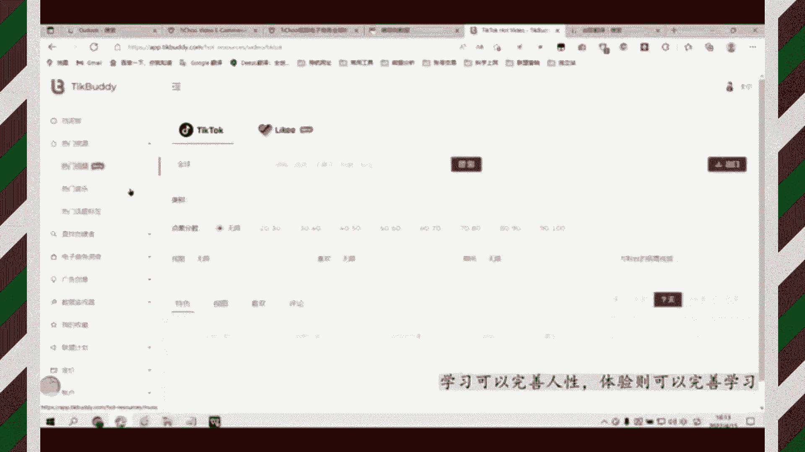

那为什么要去分析这个的话，我给大家去讲一下啊，只有我们去调整这个用户啊，找准用户，找准这个平台的这个市场。

那我们才能这个对症下药嘛对吧，才能去输出更好的一个内容啊，所以说分析数据，就是为了更好的去输出我们的内容，优化我们的作品啊，优化我们的一个产品，这个是非常关键的啊，优化数据是很关键的啊。

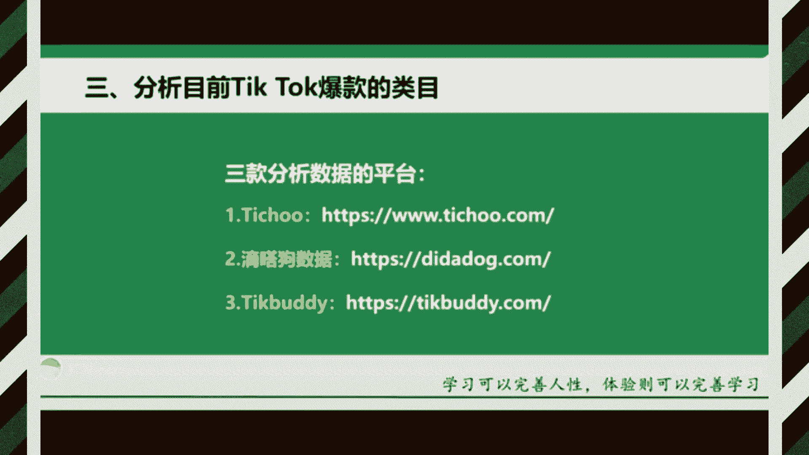