# 【TikTok跨境电商运营】B站最详细的新手入门TikTok／亚马逊开店教程，零基础亚马逊运营课程【合集】，亚马逊跨境电商入门教程（纯干货，超详细！） - P24：第7讲.亚马逊店铺注册流程实操 - 麒麟阁王师傅 - BV1cqtBegEpp

大家好，那个我们现在接着去来给大家去演示一下啊我们店铺注册的一个模拟过程哈呃我们可以直接在百度上面搜索亚马逊店铺注册模拟，然后就可以搜到这个呃店铺注册的一个模拟器。

然后我们这边的话一般来说都是注册美国站居多的。那么我们现在就是以美国站为例哈。另外其他的包括欧洲站、日本站啊，印度或者说是澳大利亚这样的站点的话，其实他们的一个注册流程基本上都是一样的。

基本上都是一样的。而且现在目前如果说大家想要去注册店铺的话，那么注册美国站的话，其他的站点是一次性的全部下来的啊，也就是说我们注册呃只注册美国站的话，其他的12个站点也是可以同步下来。

只不过是处于未激活的一个状态。我们想要去呃这个在做这个站点的时候，只需要在后台进行激活。

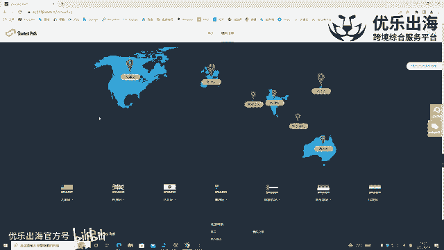

就可以了。那么我们以美国站为例开始模拟啊，新卖家模拟注册啊，没有注册过任何一个站点，然后我们可以开始模拟。

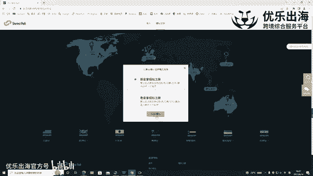

这里可以看到有提示哈，就是不要使用我们真实的信息填写。如果使用的话，会对我们未来注册账号，或者说是已经有的账号产生了关联啊，产生了关联。首次注册的话，我建议大家也可以看一下这个注册视频的一个讲解。

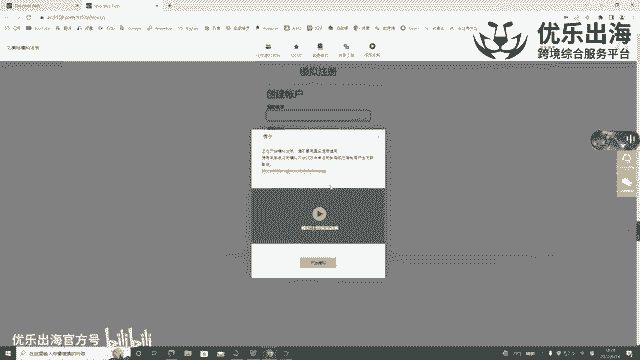

我们这边直接就开始进行模拟注册的一个过程哈。然后首先是这里有注册啊虚拟资料，也就是说我们可以使用这些虚拟资料进行模拟的一个注册，以及旁边还有一些知识点和我们的一些需要帮助的一些这个呃内容。

然后首先我们的一个姓名，姓名的话，我们可以法人身份证啊，可以看一下这个呃姓名的话是填例请。我们直接通过这个姓名进行进行填写。填内勤，然后填写完之后，这里有一个邮箱地址啊，我们点击账号资料。

把这个邮箱去填上。填上完之后密码的话，我们可以随机的编辑啊一个密码。比如说啊123。然后我们点击下一步啊。像这个email发送了一个代码，那我们选择一律不保存。

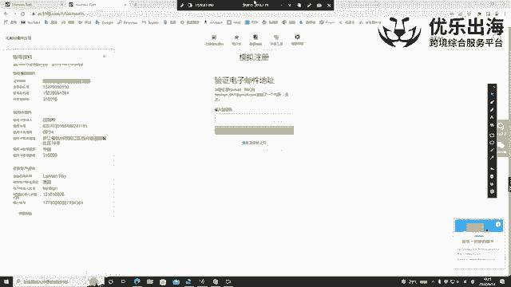

我们注意看网页右下角的一个弹窗啊，这里有1个231416。然后一般情况下就是我们去登录我们的一个呃邮箱后台之后，会收到这个验证码，231416啊，我们进行验证。

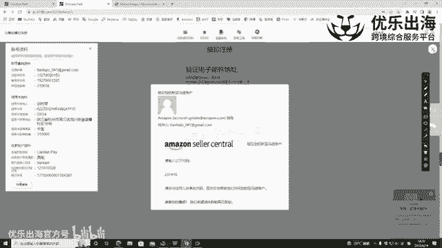

接着这里一个绑定我们的一个手机号，我们添加我们的一个中国手机号，中国大陆，然后我们自己的一个注册手机号。

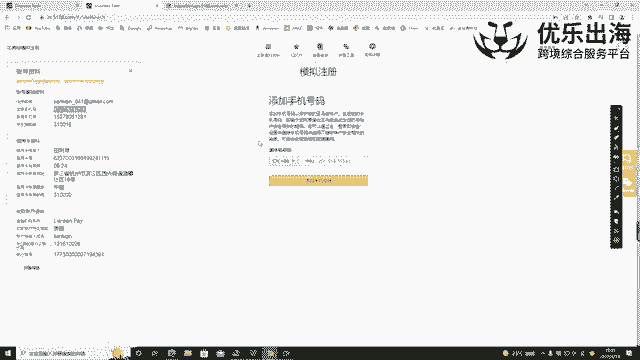

选择添加发送了一个验证码，手机短信我们进行查看，复制验证码。

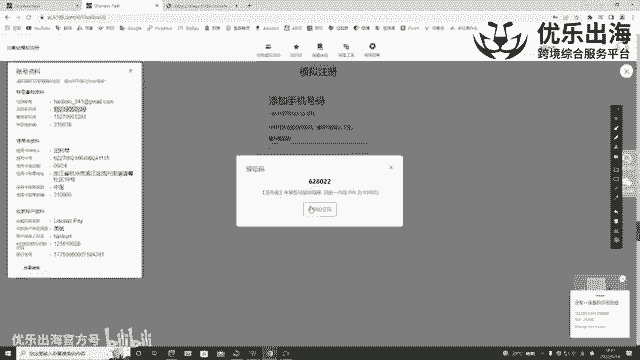

创建我们的一个亚马逊账户，基本上就跳到了我们正式注册的页面的一个第一步。然后选择我们那个营业执照的一个国家啊，是中国。我们可以看一下中国的一个营业执照。杭州市的营业执照。那么主体类型的话。

我们是选择私有企业啊，选择私有企业。然后接下来我们去登记上，登录上我们的一个公司的名称啊，以及英文和中文的一个缩写。杭州。博晨。网络科技。有限公司。杭州博辰。网络科技。有限公司大家一定要去注意哈。

这里面全部都是小写，并且中间没有任何的一个空格啊，我们确认营业地点啊，类型无误，然后我们同意，并且继续。在这里输入我们的一个组织机构啊，公司的注注册编号就是我们的主组织机构代码证。

那么就是我们在营业执照上面顶部的这个，我们点击下载，我们打开这个营业执照啊。进行放大统一社会信用代码，就是这一串啊，就是同这一串这个注册公司的注册号码就。3个一。01178。2。264。0812。5P。

然后接下来我们选择城市的邮编，以及我们的一个地址啊，我们的一个办助地址账号资料。So。浙江省。杭州市。江干区。棚湖街道宏土路。接到。江浦路759号。江浦路。红浦路。759号。汇合。会和洗服会。😔，不会。

我们可以在这里写。5号楼。406室。关于这个邮编具体是多少，然后我们可以百度一下。点击百度。浙江省。杭州市江干区邮编。啊，310016。确认无误。然后这里我们一定要去仔细的核对一下啊。

看我们的一个就是跟我们那个营业执照上面的地址有没有误差啊，有没有误差。包括我们那个组织机构代码证，这个注册号码一定要去仔细的核查。如果说出现了问题的话，我们是没有办法返回到上一步修改我们的一个信息的。

然后我们接着。选择电话啊，我们的一个账号资料。这里看可以看到哈，有一个注册手机号和一个备用手机号，是这样，就是我们的一个呃在刚开始的时候有一个绑定了手机号，对不对？

然后那么这里的话也可以用原来的这个手机号进行操作。在我们注册完店铺之后，有一个二次验证。😊，有一个就是说二次验二次验证手机号。

那么这个手机的话可以切换另一个手机号进行一个就是用备用的手机号进行我们店铺的一个验证和登录。我们发送完发送。

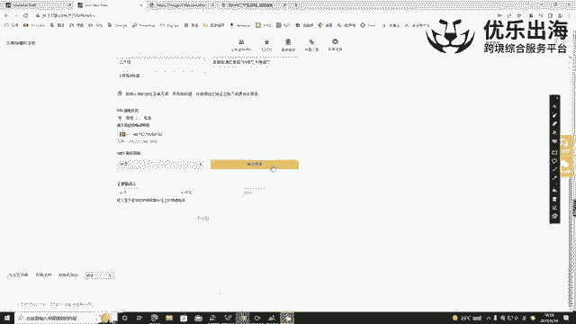

这个。验证码好，我们验证验证下来之后，然后我们接着去看我们的法人身份证田丽琴好。

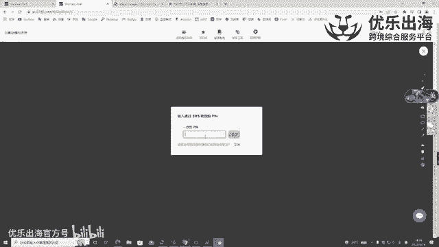

姓氏在这边。天。利。亲。然后我们点击下一步。选择我们的一个国籍，然后。我们的一个出生地以及我们的。出生年月，97年。5月23日。身份证号码360502199705230205啊。

然后身份证有效期截止日期是2037年。2月。22日。好，那我们接下来签法国的话，也是中国。身份证上显示的名称啊，田丽琴，我们去看一下。天。李琴。啊一定要去注意仔细核对，没有错别字哈。然。

居住地址居住地址的话，我们这里需要注意的一个点就是我们这里的居住地址最好是填我们。第一是我们这个这个法人身份证上面的一个地址。第二是填我们信用卡上面的一个地址，为什么需要这样填呢？

就是因为我们这个居住地址的话啊，刚才有填了我们的一个公司的营业执照的一个地址。我们如果说账号触发二审的情况下，触发审核或者说是有QIC审核的情况下，我们的个呃产品的一个就是我们的一个公司的账单。

他没有办法和公司的一个地址，营业执照上面地址核对上面啊，是。如果出现这种情况的话，那么我们可以在这里居住地址添加一个其他地址，只需要跟这个地址对应上的话，也有一定的一个概率可以通过我们的一个审核。

所以说如果我们是注册欧洲站的话，那么我们这里直接填写我们。信用卡上面的一个地址。啊，直接填写信用卡上面的一个地址。看一下。浙江省。杭州市。滨江区。西兴街道18号。啊，31。好，这样我们就基本上就填好了。

填好之后呢，我们就可以使用这个地址。如果说触发了我们QIC审核的话，只要是我们的信用卡地址和这个地址是一致的。那么我们的QIC审核也可以通过。如果说啊我们是注册的其他的一个站点。

比如说美国站和日本站的话，那么我们触发了二审之后，我们的一个让法人提供信用卡的一个账单上面的地址能够和我们这个地址核对上的话，那么也是有一定的一个概率可以通过的。但是这个通过的概率的话。

可能只有50%啊。如果我们这个账单的地址和我们的居住地址一样，我们可以直接选择啊，直接选择只是在这里跟大家去举一个例子哈。然后我们的一个手机号码啊，可以直接默认这个手机号码。

在这里有一个企业受益所有人和企业的一个法人代表。首先是我们需要去啊去确认一下，我们这个。公司是否是个人独资？啊，是否是个人独资，是否还有其他的股东？如果说。还有其他的股东的情况下，我们只能勾选啊。

是企业的法人代表。如果说是呃个人独资的话，那么我们可以全部勾选，全部勾选。另外一点。如果有超过30%的股东的话，那么我们就需要啊取消勾选啊之后，然后亚马逊会额外的去让我们添加一栏。

把我们的一个另外一个股东全部添加上。然后这个添加上的股东的话，如果是别的店铺的一个法人，那么也会形成一定的关联啊，然后点击确定啊，这里的话一定要去实事求是的填写，不然的话，亚马逊会呃去核查的。

然么保存之后，然后这里直接点击我了解啊，选择金融机构，我们可以看一下，我们需要注册店铺之前需要准备我们的一个身份证啊，营业执照以及我们的一个信用卡和我们的收款账户。

那么这里就是填写我们收款账户的一个信息，可以看一下，我们使用的是连连收款那么我们在这里就选择连连啊。选择连连支付收款，然后持有人的姓名啊，持有人的姓名田丽琴。9位数的识别代码。

看一下在这里我们直接我们可以登录我们的一个连年支付或者是收款账号，去直接看到这些产这些数据哈。另外，如果说我们真真的找不到数据的话，我们可以联系我们的一个呃收款账户的一个客服。

让他们帮我们去就是发一下我们的这个路径在哪里验证收款账户正在处理中啊，这个就不用管它，直接点击继续，我们进入到下一步填写我们的一个信用卡，这信用卡的话啊。

可以看这里可以看这里这里有一个具体的一个信用卡资料，那么我们在这里点击信用卡以及。后面还有我们的一个持卡人的信息啊，持卡人的信息，还有信用卡的到期日啊，有效日期是24年的9月。大家一定要去注意哈。

这是24年的9月份。然后收费地址，这里我们需要去把这里改成我们的一个信用卡的账单地址啊，信用卡的账单地址，我们在这里添加新地址。把我们的信用卡账单地址重新将它添加上。啊，再添加一遍。好。

我们这边就添加成功了，直接点击下一页。田立琴。我们试一下去填写。拼音就直接通过了。啊，店铺的名称我们可以这里去注意一下。店铺名称的话，我们可以啊提前先去啊起一个名字之后在店铺下来之后。

我们这个店铺的名字是可以更改的啊，比如说我。想去。以我们的法人的一个名字啊去做这个店铺名，然后可用啊，基本上我们就可以下一步在这里是否拥有UPC编码选择是。

然后对于想要销在亚马逊上销售的任何产品是制造者还是品牌所有者啊，我们可以。如果说我们是啊工厂的话，我们可以选择是，或者说是我们有品牌备案的话，我们也可以选择是。那么如果没有的话。

我们可以选择其中一部分啊，或者说是直接选否，直接选否，我们下一个下一步。好，然后在这里的话就进入到了我们要提交身份验证的一个页面。我们刚才下载的营业执照，以及我们现在。把身份证正反面全部都下载好。

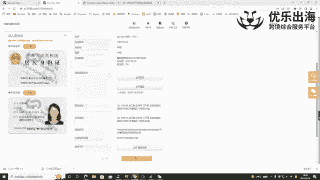

然后点击上传啊，继续一定要去注意哈，一定要去注意一点，就是我们再去做这个上传这个文件的时候，一定要去保证我们的产品呃，就我们的图片是高清的，并且四个角都可以完全展露出来。🎼可以看一下。

我们把身份证的正面。再继续上传身份证的背面。

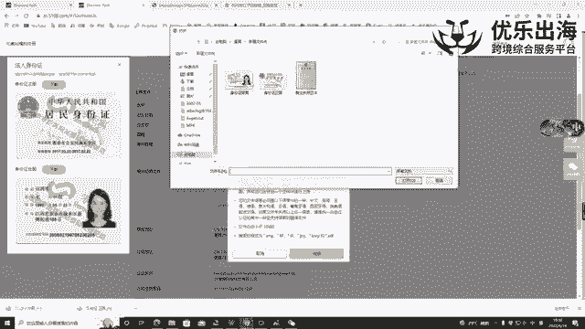

以及我们的营业执照。然后在这一步的时候，再仔细核对一遍之前填写的所有的一个信息，确保没有问题。我们点击提交。然后这时候呢会呃让我们选择去进行一个视频的通话啊，视频的认证通话。我们点击下一步。

选择我们接下来就是周一到周五之间，我们有的一个时间，这个是我们当地的一个时间啊，我们选择下午一点半啊，这周五下午一点半，然后继续下一步。那么接着就进行到了最后一步。我们到时候呢要把这个网址进行保存啊。

要把网址进行保存。到时候我们可以通过啊这个网址重新进入到这个页面里面，登录的账号，是我们的一个邮箱登录的密码，也就是说我们最开始设置的密码都要保存下来。另外一点的话，我们再去。做这个视频认证的时候。

要注意的一点就是第一，我们的个摄像头和我们的一个声音的一个扬声器，一定要是就是处于可用的一个状态。第二个点就是让我们的法人去带着我们那个营业执照去啊跟这个亚马逊的工作人员进行视频。

一般视频的话也是非常简单的，基本上就是5到10分钟甚至15分钟就可以完成啊，会问几个简单的问题，询问是否是你本人啊，你去报一下你本人的身份证号是否是啊就是你要在亚马逊上做什么产品啊。

主要是一些比较简单的问题，确认是你本人要做就可以了。我们点击接受啊。点击接受的话，然后我们把这个网址保存下来，到时候提前半个小时提前半小时，我们可以通过啊这个带着有摄像头和那个麦克风的一个电脑。

或者说是我们也可以通过手机啊。把这个呃把这个登录这个网址，然后去登录我们的一个邮箱和密码。一定要去呃切记哈。如果说我们使用手机去进行视频通话的话，要使用我们自身的4G流量，而不要去连接wifi。

因为如果说连接wifi的话，会有可能出现啊就是店店铺关联的一种情况，导致封电啊，所以说这里是一个非常要注意的一个点。然后接着我们加入视频通话之后，视频结束。

我们等待啊我们的一个成功的一个操作成功的一个通知就可以了。以上就是我们注册啊店铺的一个全部流程。如果大家还有任何问题的话，可以通过啊这个平台联系客服，或者说是啊通过客平台联系我也可以，没问题。

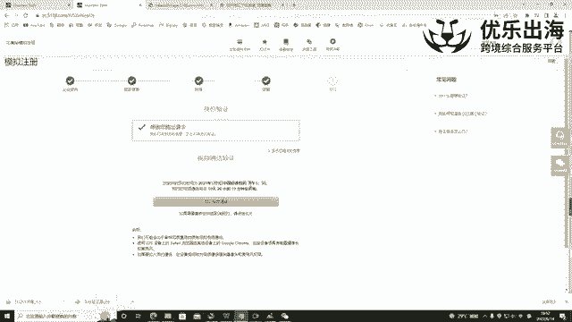