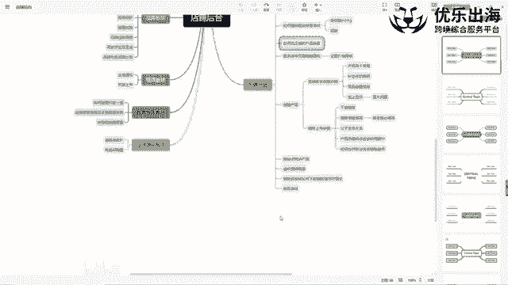
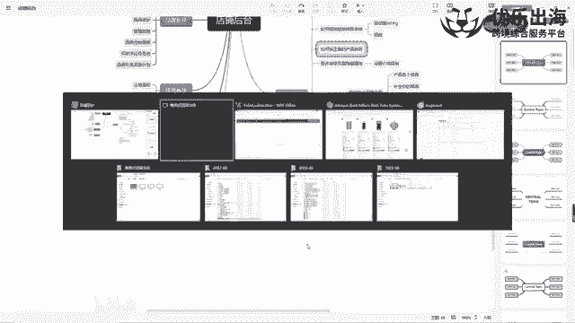
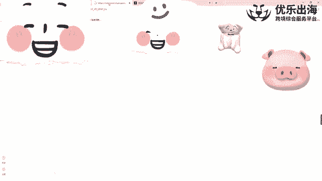
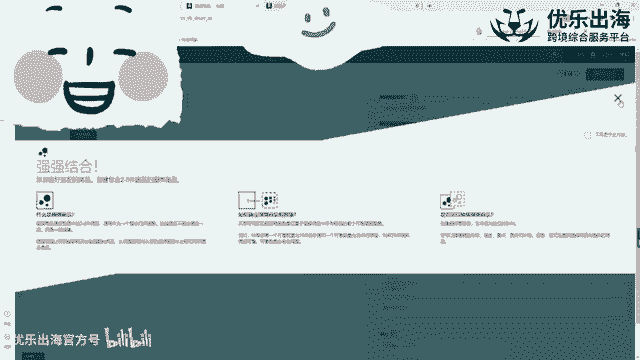
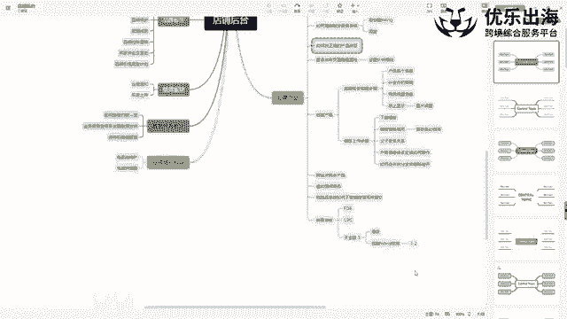

# 【TikTok跨境电商运营】B站最详细的新手入门TikTok／亚马逊开店教程，零基础亚马逊运营课程【合集】，亚马逊跨境电商入门教程（纯干货，超详细！） - P30：第13讲.创建产品的其他方法步骤 - 麒麟阁王师傅 - BV1cqtBegEpp

大家好，那个我们现在的话接着之前的内容，店铺后台内容去讲哈。然后接着啊接下来我们主要去讲解我们创建产品的就是其他的呃几种方式，包括夸站点同步商品。我们的虚拟捆绑商品应该如何去做。

还有一些其他的一个品牌板块和业务板块这里，让我们去深入的去了解一下哈。

首先是。我们可以看一下哈，就是我们打开我们的呃一个后台。打开后台之后呢，我们先讲解关于跨站点同步商品。如果说我们的一个产品是在美国进行的一个销售，那么我们想把美国的一个产品同步到。

加纳站点或者说是呃墨西哥站点呃，在同步这个产品的同时，还可以将我们的一个产品的一个评价啊同时的同步进去，同时的同步进去。我们可以在呃前台应该会有看到一些数据情况哈，就是我们这些产品。

它有时候会带有一些国际评论啊，也就是说我们美国这样的产品可能会有一些就是其他包括一些呃加纳或者说是欧洲啊这样的一些站点的一个产品的一个评论。我看一下哈，一般这几个这几个链接还没有看再看一下这个。好。

可以看到这里哈啊top from other countries就是其他站点的情况下，针对于这个产品的一个评价，也会直接同步到这个这上面去来啊，这是加拿大的，加拿大的一个加拿大的人，他们买的这个产品。

有可能也是从美国就是这个美国的一个库存直接配送的，只不过它留下来的一个评价的话，加拿大站点和美国站点可以共享共享的一个原因就是他们的as是同一个as啊，他们的一个asen是同一个as。

这样就可以共享这个评价。所以说好处还是非常多的。另外一点的话就是我们呃今天的话我会给大家去讲。三种方法。第一种方法就是直接去通过后台美国同步商品到啊加拿大墨西哥有一个亚马逊物流远程配送计划啊。

是这里这一点同步非常方便。比如说我们的一个产品比较多的话，我们的遍题比较多。那么我们可以直接通过这种形式，一键式同步我们的一个商品到目标站点。

第二个的话就是如果我们想要去将我们的一个这个美国的站的一个产品同步到欧洲站啊，或者说是同步到日本站。这样的话就是我们可以通过模板的形式进行产品的一个上传。另外一点的话，还有一个就是我们比如说是欧洲站哈。

欧洲站的一个产品，德国的产品，我们想要去同步到其他的站点，我们可以开通亚马逊的一个泛欧计划，这是三种的一个同步产品的一种形式。第一个是亚马逊物流远程配送计划。第二个是通过模板上传。啊。

我们的一个产品的信息进行产品的一个同步。第三个。就是我们去。那个开通范欧计划，从而达到同步产品的这个效果啊，这是三种方法哈。那么这三种方法的话，我先挨个跟大家去讲一下啊，去讲一下。

首先第一种就是我们在美国已经有产品的情况下，我们想要去同步加拿大站点和墨西哥站点啊，因为这个多一个配送渠道的话，还是比较不错的啊，还是比较不错的。不需要我们去承担非常多的一个费用。

每个月好像就是十倍十几美金或者是几美金的一个处理费用嘛，然后就可以帮助我们拓宽一个销售的一个渠道啊，是这样。然后另外一点呢，就是我们可以第一打开库存，然后是亚马逊物流远程配送。

看一下这里亚马逊物流远程配送。然后在亚马逊物流远程配送呢，我们打开打开之后呢，可以看到这里有一个产品的一个就是远程配送。我们的A的一个情况。这里我是已经同意了呃亚马逊物流远程配送的这个方案呃，那么。

第一次去进入到这个页面的时候，我们需要去提报，以及需要去同意我们这个产品的asen啊，就是确定就是同意亚马逊可以将其as森配送到加拿大和墨西哥啊，这里有两种形式哈。

第一种形式就是如果说是亚马逊主动邀请我们去配送到这个站点的话啊，如果说是亚马逊主动邀请我们去配送到加拿大或者墨西哥的话，那么我们点击就是通过链接直接跳转到这里。

可以直接将我们的产品一键式操作同步到加拿大或者是墨西哥。如果说是我们手动操作的话，我们手动这里开通这个权限。那么亚马逊是不会将我们一键式同步的。我们需要。点击这里同意之后，我们点击库存页面。

先进入到我们美国的管理后台啊，比如说我打开这个产品之后，打开这个产品之后呢，我们拉到最右边点击编辑啊，点击编辑。在这个报价的这一栏里面，最下面。可以看到哈，有加拿纳的一个报价，以及墨西哥的一个报价。

我们在这里手动添加上我们的报价之后，亚马逊才能够在加拿大站墨西哥站同步上传我们的一个产品，并且还能够同步我们的库存啊，并且还能够去同步我们产品的一个库存。是这样哈。

这样的话就是第一是拓宽了我们的销售渠道嘛。第二个呢是有评价的话呃，依然就是说也能够就是他们几个站点评价进行共享评价进行共享。这样对于我们如果想做加拿大站点的话，就是单独在创建新的链接是要好很多的。

因为我们可以直接把美国的一个评价情况同直接同步到加拿大站点上面去，非常的方便哈。这是呃第一个亚马逊物流远程配送啊的方式去将我们的产品同步到加拿大站点啊和墨西哥站点，这是第一种方式。第二种方式。

第二种方法的话，就主要是通过我们的一个呃模板的一种形式哈。比如说之前那个刚跟大家去讲过的啊，我们通过模板上传产品，那么通过模板上传产品的话呢，我们可以在这里啊前面基本上信息都是一致的。

然后SQU这里去填写我们之前原来站点的SQU比如说美国站点啊，那个SQU是多少，我们就直接去填上就行了。然后brand啊brand name把我们的一个品牌名去填进去，以及我们的ason号啊。

把我们的asson填入进去，一定要切记一定要切记这个重点哈，就把我们的as填入进去。然后产品的一个呃姓名填入标那个名称啊以及工厂形式填入进去之后，一些必填项填入进去。然后选择。有父子变体观系的话。

选择父子变体关系，选择update。因为虽然说在美国站点已经存在了这个产品，但是在其他的站点是没有这个产品的出现的啊，进写update，然后变体关系去写一下，基本上就可以了啊，主要是这一种形式。

我们可以通过就是呃这种方式批量上传我们的一个。我们的一个就是说就是多变体的一种产品，变体比较多的情况下，可以在这里重点呃是只有一个就是一定要在这里填写我们的一个目标站点的1个AN号啊。

就是我们原站点的1个AN号。然后这样能够方便我们去同步到其他的一个站点，帮助亚马逊去识别我们的一个产品。另外这一点的话就是我们可以同时跟大家去分享一个呃小技巧哈，就是。

有一些呃有一些人可能链接就直接被搞了嘛，就是他我们正常卖的好好的，但是我们的一个产品直接被划入到了可能是成人用品的一个类目，没有办法进行在就是打广告啊。

或者说是我们的一个类目就就划归到了杀虫剂的一个类目里面。那么出现这种形式的一个原因。第一种原因就是可能真的是亚马逊误判啊，亚马逊误判。第二种情况就是。竞争对手可能VC账号跟卖我们的一个链接。

去抢走我们链接的一个边辑权，从而去修改我们产品的类目。这是这是其中一种方法。那么第二种方法也是我们普通的卖家可以去做到的一种方法，就是这种跨类目的一种形式啊，就是这种跨类目的一个形式。因为什么意思呢？

就是我们这个产品去同步到，比如说啊英国或者说是加拿纳这样的一些站点的话，那么我们的一个产品信息都是会直接同步过去的。啊，就包括我们的评价，我们的产品的一个listing的一个情况都会同步进去。

同步过去的之后呢，我们可以就比如说我把这个美国站的链接同步到了英国站，同步到英国站之后，我们把英国站的链接进行类幕修改。就是上面去编辑一下，把我们那个标题里面放入一些成人用品的一些关键词。

比如说杀虫剂的一些关键词和就是那个哪些容易被亚马逊抓取，判定为这样的一个产品的关键词，我们就用哪些关键词。然后那个。改变我们的一个标题之后，亚马逊会快速的将我们的产品的类目啊。

亚马逊会快速的将我们产品的类目划归到杀虫剂里面，或者说是成人用品里面，从而。影响到我们美国站的链接啊，影响到我们美国站链接。也就是说我们这个产品如果说真的是被就是莫名其妙的放入到成人用品类目的话。

第一个是可能是竞争对手恶搞我们。然后第二个就是竞争对手通过远程同步产品的一种形式，在英国站把这个产品放入到成人类目里面，同样的也会影响到美国站样的一个链接。这也是就是那个算是。

就是反击竞争对手的一个策略吧啊反击竞争对手的一个策略吧啊一个比较有效的一个策略也是比较难的一个策略哈，就是比比较恶心人的一个策略。另外还有一个延伸的，就是反击竞争对手的一个策略。

就是我们如果说在有独立战的一个情况下，我们可以把竞争对手的一个所有的一链接的一个信息啊，包括甚至甚至是包括评价，我们也可以抓取几个，然后放到我们的一个。😊，独立站上面。

然后把这个独立站啊页面的信息网址的一个信息，包括信息截图去提交给亚马逊。就是说你我们是这个链接啊，我们是这个链接，甚至是我们是这个品牌的拥有者啊。

就是目前在市场上亚马逊卖的这个卖家是呃就是抄袭我们的亚马逊针对于这种就是说侵权的问题，是绝对是零容忍的一个态度。就算是我们真的是合规的。但是亚马逊会先下架我们的一个产品的链接。

让我们提交就是证证据证明不是我们侵犯他的这个提交证明的话，就是我们提交上去，他审核也需要一段时间。所以说这就为这些就是不良的一个卖家啊去就是赢得了一些时间嘛。就是想要去搞我们的话。

通过独立站去同步我们的产品，然后接着到达一趴，就是说我们是抄袭他们的啊这种形式。也有可能会出现。所以说就是呃真正如果遇到竞争对手恶搞我们的话，我们其实是防不胜防的啊防不胜防的，只能说是尽可能的规避。

在出现这种问题之后，我们要在第一时间反查一下到底是它是采取的哪些的一些措施啊，导致的我们的一个链接变狗，或者甚至是导致封电的一种情况出现啊，我们再有针对性的进行申诉啊，我们再有针对性的进行申诉。

就这一点啊，就是。亚马逊啊远程同步我们的一个产品啊，亚马逊远程同步我们的一个产品。但是我建议大家是这样哈，因为说实话我没有直接从美国同步到我们的一个。同步到我们的一个就是欧洲这边来，然。

没有直接同步过来。然后我的意思就是我一般来说的话都是单独去发送库存。也就是说我是通过模板去同步到欧洲，同步到欧洲之后，然后再去针对于欧洲这里面的一些商品单独去发送库存的。我并不是同步美国的一个库存。

甚至我也这边的话也没有太清楚，就是美国是否能够真正的配送到欧洲，就了解，应该是配送不到的。这是一点哈。呃然后第三点就是泛欧计划。泛欧计划的话，这个就比较好理解了。

就是我们只要是去呃注册我们开通我们的一个站点的话，那么我们可以直接联系我们的招商经理，或者说是在后台的一个呃后台的一个页面的顶部，后台页面顶部直接去搜索泛欧计划。

然后去点击进行泛欧计划的一个注册就可以了。这个泛欧计划的话，是可以让我们产品只放在就是7个欧洲7个国家，现在应该是6个国家了。就是每英国脱欧了嘛。然后6放在另6个国家里面的任意一个国家。

就是我们有库存的情况下，我们可以直接其他的呃国家远程配送我们的产品啊，远程配送我们的产品。很多人都是就是因为现在就是意大利。就是VT税号下来的比较容易嘛啊下来比较快嘛。

所以说大家都会选择可能是注册意大利，还是说是那个西班牙的1个VT的一个税号。然后注册完之后，可能就是几天就下税号了，下了税号之后，我们先往意大利发货，然后同步去注册一些。

比如说西班牙或者说德国或者说什么样的一个国家，就是我们主要再次主要做的一个国家，我们去呃那个去注册它的1个VT税号。因为你只有注册了VT税号之后，我们才可以过海关。

然后正常的把我们的产品入到仓库里面去啊，入到仓仓库里面去。也就是说是什么意思呢？就是我们。🎼针对于欧洲这样的一个站点，可以单独的通过泛欧计划来远程配送我们的一个库存。

美国站点的话就通过亚马逊物流远程配送计划来配送我们的库存就可以了。接下来我们就是讲完跨站点同步产品之后，我们再讲一下虚拟捆绑商品啊。那么商品的话呃，因为我这边都是有品牌备案的一个店铺。

所以说我也有点忘记了，就是是否是需要我们去进行品牌备案进行的一个操作，应该是需要的哈。在这里就是品牌里面啊，品牌下面有一个虚拟捆绑商品。这个虚拟捆绑商品是什么意思呢？就是如果说在我们呃产品。

如果说我们是有互比互补的产品。比如说我们做鼠键盘，也做键盘垫儿，就这种互补的产品，或者说是同类的商品，但是不同的一个属性，也可以比如说白色键盘，黑色键盘等等等等一系列的一些键盘。

那么我们可以通过这个虚拟捆绑商品来创建我们的一个呃虚拟一个链接，也就是说首先是第一个我们捆绑商品里面可以把我们的两件商品，三件商品去放到这里面去。然后放到这里面去之后，我们主图也可以设置单独的一个主图。

主图里面可以写上就可就可以配上鼠键盘加加上鼠标垫啊，加键键盘加上键盘垫这样的一个操作。然后其他的子图的话，可以有键盘的，就是和键盘。

中间穿插着进行中间穿插进行虚拟捆绑商品，我们也可以单创作单独的一个名称。以及简称还有我们捆绑商品的一个价格啊，捆绑商品的价格描述5个卖点以及SQU啊。

输入SQ就是单独的SQU能够帮助我们识别这个捆绑商品的1个SKU啊，是种情况。那么客户在购买了这个虚拟商品之后啊，亚马逊会直接就是将两个产品配送过去啊。

将两个产品配送过去里面包括一些包括一些那个啊配送费用啊，或者说是折扣的一个信息啊，可以在这里去单独的啊去进行这个了解啊，去单独进行了解。我在这里就不一一的去讲了哈，后台的板块讲的很详细。

这个是关于虚拟捆绑商品的一个板块。接着是危险品审核啊。如果说我们的一个产品触发了危险品审核的话啊。如果说我们的产品触发了危险品审核的话，但是我们的产品并没有内置电池，也并没有一些就是说可能是液体啊。

或者说磁粉的一种存在啊，磁铁存在。那么基本上就可能是亚马逊处于误判。这这种情况下呢，这种情况下的话，大家不用非常的担心啊，这种情况下大家不用非常担心。因为呃亚马逊可能只是批量的进行筛查而已。

我们正常的提交我们的一个啊产品的一个材料就可以了啊，就没有什么太大的一个问题。我们可以在这里第一点击搜索。危险品。审核啊，我们先点击搜索危险品审核。那么点击危险品审核之后呢。

我们在这里上传SDS和豁免表啊。上传后面表点击这里点击这里之后呢，就是我们在这里去下载一个。就是我们如果说真的是误判的话。物换的话，那么我们可以选择不含有化学品的商品的豁免表啊。另外一个。

如果我们真的是带电池的话，但是因为判定为危险品不可售，我们里面的电池并不是属于那种就是说那个易燃，就是非常易爆的那种那个那个那个危险品的话，那么我们也可以填写电池驱动豁免表，电池驱动控表。

然后我们一般都是选择这个，因为我这边基本上不做一些带电池的产品。后面表之后呢，然后我们把这里就是写上我们的一个名称啊，写上我们的一个名称以及这些属性，就什么易报啊，或者说是这个什么有毒气啊。

或者怎么样的，我们就直接选择no啊，选择no，根据实际情况去填写。然后接着A我们的A是多少，产品的名称是多少啊，产品的一个属性啊，怎么怎么样。按照就是我们的一个实际情况去填写就可以填写完之后。

让我们在这里上传我们的一个产品文件啊，上传我们的一个产品文件就可以了。等待通知基本上就不错啊，基本上就没有什么太大的一个问题。一般来说，3到7天会出会下来我们最终的一个审查的结果啊，这个是人工审查的。

所以说需要啊排队，然后导致时间会比较慢一些。但是只要我们的一个产品的属性确实是不属于危险品一列，那么啊基本上是没有什么太大的一个问题，就是时间的一个时间的一个问题了。这是危险品审核啊，这一方面。

接着就是关于类目审核。关于类目审核，因为很多的一些产品嘛，包括就是我们如果说要做啊这个就是有很多的一些需要审核的类目啊，美妆类目很美妆类目下有很多的小类目需要FDA认证，包括啊一些CPC认证、玩具啊。

包括那个母婴啊都是有CPC的一认证啊，以及其他的啊一些就是包括电子产品都需要哪些认证。🎼就是需要认证的一些类目，细分类目非常多。那么我们如何知道啊，我们如何知道就是我们这个类目是否需要呃审核呢，啊。

需要是否需要类目审核，需是否需要我们提交更多的一个材料呃，来进行一个呃抓取。然后首先是两个方面，第一个就是跟卖。啊。点板链接。第二个就是自建listing。

自建listing检测啊自架listing检测。第一个跟麦跟麦这种形式的话，我们就直接。输输入我们产品的一个标题，我们的一个关键词，找到我们要卖的产品的直接竞品。

也就是说我们就是要卖和它一模一样的一个产品啊，就是要卖和它一模一样的产品。那么这样的话，我们就直接点击这个链接，找到它的as。找它的一个A号啊，找到A号之后，我们把这个A号复制下来。

到我们的一个商品页面，在这里点击添加商品，添加商品。然后在这里输入这个产品的as啊，也就是说ge卖这个产品的as操作，该买这个产品操作，我们选择全新的商品，然后申请销售。可以看到这里有一个显示限制啊。

显示限制，需要获得批准才能发布此品牌的一个商品。也就是说并不是这个类目需要审核，而是说它有一个单独的一个品牌，可能是R标啊，可能是R标这种如果说我们没有获得这个商品授权书的话。

我们是没有办法去使用这个品牌的啊，就是创建这个品牌下面的一个商品啊，是没有办法去做这个品牌下面的一个商品的。我们需要找一个没有品牌的一个商品，就是或者说AANC这种大众化的一些商品。

就是不需要获得它的一个批准，我们就可以发布此商品的一个。链接，然后那我们直接跳过啊，因为就我们播1111的去找了。因为我们如果说多找一些啊链接的话，总能够发现一些就是说可能是NAAC的一些品牌嘛。

然后另外我们可以申请销售啊，我们可以点击申请销售，然后我们点击申请销售之后啊，然后如果说这里是需要我们产品。去遇到审核的话啊，需要我们去遇到审核的话，他在这里会直接。消会直接提示。

就是说我们需要提交什么样的一个认证啊，要么就是我们的一个产品资质认证书报告书，要么就是我们的一个啊就是发票证据啊，然后可以去呃那个上传申请啊，这里就直接有上就是请求批准之后，就直接有上传的一个呃模板啊。

上传的一个模板，就是需要我们上上传我们的一个信息。这个上传信息的话，可以找我们的个供应商去索要啊，可以找我们供应商去索要。这是关于跟麦这一点啊，这是关于跟麦这一点。第二点就是自建listing啊。

也就是说可能我们找了10个8个产品，确实都是需要品牌才可以发布的。那么我们就直接通过我们的一个正常上传产品的那种形式，找到这个类目啊，找到这个类目之后呢。

我们在后台就上传这个产品的标题嗯这个类目下的一个链接。然后这个类目下的一个链接的话，我们也需要。具怎么样呢？就是跟我们这个竞品高度一致啊，我们可以把竞品的一个图片就是稍微改一下，大上上传上去。

上传上去之后，我们其他的包括标题啊，包括其他的一些点，我们都可以稍微去做一下，然后上传。我们的目的只是为了去检验能否触发这个审核啊，能否去触发这个审核，自建listing进行检测。另外一点的话。

还有一些专门的一些网站嘛，呃一些那个网站，包括一些新闻里面都有就罗列出来了很多，就是需要亚马逊后台审核的一个类目，包括我们也可以在后台直接。搜索类目审核啊，类目审核就包括钟表销售类目的一个审核情况呀呃。

服装商品里面有具体的一个呃那个审核情况啊，危险品的一个审核情况，就我们可以直接去检索出来。但是说实话不如我们通过跟麦和自建listing检测啊，比较比较直接方便。

然后这里面的话就是我们创建完listing之后，一般是等个一两天啊，比较保险，一两天之内我们产品都在售了。就我们上传的图片嘛，上了图片之，我们产品都正常可售了。那么一两天之后也没有什么问题。

那么基本上就这个类目就不不太需要去审核。后面如果说真的触发了审核的话，我们还我们就需要看一下是否是我们listing里面的某些关键词触发了这个亚马逊的一个审核，被被扫被机器扫到了。

那么这时候的话我们可以直接通过。请求批准可能上传一些呃一些那个审核的一些信息嘛。上传审核的信息的时候，我们不上传正规的审核的信息啊，我可以跟大家去分享一个经验哈。就之前不是做的一个睫毛吗？睫毛的话。

它这个产品虽然说是带到人眼睛上的，带到人眼睛上，但是我们的这个呃产品的话。😊，跟这个直接接触皮肤的，比如说一些护肤品。啊，比如一些护肤品，或者说是一些那个呃洗面奶这之类的一个化妆品，化妆品。

真正的一个化妆品之类的这种情况下的话就是还是有所区别的，还是有区别的。因为我们是实际的一个产品图片嘛，对不对？实际的一个产品。那么我在他让我上传这个工厂证书的时候，我上传的是产品的一个图片啊。

上传的是产品的图片，然后在接下来在下面备注里面去写我这个产品是睫毛，然后不属于化妆品啊，不与人体皮肤直接接触，请重新审查啊，我就这种这种的一种形式，然后让亚马逊重新审查我的一个产品。

然后配上了睫毛的一个照片，然后审查完之后基本上就直接过了。也就是说是亚马逊误判啊，亚马逊误判会有这种情况出现。那么这种情况下的话，还是需要我们就是具体的进行评判。如果我们真的去上传这个没有办法的话。

那么我们去找一下，就是工厂看有没有这个呃证书。认证的一个证书。

这是关于类目审核这个板块哈。