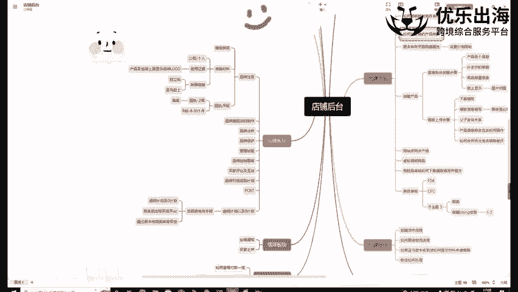
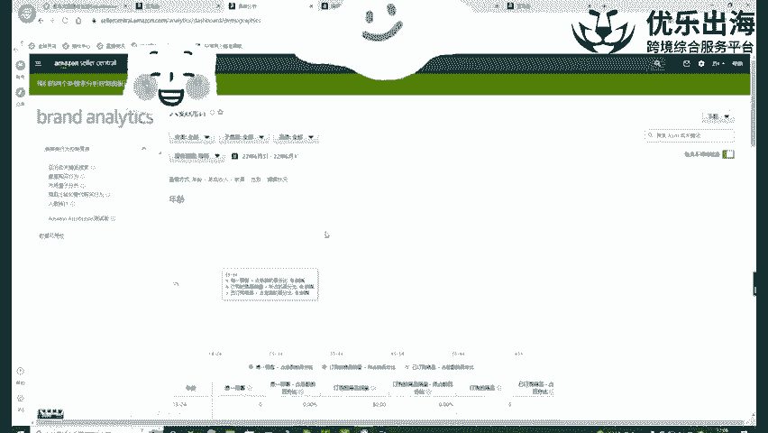
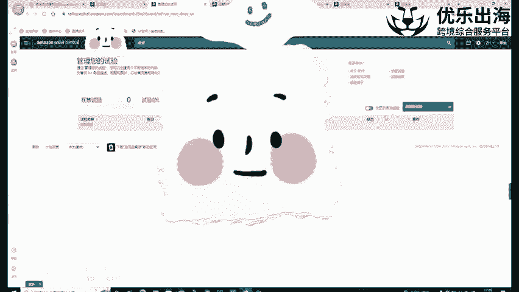
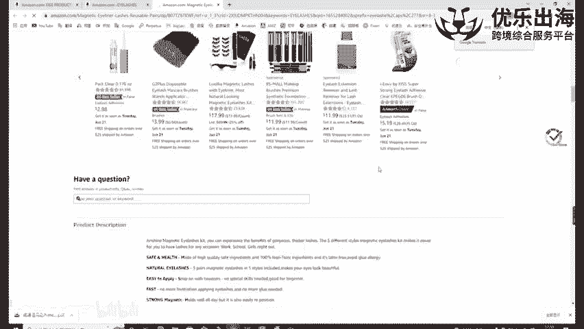
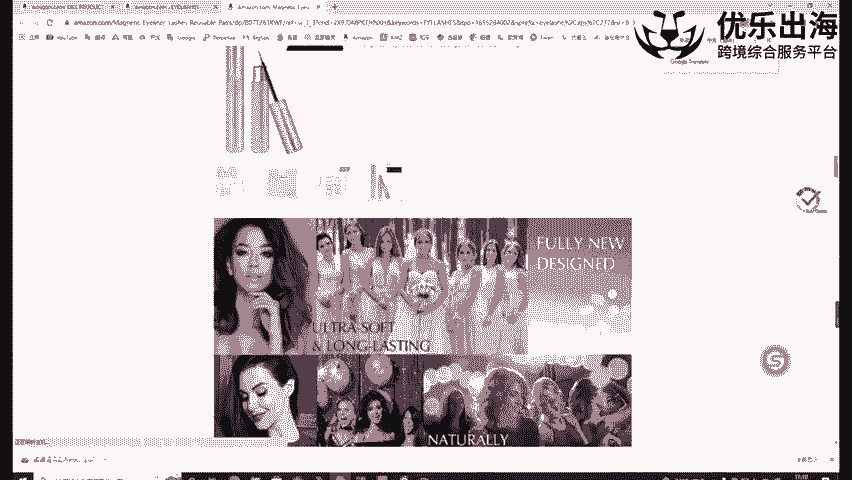
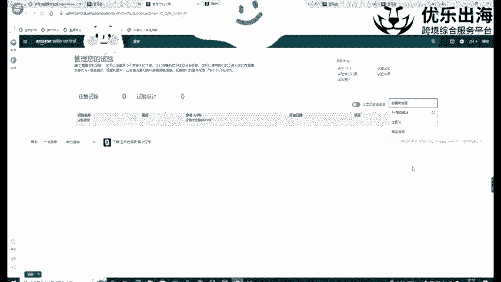
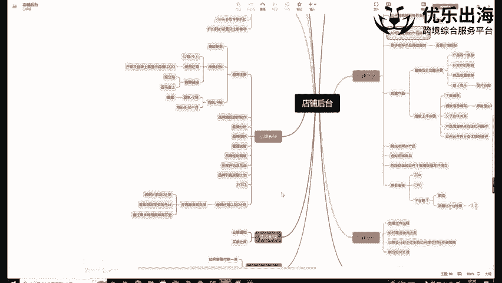

# 【TikTok跨境电商运营】B站最详细的新手入门TikTok／亚马逊开店教程，零基础亚马逊运营课程【合集】，亚马逊跨境电商入门教程（纯干货，超详细！） - P37：第20讲.品牌保护和管理试验 - 麒麟阁王师傅 - BV1cqtBegEpp

然后接下来是我们的一个品牌保护啊以及管理实验功能，可以看一下。

啊，品牌管理实验功能啊。这里。😡，我们可以看一下，就是在这里我们可以创建符合商商品标准的实验。我们可以呃去修通过啊就是不断的去对比我们的一个A加描述，主图描述以及我们的一个商品的名称描述。

因为我们那个可以跟大家去讲一下，影响我们点击率的一个重要的一个因素。主图啊是其中的一个比较重要的一个点，包括我们的个商品名称也是其中比较重要的点。

另外一个包包括评价和价格就是呃价评价的话并不是我们就是自己可以把控住的。然后价格的话呢，呃也是就是说我们这个不可能说是做一个亏本的一个售价嘛，对不对？所以说我们的一个呃可以操作的一个部分的话。

就是主图测试，就是ABtest一个测一个测试。我们可以通过这个实管理实验去测试出来我们这个产品的一个图片，就什么样的一个图片，这两张图片去对比。这两个类型的图片对比啊。

用实际的数据去表明哪一个图主图会更受欢迎一些。哪一个名称它的一个点击率会更好一些啊，那点击率会更好一些，以及我们的A加里面的布局。我们的产品的A加里面的一个布局也可以去做实验啊。

也可以通过这个功能去做实验，看一下哪一种A加的一个布局会提高我们产品的一个转化率。

这是呃品牌的管理实验功能啊，一般来说这个管理实验的一个时间是比较长的，一个月才会出来具体的一个效果。

