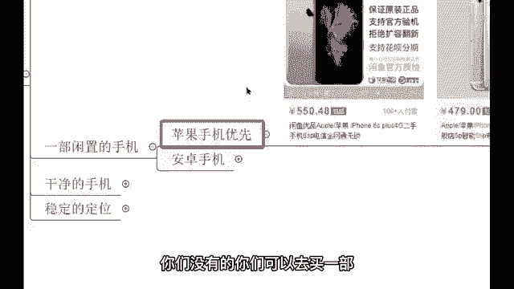
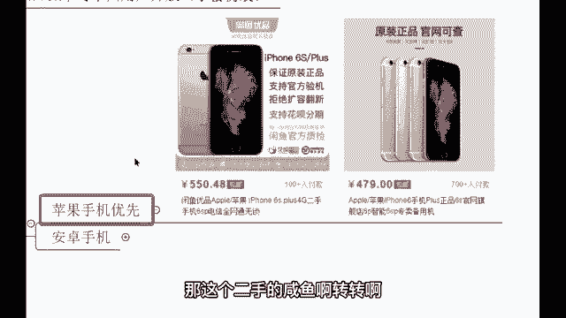
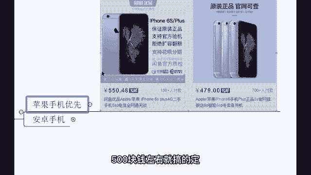
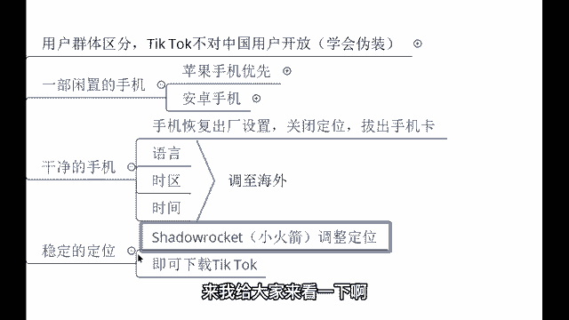
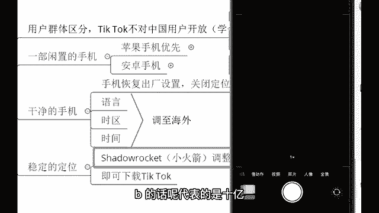
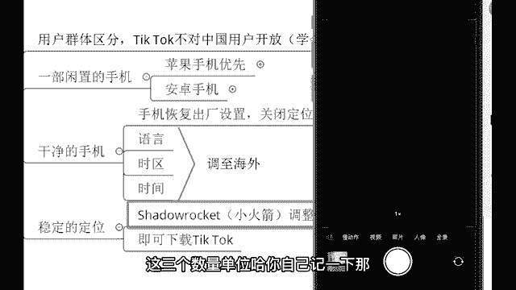

# 【TikTok跨境电商运营】B站最详细的新手入门TikTok／亚马逊开店教程，零基础亚马逊运营课程【合集】，亚马逊跨境电商入门教程（纯干货，超详细！） - P3：1.如何下载TikTok - 麒麟阁王师傅 - BV1cqtBegEpp

う。下载的话呢，你们要先了解到一个点。😡，这个字节跳动公司啊，人家的话呢把这个用户群体做到了一个区分。做到一个区分。咱们身为中国用户，咱们不能直接去下载。不能直接下你身为中国用户，那你就去玩国内的抖音。

如果说你是哎外国人，那你就去玩ktop。😡，所以我们现在想要去下载这个国际抖音。我们要学会伪装。学会伪装。伪装成一位海外的用户，我们就能够下载到了。首先各位你们先准备一部闲置的手机，准备一部手机。

这个手机呢，安卓、苹果都可以啊。老师我推荐啊用苹果，苹果手机的话呢不卡，而且的话呢这个苹果手机本身就是美国产的啊，那像这个苹果手机，你们没有的，你们可以去买一部。如果说没有这个呃手机做国际抖音的。

你可以去买一部。😡。

买个二手的就行哈，不要不要全新的哈。你要是做国际抖音，你专门去买一买一部iphone13pro max远风蓝。😊，那就太奢侈了哈那这个二手的闲鱼啊、转转啊，是不是淘宝、天猫、京东都可以哈。

500块钱左右就搞得定，500块钱搞得定。嗯，啊，那准备好了这个手机之后，我们要把这部手机变成干净的手机。有同学在问啊，老师，我能用自己现在看直播的这部手机吗？我告诉你。😊。

我告诉你啊，你这个不舍得，你绝对不舍得。因为我们要把这个手机做国际抖音的手机，把它恢复出厂设置，把手机里面的那些下载的应用，还有数据得要全部清除，恢复出厂设置。并且的话呢把手机关闭定位，拔出你的手机卡。

未来咱们去运营国际抖音不需要插卡，用wifi就行了。啊，你手机多是吧啊，行，拔出手机卡啊，并且的话呢把手机的语言时区还有时间给它调至海外。这个步骤的话呢一定要做做完这个步骤之后，我们呢要下载1个APP。

😡，这个APP叫做小火箭。自己做好登记啊。😡，小火箭。这个小火箭它的用途叫做调整定位。哎，调整定位。因为我们做完这一个步骤之后的话，我们的定位还在中国，还在国内。所以我们想要下载到国际抖音。

我们要把自己的定位定到海外。定到国外，老师定到哪里呢？你想去哪就去哪。英国、德国、法国、美国啊，英德法伊西嗯你随便啊都OK的啊。好，那进到了海外之后，我们就可以下载到国际抖音ok。

步骤呢就是这么一个步骤。自己捋一捋啊，可以做登记或或者截做截图都可以了哈嗯。😊，好，那我们的话呢给大家来看一下这个我的吧，我给你手机做个投屏。😊，哦。我给你们手机投屏一下。😡，给你们看一下这个手机投屏。

稍等啊。嗯，这个翻墙这个就是调整定位啊。😮，你所指的就是这个调整定位啊，直接的话呢把定位调到海外就OK了啊。来，我给大家来看一下啊，看一下这个老师我的手机。

能看到吧，这是我的手机。嗯，首先我让你们的是准备一部闲置的手机，还记得不？😡，准备一部闲置的手机，然后呢我们来稍等啊。我把这些先关了。准备一部闲置的手机之后，你看语言全部都是英语啊，我把这个时间啊。

把这个是吧地区，还有把这个语言全部翻译成海文的语言了。那接下来各位老师我全部都是英语，我看不懂怎么办？你管它是英语呢，这些的话呢，你压根就不需要用这些功能，你都不需要用，你只需要用这两个就行了。

一个呢叫做小火箭，一个叫做国际抖音。好，那我打开小火箭，打开之后，你看到的也就是中文。嗯，你说要懂英语才能做吗？啊，不是的啊，好，那现在的话呢是打开的一种是情况。来，我现在关了打开，现在是打开的状态。

看左上角，我是不是把这个手机卡拔了，没有sim卡，是不是中国电信中国联这个联通，还有中国移动拔出来，并且的话呢用wifi来做到一个运营，是不是VPN好，那紧接着开启之后，我们的话呢再打开国际抖音。😊。

打开国际抖音，你看它的页面是不是和我们国内的页面是一模一样的？和国内的页面是一模一样的，并且的话呢也是中文。是不是中文嗯，关注中推荐。你在上面你能够刷到100多个国家的视频，各位100多个国家来。

我们简单的划一划。这都是外国人发布的一些视频。有一些的话呢，是咱们中国用户在上面去做搬运的。这个视频的话呢，我在国内见过800多的点赞啊，现在人家发出去了。嗯，你们可以简单看一下哈。

到时候的话呢下载的时候呢，如果说有哪里不懂的，你可以在私底下问老师啊，可以在私底下问老师。😊，这个就是国际抖音了。你看下方下方的话呢，首页发现收件箱和个人主页啊都是一样的哈。

来呃有一个点啊要给大家来讲一下，就是人家的一个数量单位。各位数量单位，我们所看到的。😊，我们所看到的这个2。8M看到没有？外国的数量单位和我们中国是不一样的，这个M是百万的意思。如果说在我们国内。

百万呢就是280万的点赞量。它是直接显示280万的点赞量，是不是？但是的话呢在海外它是用M来做这个代表的。啊，M来代表我我跟你们说一下三个数量单位哈，第一个叫做KK等于千。😊，A是千的意思。

M等于百万的意思。还有一个是BB的话呢代表的是10亿。

1意。这三个数量单位哈，你自己记一下。那嗯就这个视频的话呢，280万的点赞量。😊。

因为外国的流量是很大的哈，所以说像这种百万级别的点赞很常见。😊，千万级别的点赞也有啊啊，那像这个2。8就是280万的点赞量。那下面的55。6，那这是什么？那这是5万哎55600个评论。

还有25400个转发嗯呃，课代表是吧？可以哈。好，那你看40万的点赞量。😊，呃，都是K和M啊，还有B来去做的一个代表的哈。😊。

