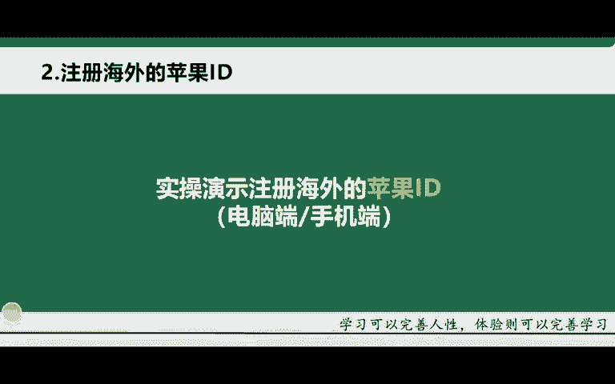
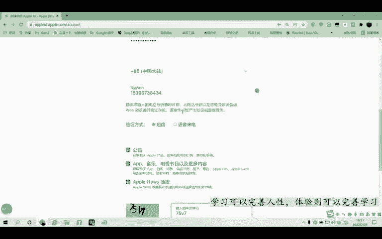
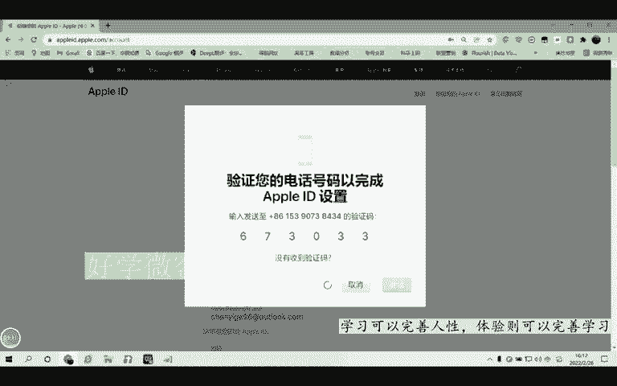
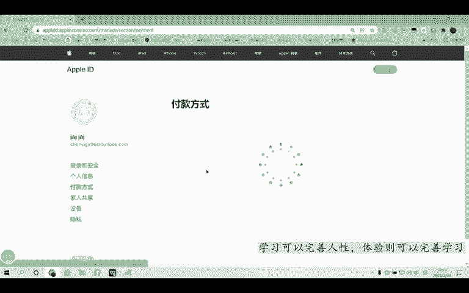

# 【TikTok跨境电商运营教程】学会怎么赚老外的钱，整整1000集，呕心沥血700小时从入门-运营-店铺-物流，涵盖市面所有教程！ - P11：8.注册海外的苹果ID（电脑端） - 滩长 - BV1sK2RYnEA4

OK啊，那接下来的话我给大家去讲这个第二个步骤啊，第二个步骤的话就是一个海外ID的一个注册啊，海外ID的一个注册。那在前面我给大家讲过，就是我们在APPstore里面去下载这个APP的时候啊。

它都需要1个ID啊，就是你们国内用的手机对吧？用过苹果手机的同学都知道它必须要有这个ID因为你没有ID你就下载不了这个软件啊，下载不了这个APP所以说一样的那我们还是要注册这个海外的ID啊。

那注册海外的ID的话，我这边也会给大家进行详细的一个演示。首先的话电脑端应该怎么去注册啊，手机端应该怎么去注册啊，详细的教程的话，我会以给大家一步一步来进行一个实操。好吧，嗯。

那接下来的话我就给大家去实操一下这个演示的一个流程啊。

大家好，我是卡尔老师。今天的话给大家录制一个电脑端，如何去注册海外苹果ID啊。首先的话我们打开这个自己的浏览器啊，你自己那边的话有谷歌就打开谷歌。如果说没有谷歌，你使用其他的浏览器，比如说像360安全。

或者说其他的都可以啊。打开浏览器之后，在这个浏览器的这个搜索栏输入ipod点ID啊就是苹果ID的一个官网。就这个官网啊apple ID的com，然后输入进去之后的话，点这个右上角可以给你们放大一下。

右上角这里的话有一个创建您的ID啊，然后点击一下。点击进去之后，这里的话就需要去填写你的这个姓名啊，包括这个名字啊，这里的话你可以随便去填写啊，比如说。哈哈啊，但是这个填写的话就是用英文就行啊。

就随便填写都没关系啊，随便填都没关系。然后第二个的话就是地区地区这类的话，我们需要选择美国，一定要去选择海外的地区啊，海外地区不要去选择国内的啊。然后这个出生日期的话。

这里的话我们就需要去填写到这个大于18周岁就行啊。比如说1997啊，或者是1996都行啊。然后这里的话就随便去选择啊，日期只要大于18周岁就行。一定要记得，就是这个国家跟地区要选择海外的。

比如说你要注册美国，你就选择美国，注册英国，你就选择英国就行。然后这里的话就是你的邮箱。那我这里的话给大家准备了一个oc look的邮箱，outlook邮箱好，然后大家填加上去。

密码这个的话也是一样的啊，密码的话就需要设置一个8个字符大小写啊，数字。然后我这边填写一下这个密码。OK密码填写完成，这里的话，需要输入我们自己的一个手机号啊。

这个手机号的话就填写一个这个我们自己国内的就行啊。738434okK啊，输入这个手机号之后啊，输入这个手机号之后的话，点击下方这个验证码啊，就是它有一个验证码的输入。OK好后呢，点击这个继续啊。

前面的这些东西的话，我们都已经输入的差不多了啊，直接点继续。

然后他会在你的这个邮箱里面发一个这个验证啊，就是你的邮箱里面发一个验证码。然后你去你的邮箱啊，因为我在这个注册之前已经登录了我的邮箱，可以看到，这里就会发一个邮件过来。然后你点击打开。

然后这里复制这个验证码啊，回去再听到这里去，然后点继续。然后呢，它会在你的手机的话发送一个验证码啊，这个的话就是验送呃验证手机的。我这个码稍等一下。嗯。6673033okK然后点击继续。

好，那这个的话就是我们的这个呃整个的1个ID就已经登录好了啊，都已经进来了。那我们接下来的话就需要去给他填写它的一个付款信息啊，需要填写他的一个付款信息。那付款信息的话，然后需要在什么地方呢？

就是点击这里啊下方的话有个付款信息。这里，然后呢点击这个添加付款方式啊，然后把付款方式给它添加上去。那这里的话就是我们因为注册的是海外的这个ID嘛，所以说我们需要这个海外的信息。

所以说我们还需要一个海外的身份信息网站啊。然后的话就。把这个信息填写进去，我找一个海外的信息网站啊。稍等一下啊，打开我们的这个浏览器，然后在这里去输入海外人哎。海外人信息海外人身份信息啊。信息网站。

ok好后，点击第一个啊。进去之后的话就是这样的啊，我们可以把它对应的信息。比如说像它的街道啊，城市啊，邮编以及这个周还有电话，都给它复制过去。啊，也就是说我们的ID里面需要填写什么。

然后我们给它复制什么就可以啊。然后可以这里地方美国啊，就付款方式的话，它这里选择的是无这个地方的话，我们不需要管它，不需要动啊，默认就行。然后街道这里的话，我们就把它复制过来，可以看到啊，这里有街道啊。

然后你把它这个复制过来，添加到这个街道里面去。然后像这个楼号这些地方你都可以随便填啊，就填个一就行啊，填个一就行。城市的话需要给它复制过去啊。因为城市的话，它能够查得到啊，城市就需要还有州州的话。

它这里可以看到啊，州的话，它是英文那这个英文的话，我们不知道它是哪个地方的那，所以说我们需要把它翻译一下。比如说复制这个。搜索一下这个谷歌翻译。或者说百度翻译都行啊，这两个这两个东西的话都可以翻译啊。

就是正常我们日常用的这个翻译的软件啊。百度牌谷果没有翻墙的话，可能进不去。OK然后的话复制刚刚的这个洲，可以看到吧？这个阿拉巴马州啊，然后呢找到这个州。阿拉巴马州。啊，这个是亚腊啊。

这个应该是翻译错了啊，这个是亚腊巴马州啊，然后找到这个州之后，我们还需要去把它的邮编啊，就这个邮编给它填写进去啊，填写进去，然后呢，再把它的这个电话号码也是一样的啊，他这里应有尽有啊，就给它一对应。

说白了就是给它复制粘贴过来的一个事情啊。然后呢，你上面的这个账单的一个送货地址啊，一定填写完成了之后，他这里有一个什么拷贝账单寄送地址啊，直接拷贝。因为你下发的这些送货地址也需要填写嘛。哎。

你直接点击这里拷贝拷贝就行。然后公司这里的话可以填也可以不填啊，要填的话，填个一就行啊，这些东西都不是很重要。因为他只是说记助每国人的身份信息，然后呢，我们来把它注册一个账号啊就行。

把这些所有信息都填写完成之后啊，填写完成之后，点击这个右边的更新啊，点击一下。点击更新啊，当它出现这个界面的时候，就已经更新完成了啊，就是它已经储存好你的更改了，然后把这个关闭啊。

然后呢回到我们的这个付款信息刷新一下。付款方式刷新一下，我们之后再点击进去啊，再点击进去。啊，OK你可以看到你的这些所有信息都在了吧，是吧？那这个情况下的话。

我们就是把整个的一个苹果ID从最开始的注册到后面的付款方式来填写啊，整个都填写完成了。

