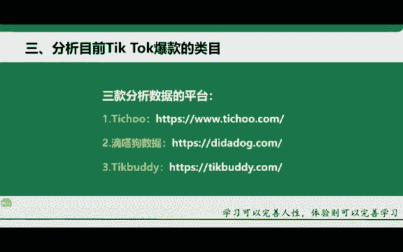
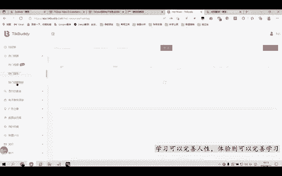
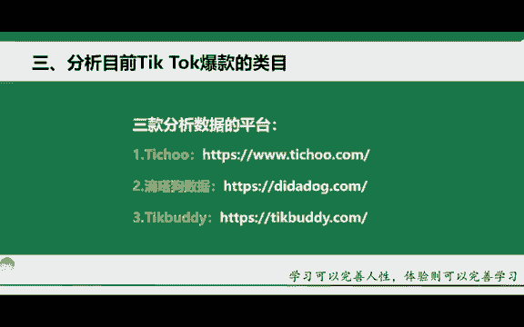

# 【TikTok跨境电商运营教程】学会怎么赚老外的钱，整整1000集，呕心沥血700小时从入门-运营-店铺-物流，涵盖市面所有教程！ - P21：20.分析目前Tik Tok爆款的类目 - 滩长 - BV1sK2RYnEA4

OK那第三个的话给大家去讲一下这个目前在TK上面的一些爆款的一些类目啊，其实这些类目的话都是有数据可寻的啊，有数据可查的的那这个的话就是我给大家去找的三款这个数据分析的平台啊，那国内抖音的话。

它都有自己对应的一些平台，数据分析平台。那一样的。海外的话，它也有对应的一些数据分析平台啊，首先第一个的话就是地址啊这个工具那这款工具的话主要是针对于这个带货直播啊。

电商这一块来分析的那这个迪答狗数据那相对来的话是比较全啊，里面有包含了这个达人的数据，每天发了作品以及像这个热门视频，热门音乐标签等等啊，都有啊。那第三个的话就是这个呃TK啊，应该是这个这么读吧啊。

老师的英文不是特别好啊，就这个工具的话，它也是一样的，跟第二款工具都是一样，相对来讲比较全啊，那相对来讲比较全，我给大家去展示一下啊。

那我这边的话给大家打开这三款工具啊，第一个的话就是t。第二个呢就是滴答狗啊。第三个的话就是这个TKdy啊，应该是这么这么读吧啊，然后就是T址T址的话，你可以看到啊，这边的话它有我给大家翻译一下。

因为它是英文的那T的话它需要在翻墙的一个情况下去进行一个实操啊。如果说你的电脑没有翻墙，那你就进不去啊，在这里给大家去讲一下哈啊，有很多同学的话，如果说你电脑没有翻墙啊。

你就看这个电脑端如何去翻墙的一个课程啊，我也会录给大家啊，所家可以进来看到啊，这里的话就是挡泥版啊，这个是翻译的问题，它其实的话这里就是一个排行榜。然后这个的话就是一个创作者。

然后中间这里的话就是一个产品啊，那这个软件的话，它是收费的啊，是收费的那这三款软件，唯一一个不收费的话，好像是后面这一款软件啊，就是这个TKdy啊，就这个软件的话，好像是不收费啊。

其他两款软件的话都是要收费的啊。但是。如果说你想要去使用免费的也可以啊，使用免费的也可以。那我们学这个软件是用来干什么呢？就是我刚刚所讲到的一个功能。数据分析还有呢选品啊，就是爆款的一些类目。

我们来看一下啊，简单给大家来讲一下，可以看到这里的话我点的是这个T的一个数据。然后这里是选择产品。然后呢我们来看一下这个前面几个相关的卖的比较好的一些产品。首先第一个什么口罩啊。

那这个口罩的话相对来讲是疫情嘛。现在刚好迎合这个市场，所以说它的这个销量比较大啊，而这个贝拉广场，这个我不知道是什么啊，还这个是喝的一个东西啊，这个是什么这个是水杯，那这款的话是我们完全可以去做的。

首先第一个它不涉及到任何安全性的问题啊，而且的话也不会涉及到什么像物流特别难发货等等啊？杯子嘛，就一款杯子对吧？杯子相对来讲是特别好发货的啊？这款杯子在国内的话应该也就9。9块啊。

甚至说1688的话比9。9块应该还要低啊。所以这个品的话是特别好的啊，我们再往下看。还有这个香薰啊，香什么喷喷的提取物啊，还有这个美妆类的啊，美妆类的那所以说你在通过这个。账号啊，就是这个网站。

你可以分析出排名靠前的一些产品。也就是说能够对我们刚开始新手来讲去定位这一块类目的时候，可以大致有一个思路了。对吧？比如说你可以看到那在这个小店里面啊，在这个TK上卖的一些好的产品都有哪些啊。

这样心里有一个大概之后，你就能够去把它自己后期要做的一些类目给它大致确定下来啊，可能你完完整整确定不下来。但是至少对于你后期大的一个方向，你完全是可以把它定下来的啊，所以说这就是你这把工具的一个优势啊。

可以看到这里的话就是它这这个印尼啊，印尼的一些店铺啊，其实你看像前面的话这几家前十啊，淘宝前十都是印尼印尼店，为什么就是呃印尼这个都靠前了，是因为印尼小店它开的最早啊，所以说就是他小店也是做的最早。

所以说你看他的小店店铺啊，靠前都比较多啊，这里下方的话还有一些这个热门视频啊，我们都可以看。还有一些这个顶级创作者啊都是一样的，就是我们用来去分析，用来去参考的啊，用来去分析，用来去参考的。

这个网络比较慢啊，所以说家里的话会相对比较慢。那大家自己下去之后啊，你可以去进行一个观看啊，进行一个观看。这个的话就是印尼啊，这个还是美国的啊，可以看到它这里都有标识。印尼啊，这个上面的话。

这是个英国啊，不是美国英国说错了啊，英国。然后呢它带的是一款这个迷你多功能果蔬清洁器啊，清洗机啊，就是说美容可以针对它的一个视品，以及它带了一个产品进行一个做对比啊，进行一个做对比。那第二个也是一样啊。

我给大家看一下这个滴答狗也是一样。它这里的话有产品啊，就是综合数据的一个产品，而且它这里还相对来讲比这个T取分的要更加详细，为什么呢？它能够将每一个类目都分的特别细。比如说啊办公用品，对吧？

还有这个女装啊，或者说宠物用品，或者说家居园艺啊，家用电器等等，这些它都有啊，比如说我选择一个运动护卫啊，然后我在这里点确定搜索一下。可以看到啊这几款产品啊都是相对来讲在靠前的啊，就靠前的综合数据这里。

相对来讲还是比较靠前的。比如说播放量啊，视频者或者说推广者，我们看一下播放量吧啊，以播放量为例啊。以爆放量为例。相对来讲大部分的话都有一个特别高的一个播放量啊，这个是亚马逊的一个美国站啊。

挂的是个链接啊，然后我们再看一下其他的一些种草的一些视频。为什么我要去看种草的视频？这里就给大家提到一个点啊，你会发现像我们这个国内啊也有种草的一些视频。那海外同样的也有这个相对应的种草的一些视频。

而且呢它会单独生成一个标签啊，就是单独生成这一个标签。然后好多的这个T开达人它都会去推这款产品啊，这就叫一个种草啊，这就是个种草。那同样的你国内的一些这个产品想要去出口海外也是这样同样的原理啊。

你得有去打人去做推广，或者说你自己自己得去做账号做一个推广好吧。那这里的话具体的一些其他的功能的话，我就不给大家去演示了啊，大家下去之后可以自行去呃看啊。因为这个都比较能看懂啊，就比如说某一个数据。

每一个数据都能看懂啊，就是一些数据的排行，数据的播放量啊，数据的这些这个呃视频的一些播放量啊，数据的一些这个整理等等啊，就各个方面的都有，你们自己下去去看就行。而有第三第三款工具的话也是一样的啊。

就是热门的一些视。视频啊，还有这个热门的一些音乐啊，这里的话还有一些热门的话题，对吧？

你们下去自己去看就行了。我在这边讲课的话，就不给大家去浪费太多的时间去看了啊。那为什么要去分析这个的话，我给大家去讲一下啊，只有我们去找整这个用户啊，找准用户，找准这个平台的这个市场。

那我们才能这个对症下药嘛，对吧？才能去输出更好的一个内容啊，所以说分析数据，就是为了更好的去输出我们的内容，优化我们的作品啊，优化我们的一个产品，这个是非常关键的啊，优化数据是很关键的啊，记住。

