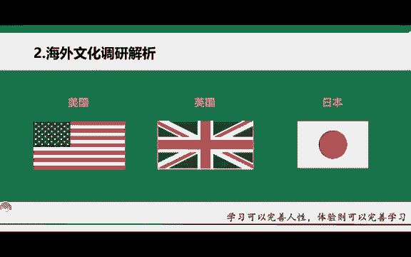
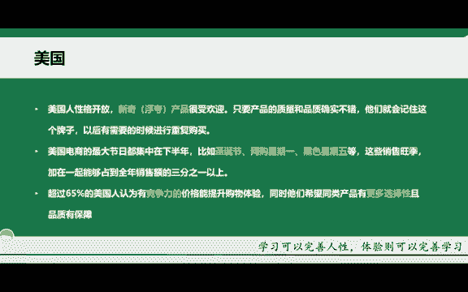

# 【TikTok跨境电商运营教程】学会怎么赚老外的钱，整整1000集，呕心沥血700小时从入门-运营-店铺-物流，涵盖市面所有教程！ - P22：21.海外文化调研解析（美国） - 滩长 - BV1sK2RYnEA4

那除了我上面给大家去分享的这个三款数据分析的一个平台，也就是产品采集的一些平台，分析数据的平台之外。那还有一些其他的，比如说像亚马逊的一些新品啊，销量排行榜，新品销售榜啊，以及英国的这个销量排行榜。

德国的销量排行榜，还有日本的销量排行榜等等啊，还有苏媒通销量排行榜等等。那这些平台的相对应的排行榜，我们也可以去做参照啊，我们也可以去做参照，所以说能够去参考数据的平台有很多很多啊。

就是看你自己用不用心，自己这个有没有去参考。因为很多同学他会说哎老师我不知道怎么去做哪些类目，我不知道选哪个产品等等啊，其实是并不是说你不知道只是说你不了解啊，你不知道这个东西在哪里去找。

那今天我就把这个找到一些地方参考数据的一些平台教给大家啊，大家下去之后用这些平台去搜索啊，至少的话你能够去看到在这个平台，哪些销售量是高的啊那。高的他肯定这个产品是大卖的啊，我们可以去做的一个产品。

知道吧？啊，那这些网站的话，我就不给大家一一打开去看了啊，你们记住这些网站就行啊。当然我后期的话也会将这些网站整合在我们的ttok知识在线文档里面啊，你们也可以打开直接去观看啊。

直接复制链接在浏览器里面就可以打开，但记住啊，需要翻墙啊，需要科学上网。OK那第二个的话再给大家去做一个海外文化的一个调研啊，那为什么呢？就是像我前面刚讲的一句话，就知彼知己啊，才能百战不殆嘛，对吧？

你都不知道这个平台，国家的一个市场，那你怎么去输出针对性的内容啊，这个是特别关键的。因为我们是什么？我们是华人，华人对于海外的一些生活，一些这个习惯他们所喜欢的一些物品产品我们自己都不了解。

那怎么样去了解他们呢，就需要做一个文化的调研啊，我就以这三个国家为例。第一个的话就是美国啊，那首先的话，美国人他相对的话性格的话比较开放啊，他比较喜欢一些新奇特的产品啊，就比较一些反差浮夸啊。

特别这个反差特别大的一些产品啊，就比如说刚开始呃我前两天还在抖音上看到这样的一个视频啊，就是一个土豆啊，一个削土豆的一个削土豆的一个机器啊，然后刚开始的话，他是用一个特别low的一个呃削土豆的一个机器。

然后后面他又展示一个特别工整的一个机器。那这两。

哥的话就是一个特别大的一个反差啊，这样的话，他其实在为什么为他后面的这个产品去做销售的啊，所以说老老外的话就是美国人啊，老美他是特别喜欢这样的一个产品的。所以说一定要给他营造出一个什么新奇特的一个感觉。

而且的话在老美的这个眼里啊，他的这个解压类的一些产品也是特别喜欢的啊。美国人啊解压类的也是特别喜欢的啊。还有的话就是他们只要你保证这个产品的一个品质跟质量的一个情况下啊，一般都会进行一个重复购买。

什么叫重复购买，就是二次复购啊，就像我们国内购物一样，你对这家店啊，他的一个服务，或者说对这家店的一个产品有足够好的一个信任之后啊，你肯定会下次再去这家店购买嘛。在一样的，老美也是一样啊。

我们一定要去把这个客户后期的一个售后给他做好。这样的话，他才能进行一个复购，对吧？那第二个的话就是他的最大的一个节日都集中在下半年。比如说像什么圣诞。节啊，星期一啊，黑五对吧等等。

那这些的话都是他销售的一个旺季啊销售的一个旺季。而且的话占了全年销售总额的3分之1以上啊，就是在下半年来讲的话，美国的一个市场是大大开放的啊，尤其是像圣诞节黑色星期五啊。

还有的话就是超过65%的美国人认为竞争力的一个价格能够提升它的一个购物体验啊。什么叫竞争力的价格？就是你的这个价格要高有低啊，有这样的一个竞争力啊，就能够体现出他这个产品的一个高低的啊。

在美国人眼里特别好啊，同时也希望就是同类型的产品有更多的一个选择性啊，什么叫同类型的产产品有更多的选择性的，就是你同一款产品，但是有不同形状，不同颜色啊，不同这个类型的一个选择，让它有的选择啊。

有品质的一个保障，对吧？这种的话就特别好。比如说你买一款杯子，这款杯子的话，有不同颜色，而且的话有大小啊，还有不同形状的。比如说有像类似于熊的啊。

有像类似于狗的啊这种这种这种的话就是特别有购物的一个体验感啊，给这个美国人的话就是特别喜欢啊，这是老师在这边给大家去讲的一些美国人他的一些购物习惯啊，就是他那边的一个文化习俗啊。

