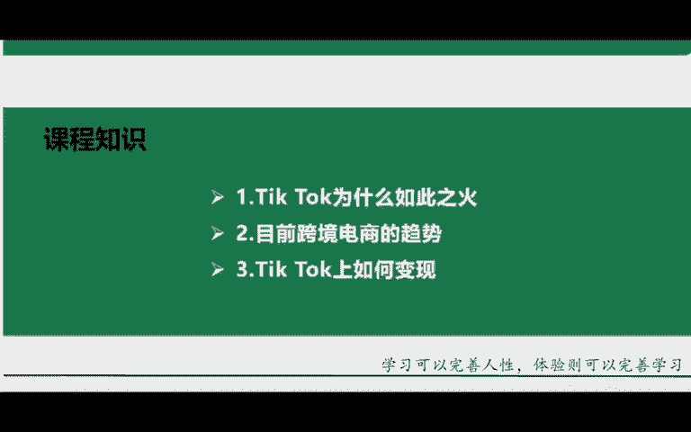
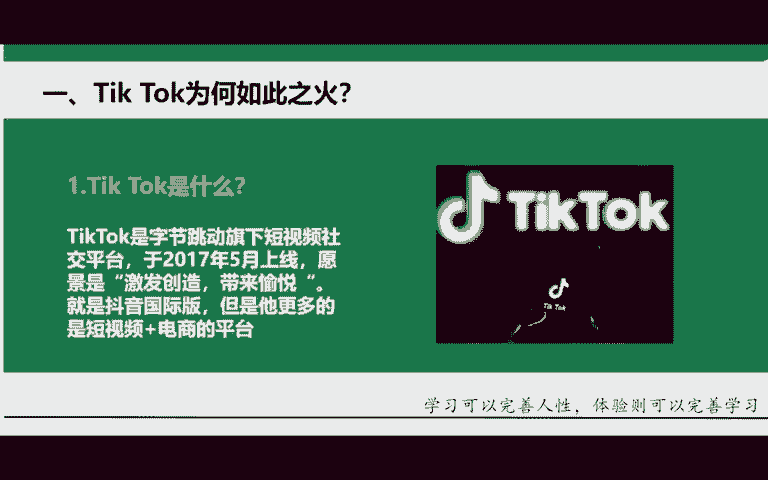
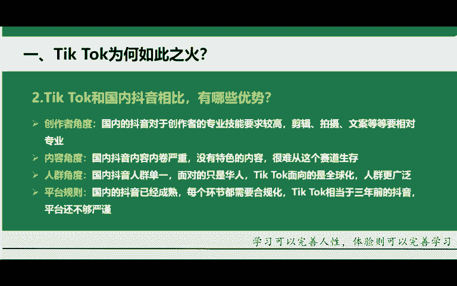
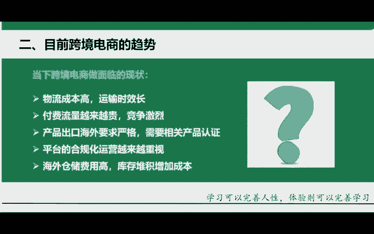

# 【TikTok跨境电商运营教程】学会怎么赚老外的钱，整整1000集，呕心沥血700小时从入门-运营-店铺-物流，涵盖市面所有教程！ - P4：1.Tik Tok的认知及未来趋势 - 滩长 - BV1sK2RYnEA4

记抖音tktok的认知以及未来的趋势。在讲之前，我希望大家能够说去把自己珍藏多年的笔和纸给它拿出来，给他做到一个登记。有句话说的好啊，叫做好记性不如烂笔头。把今天老师我所讲到的所有重点给它登记起来。好。

给大家看一下，今天咱们这堂课能够学到什么内容。😡，分为三个点。首先，国际抖音为什么会这么火？第二，目前跨境电商它的趋势。第三，国际抖音它该如何去做到一个变现？咱们先从第一个知识点来做到一个学习。

国际抖音它是什么呢？先从这一个点开始。国际抖音它是自节公司旗下的一款社交娱乐平台，于2017年5月份来做到一个上线。那愿景的话呢是激发创造，带来愉悦啊，就是抖音国际版啊和国内的抖音，他们俩是亲兄弟。

但是他现在更多的会倾向于短视频加电商的平台，就他必将走向国内的一条老路。他会和我们现在的国内抖音变得一模一样。因为他的公司是同一家叫做字节跳动，他们的老板也是同一个叫做张一鸣。

那国内抖音他都这么的成功了。那未来他必将走向国内抖音这么一条路。好，那这个就是国际抖音tickt。简单给大家来去介绍一下，了解一下。那紧接着我们来说一下，第二个点就是国际抖音和国内抖音来做到一个相比。

有哪一些优势？

角度比较多，咱们先从第一个角度，创作者的角度。首先，国内抖音它对于创作者的专业技能要求是比较高的，剪辑、拍摄文案等等，它都是相对的要更加的专业一些。因为国内的优质创作者是太多了。

第二个角度内容国内抖音内容的话呢，内卷的太严重了，没有什么特色的内容。你很难从这个赛道当中去做的一个生存。第三，人群角度，国内抖音人群是非常单一的哈，面向的话呢只有华人。

而国际抖音tktok它面向的话呢是全球化人群是更加的广泛。第四，平台规则国内的抖音它已经是非常成熟了，各方面的闭环都已经都已经是形成了，每个环节都需要更加合规化。

而tktok它就相当于咱们三年前的国内抖音。平台还不太完善，也不太严谨。😡，那这个的话呢，就是为什么如此之火我们选择的一个原因。

那紧接着我们来讲第二个，目前跨境电商它的趋势，当向跨境电商，你要去面临怎样的一个现状？就很多咱现场的话也可能有在做。😡，亚马逊的有在做速卖通独立站、薛拼贩哎，虾皮等等等等啊，一切这样的一个跨境电商平台。

😡，那可能接下来这几个点啊，你会深有体会。第一，那物流成本它现在的话呢是变得非常高，运输时长可能是哎半个月，甚至的话呢是一个月的时间。第二，付费流量呢是越来越贵了啊，竞争非常的激烈。第三，产品出口。

海外的要求是非常严格，你要有相关的产品认证。第四，平台的合规化运营呢也是越来越重视了哈，海外仓储费它是非常的高的。如果说你库存堆积哎，你需要增加这样的一个成本。怎么给大家讲。

像你如果说去做的这个国际抖音。第一个点，物流方方面，国际抖音它是有一个物流补贴，物流的补贴的，你的费用不会说那么的高。第二，我们去做国际抖音，他的话呢流量他不需要花钱，它是免费流量。

只要各位你们去发布这样的一个作品，你的播放量上去了，那他们就会进入到各位同学们，你们的店铺里面去购买东西。😡，而你发布作品这个东西他需要花钱吗？他不需要买。所以说啊对于这个流量来讲，它是一个免费流量。

😡，产品出口还还啊产品出口它的一个要求比较严格，需要相关的一个认证。你比如说你想要去做亚马逊这些平台，你比如说你想要去卖玩具，你得要有一个CPC的一个认证。就各种各样的一些证书。

但是如果我们去做这个诶国际抖音，我们可以去做带货，或者说我们可以去运营其他的一些平台都是可以的，可以运营一个小店，相关认证各方面的话呢，目前也是不太需要的。好，那像现如经国际抖音，它也是刚刚才火起来。

而且的话呢，很多地方还是不太完善的，完全是可以去做这么一件事的。😡。

