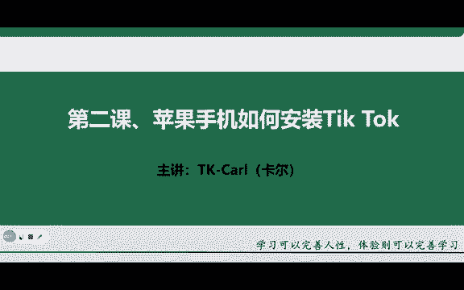
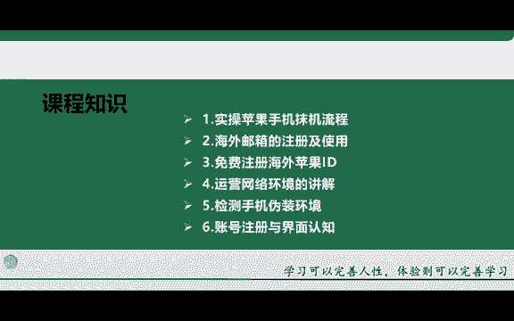
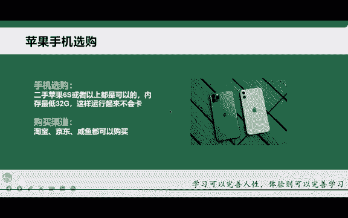

# 【TikTok跨境电商运营教程】学会怎么赚老外的钱，整整1000集，呕心沥血700小时从入门-运营-店铺-物流，涵盖市面所有教程！ - P6：3.准备工作-手机的选购 - 滩长 - BV1sK2RYnEA4

欢迎观看本节课程啊，那这节课的话是给大家去讲解苹果手机如何下载安装tktok啊，那也是作为一个新手小白去上手来做t开这个第一步的一个操作啊那首先这节课的话分为以下几个知识点，大家进行一个讲解啊。

第一个知识点的话就是如何去进行苹果手机的磨机啊，苹果手机的话，当然我们用的是自己常用的是国内的这个国行的手机。但是呢我们要把它模拟成海外的这样的一个版本。那我们首先要对这个手机进行什么进行磨机啊。

那第二个的话就是一个邮箱的注册啊，因为这个邮箱是我们后期要用来注册tktok来使用的啊，所以说邮箱的话也必须要去注册好。第三个的话就是如何去注册好自己的一个海外苹果ID啊。

大家都知道我们在使用苹果手机的时候，自己的话这个手机上都必须要有一个ID啊，如果说你没有这个ID的话。

你是没有办法在这个苹果手机里面去下载app的啊，所以说我们一定要有这个苹果的ID。第四个的话就是一个网络环境的搭建啊，网络环境的一个搭建。那第五个的话就是我们整个手机的一个伪装环境的检测啊。

因为我们为什么要去检测它这个环境呢。如果说你的环境不对啊，或者说有问题那你在后期运营这个TK的时候，它肯定会出现问题啊，会肯定出现问题。所以说我一定要把这个环境给它检测好。

那第六个的话就是一个账号的注册及TK界面的一个认知啊。那首先的话我们一个一个来看啊，一个一个来看。那在讲这个第一个知识点之前给大家先讲一下这个苹果手机的一个选购啊。

因为有很多同学他在这个购买手机之前它不知道要购买哪一款手机啊，虽然说苹果手机这个就只有这一个系统啊，但是它的种类还是要比较多的对吧？比如说像苹果6S啊，苹果7苹果8对吧？

苹果叉啊等等很多很多。那这边的话老师给你们推荐他选购的一个基础啊，就是6S啊，6S就可以。因为老师这边的话也是在用这个苹果6S啊，就是说你也没必要就是说购买一个特别贵的啊，比如说用这个苹果13啊。

苹果12等等啊，这样一些手机的话是没有必要的啊。因为我们只是说用它来去做一个账号啊，所以说每一个二手的苹果6S手机就ok了。但是呢对内存这方面的话，其实还是有一点小小的要求啊，就是你最低的话是32G啊。

不然的话，你在运行这个TK的时候，后期肯定会卡啊，肯定会卡。所以说一般建议大家就是在使用的时候啊，就是在购买的时候，最低32G啊，就是它的一个运行内存啊，当然如果说你购买64啊。

128这个的话都是没有任何问题的啊。那如果说你购买更高的，比如说像苹果七、苹果八啊，还有苹果叉11、12啊，13等等。都是完全OK的啊，就是最低的配置的话，我们就建议大家去买这个苹果的二手的这个6S啊。

就OK了啊。那第二个的话就是一个渠道啊，很多同学不知道在什么地方去购买。首先第一个的话就是淘宝嘛，对吧？大家平时这个用的最多啊，还有京东像闲鱼都可以啊。

但是有一个点就是大家在购买之前先这个询问厂家这个手机的话，能不能这个恢复出厂设置，也就是说能不能抹机啊，如果说抹不了机的话，那这个手机的话，你购买来也是不能去使用的啊。还有第二个点的话。

就是你在选取购买的时候问一下这个商家啊，他这个手机里面有没有ID为什么呢？如果说这个手机里面有ID没有退出的情况下，你在这个裸机的过程中，他让你输入密码，那你不知道对吧？

所以说这个也是没有办法进行裸机的。所以这两个点的话，大家需要注意一下啊，相应的细节那如果说你真的不知道在什么地方购买啊，没有这个值得信赖的一个地方的话，那你怎么办，你就找老师啊。

老师这边的话可以帮你推荐啊，帮你推荐。那这个的话就是我们前期做一个手机选购啊，需要给大家去讲的。

