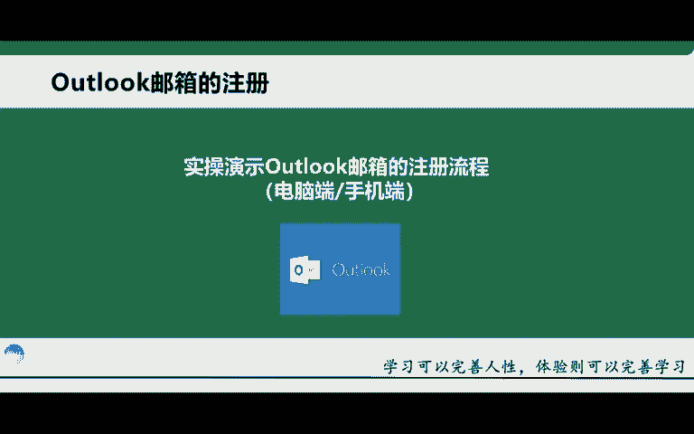
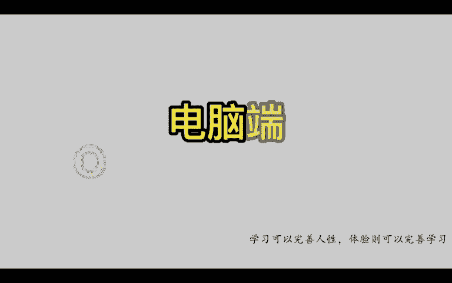
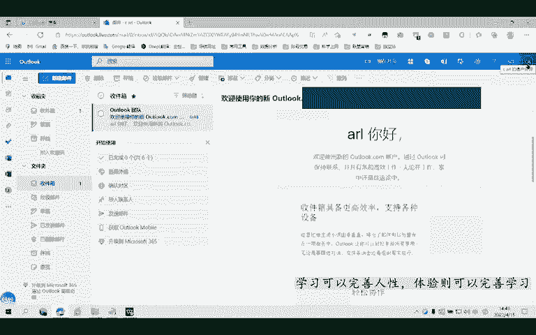

# 【TikTok跨境电商运营教程】学会怎么赚老外的钱，整整1000集，呕心沥血700小时从入门-运营-店铺-物流，涵盖市面所有教程！ - P7：4.准备工作-邮箱注册（电脑端） - 滩长 - BV1sK2RYnEA4

啊，接下来给大家去讲一下这个邮箱的一个注册啊，邮箱的一个注册。那在前面我刚讲过啊，为什么我们要去注册这个邮箱？就是这个邮箱用来注册我们后期的比如说tktok的一个账号啊，以及我们的这个苹果ID啊。

以及我们还要注册其他的一些东西等等啊。也就是后期都会用到这个邮箱那邮箱的话，我一般推荐大家去注册这个outlook的一个邮箱啊，outlook那当然你注册谷歌的话也行啊，注册一些其他的海外邮箱也可以。

但是老师这边就给大家统一啊，让你们去注册这个outlook邮箱。那为什么要推荐大家去注册这个邮箱呢？首先第一个点，它注册的话比较简单比较方便啊，比较简单比较方便。而且的话也不需要你去啊输入这个手机号。

每天的话你都可以注册三个邮箱啊，每天可以注册3个。但是呢如果说你在这个科学上网的一个情况下啊，科学上网的一个情况下，那这样的话，你换不同的一个IP，它也可以注册3个啊。就是说你只要在一个IP上。

它每天顶多就。三个账号啊，不过你每天都可以注册嘛，所以说这个也就是说无限循环的这个注册啊，你邮箱的话是完全不缺的啊，那我这边会给大家去进行一个详细的演示。首先第一个的话就是电脑端的一个注册啊。

第二个的话就是一个手机端的一个注册。因为考虑到考虑到了有很多的一个同学，他可能没有电脑啊，所以说我这边也会给大家进行一个手机端的实操演示好，那接下来的话我就给大家去这个演示一下这个注册的一个流程啊。

接下来我给大家实操演示一下outlook邮箱的一个注册啊，这个是电脑端的一个演示实操。那首先我们在浏览器里面去搜索这个outlook啊，搜索outlook。那我用的是这个微软啊。

就是笔记本这个自带的这个浏览器啊，就电脑自带浏览器。那你们的话用其他比如说谷歌360都可以啊，那么们直接在这里去搜索OUTROOK还是outlook直接搜索。那后搜索进来之后的话。

就是第一个可以看到吧啊，就这样的直接点击进去啊。那点击进去之后的话，我们往下面拉一下，这里有个创建免费账户，然后我们点击。然后这个加载是比较慢的啊，加载是比较慢的。

那这个前面给大家讲过outlook邮箱的话，它每天可以免费注册3个啊，就是不需要绑定手机号的一个情况下，可以注册3个。相对来讲还是比较方便的啊。那进入到这个界面之后，我们就需要干嘛呢。

需要去输入对应的这个电子邮件啊，电子邮件啊，比如说我叫卡尔CA22卡尔啊，然后呢，我再打几个数字啊，比如说6688啊，看一下行不行啊，OK这个。罗户名已被占用啊，那我就需要改一下了。别如说857857。

啊，也被占用了是吧。在后面再加一个ttok。857。啊，下一步OK啊，这个是没有被摘用的那，这里的话就需要我们的输入我们的一个账号密码啊。你们自行来进行一个设计就行啊，进行设计就行。

okK然后我们点击下一步。然后这里的名字的话就是英英文就行好，随便选，比如说CA2。卡儿。这个。我把C放在前面啊，这样打啊卡尔。然后我们就点击下一步啊，然后这里的话就是出生日期啊。

这类地区选择中国没关系啊，中国就可以是吧？然后呃比如说你要去住册其他地方的也没有关系啊，就是这个地方的地区的话就不用去管它啊，然后这个地方的出生年月日啊，还是一样的，一定要大于18周岁啊，记住啊。

大于多少18周岁。比如说1996啊，月份的话，你就随便去写了啊，随便去写，这个就没关系啊。然后我们点击下一步。这里的话加载会比较慢一些啊，你们就耐心的等待就行。O这里的话就是呃请回答问题。

以证明你不是机器人吧啊，就是一个验证啊，这个选出骆驼啊，找骆驼，哪一个是骆驼啊，点击这个。这是一个图形的验证啊。这个相对来讲都是傻瓜式的操作啊，没有什么难度啊。

很简单那这个的话就是提示你是不保持登录状态啊，你可以点示一下也或者说点击辅都行啊，我就点击辅。OK当出现这个界面的时候，它就已经在进入这个邮箱了当中了啊。啊，那进来之后，你可以看到啊。

这就是我们已经注册好的一个out look的一个邮箱啊，你看欢迎这个加入我这个outlook的一个账户啊。你好啊，欢迎使用新的outlook账户，通过什么可以联系啊，等等乱七八糟的这些东西是吧啊。

这个就是我们的一个电脑端注册outlook的一个邮箱的一个整个渠道过程啊，那怎么去看你的账户在哪里啊，点击右上角这里啊，右上角这里的话，它有一个CA啊，你点击一下就是你的账户这里啊。

你可以看到这个就是你刚刚告诉我注册的这个邮箱啊，它整体的名称啊，整体的名称可以看到吧啊，就在这个地方啊。

然后这个的话就是电脑端注册啊out look的一个全过程。那后给大家演示到这里。