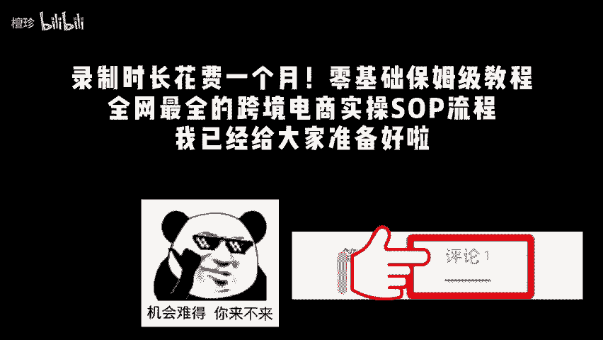
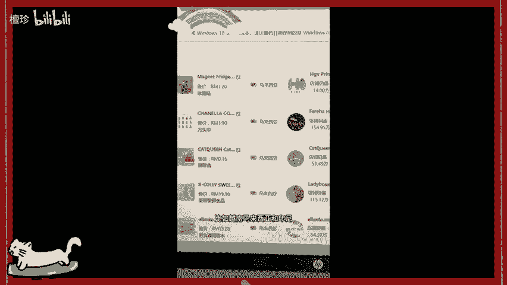
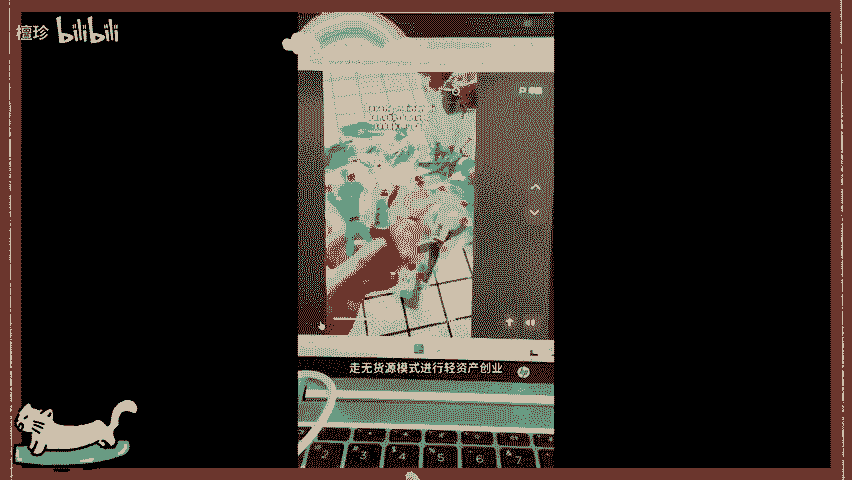
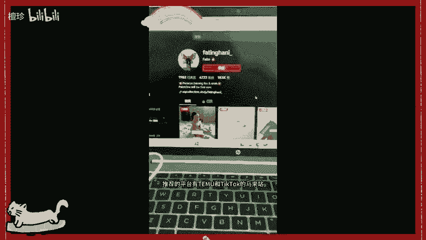
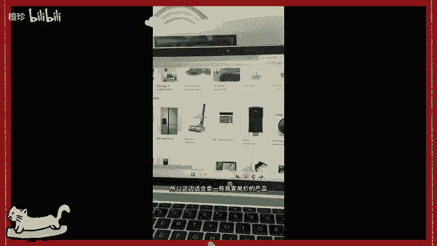
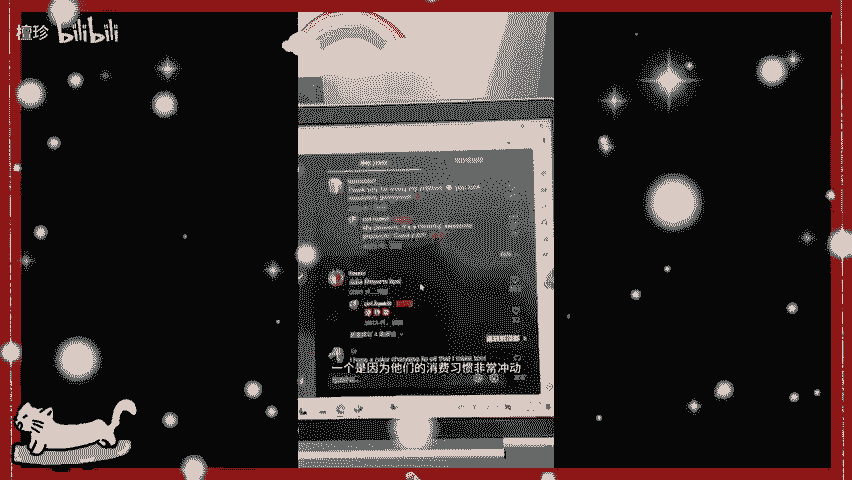
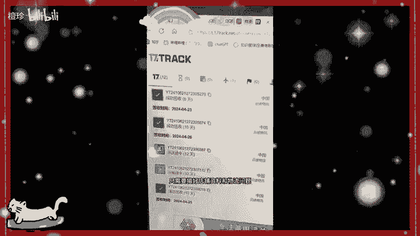

# 【TikTok跨境电商运营教程】整整1000集，花了3W买来的TikT运营课程！呕心沥血700小时从入门-运营-店铺-物流，涵盖市面所有教程，还学不会你来找我！ - P1 - 檀珍 - BV13Sxge6EGc

🎼人生一定要赌。🎼仪定品hello，这里是跨境小安起床先来看一下店铺的情况。之前上架的麦克风已经赚了1000多刀。那么今天我们来谈一下2024年到底还有什么国家值得入局跨境电商。

第一个录制时长花费一个月，零基础保姆级教程，全网最全的跨境电商实操s流程，我已经给大家准备好了。点击评论区置顶即可找我领取东南亚，比如越南、马来西亚和印尼，这也是最热门的跨境选择。

小白可以先从东南亚入手，走无货源模式进行轻资产创业，推荐的平台有tium和ttok的马来站泰国站。第二个，中东尤其是沙特阿拉伯和阿联酋地区，大家应该对中东富豪的消费能力有所耳闻。

所以这边适合卖一些高客单价的产品。比如珍珠或者是水晶等等。主要的平台是亚马逊和moon。最后一个呢就是我选择的欧美地区，一个是因为他们的消费习惯非常冲动，配合ttok病毒是。

🎼传播一个短短十几秒的视频就可以打爆一个品，也非常适合英美的瘤子来做，只需要搞考店铺资料和物流问题，即可上手开干。现在个人做跨境电商的人，可以说是一抓一大堆，一大堆小白进入外贸公司之后。

工作半年或者一年以后辞职就回家单干了。老板给的少，自己也知道怎么样运营。为什么不自己做呢？不过也有很多自己创业失败的例子，没有考虑资金周转，也没有能力承担退货风险。

更熬不过前期新店需要上新而很难出单等风险，感觉做不下去了，每天都没有收入而选择放弃。😊。

🎼这都是很现实的问题。😊，🎼所以那些和我说要精细化运营的，我是真听不进，我能坚持头3个月都不错了。现在店铺逐渐的稳定，碰到问题也能解决好，真的多亏了自己的主动学习，不打算报。😊，🎼所以自己多看多听多问。

踩过坑也亏过。😊，🎼慢慢就能筛选出一套自己的学习方法和经验，内容有点多，需要的三连暴走，包含跨境电商平台分析及选择。😊，🎼新手开店流程及准备资料。新手如何选择类目和产品店铺起店及运营思路。

新品推广及广告打罚等。😊，🎼希望对大家有帮助，关注我，我们一起掏空洋人的钱包。