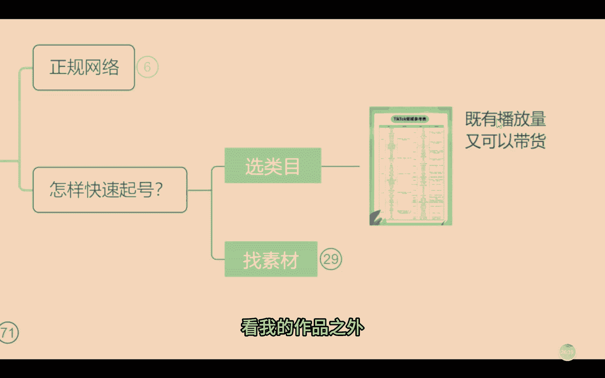
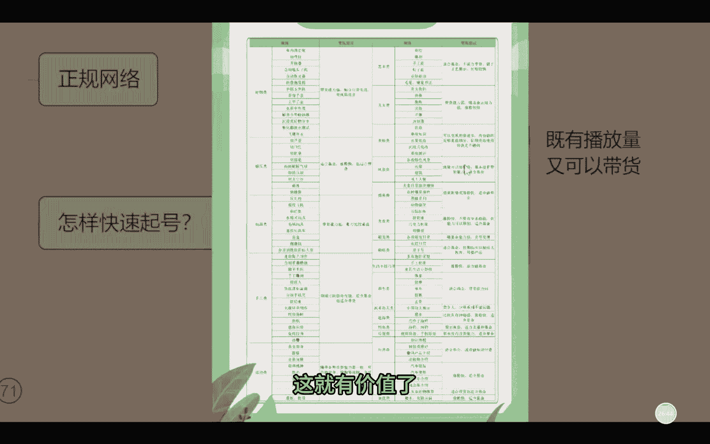
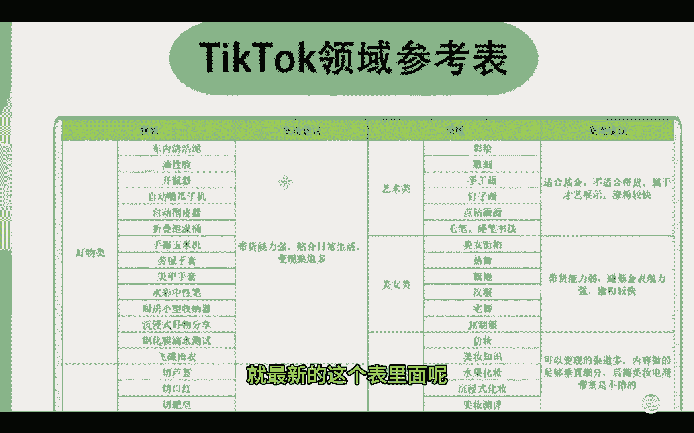
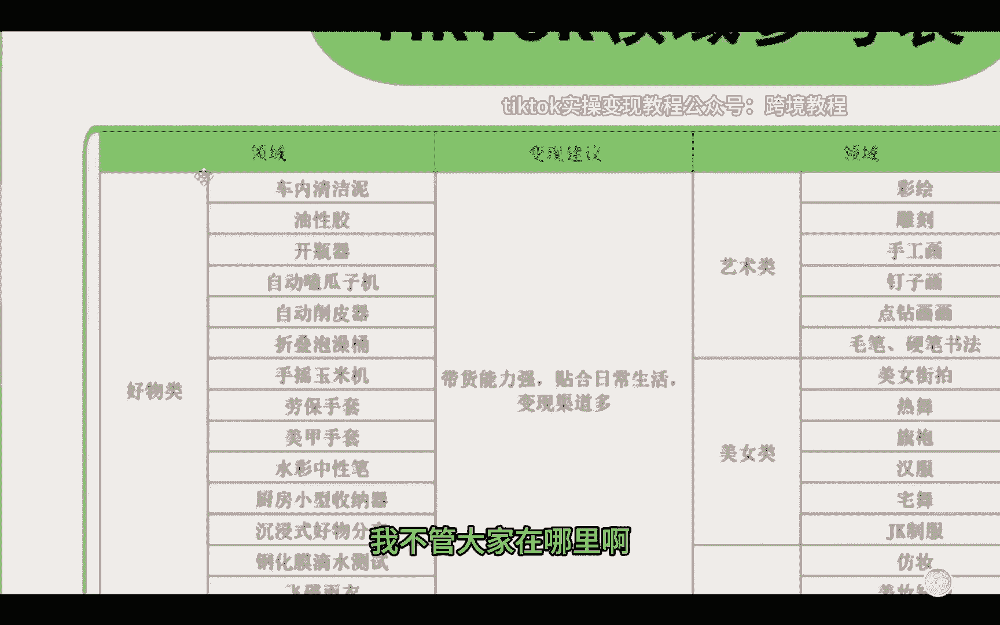
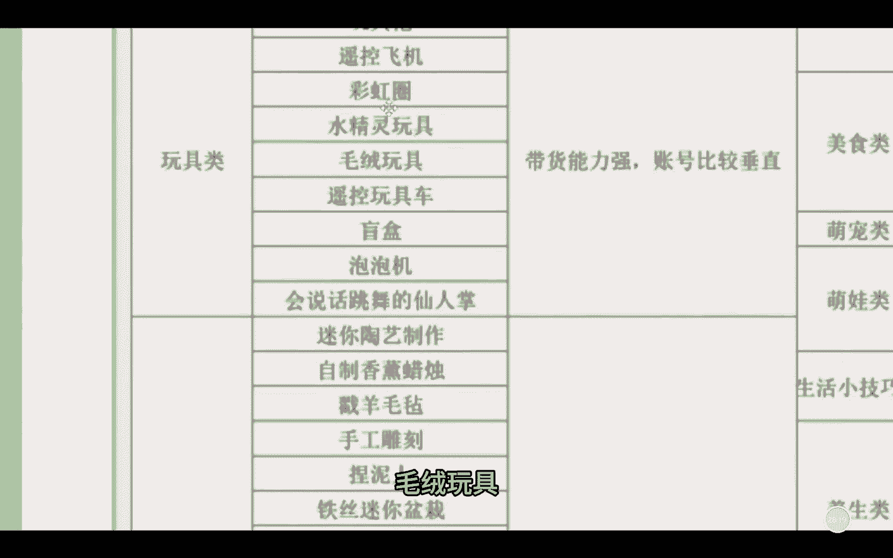
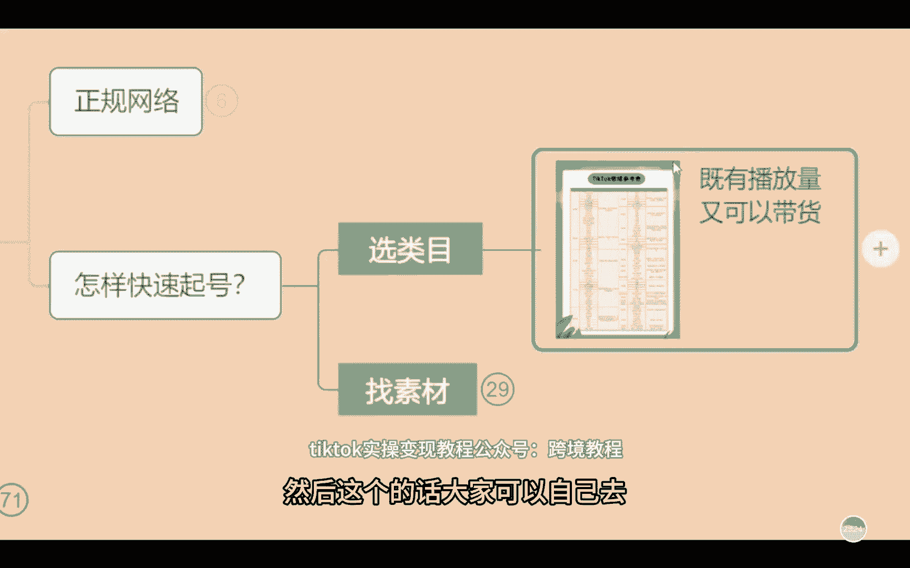

# 【tiktok怎么快速起号】海外抖音tiktok从0到1，保姆级教程，全网最全最新入门实操变现教程 - P1 - 芒果自媒体 - BV181gaeZEzD

接下来怎么样快速来起号，就是我们发什么作品更容易火嗯，更容易有流量，是不是我跟大家讲考虑两个点啊，很现实的，第一点，我发作品，这个作品喜欢的人多不多看，爱看的人多不多，对不对。

同时我除了能够让这些人喜欢看我的作品之外。

我还得能带货啊，我还能卖货，这就有价值了。

是不是来这个领域参考表，如果说有需要的话，我们公屏上也可以去扣一个要字啊，这个参考表呢是TIKTO的运营，我们上个礼拜刚拿的一个新的表，就最新的这个表里面呢是这个平台。

现在缺的内容就是是这样的啊，因为平台他要做一个等于等于说什么呢，这个百花齐放这样的一个意思啊，就是他不希望说整个品牌全是黑丝对吧，这个男生爱看黑丝啊，你都去发，爱看这个不穿衣服的美女，大家都发美女。

那没有意义的，现代平台要走走什么路线，要走商业化价值的路线，我跟大家讲，我真是推荐大家以后你们就看什么能带货，你就卖什么，你就去做什么类型账号呃，我们就拿这个天道的野心来讲啊。

你看现在国内抖音他是不是已经让这个淘宝，让拼多多，让京东黯然失色了，很多人都开始在抖音买东西了，是不是抖音直播做的风生水起的，那么海外抖音，他也希望未来，去取代所有的海外的传统的购物平台，是这样的啊。

所以说做这个带货是比较好的啊，做带货是比较好的，我不管大家在哪里啊。

你无论在哪个地区，任何国家咱们都能做都可以做啊，来我给大家举个例子，你看这里面写的很详细，车内清洁，你是不是油性胶在马来地区做呃，这个车内的一个饰品是最好卖的，我们有学生就是新手嘛，刚上手20天左右。

然后卖了1万多块钱的货，利润的话有个7000多啊，利润有7000多块钱，你想一下是不是就很好做啊，就现在水彩中性笔，因为现在有流量扶持，解压类，切肥皂，切眉笔，玩具类毛绒玩具。

水晶类玩具啊，你们下了课自己去看一下啊，下了课咱们自己去看一下啊，然后这个的话大家可以自己去自己去分析一下。

